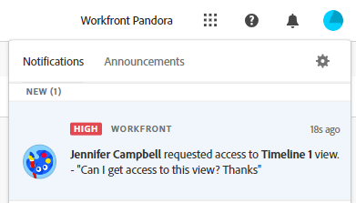

<!-- take the Remove permissions section out, at the end - this is what Lilit said: Because of "Everyone in the workspace can view" wildcard, currently it's not possible to entirely remove access to a record type. Let's take out this section. -->

# 共用記錄型別

此頁面上的資訊是指尚未普遍提供的功能。 它僅在預覽環境中可供所有客戶使用。 每月發行至生產環境後，生產環境中為啟用快速發行的客戶也提供相同的功能。

如需快速發行資訊，請參閱[為您的組織啟用或停用快速發行](/help/quicksilver/administration-and-setup/set-up-workfront/configure-system-defaults/enable-fast-release-process.md)。

{{planning-important-intro}}

您可以在Adobe Workfront Planning中處理記錄時，與其他人共用記錄型別以確保共同作業。

>[!IMPORTANT]
>
>有權存取工作區的使用者至少會自動取得工作區中所有記錄型別的檢視許可權。
>共用檢視未授予使用者記錄型別的許可權。 只有共用工作區才能授予使用者記錄型別的許可權。
>
>* 如需在Workfront Planning中共用物件的一般資訊，另請參閱[在Adobe Workfront Planning中共用許可權概觀](/help/quicksilver/planning/access/sharing-permissions-overview.md)。
>* 如需詳細資訊，請參閱本文中的[共用記錄型別](#considerations-when-sharing-record-types)時的考量事項。

## 存取需求

+++ 展開以檢視存取需求。

<!--at GA, check that the Workfront plans article linked below has Planning info-->

您必須具有下列存取權才能執行本文中的步驟：

<table style="table-layout:auto"> 
<col> 
</col> 
<col> 
</col> 
<tbody> 
    <tr> 
<tr> 
<td> 
   
 產品
 </td> 
   <td> 
   <ul><li>
 Adobe Workfront
</li> 
   <li>
 Adobe Workfront規劃
</li></ul></td> 
  </tr>   
<tr> 
   <td role="rowheader">
Adobe Workfront計畫*
</td> 
   <td> 

下列任一Workfront計畫：
 
<ul><li>選取</li> 
<li>Prime</li> 
<li>Ultimate</li></ul> 

工作前台計劃不適用於舊版工作前台計劃
 
   </td> 
<tr> 
   <td role="rowheader">
Adobe Systems 工作前端規劃包*
</td> 
   <td> 

任何 
 

有關每個工作前端計劃中包含的內容的詳細信息，請聯繫您的工作前台客戶經理。 
 
   </td> 
 <tr> 
   <td role="rowheader">
Adobe Systems 工作面板平臺
</td> 
   <td> 

組織的 Workfront 執行個體必須加入 Adobe Systems 統一體驗，才能訪問 Workfront 計劃的所有功能。
 

您的組織必須加入 Adobe Systems 統一體驗，使用者才能從權限請求請求並授予對視圖的許可權。 

有關詳細資訊，請參閱 <a href="/help/quicksilver/workfront-basics/navigate-workfront/workfront-navigation/adobe-unified-experience.md">Adobe Systems Workfront</a> 的統一體驗。 
 
   </td> 
   </tr> 
  </tr> 
  <tr> 
   <td role="rowheader">
Adobe Systems Workfront 許可證*
</td> 
   <td>
 標準

   
Workfront Planning 不適用於舊版 Workfront 許可證
 
  </td> 
  </tr> 
  <tr> 
   <td role="rowheader">
存取層級組態
</td> 
   <td> 
沒有適用於Adobe Systems前台規劃的訪問級別控件
   
</td> 
  </tr> 
<tr> 
   <td role="rowheader">
物件許可權
</td> 
   <td>  
管理記錄型別的許可權
  
   
只有對工作環境具有管理許可權的使用者才能共享對記錄類型的管理許可權
</td> 
  </tr> 
<tr> 
   <td role="rowheader">
版面配置範本
</td> 
   <td> 
必須為所有使用者（包括 Workfront 管理員）分配一個佈局範本，該佈局在主功能表中包含“計劃”區域。 
 </td> 
  </tr> 
</tbody> 
</table>

*有關 Workfront 訪問要求的詳細資訊，請參閱 [Workfront 文檔中](/help/quicksilver/administration-and-setup/add-users/access-levels-and-object-permissions/access-level-requirements-in-documentation.md)的訪問要求。

+++

<!--replace the layout template info in the table with this at release: 

In the Production environment, all users including the System Administrators must be assigned to a layout template that includes the Planning areas.

In the Preview environment, Standard users and System Administrators have the Planning area enabled by default.

-->

## 共用記錄類型時的注意事項

* 默認情況下，向工作環境授予許可權會授予使用者對工作環境中的記錄類型的相同許可權。

  此外，您可以調整個別記錄型別的許可權。

  不過，您無法授予人員比其對工作區的許可權更高的許可權來使用記錄型別。
* 您可以授予使用者比他們在工作區上更低的記錄型別許可權。 例如，他們可以擁有工作區的貢獻許可權，以及記錄型別的檢視許可權。
* 擁有工作區之「管理」許可權的人，一律保留對工作區中所有記錄型別的「管理」存取權。 即使已關閉繼承許可權，其記錄型別的許可權也無法降低。

* 目前，當您共用記錄型別時，可以達成下列目標：

   * 當您首次與用戶共享記錄類型並且他們對工作環境沒有任何許可權時，向他們授予對工作環境的檢視許可權。

     這也賦予了他們對工作環境中所有記錄類型的檢視許可權。

     當您授予他們對記錄類型的許可權時，共用框中會指示他們也已添加到工作環境中。
   * 禁用「繼承的許可權」時，將記錄類型設置為僅視圖工作環境中的所有人（工作環境經理除外）。

     對工作環境具有“管理”許可權的用戶始終對記錄類型具有“管理”許可權，平均關閉記錄類型的“繼承許可權”時也是如此。
   * 將人們的權限降低到記錄類型。 您不能將某人的權限從他們工作環境上的記錄類型增加。

     例如，如果某人Contribute權限到工作環境，您可以將其權限更改為要檢視的特定記錄類型。 但是，如果他們對工作環境具有檢視權限，則不能授予他們對任何記錄類型的Contribute權限。

* 無法刪除工作環境中的人員對記錄類型的訪問許可權。 如果每個人對工作環境具有至少 檢視 許可權，則他們始終對所有記錄類型具有至少 檢視 權限。

* 您可以在內部與以下實體共享記錄類型：

  Workfront使用者、群組、團隊、公司和職位角色
* 您無法從外部與Workfront外部的使用者共用記錄型別。
* 若要將工作區許可權不高於記錄型別檢視許可權的使用者授予記錄型別，您必須先以高於檢視的許可權與他們共用工作區。 工作區的較高許可權將套用至記錄型別。

## 共用記錄型別的許可權

如果您有工作區的管理許可權，您可以調整工作區的個別記錄型別的許可權。

{{step1-to-planning}}

1. 開啟您要共用其記錄型別的工作區，然後按一下記錄型別卡片。

   這會開啟記錄型別頁面。

1. 從任何檢視的索引標籤，按一下記錄型別右上角的&#x200B;**共用**。

   **共用**&#x200B;方塊開啟。

   

1. （選擇性）在&#x200B;**擁有存取權**&#x200B;區域中，預設會選取&#x200B;**工作區中的每個人都可以檢視**&#x200B;選項。  對工作區具有「檢視」或更高許可權的所有使用者都可以檢視記錄型別。

1. （選擇性）按一下&#x200B;**繼承的許可權**&#x200B;選項下的使用者人數，以檢視從工作區繼承許可權的使用者、團隊、群組、公司或工作角色。

   >[!TIP]
   >
   >您無法從繼承的許可權清單中移除個別實體。

1. （選擇性和條件性）如果您想要與特定實體共用記錄型別，並授予他們不同於工作區現有的記錄型別存取權，請執行以下操作：

   1. 從&#x200B;**繼承許可權**&#x200B;下拉式功能表中選取&#x200B;**停用**。

   >[!TIP]
   >
   >Workspace管理員繼續擁有該記錄型別的管理許可權。

   1. 在&#x200B;**授與此記錄型別**&#x200B;的存取權欄位中，新增您想要授與不同於工作區之許可權等級的使用者、團隊、群組、公司或工作角色。
   1. 選擇許可權層級。

   >[!IMPORTANT]
   >
   >* 除了團隊、群組、公司和職務角色之外，您只能與已新增至Adobe Admin Console的使用者共用。
   >* 您永遠都不能授予使用者比他們在工作區上更大的記錄型別許可權。
   >* 如果使用者擁有工作區的「管理」許可權，則您無法授予比「管理」更小的使用者記錄型別許可權。
   >* 如果使用者對記錄類型具有Contribute許可權，則可以為使用者提供對記錄類型的較低權限工作環境。
   > 有關詳細資訊，請參閱 [Adobe Systems前端規劃](/help/quicksilver/planning/access/sharing-permissions-overview.md)中的共用許可權概述。

1. 若要授予對工作環境無權訪問視圖記錄類型的使用者，請在“ **授予對此視圖** 的訪問許可權”字段中，開始鍵入用戶、群組、團隊、公司或作業角色的名稱，然後在清單中顯示時單擊它。

   您選擇的實體將添加到記錄類型和具有檢視&#x200B;**許可權的工作環境**&#x200B;中。

   系統管理員始終會收到與他們共用的記錄類型的管理許可權，並且有跡象表明用戶是系統管理員。

1. （選擇）按兩下複製連結&#x200B;**，**&#x200B;將記錄類型的連結複製到您的剪貼簿並與他人共用。
1. 按一下「**儲存**」。

   記錄類型現在與其他用戶共用。

1. 與他人共享複製的連結。 接收連結的用戶必須是活動用戶並登錄到 Workfront 才能訪問記錄類型頁面並在所選視圖中顯示。 他們必須對記錄類型具有許可權才能對其進行視圖。

## 拿掉記錄類型的許可權

您可以從記錄類型中刪除使用者的許可權。 但是，他們將保留對工作環境的至少 視圖 訪問許可權，這使他們有權至少視圖記錄類型。 如果您希望他們對工作環境中的記錄類型沒有許可權，則必須從工作環境中刪除他們的訪問許可權。

{{step1-to-planning}}

1. 打開要停止共用其記錄類型的工作環境，然後按下卡片記錄類型。 這將打開記錄類型頁面。

1. 從任何檢視的索引標籤，按一下記錄型別右上角的&#x200B;**共用**。

   **共用**&#x200B;方塊開啟。
1. 找到要刪除其許可權的用戶、群組、團隊、公司或作業角色，展開其名稱右側的許可權下拉功能表，然後單擊 **移除**。 <!--check the screen shot below - the UI text for View might not be accurate-->

   

1. 按一下「**儲存**」。

   使用者不再具有記錄類型的指示許可權。 但是，他們仍然有權訪問工作環境，除非您同時將其從工作環境許可權中刪除。

   對於已從訪問許可權中刪除的使用者，如果不再具有此訪問許可權視圖，則不會通知。

<!-- This is not working yet: *************************** edit this before publishing, because this was not tested with record types - this section came from sharing views *******************: 

## Grant permissions to a record type from a permission request

Users who access a link to a record type to which they do not have permissions can request permissions to the record type. All users with Manage permissions to the view receive the permission request and can grant or deny the permissions. 

1. (Conditional) If you are are the manager of a view, you might receive a request from another user to access the view in the following areas:
   
   * An in-app notification
      
   * An email notification
      
1. (Conditional) From the notification area in Workfront, click the in-app notification
   Or
   From the email notification, click **View all notifications**, then click the notification in the list.

   The **Pending access requests** box displays. 

      
1. (Optional) For the user whose permissions you want to approve, select one of the following options from the drop-down menu to the right of the user's name: 
   * **View**
   * **Manage**
1. Select the user for whom you want to approve or deny the permission, then click **Approve all** or **Deny all**. 
1. Click the left-pointing arrow to the left of **Pending access requests**, then click **Save**.

   If you approved the request, the users are added to the sharing box of the view. The user requesting the permission receives an email confirmation that their request was approved. <!--will they also get an in-app notification??-->

