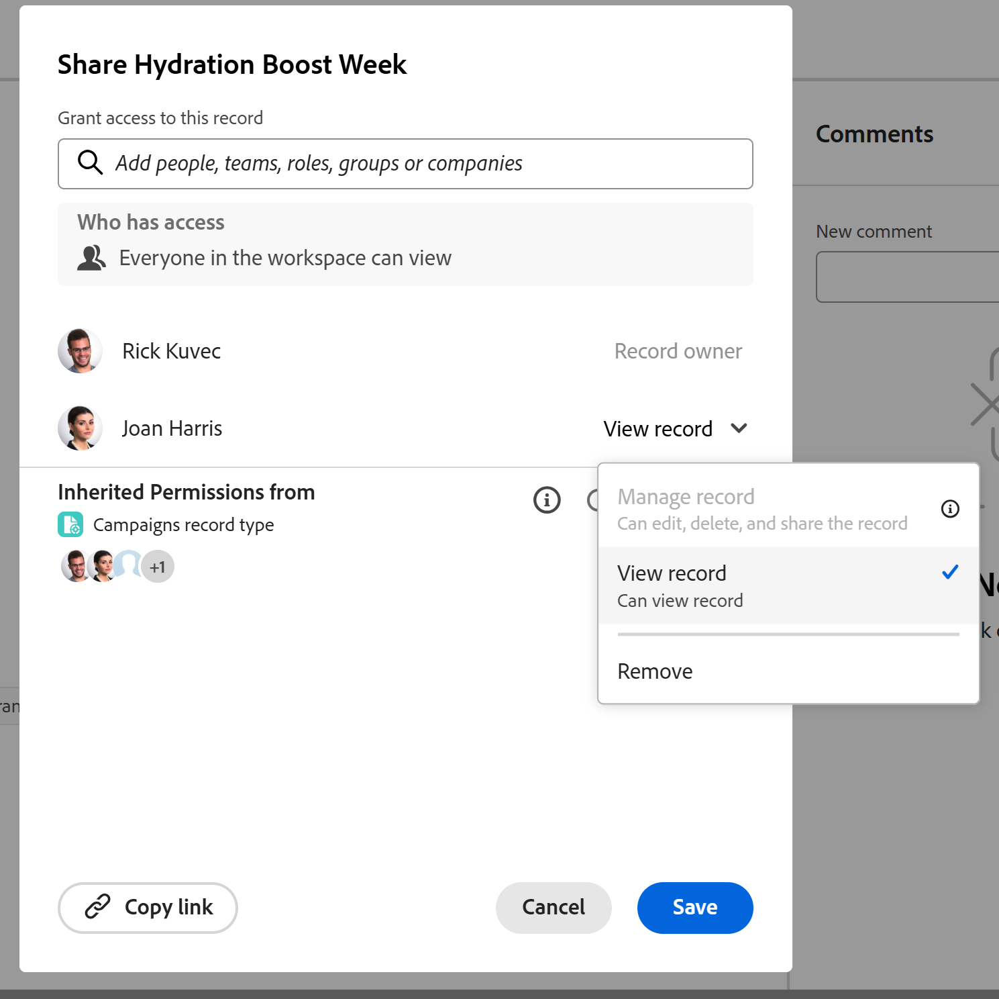

<!--update metadata with real information at release-->

# 共用記錄

<!--
this will NOT be available in Preview ever - find a way to add this in this article that is prominent
-->

此頁面上的資訊是指尚未普遍提供的功能。 它僅在預覽環境中可供所有客戶使用。 在「預覽」版發行後，啟用的客戶每月可在「生產」環境中使用相同的功能。\
如需快速發行資訊，請參閱[為您的組織啟用或停用快速發行](/help/quicksilver/administration-and-setup/set-up-workfront/configure-system-defaults/enable-fast-release-process.md)。

{{planning-important-intro}}

您可以在Adobe Workfront Planning中調整人員對記錄型別中個別記錄的許可權。

您可以透過下列方式共用Adobe Workfront Planning記錄：

* 共用記錄的連結。

  如需詳細資訊，請參閱[使用連結](/help/quicksilver/planning/records/share-records.md)共用記錄。

* 透過共用工作區和記錄型別，與其他使用者共用工作區中的所有記錄。

  如需詳細資訊，請參閱下列文章：

   * [共用工作區](/help/quicksilver/planning/access/share-workspaces.md)

   * [共用記錄型別](/help/quicksilver/planning/access/share-record-types.md)

* 使用&#x200B;**共用**&#x200B;選項，共用個別記錄或大量共用多個記錄。

  本文說明如何使用&#x200B;**共用**&#x200B;選項與其他人共用記錄。

>[!IMPORTANT]
>
>* 有權存取工作區的使用者至少會自動取得對工作區中所有記錄的檢視許可權。
>* 共用檢視不會提供使用者記錄許可權。 只有共用工作區才能授予使用者記錄型別和記錄的許可權。
>
>如需在Workfront Planning中共用物件的一般資訊，另請參閱[在Adobe Workfront Planning中共用許可權概觀](/help/quicksilver/planning/access/sharing-permissions-overview.md)。

## 存取權要求

+++ 展開以檢視這篇文章中所述功能的存取權要求。 

<!--
at GA, check that the Workfront plans article linked below has Planning info
-->

<table style="table-layout:auto"> 
<col> 
</col> 
<col> 
</col> 
<tbody> 
    <tr> 
<tr> 
   <td role="rowheader">
Adobe Workfront 封裝
</td> 
   <td> 

具有Planning套件的任何Workfront或工作流程
 
或

任何Workfront Planning作為獨立產品套件
 
 </tr>

<tr> 
   <td role="rowheader">
Adobe Workfront授權
</td> 
   <td>
任何
 
   
<b>附註</b>

   
只有具有Standard授權的使用者才能被授與記錄的「管理」許可權。 所有其他授權只能具有「檢視」許可權，而且這些授權的「管理」選項會變暗。

  </td> 
  </tr> 
  <tr> 
   <td role="rowheader">
物件許可權
</td> 
   <td>  
管理工作區、記錄型別和記錄的許可權
  
   
<b>重要</b>

   
只有對工作區具有管理許可權的使用者才能共用記錄
</td> 
  </tr>
</tbody> 
</table>

如需詳細資訊，請參閱Workfront檔案中的[存取需求](/help/quicksilver/administration-and-setup/add-users/access-levels-and-object-permissions/access-level-requirements-in-documentation.md)。

+++

## 共用記錄時的注意事項

<!--
maybe use the Share record types as example here and touch on the same points: help/quicksilver/planning/access/share-record-types.md; in addition to using Lilit's information
-->

<!--checking on the below with Lilit-->

* 您可以與下列實體共用記錄：人員、群組、團隊、公司或職務角色。
* 下列限制存在：

   * 您無法一次共用超過100筆記錄。
   * 您無法與超過100個實體共用記錄。
* 如果您限制記錄的許可權，則使用者不會再在顯示該記錄的系統中的任何位置檢視該記錄及其查閱欄位的值。
* Workfront會檢查最多5筆記錄深層連線的記錄許可權，確保使用者只會看到與他們共用的記錄。
* 您可以授予記錄的下列許可權層級：

   * 檢視
   * 管理
* 當您與使用者共用工作區和記錄型別時，預設情況下，他們也會收到工作區中記錄的相同許可權。
當使用者擁有工作區或記錄型別的貢獻許可權時，他們將獲得該記錄型別的記錄的管理許可權。
* 當您從工作區中移除實體時，所有共用許可權都會從記錄型別及其中的所有記錄中移除。
* 您無法與沒有工作區或記錄型別許可權的使用者共用記錄。

  如果您與不在工作區中的人員共用記錄，系統會自動將他們新增至工作區。
* 使用者對記錄的存取權取決於以下3個設定的組合：

   * 其許可權繼承自記錄型別和工作區
   * 在記錄共用方塊中個別新增許可權
   * 工作區中的&#x200B;**每個人都可以檢視**&#x200B;設定。

     這可讓工作區中的每個人檢視記錄

     <!--
      Cannot do this on a record: 
      * **Only invited people can access**: This is selected by default and allows restricting access to the record to specific people. 
      -->

* 當您與使用者共用記錄時，預設會以與記錄型別相同的許可權新增使用者。

  例如：

   * 如果他們擁有記錄型別的檢視許可權，他們將獲得記錄的檢視許可權
   * 如果他們擁有記錄型別的「貢獻」或「管理」許可權，他們將獲得記錄的「管理」許可權

* 當使用者具有工作區的「管理」或「貢獻」許可權以及記錄型別，並且您將其新增到記錄許可權時，檢視許可權將暗顯。 他們保留對記錄的相同許可權，就像對記錄型別一樣，並且您不能授予他們較低的記錄許可權。

* 您可以停用單一記錄的繼承許可權，在此情況下，您可以為選取的使用者授予個別記錄的許可權，或者如果他們屬於工作區，則可獲得許可權，因為&#x200B;**工作區中的所有人都可以檢視**&#x200B;選項。

* 如果同一個使用者套用多個共用許可權，這些使用者會收到這些許可權的最高層級。

  例如，如果記錄與具有檢視許可權的使用者共用，並且其群組具有管理存取權，則他們會獲得該記錄的管理許可權。

* 如果所連線記錄的公式欄位或查閱欄位是以您沒有許可權的記錄欄位為基礎的，您將看到正確的計算，其中哪些是您無法以其他方式存取的記錄因素。

  <!--
   Not possible: 
   * As a workspace manager, you can share a record with a user that does not have permissions to the record type or the workspace. In this case, there is a warning next to the added entity notifying you that they don't have access to the workspace or the record type.  You can continue adding the user to the record which will also add them to the record type and workspace, or cancel the sharing.
   -->

  <!--
   ensure this is this way, because in devtest the warning only shows record type, but logged a bug to add "workspace" to the warning too
   -->

<!--
Lilit is checking on this, it is not working correctly
-->

<!--
   check on this: I cannot disable inherited permissions when this setting is ON and this documented in a TIP below: When they have View permissions to the workspace or the record type, they retain View permissions to the records. You can grant them Manage permissions to the record by disabling Inherited permissions and selecting the Only invited people can access setting.
   -->

<!-- 
   not sure what this means, confusing, hiding for now: * If you don't have permissions to add people to the workspace, you will only see and add users, teams, groups, roles, and companies that are already added to the workspace. You cannot add any other entity that is not already part of the workspace.
   -->

<!--
   Too granular??
   If the inheritance has not been disabled, the user gets the maximum of inherited+individual+wildcard access 
   If the inherited permissions are disabled, the user gets the maximum of wildcard+individual permissions 
   -->

<!--
   not sure if any of the Share record types points might match here - ask Lilit??
   -->

## 共用記錄

身為工作區管理員，您可以調整個別記錄的許可權。

{{step1-to-planning}}

1. 開啟工作區，然後開啟要共用其記錄的記錄型別。

1. 執行下列其中一項：

   * 在資料表檢視中，暫留在記錄名稱上，按一下&#x200B;**更多**&#x200B;功能表，然後按一下&#x200B;**共用**。
   * 從表格檢視中，選取一或多個記錄，然後按一下清單底部藍色工具列上的&#x200B;**共用**。
   * 從任何檢視中，按一下記錄名稱，然後按一下記錄詳細資訊頁面右上角的&#x200B;**共用**。

   **共用**&#x200B;方塊開啟。

   上的許可權

   >[!WARNING]
   >
   >您無法與新增至不同工作區的記錄共用許可權。 當您大量共用記錄時，必須在相同的工作區中建立所有記錄。

1. （選擇性）在&#x200B;**擁有存取權**&#x200B;區域中，預設會選取&#x200B;**工作區中的每個人都可以檢視**&#x200B;選項。  對工作區和記錄型別具有&#x200B;**檢視**&#x200B;或更高許可權的所有使用者都擁有對記錄的相同許可權。

1. （可選）按一下「**繼承自**&#x200B;的許可權」選項下的使用者頭像，以檢視從工作區繼承許可權的使用者、團隊、群組、公司或工作角色。<!--logged bug to move "Permissions" to lowercase-->

   當您展開繼承的許可權時，會顯示使用者對記錄型別的許可權。

   >[!TIP]
   >
   >您無法從繼承的許可權清單中移除個別實體。 列出來自團隊、群組、公司或工作角色的使用者，而不是與他們共用工作區和記錄型別時他們關聯的實體。

1. （選擇性和條件性）如果您想要與特定實體共用記錄，並授予他們不同於工作區現有記錄型別的不同存取權，請執行以下操作：

   1. 從&#x200B;**繼承許可權**&#x200B;中取消選取&#x200B;**開啟**&#x200B;選項。 預設會選取此選項。

      選項變更為&#x200B;**已關閉**。

      >[!TIP]
      >
      >Workspace管理員和記錄建立者仍擁有記錄型別和記錄的管理許可權。

      <!-- 
      This is no longer possible for a record: 
      (Optional) Select **Only invited people can access** from the **Who has access** area. You must indicate individual users, groups, teams, or companies to share the records with. 
      >[!TIP]
      >
      >You cannot disable or enable Inherited permissions when this setting is selected.
      -->

   1. 在&#x200B;**授予此記錄的存取權**&#x200B;欄位中，新增您要授予不同於工作區或記錄型別之許可權等級的使用者、團隊、群組、公司或工作角色。

      當您和使用者共用記錄時，他們的主要工作角色和電子郵件也會顯示在欄位中。 您必須為存取層級中的Users物件啟用[檢視連絡人資訊]設定，才能檢視使用者的電子郵件。

   1. 選擇下列其中一個許可權層級：

      * 檢視
      * 管理

      >[!IMPORTANT]
      >
      >* 如果使用者擁有工作區和記錄型別的「貢獻」或「管理」許可權，您可以授予他們記錄的「管理」許可權。 檢視許可權會變暗。
      >* 如果使用者擁有記錄型別的Contribute或更高許可權，則您無法授予他們較低許可權存取記錄。
      >如需詳細資訊，請參閱[在Adobe Workfront Planning中共用許可權的總覽](/help/quicksilver/planning/access/sharing-permissions-overview.md)。
      >* 您無法向不在工作區中的使用者授予許可權。 無權存取工作區和記錄型別的使用者無法存取任何記錄。

   <!--   
   Not possible:
   1. To give users who do not have permissions to the workspace access to view a record, in the **Grant access to this view** field, start typing the name of a user, a group, team, company, or job role, then click it when it displays in the list. 
      The entity you selected is added to the record and also to the record type and the workspace with **View** permissions. 
      System administrators always receive Manage permissions to records shared with them, and there is an indication that a user is a System administrator.
   -->

1. （選擇性）按一下&#x200B;**複製連結**&#x200B;以將記錄的連結複製到剪貼簿，並與他人共用。 該連結將開啟記錄的詳細資訊頁面。
1. 按一下「**儲存**」。

   記錄現在已與其他使用者共用。

   您共用記錄的使用者會收到有關已獲得記錄許可權的應用程式內通知和電子郵件通知。

   <!--
   not possible anymore: 
   * The record
   * The record type, if they never had permissions before
   * The workspace, if they had not had permissions to the workspace before the record was shared with them.
   -->

   如需詳細資訊，請參閱[Adobe Workfront規劃通知：文章索引](/help/quicksilver/planning/notifications/notifications-information.md)。

1. （選用）將複製的連結與其他人共用。

   收到連結的使用者必須是作用中使用者，並登入Workfront，才能存取記錄型別頁面並在選取的檢視中顯示該頁面。

   使用者必須具有記錄型別的許可權才能檢視該記錄型別。

   如需詳細資訊，另請參閱[使用連結](/help/quicksilver/planning/records/share-records.md)共用記錄。

## 移除記錄的許可權

您可以從記錄中移除使用者的許可權。 但他們將保留工作區的至少檢視許可權，這也會授予他們記錄型別的至少檢視許可權。

如果您希望他們沒有工作區中記錄型別或記錄的許可權，則必須從工作區中移除其存取權。

您無法從繼承的許可權中移除使用者。

{{step1-to-planning}}

1. 開啟您要停止共用其記錄的工作區，然後按一下記錄型別卡。 這會開啟記錄型別頁面。
1. 執行下列其中一項：

   * 在資料表檢視中，暫留在記錄名稱上，按一下&#x200B;**更多**&#x200B;功能表，然後按一下&#x200B;**共用**。
   * 從表格檢視中，選取一或多個記錄，然後按一下清單底部藍色工具列上的&#x200B;**共用**。

     您必須選取在相同工作區中建立的記錄。
   * 從任何檢視中，按一下記錄名稱，然後按一下記錄詳細資訊頁面右上角的&#x200B;**共用**。

   **共用**&#x200B;方塊開啟。
1. 尋找您要移除其許可權的使用者、群組、團隊、公司或工作角色，展開其名稱右側的許可權下拉式功能表，然後按一下&#x200B;**移除**。

   

1. 按一下「**儲存**」。

   人員不再具有指定的記錄許可權。 但是，他們仍擁有記錄型別和工作區的許可權，除非您也將他們從這些許可權中移除。

   對於已從存取記錄中移除的使用者，不會通知他們不再擁有這些許可權。
