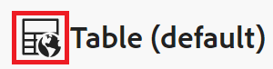

# 共用檢視

本頁醒目提示的資訊指出尚未普遍可用的功能。 它僅在預覽環境中可供所有客戶使用。 每月發行至生產環境後，生產環境中為啟用快速發行的客戶也提供相同的功能。

如需快速發行資訊，請參閱[為您的組織啟用或停用快速發行](/help/quicksilver/administration-and-setup/set-up-workfront/configure-system-defaults/enable-fast-release-process.md)。

{{planning-important-intro}}

您可以在Adobe Workfront Planning中處理記錄時，與其他人共用檢視以確保共同作業。

>[!IMPORTANT]
>
>* 授予工作區許可權不會授予其他使用者記錄型別頁面上檢視的許可權。 您必須授予記錄型別頁面中個別檢視的許可權，才能與其他使用者共用檢視。
>
>* 授予檢視的許可權不會變更檢視記錄的許可權。 記錄許可權是透過共用工作區所授與。
>
>* 當您共用檢視時，您會授予其他人存取檢視所有元素的許可權。 例如，當您將檢視的管理許可權授予他們時，他們可以修改分組、篩選、排序或長條圖外觀。

<!--
This article describes how you can share a view with others. For information about requesting, granting, or denying permissions to a view, see [Request permissions to a view or a workspace](/help/quicksilver/planning/access/request-permissions.md). -->

## 存取需求

+++ 展開以檢視存取需求。

<!--at GA, check that the Workfront plans article linked below has Planning info-->

您必須具有下列存取權才能執行本文中的步驟：

<table style="table-layout:auto"> 
<col> 
</col> 
<col> 
</col> 
<tbody> 
    <tr> 
<tr> 
<td> 
   
 產品
 </td> 
   <td> 
   <ul><li>
 Adobe Workfront
</li> 
   <li>
 Adobe Workfront規劃
</li></ul></td> 
  </tr>   
<tr> 
   <td role="rowheader">
Adobe Workfront計畫*
</td> 
   <td> 

下列任一Workfront計畫：
 
<ul><li>選取</li> 
<li>Prime</li> 
<li>Ultimate</li></ul> 

舊版Workfront計畫不提供Workfront計畫
 
   </td> 
<tr> 
   <td role="rowheader">
Adobe Workfront規劃套件*
</td> 
   <td> 

任何 
 

如需每個Workfront計畫包含內容的詳細資訊，請聯絡您的Workfront客戶經理。 
 
   </td> 
 <tr> 
   <td role="rowheader">
Adobe Workfront平台
</td> 
   <td> 

貴組織的Workfront例項必須上線至Adobe Unified Experience，才能存取Workfront Planning。
 

您的組織必須加入Adobe Unified Experience，使用者才能從許可權要求中要求並授予檢視的許可權。 

必須將使用者新增到Adobe Admin Console才能取得Workfront Planning檢視的許可權。

如需詳細資訊，請參閱<a href="/help/quicksilver/workfront-basics/navigate-workfront/workfront-navigation/adobe-unified-experience.md">適用於Workfront的Adobe Unified Experience</a>。 
 
   </td> 
   </tr> 
  </tr> 
  <tr> 
   <td role="rowheader">
Adobe Workfront授權*
</td> 
   <td>
 標準

   
Workfront計畫不適用於舊版Workfront授權
 
  </td> 
  </tr> 
  <tr> 
   <td role="rowheader">
存取層級設定
</td> 
   <td> 
Adobe Workfront Planning沒有存取層級控制
   
</td> 
  </tr> 
<tr> 
   <td role="rowheader">
物件許可權
</td> 
   <td>  
管理檢視的許可權
  
   
只有具有工作區管理許可權的使用者才能公開共用檢視。
</td> 
  </tr> 
<tr> 
   <td role="rowheader">
版面配置範本
</td> 
   <td> 
在「生產」環境中，所有使用者（包括系統管理員）都必須指派給包含Planning區域的版面配置範本。

在「預覽」環境中，「標準使用者」和「系統管理員」預設會啟用「規劃」區域。
</td> 
  </tr> 
</tbody> 
</table>

*如需Workfront存取需求的詳細資訊，請參閱Workfront檔案中的[存取需求](/help/quicksilver/administration-and-setup/add-users/access-levels-and-object-permissions/access-level-requirements-in-documentation.md)。

+++

## 共用檢視時的注意事項

* 您可以透過下列方式共用檢視：

   * 內部，具有Workfront使用者、群組、團隊、公司和職位角色
   * 公開，與Workfront以外的使用者一起
   * 複製並共用檢視的連結
   * 將其匯出為Excel或CSV檔案。 您只能將表格檢視匯出至檔案。 如需詳細資訊，請參閱[管理資料表檢視](/help/quicksilver/planning/views/manage-the-table-view.md)。

* 如需在Workfront Planning中共用物件的一般資訊，另請參閱[在Adobe Workfront Planning中共用許可權概觀](/help/quicksilver/planning/access/sharing-permissions-overview.md)。
* 您可以將檢視或管理許可權授予內部Workfront使用者。

* 具有管理許可權的使用者可以修改檢視設定、共用、複製或刪除它。

* 您可以透過公開連結與組織外部的人員共用檢視。

* 當您公開共用檢視時，公司以外的任何人只要在到期日所指示的限定時間內都可以存取連結。 不需要登入即可檢視共用檢視。

* 您組織外有權存取檢視的人員無法在檢視中建立其他檢視、編輯共用檢視，或新增、刪除或編輯記錄資訊。

## 與內部檢視共用許可權

您可以在Workfront Planning中將您建立的檢視或您擁有管理許可權的檢視與使用者、群組、團隊、公司和職位角色共用。

>[!NOTE]
>
>系統管理員無法檢視或共用他們未自行建立的檢視。 他們只能存取或共用與他們共用的檢視。
>
>系統管理員只能擁有檢視的管理許可權。

{{step1-to-planning}}

1. 開啟您要共用其檢視的工作區，然後按一下記錄型別卡片。

   這會開啟記錄型別頁面。

1. 從[檢視]索引標籤，執行下列任一項作業：

   * 暫留在您要共用的檢視表名稱上，然後按一下檢視表名稱右邊的&#x200B;**更多**&#x200B;功能表，然後按一下&#x200B;**共用**。

     檢視的其他

   * 按一下&#x200B;**共用** > **共用目前的檢視**

     ![含有記錄型別和檢視共用選項的[共用]按鈕](assets/share-button-with-record-type-and-view-sharing-options.png)

   **共用檢視**&#x200B;方塊開啟，預設應該選取&#x200B;**內部共用**&#x200B;標籤。

1. （選擇性）在&#x200B;**擁有存取權**&#x200B;區域中，從下列選項中選取：

   * **只有受邀人員才能存取**：您必須指定要與其共用檢視的使用者、群組、團隊、公司或工作角色。 這是預設選項。

     >[!NOTE]
     >
     >   除了團隊、群組、公司和職務角色之外，您只能與已新增至Adobe Admin Console的使用者共用。

   * **工作區中的所有人都可以檢視**：所有對工作區具有「檢視」或更高許可權的使用者都可以存取檢視。

1. 在&#x200B;**授與此檢視的存取權**&#x200B;欄位中，開始輸入使用者、群組、團隊、公司或工作角色的名稱，然後當它顯示在清單中時按一下它。

   

1. 從下拉式功能表中選取下列其中一個許可權等級：
   * 檢視
   * 管理

     如需許可權層級，以及使用者可針對每個層級執行的動作的相關資訊，請參閱[在Adobe Workfront Planning中共用許可權的總覽](/help/quicksilver/planning/access/sharing-permissions-overview.md)。

     系統管理員一律會獲得與其共用檢視的管理許可權。

1. 按一下「**儲存**」。

   檢視會以人員圖示更新，表示檢視現在與其他使用者共用。

   >[!TIP]
   >
   >沒有人員或全域圖示的檢視是您建立的檢視，不會與他人共用。 非共用檢視僅對您可見。

1. 與他人共用複製的連結。 收到連結的使用者必須是作用中使用者，並登入Workfront，才能存取記錄型別頁面並在選取的檢視中顯示該頁面。

## 共用許可權以公開檢視

您可以將建立的檢視或您擁有管理許可權的檢視共用給沒有Workfront授權以及可能屬於您組織外部的人員。

>[!IMPORTANT]
>
>只有具有工作區管理許可權的使用者才能公開共用工作區的檢視。

若要在Workfront Planning中公開共用檢視：

{{step1-to-planning}}

1. 開啟您要共用其檢視的工作區，然後按一下記錄型別卡片。

   這會開啟記錄型別頁面。

1. 在檢視標籤中，執行下列任一項作業：

   * 暫留在您要共用的檢視表名稱上，然後按一下檢視表名稱右邊的&#x200B;**更多**&#x200B;功能表，然後按一下&#x200B;**共用**。

   
   * 按一下&#x200B;**共用** > **共用目前的檢視**

   **共用檢視**&#x200B;方塊開啟。

1. 按一下&#x200B;**公用共用**。

   

1. 啟用&#x200B;**建立公用連結**&#x200B;設定。

   連結隨即變為可用。 此為公開連結。 共用時，擁有連結的任何人，包括組織外部的人員，都可以存取記錄型別頁面，並檢視頁面上的記錄和欄位。

1. 按一下&#x200B;**複製連結**&#x200B;圖示，將連結複製到剪貼簿。

1. 手動輸入日期，或使用&#x200B;**連結到期日**&#x200B;欄位中的行事曆來選取公開連結的到期日。 在選取的日期之後將無法存取記錄頁面檢視。

1. 按一下「**儲存**」。

   檢視會以全域圖示更新，表示檢視已公開共用。

   >[!TIP]
   >
   >沒有人員或全域圖示的檢視是您建立的檢視，不會與他人共用。 非共用檢視僅對您可見。

1. （可選）將您複製的連結貼到電子郵件、聊天訊息、檔案，或貼到Workfront註解中，以便與其他人共用。

## 複製檢視的連結

您可以將檢視的連結複製到剪貼簿，並將連結加入其他應用程式中或與其他人共用。

若要複製公開共用檢視的連結，請參閱本文中的[共用公開檢視的許可權](#share-permissions-to-a-view-publicly)一節。

本節說明如何在內部共用檢視。

>[!IMPORTANT]
>
>首先，您必須先與使用者共用檢視，然後再共用檢視的連結，使用者才能檢視檢視。

{{step1-to-planning}}

1. 開啟您要複製並共用連結之檢視的工作區，然後按一下記錄型別卡片。

   這會開啟記錄型別頁面。

1. 在檢視的標籤中，執行下列任一項作業：

   * 暫留在您要共用的檢視標籤上，然後按一下檢視名稱右邊的&#x200B;**更多**&#x200B;功能表，然後按一下&#x200B;**共用檢視**&#x200B;方塊中的&#x200B;**共用** > **複製連結**。
   * 按一下&#x200B;**共用檢視**&#x200B;方塊中的&#x200B;**共用** > **複製檢視連結** > **複製連結**。

   檢視的連結會複製到剪貼簿，而您會在畫面底部收到確認。

   您現在可以將連結貼上至其他應用程式，或傳送給其他應用程式。

## 從許可權要求授予檢視的許可權

使用者若沒有許可權存取檢視的連結，可要求該檢視的許可權。 具有檢視之「管理」許可權的所有使用者都會收到許可權要求，並可授予或拒絕許可權。

1. （視條件而定）如果您是檢視的管理員，您可能會收到其他使用者存取下列區域檢視的請求：

   * 應用程式內通知

     存取要求的應用程式內通知
   * 電子郵件通知

     存取要求的應用程式內通知
1. （視條件而定）從Workfront的通知區域，按一下應用程式內通知
或
在電子郵件通知中，按一下&#x200B;**檢視所有通知**，然後按一下清單中的通知。

   顯示&#x200B;**擱置中的存取要求**&#x200B;方塊。

   
1. （選擇性）對於您要核准其許可權的使用者，從使用者名稱右側的下拉式功能表中選取下列選項之一：
   * **檢視**
   * **管理**
1. 選取您要核准或拒絕許可權的使用者，然後按一下&#x200B;**全部核准**&#x200B;或&#x200B;**全部拒絕**。
1. 按一下&#x200B;**擱置存取要求**&#x200B;左側的向左箭頭，然後按一下&#x200B;**儲存**。

   如果您核准請求，使用者會新增至檢視的共用方塊。 請求許可權的使用者會收到一封電子郵件，確認其請求已核准。<!--will they also get an in-app notification??-->

## 移除檢視的許可權

{{step1-to-planning}}

1. 開啟您要停止共用其檢視的工作區，然後按一下記錄型別卡片。 這會開啟記錄型別頁面。
1. 從[檢視]索引標籤，執行下列其中一項作業：

   * 暫留在您要共用的檢視表名稱上，然後按一下檢視表名稱右邊的&#x200B;**更多**&#x200B;功能表，然後按一下&#x200B;**共用**。

   * 按一下&#x200B;**共用** > **共用目前的檢視**

   **共用檢視**&#x200B;方塊開啟。
1. 若要移除檢視的內部共用，請執行下列動作：

   1. 請確定已選取&#x200B;**內部共用**&#x200B;標籤。
   1. 尋找您要移除的使用者、群組、團隊、公司或工作角色，展開您共用檢視的實體名稱右邊的許可權下拉式功能表，然後按一下&#x200B;**移除**。

1. 若要移除檢視的公開共用，請執行下列動作：

   1. 按一下「**公用共用**」標籤。
   1. 取消選取&#x200B;**建立公開連結**&#x200B;選項。

1. 按一下「**儲存**」。

   人員無法再存取檢視。 對於已從存取檢視中移除的使用者，不會通知他們不再擁有此存取權。
