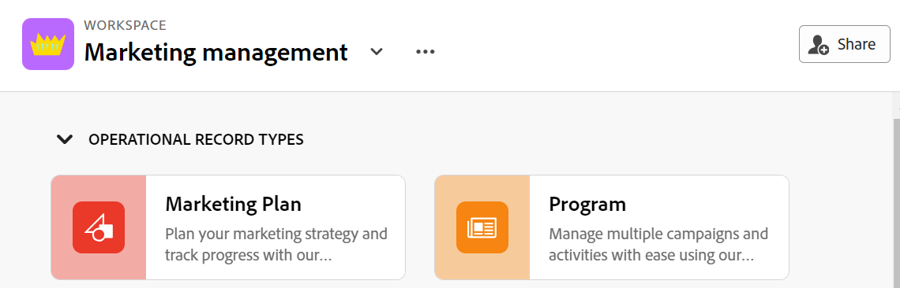

# 共用工作區

{{planning-important-intro}}

您可以與其他人共用工作區，以確保在Adobe Workfront Planning中工作時，進行共同作業。

<!--
This article describes how you can share a view with others. For information about requesting, granting, or denying permissions to a view, see [Request permissions to a view or a workspace](/help/quicksilver/planning/access/request-permissions.md). -->

>[!NOTE]
>
>授予工作區許可權不會授予其他使用者記錄型別頁面上檢視的許可權。 您必須授予記錄型別頁面中個別檢視的許可權，才能與其他使用者共用檢視。 如需詳細資訊，請參閱[共用檢視](/help/quicksilver/planning/access/share-views.md)。

## 存取需求

+++ 展開以檢視Workfront Planning的存取需求。

您必須具備下列專案才能存取Workfront Planning：

<table style="table-layout:auto"> 
<col> 
</col> 
<col> 
</col> 
<tbody> 
    <tr> 
<tr> 
<td> 
   
 產品
 </td> 
   <td> 
   <ul><li>
 Adobe Workfront
</li> 
   <li>
 Adobe Workfront規劃
</li></ul></td> 
  </tr>   
<tr> 
   <td role="rowheader">
Adobe Workfront計畫*
</td> 
   <td> 

下列任一Workfront計畫：
 
<ul><li>選取</li> 
<li>Prime</li> 
<li>Ultimate</li></ul> 

舊版Workfront計畫不提供Workfront計畫
 
   </td> 
<tr> 
   <td role="rowheader">
Adobe Workfront規劃計畫*
</td> 
   <td> 

任何 
 

如需每個Workfront Planning計畫包含哪些專案的詳細資訊，請參閱<a href="https://business.adobe.com/products/workfront/pricing.html">Adobe Workfront定價與封裝</a>。 
 
   </td> 
 <tr> 
   <td role="rowheader">
Adobe Workfront平台
</td> 
   <td> 

貴組織的Workfront例項必須加入Adobe統一體驗，才能存取Workfront規劃的所有功能。
 

如需詳細資訊，請參閱<a href="/help/quicksilver/workfront-basics/navigate-workfront/workfront-navigation/adobe-unified-experience.md">Workfront的Adobe統一體驗</a>。 
 
   </td> 
   </tr> 
  </tr> 
  <tr> 
   <td role="rowheader">
Adobe Workfront授權*
</td> 
   <td>
 標準 

   
Workfront計畫不適用於舊版Workfront授權
 
  </td> 
  </tr> 
  <tr> 
   <td role="rowheader">
存取層級設定
</td> 
   <td> 
Adobe Workfront Planning沒有存取層級控制
   
</td> 
  </tr> 
<tr> 
   <td role="rowheader">
物件許可權
</td> 
   <td>  
管理工作區的許可權
  </td> 
  </tr> 
<tr> 
   <td role="rowheader">
版面配置範本
</td> 
   <td> 
必須為所有使用者(包括Workfront管理員)指派一個版面配置範本，該範本包含主功能表中的Planning區域。 
 </td> 
  </tr> 
</tbody> 
</table>

*如需Workfront存取需求的詳細資訊，請參閱Workfront檔案中的[存取需求](/help/quicksilver/administration-and-setup/add-users/access-levels-and-object-permissions/access-level-requirements-in-documentation.md)。

+++

<!--

OLD: 
 
<table style="table-layout:auto">
 <col>
 </col>
 <col>
 </col>
 <tbody>
    <tr>
<tr>
<td>
   
 Product
 </td>
   <td>
   
 Adobe Workfront
 </td>
  </tr>  
 <td role="rowheader">
Adobe Workfront agreement
</td>
   <td>

Your organization must be enrolled in the early access stage for Workfront Planning 

   </td>
  </tr>
  <tr>
   <td role="rowheader">
Adobe Workfront plan
</td>
   <td>

Any

   </td>
  </tr>
  <tr>
   <td role="rowheader">
Adobe Workfront license*
</td>
   <td>
   
New: Standard

   Or
   
Current: Plan 
 
  </td>
  </tr>
  
  <tr>
   <td role="rowheader">
Access level configurations
</td>
   <td> There are no access controls for Adobe Workfront Planning
  
</td>
  </tr>

  <tr>
   <td role="rowheader">
Permissions
</td>
   <td> 
Manage permissions to a workspace
  
</td>
  </tr>

<tr>
   <td role="rowheader">
Layout template
</td>
   <td> 
All users, including Workfront administrators,  must be assigned a layout template that includes the Planning area in the Main Menu. 
 
For information, see <a href="/help/quicksilver/planning/access/access-overview.md">Access overview</a>. 
 
</td>
  </tr>
 </tbody>
</table>

*For information, see [Access requirements in Workfront documentation](/help/quicksilver/administration-and-setup/add-users/access-levels-and-object-permissions/access-level-requirements-in-documentation.md).-->

## 與工作區共用許可權

下列使用者可以與其他使用者共用工作區：

* 系統管理員可以共用所有工作區，包括他們未建立的工作區。
* 所有其他使用者只能共用他們對其具有管理許可權的工作區。

要與其他人共用工作區：

{{step1-to-planning}}

1. 開啟您要共用的工作區，然後按一下畫面右上角的&#x200B;**共用**。

   

1. 在&#x200B;**將工作區存取權授與**&#x200B;欄位中，開始輸入使用者或群組的名稱，然後在其顯示在清單中時按一下它。

   

1. 從下拉式功能表中選取下列其中一個許可權等級：
   * 檢視
   * 參與
   * 管理

     如需許可權層級，以及使用者可針對每個層級執行的動作的相關資訊，請參閱[在Adobe Workfront Planning中共用許可權的總覽](/help/quicksilver/planning/access/sharing-permissions-overview.md)。
1. 按一下&#x200B;**複製連結**&#x200B;以將工作區的連結複製到剪貼簿。
1. 與他人共用複製的連結。 收到連結的使用者必須是作用中使用者，並登入Workfront才能存取工作區。
1. 按一下「**儲存**」。

## 移除工作區的許可權

{{step1-to-planning}}

1. 開啟您要移除許可權的工作區，然後按一下畫面右上角的&#x200B;**共用**。
1. 按一下使用者或群組名稱右側的下拉式功能表，然後按一下&#x200B;**移除**。
1. 按一下「**儲存**」。

   屬於已移除群組的使用者或使用者無法再存取工作區或其物件。