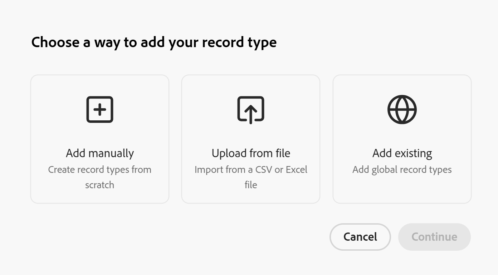

<!-- add these to the metadata, when making this public: 

feature: Workfront Planning
role: User, Admin
author: Alina
recommendations: noDisplay, noCatalog
-->

# 新增現有記錄型別

此頁面上的資訊是指尚未普遍提供的功能。 它僅在預覽環境中可供所有客戶使用。 每月發行至生產環境後，生產環境中為啟用快速發行的客戶也提供相同的功能。

如需快速發行資訊，請參閱[為您的組織啟用或停用快速發行](/help/quicksilver/administration-and-setup/set-up-workfront/configure-system-defaults/enable-fast-release-process.md)。

身為工作區管理員，您可以將工作區中存在的記錄型別新增至您在Adobe Workfront Planning中管理的工作區。

您必須先將記錄型別指定為集中記錄型別，然後工作區管理員才能將記錄型別新增至其他工作區，作為現有記錄型別。

當您在定義記錄型別的跨工作區設定時，可以在建立或編輯記錄型別時將其指定為集中型別。

如需詳細資訊，請參閱[設定記錄型別的跨工作區功能](/help/quicksilver/planning/architecture/configure-record-type-cross-workspace-capabilities.md)。

從集中記錄型別新增記錄到工作區之前，請參閱文章[集中記錄型別概觀](/help/quicksilver/planning/architecture/centralized-record-types-overview.md)。

## 存取需求

+++ 展開以檢視本文中功能的存取需求。

<table style="table-layout:auto"> 
<col> 
</col> 
<col> 
</col> 
<tbody> 
    <tr> 
<tr>

</tr>   
<tr> 
   <td role="rowheader">
Adobe Workfront套件
</td> 
   <td> 
<ul><li>
任何Workfront套件
</li>
與
<li>
Planning Plus套件
</li></ul>
或：
<ul><li>
任何Workflow封裝
 </li>
與
<li>
規劃Prime或Ultimate套件
</li></ul>

如需每個Workfront計畫包含內容的詳細資訊，請聯絡您的Workfront客戶經理。 
 
   </td>

<tr> 
   <td role="rowheader">
Adobe Workfront授權
</td> 
   <td>
標準

   </td> 
  </tr> 
  <tr> 
   <td role="rowheader">
物件許可權
</td> 
   <td>   
管理工作區</a>的許可權 
  
   
系統管理員擁有所有工作區的許可權，包括他們未建立的工作區
  </td> 
  </tr>  
</tbody> 
</table>

如需Workfront存取需求的詳細資訊，請參閱Workfront檔案中的[存取需求](/help/quicksilver/administration-and-setup/add-users/access-levels-and-object-permissions/access-level-requirements-in-documentation.md)。

+++   

## 從現有記錄型別建立記錄型別

1. 開始建立記錄型別，如文章[建立記錄型別](/help/quicksilver/planning/architecture/create-record-types.md)中所述，然後按一下&#x200B;**新增現有的**。<!--check this - the option might have been renamed in the UI-->

   

1. 按一下&#x200B;**繼續**。
1. 在&#x200B;**選擇記錄型別**&#x200B;方塊中，按一下您要從現有工作區新增的記錄型別的卡片，然後按一下&#x200B;**新增**。

   記錄型別會新增至您選取的工作區。

   >[!TIP]
   >
   >當未設定要將記錄型別新增到另一個工作區時，建立記錄型別時不會顯示從另一個工作區新增記錄型別的選項。

   會發生下列情況：

   * 以下資訊也會從現有的集中式記錄型別中新增：

      * 所有原始欄位
      * 所有記錄連線
   * 您至少擁有其他工作區的「檢視」許可權時，才能檢視這些工作區新增的記錄。
   * **集中式記錄型別**&#x200B;圖示已新增到新記錄型別的卡片中。
   * 唯讀&#x200B;**Workspace**&#x200B;欄位已新增至新記錄型別資料表檢視。 欄位會顯示每個記錄建立時所在的工作區。

     >[!NOTE]
     >
     >* 您無法編輯新記錄型別的外觀、進階設定或原始欄位。 您只能從原始工作區編輯記錄型別及其所有原始欄位和設定。

1. （可選）按一下，然後將新新增的記錄型別拖放至工作區內的任何區段。

1. （選擇性）按一下新記錄型別卡片中的&#x200B;**更多**&#x200B;功能表，或在其頁面上的記錄型別名稱右側，然後按一下&#x200B;**共用**&#x200B;以與相同工作區中的其他使用者共用。

1. （選擇性）在新記錄型別的卡片中按一下&#x200B;**更多**&#x200B;功能表，或在其頁面上的記錄型別名稱右側，然後按一下&#x200B;**刪除**。
1. （視條件而定）在提供的欄位中輸入&#x200B;**刪除**，然後按一下&#x200B;**永久刪除**。

   會發生下列情況：

   * 從集中記錄型別建立的記錄型別會從選取的工作區中移除。
   * 原始記錄型別及其欄位會保留在其原始工作區中。
   * 從相同集中記錄型別新增的所有其他記錄型別會保留在其工作區中。
   * 從目前工作區新增到記錄型別的記錄將被刪除。 從已新增集中記錄型別的其他工作區新增的所有其他記錄都會保留。

