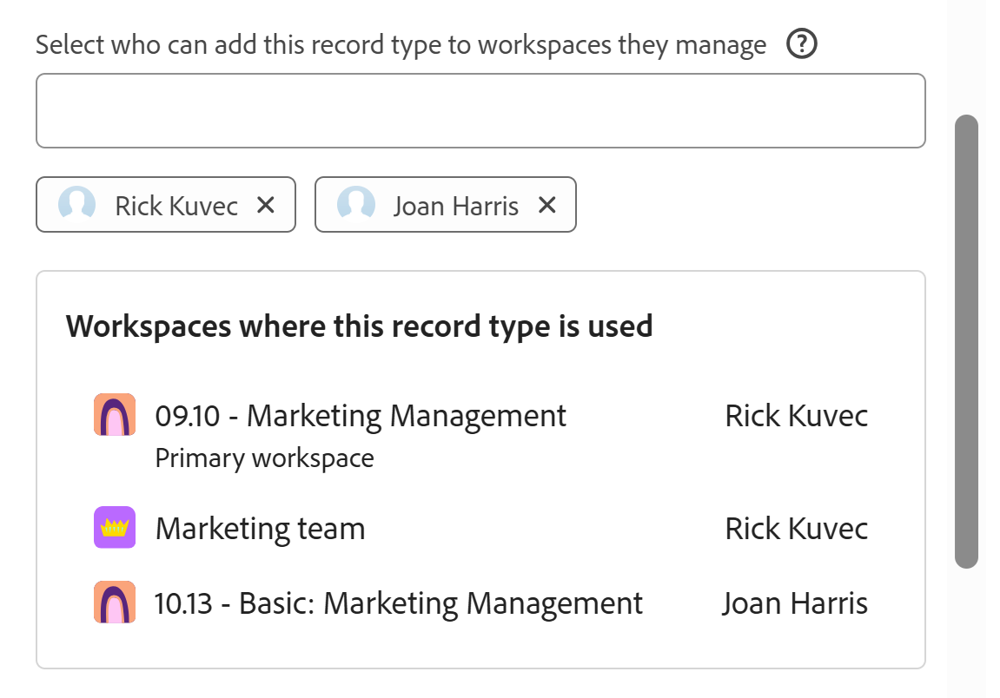

<!--*******************REPLACE THE "ADVANCED SETTINGS" SECTION IN THE "EDIT RECORD TYPES" ARTICLE WITH A LINK TO THIS ARTICLE INSTEAD AND REMOVE THE STEPS FROM THE "EDIT RECORD TYPES" ARTICLE ON HOW TO ALLOW CROSS-WORKSPACE SETTINGS FOR RECORD TYPES*************-->

# 設定記錄型別的跨工作區功能

<!--this article is linked to the UI in the Advanced settings/ Cross-workspace settings tab - do not delete or change the URL-->

{{planning-important-intro}}

本頁標示的資訊是指尚未普遍可用的功能。 它僅在預覽環境中可供所有客戶使用。 每月發行至生產環境後，生產環境中為啟用快速發行的客戶也提供相同的功能。

如需快速發行資訊，請參閱[為您的組織啟用或停用快速發行](/help/quicksilver/administration-and-setup/set-up-workfront/configure-system-defaults/enable-fast-release-process.md)。

您可以在Adobe Workfront Planning中設定要在多個工作區中運作的記錄型別。

您可以指定記錄型別為下列其中一項：

* **全域記錄型別**：使用者可以將全域記錄型別新增到他們可以管理的其他工作區。
* **可連線的記錄型別**：使用者可以從其他工作區連線到此記錄型別。

您必須先定義記錄型別的跨工作區功能，然後工作區管理員才能將其新增到其他工作區或從其他工作區連線它。

當您建立或編輯記錄型別時，可以定義記錄型別的跨工作區功能。

如需詳細資訊，請參閱下列其中一篇文章：

* [建立記錄型別](/help/quicksilver/planning/architecture/create-record-types.md)
* [編輯記錄型別](/help/quicksilver/planning/architecture/edit-record-types.md)

## 存取權要求

+++ 展開以檢視本文中功能的存取需求。

<table style="table-layout:auto"> 
<col> 
</col> 
<col> 
</col> 
<tbody> 
    <tr> 
<tr> 
</tr>   
<tr> 
   <td role="rowheader">
Adobe Workfront 封裝
</td> 
   <td> 

若要設定可連線的記錄型別： 

<ul> 
<li>
任何Workfront套件和任何Planning套件
</li>
或
<li>
任何工作流程與任何計畫
</li></ul>

若要設定全域記錄型別，請執行下列動作：

<ul> 
<li>
任何Workfront套件和Planning Plus套件
</li>
或
<li>
任何工作流程和Planning Prime或Ultimate套件
</li></ul>

如需每個Workfront Planning套件所含內容的詳細資訊，請聯絡您的Workfront客戶代表。 

 
   </td> 
  <tr> 
   <td role="rowheader">
Adobe Workfront授權
</td> 
   <td>
標準

   </td> 
  </tr> 
  <tr> 
   <td role="rowheader">
物件許可權
</td> 
   <td>   
管理工作區的許可權
  
   
系統管理員擁有所有工作區的許可權，包括他們未建立的工作區
  </td> 
  </tr>  
</tbody> 
</table>

如需Workfront存取需求的詳細資訊，請參閱Workfront檔案中的[存取需求](/help/quicksilver/administration-and-setup/add-users/access-levels-and-object-permissions/access-level-requirements-in-documentation.md)。

+++   

<!--Old:

<table style="table-layout:auto"> 
<col> 
</col> 
<col> 
</col> 
<tbody> 
    <tr> 
<tr> 

  </tr>   
<tr> 
   <td role="rowheader">
Adobe Workfront package
</td> 
   <td> 
<ul><li>
Any Workfront package
</li>

And

<li>
Any Planning package to create connectable record types
</li>
<li>
A Planning Plus package to create global record types
</li>
</ul>
Or:
<ul><li>
A Workflow Prime or Ultimate package
 </li>
And
<li>
A Planning Prime or Ultimate package
</li></ul>

For more information about what is included in each Workfront Planning package, contact your Workfront account manager. 
 
   </td> 
  <tr> 
   <td role="rowheader">
Adobe Workfront license
</td> 
   <td>
Standard

   </td> 
  </tr> 
  <tr> 
   <td role="rowheader">
Object permissions
</td> 
   <td>   
Manage permissions to a workspace and to the record type</a> 
  
   
System Administrators have permissions to all workspaces, including the ones they did not create
  </td> 
  </tr>  
</tbody> 
</table> -->

## 設定全域記錄型別

<!--this is a UI term; don't change the title of this section-->

身為工作區管理員，您可以將記錄型別設定為全域記錄型別。 全域記錄型別可以新增到其他工作區。

工作區管理員可以將全域記錄型別新增到他們管理的工作區。 記錄型別的原始欄位也會新增至次要工作區。

使用者可以從他們擁有「貢獻」許可權且已新增全域記錄型別（包括其原始工作區）的任何工作區，將記錄新增至全域記錄型別。 他們可以從只擁有檢視許可權的工作區檢視記錄。

如需詳細資訊，請參閱[跨工作區記錄型別總覽](/help/quicksilver/planning/architecture/cross-workspace-record-types-overview.md)。

若要將記錄型別設定為全域：

{{step1-to-planning}}

1. 按一下您要將其記錄型別設定為全域的工作區。

   工作區頁面隨即開啟，且記錄型別隨即顯示。
1. 執行下列其中一項：

   * 將滑鼠停留在記錄型別的卡片上，然後按一下記錄型別卡片右上角的&#x200B;**更多**&#x200B;功能表。<!--add new screen shot without Share for now-->

     

   * 按一下記錄型別卡片以開啟記錄型別頁面，然後按一下記錄型別名稱右側的&#x200B;**更多**&#x200B;功能表。
1. 按一下&#x200B;**編輯**&#x200B;或&#x200B;**設定**。

   >[!TIP]
   >
   >將記錄型別新增到另一個工作區時，它會顯示為該工作區中的全域記錄型別。 在這種情況下，「編輯」和「設定」選項會變暗。

1. （視條件而定）如果您按一下&#x200B;**編輯**，請在&#x200B;**編輯記錄型別**&#x200B;方塊中按一下&#x200B;**跨工作區設定**&#x200B;索引標籤

   或者，如果您按一下&#x200B;**設定**，請按一下左側面板中的&#x200B;**跨工作區設定**&#x200B;區段。
1. 啟用&#x200B;**允許將此記錄型別新增到其他工作區**&#x200B;設定。

   ![啟用[新增至其他工作區]的情況下編輯記錄型別跨工作區設定](assets/edit-record-type-advanced-settings-add-to-other-workspaces-enabled.png)

   >[!TIP]
   >
   >將全域記錄型別新增至另一個工作區後，就無法再停用此設定。

1. 在&#x200B;**選取誰可以新增此記錄型別至他們管理的工作區**&#x200B;欄位中，新增您想要允許新增此記錄型別的實體至他們管理的工作區。

   您的名稱會自動新增到欄位中。

   您可以新增個別使用者、群組、團隊、職務角色或公司，讓使用者允許其將此記錄型別新增至他們管理的工作區。

   儲存記錄型別後，您可以編輯此欄位。

1. （選擇性）從&#x200B;**選取誰可以新增此記錄型別到他們管理的工作區**&#x200B;欄位，移除您的名稱。

   >[!TIP]
   >
   >您必須至少指定一個實體（使用者、團隊、群組、角色或公司）才能啟用此設定。

1. （視條件而定）在&#x200B;**編輯記錄型別**&#x200B;方塊中按一下&#x200B;**儲存**，或按一下頁面標頭中&#x200B;**設定**&#x200B;左側的返回箭頭，以儲存您的變更。

   會發生下列情況：

   * 記錄型別及其欄位現在可以由您指定的人員新增到另一個工作區。

   >[!NOTE]
   >
   >您只能從其原始工作區編輯記錄型別的外觀和設定及其原始欄位。

   * 記錄型別卡片會顯示&#x200B;**全域記錄型別**&#x200B;圖示，以表示該記錄型別可新增至其他工作區。
   * 系統產生的&#x200B;**Workspace**&#x200B;欄位已新增至記錄型別及其記錄詳細資料的資料表檢視。

     Workspace欄位會顯示建立每個記錄的工作區。

     此欄位是唯讀的，無法刪除。
1. （選擇性）移至另一個工作區，並使用現有的記錄型別來建立記錄型別。 選取您在上述步驟中啟用的記錄型別。

   如需詳細資訊，請參閱[從其他工作區新增現有記錄型別](/help/quicksilver/planning/architecture/add-existing-record-types-from-another-workspace.md)。

   從次要工作區中的全域記錄型別新增的記錄型別也顯示&#x200B;**全域記錄型別**&#x200B;圖示。
1. （選擇性）返回您建立全域記錄型別的原始工作區，並按照<!--ensure this stays accurate-->上方的步驟1-4編輯記錄型別
1. （選擇性）檢閱已在使用此記錄型別的&#x200B;**工作區區段**&#x200B;中新增全域記錄的工作區清單。 工作區擁有者也會列在工作區名稱旁。

   

## 設定可連線的記錄型別

<!--this is a UI term; don't change the title of this section-->

當您建立或編輯記錄型別時，可以設定要從其他工作區連線的記錄型別。

將記錄型別設定為可連線會因您為設定選擇的環境而異。

### 在生產環境中設定可連線的記錄型別

{{step1-to-planning}}

1. 按一下您要將其記錄型別設定為可連線的工作區。

   工作區頁面隨即開啟，且記錄型別隨即顯示。
1. 執行下列其中一項：

   * 暫留在記錄型別的卡片上，然後按一下記錄型別卡片右上角的&#x200B;**更多**&#x200B;功能表

     

   * 按一下記錄型別卡片以開啟記錄型別頁面，然後按一下記錄型別名稱右側的&#x200B;**更多**&#x200B;功能表，然後按一下&#x200B;**編輯**。

1. 按一下「**進階設定**」標籤。

1. 啟用&#x200B;**允許從其他工作區**&#x200B;設定連線到此記錄型別。

   

   啟用時，記錄型別會變成可連線，並可從其他工作區連線到。

1. 選擇可存取記錄型別的工作區。 從下列選項中選擇：

   <!--check names of the setting: System wide?? OR All workspaces??-->

   * **系統範圍**：使用者可以從其擁有管理許可權的所有工作區連線到此記錄型別。
   * **特定工作區**：從下拉式功能表，新增工作區管理員可連線至此記錄型別的工作區名稱。
1. （視條件而定）在&#x200B;**編輯記錄型別**&#x200B;方塊中按一下&#x200B;**儲存**&#x200B;以儲存您的變更。

   會發生下列情況：

   * 記錄型別及其欄位現在可以從您指定的工作區連線到。
   * 記錄型別卡片會顯示可連線的記錄型別圖示，以表示可從您在組態中指定的任何工作區連線到記錄型別。

1. （可選）前往另一個工作區，並將連線新增至您在上述步驟中啟用跨工作區連線的記錄型別。

   如需詳細資訊，請參閱[連線記錄型別](/help/quicksilver/planning/architecture/connect-record-types.md)。

### 在預覽環境中設定可連線的記錄型別

{{step1-to-planning}}

1. 按一下您要將其記錄型別設定為可連線的工作區。

   工作區頁面隨即開啟，且記錄型別隨即顯示。
1. 執行下列其中一項：

   * 暫留在記錄型別的卡片上，然後按一下記錄型別卡片右上角的&#x200B;**更多**&#x200B;功能表

     

   * 按一下記錄型別卡片以開啟記錄型別頁面，然後按一下記錄型別名稱右側的&#x200B;**更多**&#x200B;功能表。
1. 按一下&#x200B;**編輯**&#x200B;或&#x200B;**設定**。

1. （視條件而定）如果您按一下&#x200B;**編輯**，請在&#x200B;**編輯記錄型別**&#x200B;方塊中按一下&#x200B;**跨工作區設定**&#x200B;索引標籤

   或者，如果您按一下&#x200B;**設定**，請按一下左側面板中的&#x200B;**跨工作區設定**&#x200B;區段。

1. 啟用&#x200B;**允許連線到其他工作區中的這個記錄型別**&#x200B;設定。<!-- check the setting name, I sent this to Lilit to say FROM instead of IN-->

   <!-- add new screen shot with new tab name-->

   

   啟用時，記錄型別可供存取，且可從其他工作區連線到。

1. 選擇可存取記錄型別的工作區。 從下列選項中選擇：

   <!--check names of the setting: System wide?? OR All workspaces??-->

   * **所有工作區**：使用者可以從他們擁有管理許可權的所有工作區連線到此記錄型別。
   * **特定工作區**：從下拉式功能表，新增工作區管理員可連線至此記錄型別的工作區名稱。
1. （視條件而定）在&#x200B;**編輯記錄型別**&#x200B;方塊中按一下&#x200B;**儲存**，或按一下頁面標頭中&#x200B;**設定**&#x200B;左側的返回箭頭，以儲存您的變更。

   會發生下列情況：

   * 記錄型別及其欄位現在可以從您指定的工作區連線到。
   * 記錄型別卡片會顯示可連線的記錄型別圖示，以表示可從您在組態中指定的任何工作區連線到記錄型別。

1. （可選）前往另一個工作區，並將連線新增至您在上述步驟中啟用跨工作區連線的記錄型別。

   如需詳細資訊，請參閱[連線記錄型別](/help/quicksilver/planning/architecture/connect-record-types.md)。

