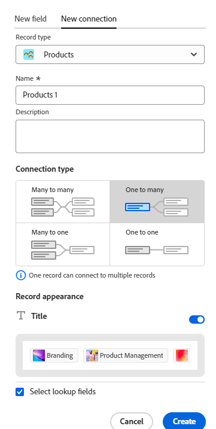

<!--update metadata at GA-->
<!--add mini TOC when live, already added to big TOC to get the link-->

# 連線記錄型別概觀

<!--REMOVE THE CONTENT BELOW FROM THE "CONNECT RECORD TYPES" ARTICLE WHEN YOU TURN THIS ARTICLE LIVE- THIS IS THE SAME CONTENT AS THERE, DUPLICATED-->

您可以透過連線個別記錄型別來指示它們彼此相關，或與來自其他應用程式的物件相關。

本文概述記錄型別連線，並說明您可以在記錄與物件型別之間建立的連線型別。

如需有關您連線記錄型別的資訊，請參閱[連線記錄型別](/help/quicksilver/planning/architecture/connect-record-types.md)。

## 有關連線記錄型別的考量事項

在Workfront Planning中連線有兩個步驟：

1. 首先，您必須建立兩個記錄型別之間的連線，或記錄型別與來自另一個應用程式的物件型別。 如需如何連線記錄型別的詳細資訊，請參閱[連線記錄型別](/help/quicksilver/planning/architecture/connect-record-types.md)。
1. 其次，您可以在連線兩種記錄型別之後，將一種型別的個別記錄與另一種型別的記錄連線。 如需有關連線記錄的資訊，請參閱[連線記錄](/help/quicksilver/planning/records/connect-records.md)。

關於連線記錄型別，請考量下列事項：

* 您可以在Adobe Workfront Planning中連線下列實體：

   * 兩種記錄型別。

     依預設，您可以從相同的工作區連線兩種記錄型別。 您也可以設定記錄型別，以便從其他工作區連線記錄型別。 如需詳細資訊，請參閱[編輯記錄型別](/help/quicksilver/planning/architecture/edit-record-types.md)。
   * 來自另一個應用程式的記錄型別和物件型別。

* 您可以從下列應用程式將Workfront Planning記錄型別與下列物件型別連線：

   * Adobe Workfront：

      * 專案
      * 專案組合
      * 計劃
      * 公司
      * 群組

   * Adobe Experience Manager Assets：

      * 影像
      * 資料夾

     >[!IMPORTANT]
     >
     >您必須擁有Adobe Experience Manager Assets授權，且貴組織的Workfront執行個體必須上線至Adobe商業平台或Adobe Admin Console，才能將Workfront Planning記錄連線至Adobe Experience Manager Assets。
     >
     >如果您對加入Adobe Admin Console有任何疑問，請參閱[Adobe統一體驗常見問題集](/help/quicksilver/workfront-basics/navigate-workfront/workfront-navigation/unified-experience-faq.md)。

* 為記錄型別建立個別記錄後，您可以從連結的記錄型別欄位中選取連線的記錄。 如需詳細資訊，請參閱[連線記錄](/help/quicksilver/planning/records/connect-records.md)。

* 將記錄型別與另一個記錄型別或另一個應用程式的物件型別連線後，就會出現下列情況：

   * **當您連線兩個記錄型別時**：連結的記錄欄位會在您連線的記錄型別上建立。 類似的連結記錄欄位會在您連線的記錄型別上建立。

     例如，如果您將「促銷活動」記錄型別與「產品」記錄型別連結，您命名為「連結的產品」的連結記錄欄位就會建立在「促銷活動」記錄型別上。 系統會在產品記錄型別上建立自動命名為「Campaign」的連結記錄型別。

   * **當您從另一個應用程式連線具有物件型別的記錄型別時**：

      * 連結的記錄欄位會在您連線的記錄型別上建立。 不會在其他應用程式的物件型別上自動建立任何連結的記錄欄位。

      * 無法從Workfront物件存取規劃記錄欄位。
      * 當您的Workfront管理員透過Workfront與Adobe Experience Manager Assets之間的整合設定中繼資料對應時，可從Experience Manager資產存取規劃記錄欄位。 如需詳細資訊，請參閱[設定Adobe Workfront與Experience Manager Assets之間的資產中繼資料對應](https://experienceleague.adobe.com/docs/experience-manager-cloud-service/content/assets/integrations/configure-asset-metadata-mapping.html?lang=en)。

   * **當您從連線的記錄或物件加入連結（或查詢）欄位時**：除了建立連結的記錄欄位之外，您也可以從連線的記錄或物件型別連線到稱為查詢欄位的欄位。 連結（或查詢欄位）的資訊，來自於您所連線的記錄，顯示在您所連線的記錄上。

     您可以將其他記錄型別或其他應用程式物件的欄位連線到Workfront Planning記錄型別。

     連結欄位是唯讀的，當您連線記錄或物件時，連結欄位會自動顯示已連線記錄或物件的資訊。

     您可以在公式、篩選器或群組中參照其他記錄或物件型別的查閱欄位。

     例如，如果您將「行銷活動」記錄型別與Workfront專案連線，並且選擇將專案的「計畫完成日期」欄位帶入Workfront計畫記錄，則系統會自動為行銷活動建立名為「計畫完成日期」（來自「專案」）的連結欄位。 您無法手動編輯此連結的欄位。 計畫完成日期（來自專案）欄位會顯示連結專案的計畫完成日期。

     >[!IMPORTANT]
     >
     >擁有工作區檢視或較高許可權的每個人皆可檢視查閱欄位中的資訊，無論其在連結物件型別應用程式中的許可權或存取層級，或其在其他工作區的許可權為何。

     連結的記錄欄位前面有關聯圖示。

     連結的欄位前面有識別欄位型別的圖示。 例如，連結（或查詢）欄位前面有圖示，表示欄位是數字、段落或日期。

<!--## Connection types

After you establish a connection between two record types or between a record and an object type from another application, you can add records in the connected record fields. 

Depending on how many records you can add to a connected record field, the following are the connection types you can choose from when connecting record types: 

* [Many to many](#many-to-many-connection-type)
* [One to many](#one-to-many-connection-type)
* [Many to one](#many-to-one-connection-type)
* [One to one](#many-to-one-connection-type)

>[!WARNING]
>
>These options are not available when connecting the following: 
>* Two records from different workspaces
>
>* A record type and AEM assets

### Many-to-many connection type

When you select the many-to-many connection type between record types, you can later connect many records with multiple records you're connecting to. 

For example, if you connect campaigns with projects and you choose this type of connection, you can connect several campaigns with multiple projects. You can also connect the same projects you are connecting to the campaigns to more than one campaign. 

A real-life example of a many-to-many relationship type is the relationship between customers and products: customers can purchase multiple products; and those products can also be purchased by many other customers. 

When you select this connection type, you cannot change the connection type after you save it. 

### One-to-many connection type

When you select the one-to-many connection type between record types, you can later connect one record with multiple records you're connecting to. 

For example, if you connect campaigns with projects and you choose this type of connection, you can connect one campaign with multiple projects. But one of the projects you're connecting to the campaigns can be connected only to one campaign at a time. 

A real-life example of a one-to-many relationship type is the relationship between libraries and books: a library has many books in its inventory; but one particular book can only be in one library at a given point in time. 

When you select this connection type, you can later change it only to a many-to-many connection type. 
 
### Many-to-one connection type

When you select the many-to-one connection type between record types, you can later connect many records with only one record you're connecting to. 

For example, if you connect campaigns with projects and you choose this type of connection, you can add only one project to a campaign. But you can add multiple campaigns to one project. 

A real-life example of a many-to-one relationship type is the relationship between many movies and one actor: one actor can be in many movies, but each movie can only have a specific actor once in its cast. 

When you select this connection type, you can later change it only to a many-to-many connection type.

### One-to-one connection type

When you select the one-to-one connection type between record types, you can later connect one record with one other record that you're connecting to. 

For example, if you connect campaigns with projects and you choose this type of connection, you can connect one campaign with one project. One project can be connected only to one campaign. 

A real-life example of a one-to-one relationship is the one existing between a person and their country's unique identifier (like a Social Security Number, Passport ID, local identification ID): each person has only one unique identifier for a country and each unique identifier can be linked to only one person. 

When you select this connection type, you can later change it to any other connection type. 

-->

