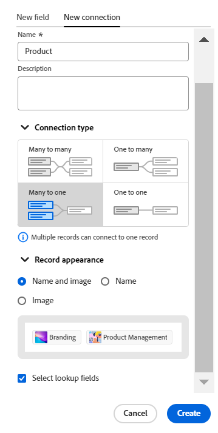

<!--update metadata at GA-->
<!--add mini TOC when live, already added to big TOC to get the link-->

# 連線記錄型別概觀

<!--REMOVE THE CONTENT BELOW FROM THE "CONNECT RECORD TYPES" ARTICLE WHEN YOU TURN THIS ARTICLE LIVE- THIS IS THE SAME CONTENT AS THERE, DUPLICATED-->

您可以透過連線個別記錄型別來指示它們彼此相關，或與來自其他應用程式的物件相關。

本文概述記錄型別連線，並說明您可以在記錄與物件型別之間建立的連線型別。

如需有關您連線記錄型別的資訊，請參閱[連線記錄型別](/help/quicksilver/planning/architecture/connect-record-types.md)。

## 有關連線記錄型別的考量事項

* 您可以在Adobe Workfront Planning中連線下列實體：

   * 兩種記錄型別。

     依預設，您可以從相同的工作區連線兩種記錄型別。 您也可以設定記錄型別，以便從其他工作區連線記錄型別。
   * 來自另一個應用程式的記錄型別和物件型別。

* 您可以從下列應用程式將Workfront Planning記錄型別與下列物件型別連線：

   * Adobe Workfront：

      * 專案
      * 專案組合
      * 計劃
      * 公司
      * 群組

   * Adobe Experience Manager Assets：

      * 影像
      * 資料夾

     >[!IMPORTANT]
     >
     >您必須擁有Adobe Experience Manager Assets授權，且貴組織的Workfront執行個體必須上線至Adobe商業平台或Adobe Admin Console，才能將Workfront Planning記錄連線至Adobe Experience Manager Assets。
     >
     >如果您對加入Adobe Admin Console有任何疑問，請參閱[Adobe統一體驗常見問題集](/help/quicksilver/workfront-basics/navigate-workfront/workfront-navigation/unified-experience-faq.md)。

* 為記錄型別建立個別記錄後，您可以從連結的記錄型別欄位中選取連線的記錄。 如需詳細資訊，請參閱[連線記錄](/help/quicksilver/planning/records/connect-records.md)。

* 將記錄型別與另一個記錄型別或另一個應用程式的物件型別連線後，就會出現下列情況：

   * **當您連線兩個記錄型別時**：連結的記錄欄位會在您連線的記錄型別上建立。 類似的連結記錄欄位會在您連線的記錄型別上建立。

     例如，如果您將「促銷活動」記錄型別與「產品」記錄型別連結，您命名為「連結的產品」的連結記錄欄位就會建立在「促銷活動」記錄型別上。 系統會在產品記錄型別上建立自動命名為「Campaign」的連結記錄型別。

   * **當您從另一個應用程式連線具有物件型別的記錄型別時**：

      * 連結的記錄欄位會在您連線的記錄型別上建立。 不會在其他應用程式的物件型別上自動建立任何連結的記錄欄位。

      * 無法從Workfront物件存取規劃記錄欄位。
      * 當您的Workfront管理員透過Workfront與Adobe Experience Manager Assets之間的整合設定中繼資料對應時，可從Experience Manager資產存取規劃記錄欄位。 如需詳細資訊，請參閱[設定Adobe Workfront與Experience Manager Assets之間的資產中繼資料對應](https://experienceleague.adobe.com/docs/experience-manager-cloud-service/content/assets/integrations/configure-asset-metadata-mapping.html?lang=en)。

   * **當您從連線的記錄或物件加入連結（或查詢）欄位時**：除了建立連結的記錄欄位之外，您也可以從連線的記錄或物件型別連線到稱為查詢欄位的欄位。 連結（或查詢欄位）的資訊，來自於您所連線的記錄，顯示在您所連線的記錄上。

     您可以將其他記錄型別或其他應用程式物件的欄位連線到Workfront Planning記錄型別。

     連結欄位是唯讀的，當您連線記錄或物件時，連結欄位會自動顯示已連線記錄或物件的資訊。

     您可以在公式、篩選器或群組中參照其他記錄或物件型別的查閱欄位。

     例如，如果您將「行銷活動」記錄型別與Workfront專案連線，並且選擇將專案的「計畫完成日期」欄位帶入Workfront計畫記錄，則系統會自動為行銷活動建立名為「計畫完成日期」（來自「專案」）的連結欄位。 您無法手動編輯此連結的欄位。 計畫完成日期（來自專案）欄位會顯示連結專案的計畫完成日期。

     >[!IMPORTANT]
     >
     >擁有工作區檢視許可權或較高許可權的所有人都可以檢視查閱欄位中的資訊，無論其在連結物件型別<!--or their permissions in other workspaces-->的應用程式中的許可權或存取層級為何。

<!--see the commented out text above for the release of cross-workspace connections-->

* 連結的記錄欄位前面有關聯圖示。

  連結的欄位前面有識別欄位型別的圖示。 例如，連結（或查詢）欄位前面有圖示，表示欄位是數字、段落或日期。

## 連線型別

在兩個記錄型別之間或記錄與來自另一個應用程式的物件型別之間建立連線後，您可以在連線的記錄欄位中新增記錄。

根據您可將多少筆記錄新增至已連線的記錄欄位，在連線記錄型別時，您可以選擇下列連線型別：

* [一對多](#one-to-many-connection-type)
* [一對一](#many-to-one-connection-type)
* [多對一](#many-to-one-connection-type)
* [多對多](#many-to-many-connection-type)

>[!WARNING]
>
>連線下列專案時，無法使用這些選項：
>* 來自不同工作區的兩個記錄
>
>* 記錄型別和AEM資產

<!-- add screen shots for each type of connection below-->

### 一對多連線型別

當您在記錄型別之間選取一對多連線型別時，您稍後可以將一個記錄與多個您正在連線的記錄連線。

例如，如果您將行銷活動與專案連結，您可以將一個行銷活動與多個專案連結。 但一個專案只能連線至一個行銷活動。

當您選取此連線型別時，您稍後可以將其變更為多對多連線型別。

### 一對一連線型別

當您在記錄型別之間選取一對一的連線型別時，您稍後可以將一個記錄與您正在連線的另一個記錄連線。

例如，如果您將行銷活動與專案連線，您可以將一個行銷活動與一個專案連線。 一個專案只能連線至一個行銷活動。

當您選取此連線型別時，您稍後可以將其變更為任何其他連線型別。

### 多對一連線型別

當您在記錄型別之間選取多對一連線型別時，您稍後可以只連線一個記錄來連線許多記錄。

例如，如果您將行銷活動與專案連結，您可以將多個行銷活動與一個專案連結。 一個專案可以連線至數個行銷活動。

當您選取此連線型別時，您稍後可以將其變更為多對多連線型別。

### 多對多連線型別

當您在記錄型別之間選取多對多的連線型別時，您稍後可以連線多個記錄與要連線的多個記錄。

例如，如果您將行銷活動與專案連結，您可以將多個行銷活動與多個專案連結。 您也可以將多個專案連結至多個行銷活動。

當您選取此連線型別時，您無法在儲存後變更連線型別。

