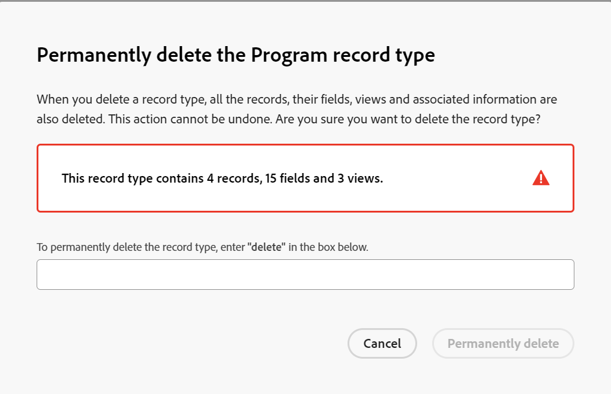

# 刪除記錄型別

此頁面上的資訊是指尚未普遍提供的功能。 它僅在預覽環境中可供所有客戶使用。 每月發行至生產環境後，生產環境中為啟用快速發行的客戶也提供相同的功能。

如需快速發行資訊，請參閱[為您的組織啟用或停用快速發行](/help/quicksilver/administration-and-setup/set-up-workfront/configure-system-defaults/enable-fast-release-process.md)。

{{planning-important-intro}}

當記錄型別不再相關時，您可以將其刪除。

但是，刪除記錄型別也會刪除與記錄型別相關的所有資訊。 如需詳細資訊，請參閱本文中[刪除記錄型別](#considerations-when-deleting-record-types)時的考量事項。

如需有關記錄型別的資訊，請參閱[記錄型別概觀](/help/quicksilver/planning/architecture/overview-of-record-types.md)。

<!-- last sentence might need to be deleted when we can recover or replace deleted record types-->

## 存取需求

+++ 展開以檢視存取需求。

您必須具有下列存取權才能執行本文中的步驟：

<table style="table-layout:auto"> 
<col> 
</col> 
<col> 
</col> 
<tbody> 
    <tr> 
<tr> 
<td> 
   
 產品
 </td> 
   <td> 
   <ul><li>
 Adobe Workfront
</li> 
   <li>
 Adobe Workfront規劃
</li></ul></td> 
  </tr>   
<tr> 
   <td role="rowheader">
Adobe Workfront計畫*
</td> 
   <td> 

下列任一Workfront計畫：
 
<ul><li>選取</li> 
<li>Prime</li> 
<li>Ultimate</li></ul> 

舊版Workfront計畫不提供Workfront計畫
 
   </td> 
<tr> 
   <td role="rowheader">
Adobe Workfront規劃套件*
</td> 
   <td> 

任何 
 

如需每個Workfront計畫包含內容的詳細資訊，請聯絡您的Workfront客戶經理。 
 
   </td> 
 <tr> 
   <td role="rowheader">
Adobe Workfront平台
</td> 
   <td> 

貴組織的Workfront例項必須上線至Adobe Unified Experience，才能存取Workfront Planning的所有功能。
 

如需詳細資訊，請參閱<a href="/help/quicksilver/workfront-basics/navigate-workfront/workfront-navigation/adobe-unified-experience.md">適用於Workfront的Adobe Unified Experience</a>。 
 
   </td> 
   </tr> 
  </tr> 
  <tr> 
   <td role="rowheader">
Adobe Workfront授權*
</td> 
   <td>
 標準

   
Workfront計畫不適用於舊版Workfront授權
 
  </td> 
  </tr> 
  <tr> 
   <td role="rowheader">
存取層級設定
</td> 
   <td> 
Adobe Workfront Planning沒有存取層級控制
   
</td> 
  </tr> 
<tr> 
   <td role="rowheader">
物件許可權
</td> 
   <td>   
管理工作區和記錄型別的許可權
  
   
系統管理員擁有所有工作區的許可權，包括他們未建立的工作區
</td> 
  </tr> 
<tr> 
   <td role="rowheader">
版面配置範本
</td> 
   <td> 
在生產環境中，所有使用者（包括系統管理員）都必須指派給包含Planning的版面配置範本。

在預覽環境中，標準使用者和系統管理員預設啟用Planning。
</td> 
  </tr> 
</tbody> 
</table>

*如需Workfront存取需求的詳細資訊，請參閱Workfront檔案中的[存取需求](/help/quicksilver/administration-and-setup/add-users/access-levels-and-object-permissions/access-level-requirements-in-documentation.md)。

+++

## 刪除記錄型別時的注意事項

<!--check this and ensure these are still true - some things might change with / after closed beta-->

* 您只能從您擁有「管理」許可權的工作區中刪除記錄型別。
* 刪除記錄型別會移除下列與其相關的資訊：

   * 該型別的所有記錄。
   * 與記錄型別關聯的所有欄位。
   * 記錄型別的所有檢視（包括篩選器、群組和排序標準）。
* 記錄型別會從存取工作區的所有使用者中移除。
* 您無法復原已刪除的記錄型別或其資訊。
* 建議您先在其他記錄型別上重新建立與您要刪除之記錄型別相關的欄位和記錄，然後再刪除它們。

## 刪除記錄型別

{{step1-to-planning}}

1. 按一下要刪除其記錄型別的工作區，

   或

   從工作區中，展開現有工作區名稱右側的向下箭頭，搜尋工作區，然後在工作區顯示在清單中時選取該工作區。

   工作區隨即開啟，且記錄型別隨即顯示。
1. 執行下列其中一項：

   * 將游標停留在記錄型別卡片上，按一下&#x200B;**更多**&#x200B;功能表，然後&#x200B;**刪除**。
   * 按一下您要刪除之記錄型別的卡片，然後在記錄型別頁面中，按一下記錄型別名稱右側的&#x200B;**更多**&#x200B;功能表，然後按一下&#x200B;**刪除**。

   

1. 在確認方塊中輸入&#x200B;**刪除**，然後按一下&#x200B;**永久刪除**。 不區分大小寫。

   所選的記錄型別及其欄位、關聯的記錄和檢視都會被刪除並且無法復原。
