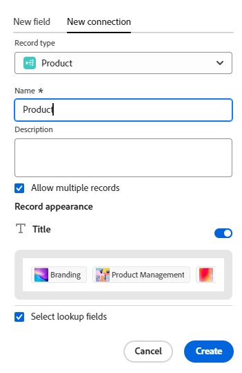
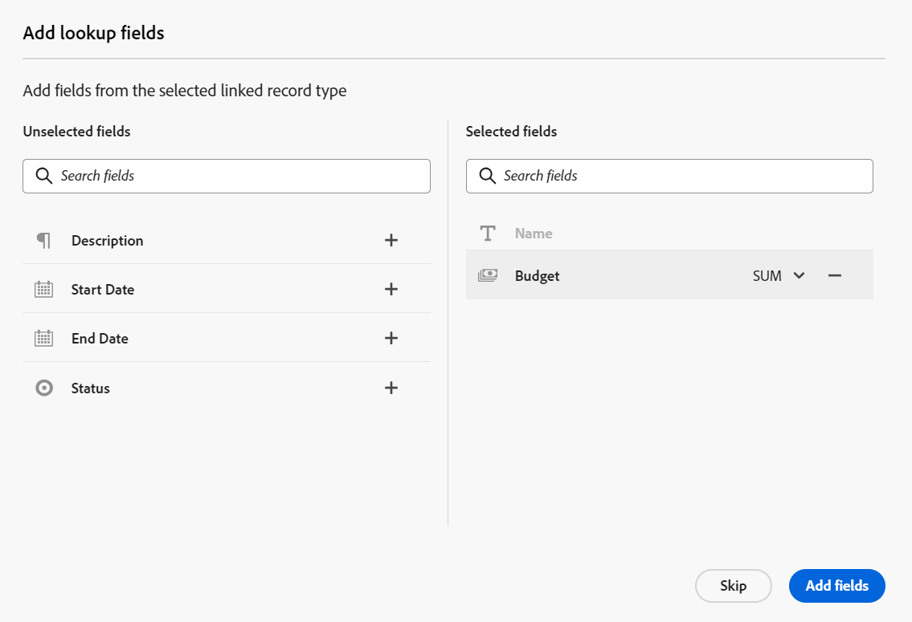
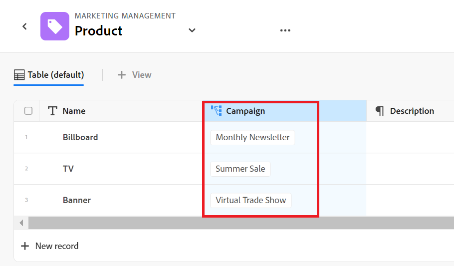
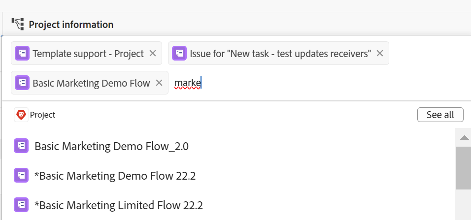

# 連線記錄型別和記錄的範例

{{planning-important-intro}}

本文會說明下列範例：

* 如何在兩個Workfront Planning記錄型別和兩個記錄之間建立連線。

* 如何在Workfront Planning記錄型別和Workfront專案物件型別之間建立連線，以及記錄與專案之間的連線。

如需詳細資訊，另請參閱下列文章：

* [連線記錄型別](/help/quicksilver/planning/architecture/connect-record-types.md)
* [連接記錄](/help/quicksilver/planning/records/connect-records.md)

## 連線兩個Workfront Planning記錄型別和記錄（範例）

例如，您有一個名為Campaign的記錄型別作為原始記錄型別。

您還有另一個記錄型別，稱為「產品」，其貨幣欄位稱為「預算」。

您想要在「促銷活動」的記錄型別上建立欄位，以顯示「產品」記錄型別「預算」欄位的值。

若要這麼做：

1. 在工作區中開啟行銷活動記錄型別的表格檢視。
1. 按一下表格檢視右上角的&#x200B;**+**&#x200B;圖示以新增欄位，然後按一下&#x200B;**新增連線**，然後按一下所選工作區區段中的&#x200B;**產品**。
1. 新增下列資訊，例如：

   * **記錄型別**：產品<!--did they change the casing here?-->
   * **名稱**：為新欄位命名。 例如，「產品資訊」。 這是連結的記錄欄位名稱。
   * **描述**：新增新欄位的描述。 例如，「這些是我想要與行銷活動相關聯的產品。」 將滑鼠游標停留在欄標題中的欄位上時，會顯示欄位說明。
   * **連線型別**：從下列選項中選取：
      * **多對多**：使用者可以將一個行銷活動連線到數個產品，並將一個產品連線到數個行銷活動。
      * **一對多**：使用者可以將一個行銷活動連線到數個產品，並將一個產品連線到一個行銷活動。
      * **多對一**：使用者可以將一個行銷活動連結至一個產品，並將一個產品連結至多個行銷活動。
      * **一對一**：使用者可以將一個行銷活動連線到一個產品，並將一個產品連線到一個行銷活動。

     >[!NOTE]
     >
     >從不同的工作區連線記錄或連線Experience Manager資產時，**連線型別**&#x200B;選項無法使用。 如需詳細資訊，請參閱[連線記錄型別概觀](/help/quicksilver/planning/architecture/connect-record-types-overview.md)。

   * **錄製外觀**：如果您不想在將產品新增至行銷活動的「產品資訊」欄位時顯示產品名稱，請取消選取「**標題**」切換按鈕。 如果啟用，記錄會顯示縮圖和標題。 切換預設為啟用。
   * **選取查閱欄位**：如果您保留選取此選項，則會接著開啟&#x200B;**新增查閱欄位**&#x200B;方塊，讓您將「產品」欄位與「促銷活動」記錄型別連結。 您可以按一下&#x200B;**跳過**&#x200B;以略過此步驟，並於稍後新增產品欄位。

   

1. （視條件而定）如果您在上一步選取了&#x200B;**選取查閱欄位選項**，請從與&#x200B;**產品**&#x200B;記錄型別相關的欄位清單中，按一下&#x200B;**預算**&#x200B;欄位的&#x200B;**+**&#x200B;圖示，然後按一下&#x200B;**新增欄位**。 這會建立名為&#x200B;**Budget （來自產品資訊）**&#x200B;的欄位，這是連結欄位的名稱。 「產品預算」的任何資訊都會顯示在此欄位中的促銷活動記錄。

   

   >[!TIP]
   >
   >    如果您想要以一個總數檢視所有所選產品的預算，請在欄位名稱右側的下拉式功能表中選取&#x200B;**SUM**。 當使用者在&#x200B;**產品資訊**&#x200B;連結的記錄欄位中選取多個產品時，**預算（來自產品資訊）**&#x200B;欄位會將其所有預算值加總並顯示總計。<!-- check the shot below - added a bug with a couple of UI changes here-->
   >
   > 若您選取&#x200B;**無**，而非&#x200B;**總和**，則所選產品的個別預算會以逗號分隔。

   這會產生下列欄位：

   * 在行銷活動記錄表格檢視中和行銷活動的行銷活動記錄頁面中：

      * **產品資訊** （連結的記錄欄位）：這會在您新增產品時顯示其名稱或名稱。
      * **預算（來自產品資訊）** （連結的欄位）：這會顯示在產品資訊欄位中選取的產品預算。

   * 在產品記錄表格檢視和產品的產品記錄頁面中：

      * **促銷活動**：這表示產品記錄型別是從促銷活動記錄型別連結的。

     

   >[!TIP]
   >
   >    連結的記錄欄位前面有關聯圖示。

1. 從&#x200B;**Campaign**&#x200B;記錄型別表格檢視，在Campaign記錄型別頁面的表格中新增一列，以建立行銷活動。

1. 在新行銷活動的&#x200B;**產品資訊**&#x200B;欄內按兩下。

   

1. 執行下列其中一項：

   * 從清單中按一下已連線的產品名稱，將其新增至選取的記錄。 產品會自動新增。
   * 開始輸入產品名稱，然後在產品顯示在清單中時按一下該名稱。 產品會自動新增。
   * 按一下&#x200B;**全部檢視**&#x200B;以顯示所有產品。

1. （視條件而定）如果您在上一步中按一下&#x200B;**檢視全部**，會顯示&#x200B;**連線物件**&#x200B;方塊。

   

1. 開始在搜尋方塊中輸入產品名稱，然後在其顯示在清單中時選取它

   或

   選取您要連線至Campaign記錄的產品記錄，然後按一下&#x200B;**連線物件**。

   >[!TIP]
   >
   >    您可以開啟行銷活動的記錄頁面、尋找連結的記錄欄位，然後按一下欄位中的&#x200B;**+**&#x200B;圖示，以新增來自連線產品記錄型別的產品。

   Campaign記錄型別表格中會填入下列欄：
   * **產品資訊**&#x200B;欄位會針對選取的產品填入促銷活動記錄。
   * **預算（來自產品資訊）**&#x200B;欄位會填入每個所選產品的預算值，或所選產品的所有預算總計（如果您為彙總選取SUM）。

   

   >[!TIP]
   >
   >如果您未選取多個值的彙總，則所選產品的所有值都會以逗號分隔。

1. 若要從&#x200B;**Product**&#x200B;表格檢視填入&#x200B;**促銷活動**&#x200B;欄位，請從產品記錄型別表格檢視開始重複步驟5-7並選取促銷活動資訊。 這也會更新行銷活動記錄型別頁面表格中的產品資訊欄位。<!--ensure the step numbers remain correct-->

## 將Workfront Planning記錄型別與Workfront專案物件型別連線，並將記錄與個別專案連線

>[!IMPORTANT]
>
>    每個具有工作區檢視或更高許可權的人都可以檢視連結欄位中的資訊，無論他們在Workfront中的許可權或存取層級為何。

例如，您有一個名為Campaign的記錄型別作為原始記錄型別。

您也有在Workfront中有一個名為「計畫收入」欄位的專案。

您想要在「行銷活動」的記錄型別上建立連線欄位，您可以在其中顯示Workfront中連線至Workfront Planning中行銷活動的專案之「計畫收入」欄位的值。

若要這麼做：

1. 前往Workspace，您想在其中將Campaign記錄型別與Workfront專案連線。
1. 在選取的工作區中，開啟Campaign記錄型別的表格檢視。
1. 按一下表格檢視右上角的&#x200B;**+**&#x200B;圖示以新增欄位，然後按一下&#x200B;**新增連線**，然後按一下&#x200B;**Workfront物件型別**&#x200B;區段中的&#x200B;**專案**。
1. 新增下列資訊，例如：

   * **記錄型別**：專案(來自Workfront子區段)
   * **名稱**：為新欄位命名，例如「專案資訊」。
   * **描述**：新增新欄位的描述。 例如，「這些是我想要與行銷活動相關聯的專案。」 當您將游標停留在欄標題中的欄位名稱上時，說明會顯示在表格檢視中。
   * **連線型別**：從下列選項中選取：
      * **多對多**：使用者可以將一個行銷活動連線到數個產品，並將一個產品連線到數個行銷活動。
      * **一對多**：使用者可以將一個行銷活動連線到數個產品，並將一個產品連線到一個行銷活動。
      * **多對一**：使用者可以將一個行銷活動連結至一個產品，並將一個產品連結至多個行銷活動。
      * **一對一**：使用者可以將一個行銷活動連線到一個產品，並將一個產品連線到一個行銷活動。
   * **僅連結符合此條件的物件**：從&#x200B;**自訂表單**&#x200B;下拉式選單中選取自訂表單。 只有與指定表單相關聯的專案才可連線至行銷活動。 您可以選取多個表單。
   * **選取查閱欄位**：如果您保留選取此選項，則會接著開啟&#x200B;**新增查閱欄位**&#x200B;方塊，讓您連結具有行銷活動記錄型別的專案欄位。 您可以按一下[略過&#x200B;**略過**]以略過此步驟，並於稍後新增專案欄位。

   

1. （視條件而定）如果您在上一個步驟中選取&#x200B;**選取查閱欄位選項**，從與&#x200B;**專案**&#x200B;物件型別相關的欄位清單中，按一下&#x200B;**計畫收入**&#x200B;欄位的&#x200B;**+**&#x200B;圖示，然後按一下&#x200B;**新增欄位**。 這會建立名為&#x200B;**計畫收入（來自專案資訊）**&#x200B;的欄位，這是連結欄位的名稱。 「專案計畫收入」欄位中的任何資訊將自動針對「促銷活動」記錄顯示在此欄位中。

   >[!TIP]
   >
   >    如果您想要以一個總數檢視所有選定專案的計畫收入，請在欄位名稱右側的下拉式選單中選取&#x200B;**SUM**。 當使用者在&#x200B;**專案資訊**&#x200B;連結物件欄位中選取多個專案時，**計畫收入（來自產品資訊）**&#x200B;欄位會將其所有值加總並顯示總計。<!-- check the shot below - added a bug with a couple of UI changes here-->
   >
   > 如果您選取「**無**」，而非「**總和**」，則會以逗號分隔個別計畫收入。

   

   這會產生下列欄位：

   * 在「促銷活動」記錄表格檢視和「促銷活動」記錄頁面中：

      * **專案資訊** （連結物件欄位）：這會顯示專案的名稱或名稱。
      * **計畫收入（來自專案資訊）** （連結欄位）：這會顯示在專案資訊欄位中選取之專案的計畫收入。

   >[!TIP]
   >
   >    連結物件欄位前面有關聯圖示。

1. 從&#x200B;**Campaign**&#x200B;記錄型別資料表檢視，在資料表中新增資料列，以建立行銷活動。

1. 在新行銷活動的「專案資訊**」欄內按兩下。

   

1. 執行下列其中一項：

   * 從清單中按一下專案名稱，將其新增到所選記錄。 專案會自動新增。
   * 開始輸入專案名稱，然後在專案顯示在清單中時按一下該專案。 專案會自動新增。
   * 按一下&#x200B;**檢視全部**&#x200B;以顯示所有專案。

1. （視條件而定）如果您在上一步中按一下&#x200B;**檢視全部**，會顯示&#x200B;**連線物件**&#x200B;方塊。

   

1. 開始在搜尋方塊中輸入專案名稱，然後在清單中顯示時選取它

   或

   選取您要連線至Campaign記錄的Project記錄，然後按一下&#x200B;**連線物件**。

   >[!TIP]
   >
   >    您可以開啟行銷活動的頁面、尋找連結的專案欄位，然後按一下欄位中的&#x200B;**+**&#x200B;圖示，以從連線的產品記錄型別新增專案。

   這會將下列專案新增至選取的工作區：

   * 在Campaign記錄型別表中：
      * **專案資訊**&#x200B;欄位會針對選取的專案填入Campaign記錄。
      * **計畫收入（來自產品資訊）**&#x200B;欄位會填入每個所選產品的預算值。 此為唯讀欄位。

   

   >[!TIP]
   >
   >如果您未選取多個值的彙總，並在物件連結欄位中選取多個物件，則所有值都會以逗號分隔。

1. 在連線的記錄欄位中按一下專案名稱。

   如果您至少有專案的檢視許可權，這將會在Workfront中開啟專案。
1. （選用）如果您有許可權，可更新Workfront中專案的相關資訊。

1. （可選）在Campaign表格檢視中，將滑鼠游標停留在&#x200B;**專案資訊**&#x200B;欄位標題上，按一下向下箭頭，然後按一下&#x200B;**編輯查詢欄位。**
1. 在&#x200B;**未選取的欄位**&#x200B;區段中，針對您要新增至專案Workfront計畫記錄的任何專案欄位，按一下&#x200B;**+**&#x200B;圖示。
1. 在&#x200B;**選取的欄位**&#x200B;區段中，針對您要從Workfront專案計畫記錄中移除的任何專案欄位，按一下&#x200B;**-**&#x200B;圖示。
1. 按一下「**儲存**」。

   其他連結欄位會新增至行銷活動記錄型別。
