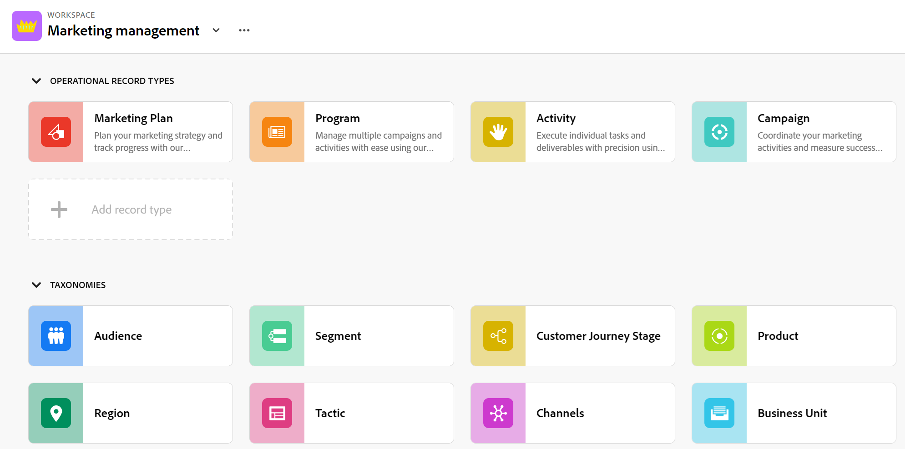
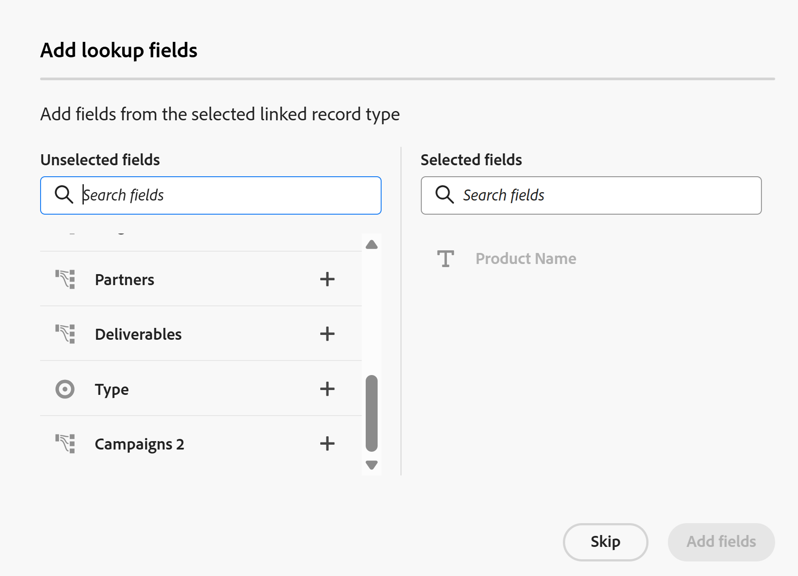

# Workfront Planning術語概觀

<!--do not use the snippet for IMPORTANT as it links to this article-->

<!--
The highlighted information on this page refers to functionality not yet generally available. It is available only in the Preview environment for all customers. After the release to Preview, the same features are also available monthly in the Production environment for customers who enabled fast releases.    

For information about fast releases, see [Enable or disable fast releases for your organization](/help/quicksilver/administration-and-setup/set-up-workfront/configure-system-defaults/enable-fast-release-process.md). 
-->

>[!IMPORTANT]
>
>本文資訊為Adobe Workfront Planning。 Workfront Planning是獨立產品，或是另外購買的Adobe Workfront功能。
>
>
>本文包含客戶同時購買Workfront或Workflow套件時，有關Workfront Planning的一般資訊。
>
>如需包含Workfront Planning檔案的完整文章清單，請參閱[Adobe Workfront Planning的一般資訊和文章索引](/help/quicksilver/planning/planning-information.md)。
>
>如需Workfront Planning作為獨立產品的詳細資訊，請參閱[開始使用Adobe Workfront Planning作為獨立產品](/help/quicksilver/planning/planning-sta/planning-sta-overview.md)。

雖然Workfront Planning是Workfront的一部分，但隨附專有概念和術語。 開始為組織設定Workfront規劃前，請務必熟悉這些概念。

Workfront Planning的架構可完全自訂。 您可以建立所有記錄型別、其屬性以及與其相關聯的任何欄位，以符合您組織的確切需求。

您可以建立的Workfront Planning物件數目存在限制。 如需詳細資訊，請參閱[Adobe Workfront Planning物件限制總覽](/help/quicksilver/planning/general/limitations-overview.md)。

以下是主要的Workfront Planning物件和概念：

* [工作區](#workspaces)
* [記錄類型](#record-types)
* [記錄](#records)
* [Workspace範本](#workspace-templates)
* [欄位](#fields)
* [連線的記錄型別、記錄和欄位](#connected-record-types-records-and-fields)
* [查詢欄位](#lookup-fields)
* [階層](#hierarchies)
* [檢視](#views)
* [自動化](#automations)
* [請求表單](#request-forms)

## 工作區

工作區代表組織單位的架構。 它們是記錄型別的集合，定義特定組織的作業生命週期。

如需詳細資訊，請參閱[建立工作區](/help/quicksilver/planning/architecture/create-workspaces.md)。

## 記錄類型

記錄型別是Workfront Planning中的物件型別。

記錄型別會填入工作區。

與Workfront （預先定義物件型別）不同，您可以在Workfront Planning中建立自己的物件型別。

例如，在Workfront中，已建立方案、Portfolio、專案、任務或問題的物件型別。

在Workfront Planning中，您可以建立符合組織工作流程的任何記錄型別。 稍後，您可以定義記錄型別如何相互關聯或表單相依性。

如需詳細資訊，請參閱[記錄型別概觀](/help/quicksilver/planning/architecture/overview-of-record-types.md)。

## 記錄

記錄是記錄型別的例項。

將記錄型別新增至工作區後，您就可以開始在記錄型別的頁面上新增該型別的記錄。

例如，「Campaign」可以是記錄型別，「Summer Campaign for EMEA」是Campaign記錄型別的記錄。

如需詳細資訊，請參閱[建立記錄](/help/quicksilver/planning/records/create-records.md)。

## Workspace範本

您可以使用預先定義的範本來建立工作區。 您可以使用範本中預先定義的記錄型別和欄位，也可以新增您自己的記錄型別和欄位。

Adobe Workfront Planning包含下列範本：

* Operations Initiative Studio
* Communications Planning Studio
* 基本：行銷管理
* 進階：行銷管理
* 企業：行銷管理
* 銷售管理
* 產品管理

系統管理員使用最佳實務、多空間範本時，也可以安裝6個工作區。 多空間範本包含下列範本，這些範本會同時產生6個獨立但連線的工作區：

* 1.全域分類與分類法
* 2.Fréscopa全球行銷
* 3.Fréscopa社交行銷
* 4.弗雷斯科帕媒體與公關
* 5.Fréscopa全球活動
* 6.Fréscopa執行公司領導力

如需詳細資訊，請參閱下列文章：

* [工作區範本清單](/help/quicksilver/planning/architecture/workspace-templates.md)。
* [建立工作區](/help/quicksilver/planning/architecture/create-workspaces.md)。

## 欄位

欄位是您可以新增到記錄型別的屬性。 欄位包含有關記錄型別的資訊。

有關記錄欄位的考量事項：

* 您為記錄型別新增的欄位會自動與該型別的所有記錄相關聯，並可用於擷取有關這些記錄的資料。

* 在套用至記錄型別頁面的「表格」檢視中，欄位會顯示為欄。 它們也會顯示在紀錄的頁面中。

* 欄位對記錄型別是唯一的，不會從一種記錄型別轉移到另一種記錄型別。

* 欄位可完全自訂，僅可在Workfront Planning中存取。 您無法從Workfront存取Workfront規劃欄位。

如需詳細資訊，請參閱[建立欄位](/help/quicksilver/planning/fields/create-fields.md)。

依預設，新的記錄型別與下列預先定義的欄位相關聯：

* 名稱
* 說明
* 開始日期
* 結束日期
* 狀態

您可以建立下列型別的自訂欄位：

* 單行文字
* 段落
* 多選
* 單選
* 日期
* 數字
* 百分比
* 貨幣
* 核取方塊
* 公式
* 人員
* 建立者
* 建立日期
* 上次修改者
* 上次修改日期
* 核准者
* 核准日期
* 記錄 ID

<!--update the screen shot above-->

## 連線的記錄型別、記錄和欄位

您可以在Workfront Planning中建立下列實體之間的連線：

* 兩種Workfront Planning記錄型別。
* 記錄型別和Workfront專案、方案、投資組合、公司或群組物件型別。
* 記錄型別和Adobe Experience Manager資產或資料夾。

  您必須擁有Adobe Experience Manager授權，才能將記錄型別與Experience Manager物件連線。

  

* 記錄型別和Adobe GenStudio for Performance Marketing品牌。

  您必須擁有Adobe GenStudio for Performance Marketing授權，才能將記錄型別與GenStudio品牌連線。

  

在記錄型別或記錄和物件型別之間建立連線後，可以將這些型別的個別記錄或物件彼此連線。 記錄之間的連線會顯示為已連線的記錄欄位或連線。

當有數種工作物件型別影響彼此時，連線記錄型別會很有幫助。 例如，您可以使用行銷活動，而每個行銷活動可能會迎合多個品牌。 若要指出此關係，您可以將行銷活動連結至品牌。 此外，每個行銷活動的工作可能會在Workfront的多個專案中進行規劃。 若要指出此問題，您可以將行銷活動連結至相關專案。 連線記錄型別，然後連線個別記錄，可在Workfront Planning中達成此關係。

## 查詢欄位

建立兩個記錄型別之間的連線並將個別記錄連線在一起後，您可以參照來自連線記錄之已連線記錄的欄位。

例如，如果您將Campaign記錄型別與Workfront專案物件型別連線，則可以在行銷活動記錄上顯示已連線專案的「預算」欄位。

>[!TIP]
>
>* 您無法從連線的記錄或物件型別將下列欄位型別新增為查閱欄位：
>
>   * 建立者
>   * 上次修改者
>   * Workfront預先輸入欄位（包括專案所有者或專案贊助者等欄位）
>

如需有關連線記錄型別、記錄和建立連結欄位的資訊，請參閱下列文章：

* [連線記錄型別](/help/quicksilver/planning/architecture/connect-record-types.md)
* [連接記錄](/help/quicksilver/planning/records/connect-records.md)

<!--
not yet:* Fields are reusable across Record Types.
-->

## 階層

在工作區中連線記錄型別後，您可以建立階層來組織這些連線。 階層將記錄和物件型別組織成父子關係，最多可包含四種物件型別。

如果兩個記錄型別之間的連線尚未存在，則可在您設定階層時建立該連線。 定義之後，階層會跨工作區內的相關記錄型別建立結構化路徑。

階層會為其各自的記錄產生階層連結，並顯示在它們的標題中。 如此一來，使用者就能在工作流程的任何階段知道自己在階層中的位置。

如需階層與階層連結的一般資訊，請參閱[階層與階層連結概觀](/help/quicksilver/planning/architecture/hierarchy-and-breadcrumb-overview.md)。

## 檢視

記錄會以不同的檢視型別顯示在各自的記錄型別頁面中。

檢視包含特定檢視型別的個人化設定，例如欄位清單（欄）、記錄清單（列）、其順序（排序）、套用或適用的篩選以及分組。

以下是您可以套用至記錄型別頁面的檢視型別：

* **資料表檢視**：以資料表格式顯示記錄及其欄位，包括連線和查詢欄位。 表格的列是個別記錄，欄是記錄欄位。 表格檢視是預設的檢視。

  

* **時間表檢視**：在時間軸中顯示至少有兩個日期型別欄位的記錄。 您最多可以在時間軸檢視中顯示5個連線的記錄型別及其記錄。

  

* **行事曆檢視**：以行事曆格式顯示至少有兩個日期型別欄位的記錄。
  

<!--
add List view here when it's possible to display Planning RTs in it??
-->

其他檢視：

* **清單檢視**：您可以在Workfront Planning的下列區域中，在清單檢視中顯示物件：

  * 專案已連線的頁面。
  * 請求表單清單

  

如需詳細資訊，請參閱[管理記錄檢視](/help/quicksilver/planning/views/manage-record-views.md)。

## 自動化

您可以在Adobe Workfront Planning中設定自動化，以便在啟動時，在從Planning記錄觸發時在Workfront Planning中建立記錄。 建立的記錄會自動連線到您觸發自動處理的記錄。

您可以在Workfront Planning的記錄型別頁面中設定並啟動自動化。

例如，您可以建立接受Workfront Planning行銷活動的自動化，並建立與行銷活動關聯的品牌。

有關如何使用現有的自動化建立物件的資訊，請參閱[使用Adobe Workfront Planning記錄自動化建立物件](/help/quicksilver/planning/records/create-wf-objects-using-planning-automations.md)。

## 請求表單

您可以建立請求表單，並將其與Adobe Workfront Planning中的記錄型別建立關聯。 然後，您可以與其他人共用表單，他們也可以提交請求以建立該型別的記錄。

如需詳細資訊，請參閱[在Adobe Workfront Planning中建立和管理要求表單](/help/quicksilver/planning/requests/create-request-form.md)。