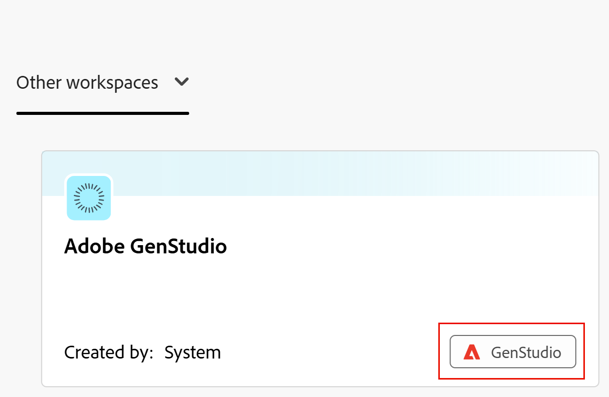

<!--
Better metadata, at publishing:
---
title: Get Started with the Workfront Planning and GenStudio for Performance Marketing Integration
description: The GenStudio for Performance Marketing workspace is available in Adobe Workfront Planning when your company has purchased both products. Learn some of the basics about how you can streamline your workflows using this integration.
feature: Workfront Planning
role: User, Admin
author: Alina
recommendations: noDisplay, noCatalog

---
-->

<!--use this article to make this one similar to it: https://experienceleague.adobe.com/en/docs/workfront/using/adobe-workfront-integrations/review-approval-integrations/wf-proof-and-genstudio-->

# 開始使用Adobe Workfront規劃和Adobe GenStudio for Performance Marketing整合

<!--
The information on this page refers to functionality not yet generally available. It is available only in the Preview environment for all customers. After the monthly releases to Production, the same features are also available in the Production environment for customers who enabled fast releases.    

For information about fast releases, see [Enable or disable fast releases for your organization](/help/quicksilver/administration-and-setup/set-up-workfront/configure-system-defaults/enable-fast-release-process.md). 
-->

同時使用Adobe Workfront Planning和Adobe GenStudio for Performance Marketing的組織通常會比GenStudio預設支援的更詳細地定義行銷概念，例如行銷活動、產品、啟用和角色。

GenStudio for Performance Marketing與Workfront Planning之間有原生整合。 此整合可讓Workfront Planning中的使用者管理GenStudio中使用的行銷活動、產品、角色、啟用、管道和區域。 它也能讓他們設定GenStudio，以參照Workfront Planning中的現有記錄型別，建立更連線且一致的行銷工作流程。

當貴公司同時購買這兩個產品時，即可在Adobe Workfront Planning中使用GenStudio for Performance Marketing工作區。

## Integration benefits

透過Workfront Planning與GenStudio for Performance Marketing的整合，您可以：

<!--check this list and ensure it's accurate and add/ remove some of the benefits-->

* 在Workfront Planning中檢視GenStudio工作區。
* Modify your campaigns, products, personas, and activations in GenStudio for Performance Marketing and have real-time updates of the same information in Workfront Planning.
* 在Workfront Planning中修改您的行銷活動、產品、角色和啟用，並在GenStudio for Performance Marketing中即時更新相同資訊。
* 避免重複資料輸入。
* 保持規劃和啟動工作的一致性。
* 將GenStudio品牌及其資訊連結至Workfront Planning記錄。

## 整合需求

您的組織必須符合下列要求，Workfront Planning與GenStudio for Performance Marketing之間的整合才能存在：

* Workfront和GenStudio for Performance Marketing必須啟用至相同的組織。

  如需GenStudio的詳細資訊，請參閱[Adobe GenStudio for Performance Marketing使用手冊](https://experienceleague.adobe.com/zh-hant/docs/genstudio-for-performance-marketing/user-guide/home)。

<!--No longer the case: * Your organization must have only one Workfront instance. GenStudio will not be available in Workfront Planning when your company has multiple Workfront instances. -->

<!--No longer needed to specify:
* Your Workfront instance is part of the Adobe Unified Experience, including using the Identity Management System (IMS). 

    For information, see [Adobe Unified Experience for Workfront](/help/quicksilver/workfront-basics/navigate-workfront/workfront-navigation/adobe-unified-experience.md).
-->

* Users using both Workfront Planning and GenStudio for Performance Marketing must belong to only one Workfront instance within the IMS organization.

  僅限Workfront的使用者可檢視GenStudio工作區，即使他們不是GenStudio for Performance Marketing使用者亦然。

<!--not sure: true for Planning? This is true for GenS and WF Proof: * The integration must be enabled in the Workfront Setup area.-->

## 存取權要求

下表說明搭配Adobe GenStudio for Performance Marketing使用Adobe Workfront Planning的存取和許可權需求：

<table style="table-layout:auto"> 
<col> 
</col> 
<col> 
</col> 
<tbody> 
    <tr> 
<tr> 
</tr>   
<tr> 
   <td role="rowheader">
Adobe Workfront 封裝
</td> 
   <td> 

任何Workfront和任何Planning套件
 
任何工作流程與任何Planning套件

如需每個Workfront Planning套件所含內容的詳細資訊，請聯絡您的Workfront客戶代表。 
 
   </td> 
   <tr> 
<td> 
   
 其他產品
 </td> 
   <td> 
   
 Adobe GenStudio for Performance Marketing
</td> 
  </tr>
  <tr> 
   <td role="rowheader">
Adobe Workfront授權
</td> 
   <td>
標準

   </td> 
  </tr> 
  <tr> 
   <td role="rowheader">
Adobe GenStudio for Performance Marketing user roles
</td> 
   <td>
<ul><li>存取行銷活動、產品和角色的任何GenStudio使用者角色</li>
   <li>GenSudio System Manager存取啟用 <!--and Events--></li></ul>
   如需詳細資訊，請參閱<a href="https://experienceleague.adobe.com/zh-hant/docs/genstudio-for-performance-marketing/user-guide/intro/user-roles">使用者角色和許可權</a>。 
   

  </td> 
  </tr>   
<tr> 
   <td role="rowheader">
物件許可權
</td> 
   <td>  
   
In Workfront Planning: 

   <ul>
   <li>
Manage permissions to the GenStudio workspace to add new fields or record types to the GenStudio workspace
</li>
   <li>
Contribute permissions to the GenStudio workspace to add, update, or delete records in the GenStudio workspace
 </li>  
   </ul>
   
No users can remove GenStudio for Performance Marketing record types or fields from the GenStudio workspace in Workfront Planning

   
In Adobe GenStudio for Performance Marketing: 

   <ul>
   <li>
 Any permissions in Adobe GenStudio for Performance Marketing
</li>
   <li>
 Create permissions in Adobe GenStudio for Performance Marketing to create items
</li></ul>
   </td>  
</tbody> 
</table>

For information about Adobe Workfront Planning access, see [Adobe Workfront Planning access overview](/help/quicksilver/planning/access/access-overview.md).

For more information about Adobe GenStudio for Performance Marketing, see [Adobe GenStudio for Performance Marketing User Guide](https://experienceleague.adobe.com/zh-hant/docs/genstudio-for-performance-marketing/user-guide/home).

<!--
Old:
<table style="table-layout:auto"> 
<col> 
</col> 
<col> 
</col> 
<tbody> 
    <tr> 
    <td role="rowheader">
Adobe Workfront package
</td> 
   <td> 

Any Workfront package

Any Planning package
  

   </td> </tr>
   <tr> 
<td> 
   
 Additional products
 </td> 
   <td> 
   
 Adobe GenStudio for Performance Marketing
</td> 
  </tr>
  <tr> 
   <td role="rowheader">
Adobe Workfront license
</td> 
   <td>
 Standard

  </td> 
  </tr> 
   
  <tr> 
   <td role="rowheader">
Adobe GenStudio for Performance Marketing user roles
</td> 
   <td>
<ul><li>Any GenStudio user role to access Campaigns, Products, and Personas</li>
   <li>GenSudio System Manager to access Activations ****and Events****</li></ul>
   For information, see <a href="https://experienceleague.adobe.com/zh-hant/docs/genstudio-for-performance-marketing/user-guide/intro/user-roles">User roles and permissions</a>. 
   

  </td> 
  </tr>   
<tr> 
   <td role="rowheader">
Object permissions
</td> 
   <td>  
   
In Workfront Planning: 

   <ul>
   <li>
Manage permissions to the GenStudio workspace to add new fields or record types to the GenStudio workspace
</li>
   <li>
Contribute permissions to the GenStudio workspace to add, update, or delete records in the GenStudio workspace
 </li>  
   </ul>
   
No users can remove GenStudio for Performance Marketing record types or fields from the GenStudio workspace in Workfront Planning

   
In Adobe GenStudio for Performance Marketing: 

   <ul>
   <li>
 Any permissions in Adobe GenStudio for Performance Marketing
</li>
   <li>
 Create permissions in Adobe GenStudio for Performance Marketing to create items
</li></ul>
   </td> 
  </tr> 
</tbody> 
</table>
-->

## Workfront Planning與GenStudio for Performance Marketing整合功能總覽

Depending on how many Workfront instances your organization has, you automatically have the following permissions to the GenStudio workspace in Planning:

<!--this table exists in the article Manage GenStudio workspace in Planning-->

<table style="table-layout:auto"> 
<col> 
</col> 
<col> 
</col> 
<tbody> 
    <tr> 
    <td role="rowheader">
一個Workfront例項
</td> 
   <td> 

可在您的Workfront Planning例項中看見GenStudio工作區

依預設，所有使用者（包括Workfront管理員）都擁有Planning中GenStudio工作區的「貢獻」存取權

Workfront管理員可以修改並將GenStudio工作區的管理許可權授予任何人

</td> </tr>
   <tr> 
<td> 
   
 多個Workfront例項
 </td> 
   <td> 
   
The following are the scenarios for when your organization has more than one instance of Workfront with Workfront Planning:

   <ul><li>If your company has multiple instances of Workfront at the moment when they purchase Adobe GenStudio for Performance Marketing, the GenStudio workspace is visible from all Workfront instances.</li>
   <li>If your company adds more Workfront instances after their original instance has already been integrated with Adobe GenStudio for Performance Marketing, the GenStudio workspace is visible only from the original Workfront instance. For information about connecting additional instance of Workfront to Adobe GenStudio, contact your account representative. </li></ul>    
</td> 
  </tr>
   </tbody> 
</table>

<!--
Old for the second row in the table:

The GenStudio workspace is visible from all Workfront instances

All users with access to GenStudio for Performance Marketing and Workfront Planning have Contribute permissions on the GenStudio in Planning by default
 

Workfront administrators cannot grant Manage permissions to the GenStudio workspace to anyone

-->

For information about Workfront Planning permissions, see [Overview of sharing permissions in Adobe Workfront Planning](/help/quicksilver/planning/access/sharing-permissions-overview.md).

The sections below describe the following:

* Capabilities for updating Workfront Planning information from GenStudio for Performance Marketing
* Capabilities for updating GenStudio for Performance Marketing information from Workfront Planning
* Limitations for what you can and cannot manage in a GenStudio workspace from Workfront Planning.

<!--maybe make 2 sections here once Iskuhi answers - one for one instance and one for multiple WF instances??-->

<!--add here a link from the GenS articles about what you can/ cannot do from GenStudio that might in the end reflect in Planning - this should come from the GenS team-->

### The GenStudio workspace in Workfront Planning

* GenStudio工作區會在Workfront Planning中顯示視覺指示器，將其識別為代表GenStudio for Performance Marketing工作區。

  Planning中的

  如需詳細資訊，請參閱[在Adobe Workfront規劃中管理GenStudio工作區](/help/quicksilver/planning/planning-and-genstudio-integration/manage-gen-studio-workspace-in-planning.md)。
* GenStudio工作區在Workfront Planning中建立後，會自動與所有同時擁有Workfront存取許可權的GenStudio使用者共用。
* As a workspace manager for the GenStudio workspace in Planning, you can:

   * Update the GenStudio workspace in Planning (name, description, icon)
   * 建立區段
   * 新增記錄型別
   * Share it with others

     >[!NOTE]
     >
     >* 您可以與沒有GenStudio帳戶的其他人共用GenStudio工作區。 您只能與組織之Identity Management系統(IMS)中的可用使用者共用。
     >* 您無法從GenStudio工作區或其記錄型別的共用中移除GenStudio使用者。

  <!--* Delete the workspace - check to see if this is possible; the link is there, but???-->

* When you have Contribute permissions to the GenStudio workspace in Planning, you cannot modify the workspace from Workfront Planning.

### GenStudio工作區中的記錄型別

* 在GenStudio for Performance Marketing和Planning中可見的記錄型別在Workfront Planning中具有GenStudio指標。

  Workfront Planning中的
* 在Planning中建立工作區時，GenStudio工作區中的記錄型別會自動與同時擁有Workfront存取權的所有GenStudio使用者共用。
* When you have Manage permissions to the GenStudio workspace in Planning, you can do the following from Workfront Planning:
   * 編輯GenStudio記錄型別資訊（其外觀、進階設定）。
   * 與其他人共用GenStudio記錄型別。 您無法從GenStudio記錄型別的共用中移除GenStudio使用者。
   * 建立記錄型別。 這些記錄型別僅保留在Workfront Planning中。 它們不會顯示在GenStudio中。
   * Enable record types from the GenStudio workspace to connect from other workspaces.
   * Enable record types from the GenStudio workspace to be added to other workspaces.
* When you have Contribute permissions to the GenStudio workspace in Planning, you cannot modify the GenStudio record types from Planning.

### Records in the GenStudio workspace

* All GenStudio records are automatically shared with all GenStudio users who also have access to Workfront when the workspace is created in Planning.
* When you edit GenStudio records from GenStudio for Performance Marketing, the changes are visible in the GenStudio workspace in all your instances of Workfront.
* You cannot create or delete Activation records from the GenStudio workspace in Workfront Planning.
* 當您在Planning中擁有GenStudio工作區的「管理」或「貢獻」許可權時，您可以從Workfront Planning執行下列動作：
   * 新增或刪除記錄，記錄便會顯示於GenStudio for Performance Marketing中（或從中移除）。

     Workfront Planning或GenStudio for Performance Marketing中的已刪除記錄會放入Workfront Planning最近刪除的資料匣中30天。 GenStudio for Performance Marketing沒有最近刪除的bin。
   * 從最近刪除的資料匣還原記錄。 Restoring deleted records places them back in Workfront Planning and GenStudio for Performance Marketing.
   * 以下列方式新增記錄：

      * 使用「新增記錄」按鈕，從任何檢視手動從頭開始
      * 透過在表格檢視中使用CSV或Excel檔案匯入它們
      * 手動，在Workfront Planning的任何檢視中
      * 透過在Workfront中向記錄型別請求表單提交請求。

  如需詳細資訊，請參閱[建立記錄](/help/quicksilver/planning/records/create-records.md)。
* You can edit record information on all records in the GenStudio workspace from Workfront Planning.

  For information, see [Edit records](/help/quicksilver/planning/records/edit-records.md).

### Record type fields in the GenStudio workspace

Record type fields are imported from GenStudio for Performance Marketing to Workfront Planning by default.

You can also create Planning fields for record types in the GenStudio workspace from Planning.

Consider the following about GenStudio record type fields:

* 當您在Planning中擁有GenStudio工作區的「管理」許可權時，您可以從Workfront Planning執行下列作業：

   * 編輯GenStudio欄位設定。
   * 建立GenStudio記錄型別的欄位。

     當您在Planning中為GenStudio記錄型別建立欄位時，可從下列區域看到這些欄位：

      * Workfront Planning檢視
      * Workfront Planning record details pages
      * GenStudio record details pages

     >[!TIP]
     >
     >Fields created in Workfront Planning are not visible in GenStudio lists.

   * Hide fields in the table view of a GenStudio record type in Workfront Planning.
   * You cannot delete fields created in GenStudio from Workfront Planning.

* When you have Contribute permissions to the GenStudio workspace in Planning:

   * You cannot edit field settings, delete or add fields from the GenStudio workspace in Workfront Planning.
   * You can hide fields from the table view in Workfront Planning.

#### The Created by and Approved by fields

* You can add the Created by and Approved by fields for the GenStudio record types in Workfront Planning from Workfront Planning.
* 在「管道」和「地區」記錄型別中顯示的記錄會將「系統」顯示為「建立者」。 在Workfront Planning中建立GenStudio工作區時，會自動建立這些記錄。
* 工作區在Workfront Planning中可供使用後，在GenStudio中建立的記錄將顯示在「建立者」欄位中建立記錄的IMS使用者名稱，即使該使用者在GenStudio中建立記錄且不是Workfront使用者。
* 當在Workfront Planning中提交請求表單以在GenStudio記錄型別中建立記錄時，「核准者」欄位會顯示核准者的名稱。
* The Created by and Approved by fields display in the records&#39; details in GenStudio for Performance Marketing. They do not display in the list view.

### 在GenStudio工作區中記錄檢視

>[!NOTE]
>
>The GenStudio record types display in the default table view imported from the GenStudio for Performance Marketing list view.
>
>您無法刪除預設從GenStudio for Performance Marketing匯入的原始表格檢視。

* 您無法在GenStudio for Performance Marketing中建立多個檢視。

* 當您在Planning中擁有GenStudio工作區的「管理」許可權時，您可以從Workfront Planning執行下列作業：

   * 建立GenStudio記錄型別的檢視。

     如需詳細資訊，請參閱[管理記錄檢視](/help/quicksilver/planning/views/manage-record-views.md)。

   * 重新命名、共用、匯出、複製或刪除GenStudio記錄型別中的任何自訂檢視。

* 當您在Planning中擁有GenStudio工作區的「貢獻」許可權時，您可以從Workfront Planning執行下列作業：

   * 建立GenStudio記錄型別的檢視。

     如需詳細資訊，請參閱[管理記錄檢視](/help/quicksilver/planning/views/manage-record-views.md)。

   * 重新命名、匯出、複製或刪除GenStudio記錄型別的自訂檢視。

     您無法在Workfront Planning中從GenStudio工作區共用檢視

### 在GenStudio工作區中記錄連線

您可以在您擁有管理許可權的GenStudio工作區中，建立不同記錄型別之間的連線。

您可以在GenStudio記錄型別與Workfront Planning中的其他記錄或物件型別之間建立下列連線：

* 兩種GenStudio記錄型別
* A GenStudio record type and a Planning record type from the same workspace
* A GenStudio record type and a Planning record type from another workspace, if the record types are configured to connect from another workspace.
* A GenStudio record type and a Workfront object type (projects, portfolios, programs, companies, groups)
* GenStudio記錄型別和AEM物件型別。
* GenStudio記錄型別和GenStudio品牌。 Brands連線依預設會新增至Products和Personas記錄型別。

### GenStudio記錄型別的請求表單和自動化

* 您可以在Workfront Planning中將請求表單新增至GenStudio記錄型別。

  如需詳細資訊，請參閱[在Adobe Workfront Planning中建立和管理要求表單](/help/quicksilver/planning/requests/create-request-form.md)。
* 您可以在Workfront Planning中設定GenStudio記錄型別的自動化。

  如需詳細資訊，請參閱[設定Adobe Workfront規劃自動化](/help/quicksilver/planning/records/configure-automations-to-create-records.md)。

### 從Workfront Planning工作區連線至GenStudio品牌

當貴組織整合Workfront Planning和Adobe GenStudio時，您可以從Workfront Planning中任何工作區內的任何記錄型別，將Planning記錄型別連結至GenStudio Brands。

品牌預設會連線至下列GenStudio工作區記錄型別：

* 產品
* 人物誌

品牌可用於手動連線到所有其他的GenStudio工作區記錄型別，或是來自您有權管理的所有其他工作區的記錄型別。

## The Preview environment

* The GenStudio workspace accessible from your Production environment also displays in your Preview environment of the same Workfront instance.
* You can perform all the activities described in this article on the GenStudio workspace in Workfront Planning in your Preview environment, but these changes will not be visible from GenStudio.

  Only changes you make to items in the Production environment sync between Workfront Planning and GenStudio.

  GenStudio does not have a Preview environment.

