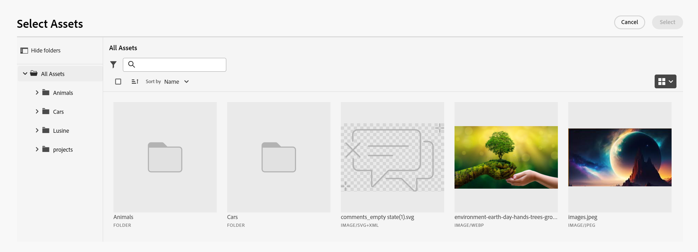

# 連接記錄

本頁醒目提示的資訊指出尚未普遍可用的功能。 它僅在預覽環境中可供所有客戶使用。 每月發行至生產環境後，生產環境中為啟用快速發行的客戶也提供相同的功能。

如需快速發行資訊，請參閱[為您的組織啟用或停用快速發行](/help/quicksilver/administration-and-setup/set-up-workfront/configure-system-defaults/enable-fast-release-process.md)。

{{planning-important-intro}}

您可以將Adobe Workfront Planning記錄彼此連線，或從其他應用程式連線至物件。 您可以在連線記錄時，顯示來自另一筆記錄的資訊。

本文會介紹如何連線記錄。 如需有關連線記錄的一般資訊，請參閱[連線記錄概觀](/help/quicksilver/planning/records/connected-records-overview.md)。

您必須先將兩個記錄型別彼此連線，或將記錄型別從另一個應用程式連線到物件型別。 這會建立連線的記錄欄位。 然後，您可以在連線的記錄欄位中，將記錄彼此連線，或將記錄從其他應用程式連線到其他物件。

連線記錄類似於將記錄從另一個應用程式連線到物件。

如需有關將記錄型別相互連線或從其他應用程式連線到物件型別的資訊，請參閱[連線記錄型別](/help/quicksilver/planning/architecture/connect-record-types.md)。

如需連線記錄型別的範例，請參閱[連線記錄型別和記錄的範例](/help/quicksilver/planning/architecture/example-connect-record-types-and-records.md)。

您可以連線下列專案：

* Adobe Workfront Planning相互記錄
* Adobe Workfront Planning會記錄其他應用程式的物件。

  您可以從下列應用程式將記錄與下列型別的物件連線：

   * Adobe Workfront

      * 專案
      * 專案組合
      * 計劃
      * 公司
      * 群組

   * Adobe Experience Manager Assets

      * 影像檔案
      * 資料夾

  <!--when you add more objects, fix the Access Requirements below which right now refer only to projects-->

## 存取需求

+++ 展開以檢視存取需求。

您必須具有下列存取權才能執行本文中的步驟：

<table style="table-layout:auto"> 
<col> 
</col> 
<col> 
</col> 
<tbody> 
    <tr> 
<tr> 
<td> 
   
 產品
 </td> 
   <td> 
   <ul><li>
 Adobe Workfront
</li> 
   <li>
 Adobe Workfront規劃
</li>
   <li>
Adobe Experience Manager Assets (如果要將AEM資產與Planning記錄連線)

   
您必須擁有Adobe Experience Manager Assets授權，以及AEM Assets與Workfront之間的整合。
    如需詳細資訊，請參閱<a href="/help/quicksilver/documents/adobe-workfront-for-experience-manager-assets-essentials/workfront-for-aem-asset-essentials.md">適用於Experience Manager Assets和Assets Essentials的Adobe Workfront：文章索引</a>。 

   </li>  
   </ul></td> 
  </tr>   
<tr> 
   <td role="rowheader">
Adobe Workfront計畫*
</td> 
   <td> 

下列任一Workfront計畫：
 
<ul><li>選取</li> 
<li>Prime</li> 
<li>Ultimate</li></ul> 

舊版Workfront計畫不提供Workfront計畫
 
   </td> 
<tr> 
   <td role="rowheader">
Adobe Workfront規劃套件*
</td> 
   <td> 

任何 
 

如需每個Workfront計畫包含內容的詳細資訊，請聯絡您的Workfront客戶經理。 
 
   </td> 
 <tr> 
   <td role="rowheader">
Adobe Workfront平台
</td> 
   <td> 

貴組織的Workfront例項必須上線至Adobe Unified Experience，才能存取Workfront Planning。
 

如需詳細資訊，請參閱<a href="/help/quicksilver/workfront-basics/navigate-workfront/workfront-navigation/adobe-unified-experience.md">適用於Workfront的Adobe Unified Experience</a>。 
 
   </td> 
   </tr> 
  </tr> 
  <tr> 
   <td role="rowheader">
Adobe Workfront授權*
</td> 
   <td> 標準
   
Workfront計畫不適用於舊版Workfront授權
 
  </td> 
  </tr> 
  <tr> 
   <td role="rowheader">
存取層級設定
</td> 
   <td> 
Adobe Workfront Planning物件沒有存取層級控制
 
   
檢視或更高許可權給您要從Workfront連結的物件型別。
   
</td> 
  </tr> 
<tr> 
   <td role="rowheader">
物件許可權
</td> 
   <td>   
為工作區和記錄型別貢獻或更高的許可權以連線記錄 
  
   
檢視工作區和記錄型別的或更高許可權，以檢視與其他應用程式之物件和欄位的所有連線，無論您在其他應用程式中的存取權為何。 

   
檢視或更高許可權給您要從Workfront或Experience Manager Assets連結的物件。 

   
系統管理員擁有所有工作區的許可權，包括他們未建立的工作區。
 </td> 
  </tr> 
<tr> 
   <td role="rowheader">
版面配置範本
</td> 
   <td> 
在生產環境中，所有使用者（包括系統管理員）都必須指派給包含Planning的版面配置範本。

在預覽環境中，標準使用者和系統管理員預設啟用Planning。
 </td> 
  </tr> 
</tbody> 
</table>

*如需Workfront存取需求的詳細資訊，請參閱Workfront檔案中的[存取需求](/help/quicksilver/administration-and-setup/add-users/access-levels-and-object-permissions/access-level-requirements-in-documentation.md)。

+++

## 連線記錄的考量事項

* 若要將記錄與其他記錄或物件連線，您必須具備下列條件：

   * 至少一個工作區、記錄型別和記錄。

     如需詳細資訊，請參閱下列文章：

      * [建立工作區](/help/quicksilver/planning/architecture/create-workspaces.md)
      * [建立記錄型別](/help/quicksilver/planning/architecture/create-record-types.md)
      * [建立記錄](/help/quicksilver/planning/records/create-records.md)

   * 記錄型別之間的連線，或記錄型別與其他應用程式物件之間的連線。 如需詳細資訊，請參閱[連線記錄型別](/help/quicksilver/planning/architecture/connect-record-types.md)。

* 您可以將一或多個記錄或物件彼此連線。 這取決於您在連線記錄或物件型別時選取的連線型別。 如需詳細資訊，請參閱[連線記錄型別概觀](/help/quicksilver/planning/architecture/connect-record-types-overview.md)。

## 從Workfront Planning連線記錄

您可以在Workfront Planning記錄的下列區域中連線記錄：

* 表格檢視中的已連線記錄欄位。
* 記錄的預覽方塊或頁面在詳細資訊索引標籤的已連線記錄欄位中。
* 記錄的預覽方塊或頁面（在連線標籤上）。
* 連線的記錄頁面索引標籤上的記錄頁面。

### 從記錄的表格檢視或詳細資訊區域連線Workfront Planning記錄

{{step1-to-planning}}

1. 按一下您要連線其記錄的工作區。

   工作區隨即開啟，且記錄型別會顯示為卡片。
1. 按一下記錄型別的卡片以開啟記錄型別頁面。
1. 按一下表格檢視的名稱以開啟它。
1. （選擇性）將記錄新增至表格的新列，以將記錄新增至您選取的記錄型別。 如需詳細資訊，請參閱[建立記錄](/help/quicksilver/planning/records/create-records.md)。
1. （視條件而定）將選取的記錄型別與其他記錄型別連線後，請移至記錄的已連線欄位，然後按一下該欄位內部，或按一下&#x200B;**連線**&#x200B;以新增記錄。

   

1. 執行下列其中一項：

   * 從清單中按一下已連線的記錄名稱，將其新增至選取的記錄。 記錄會自動新增。
   * 開始輸入記錄的名稱，並在它顯示在清單中時按一下它。 記錄會自動新增。

   >[!TIP]
   >
   >如果只選擇在記錄型別連線時顯示的記錄影像，則連線的欄位中只會顯示記錄的縮圖或圖示。 如需詳細資訊，請參閱[連線記錄型別](/help/quicksilver/planning/architecture/connect-record-types.md)。
   >

1. （條件式）如果您在連線記錄型別時為「連線」型別選取「一對多」或「一對一」，而您嘗試連線記錄或已在其他地方連線的物件，您將收到警告，再次連線會將其從原始連線中移除。 按一下&#x200B;**連線**&#x200B;以允許移除並連線記錄，或按一下&#x200B;**取消**&#x200B;返回欄位並選取其他記錄。
1. （選擇性）如果您找不到要連線的物件，而且您想要新增該物件，請按一下&#x200B;**+新增**

   或

   開始輸入物件的名稱，然後按一下&#x200B;**+新增**&#x200B;以建立並新增物件。

   如需詳細資訊，請參閱文章[建立記錄](/help/quicksilver/planning/records/create-records.md)中的「當您從其他記錄連線記錄時建立記錄」一節。

   >[!TIP]
   >
   >    您可以在表格檢視中執行下列動作，開啟記錄的頁面並連線其他記錄：
   >1. 按一下檢視中的記錄名稱。
   >1. 找到連結的記錄欄位，然後按兩下該欄位（如果已經有連線的記錄）
   >或
   >按一下&#x200B;**連線記錄** （如果欄位是空的）以從連線的記錄或物件型別新增記錄。
   >
   >

1. （選擇性）按一下&#x200B;**檢視全部**&#x200B;以顯示所有記錄。

1. （視條件而定）如果您在上一步中按一下&#x200B;**檢視全部**，會顯示&#x200B;**連線物件**&#x200B;方塊。

   

1. 開始在搜尋方塊中輸入記錄名稱，然後在清單中顯示記錄時選取記錄

   或

   在方塊中選取一或多個記錄的名稱，然後按一下[連線物件]。****

   新增下列專案：

   * 連結的記錄會顯示在您在上一步驟中所選記錄的連結記錄欄位中。
   * 如果您在連線記錄型別時新增連結查閱欄位，則連結欄位會填入來自連結記錄的資訊。

   更新連結的記錄會自動更新連結的記錄之連結欄位。 您無法手動編輯連結的欄位。

   >[!TIP]
   >
   >* 我們會交替使用「連結欄位」和「查詢欄位」。
   >
   >* 當您選擇在連線記錄型別時連線多個記錄時，來自多個物件的欄位值會以逗號分隔顯示，或根據您在連線記錄型別時選擇的彙總進行彙總。

1. （可選）關閉記錄型別頁面，然後移至您選取的工作區。
1. 按一下您所連結之記錄型別的卡片。

   例如，如果您已將&#x200B;**促銷活動**&#x200B;記錄與產品記錄連線，請按一下&#x200B;**產品**&#x200B;卡。

   記錄型別卡片應在表格檢視中開啟。 如果沒有，請選取表格檢視。

   請注意，**促銷活動**&#x200B;連結的記錄欄位會顯示您在「產品記錄型別」頁面中連結至產品的促銷活動名稱。 更新行銷活動資訊會自動更新產品記錄型別的行銷活動連結記錄欄位。

### 從表格檢視或記錄的詳細資訊區域，將Workfront Planning記錄連結至Workfront物件

<!--when we will have more applications to link to from Planning, change the title to something like: Connect Workfront Planning records to objects from other applications-->

在記錄型別和Workfront物件型別之間建立連線後，您可以將個別記錄連線到Workfront中的物件。 您連結的Workfront欄位會自動填入您連結物件的來源記錄中。

>[!NOTE]
>
>您無法從Workfront將Workfront物件型別與Workfront Planning記錄型別連線。

{{step1-to-planning}}

1. 按一下您要連線其記錄的工作區。

   工作區隨即開啟，且記錄型別會顯示為卡片。
1. 按一下記錄型別的卡片以開啟記錄型別頁面。
1. 從&#x200B;**檢視**&#x200B;下拉式功能表中選取&#x200B;**表格**&#x200B;檢視。

1. 按一下&#x200B;**新增記錄**，將個別記錄新增至您選取的記錄型別。 如需詳細資訊，請參閱[建立記錄](/help/quicksilver/planning/records/create-records.md)。

1. （視條件而定）將選取的記錄型別與Workfront物件型別連線後，請移至記錄上的已連線欄位，然後按一下該欄位，或按一下&#x200B;**連線**&#x200B;以新增Workfront物件。

   

1. 執行下列其中一項：

   * 按一下清單中的物件，將其新增至選取的記錄。 物件按字母順序列出。 物件會自動新增。
   * 開始輸入物件的名稱，當物件顯示在清單中時，按一下該物件。 物件會自動新增。

   >[!TIP]
   >
   >您可以從檢視開啟記錄頁面、連按兩下連結的記錄欄位，或按一下欄位中的&#x200B;**連線**&#x200B;以從連線的物件型別新增物件。

1. （選擇性）如果您找不到要連線的物件，而且您想要新增該物件，請按一下&#x200B;**+新增**

   或

   開始輸入物件的名稱，然後按一下&#x200B;**+新增**&#x200B;以建立並新增專案、投資組合或方案。

   如需詳細資訊，請參閱[從Workfront Planning建立Workfront物件](/help/quicksilver/planning/records/create-workfront-objects-from-workfront-planning.md)

1. （選擇性）按一下「檢視全部&#x200B;**」以顯示您至少擁有檢視許可權的所有物件。**

   如果您在上一個步驟中按一下「**檢視全部**」，則會顯示「**連線物件**」方塊。

   

1. 開始在搜尋方塊中輸入Workfront物件的名稱，然後在其顯示在清單中時選取它

   或

   在方塊中選取一或多個物件的名稱，然後按一下[連線物件]。****

   >[!IMPORTANT]
   >
   >* 您只能新增您有權檢視的Workfront物件。
   >
   >* 新增Workfront物件後，所有具有工作區檢視或更高許可權的人都可以檢視Workfront物件及其欄位資訊，無論他們在Workfront中的許可權或存取權為何。

   新增下列專案：

   * 選取的Workfront物件會新增至連結的記錄欄位。
   * 如果您在使用Workfront連線記錄型別時新增這些欄位，Workfront物件的連結欄位（或查詢欄位）會自動填入Workfront的資訊。

   如需有關連線記錄型別與另一個應用程式物件的詳細資訊，請參閱[連線記錄型別](/help/quicksilver/planning/architecture/connect-record-types.md)。

1. （選擇性）在表格檢視的連結欄位中，或從記錄頁面中的連結欄位中，按一下連線至Workfront Planning記錄的Workfront物件名稱。

   如果您至少有物件的檢視許可權，這會在Workfront中開啟Workfront物件。

   >[!TIP]
   >
   >* 當您選擇在連線記錄型別時連線多個記錄時，查閱欄位的值會以逗號分隔顯示，或根據您選擇的彙總器進行彙總。
   >
   >* Workfront中的連結Workfront物件不會建立連結記錄欄位。

1. （選擇性）從記錄型別的表格檢視中，暫留在連結Workfront物件的欄標題上，然後按一下下拉式功能表，然後按一下&#x200B;**編輯查閱欄位**。

1. 從&#x200B;**未選取的欄位**&#x200B;區域新增Workfront物件欄位

   或

   從&#x200B;**選取的欄位**&#x200B;區域移除Workfront物件欄位。

   這會新增或移除Workfront Planning記錄中的連結欄位。 與已移除欄位相關聯的資訊仍保留在Workfront中。

### 從表格檢視或記錄的詳細資訊區域，將Workfront Planning記錄連結至Adobe Experience Manager物件

<!--when we will have more applications to link to from Planning, change the title to something like: Connect Workfront Planning records to objects from other applications-->

>[!IMPORTANT]
>
>您必須擁有Adobe Experience Manager Assets授權，且貴組織的Workfront執行個體必須上線至Adobe商業平台或Adobe Admin Console，才能將Workfront Planning記錄連線至Adobe Experience Manager Assets。
>
>如果您對加入Adobe Admin Console有任何疑問，請參閱[Adobe統一體驗常見問題集](/help/quicksilver/workfront-basics/navigate-workfront/workfront-navigation/unified-experience-faq.md)。

在記錄型別和Adobe Experience Manager Assets之間建立連線後，您可以將個別記錄連線到Experience Manager資產。 當您建立連線時，您從Experience Manager Assets連線的資產欄位會自動填入您連結的記錄型別中。

>[!NOTE]
>
>當您的Experience Manager Assets管理員透過Workfront與Workfront之間的整合設定中繼資料對應時，可從Adobe Experience Manager Assets存取Planning記錄及其欄位。 如需詳細資訊，請參閱[設定Adobe Workfront與Experience Manager Assets之間的資產中繼資料對應](https://experienceleague.adobe.com/en/docs/experience-manager-cloud-service/content/assets/integrations/configure-asset-metadata-mapping)。

若要將記錄與Experience Manager資產連線：

{{step1-to-planning}}

1. 按一下您要連線其記錄的工作區。

   工作區隨即開啟，且記錄型別隨即顯示。
1. 按一下記錄型別的卡片以開啟記錄型別頁面。
1. 從記錄型別頁面右上角的&#x200B;**檢視**&#x200B;下拉式功能表中選取&#x200B;**表格**&#x200B;檢視。

1. （選擇性）按一下&#x200B;**新增記錄**&#x200B;以將新記錄新增至您選取的記錄型別。 如需詳細資訊，請參閱[建立記錄](/help/quicksilver/planning/records/create-records.md)。
1. （視條件而定）將選取的記錄型別與Experience Manager Assets連線後，請移至記錄上的已連線欄位，然後按一下該欄位，或按一下「**連線**」將Experience Manager資產新增至記錄，然後按一下「**+**」圖示。

   >[!TIP]
   >
   >  您可以在記錄頁面中的連結物件欄位中新增按一下&#x200B;**+**&#x200B;圖示，以將資產連線到記錄。

   **選取Assets**&#x200B;方塊隨即顯示。<!--we might change this to Connect assets-->

   

1. 按一下以選取下列部分資產型別：

   * 影像
   * 資料夾

   您可以選取多個資產。

   >[!IMPORTANT]
   >
   > 您只能連線您有權在Experience Manager中檢視的資產。 連線之後，所有Workfront Planning使用者都能在Workfront Planning中檢視資產，無論他們在Experience Manager Assets中的存取權為何。

1. 按一下&#x200B;**選取**。<!-- we might change this to Connect-->

   新增下列專案：

   * 選取的Experience Manager資產會新增至連結的記錄欄位。
   * 連結欄位（或查詢欄位）會填入來自Experience Manager連線資產的資訊。

     Experience Manager資產欄位中的任何現有資訊都會自動顯示在連結或查詢欄位中。

     >[!TIP]
     >
     >* 當您選擇在連線記錄型別時連線多個記錄時，多個物件的值會以逗號分隔或根據您選擇的彙總器彙總。
     >
     >* 連結至Workfront Planning連結記錄的連結記錄欄位不會在Experience Manager Assets應用程式中為連結的Experience Manager資產建立。

1. （可選）前往您連結至Experience Manager Assets的記錄型別，然後在連結的記錄欄位中按一下資產名稱。 資產的Experience Manager詳細資訊會顯示在快顯視窗中。

   

   影像檔案會顯示下列欄位：

   * 影像縮圖
   * 影像檔案名稱
   * 尺寸
   * 大小
   * 說明
   * Experience Manager中的檔案路徑
   * 資產型別
   * 建立日期
   * 修改日期

1. （可選）若要在Experience Manager中開啟Experience Manager資產記錄頁面，請前往您連結來源記錄的記錄型別頁面，在連結的記錄欄位中按一下資產名稱以開啟快顯視窗，然後按一下&#x200B;**在AEM中開啟**&#x200B;圖示以開啟資產。

   如此即會在Adobe Experience Manager Assets中開啟Experience Manager資產。

1. （選擇性）在記錄型別的表格檢視中，暫留在連結Experience Manager資產的欄標題上，按一下下拉式功能表，然後按一下&#x200B;**編輯查詢欄位**。

1. 從&#x200B;**未選取的欄位**&#x200B;區域新增Experience Manager Assets物件欄位

   或

   從&#x200B;**選取的欄位**&#x200B;區域移除Workfront物件欄位。

   這會新增或移除記錄中的連結欄位。 與已移除欄位相關的資訊仍保留在Adobe Experience Assets中。

### 從記錄頁面的「連線」索引標籤，將Workfront Planning記錄與其他記錄或物件連線

1. 移至記錄型別的任何檢視，該記錄型別已連線到其他Planning記錄型別或其他應用程式的物件型別。
1. 請依照先前子段落中所述的步驟，在檢視中尋找要與其他記錄或物件連線的記錄。
1. 按一下記錄名稱。

   預覽頁面隨即開啟。
1. （選擇性）按一下&#x200B;**在新標籤中開啟**&#x200B;圖示以開啟紀錄的頁面。
1. 按一下記錄預覽或頁面中的&#x200B;**連線**&#x200B;索引標籤。

   在Workfront Planning中記錄的

   連結至所選記錄型別的所有記錄或物件型別都會顯示為區段。 已連線的記錄或物件會顯示在卡片上的記錄或物件型別名稱下。

   >[!TIP]
   >
   >    依預設，只會顯示已連線個別記錄的已連線記錄。

1. （選擇性）按一下[顯示所有連線]****&#x200B;以顯示所有連線的記錄型別，包括沒有連線記錄的記錄型別。

1. （選擇性）按一下區段左側的向下箭頭以收合區段。

1. （視條件而定）按一下&#x200B;**連線**&#x200B;以新增更多相同型別的記錄或物件。
1. （選擇性）如果您找不到要連線的記錄或物件，而且您想要新增該記錄或物件，請按一下[新增] **+**

   或

   開始輸入物件的名稱，然後按一下&#x200B;**+新增**&#x200B;以建立物件並將其新增到記錄中。

   如需詳細資訊，請參閱文章[建立記錄](/help/quicksilver/planning/records/create-records.md)中的「當您從其他記錄連線記錄時建立記錄」一節。
1. 請依照前幾節所述的步驟，從Workfront Planning連線記錄，或從Workfront或Experience Manager Assets連線物件。
記錄與物件會立即新增。
1. （選擇性）將滑鼠停留在記錄或物件的連線卡片上，然後按一下&#x200B;**中斷連線記錄**&#x200B;圖示，將其與選取的記錄中斷連線。

   

   記錄會立即與Workfront Planning的所有區域或其可能顯示為已連線的其他應用程式中斷連線。 任何查詢欄位值也會被移除。

### 從記錄的連線記錄頁面連線記錄

1. 移至記錄型別的任何檢視，該記錄型別已連線到其他Planning記錄型別或其他應用程式的物件型別。
1. 請依照先前子段落中所述的步驟，在檢視中尋找要與其他記錄或物件連線的記錄。
1. 按一下記錄名稱。

   預覽頁面隨即開啟。
1. 按一下&#x200B;**在新標籤中開啟**&#x200B;圖示以開啟紀錄的頁面。
1. 按一下記錄頁面中現有的連線記錄頁面索引標籤。 您必須先建立連線的記錄頁面。 如需詳細資訊，請參閱[管理記錄頁面配置](/help/quicksilver/planning/records/manage-the-record-page.md)。

   表格檢視中會顯示已連線的記錄型別頁面。

   表格中會顯示一種型別的所有連線記錄。
1. 按一下&#x200B;**連線**&#x200B;以新增或移除記錄。

   連線記錄詳細資訊索引標籤中反白的
1. （選擇性）如果找不到已連線的記錄，請按一下[新增] **+ [新增]**&#x200B;來建立並連線它們。

## 從Workfront物件連線記錄

您必須具備下列專案，才能從Workfront物件連線Workfront Planning記錄：

* 在Workfront Planning中建立的記錄型別與Workfront物件型別之間的連線。
* 您的Workfront或群組管理員必須將下列任一專案新增至Workfront物件型別：

   * 「版面配置範本」中Workfront專案、投資組合和方案的規劃區段。

   * Planning將自訂欄位連線到下列其中一個物件的自訂表單：

      * 專案
      * 專案組合
      * 方案
      * 群組
      * 公司

  如需詳細資訊，請參閱[管理來自Workfront物件的記錄連線](/help/quicksilver/planning/records/manage-records-in-planning-section.md)。
