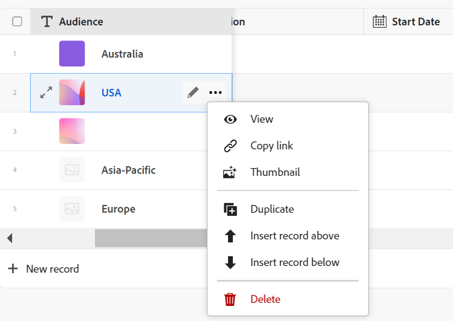

# 建立記錄

本頁醒目提示的資訊指出尚未普遍可用的功能。 它僅在預覽環境中可供所有客戶使用。 每月發行至生產環境後，生產環境中為啟用快速發行的客戶也提供相同的功能。

如需快速發行資訊，請參閱[為您的組織啟用或停用快速發行](/help/quicksilver/administration-and-setup/set-up-workfront/configure-system-defaults/enable-fast-release-process.md)。

{{planning-important-intro}}

在Adobe Workfront Planning中，記錄是記錄型別的例項。

您可以執行下列其中一項作業來建立記錄：

* [從記錄型別表格檢視中內嵌新增記錄，以建立記錄](#create-records-by-adding-them-inline-from-the-record-type-table-view)
* [使用任何記錄型態檢視中的「新增記錄」或「請求記錄」按鈕來建立記錄](#create-records-using-the-new-record-or-request-record-button-from-any-record-type-view)
* [從外部清單複製並貼上記錄清單](#create-records-by-copying-and-pasting-them-from-an-external-list)
* [從表格檢視複製記錄](#create-records-by-duplicating-them)
* [從其他記錄連線記錄時建立記錄](#create-records-as-you-connect-them)
* [透過向記錄型別提交請求表單來建立記錄](#create-records-by-submitting-a-request-form-to-a-record-type)
* [從CSV或Excel檔案匯入資訊，以建立記錄](#create-records-by-importing-records-from-a-csv-or-excel-file)
* [使用自動化建立記錄](#create-records-by-using-automations)

如需有關管理表格或時間表檢視中的記錄的資訊，請參閱下列文章：

* [管理表格檢視](/help/quicksilver/planning/views/manage-the-table-view.md)
* [管理時間表檢視](/help/quicksilver/planning/views/manage-the-timeline-view.md)

## 存取需求

+++ 展開以檢視存取需求。

您必須具有下列存取權才能執行本文中的步驟：

<table style="table-layout:auto"> 
<col> 
</col> 
<col> 
</col> 
<tbody> 
    <tr> 
<tr> 
<td> 
   
 產品
 </td> 
   <td> 
   <ul><li>
 Adobe Workfront
</li> 
   <li>
 Adobe Workfront規劃
</li></ul></td> 
  </tr>   
<tr> 
   <td role="rowheader">
Adobe Workfront計畫*
</td> 
   <td> 

下列任一Workfront計畫：
 
<ul><li>選取</li> 
<li>Prime</li> 
<li>Ultimate</li></ul> 

舊版Workfront計畫不提供Workfront計畫
 
   </td> 
<tr> 
   <td role="rowheader">
Adobe Workfront規劃套件*
</td> 
   <td> 

任何 
 

如需每個Workfront計畫包含內容的詳細資訊，請聯絡您的Workfront客戶經理。 
 
   </td> 
 <tr> 
   <td role="rowheader">
Adobe Workfront平台
</td> 
   <td> 

貴組織的Workfront例項必須上線至Adobe Unified Experience，才能存取Workfront Planning。
 

如需詳細資訊，請參閱<a href="/help/quicksilver/workfront-basics/navigate-workfront/workfront-navigation/adobe-unified-experience.md">適用於Workfront的Adobe Unified Experience</a>。 
 
   </td> 
   </tr> 
  </tr> 
  <tr> 
   <td role="rowheader">
Adobe Workfront授權*
</td> 
   <td> 標準
   
Workfront計畫不適用於舊版Workfront授權
 
  </td> 
  </tr> 
  <tr> 
   <td role="rowheader">
存取層級設定
</td> 
   <td> 
Adobe Workfront Planning沒有存取層級控制
 
   
在您將記錄連線到要建立的物件型別（專案、方案和投資組合）時，在Workfront中編輯其存取權。 
  
</td> 
  </tr> 
<tr> 
   <td role="rowheader">
物件許可權
</td> 
   <td> 
對工作區和要新增記錄的記錄型別貢獻或更高的許可權。 

   
檢視工作區和記錄型別的或更高許可權，以使用記錄頁面上的[要求記錄]按鈕建立記錄

   
系統管理員擁有所有工作區的許可權，包括他們未建立的工作區

   
管理Workfront物件（專案組合）的許可權以新增子物件（專案）。

   </td> 
  </tr> 
<tr> 
   <td role="rowheader">
版面配置範本
</td> 
   <td> 
必須為所有使用者(包括Workfront管理員)指派一個版面配置範本，該範本包含主功能表中的Planning區域 
 </td> 
  </tr> 
</tbody> 
</table>

*如需Workfront存取需求的詳細資訊，請參閱Workfront檔案中的[存取需求](/help/quicksilver/administration-and-setup/add-users/access-levels-and-object-permissions/access-level-requirements-in-documentation.md)。

+++

## 從記錄型別表格檢視中內嵌新增記錄，以建立記錄

您可以在記錄型別頁面的表格檢視中建立記錄，因為您是內嵌新增它們。

如需有關編輯記錄資訊的資訊，請參閱[編輯記錄](/help/quicksilver/planning/records/edit-records.md)。

{{step1-to-planning}}

1. 按一下您要新增記錄的工作區。

   工作區隨即開啟，且記錄型別會顯示為卡片。

1. 按一下記錄型別卡。 如需有關建立記錄型別的資訊，請參閱[建立記錄型別](/help/quicksilver/planning/architecture/create-record-types.md)。

   記錄型別頁面會在您上次存取的檢視中開啟。 依預設，會在表格檢視中開啟記錄型別頁面。
所選型別的記錄會顯示在檢視中。

1. （視條件而定）從表格檢視中，執行下列任一項作業：

   * 在表格的最後一列或群組的最後一筆記錄之後，按一下&#x200B;**新增記錄**

     >[!TIP]
     >
     >當您在分組或子分組中的最後一個記錄之後新增記錄時，Workfront會自動填入分組中包含的欄位。 如有需要，您可以手動編輯這些欄位，記錄可能會從分組中移除。

   * 在表格的任何欄或列按一下鍵盤上的&#x200B;**Shift + Enter**。 這會在您開始的記錄底下新增一個空白列。
   * 暫留在記錄的主要欄位上，按一下欄位右邊的&#x200B;**更多**&#x200B;功能表，然後按一下&#x200B;**插入上方記錄**&#x200B;或&#x200B;**插入下方記錄**。

   加入新的行銷活動

   Workfront會自動上傳縮圖至每筆新記錄。 您稍後可以修改這些影像。 如需詳細資訊，請參閱[新增封面影像至記錄](/help/quicksilver/planning/records/add-a-cover-image-to-a-record.md)。

   新記錄會新增至表格中。

1. 按一下新記錄的主要欄位

   或

   按一下記錄名稱左邊的&#x200B;**開啟詳細資料**&#x200B;圖示。

   預覽方塊會在表格中開啟。

1. 開始在您在預覽方塊中看到的欄位中輸入有關新記錄的資訊。

   >[!NOTE]
   >
   >  * 記錄沒有必填欄位。 不過，我們建議您為記錄的主要欄位新增資訊，因為將記錄連結至彼此時，識別記錄會很有幫助。 如需主要欄位的詳細資訊，請參閱[管理資料表檢視](/help/quicksilver/planning/views/manage-the-table-view.md)和[主要欄位概述](/help/quicksilver/planning/fields/primary-field-overview.md)。
   >
   >  * 參考其他記錄型別或計算欄位的欄位為唯讀欄位。

1. （條件式）在表格中新增記錄時，在開啟記錄的預覽方塊之前，繼續新增每列的資訊，然後按一下鍵盤上的&#x200B;**Enter**&#x200B;以儲存變更。

   或

   按一下新記錄的名稱或&#x200B;**開啟詳細資料**&#x200B;圖示以開啟預覽方塊，並在詳細資料區域中編輯記錄的資訊。

   >[!TIP]
   >
   >當「名稱」欄位是主要欄位時，您只能從記錄的名稱欄位存取&#x200B;**開啟詳細資料**&#x200B;圖示。

1. （選擇性）從記錄的預覽方塊中，按一下&#x200B;**在新標籤中開啟**&#x200B;圖示以在新標籤中開啟記錄的頁面。 繼續編輯記錄頁面上的記錄。 如需詳細資訊，請參閱[編輯記錄](/help/quicksilver/planning/records/edit-records.md)。

   Workfront會自動儲存您的變更。

1. （選擇性）關閉預覽方塊，或按一下記錄名稱左側的返回箭頭（如果您已開啟記錄的頁面）。

1. （可選）在表格檢視中新增記錄或其資訊時，請使用下列鍵盤快速鍵來復原或重做新增記錄或其資訊：

   * CTRL + Z (⌘ + Z代表Mac)可復原變更
   * 按CTRL + Shift + Z (⌘ + Shift + Z代表Mac)以重做變更

## 使用任何記錄型態檢視中的「新增記錄」或「請求記錄」按鈕來建立記錄

具有工作區<!--and record type-->檢視許可權的使用者只能使用記錄型別頁面上的[要求記錄]按鈕來建立記錄。

對工作區<!--and record type-->具有Contribute和「管理」許可權的使用者，可以使用記錄型別頁面上的「新增記錄」按鈕來建立記錄。
<!--did the permissions to record types get released?? if not, take the record type reference here out; AND else-where in this article, including access requirements table-->

>[!IMPORTANT]
>
>工作區管理員必須為記錄型別建立請求表單，以便擁有檢視許可權的使用者使用請求表單新增記錄。 否則，檢視許可權使用者無法建立記錄。

{{step1-to-planning}}

1. 按一下您要新增記錄的工作區。

   工作區隨即開啟，且記錄型別會顯示為卡片。

1. 按一下記錄型別卡。 如需有關建立記錄型別的資訊，請參閱[建立記錄型別](/help/quicksilver/planning/architecture/create-record-types.md)。

   記錄型別頁面會在您上次存取的檢視中開啟。 依預設，會在表格檢視中開啟記錄型別頁面。
所選型別的所有記錄都會顯示在檢視中。

1. （視條件而定）根據工作區<!--and record type-->許可權，從任何檢視按一下畫面右上角的下列專案：

   * 如果您在工作區&#x200B;**上有Contribute或更高的許可權，請按一下**&#x200B;新增記錄<!--and record type-->

     或

   * 若您擁有工作區&#x200B;**的檢視許可權，請按一下**&#x200B;要求記錄<!--and record type-->。

1. （視條件而定）如果您按一下&#x200B;**新記錄**，請執行下列動作：

   1. 按一下下列其中一個方式來建立記錄，然後按一下[繼續]&#x200B;**&#x200B;**：

      * **手動新增**。 記錄的預覽方塊開啟。\
        從步驟6開始，新增記錄的相關資訊，如[從本文中的記錄型別資料表檢視](#create-records-by-adding-them-inline-from-the-record-type-table-view)區段內嵌新增記錄，以建立記錄中所述。<!--insure this stays accurate-->
      * **從檔案上傳**
新增記錄，如文章[中所述。從步驟6開始，從CSV或Excel檔案匯入資訊來建立記錄](/help/quicksilver/planning/records/import-file-to-create-records.md)。<!--ensure this stays accurate-->
      * **提交要求**
記錄型別的請求表單隨即開啟。

        工作區管理員必須建立請求表單，才能使用請求表單新增記錄。

        >[!TIP]
        >
        >某些記錄型別可能具有多個表單。 按一下其中一個以開啟它。

        新增記錄，如文章[提交Adobe Workfront Planning要求以建立記錄](/help/quicksilver/planning/requests/submit-requests.md)中所述，從步驟6開始。<!--ensure this stays accurate-->

      

1. （視條件而定）如果您按一下&#x200B;**要求記錄**，請執行下列動作：

   1. （視條件而定）如果記錄型別有多個請求表單，請按一下其中一個以選擇它。
   2. 繼續新增表單中的資訊以建立記錄，如文章[提交Adobe Workfront Planning請求以建立記錄](/help/quicksilver/planning/requests/submit-requests.md)中所述，從步驟6開始。<!--ensure this stays accurate-->

1. （視條件而定）複查新記錄。

   根據您選擇新增記錄的方式，可能會發生以下一些情況：

   * 新記錄會新增至記錄型別，除非您選擇使用具有核准流程的請求表單來新增記錄。 建立記錄之前，核准者必須獲得所有核准者的核准。
   * 如果您使用CSV或Excel試算表新增記錄，系統會將多個記錄新增至記錄型別。
   * 如果您透過提交請求表單來新增請求，則會在Workfront請求區域的Planning標籤中新增請求。

<!-- this is not possible anymore: 

## Create records by connecting them from another application

You can import records from other applications by linking them to existing records. This creates a linked record for the other application's connected object. 

1. Create a record type, as described in the [Create record types](/help/quicksilver/planning/architecture/create-record-types.md).

1. Create records for the record type you created in the previous step. For information, see the section [Create records by manually adding them to a record type](#create-records-by-manually-adding-them-to-a-record-type) in this article. 

1. Create a connection to an object type from another application for the record type you created. For information, see [Connect record types](/help/quicksilver/planning/architecture/connect-record-types.md).

1. Add objects from another application to the records you created above using the linked record field you created in the previous step. For information, see [Connect records](/help/quicksilver/planning/records/connect-records.md). 

    The following items are created in Workfront Planning:

    * A read-only record type that refers to the other application's record type you linked to in the connected record field. 

      For example, if you connect a Planning record type to Workfront project, a read-only record type named "Workfront project" is created in the same workspace. You can access the read-only Workfront record types from the table view of the Planning records you're linking from. 
   
-->

## 從外部清單複製並貼上記錄，以建立記錄

1. 開始在[資料表]檢視中建立記錄，如本文[將記錄手動新增至記錄型別](#create-records-by-manually-adding-them-to-a-record-type)以建立記錄一節中所述。

   確定表格檢視具有您要填入新記錄資訊的欄（或欄位）。

1. 在表格的最後一列按一下&#x200B;**新增&lt;記錄型別名稱>**，新增您想要的新記錄至表格的所有新列。

   例如，如果要從另一個應用程式貼上10筆新記錄的資訊，請將10列新增到表格檢視中。

1. 在另一個應用程式中，建立您要匯入的記錄清單。

   例如，您可以使用Excel試算表來建立清單。

   清單應包含表格格式的資訊。

   >[!TIP]
   >
   > 清單的欄應包含您在Workfront中擁有的現有欄位資訊。
   >
   > 確定您已在Workfront中建立所需欄位，且工作表中的資訊以符合Workfront中每個欄位資訊的正確格式顯示。

1. 從另一個應用程式中，選取數個列和欄，然後將資訊貼到記錄型別表格檢視中，從第一個新記錄開始。

   下列資訊會匯入Workfront Planning區域：

   * 列包含新記錄
   * 欄會填入記錄欄位的資訊。

## 複製記錄以建立記錄

如需複製記錄的資訊，請參閱[複製記錄](/help/quicksilver/planning/records/copy-or-duplicate-records.md)。

## 連線時建立記錄

當您從其他記錄連線下列物件型別時，可以建立這些物件型別：

* Workfront Planning記錄
* Workfront物件

本節說明當您從其他記錄連線時，如何建立Workfront Planning記錄。

>[!NOTE]
>
>當您將Workfront專案與產品組合連線至Workfront Planning記錄時，建立這些專案與產品組合與當您從其他記錄連線時，建立Planning記錄類似。
>
>如需有關從Workfront Planning建立Workfront物件的資訊，請參閱當您將Workfront物件連線至記錄時[從Workfront Planning建立物件](/help/quicksilver/planning/records/create-workfront-objects-from-workfront-planning.md)。

您必須具備下列條件，才能透過從現有記錄連線來新增記錄：

* 連線的記錄型別。 如需詳細資訊，請參閱[連線記錄型別](/help/quicksilver/planning/architecture/connect-record-types.md)。
* 記錄。
* Workfront Planning和Workfront中的正確存取和許可權，如本文中[存取需求](#access-requirements)一節所述。

若要在連線其他記錄時建立記錄，請執行下列動作：

1. 開始連線Workfront Planning記錄，如文章[連線記錄](/help/quicksilver/planning/records/connect-records.md)中所述。 您可以從下列區域連線記錄：

   * Workfront Planning下列區域的連線欄位：

      * 表格檢視
      * 記錄的詳細資訊頁面或預覽方塊

   * Workfront中專案、投資組合或方案的「計畫」區段中的連線欄位。

     如需詳細資訊，請參閱[管理來自Workfront物件的記錄連線](/help/quicksilver/planning/records/manage-records-in-planning-section.md)。

1. （視條件而定）如果嘗試連線時找不到記錄，請按一下[新增] **+ [新增]**

   或
開始輸入名稱，然後按一下&#x200B;**+新增**。 **+新增**&#x200B;按鈕後面接著您連線的記錄型別名稱。 例如，將品牌新增至現有行銷活動時，「新增品牌」。 您輸入的名稱也會跟著新增按鈕。

   

   記錄已建立並新增至連線的記錄欄位。

   >[!IMPORTANT]
   >
   >* 從記錄連線專案、專案組合和方案時，您只能在Workfront中建立它們。
   >
   >* 從Workfront Planning中的記錄連線群組或公司時，您無法建立群組或公司。
   > 

1. （選擇性）移至您建立其記錄的記錄型別的表格檢視。 新記錄會顯示在檢視的最後一列。
1. （選擇性）開始為表格檢視中的新記錄新增資訊
或
按一下其名稱以開啟詳細資訊頁面並在其中新增資訊。

## 透過向記錄型別提交請求表單來建立記錄

當有人建立記錄型別的請求表單並與您共用連結後，您可以提交建立該記錄型別記錄的請求。

如需詳細資訊，請參閱[在Adobe Workfront Planning中建立和管理要求表單](/help/quicksilver/planning/requests/create-request-form.md)。

如果您的Workfront使用者與組織外部的使用者具有請求表單的連結，則他們皆可提交請求給Planning記錄型別並建立記錄。

如需詳細資訊，請參閱[提交Adobe Workfront Planning要求以建立記錄](/help/quicksilver/planning/requests/submit-requests.md)。

## 從CSV或Excel檔案匯入記錄型別時建立記錄

當您使用CSV或Excel檔案匯入記錄型別時，可以匯入記錄。

如需詳細資訊，請參閱[建立記錄型別](/help/quicksilver/planning/architecture/create-record-types.md)。

## 從CSV或Excel檔案匯入記錄，以建立記錄

從CSV或Excel檔案匯入資訊時，您可以匯入現有記錄型別的記錄。

如需詳細資訊，請參閱[從CSV或Excel檔案匯入資訊，以建立記錄](/help/quicksilver/planning/records/import-file-to-create-records.md)。

## 使用自動化建立記錄

您可以在Workfront Planning中設定自動化，以便在啟動時從Planning記錄觸發時建立記錄。 建立的記錄會自動連線到您觸發自動處理的記錄。

您可以在Workfront Planning中設定並啟動記錄頁面中的自動化。 建立的已連線記錄會放置在您執行自動化時所使用的記錄型別已連線欄位中。

如需詳細資訊，請參閱[使用Adobe Workfront Planning記錄自動化建立物件](/help/quicksilver/planning/records/create-wf-objects-using-planning-automations.md)。

