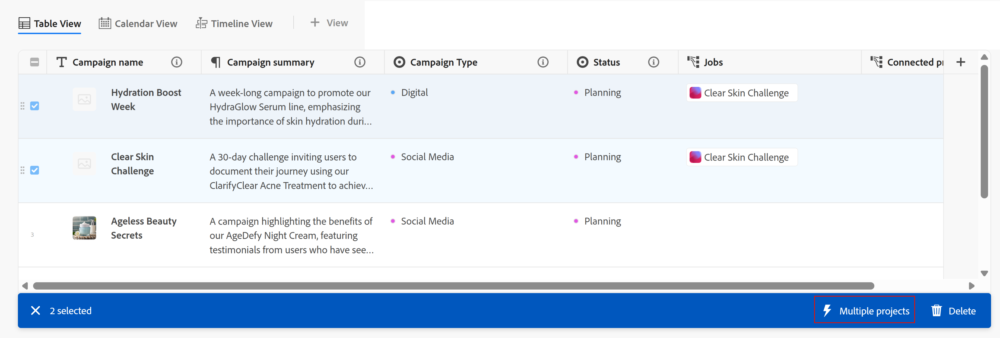

# 使用Adobe Workfront Planning記錄自動化建立物件

<!--add screen shots when UI is finalized AND redo all the steps - some things got changed and moved around-->

<!--you might need to add something about notifications and emails?!-->
<!--add a new section to this article to mention a new way to create objects: help/quicksilver/planning/records/create-records.md-->
<!-- add a new section to this article to mention a new way to create WF objects from Planning: help/quicksilver/planning/records/create-workfront-objects-from-workfront-planning.md-->

<!-- if they give access to use the automation to people with LESS than Manage permissions to a workspace, split this article in two: the Configure section should be for admins and the "Use a Workfront Planning automation to create an object" should be for all other users-->

此頁面上的資訊是指尚未普遍提供的功能。 它僅在預覽環境中可供所有客戶使用。 每月發行至生產環境後，生產環境中為啟用快速發行的客戶也提供相同的功能。

如需快速發行資訊，請參閱[為您的組織啟用或停用快速發行](/help/quicksilver/administration-and-setup/set-up-workfront/configure-system-defaults/enable-fast-release-process.md)。

您可以在Adobe Workfront Planning中設定自動化，以便在從Planning記錄觸發時，在Workfront中建立物件或Workfront Planning中的記錄。 建立的物件或記錄會自動連線至您觸發自動處理的記錄。

您可以在Workfront Planning的記錄型別頁面中設定並啟動自動化。 建立的已連線物件會放置在您執行自動化時所使用的記錄型別已連線欄位中。

例如，您可以建立採用Workfront Planning行銷活動的自動化，並在Workfront中建立專案以追蹤該行銷活動的進度。 此專案會連結至行銷活動上「已連線的專案」欄位中的Workfront規劃行銷活動。

如需有關連線記錄的詳細資訊，請參閱[連線記錄總覽](/help/quicksilver/planning/records/connected-records-overview.md)。

您可以在Workfront Planning中使用自動化來建立下列專案：

* 一或多個專案
* 群組
* 計畫
* 投資組合
* 專案
* A記錄

## 存取需求

+++ 展開以檢視存取需求。

您必須具有下列存取權才能執行本文中的步驟：

<table style="table-layout:auto"> 
<col> 
</col> 
<col> 
</col> 
<tbody> 
    <tr> 
<tr> 
<td> 
   
 產品
 </td> 
   <td> 
   <ul><li>
 Adobe Workfront
</li> 
   <li>
 Adobe Workfront規劃
</li></ul></td> 
  </tr>   
<tr> 
   <td role="rowheader">
Adobe Workfront計畫*
</td> 
   <td> 

下列任一Workfront計畫：
 
<ul><li>選取</li> 
<li>Prime</li> 
<li>Ultimate</li></ul> 

舊版Workfront計畫不提供Workfront計畫
 
   </td> 
<tr> 
   <td role="rowheader">
Adobe Workfront規劃套件*
</td> 
   <td> 

任何 
 

如需每個Workfront計畫包含內容的詳細資訊，請聯絡您的Workfront客戶經理。 
 
   </td> 
 <tr> 
   <td role="rowheader">
Adobe Workfront平台
</td> 
   <td> 

貴組織的Workfront例項必須上線至Adobe Unified Experience，才能存取Workfront Planning的所有功能。
 

如需詳細資訊，請參閱<a href="/help/quicksilver/workfront-basics/navigate-workfront/workfront-navigation/adobe-unified-experience.md">適用於Workfront的Adobe Unified Experience</a>。 
 
   </td> 
   </tr> 
  </tr> 
  <tr> 
   <td role="rowheader">
Adobe Workfront授權*
</td> 
   <td> 標準
   
Workfront計畫不適用於舊版Workfront授權
 
  </td> 
  </tr> 
  <tr> 
   <td role="rowheader">
存取層級設定
</td> 
   <td> 
Adobe Workfront Planning沒有存取層級控制
 
   
編輯存取權，並存取您要建立之物件型別（專案、投資組合、方案）的「在Workfront中建立物件」。 
  
</td> 
  </tr> 
<tr> 
   <td role="rowheader">
物件許可權
</td> 
   <td> 
管理工作區的許可權以建立自動化。 

   
為工作區和您要使用現有自動化建立物件的記錄型別貢獻或更高的許可權。 
  
   
管理Workfront物件（投資組合）的許可權以新增子物件（方案或專案）。

   
系統管理員擁有所有工作區的許可權，包括他們未建立的工作區

   </td> 
  </tr> 
<tr> 
   <td role="rowheader">
版面配置範本
</td> 
   <td> 
必須為所有使用者(包括Workfront管理員)指派一個版面配置範本，該範本包含主功能表中的Planning區域 
 </td> 
  </tr> 
</tbody> 
</table>

*如需Workfront存取需求的詳細資訊，請參閱Workfront檔案中的[存取需求](/help/quicksilver/administration-and-setup/add-users/access-levels-and-object-permissions/access-level-requirements-in-documentation.md)。

+++

## 有關使用自動化建立物件和記錄的考量事項

* 自動建立的物件或記錄名稱與建立單一物件時用來建立該物件的記錄名稱相同。

* 當您建立多個專案時，它們會根據以下模式自動命名：

  `[ Name of the record ] Name of the field choice`

  如需詳細資訊，請參閱本文中的[使用Workfront Planning自動化建立物件或記錄](#use-a-workfront-planning-automation-to-create-an-object-or-a-record)一節。

* 新物件或記錄不會覆寫相同欄位中的現有物件或記錄。 為同一記錄多次觸發相同的自動化，除了之前建立的物件或記錄外，還會新增原始記錄的相同連線欄位中的新物件或記錄。

<!--hide this for now; they are trying to remove this limitation: * The automation adds additional objects only in the Many to many or One to many connection type fields. In the all other cases, the automation creates the object, but it does not connect it to the original record from which the automation is triggered.-->

## 在Workfront Planning中設定自動化

您必須先在Workfront Planning中設定記錄型別的自動化，才能使用它來建立物件。

{{step1-to-planning}}

1. 按一下記錄型別卡，然後按一下記錄名稱。

   記錄型別頁面隨即開啟。
1. 按一下記錄型別名稱右側的&#x200B;**更多**&#x200B;功能表，然後按一下&#x200B;**管理自動化**。

   所選記錄型別的可用自動化清單隨即開啟。

1. 按一下熒幕右上角的&#x200B;**新自動化**。 **新自動化**&#x200B;方塊開啟。
1. 更新下列欄位：

   * 將&#x200B;**未命名的自動化**&#x200B;取代為您要顯示在自動化按鈕上的文字。 使用自動化建立Workfront物件或Planning記錄時，使用者將按一下此按鈕。
   * **描述**：新增描述以識別自動化的目的。
1. 按一下&#x200B;**儲存**。
自動化詳細資訊頁面隨即開啟。

1. 在自動化的詳細資訊頁面上，更新&#x200B;**觸發器**&#x200B;區段中的下列欄位：

   * **觸發器**：選取將觸發自動化的動作。 例如，選取&#x200B;**按一下**。<!--update this step with a list of all possible triggers; right now only Button click is available-->

1. 更新&#x200B;**動作**&#x200B;區段中的下列欄位： <!--submitted bugs for these fields - see if they need changing here-->
   * **動作**：選取您希望Workfront在觸發自動化時執行的動作。 這是必填欄位。
選取下列其中一個動作：

      * 建立多個專案
      * 建立單一專案
      * 建立專案
      * 建立記錄
      * 建立方案
      * 建立專案組合
      * 建立群組

     >[!TIP]
     >
     >儲存自動化後，您將無法再變更在此欄位中選取的動作。

1. （視條件而定）根據您選取的動作，更新下列欄位：

   * **建立單一專案**： <!--replace to the left: Create a single project-->
      * **建立專案的已連線欄位**：這是將顯示新專案的已連線欄位。 這是必填欄位。
      * **專案範本**：選取Workfront用來建立專案的專案範本。

   * 建立多個專案：
      * **建立專案的已連線欄位**：這是將顯示新專案的已連線欄位。 這是必填欄位。
      * **其選擇將建立記錄的欄位**：從選取的記錄型別中選擇多重或單一選取欄位。 Workfront會為您觸發自動化的記錄上目前選取的每個欄位選擇建立一個專案。

     >[!TIP]
     >
     >專案只會針對您執行自動化之記錄的多重或單重選取欄位中目前選取的選項而建立，不會針對該欄位的所有可能選項而建立。
     >

      * **使用相同的範本**：選取此選項可針對每個新專案使用相同的範本。 如果取消選取選項，請為每個欄位選擇選取&#x200B;**專案範本**。
      * **專案範本**：如果您已選取&#x200B;**使用相同範本**&#x200B;選項，請選取Workfront將用來建立專案的專案範本。

   * **建立投資組合**：
      * **建立投資組合的已連線欄位**：這是將顯示新投資組合的已連線欄位。 這是必填欄位。
      * **要附加到新投資組合的自訂表單**：選取要附加到新投資組合的自訂表單。 您必須先建立產品組合自訂表單，然後才能進行選取。
   * **建立程式**：
      * **建立程式的已連線欄位**：這是將顯示新程式的已連線欄位。 這是必填欄位。
      * **方案組合**：選取將新增新方案的組合。 這是必填欄位。
      * **要附加到新程式的自訂表單**：選取要附加到新程式的自訂表單。 您必須先建立程式自訂表單，然後才能進行選取。
   * **建立群組**：
      * **建立群組的已連線欄位**：這是將顯示新群組的已連線欄位。 這是必填欄位。
      * **要附加到新群組的自訂表單**：選取要附加到新程式的自訂表單。 您必須先建立程式自訂表單，然後才能進行選取。
   * **建立記錄**：
      * **記錄型別**：選取您要建立的記錄型別。

        **設定**&#x200B;子區段隨即顯示。 更新&#x200B;**設定**&#x200B;子區段中的下列欄位：

         * **目前記錄將顯示的連線記錄型別欄位**：這是針對目前記錄將顯示的動作選取的記錄型別上的連線欄位。

        例如，如果您正在建立行銷活動的自動化，以便從連線產品記錄，這是產品記錄型別上顯示的行銷活動之已連線欄位（使用自動化建立產品後）。

        這是必填欄位。

        <!--submitted a change in functionality and UI text for this - revise??-->
在**對應欄位**&#x200B;區域中，更新下列資訊：

         * **傳輸自**：從建立自動化的記錄型別中選取欄位，以將它們對應到連線記錄型別的欄位。
         * **傳輸至**：從新建立的記錄中選取欄位，這些欄位會填入您執行自動化之記錄中的資訊。

        >[!TIP]
        >
        >* 來自原始記錄型別的欄位型別必須與來自新建記錄型別的欄位型別匹配。
        >* 如果您選擇無欄位，則新記錄的名稱將為&#x200B;**未命名的記錄**。

1. （選擇性和條件性）如果您選取建立記錄，請按一下&#x200B;**新增欄位**，將其他查詢欄位從一筆記錄對應到另一筆記錄。
1. （條件式）如果原始記錄型別與在&#x200B;**記錄型別**&#x200B;欄位中選取的記錄型別之間沒有連線欄位，請按一下&#x200B;**新增連線欄位**。

   

   將建立下列兩個欄位：

   * 已針對您在&#x200B;**記錄型別**&#x200B;欄位中指定的記錄型別，建立名為&#x200B;**連線記錄**&#x200B;的新連線欄位。
   * 已為您設定自動化的記錄型別建立與&#x200B;**記錄型別**&#x200B;欄位中指定的名稱相同的新連線欄位。

     例如，如果您正在設定Campaigns的自動化，以自動建立另一個名為Brands的記錄型別，然後按一下&#x200B;**新增連線的欄位**，則會建立下列欄位：

      * 已為&#x200B;**品牌**&#x200B;記錄型別建立&#x200B;**連線記錄**&#x200B;連線欄位。
      * 已針對&#x200B;**行銷活動**&#x200B;記錄型別建立&#x200B;**品牌**&#x200B;連線欄位。

1. （選擇性）如果原始記錄型別與在[動作]區域中選取的Workfront物件之間沒有連線欄位，請按一下[新增]連線欄位&#x200B;**。**

   

   將建立下列專案：

   * 名稱為&#x200B;**Connected &lt; Workfront物件名稱>**&#x200B;的新連線欄位是為您建置自動化之記錄型別所建立。 例如，當您選擇自動建立專案時，會針對您正在建立自動化的記錄型別建立&#x200B;**已連線的專案**&#x200B;欄位。
   * 新記錄型別卡片會新增至Workfront中Workfront專案的「計畫」區段，其名稱為您設定自動化的記錄型別。

1. 按一下自動化詳細資料頁面右上角的&#x200B;**儲存**。

   自動化會顯示在自動化清單上，且可用於記錄。

## 管理現有的自動化

{{step1-to-planning}}

1. 按一下記錄型別卡，然後按一下記錄名稱。

   記錄型別頁面隨即開啟。
1. 按一下記錄型別名稱右側的&#x200B;**更多**&#x200B;功能表，然後按一下&#x200B;**管理自動化**。

   所選記錄型別的可用自動化清單隨即開啟。

1. （可選）若要編輯、停用或刪除自動化，請執行下列任一項作業：

   1. 從自動化清單中，暫留在已儲存的自動化名稱上，然後按一下&#x200B;**更多**&#x200B;功能表。

   1. 按一下&#x200B;**編輯**&#x200B;以更新下列資訊：

      * 按一下自動化名稱右邊的&#x200B;**更多**&#x200B;功能表，然後按一下&#x200B;**編輯**&#x200B;以變更自動化名稱。
      * 自動化中除了&#x200B;**動作**&#x200B;欄位以外的所有欄位。

        >[!TIP]
        >
        >您無法變更您最初為自動化選取的動作。

   1. 按一下&#x200B;**停用**&#x200B;以從記錄的資料表檢視中移除自動化，並防止使用者使用它來建立記錄或物件。

      使用已停用的自動化所建立的記錄仍會連線至最初選取的記錄。

      若要再次使用，請按一下&#x200B;**更多**&#x200B;功能表，然後按一下&#x200B;**啟動**。
   1. 按一下&#x200B;**刪除**&#x200B;以刪除自動化。 已刪除的自動化無法復原。

      使用已刪除的自動化所建立的記錄會保持與原始選取的記錄連線。

## 使用Workfront Planning自動化建立物件或記錄

1. 在Workfront Planning中，開啟記錄型別頁面，其中包含您要用來自動建立及連線記錄或物件的自動化。
1. 開啟表格檢視。
1. 選取一或多個記錄。

   表格底部會顯示一個藍色列，內含其他按鈕，包括自動化按鈕。
1. 按一下熒幕右下角附近的自動化按鈕。

   

   會發生下列情況：

   * 如果自動化成功建立了物件或記錄，畫面底部會顯示確認訊息。

   * 新物件會顯示在自動化按鈕設定中所指示的已連線欄位中。 您可能需要重新整理頁面才能檢視新物件。 新物件的名稱與原始記錄相同。

   * 如果根據多選或單選欄位選項建立了多個專案，則會根據以下模式自動命名專案：

     `[ Name of the record ] Name of the field choice`

     例如，如果名為`Summer breeze`的行銷活動從`EMEA`的欄位選擇產生專案，則專案名為`[ Summer breeze ] EMEA`。

   * 您從中觸發自動化的記錄已新增至新記錄的已連線欄位。

   >[!NOTE]
   >
   >建議您檢查物件或記錄是否已如預期建立及連線。

1. （選擇性）按一下已連線欄位中的新物件。 物件頁面隨即開啟，您可以對新物件進行其他變更。

<!--ORIGINAL AUTOMATION FUNCTIONALITY - BEFORE FEB. 20, 2025

You can configure automations in Adobe Workfront Planning that, when activated, create objects in Workfront or records in Workfront Planning when triggered from a Planning record. The created objects or records are automatically connected to the records you are triggering the automation from. 

You can configure and activate the automation in the record type's page in Workfront Planning. The connected object that is created is placed in the connected field of the record type you run the automation from. 

For example, you could create an automation that takes a Workfront Planning campaign and creates a project in Workfront to track that campaign's progress. The project would be connected to the Workfront Planning campaign in the Connected Project field on the campaign.

For more information on connected records, see [Connected records overview](/help/quicksilver/planning/records/connected-records-overview.md).

## Access requirements

+++ Expand to view access requirements.. 

You must have the following access to perform the steps in this article:  

 <table style="table-layout:auto"> 
<col> 
</col> 
<col> 
</col> 
<tbody> 
    <tr> 
<tr> 
<td> 
   
 Products
 </td> 
   <td> 
   <ul><li>
 Adobe Workfront
</li> 
   <li>
 Adobe Workfront Planning
</li></ul></td> 
  </tr>   
<tr> 
   <td role="rowheader">
Adobe Workfront plan*
</td> 
   <td> 

Any of the following Workfront plans:
 
<ul><li>Select</li> 
<li>Prime</li> 
<li>Ultimate</li></ul> 

Workfront Planning is not available for legacy Workfront plans
 
   </td> 
<tr> 
   <td role="rowheader">
Adobe Workfront Planning package*
</td> 
   <td> 

Any 
 

For more information about what is included in each Workfront Planning plan, contact your Workfront account manager. 
 
   </td> 
 <tr> 
   <td role="rowheader">
Adobe Workfront platform
</td> 
   <td> 

Your organization's instance of Workfront must be onboarded to the Adobe Unified Experience to be able to access all the capabilities of Workfront Planning.
 

For more information, see <a href="/help/quicksilver/workfront-basics/navigate-workfront/workfront-navigation/adobe-unified-experience.md">Adobe Unified Experience for Workfront</a>. 
 
   </td> 
   </tr> 
  </tr> 
  <tr> 
   <td role="rowheader">
Adobe Workfront license*
</td> 
   <td> Standard
   
Workfront Planning is not available for legacy Workfront licenses
 
  </td> 
  </tr> 
  <tr> 
   <td role="rowheader">
Access level configuration
</td> 
   <td> 
There are no access level controls for Adobe Workfront Planning
 
   
Edit access in Workfront for the object types that you want to create (projects, portfolios, programs). 
  
</td> 
  </tr> 
<tr> 
   <td role="rowheader">
Object permissions
</td> 
   <td> 
Manage permissions to the workspace you want to add records to. 
  
   
System Administrators have permissions to all workspaces, including the ones they did not create

   
Manage permissions to Workfront objects (portfolios) to add children objects (projects).

   </td> 
  </tr> 
<tr> 
   <td role="rowheader">
Layout template
</td> 
   <td> 
All users, including Workfront administrators,  must be assigned a layout template that includes the Planning area in the Main Menu 
 </td> 
  </tr> 
</tbody> 
</table> 

 *For more information about Workfront access requirements, see [Access requirements in Workfront documentation](/help/quicksilver/administration-and-setup/add-users/access-levels-and-object-permissions/access-level-requirements-in-documentation.md).   

+++

## Considerations about creating objects and records using an automation

* The new object or record name is the same as the record name from which you create it. 
* New objects or records don't override existing ones in the same field. Triggering the same automation multiple times for the same records adds the new objects or records in the same connected field of the original record, in addition to the ones created before. 
* The automation adds additional objects only in the Many to many or One to many connection type fields. In the all other cases, the automation creates the object, but it does not connect it to the original record from which the automation is triggered. 

## Configure an automation in Workfront Planning

You must configure an automation for a record type in Workfront Planning, before you can use it to create objects.

{{step1-to-planning}}

1. Click a record type card, then click the name of a record. 

   The record type page opens. 
1. Click the **More** menu  to the right of the record type name, then click **Manage automations**. 

   The list of available automations for the selected record type opens.

1. Click **New automation** in the upper-right corner of the screen. The **New automation** box opens.
1. Update the following fields:

   * Replace **Untitled automation** with the text that you want to appear on the automation button. Users will click this button when using the automation to create a Workfront object or a Planning record.
   * **Description**: Add a description to identify the purpose of the automation.
1. Click **Save**.
   The automation details page opens. 

1. On the automation's details page, update the following fields in the **Triggers** section: 

   * **Trigger**: Select the action that will trigger the automation. For example, select **Button click**. (********update this step with a list of all possible triggers; right not only Button click is available***********)

1. Update the following fields in the **Actions** section: <********submitted bugs for these fields - see if they need changing here*********)
   * **Object type**: Select the object that you want the automation to create. This is a required field.
      
      You can create the following objects from Workfront Planning records: 

      * Project
      * Portfolio
      * Program
      * Group
      * Record

      >[!TIP]
      >
      >After you saved the automation, you can no longer change the object type in this field.

1. (Conditional) Depending on what type of object you want to create, update the following fields:

   * **Project**: 
      * **Connected field where the object is created**: This is the connected field where the new project will display. This is a required field. 
      * **Template from which to create the project**: Select a project template that Workfront will use to create the project.  
   * **Portfolio**:
      * **Connected field where the object is created**: This is the connected field where the new portfolio will display. This is a required field.
      * **Custom form to attach to the new portfolio**: Select a custom form to attach to the new portfolio. You must create a portfolio custom form before you can select it. 
   * **Program**: 
      * **Connected field where the object is created**: This is the connected field where the new program will display. This is a required field.
      * **Program portfolio**: Select a portfolio where the new program will be added. This is a required field.
      * **Custom form to attach to the new program**: Select a custom form to attach to the new program. You must create a program custom form before you can select it. 
   * **Group**:
      * **Connected field where the object is created**: This is the connected field where the new group will display. This is a required field.
      * **Custom form to attach to the new group**: Select a custom form to attach to the new program. You must create a program custom form before you can select it. 
   * **Record**: 
      * **Connected record type**: Select the record type you want to create. 
      * **Connected field where the record is created**: This is the connected field where the new record will display. This is a required field. (******this might need revision as right now it shows the field on the connected record table where the current record will display; submitted a bug to correct this label*********)
      * **Map fields**
         * **Transfer from**: Select fields from the record type the automation is created for to map them to the fields of the connected record type. 
      * **Transfer to**: Select fields from the newly created record that will populate with information from the record you are running the automation from. 
1. (Optional and conditional) If you selected to create a record, click **Add fields** to map additional lookup fields from one record to another.
1. (Optional and conditional) If you don't have a connection field for a Workfront object type, click the **Create a connection field** icon  to add a field.

   The new field is automatically created and named **Connected < Workfront object name >**. For example, when a portfolio connected field is created for the record, it is named "Connected portfolio." 

1. Click **Save** in the upper-right corner of the automation details page. 

   The automation displays on the list of automations, and is available to use in records.
1. (Optional) To edit, disable, or delete an automation, do the following:

   1. From the list of automations, hover over the name of a saved automation, then click the **More** menu .

   1. Click **Edit** to update information about and configure fields on the automation.
   1. Click **Disable** to remove the automation from the table view and prevent users from using it to create records or objects. To make it available again, click the **More** menu  again, then click **Activate**.
   1. Click **Delete** to delete the automation. A deleted automation cannot be recovered. Records that have been created using the automation remain connected to the record originally selected.  

## Use a Workfront Planning automation to create an object or a record

1. In Workfront Planning, open the record type page that contains the records you want to use to create Workfront objects or Planning records. 
1. Open the table view. 
1. Select one or more records.
   
   A blue bar displays at the bottom of the table with additional buttons, including automation buttons. 
1. Click the automation button near the lower-right corner of the screen. 

   

   A confirmation message displays at the bottom of the screen, if the automation successfully created an object or a record. 

   The new object displays in the connected field you indicated in the setup of the automation button. You might need to refresh your page before viewing the new object. 

   >[!NOTE]
   >
   >We recommend checking that the object was created and connected as expected.

1. (Optional) Click the new object in the connected field. The object page opens and you can make additional changes to the new object. 

-->

