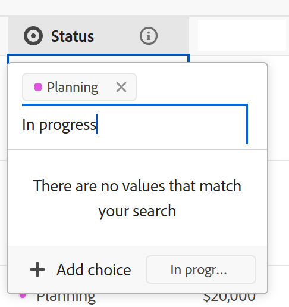

# 編輯記錄

<!--keep the choice values information in yellow till Jan 2026-->

本頁醒目提示的資訊指出尚未普遍可用的功能。 它僅在預覽環境中可供所有客戶使用。 每月發行至生產環境後，生產環境中為啟用快速發行的客戶也提供相同的功能。

如需快速發行資訊，請參閱[為您的組織啟用或停用快速發行](/help/quicksilver/administration-and-setup/set-up-workfront/configure-system-defaults/enable-fast-release-process.md)。

{{planning-important-intro}}

您可以在Adobe Workfront Planning中編輯記錄資訊，方法是編輯與記錄關聯的欄位值。

您必須先建立記錄型別，才能開始建立和編輯記錄。

如需詳細資訊，請參閱[建立記錄型別](/help/quicksilver/planning/architecture/create-record-types.md)。

如需有關建立記錄的資訊，請參閱[建立記錄](/help/quicksilver/planning/records/create-records.md)。

&lt;！ — 在此提及，詳細資訊檢視中的欄位與表格檢視中的欄位相同 — 本文從「管理記錄」檢視連結，其中一個參考此資訊 — >

## 存取需求

+++ 展開以檢視存取需求。

<table style="table-layout:auto"> 
<col> 
</col> 
<col> 
</col> 
<tbody> 
    <tr> 
<tr> 
<td> 
   
 產品
 </td> 
   <td> 
   <ul><li>
 Adobe Workfront
</li> 
   <li>
 Adobe Workfront規劃
</li></ul></td> 
  </tr>   
<tr> 
   <td role="rowheader">
Adobe Workfront計畫*
</td> 
   <td> 

下列任一Workfront計畫：
 
<ul><li>選擇</li> 
<li>Prime</li> 
<li>Ultimate</li></ul> 

舊版Workfront計畫不提供Workfront計畫
 
   </td> 
<tr> 
   <td role="rowheader">
Adobe Workfront規劃套件*
</td> 
   <td> 

任何 
 

如需每個Workfront計畫包含內容的詳細資訊，請聯絡您的Workfront客戶經理。 
 
   </td> 
 <tr> 
   <td role="rowheader">
Adobe Workfront平台
</td> 
   <td> 

貴組織的Workfront例項必須上線至Adobe Unified Experience，才能存取Workfront Planning。
 

如需詳細資訊，請參閱<a href="/help/quicksilver/workfront-basics/navigate-workfront/workfront-navigation/adobe-unified-experience.md">適用於Workfront的Adobe Unified Experience</a>。 
 
   </td> 
   </tr> 
  </tr> 
  <tr> 
   <td role="rowheader">
Adobe Workfront授權*
</td> 
   <td> 
標準
 
   
Workfront計畫不適用於舊版Workfront授權
 
  </td> 
  </tr> 
  <tr> 
   <td role="rowheader">
存取層級設定
</td> 
   <td> 
Adobe Workfront Planning沒有存取層級控制
   
</td> 
  </tr> 
<tr> 
   <td role="rowheader">
物件許可權
</td> 
   <td>  
貢獻或更高的許可權至工作區和記錄型別</a> 
  
   
系統管理員擁有所有工作區的許可權，包括他們未建立的工作區
  </td> 
  </tr>

</tbody> 
</table>

*如需Workfront存取需求的詳細資訊，請參閱Workfront檔案中的[存取需求](/help/quicksilver/administration-and-setup/add-users/access-levels-and-object-permissions/access-level-requirements-in-documentation.md)。

+++   

## 編輯記錄的相關考量事項

* 如果您擁有工作區的許可權，您可以編輯您建立的記錄或其他人建立的記錄。
* 您可以從下列區域編輯記錄欄位：

   * 記錄檢視中的記錄預覽
   * 記錄的詳細資訊頁面
   * 內嵌，在表格檢視中。
   * 行事曆和時間表檢視，重新調整<!--or dragging and dropping-->記錄的大小。 這會更新記錄的日期。

* 當使用者在檢視中編輯記錄時，變更會立即在所有檢視中可見，並且記錄頁面會向所有其他使用者顯示。

* 下列型別的欄位會自動更新，您無法手動編輯其值：
   * 從其他記錄連結的欄位
   * 公式型別欄位
   * 系統欄位（「建立者」、「建立日期」、「上次修改者」、「上次修改日期」）
* 如果顯示的記錄連結到其他記錄，則您正在編輯的記錄的新資訊會反映在連結的記錄上。
* 您無法大量編輯記錄。<!--this will probably change-->
* URL只有以下列專案開頭時，才會被識別為單行文字欄位型別中的連結： http://、https://、ftp://或www。.
* 您可以將封面影像新增到每張記錄中。 每個記錄的影像都是唯一的，不會套用至同一時間的所有記錄。
* 您可以編輯記錄頁面中的欄位順序，並為記錄新增封面影像。 如需詳細資訊，請參閱[管理記錄頁面配置](/help/quicksilver/planning/records/manage-the-record-page.md)。

## 編輯記錄

您可以從下列區域編輯記錄：

* [表格檢視](#edit-a-record-inline-in-the-table-view-of-a-record-type)
* [時間軸檢視](#edit-a-record-in-the-timeline-view-of-a-record-type)
* [行事曆檢視](#edit-a-record-in-the-calendar-view-of-a-record-type)
* [記錄在檢視中的預覽](#edit-a-record-from-the-records-preview-in-a-view)
* [紀錄的頁面](#edit-a-record-from-the-records-page)
* [「規劃」區段中的Workfront物件](#edit-a-record-from-a-workfront-object-in-the-planning-section)

若要編輯記錄的日期，請執行下列動作：

* [調整時間軸和行事曆檢視中記錄列的大小]

### 在記錄型別的表格檢視中編輯內嵌記錄

當您從表格檢視編輯記錄時，會顯示您檢視記錄時其他使用者正在編輯哪個欄位。

如需詳細資訊，請參閱[管理記錄檢視](/help/quicksilver/planning/views/manage-record-views.md)。

當您在分組或子分組中的最後一個記錄之後新增記錄時，Workfront會自動更新新記錄的分組中包含的欄位。 如有需要，您可以手動編輯這些欄位，記錄可能會從分組中移除。

如需詳細資訊，請參閱[建立記錄](/help/quicksilver/planning/records/create-records.md)。

{{step1-to-planning}}

1. 按一下您要編輯其記錄的工作區

   工作區隨即開啟，且記錄型別會顯示為卡片。
1. 按一下記錄型別卡。

   記錄型別頁面隨即開啟。
1. （視條件而定）按一下表格檢視的索引標籤，或按一下&#x200B;**+檢視**&#x200B;以建立表格檢視。 表格檢視應該是預設檢視，除非您上次存取記錄型別時，已在其他型別的檢視中檢視該記錄型別。

   與所選記錄型別相關聯的記錄會顯示在表格檢視中。
1. 在記錄列內按一下，開始編輯有關內嵌記錄的資訊。

   

   >[!TIP]
   >
   >  您無法編輯下列欄位的資訊，因為這些欄位是唯讀欄位，且Workfront會自動更新它們：
   >  
   >  * 透過連線記錄型別建立的連結欄位。 如需詳細資訊，請參閱[連線記錄型別](/help/quicksilver/planning/architecture/connect-record-types.md)。
   >  * 下列型別的欄位：「建立者」、「建立日期」、「上次修改者」、「上次修改日期」、「公式」欄位。

1. （選擇性和條件式）編輯「段落型別」欄位時，請使用下列&#x200B;**RTF格式**&#x200B;格式選項：

   * 粗體
   * 斜體
   * 底線
   * 新增連結
   * 新增專案符號清單
   * 新增編號清單

   段落欄位RTF文字工具列

1. （選擇性）連按兩下連線的記錄欄位，以將連線的記錄或物件新增至其他記錄。 如需詳細資訊，請參閱[連線記錄](/help/quicksilver/planning/records/connect-records.md)。
1. 在鍵盤上按&#x200B;**Enter**，或按一下資料列外部以儲存變更。 變更會自動儲存。 **已儲存**&#x200B;指標會短暫顯示在表格檢視的右上角，顯示變更已儲存。

1. （選擇性）若要將某個欄位的資訊複製並貼到另一個欄位，請執行下列任一項作業：

   * 複製一個欄位的一或多個現有值，然後將它們貼到另一個記錄上相同型別的欄位中
   * 按一下欄的欄標題以選取並複製它，然後按一下其他欄的欄標題並貼上複製欄的內容。 欄必須包含類似的欄位型別。
   * 按住Shift鍵，按一下選取表格中的數列，複製選取列中的資訊，然後按一下其他列，然後將選取的資訊貼到新列中，接著再貼上後續的列。
   * 複製一個儲存格的資訊，然後選取多個儲存格並在多個儲存格中貼上相同的資訊。 您可以選取多個儲存格，並在相鄰列和欄的多個儲存格中貼上相同的資訊。
   * 選取包含您要複製之資訊的現有儲存格的右下角，然後將其拖放到您想要貼上相同資訊的相鄰儲存格上。 所有儲存格都必須包含相同型別的資訊。

     

   * 從外部來源複製一或多個儲存格（例如，Excel檔案），然後將其貼到下列其中一個欄位型別中：

      * Workfront規劃連線欄位。
      * 人員欄位。 僅支援具有一個值的欄位。

     您無法從外部來源複製資訊，並將其貼到任何其他欄位型別中，包括Workfront或AEM Assets連線欄位。

   >[!NOTE]
   >
   >請考量下列事項：
   >
   >* 使用下列鍵盤快速鍵來複製和貼上資訊：
   >   * 複製： CTRL + C (⌘ + C (適用於Mac)
   >   * 貼上： CTRL + V (⌘ + V for Mac)
   >
   >* 您無法複製和貼上記錄頁面中的欄位值。 只有在記錄型別的表格檢視中才支援此功能。
   >* 您無法複製和貼上下列欄位型別的欄位值：
   >
   >    * 在連線記錄型別時建立的查詢欄位。 您可以複製並貼上連結的記錄欄位。 如需詳細資訊，請參閱[連線記錄型別](/help/quicksilver/planning/architecture/connect-record-types.md)。
   >    * 下列型別的欄位：建立者、建立日期、上次修改者、上次修改日期

1. （可選）使用下列鍵盤快速鍵來復原或重做編輯或複製和貼上記錄資訊：

   * CTRL + Z (⌘ + Z代表Mac)可復原變更
   * 按CTRL + Shift + Z (⌘ + Shift + Z代表Mac)以重做變更

   >[!TIP]
   >
   >    您可以在一列中多次使用鍵盤快速鍵來復原多項變更。

1. （選用）新增縮圖至記錄。 如需詳細資訊，請參閱[新增縮圖至記錄](/help/quicksilver/planning/records/add-thumbnails-to-records.md)。

### 在記錄型別的時間軸檢視中編輯記錄

<!--add another step about drag and drop here when that is available-->

1. 在時間軸檢視中開啟記錄型別頁面。 如需詳細資訊，請參閱[管理時間表檢視](/help/quicksilver/planning/views/manage-the-timeline-view.md)。

1. 將滑鼠游標停留在記錄列的末端，按一下，將其邊界拖放到另一個日期。 這會自動更新記錄的開始或結束日期。

   時間軸檢視上的

1. 按一下並保留記錄列，然後將其拖放到另一個位置以更新其時間軸和日期。 記錄的開始和結束日期會自動更新。

1. 按一下記錄列以開啟其詳細資訊區域並編輯所有欄位。

   如需詳細資訊，請參閱本文中的[在檢視中編輯記錄預覽的記錄](#edit-a-record-from-the-records-preview-in-a-view)區段。

### 在記錄型別的行事曆檢視中編輯記錄

<!--add another step about drag and drop here when that is available-->

1. 在行事曆檢視中開啟記錄型別頁面。 如需詳細資訊，請參閱[管理行事曆檢視](/help/quicksilver/planning/views/manage-the-calendar-view.md)。
1.  （條件式）在行事曆檢視中，將滑鼠游標停留在記錄列的結尾，然後按一下，將其邊界拖放至另一個日期。 這會自動更新記錄的開始或結束日期。

   

1. 按一下並保留記錄列，然後將其拖放到另一個位置以更新其時間軸和日期。 記錄的開始和結束日期會自動更新。

1. 按一下記錄列以開啟其詳細資訊區域並編輯所有欄位。

   如需詳細資訊，請參閱本文中的[在檢視中編輯記錄預覽的記錄](#edit-a-record-from-the-records-preview-in-a-view)區段。

### 在檢視中從記錄預覽編輯記錄

{{step1-to-planning}}

1. 按一下您要編輯其記錄的工作區

   工作區隨即開啟，且記錄型別會顯示為卡片。

1. 按一下記錄型別卡。

   記錄型別頁面隨即開啟。

1. 從任何型別的檢視中，按一下記錄

   或

   從表格檢視中，按一下第一欄中的&#x200B;**開啟詳細資料**&#x200B;圖示。 記錄的預覽會在檢視中開啟。

   

1. （選擇性）按一下記錄標題右側的&#x200B;**更多**&#x200B;功能表，然後按一下&#x200B;**重新命名**。 這會更新顯示為記錄標題的欄位。

   記錄的標題是在表格檢視中檢視時，記錄的主要欄位。 如需詳細資訊，請參閱[主要欄位概述](/help/quicksilver/planning/fields/primary-field-overview.md)。

1. 開始編輯記錄預覽中的欄位資訊。

   >[!TIP]
   >
   >  您無法編輯下列欄位的資訊，因為這些欄位是唯讀欄位，且Workfront會自動更新它們：
   >  
   >  * 透過連線記錄型別建立的其他記錄中的查閱欄位。 如需詳細資訊，請參閱[連線記錄型別](/help/quicksilver/planning/architecture/connect-record-types.md)。
   >  * 下列型別的欄位：「建立者」、「建立日期」、「上次修改者」、「上次修改日期」、「公式」欄位。

1. （選擇性）按一下&#x200B;**新增封面**，將封面影像新增到記錄中。 如需詳細資訊，請參閱[新增封面影像至記錄](/help/quicksilver/planning/records/add-a-cover-image-to-a-record.md)。

1. （選擇性）將滑鼠停留在縮圖圖示上，然後按一下&#x200B;**更多**  > **編輯縮圖**&#x200B;以新增縮圖影像。 如需詳細資訊，請參閱[新增縮圖至記錄](/help/quicksilver/planning/records/add-thumbnails-to-records.md)。

   Workfront會自動儲存您的變更。

1. （選擇性）按一下記錄預覽方塊右上角的&#x200B;**即時指標** ，然後啟用&#x200B;**顯示共同作業人員**&#x200B;設定以醒目提示其他人即時編輯的欄位。

   此區域會顯示同時存取記錄的所有使用者的名稱和頭像。

   停用此設定時，顯示圖片和名稱會列在即時指標區域中，而且不會反白顯示正在編輯的欄位。

   

1. （選擇性）按一下記錄詳細資料頁面&#x200B;**中的**&#x200B;匯出匯出圖示，以匯出記錄的詳細資料。 如需詳細資訊，請參閱[匯出記錄的詳細資料](/help/quicksilver/planning/records/export-the-record-page.md)。

1. （選擇性）按一下記錄預覽右上角的&#x200B;**在新索引標籤中開啟**&#x200B;圖示 <!--check the icon; they are changing it-->，以在新索引標籤中開啟記錄的頁面。 繼續編輯記錄，如本文中[從記錄頁面](#edit-a-record-from-the-records-page)區段編輯記錄。

### 從記錄的頁面編輯記錄

{{step1-to-planning}}

1. 按一下您要編輯其記錄的工作區

   工作區隨即開啟，且記錄型別會顯示為卡片。

1. 按一下記錄型別卡。

   記錄型別頁面隨即開啟。

1. 執行下列其中一項：

   * 從任何檢視存取記錄的預覽，如本文中[在檢視中編輯記錄預覽](#edit-a-record-from-the-records-preview-in-a-view)區段中所述，然後按一下&#x200B;**在新索引標籤中開啟**&#x200B;圖示 <!--check the icon; they are changing it-->，以在新索引標籤中開啟記錄的頁面。

   * 在&#x200B;**表格**&#x200B;檢視中，暫留在記錄名稱上，然後按一下&#x200B;**更多**&#x200B;功能表，然後按一下&#x200B;**檢視**

     的內容相關功能表

     記錄頁面隨即開啟。

     

1. （選擇性）按一下記錄標題右側的&#x200B;**更多**&#x200B;功能表，然後按一下&#x200B;**重新命名**。 這會更新顯示為記錄標題的欄位。

   記錄的標題是在表格檢視中檢視時，記錄的主要欄位。 如需詳細資訊，請參閱[管理資料表檢視](/help/quicksilver/planning/views/manage-the-table-view.md)。

1. 按一下記錄頁面上的任何可編輯欄位以進行編輯。

   >[!TIP]
   >
   >  您無法編輯下列欄位的資訊，因為這些欄位是唯讀欄位，且Workfront會自動更新它們：
   >  
   >  * 透過連線記錄型別建立的連結欄位。 如需詳細資訊，請參閱[連線記錄型別](/help/quicksilver/planning/architecture/connect-record-types.md)。
   >  * 下列型別的欄位：「建立者」、「建立日期」、「上次修改者」、「上次修改日期」、「公式」欄位。

1. （選擇性）按一下顯示任何欄位右側的資訊圖示，以檢視欄位說明。
1. （選擇性）按一下「**新增封面**」以將封面影像新增至記錄

   或

   將滑鼠停留在現有的封面影像上，然後按一下&#x200B;**更多**&#x200B;功能表 > **上傳**，為記錄新增封面影像。

   如需詳細資訊，請參閱[新增封面影像至記錄](/help/quicksilver/planning/records/add-a-cover-image-to-a-record.md)。

1. （選擇性）將滑鼠停留在現有的縮圖上，或是&#x200B;**縮圖圖示** ，然後按一下&#x200B;**更多**&#x200B;功能表 > **編輯縮圖**&#x200B;以新增記錄的縮圖。

   如需詳細資訊，請參閱[新增縮圖至記錄](/help/quicksilver/planning/records/add-thumbnails-to-records.md)。

   Workfront會自動儲存您的變更。

1. （選擇性）按一下記錄頁面右上角的&#x200B;**即時指標** ，然後啟用&#x200B;**顯示共同作業人員**&#x200B;設定以醒目提示其他人即時編輯的欄位。

   此區域會顯示同時存取記錄的所有使用者的名稱和頭像。

   停用此設定時，顯示圖片和名稱會列在即時指標區域中，而且不會反白顯示正在編輯的欄位。

   

1. （選擇性）按一下記錄詳細資料頁面&#x200B;**中的**&#x200B;匯出匯出圖示，以匯出記錄的詳細資料。 如需詳細資訊，請參閱[匯出記錄的詳細資料](/help/quicksilver/planning/records/export-the-record-page.md)。

## 在Planning區段中編輯Workfront物件的記錄

將記錄與Workfront物件連線後，您可以在Workfront中編輯物件的Planning區段中的Workfront Planning記錄。

如需詳細資訊，請參閱[管理來自Workfront物件的記錄連線](/help/quicksilver/planning/records/manage-records-in-planning-section.md)。

## 更新其值時編輯單選或多選欄位設定

<!--some of this information is also available in Edit fields article - update both when necessary-->

當您更新單選或多選欄位中的資訊時，可以將新選擇新增到欄位中，而無需編輯欄位。

>[!IMPORTANT]
>
>本節中說明的功能只能在表格檢視中使用。 無法用於顯示單選或多選欄位的任何其他區域。

**範例**

您可能會有一個名為「狀態」的單選欄位，其選項為「新增」和「已關閉」，而且您要為「進行中」狀態新增選項。 您可以執行下列其中一項作業來新增選擇：

* 編輯欄位。 如需詳細資訊，請參閱[編輯欄位](/help/quicksilver/planning/fields/edit-fields.md)
* 在表格檢視中編輯記錄時新增選項，如下所述。

若要在編輯記錄時新增選擇至現有的選取欄位：

1. 移至記錄型別頁面並開啟表格檢視。
1. 新增您要在表格檢視中新增選擇的單一或多重選取欄位作為新欄。 如需詳細資訊，請參閱[建立欄位](/help/quicksilver/planning/fields/create-fields.md)。
1. 連按兩下欄位的儲存格，開始內嵌編輯欄位。
1. 輸入您要新增的選擇名稱，然後按一下[新增選擇]。**&#x200B;**

   

   新選項會立即新增至單選欄位。

   <!--A new choice value is also added to each choice. You can use the choice values in API calls or other integrations. For information, see [Create fields](/help/quicksilver/planning/fields/create-fields.md). -->

