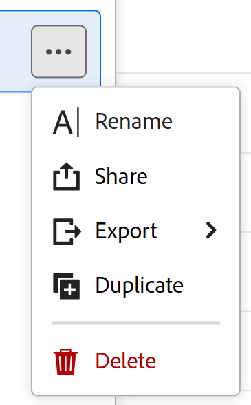

# 從表格檢視匯出記錄

<!--The information on this page refers to functionality not yet generally available. It is available only in the Preview environment for all customers. After the monthly releases to Production, the same features are also available in the Production environment for customers who enabled fast releases.    

For information about fast releases, see [Enable or disable fast releases for your organization](/help/quicksilver/administration-and-setup/set-up-workfront/configure-system-defaults/enable-fast-release-process.md). -->

{{planning-important-intro}}

您可以在Adobe Workfront Planning中，從表格檢視將記錄及其資訊匯出至Excel或CSV檔案。

## 存取需求

+++ 展開以檢視存取需求。

<table style="table-layout:auto"> 
<col> 
</col> 
<col> 
</col> 
<tbody> 
    <tr> 
<tr> 
<td> 
   
 產品
 </td> 
   <td> 
   <ul><li>
 Adobe Workfront
</li> 
   <li>
 Adobe Workfront規劃
</li></ul></td> 
  </tr>   
<tr> 
   <td role="rowheader">
Adobe Workfront計畫*
</td> 
   <td> 

下列任一Workfront計畫：
 
<ul><li>選取</li> 
<li>Prime</li> 
<li>Ultimate</li></ul> 

舊版Workfront計畫不提供Workfront計畫
 
   </td> 
<tr> 
   <td role="rowheader">
Adobe Workfront規劃套件*
</td> 
   <td> 

任何 
 

如需每個Workfront計畫包含內容的詳細資訊，請聯絡您的Workfront客戶經理。 
 
   </td> 
 <tr> 
   <td role="rowheader">
Adobe Workfront平台
</td> 
   <td> 

貴組織的Workfront例項必須上線至Adobe Unified Experience，才能存取Workfront Planning。
 

如需詳細資訊，請參閱<a href="/help/quicksilver/workfront-basics/navigate-workfront/workfront-navigation/adobe-unified-experience.md">適用於Workfront的Adobe Unified Experience</a>。 
 
   </td> 
   </tr> 
  </tr> 
  <tr> 
   <td role="rowheader">
Adobe Workfront授權*
</td> 
   <td>
 標準 

   
Workfront計畫不適用於舊版Workfront授權
 
  </td> 
  </tr> 
  <tr> 
   <td role="rowheader">
存取層級設定
</td> 
   <td> 
Adobe Workfront Planning沒有存取層級控制
   
</td> 
  </tr> 
<tr> 
   <td role="rowheader">
物件許可權
</td> 
   <td>   
管理檢視的許可權
  
   
檢視檢視許可權以暫時變更檢視設定、複製或匯出檢視。
 </td> 
  </tr> 
</tbody> 
</table>

*如需Workfront存取需求的詳細資訊，請參閱Workfront檔案中的[存取需求](/help/quicksilver/administration-and-setup/add-users/access-levels-and-object-permissions/access-level-requirements-in-documentation.md)。

+++

## 從表格檢視匯出記錄

匯出表格檢視時，請考量下列事項：

* 匯出至Excel檔案的資訊會保留套用至Workfront Planning表格檢視的篩選器、群組和排序。 群組在CSV檔案中不可見。

* 匯出的檔案不支援縮圖和自訂列顏色。

* 只會匯出Workfront介面中顯示的欄位。 隱藏欄位不會匯出。

若要從表格檢視或記錄型別匯出資訊，請執行下列動作：

1. 移至記錄型別頁面，然後按一下表格檢視標籤。
1. 執行下列其中一項：

   * 暫留在表格檢視標簽名稱上，然後按一下檢視名稱右邊的&#x200B;**更多**&#x200B;功能表，然後按一下&#x200B;**匯出**。

   檢視表上的

   * 按一下「共用&#x200B;**>**&#x200B;匯出目前的檢視&#x200B;**」。**&#x200B;只有在顯示表格檢視時，才能使用此選項。

   ![含有記錄型別和檢視共用選項的[共用]按鈕](assets/share-button-with-record-type-and-view-sharing-options.png)

1. 選取下列其中一種格式：

   * **Excel**
   * **CSV**

   >[!IMPORTANT]
   >
   >當您在熒幕上顯示不同的檢視時，無法從表格檢視中匯出資訊。 您必須顯示要匯出的表格檢視，才能存取「更多」選單中的「匯出」選項。

   檔案已下載到您的電腦。

1. （選擇性）前往電腦上的下載資料夾，並尋找已下載的檔案。

   匯出的檔案名稱會遵循下列格式：

   `Name of the view - name of the record type`

   例如，促銷活動記錄型別的表格檢視會產生名為`Table view - Campaigns`的檔案。

   檔案會顯示下列資訊：

   * 在Excel檔案中，欄標題會以黑色反白
   * Workfront介面中可見的所有欄位，皆依相同條件排序和篩選
   * 群組會保留在Excel檔案中

   您現在可以與其他人共用匯出的檔案，或將它們附加到任何通訊中。

