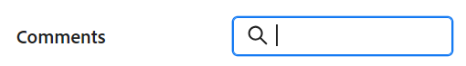

# 管理記錄註解

{{planning-important-intro}}

<!--update the metadata with real information when making this available in TOC and in the left nav-->

<!--update the system updates articles when we release to open beta - check the long commenting stream article list and see articles that document where in the system we have system updates; "Workfront Planning records" should be there-->

<!--The highlighted information on this page refers to functionality not yet generally available. It is available only in the Preview environment for all customers. 

For information about the current release schedule, see [First Quarter 2024 release overview](/help/quicksilver/product-announcements/product-releases/24-q1-release-activity/24-q1-release-overview.md). -->

您可以在記錄的右側面板中新增評論或回覆，對Adobe Workfront Planning記錄進行共同作業。 您也可以在此區域中檢視系統記錄的其它變更。

記錄的右側面板會顯示下列區段：

* **註解**：顯示使用者新增至記錄的評論和回覆。
* **歷史記錄**：顯示使用者對記錄欄位進行的系統記錄變更。 如需詳細資訊，請參閱 [歷史記錄區段總覽](/help/quicksilver/planning/records/history-section-overview.md).

## 在記錄上加上註解的考量事項

* 您可以在Workfront Planning中，於記錄的「註解」區段中，新增註解及回覆至記錄。

* 新增至連結記錄的註解不會顯示在您連結的記錄上。 例如，如果您對連結至促銷活動記錄的Workfront Planning產品記錄加上註解，該註解只會顯示在Workfront Planning的產品記錄上，而不會顯示在您連結的促銷活動記錄上。

* 您可以將註解新增至由於記錄與其他應用程式物件之間的連線而建立的Workfront Planning記錄。

  例如，將Workfront專案與Workfront Planning記錄連線後，您就可以對Workfront Planning專案記錄加上註解。 如需詳細資訊，請參閱 [連線記錄](/help/quicksilver/planning/records/connect-records.md).

* 新增至其他應用程式中連結物件的註解不會顯示在Workfront Planning中，而新增至Workfront Planning中連結物件的註解不會顯示在其他應用程式中。

  例如，在Workfront中新增至專案的評論不會顯示在連結至Workfront Planning中行銷活動的相同專案上，而新增至專案Workfront Planning記錄的評論不會顯示在Workfront中。

* 您可以標籤使用者，以提醒他們注意更新。 標籤的使用者不會收到應用程式內通知或有關您更新的電子郵件。 <!--this might change??-->

<!--replace the bullet above with this: * You can tag users to bring their attention to an update. Tagged users receive an in-app notification or an email notification about your update. 
   The following scenario exists:   

   * Adobe Unified Experience users receive both an in-app notification and an email notification. 
   * Users who are not in the Adobe Unified Experience receive only an email notification. 

      For information, see [Adobe Workfront Planning notifications: article index](/help/quicksilver/planning/notifications/notifications-information.md)
   
      To determine whether your company is using the Adobe Unified Experience, see [Adobe Unified Experience for Workfront](/help/quicksilver/workfront-basics/navigate-workfront/workfront-navigation/adobe-unified-experience.md).
      -->

* 您可以新增更新至記錄，並從Workfront Planning的下列區域複查變更歷史記錄：

   * 從記錄詳細資訊頁面。
   * 從檢視，在記錄詳細資訊方塊中。

## 存取需求

您必須具有下列存取權才能執行本文中的步驟：

<table style="table-layout:auto">
 <col>
 </col>
 <col>
 </col>
 <tbody>
    <tr>
<tr>
<td>
   
 產品
 </td>
   <td>
   
 Adobe Workfront
 </td>
  </tr>  
 <td role="rowheader">
Adobe Workfront合約
</td>
   <td>

您的組織必須處於Workfront Planning的早期存取階段中註冊 

   </td>
  </tr>
  <tr>
   <td role="rowheader">
Adobe Workfront計畫
</td>
   <td>

任何

   </td>
  </tr>
  <tr>
   <td role="rowheader">
Adobe Workfront授權
</td>
   <td>
   
任何
 
  </td>
  </tr>

<tr>
   <td role="rowheader">
存取層級設定
</td>
   <td> 
Workfront Planning中沒有存取層級控制項。 
  
</td>
  </tr>
<tr>
   <td role="rowheader">
權限
</td>
   <td> 
檢視或更高的工作區許可權</a> 
  
   
系統管理員擁有所有工作區的許可權，包括他們未建立的工作區

</td>
  </tr>

<tr>
   <td role="rowheader">
版面配置範本
</td>
   <td> 
您的Workfront或群組管理員必須在版面配置範本中新增Planning區域。 如需詳細資訊，請參閱 <a href="/help/quicksilver/planning/access/access-overview.md">存取權總覽</a>. 
  
</td>
  </tr>
 </tbody>
</table>

### 管理記錄的評論

{{step1-to-planning}}

1. 按一下工作區的卡片。

   工作區隨即開啟，且記錄型別會顯示在卡片上。

1. 按一下記錄型別卡。
記錄型別頁面隨即開啟，並顯示該型別的所有記錄。

1. 從中選擇表格檢視 **檢視** 下拉式功能表。
1. 按一下表格檢視中的記錄名稱。

   記錄的 **詳細資料** 頁面隨即開啟。 「註解」區域預設會在右側面板中開啟。

1. （視條件而定）如果右側面板預設為未開啟，請按一下 **顯示評論**  圖示開啟「註解」區段。

1. 開始在 **新註解** 方塊。

   

   >[!TIP]
   >
   >在您完成輸入和提交評論之前瀏覽離開評論區段，即使您登出並重新登入，仍會將頁面上的評論保留在草稿模式。 加入註解的任何影像也會儲存在草稿中。 草稿會儲存7天，之後便會捨棄且無法復原。 草擬的註解僅對輸入註解的使用者可見。

1. （可選）若要復原或重做變更，請使用下列快速鍵：
   * CTRL + Z (Mac為⌘ + z)可復原變更
   * 按CTRL + Y (Mac則為⌘ + y)以重做變更
1. （可選）新增 **@** 後接在更新中標籤某人的使用者名稱。

   <!--Adobe Unified Experience users can receive an in-app and an email notification when they are tagged. All other users receive an email when they are tagged. For more information, see the section [Considerations about commenting on a record](#considerations-about-commenting-on-a-record) in this article. -->

1. （可選）使用RTF工具列中的選項來格式化文字、新增emoji、連結或影像至更新，以強化內容。 如需詳細資訊，請參閱文章中的「在Workfront更新中使用RTF文字」一節 [更新工作](/help/quicksilver/workfront-basics/updating-work-items-and-viewing-updates/update-work.md).

   >[!TIP]
   >
   >如果其他使用者向您更新的相同專案提交評論，則會出現一條帶有「新」指示器的紅線，以通知您較新的評論。
   >
   >指示器只會在提交專案的註解後顯示，不會在註解仍在撰寫時顯示。
   >
   >

1. 按一下 **提交** 以將更新新增至記錄。
1. （可選）若要編輯註解，請按一下 **更多** 功能表  在註解的右上角，然後按一下 **編輯**.

   >[!IMPORTANT]
   >
   >您只能在提交評論的15分鐘內編輯評論。

1. 編輯註解中的資訊、新增或移除影像，或移除任何已標籤的使用者。 「已編輯」指標會新增至註解的左側。

   >[!TIP]
   >
   >目前年份的評論不會在日期戳記中顯示年份。 將游標暫留在時間戳記上會顯示完整日期，包括年份。

1. （選擇性和條件性）若要搜尋現有的註解，請在 **註解** 區域。

   

1. （選用）按一下 **回覆** 或開始在 **新增回覆……** 區域，回覆現有的評論，然後遵循上述步驟4到8。 <!--(**************accurate??***********)-->

1. （條件式與選擇性）如果您在加入註解時，其他使用者已新增註解，且註解顯示在「註解」區段的可見區域之外，請按一下 **檢視** 內部 **新評論橫幅** 在熒幕底部顯示這些註解。

   

   熒幕底部會顯示其他註解。

1. （可選）按一下 **按讚** 圖示喜歡更新或確認您已閱讀該更新。 圖示會隨著喜歡的數量而更新。
1. （有條件且選用）如果您在評論中納入其他人員，請按一下更新中包含之使用者的頭像，以顯示共用評論的使用者清單。
1. （可選）按一下 **更多** 圖示  在註解的右上角，按一下下列其中一個選項，即可從註解中複製資訊：

   * **複製連結**：這會將註解的連結複製到剪貼簿。
   * **複製內文**：這會將註解的文字複製到剪貼簿。
   * **引用回覆**：這會將您評論的內容複製到新回覆中。 複製的回覆中不包含影像。

   如需詳細資訊，請參閱 [更新工作](/help/quicksilver/workfront-basics/updating-work-items-and-viewing-updates/update-work.md).
1. （可選）按一下 **更多** 圖示  在註解的右上角，然後按一下 **刪除** 以刪除註解。
1. （可選）按一下 **隱藏註解** 圖示  以關閉右側面板。

## 歷史記錄區段總覽

您可以在記錄的右側面板的「歷史記錄」區段中，檢閱對記錄所做的變更。

如需詳細資訊，請參閱 [歷史記錄區段總覽](/help/quicksilver/planning/records/history-section-overview.md).
