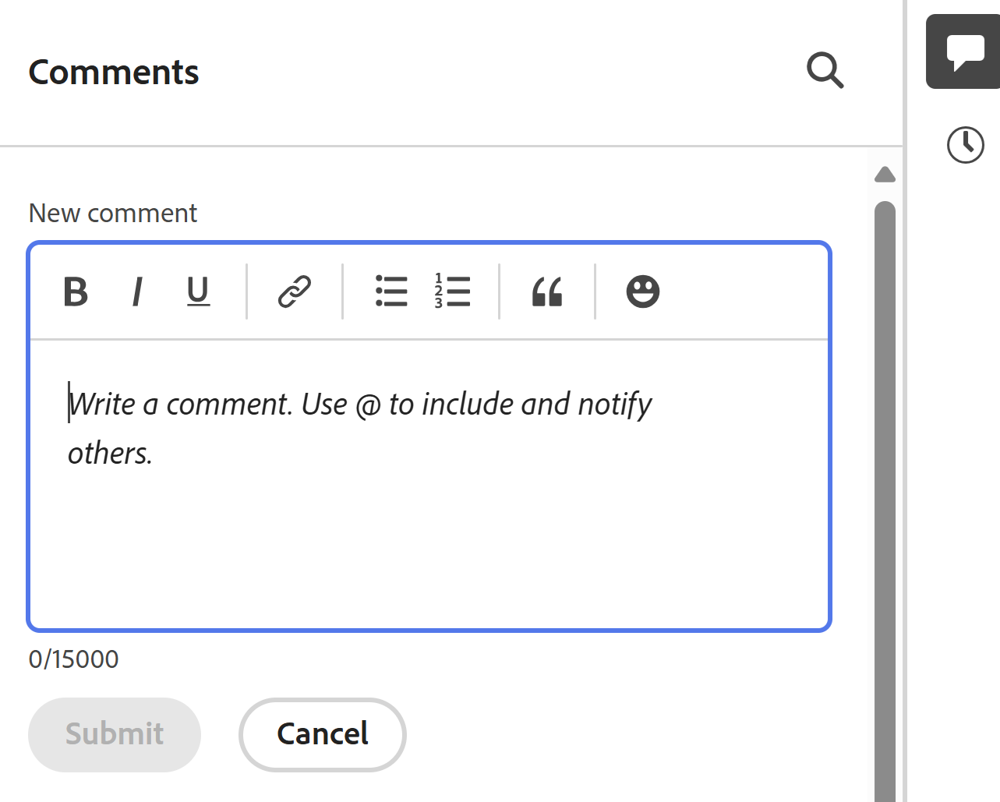

# 管理記錄註解

{{planning-important-intro}}

<!--update the system updates articles when we release to open beta - check the long commenting stream article list and see articles that document where in the system we have system updates; "Workfront Planning records" should be there-->

您可以在記錄的右側面板中新增評論或回覆，對Adobe Workfront Planning記錄進行共同作業。 您也可以在此區域中檢視系統記錄的其它變更。

記錄的右側面板會顯示下列區段：

* **註解**：顯示註解及使用者新增至記錄的回覆。
* **歷程記錄**：顯示使用者對記錄欄位所做的系統記錄變更。 如需詳細資訊，請參閱[歷程記錄區段總覽](/help/quicksilver/planning/records/history-section-overview.md)。

## 存取需求

+++ 展開以檢視Workfront Planning的存取需求。

您必須具有下列存取權才能執行本文中的步驟：

<table style="table-layout:auto"> 
<col> 
</col> 
<col> 
</col> 
<tbody> 
    <tr> 
<tr> 
<td> 
   
 產品
 </td> 
   <td> 
   <ul><li>
 Adobe Workfront
</li> 
   <li>
 Adobe Workfront規劃
</li></ul></td> 
  </tr>   
<tr> 
   <td role="rowheader">
Adobe Workfront計畫*
</td> 
   <td> 

下列任一Workfront計畫：
 
<ul><li>選取</li> 
<li>Prime</li> 
<li>Ultimate</li></ul> 

舊版Workfront計畫不提供Workfront計畫
 
   </td> 
<tr> 
   <td role="rowheader">
Adobe Workfront規劃套件*
</td> 
   <td> 

任何 
 

如需每個Workfront計畫包含內容的詳細資訊，請聯絡您的Workfront客戶經理。 
 
   </td> 
 <tr> 
   <td role="rowheader">
Adobe Workfront平台
</td> 
   <td> 

貴組織的Workfront例項必須加入Adobe統一體驗，才能存取Workfront規劃的所有功能。
 

如需詳細資訊，請參閱<a href="/help/quicksilver/workfront-basics/navigate-workfront/workfront-navigation/adobe-unified-experience.md">Workfront的Adobe統一體驗</a>。 
 
   </td> 
   </tr> 
  </tr> 
  <tr> 
   <td role="rowheader">
Adobe Workfront授權*
</td> 
   <td>
 投稿人、輕度或標準

   
Workfront計畫不適用於舊版Workfront授權
 
  </td> 
  </tr> 
  <tr> 
   <td role="rowheader">
存取層級設定
</td> 
   <td> 
Adobe Workfront Planning沒有存取層級控制
   
</td> 
  </tr> 
<tr> 
   <td role="rowheader">
物件許可權
</td> 
   <td>   
檢視或更高的工作區許可權</a> 
  
   
系統管理員擁有所有工作區的許可權，包括他們未建立的工作區
 </td> 
  </tr> 
<tr> 
   <td role="rowheader">
版面配置範本
</td> 
   <td> 
必須為所有使用者(包括Workfront管理員)指派一個版面配置範本，該範本包含主功能表中的Planning區域。 
 </td> 
  </tr> 
</tbody> 
</table>

*如需Workfront存取需求的詳細資訊，請參閱Workfront檔案中的[存取需求](/help/quicksilver/administration-and-setup/add-users/access-levels-and-object-permissions/access-level-requirements-in-documentation.md)。

+++

## 在記錄上加上註解的考量事項

* 您可以在Workfront Planning中，於記錄的「註解」區段中，新增註解及回覆至記錄。

* 新增至連結記錄的註解不會顯示在您連結的記錄上。 例如，如果您對連結至促銷活動記錄的Workfront Planning產品記錄加上註解，該註解只會顯示在Workfront Planning的產品記錄上，而不會顯示在您連結的促銷活動記錄上。

* 您可以將註解新增至由於記錄與其他應用程式物件之間的連線而建立的Workfront Planning記錄。

  例如，將Workfront專案與Workfront Planning記錄連線後，您就可以對Workfront Planning專案記錄加上註解。 如需詳細資訊，請參閱[連線記錄](/help/quicksilver/planning/records/connect-records.md)。

* 新增至其他應用程式中連結物件的註解不會顯示在Workfront Planning中，而新增至Workfront Planning中連結物件的註解不會顯示在其他應用程式中。

  例如，在Workfront中新增至專案的評論不會顯示在連結至Workfront Planning中行銷活動的相同專案上，而新增至專案Workfront Planning記錄的評論不會顯示在Workfront中。

* 您可以標籤使用者，以提醒他們注意更新。 標籤的使用者不會收到應用程式內通知或有關您更新的電子郵件。<!--this might change??-->

* 您可以標籤使用者，以提醒他們注意更新。 標籤的使用者會收到應用程式內通知或您更新的電子郵件通知。

  >[!NOTE]
  >
  >   只有已採用Adobe統一體驗之客戶的使用者會同時收到應用程式內通知和電子郵件通知。 若要判斷您的公司是否使用Adobe整合體驗，請參閱[Workfront的Adobe整合體驗](/help/quicksilver/workfront-basics/navigate-workfront/workfront-navigation/adobe-unified-experience.md)。

* 您可以新增更新至記錄，並從Workfront Planning的下列區域複查變更歷史記錄：

   * 從記錄詳細資訊頁面。
   * 從檢視，在記錄詳細資訊方塊中。

### 管理記錄的評論

{{step1-to-planning}}

1. 按一下工作區的卡片。

   工作區隨即開啟，且記錄型別會顯示在卡片上。

1. 按一下記錄型別卡。
記錄型別頁面隨即開啟，並顯示該型別的所有記錄。

1. 從&#x200B;**檢視**&#x200B;下拉式功能表中選擇表格檢視。
1. 按一下表格檢視中的記錄名稱。

   記錄的&#x200B;**詳細資料**&#x200B;頁面隨即開啟。 「註解」區域預設會在右側面板中開啟。

1. （視條件而定）如果右面板預設未開啟，請按一下右上角的&#x200B;**顯示註解** 圖示以開啟「註解」區段。

1. 開始在&#x200B;**新註解**&#x200B;方塊中輸入註解。

   

   >[!TIP]
   >
   >在您完成輸入和提交評論之前瀏覽離開評論區段，即使您登出並重新登入，仍會將頁面上的評論保留在草稿模式。 加入註解的任何影像也會儲存在草稿中。 草稿會儲存7天，之後便會捨棄且無法復原。 草擬的註解僅對輸入註解的使用者可見。

1. （可選）若要復原或重做變更，請使用下列快速鍵：
   * CTRL + Z (Mac為⌘ + z)可復原變更
   * 按CTRL + Y (Mac則為⌘ + y)以重做變更
1. （選擇性和條件性）如果您的Workfront執行個體是Adobe整合體驗的一部分，請新增&#x200B;**@**，後跟使用者名稱，以在更新中標籤某人。 如需詳細資訊，請參閱本文中關於評論記錄](#considerations-about-commenting-on-a-record)的[考量事項。

1. （可選）使用RTF工具列中的選項來格式化文字、新增emoji、連結或影像至更新，以強化內容。

1. 繼續新增註解至記錄。

   如需有關更新物件的詳細資訊，包括Workfront Planning記錄，請參閱[更新工作](/help/quicksilver/workfront-basics/updating-work-items-and-viewing-updates/update-work.md)。

<!--
      >[!TIP]
      >
      >If another user submits a comment to the same item you are updating, there is a red line with a "New" indicator to inform you of the newer comments. 
      >
      >The indicator displays only after the comment was submitted on the item, and not when the comment is still composed. 
      >
      >

1. Click **Submit** to add the update to the record. 
1. (Optional) To edit a comment, click the **More** menu  in the upper-right corner of the comment, then click **Edit**.

   >[!IMPORTANT]
   >
   >You can edit your comment only within 15 minutes from submitting it.  

1. Edit the information in the comment, add or remove images or remove any of the tagged users. An "edited" indicator is added to the left of the comment.
   
      >[!TIP]
      >
      >Comments from the current year do not display the year in the date stamp. Hovering over a timestamp displays the full date, including the year.

1. (Optional and conditional) To search for an existing comment, start typing a keyword in the search box in the upper-right corner of the **Comments** area.     

   
     
1. (Optional) Click **Reply** or start typing a comment in the **Add reply ...** area, to reply to an existing comment, then follow steps 4-8 above. (**************accurate??***********)

1. (Conditional and optional) If other users have added comments that display outside of the visible area in the Comments section while you were adding your comments, click **View** inside the **new comments banner** at the bottom of the screen  to display these comments.

    

    Additional comments display at the bottom of the screen.
  
1. (Optional) Click the **Like** icon to like an update or acknowledge that you read it. The icon updates with the number of likes.
1. (Conditional and optional) If you included additional people in your comment, click the avatars of the users included in the update to display a list of users that the comment is shared with. 
1. (Optional) Click the **More** icon  in the upper-right corner of the comment and click one of the following options, to copy a information from a comment: 

    * **Copy link**: This copies a link to the comment to your clipboard.
    * **Copy body text**: This copies the text of the comment to your clipboard.
    * **Quote reply**: This copies the content of your comment into a new reply. Images are not included in the copied reply. 

    For more information, see [Update work](/help/quicksilver/workfront-basics/updating-work-items-and-viewing-updates/update-work.md). -->

1. （選擇性）按一下評論右上角的&#x200B;**更多**&#x200B;圖示，然後按一下&#x200B;**刪除**&#x200B;以刪除評論。
1. （選擇性）按一下&#x200B;**隱藏註解**&#x200B;圖示以關閉右側面板。

## 歷史記錄區段總覽

您可以在記錄的右側面板的「歷史記錄」區段中，檢閱對記錄所做的變更。

如需詳細資訊，請參閱[歷程記錄區段總覽](/help/quicksilver/planning/records/history-section-overview.md)。
