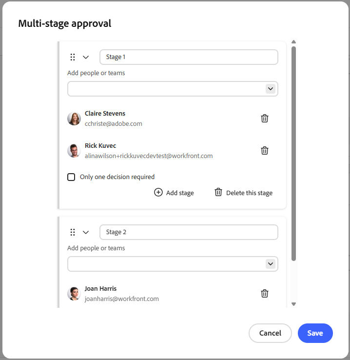

# 在Adobe Workfront Planning中新增核准至請求表單

<!--update the metadata with real information when making this available in TOC and in the left nav-->

本頁醒目提示的資訊指出尚未普遍可用的功能。 它僅在預覽環境中可供所有客戶使用。 在「預覽」版發行後，啟用的客戶每月可在「生產」環境中使用相同的功能。

如需快速發行資訊，請參閱[為您的組織啟用或停用快速發行](/help/quicksilver/administration-and-setup/set-up-workfront/configure-system-defaults/enable-fast-release-process.md)。

{{planning-important-intro}}

您可以在Adobe Workfront Planning請求表單中新增核准流程，以便對每個提交的請求啟動核准，然後再建立記錄。

<!--Multiple stages are supported in the approval process. When all required decisions in a stage are made, the next stage begins and the new stage's approvers receive an email notification.-->

本文說明工作區管理員如何為與記錄型別關聯的請求表單新增核准。

如需有關在Workfront Planning中建立請求表單的資訊，請參閱[在Adobe Workfront Planning中建立和管理請求表單](/help/quicksilver/planning/requests/create-request-form.md)。

如需有關將請求提交至記錄型別以建立記錄的資訊，請參閱[提交Adobe Workfront Planning請求以建立記錄](/help/quicksilver/planning/requests/submit-requests.md)。

## 存取權要求

+++ 展開以檢視這篇文章中所述功能的存取權要求。 

<table style="table-layout:auto"> 
<col> 
</col> 
<col> 
</col> 
<tbody> 
<tr> 
   <td role="rowheader">
Adobe Workfront 封裝
</td> 
   <td> 
<ul> 
<li>
具有Planning套件的任何Workfront或工作流程
</li>
或
<li>
以獨立產品形式購買時的任何Planning套件
</li></ul>
   </td> </tr>
  <tr> 
   <td role="rowheader">
Adobe Workfront授權
</td> 
   <td>
Workflow Standard

   </td> 
  </tr> 
<tr> 
   <td role="rowheader">
Adobe計畫授權
</td> 
   <td>
規劃標準

   </td> 
  </tr> 
<tr> 
   <td role="rowheader">
存取層級設定
</td> 
   <td> 
擁有Workflow和Planning套件時，您必須將Workflow和Planning授權型別新增到存取層級
   
</td> 
  </tr>  
  <tr> 
   <td role="rowheader">
物件許可權
</td> 
   <td>   
管理工作區與記錄型別</a>的許可權 
  
   
系統管理員擁有所有工作區的許可權，包括他們未建立的工作區
  </td> 
  </tr>  
</tbody> 
</table>

如需Workfront存取需求的詳細資訊，請參閱Workfront檔案中的[存取需求](/help/quicksilver/administration-and-setup/add-users/access-levels-and-object-permissions/access-level-requirements-in-documentation.md)。

+++

## 將核准新增至請求表單的考量事項

* 您可以將一個或多個核准者（使用者或團隊）新增到請求表單或核准規則。
* 核准規則會根據提交請求中的欄位值來路由請求（例如，「行銷活動型別」欄位中不同值的不同核准者）。
* 您可以透過「核准者」和「核准日期」欄位，顯示已建立記錄的核准資訊。 請參閱建立欄位。
* 如果所有核准者皆核准，系統便會針對與請求表單相關聯的記錄型別建立記錄。
* 如果至少有一位核准者拒絕，系統不會為記錄型別建立記錄；而是將請求保留/留在Workfront的請求區域中。 （這點出現在兩個區段中，措辭稍有不同 — 此處合併為一個陳述式。）
* 當需要多個核准者時，他們必須在請求被核准或拒絕之前做出決定 — 除非啟用僅需要一個決定選項。
* 如果團隊設定為核准者，則只需從該團隊的一名成員中做出一個決定。
* 核准是選擇性的 — 如果請求表單未附加核准，Workfront Planning會在提交時立即建立記錄。
* 您可以新增一或多個階段至核准。

## 將核准規則新增至請求表單

核准規則會根據已提交請求中的欄位值來定義核准流程。

例如，如果請求表單有「Campaign type」欄位，則可建立規則，當欄位值為「Digital」時傳送請求給一個人，當值為「Print」時傳送請求給另一個人。

若要設定請求表單的核准規則：

1. 開始建立記錄型別的要求表單，如文章[在Adobe Workfront Planning中建立和管理要求表單](/help/quicksilver/planning/requests/create-request-form.md)中所述。
1. 當要求表單開啟時，按一下&#x200B;**設定**。

   **設定**&#x200B;索引標籤開啟。

1. 若要開始設定核准規則，請按一下左側面板中的&#x200B;**核准** 。

1. （選擇性）如果您想要設定預設核准程式，請在&#x200B;**預設核准規則**&#x200B;區域的&#x200B;**核准者**&#x200B;欄位中新增至少一位使用者或團隊，然後按一下&#x200B;**僅需要一個決定**&#x200B;核取方塊（如果您想要在任何一位預設核准者核准記錄後建立記錄）。

   

1. （選用）開始新增核准規則。 針對每個自訂核准規則，執行下列動作：

   1. 按一下&#x200B;**新增核准規則**。
   1. 按一下預留位置標題&#x200B;**未命名的核准規則**，然後輸入核准規則的名稱。
   1. 按一下&#x200B;**選取欄位**&#x200B;並選取啟用規則的欄位。
   1. 選取規則的運運算元。 運運算元會依欄位型別而異。
   1. 如果選取的運運算元需要值，請按一下加號圖示並新增一或多個值。
   1. （選擇性）按一下&#x200B;**新增條件**&#x200B;以新增更多條件，並透過步驟C-E中設定其他條件來透過&#x200B;**And**&#x200B;或&#x200B;**Or**&#x200B;陳述式連線這些條件。
   1. 在核准規則的&#x200B;**動作**&#x200B;區域中，在&#x200B;**核准者**&#x200B;欄位中，新增當符合條件時要設定為核准者的至少一個使用者或團隊。
   1. （條件式與選擇性）如果您想要在任何核准者核准記錄後建立記錄，請核取&#x200B;**僅需要一個決定**&#x200B;核取方塊。 否則，在接受或拒絕請求之前，所有核准者都必須決定核准。

   >[!NOTE]
   >
   >   新增核准規則時，請考量下列事項：
   >
   >   * 若僅設定預設規則，則會套用至提交的每個請求。
   >   * 如果符合自訂規則，則預設不會套用至請求核准工作流程。 只有相符的自訂規則才適用於核准，而預設規則會被忽略。
   >   * 如果符合多個自訂規則，則會套用順序中的第一個自訂規則。 在此情況下，預設核准不適用（如果有的話）。

1. （選擇性）按一下&#x200B;**新增階段**&#x200B;以新增另一個階段至核准。

1. 按一下[儲存]儲存核准規則。****

1. （選擇性）若要新增更多階段至核准，請執行下列動作：

   1. 按一下&#x200B;**新增階段**。

      出現&#x200B;**多階段核准**&#x200B;方塊。 如果您已建立預設核准動作，這些核准者會自動新增至階段1。

   1. 在&#x200B;**新增人員或團隊**&#x200B;欄位中，新增至少一個要設定為階段核准者的使用者或團隊。
   1.  （條件式與選擇性）如果您希望記錄在任何一位核准者核准後進入下一個階段，請核取&#x200B;**僅需要一個決定**&#x200B;核取方塊。 否則，在請求移至下一個階段之前，所有核准者都必須決定核准。
   1. 按一下&#x200B;**新增階段**&#x200B;並從步驟B重複以新增更多階段至核准。

      當存在兩個或多個階段時，您可以按一下&#x200B;**拖曳**&#x200B;圖示以依序拖放它們。

      按一下&#x200B;**刪除此階段**&#x200B;從核准中刪除階段，或按一下核准者旁的&#x200B;**刪除**&#x200B;圖示，從階段核准者清單中刪除使用者或團隊。

      

   1. 當您完成建立核准工作流程時，請按一下&#x200B;**儲存**。

      您可以從[核准]頁面編輯或刪除多階段核准。

1. （選擇性）如果您之前從未共用過請求表單，請按一下&#x200B;**發佈**。

<!--

## Add an approval to a request form in the Production environment

1. Start creating a request form for a record type, as described in [Create and manage a request form in Adobe Workfront Planning](/help/quicksilver/planning/requests/create-request-form.md).
1. Click **Configuration**.

    The **Configuration** area displays.

    
1. In the **Approvers** field, start typing the name of a user or team that you want to set as an approver, then select it when it displays in the list. 
1. (Optional and conditional) If you have set more than one approver, and only need one approver to make a decision, enable the **Only one decision is required** option.

    (****most of the Note below is duplicated in the Create a request form article***)

      >[!NOTE]
      >
      >
      >* You can add one or several approvers to a request form.
      >
      >* If you add more than one approver, and the Only one decision is required option is not enabled, all approvers must approve the request before Workfront Planning creates a record.
      >
      >* If at least one approver rejects the request, the request is rejected and the record is not created. The request remains in the Requests area of Workfront.
      >
      >* If you add more than one approver, and the Only one decision is required option is not enabled, all approvers must make a decision before a request is either approved or rejected.
      >
      >* If a team is set as an approver, only one decision is required from the team.

1. (Optional) Click **Publish** if you have never shared the request form before.

    Or

    Click **Share** to share the form, then **Copy link**. 
1. (Optional) After a user uses the link you share and submits a request, Workfront Planning sends an approval in-app notification and an email to the approvers.

   For information about approving requests, see [Approve a request](/help/quicksilver/planning/requests/approve-request.md).

-->