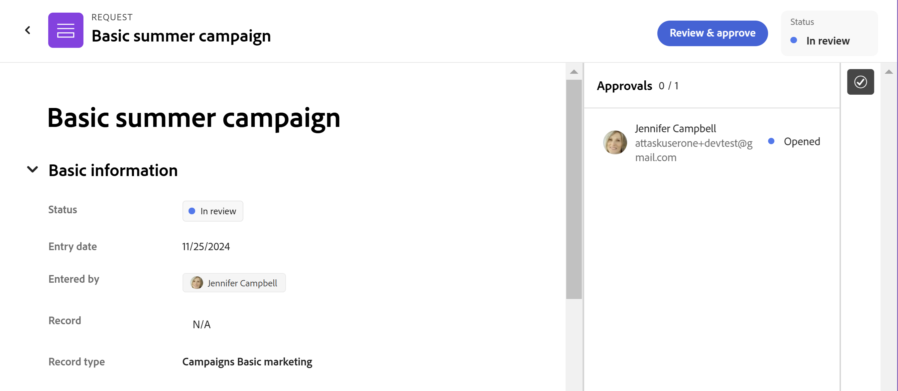

# 在Adobe Workfront Planning中核准請求

<!--take Preview and Production references at Production time-->

<!-- do you need to add that only workspace owners can view the Submitted/ Planning tab?? - asking team in slack-->

本頁醒目提示的資訊指出尚未普遍可用的功能。 它僅在預覽環境中可供所有客戶使用。 每月發行至生產環境後，生產環境中為啟用快速發行的客戶也提供相同的功能。

如需快速發行資訊，請參閱[為您的組織啟用或停用快速發行](/help/quicksilver/administration-and-setup/set-up-workfront/configure-system-defaults/enable-fast-release-process.md)。

{{planning-important-intro}}

當使用者將請求提交到與Adobe Workfront Planning中的核准相關聯的請求表單時，核准者會收到有關待核准的通知和電子郵件。 他們必須在Workfront Planning建立物件前核准請求。

本文說明工作區管理員如何核准提交給Workfront Planning的請求，以建立記錄。

建議您也檢視下列文章：

* [在Adobe Workfront Planning中建立和管理請求表單](/help/quicksilver/planning/requests/create-request-form.md)
* [提交Adobe Workfront Planning請求以建立記錄](/help/quicksilver/planning/requests/submit-requests.md)
* [新增核准至請求表單](/help/quicksilver/planning/requests/add-approval-to-request-form.md)

## 有關核准請求和請求狀態的考量事項

已提交的請求會顯示在Workfront請求區域中「已提交」區段的「計畫」標籤中，且具有以下請求狀態之一：

* **擱置檢閱**：當沒有核准者開啟要求物件時，會顯示此狀態。
* **稽核中**：當至少一位核准者開啟要求物件時，**擱置稽核**&#x200B;狀態變更為&#x200B;**稽核中**。 在所有核准者核准要求之前，要求的狀態仍為&#x200B;**稽核中**。
* **已核准**：當核准者核准要求物件時，其個別狀態會變成&#x200B;**已核准**，但整體要求物件狀態仍為&#x200B;**稽核中**，直到所有核准者都做出決定為止。 當所有核准者核准請求時，請求狀態會變成&#x200B;**已核准**。
* **已完成**：如果所有核准者核准該要求物件，其狀態會變更為&#x200B;**已完成**，或者該要求不需要核准。
* **已拒絕**：如果任何核准者拒絕要求物件，狀態會變成&#x200B;**已拒絕**。 不會建立記錄，必須提交新請求才能建立記錄。

## 存取需求

+++ 展開以檢視本文中功能的存取需求。

您必須具有下列存取權才能執行本文中的步驟：

<table style="table-layout:auto">
 <col>
 </col>
 <col>
 </col>
 <tbody>
    <tr>
<tr>
<td>
   
 產品
 </td>
   <td>
   <ul><li>
 Adobe Workfront
</li>
   <li>
 Adobe Workfront規劃
</li></ul></td>
  </tr>  
 <tr>
   <td role="rowheader">
Adobe Workfront計畫*
</td>
   <td>

下列任一Workfront計畫：

<ul><li>選取</li>
<li>Prime</li>
<li>Ultimate</li></ul>

舊版Workfront計畫不提供Workfront計畫

   </td>

<tr>
   <td role="rowheader">
Adobe Workfront規劃套件*
</td>
   <td>

任何 
  

如需每個Workfront計畫包含內容的詳細資訊，請聯絡您的Workfront客戶經理。 </td>

<tr>
   <td role="rowheader">
Adobe Workfront平台
</td>
   <td>

貴組織的Workfront例項必須上線至Adobe Unified Experience，才能存取Workfront Planning的所有功能。

如需詳細資訊，請參閱<a href="/help/quicksilver/workfront-basics/navigate-workfront/workfront-navigation/adobe-unified-experience.md">適用於Workfront的Adobe Unified Experience</a>。 

   </td>
  </tr>
  </tr>
  <tr>
   <td role="rowheader">
Adobe Workfront授權*
</td>
   <td>
   
標準

   
Workfront計畫不適用於舊版Workfront授權

  </td>
  </tr>
  <tr>
   <td role="rowheader">
存取層級設定
</td>
   <td> 
Adobe Workfront Planning沒有存取層級控制
  
</td>
  </tr>
<tr>
   <td role="rowheader">
物件許可權
</td>
   <td>
   <ul>
   <li>
管理工作區和記錄型別的許可權 
</li>
    <li>
系統管理員可以管理他們未建立的工作區。 
</li>
    </ul>
   
如需有關共用Workfront Planning物件許可權的資訊，請參閱  
   <a href="/help/quicksilver/planning/access/sharing-permissions-overview.md">在Adobe Workfront Planning中共用許可權的概觀</a> 
  </td>
  </tr>
<tr>
   <td role="rowheader">
版面配置範本
</td>
   <td> 
必須為所有使用者(包括Workfront管理員)指派一個版面配置範本，該範本包含主功能表中的Planning區域。 
  
</td>
  </tr>
 </tbody>
</table>

*如需Workfront存取需求的詳細資訊，請參閱Workfront檔案中的[存取需求](/help/quicksilver/administration-and-setup/add-users/access-levels-and-object-permissions/access-level-requirements-in-documentation.md)。

+++

<!--replace the layout template info in the table with this at release: 

In the Production environment, all users including the System Administrators must be assigned to a layout template that includes the Planning areas.

In the Preview environment, Standard users and System Administrators have the Planning area enabled by default.

-->

## 核准建立記錄的請求

使用者將請求新增至與核准相關聯的記錄型別請求表單後，該請求將傳送給核准者。

核准者會收到下列擱置核准之要求的相關通知：

* 應用程式內通知
* 電子郵件通知

>[!NOTE]
>
>您組織的Workfront執行個體必須上線至Adobe統一體驗，使用者才能接收電子郵件和應用程式內通知。

若要核准請求，請執行下列步驟：

1. 執行下列其中一項：

   * 若您擁有Workfront Planning的存取權，且至少可以檢視一個工作區，請按一下畫面右上角的&#x200B;**主功能表** ，或左上角的&#x200B;**主功能表**  （若有），然後按一下&#x200B;**要求** > **已提交** > **Planning**，再按一下狀態為&#x200B;**擱置檢閱**&#x200B;或&#x200B;**檢閱中**&#x200B;的要求。

     >[!TIP]
     >
     >如果您無權存取Workfront Planning，或無權檢視任何工作區，則只能使用電子郵件或應用程式內通知存取核准該工作區的請求。

   * 按一下畫面右上角的Unified Shell中的&#x200B;**通知**&#x200B;區域圖示，然後按一下等待您核准之要求的相關通知以開啟要求。
   * 前往電子郵件中的電子郵件通知，通知您擱置核准的要求，然後按一下[開啟要求] **開啟要求。<!--add the name of the button here, from the email-->**

   請求頁面會以唯讀模式開啟。

   

1. （選擇性）按一下請求右上角的&#x200B;**核准**&#x200B;圖示以檢視核准者。
1. 按一下&#x200B;**檢閱並核准**，然後選擇下列其中一項：

   * **核准**：這會核准要求。 在所有核准者核准請求後，系統會立即建立與請求表單相關之記錄型別的記錄。
   * **拒絕**：這會拒絕要求，即使您是唯一拒絕要求的核准者亦然。 不會針對與請求表單關聯的記錄型別建立記錄。

   提交請求的使用者在請求被批准或拒絕時，會收到電子郵件和應用程式內通知。

   視核准決定而定，請求的狀態會變更為下列專案：

   * **已完成**：要求已核准。
   * **已拒絕**：要求已拒絕。

   請求會保留在Workfront請求區域的已提交區段的Planning索引標籤中。
