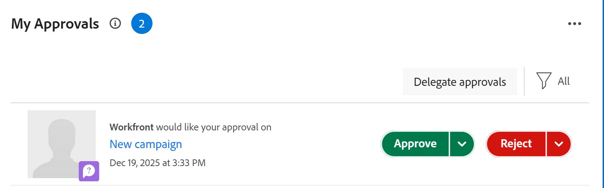

# 在Adobe Workfront Planning中核准請求

<!--take Preview and Production references at Production time-->

<!-- do you need to add that only workspace owners can view the Submitted/ Planning tab?? - asking team in slack-->

<!--
The highlighted information on this page refers to functionality not yet generally available. It is available only in the Preview environment for all customers. After the monthly releases to Production, the same features are also available in the Production environment for customers who enabled fast releases.    

For information about fast releases, see [Enable or disable fast releases for your organization](/help/quicksilver/administration-and-setup/set-up-workfront/configure-system-defaults/enable-fast-release-process.md). 
-->

{{planning-important-intro}}

當使用者將請求提交到與Adobe Workfront Planning中的核准相關聯的請求表單時，核准者會收到有關待核准的通知和電子郵件。 他們必須在Workfront Planning建立物件前核准請求。

本文說明工作區管理員如何核准提交給Workfront Planning的請求，以建立記錄。

建議您也檢視下列文章：

* [在Adobe Workfront Planning中建立和管理請求表單](/help/quicksilver/planning/requests/create-request-form.md)
* [提交Adobe Workfront Planning請求以建立記錄](/help/quicksilver/planning/requests/submit-requests.md)
* [新增核准至請求表單](/help/quicksilver/planning/requests/add-approval-to-request-form.md)

## 核准請求的相關考量事項

* 已提交的請求會顯示在Workfront的請求區域中，且具有下列其中一個請求狀態：

   * **擱置檢閱**：當沒有核准者開啟要求物件時，會顯示此狀態。
   * **稽核中**：當至少一位核准者開啟要求物件時，**擱置稽核**&#x200B;狀態變更為&#x200B;**稽核中**。 在所有核准者核准要求之前，要求的狀態仍為&#x200B;**稽核中**。
   * **已核准**：當核准者核准要求物件時，其個別狀態會變成&#x200B;**已核准**，但整體要求物件狀態仍為&#x200B;**稽核中**，直到所有核准者都做出決定為止。 當所有核准者核准請求時，請求狀態會變成&#x200B;**已核准**。
   * **已完成**：如果所有核准者核准該要求物件，其狀態會變更為&#x200B;**已完成**，或者該要求不需要核准。
   * **已拒絕**：如果任何核准者拒絕要求物件，狀態會變成&#x200B;**已拒絕**。 不會建立記錄，必須提交新請求才能建立記錄。

* 您可以在「核准者」與「已核准日期」欄位中提交請求表單，顯示所建立記錄的核准資訊。 如需詳細資訊，請參閱[建立欄位](/help/quicksilver/planning/fields/create-fields.md)。

## 存取權要求

+++ 展開以檢視這篇文章中所述功能的存取權要求。 

<table style="table-layout:auto"> 
<col> 
</col> 
<col> 
</col> 
<tbody> 
<tr> 
   <td role="rowheader">
Adobe Workfront套件
</td> 
   <td> 

任何Workfront套件和任何Planning套件

或

任何Workflow套件和任何Planning套件

如需每個Workfront Planning套件所含內容的詳細資訊，請聯絡您的Workfront客戶代表。

   </td> </tr>

</tr> 
  <tr> 
   <td role="rowheader">
Adobe Workfront授權
</td> 
   <td>
任何
 
  </td> 
  </tr> 
  <tr> 
   <td role="rowheader">
物件許可權
</td> 
   <td>   
管理工作區與記錄型別</a>的許可權 
  
   
系統管理員擁有所有工作區的許可權，包括他們未建立的工作區
  </td> 
  </tr>  
</tbody> 
</table>

如需Workfront存取需求的詳細資訊，請參閱Workfront檔案中的[存取需求](/help/quicksilver/administration-and-setup/add-users/access-levels-and-object-permissions/access-level-requirements-in-documentation.md)。

+++

## 核准Planning請求以建立記錄

使用者將請求新增至與核准相關聯的記錄型別請求表單後，該請求將傳送給核准者。

核准者會收到下列擱置核准之要求的相關通知：

* 應用程式內通知
* 電子郵件通知

如需有關核准通知請求的資訊，請參閱下列文章：

* [管理Adobe Workfront Planning電子郵件通知](/help/quicksilver/planning/notifications/manage-planning-email-notifications.md)
* [管理Adobe Workfront Planning應用程式內通知](/help/quicksilver/planning/notifications/manage-planning-in-app-notifications.md)

>[!NOTE]
>
>您組織的Workfront執行個體必須上線至Adobe統一體驗，使用者才能接收電子郵件和應用程式內通知。

您可以核准請求，以從請求本身或從「首頁」中的「我的核准」Widget建立記錄。

### 從通知或請求區域核准計畫請求

1. 執行下列任一項作業以開啟請求：

   * 按一下左上角的&#x200B;**主功能表** ，然後按一下&#x200B;**要求** > **使用新體驗**，然後按一下狀態為&#x200B;**擱置檢閱**&#x200B;的要求。

     >[!TIP]
     >
     >* 如果您無權存取Workfront Planning，或無權檢視任何工作區，則只能使用電子郵件或應用程式內通知存取核准該工作區的請求。
     >* 您無法從舊版請求體驗存取Planning請求。

   * 按一下畫面右上角的Unified Shell中的&#x200B;**通知**&#x200B;區域圖示，然後按一下等待您核准之要求的相關通知以開啟要求。
   * 前往電子郵件中的電子郵件通知，通知您擱置核准的要求，然後按一下[開啟要求] **開啟要求。**

   請求頁面會以唯讀模式開啟。

   
1. （選擇性）按一下請求右上角的&#x200B;**核准**&#x200B;圖示以檢視核准者。
1. 按一下&#x200B;**檢閱並核准**，然後選擇下列其中一項：

   * **核准**：這會核准要求。 在所有核准者核准請求後，系統會立即建立與請求表單相關之記錄型別的記錄。
   * **拒絕**：這會拒絕要求，即使您是唯一拒絕要求的核准者亦然。 不會針對與請求表單關聯的記錄型別建立記錄。

   提交請求的使用者會在請求獲核准或拒絕時，收到電子郵件和應用程式內通知。

   視核准決定而定，請求的狀態會變更為下列專案：

   * **已完成**：要求已核准。
   * **已拒絕**：要求已拒絕。

   要求仍保留在Workfront的&#x200B;**要求**&#x200B;區域中。

### 核准來自首頁我的核准Widget的請求

{{step1-to-home}}

1. 移至&#x200B;**首頁**&#x200B;中的&#x200B;**我的核准** Widget。

   
1. 找出您要核准或拒絕的Planning請求。

1. （選擇性）按一下&#x200B;**核准**&#x200B;或&#x200B;**拒絕**&#x200B;旁的下拉箭頭，輸入註解，然後按一下&#x200B;**新增**，以新增註解。

1. 按一下下列其中一項：

   * **核准**：這會核准要求。 在所有核准者核准請求後，系統會立即建立與請求表單相關之記錄型別的記錄。
   * **拒絕**：這會拒絕要求，即使您是唯一拒絕要求的核准者亦然。 不會針對與請求表單關聯的記錄型別建立記錄。

   提交請求的使用者會在請求獲核准或拒絕時，收到電子郵件和應用程式內通知。

   視核准決定而定，請求的狀態會變更為下列專案：

   * **已完成**：要求已核准。
   * **已拒絕**：要求已拒絕。

