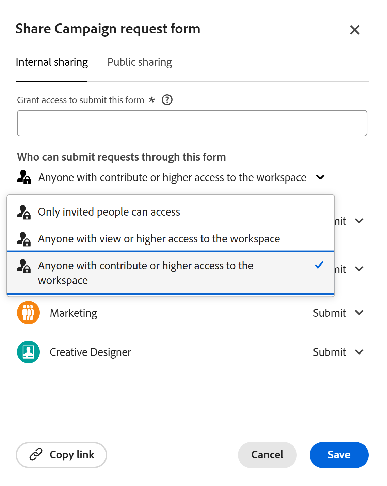

# 在Adobe Workfront Planning中建立和管理請求表單

<!--update the metadata with real information when making this available in TOC and in the left nav-->

<!--take Preview and Production references at Production time-->

本頁醒目提示的資訊指出尚未普遍可用的功能。 它僅在預覽環境中可供所有客戶使用。 每月發行至生產環境後，生產環境中為啟用快速發行的客戶也提供相同的功能。

如需快速發行資訊，請參閱[為您的組織啟用或停用快速發行](/help/quicksilver/administration-and-setup/set-up-workfront/configure-system-defaults/enable-fast-release-process.md)。

{{planning-important-intro}}

您可以建立請求表單，並將其與Adobe Workfront Planning中的記錄型別建立關聯。 然後，您可以與其他內部或外部使用者共用與其的連結。

具有表單連結的使用者可以更新其欄位值，並透過提交來新增記錄。

本文說明工作區管理員如何建立與記錄型別相關聯的請求表單。

如需有關將請求提交至記錄型別以建立記錄的資訊，請參閱[提交Adobe Workfront Planning請求以建立記錄](/help/quicksilver/planning/requests/submit-requests.md)。

## 存取需求

+++ 展開以檢視本文中功能的存取需求。

您必須具有下列存取權才能執行本文中的步驟：

<table style="table-layout:auto">
 <col>
 </col>
 <col>
 </col>
 <tbody>
    <tr>
<tr>
<td>
   
 產品
 </td>
   <td>
   <ul><li>
 Adobe Workfront
</li>
   <li>
 Adobe Workfront規劃
</li></ul></td>
  </tr>  
 <tr>
   <td role="rowheader">
Adobe Workfront計畫*
</td>
   <td>

下列任一Workfront計畫：

<ul><li>選取</li>
<li>Prime</li>
<li>Ultimate</li></ul>

舊版Workfront計畫不提供Workfront計畫

   </td>

<tr>
   <td role="rowheader">
Adobe Workfront規劃套件*
</td>
   <td>

任何 
  

如需每個Workfront計畫包含內容的詳細資訊，請聯絡您的Workfront客戶經理。 </td>

<tr>
   <td role="rowheader">
Adobe Workfront平台
</td>
   <td>

貴組織的Workfront例項必須上線至Adobe Unified Experience，才能存取Workfront Planning的所有功能。

如需詳細資訊，請參閱<a href="/help/quicksilver/workfront-basics/navigate-workfront/workfront-navigation/adobe-unified-experience.md">適用於Workfront的Adobe Unified Experience</a>。 

   </td>

</tr>
  </tr>
  <tr>
   <td role="rowheader">
Adobe Workfront授權*
</td>
   <td>
   
標準

   
Workfront計畫不適用於舊版Workfront授權

  </td>
  </tr>
  <tr>
   <td role="rowheader">
存取層級設定
</td>
   <td> 
Adobe Workfront Planning沒有存取層級控制
  
</td>
  </tr>
<tr>
   <td role="rowheader">
物件許可權
</td>
   <td>
   <ul>
   <li>
管理工作區<!--and record type-->的許可權 
</li>
    <li>
系統管理員可以管理他們未建立的工作區。 
</li>
    </ul>
   
如需有關共用Workfront Planning物件許可權的資訊，請參閱  
   <a href="/help/quicksilver/planning/access/sharing-permissions-overview.md">在Adobe Workfront Planning中共用許可權的概觀</a> 
  </td>
  </tr>
<tr>
   <td role="rowheader">
版面配置範本
</td>
   <td> 
必須為所有使用者(包括Workfront管理員)指派一個版面配置範本，該範本包含主功能表中的Planning區域。 
  
</td>
  </tr>
 </tbody>
</table>

*如需Workfront存取需求的詳細資訊，請參閱Workfront檔案中的[存取需求](/help/quicksilver/administration-and-setup/add-users/access-levels-and-object-permissions/access-level-requirements-in-documentation.md)。

+++

## 請求表單中的欄位和值顯示限制

在您提交請求後，某些欄位在請求表單上的顯示方式，以及它們的值稍後如何在記錄或請求詳細資訊頁面上顯示，皆有限制。

如需有關提交Workfront Planning要求的資訊，請參閱[提交Adobe Workfront Planning要求以建立記錄](/help/quicksilver/planning/requests/submit-requests.md)。

* 以下為要求表單、要求表單建立的記錄或要求詳細資訊頁面中特定欄位顯示方式的限制：

   * 您無法將下列型別的欄位新增至請求表單：

      * 建立者和上次修改者
      * 建立日期和上次修改日期
      * 公式。 預覽環境中支援公式欄位。
      * Workfront物件的查閱欄位
      * Workfront Planning連線記錄的查詢欄位

* 以下為欄位格式在請求表單產生器中顯示方式，與欄位值在記錄或請求詳細資訊頁面中的格式設定方式之間的差異：

   * 「貨幣」、「數字」和「百分比」欄位會在表單產生器中顯示為「單行」文字欄位型別。

     但是，欄位格式會保留，而且這些欄位中數字的值會在記錄型別和請求詳細資訊頁面中顯示為「貨幣」、「數字」和「百分比」值。

* 以下說明某些欄位值如何在請求表單和請求詳細資訊頁面上顯示：

   * 不保留貨幣、數字和百分比欄位的特殊格式。 例如，這些區域中的這些欄位值不會保留小數精確度。
   * 人員欄位值會顯示為ID。
   * 未參考其他欄位或計算的公式欄位不顯示任何值。 例如，具有`STRING`公式的欄位會顯示「N/A」值。
   * 參考「幣別」欄位的公式欄位會顯示不含匯率會計的值。
   * 段落欄位的值在請求表單上顯示「N/A」值，並在請求詳細資訊頁面中顯示html標籤而不是格式化文字。

## 建立記錄型別的請求表單

{{step1-to-planning}}

1. 按一下您要新增記錄的工作區。

   工作區隨即開啟，且記錄型別會顯示為卡片。

1. 按一下記錄型別卡。 如需有關建立記錄型別的資訊，請參閱[建立記錄型別](/help/quicksilver/planning/architecture/create-record-types.md)。

   記錄型別頁面會在您上次存取的檢視中開啟。 依預設，會在表格檢視中開啟記錄型別頁面。

1. 按一下頁面標頭中記錄型別名稱右側的&#x200B;**更多**&#x200B;功能表，然後按一下&#x200B;**建立請求表單** 或&#x200B;**管理請求表單** （如果您已經有表單，而且想要建立其他表單）。
1. （條件式）若要新增其他表單，請按一下&#x200B;**新增請求表單**。
1. 更新要求表單的名稱。 依預設，表單的名稱為&#x200B;**未命名表單**。<!--check this; you logged a bug to rename it to 'Untitled request form' but was it fixed?-->
1. （選用）為要求表單新增&#x200B;**描述**。

   <!--Not possible yet: The Description is visible when you access the request form from the Requests area of Workfront.-->

1. 按一下 **建立**。所選記錄型別的請求表單會在「表單」標籤中開啟。

   

   依預設，請求表單包含下列資訊：

   * 所選記錄型別的表格檢視中可用的記錄欄位。<!--they are working on removing the limitation below-->

   * **預設的分節**：這是Workfront套用至要求表單的預設分割槽符號。 所有記錄欄位都顯示在&#x200B;**預設區段**&#x200B;區域。
   * **主旨**&#x200B;欄位：將在Workfront中識別要求的欄位。 主旨欄位的設定和值無法編輯。

     >[!TIP]
     >
     >**Subject**&#x200B;欄位在要求表單上可見時需要值。 不過，您可以視需要移除&#x200B;**主旨**&#x200B;欄位，要求者提交要求時不會在表單上看到該欄位。

   * 與記錄型別關聯的所有欄位。

     向此記錄型別提交請求的所有人均可看到請求表單中包含的欄位。

1. （選擇性）將滑鼠停留在您要移除的表單上任何欄位上，然後按一下&#x200B;**x**&#x200B;圖示以移除它們。 已將它們新增至表單左側的&#x200B;**欄位**&#x200B;索引標籤。

   例如，移除&#x200B;**主旨**&#x200B;欄位，因為在Workfront Planning中看不到此欄位。<!--remove this example if this becomes visible in Planning?-->

1. （選擇性）若要從表單中移除&#x200B;**預設區段**，請執行下列動作：

   1. 從預設區段中移除所有欄位。
   1. 按一下&#x200B;**內容元素**&#x200B;並新增區段，然後新增區段的名稱。
   1. 新增欄位至新區段。
   1. 按一下&#x200B;**x**&#x200B;圖示以移除&#x200B;**預設區段**。
1. 按一下任何欄位，然後使用表單右側面板中的控制項來定義其大小或下列任何資訊：

   * **標籤**：這是欄位在要求表單上顯示的名稱。 這不會變更記錄欄位的名稱。
   * **指示**：新增欄位的詳細資訊。
   * **建立必要欄位**：選取時，該欄位必須具有值。 否則，無法提交表單。
   * **新增邏輯**：定義必須符合哪些條件才能顯示或隱藏欄位。

   >[!TIP]
   >
   >   在表單上選取欄位後，每個欄位的欄位型別都會顯示在右側面板的頂端。
   >     

1. （選擇性）按一下表單左側的&#x200B;**Content elements**&#x200B;標籤，然後新增下列任一元素：

   * **描述文字**
   * **分割槽符號**

   如需建立自訂表單的詳細資訊，請參閱[建立自訂表單](/help/quicksilver/administration-and-setup/customize-workfront/create-manage-custom-forms/form-designer/design-a-form/design-a-form.md)。

1. （選擇性）按一下&#x200B;**預覽**&#x200B;以檢視其他使用者使用表單提交新記錄時表單的顯示方式。

1. （選擇性）按一下&#x200B;**組態**&#x200B;標籤，然後新增至少一名使用者至&#x200B;**核准者**&#x200B;欄位，以核准此記錄表單的新要求。

   

   <!--below bullet list is duplicated in the Add approval to a request form article-->

   * 將請求表單與核准者建立關聯時，任何新請求都必須先由所有核准者核准，才能產生新記錄。
   * 您可以將一個或多個核准者新增至請求表單。
   * 如果至少有一位核准者拒絕請求，則請求會遭到拒絕，且不會建立記錄。
   * 在核准或拒絕請求之前，所有核准者都必須做出決定。

     如需新增核准至請求表單的詳細資訊，請參閱[新增核准至請求表單](/help/quicksilver/planning/requests/add-approval-to-request-form.md)。

1. （選擇性）按一下標題中表單名稱右側的&#x200B;**更多**&#x200B;功能表，然後按一下&#x200B;**編輯**&#x200B;以更新表單名稱。
1. 按一下&#x200B;**發佈**&#x200B;以發佈表單並取得其唯一連結。

   會發生下列情況：

   * **發佈**&#x200B;按鈕已移除。
   * **取消發佈**&#x200B;按鈕已新增至表單。 按一下此按鈕，表單將無法存取。
   * **共用**&#x200B;按鈕已新增至表單。

1. 按一下&#x200B;**共用**&#x200B;以與其他人共用表單。

   的方塊

1. 從下列選項中選取，指示哪些型別的使用者可以存取此表單：

   * 在工作區擁有檢視或更高存取權限的任何人
   * 對工作區具有貢獻或更高權限的任何人
   * 擁有此連結的任何人

   >[!WARNING]
   >
   >* 當您選取&#x200B;**擁有連結的任何人**&#x200B;時，任何人都可以存取表單並提交新記錄，甚至組織外沒有Workfront帳戶的人也可以。
   >
   >* 包含下列欄位型別的表單無法公開共用：
   >
   >     * Workfront或AEM Assets連線
   >     * 人員
   >

1. （視條件而定）如果您在上一步選取了&#x200B;**任何擁有連結**&#x200B;的人，請從可用的行事曆中選取&#x200B;**連結到期日**。<!--take out this tip when we release to production as in multiple forms this is no longer happening-->

   >[!TIP]
   >
   >如果是這種情況，表示連結已公開共用。
   >

   連結過期後，人員會收到錯誤，您必須更新連結日期，並產生新連結以共用，人員才能再次存取表單。

   您可以從目前日期起180天內選取未來日期。

   >[!TIP]
   >
   >共用日期過期後，Workfront的「要求」區域中不再提供要求表單，且無法再存取與其他使用者共用的連結。

1. （選擇性）按一下&#x200B;**儲存並複製連結**&#x200B;以儲存表單的共用詳細資料。 如果表單先前已儲存，請按一下&#x200B;**複製連結**。

   表單共用選項會儲存且連結會複製到您的剪貼簿。 您現在可以與其他人共用。

   如需使用要求表單的連結來建立記錄的相關資訊，請參閱[提交Adobe Workfront Planning要求](/help/quicksilver/planning/requests/submit-requests.md)。

1. 按一下&#x200B;**表單**&#x200B;標籤右下角的&#x200B;**儲存**&#x200B;以儲存表單。

1. 按一下頁首中表單名稱左側的向左箭頭以關閉表單。

   已開啟&#x200B;**要求表單**&#x200B;資料表檢視，並已新增表單。

1. （選擇性）暫留在表格檢視中的要求表單名稱上，然後按一下表單名稱右側的&#x200B;**更多**&#x200B;功能表，然後按一下下列其中一項：

   * **編輯表單**：按一下以進一步編輯表單上的資訊。
   *  **取消發佈**：按一下以取消發佈表單，該表單會從Workfront的要求區域移除它。
   * **共用**：按一下此以修改誰可以存取表單。
   * **複製連結**：按一下此以快速複製要求表單的連結，而不開啟表單。
   * **刪除**：按一下以刪除表單。 使用表單新增的所有請求和記錄都不會刪除。 無法復原表單。

   從請求表單清單中請求表單上的

1. 按一下標題中&#x200B;**要求表單**&#x200B;左側的向左箭頭，以關閉要求表單表格。   

   記錄型別頁面開啟。
1. （選擇性和條件性）若要編輯現有表單，請根據您使用的環境執行下列任一項作業：

   * 從生產環境：

      1. 按一下標題中記錄型別名稱右側的&#x200B;**更多**&#x200B;功能表，然後執行下列其中一項作業：

      1. 按一下&#x200B;**更新要求表單**&#x200B;以變更要求表單。
      1. 按一下&#x200B;**複製表單連結**&#x200B;以與其他人共用表單連結。

   * 從預覽環境：

      1. 按一下標題中記錄型別名稱右側的&#x200B;**更多**&#x200B;功能表，然後按一下&#x200B;**管理請求表單**。

         這會開啟[要求表單]表格檢視。

      1. 按一下要求表單以開啟並編輯。
      1. （選擇性）移至Workfront中的&#x200B;**要求**&#x200B;區域，並尋找共用表單以提交要求。 如需詳細資訊，請參閱[提交Adobe Workfront Planning要求以建立記錄](/help/quicksilver/planning/requests/submit-requests.md)。
