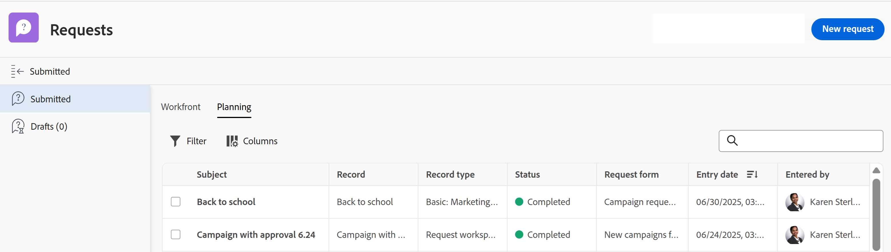

# 提交Adobe Workfront Planning請求以建立記錄

<!--update title when there will be more functionality added to the Planning requests, besides creating records-->
<!--take Preview and Prod references out when releasing to Prod all-->

<!--The highlighted information on this page refers to functionality not yet generally available. It is available only in the Preview environment for all customers. After the monthly releases to Production, the same features are also available in the Production environment for customers who enabled fast releases.    

For information about fast releases, see [Enable or disable fast releases for your organization](/help/quicksilver/administration-and-setup/set-up-workfront/configure-system-defaults/enable-fast-release-process.md). -->

{{planning-important-intro}}

有人與您從Adobe Workfront Planning的記錄型別頁面共用請求表單的連結後，您可以新增請求以建立與請求表單相關聯記錄型別的記錄。

Workfront使用者與外部使用者可以提交請求給Planning記錄型別並建立記錄。<!--double check on the external users-->

本文說明如何提交請求，將新記錄新增至記錄型別。

如需工作區管理員如何建立請求表單並將其與記錄型別關聯的資訊，請參閱[在Adobe Workfront Planning中建立和管理請求表單](/help/quicksilver/planning/requests/create-request-form.md)。

## 存取需求

+++ 展開以檢視本文中功能的存取需求。

您必須具有下列存取權才能執行本文中的步驟：

<table style="table-layout:auto">
 <col>
 </col>
 <col>
 </col>
 <tbody>
    <tr>
<tr>
<td>
   
 產品
 </td>
   <td>
   <ul><li>
 Adobe Workfront
</li>
   <li>
 Adobe Workfront規劃
</li></ul></td>
  </tr>  
 <tr>
   <td role="rowheader">
Adobe Workfront計畫*
</td>
   <td>

下列任一Workfront計畫：

<ul><li>選取</li>
<li>Prime</li>
<li>Ultimate</li></ul>

舊版Workfront計畫不提供Workfront計畫

   </td>
<tr>
   <td role="rowheader">
Adobe Workfront規劃套件*
</td>
   <td>

任何 
  

如需每個Workfront計畫包含內容的詳細資訊，請聯絡您的Workfront客戶經理。 </td>
<tr>
   <td role="rowheader">
Adobe Workfront平台
</td>
   <td>

貴組織的Workfront例項必須上線至Adobe Unified Experience，才能存取Workfront Planning的所有功能。

如需詳細資訊，請參閱<a href="/help/quicksilver/workfront-basics/navigate-workfront/workfront-navigation/adobe-unified-experience.md">適用於Workfront的Adobe Unified Experience</a>。 

   </td>

</tr>
  </tr>
  <tr>
   <td role="rowheader">
Adobe Workfront授權*
</td>
   <td>
   
外部、貢獻者、輕度或標準授權

   
Workfront計畫不適用於舊版Workfront授權

  </td>
  </tr>
  <tr>
   <td role="rowheader">
存取層級設定
</td>
   <td> 
Adobe Workfront Planning沒有存取層級控制
  
</td>
  </tr>
<tr>
   <td role="rowheader">
物件許可權
</td>
   <td>
   
如果您是Workfront使用者，可檢視工作區的或更高許可權
 
  </td>
  </tr>
<tr>
   <td role="rowheader">
版面配置範本
</td>
   <td> 
若要存取Workfront中的Planning區域，您必須被指派一個版面配置範本，該範本包含主功能表中的Planning區域。 

   
 不過，向Workfront Planning提交請求不需要存取「計畫」區域。 
  
</td>
  </tr>
 </tbody>
</table>

*如需Workfront存取需求的詳細資訊，請參閱Workfront檔案中的[存取需求](/help/quicksilver/administration-and-setup/add-users/access-levels-and-object-permissions/access-level-requirements-in-documentation.md)。

+++

## 先決條件

必須先具備下列條件，您才能將請求提交至Workfront Planning請求表單：

* Workfront Planning中必須存在下列專案：

   * 工作區
   * 與請求表單相關聯的記錄型別。 如需詳細資訊，請參閱[在Adobe Workfront Planning中建立請求表單](/help/quicksilver/planning/requests/create-request-form.md)。

* 請求表單必須以您可以存取的方式與連結共用。 存在下列情況：

   * 如果您有Workfront帳戶，連結僅與內部人員共用，而您對工作區有投稿或更高的存取許可權。 Workfront以外的人員無法存取內部共用的連結。
   * 如果您沒有Workfront帳戶，連結已和外部人員共用。 Workfront使用者也可以存取與外部人員共用的連結。

* 表單的連結不可過期。

## 提交請求至Workfront Planning的考量事項

* 您只能從表單的特定連結存取Workfront Planning請求的請求表單。
* 將請求提交至Workfront Planning後，您就無法在Workfront中編輯請求。
* 如果表單未與核准相關聯，或所有核准者皆已授權核准，則每個提交的請求都會為您使用的表單建立記錄型別記錄。
* 提交請求表單所建立的記錄，無法與透過任何其他方法新增的記錄區分開來。 如需詳細資訊，請參閱[建立記錄](/help/quicksilver/planning/records/create-records.md)。
* 已提交的請求會顯示在Workfront請求區域的已提交區段的「計畫」標籤中。
* 在提交表單後，某些欄位型別在請求表單或請求詳細資訊頁面中的顯示方式會受到限制。 如需詳細資訊，請參閱[在Adobe Workfront Planning中建立和管理要求表單](/help/quicksilver/planning/requests/create-request-form.md)。

<!--Not sure how to change the request status, but dev also said: Changing the names of the statuses might lead to some inconsistency between unified-approvals-service and intake-approvals-flow.-->

## 向Workfront Planning提交請求

<!--

Submitting requests to Workfront Planning differs depending on what environment you use. 

### Submit a request to Workfront Planning in the Preview Environment

>[!NOTE]
>
>After the monthly releases to Production, the features described in this section are also available in the Production environment for customers who enabled fast releases.

{{step1-to-requests}}

1. Enable the **Switch to a new experience** setting, in the upper-right corner of he screen. 
   Enabling this setting makes the Workfront Planning request forms available in the **Requests** area of Workfront.

   >[!TIP]
   >
   >This setting is available only when the following are in place:
   >
   >* Your company has purchased a Workfront Planning package. 
   >* Your Workfront instance is onboarded to the Adobe Unified Experience. 
   >* You have access to view at least one workspace. 
   >

1. Click **New request**. (********* update screen shot at release ********)

   

   The New request area opens with the following information: 

   * The 6 most recently accessed Workfront request queues and Planning request forms display in the Recent section. 
   * 50 additional Workfront request queues and Planning request forms display in alphabetical order in the **All request forms** section. You can search for a request queue that does not display by default. 

1. Do one of the following:

   * Click the card for one of the Planning request forms in the Recent or All request forms sections
   * Start typing the name of a Planning request form in the search box, then click the card when it displays in the list. 

   The request form opens.

1. Update the fields available in the request form. Fields with a red asterisk are required. 
1. Click **Submit**.
    
   The request form closes and you return to the **Requests** area. 

   Your form is submitted and the following things occur:

   * If the request form was not associated with an approval, the request is added to the Planning tab of the Submitted section of the Workfront Requests area and a new record is added to the record type associated with the form.
   
   * If the request form was associated with an approval, the request is added to the Planning tab of the Submitted section of the Workfront Requests area. A new record is added to the record type page only after all the approvers have approved it.
   
      For information, see [Add an approval to a request form](/help/quicksilver/planning/requests/add-approval-to-request-form.md).

      

      >[!IMPORTANT]
      >
      >All users who have access to at least one workspace can view the Planning tab in the Requests area. You can view only the requests submitted by you or anyone else to the workspaces that you have at least permissions to View. Workfront administrators can view all requests submitted to any workspace in the system. (******** ensure this is correct; asking team in slack **************)

   * You receive an in-app and an email notification that the request has either been submitted successfully or has been sent for review.
   * If the request form was associated with an approval, the approvers receive an in-app and an email notification to review and approve the request.

      >[!NOTE]
      >
      >The email and in-app notifications are visible only when your organization's instance of Workfront is onboarded to the Adobe Unified Experience.

1. (Optional) Click the **Planning** tab in the Requests area to view your request, then click the name of the request. 

   The request details page opens. 

   

1. (Conditional) If the request form is not associated with an approval, or if the request has been approved, click the name of the request, then click the name of the record in the **Record** field. 

   The record's page opens in Workfront Planning. 

   >[!TIP]
   >
   >* If the record name was not added to the request form, the name of the record in the Record field of the request displays as **Untitled**. 
   >
   >* If the request form is associated with an approval, the approval must be granted before you can access the record from the request page. 

1. (Optional) Click the name of the **Record type**. 

   The record type page opens in Workfront Planning. 

### Submit a request to Workfront Planning in the Production environment

-->

1. 從Workfront Planning記錄型別移至與您共用的連結。

1. 更新表單中可用的欄位。 帶有星號的欄位為必填欄位。

   >[!TIP]
   >
   >   如果&#x200B;**主旨**&#x200B;欄位可用，則在提交請求後，它將不會顯示在Workfront Planning中。
   >
   >建議您在請求中更新儘可能多的欄位，以便新記錄新增至Workfront Planning中的記錄型別時可識別。

1. 按一下&#x200B;**提交**。

   您的表單已提交，且發生下列情況：

   * 如果請求表單未與核准建立關聯，請求會新增至Workfront請求區域「已提交」區段的「計畫」索引標籤，而新記錄會新增至與表單建立關聯的記錄型別。

   * 如果請求表單與核准相關聯，則會將請求新增至Workfront請求區域已提交區段的Planning索引標籤中。 只有在所有核准者核准記錄型別後，才會將新記錄新增到該記錄型別頁面。

     如需詳細資訊，請參閱[新增核准至要求表單](/help/quicksilver/planning/requests/add-approval-to-request-form.md)。

     

     >[!IMPORTANT]
     >
     >至少可存取一個工作區的所有使用者都可以檢視「請求」區域中的「計畫」標籤。 您只能檢視您或其他人提交至您至少擁有檢視許可權之工作區的請求。 Workfront管理員可檢視提交至系統中任何工作區的所有請求。<!--ensure this is correct; asking team in slack-->

   * 您會收到應用程式內及電子郵件通知，告知您請求已成功提交或已傳送以供檢閱。
   * 如果請求表單與核准相關聯，核准者會收到應用程式內和電子郵件通知，以檢閱和核准請求。

     >[!NOTE]
     >
     >只有當貴組織的Workfront執行個體上線至Adobe Unified Experience時，才會顯示電子郵件和應用程式內通知。

1. （選擇性）按一下[要求]區域中的&#x200B;**規劃**&#x200B;索引標籤以檢視您的要求，然後按一下要求的名稱。

   請求詳細資訊頁面隨即開啟。

   

1. （視條件而定）如果要求表單未與核准相關聯，或如果要求已核准，請按一下要求名稱，然後按一下&#x200B;**記錄**&#x200B;欄位中的記錄名稱。

   記錄的頁面會在Workfront Planning中開啟。

   >[!TIP]
   >
   >* 如果未將記錄名稱新增至請求表單，則請求之「記錄」欄位中的記錄名稱會顯示為&#x200B;**未命名**。
   >
   >* 如果請求表單與核准相關聯，則必須先授權核准，然後才能從請求頁面存取記錄。

1. （選擇性）按一下&#x200B;**記錄型別**&#x200B;的名稱。

   記錄型別頁面會在Workfront Planning中開啟。

