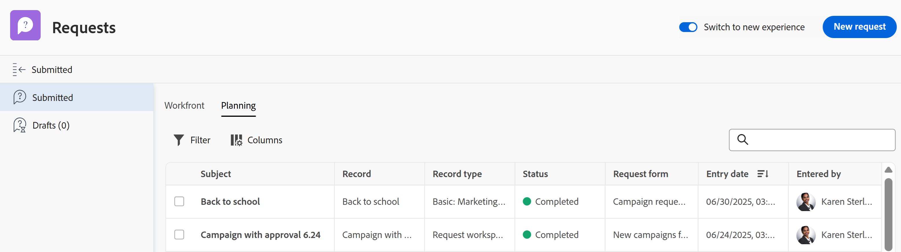

# 提交Adobe Workfront Planning請求以建立記錄

<!--update title when there will be more functionality added to the Planning requests, besides creating records-->
<!--take Preview and Prod references out when releasing to Prod all-->

本頁醒目提示的資訊指出尚未普遍可用的功能。 它僅在預覽環境中可供所有客戶使用。 每月發行至生產環境後，生產環境中為啟用快速發行的客戶也提供相同的功能。

如需快速發行資訊，請參閱[為您的組織啟用或停用快速發行](/help/quicksilver/administration-and-setup/set-up-workfront/configure-system-defaults/enable-fast-release-process.md)。

{{planning-important-intro}}

工作區管理員在Adobe Workfront Planning中建立記錄型別的請求表單後，您可以使用表單來提交將建立與表單相關聯記錄型別的記錄的請求。

您可以從下列區域提交Workfront Planning請求：

* 從Workfront的要求區域。
* 從已共用之請求表單的直接連結。
* 從記錄型別頁面，當您新增或請求新記錄時。 如需詳細資訊，請參閱[建立記錄](/help/quicksilver/planning/records/create-records.md)。

本文說明如何從Workfront的「請求」區域或共用連結提交請求，以將新記錄新增至記錄型別。

Workfront使用者與外部使用者可以提交請求給Planning記錄型別並建立記錄。<!--double check on the external users-->

如需工作區管理員如何建立請求表單並將其與記錄型別關聯的資訊，請參閱[在Adobe Workfront Planning中建立和管理請求表單](/help/quicksilver/planning/requests/create-request-form.md)。

## 存取需求

+++ 展開以檢視本文中功能的存取需求。 

<table style="table-layout:auto"> 
<col> 
</col> 
<col> 
</col> 
<tbody> 
<tr> 
   <td role="rowheader">
Adobe Workfront套件
</td> 
   <td> 

任何Workfront套件和任何Planning套件

或

任何Workflow套件和任何Planning套件

如需每個Workfront Planning套件所含內容的詳細資訊，請聯絡您的Workfront客戶代表。

   </td> </tr>

</tr> 
  <tr> 
   <td role="rowheader">
Adobe Workfront授權
</td> 
   <td>
外部、貢獻者、輕度或標準授權
 
  </td> 
  </tr> 
  <tr> 
   <td role="rowheader">
物件許可權
</td> 
   <td>   
如果您是Workfront使用者，可檢視或更高許可權的工作區和記錄型別
  </td> 
  </tr>  
</tbody> 
</table>

如需Workfront存取需求的詳細資訊，請參閱Workfront檔案中的[存取需求](/help/quicksilver/administration-and-setup/add-users/access-levels-and-object-permissions/access-level-requirements-in-documentation.md)。

+++

## 先決條件

必須先具備下列條件，您才能將請求提交至Workfront Planning請求表單：

* Workfront Planning中必須存在下列專案：

   * 工作區
   * 記錄型別。
   * 與記錄型別相關聯的請求表單。

     如需詳細資訊，請參閱[在Adobe Workfront Planning中建立請求表單](/help/quicksilver/planning/requests/create-request-form.md)。

* 請求表單的共用方式必須讓您能存取。 存在下列情況：

   * 在內部，表單必須和擁有工作區檢視或更高許可權的使用者共用。

     Workfront使用者可從連結存取表單，或在Workfront的「請求」區域中尋找請求表單。

   * 如果您沒有Workfront帳戶，系統會將表單連結與外部人員共用。

     Workfront使用者也可以存取與外部人員共用的連結。

* 表單的連結不可過期。

## 提交請求至Workfront Planning的考量事項

* 提交請求後，您就無法再在Workfront中編輯請求。
* 如果表單未與核准相關聯，或所有核准者皆已授權核准，則每個提交的請求都會為您使用的表單建立記錄型別記錄。
* 提交請求表單所建立的記錄，無法與透過Workfront Planning中的任何其他方法新增的記錄區分開來。

  如需詳細資訊，請參閱[建立記錄](/help/quicksilver/planning/records/create-records.md)。
* 已提交的請求會顯示在Workfront請求區域的已提交區段的「計畫」標籤中。
* 在提交表單後，某些欄位型別在請求表單或請求詳細資訊頁面中的顯示方式會受到限制。

  如需詳細資訊，請參閱[在Adobe Workfront Planning中建立和管理要求表單](/help/quicksilver/planning/requests/create-request-form.md)。

<!--Not sure how to change the request status, but dev also said: Changing the names of the statuses might lead to some inconsistency between unified-approvals-service and intake-approvals-flow.-->

## 在Workfront的請求區域中向Workfront計畫提交請求

{{step1-to-requests}}

1. 啟用熒幕右上角的&#x200B;**切換至新的體驗**設定。
啟用此設定可讓Workfront Planning請求表單出現在Workfront的**請求**&#x200B;區域中。

   >[!TIP]
   >
   >只有在具備下列條件時，才能使用此設定：
   >
   >* 貴公司已購買Workfront規劃套件。
   >* 您的Workfront執行個體已上線到Adobe Unified Experience。
   >* 您至少可以檢視一個工作區。
   >

<!--Production-->

1. 在生產環境中，按一下&#x200B;**新要求**。

   <!--。

     

     >[!IMPORTANT]
     >
     >至少可存取一個工作區的所有使用者都可以檢視「請求」區域中的「計畫」標籤。 您只能檢視您或其他人提交至您至少擁有檢視許可權之工作區的請求。 Workfront管理員可檢視提交至系統中任何工作區的所有請求。

   * 只有擁有者、核准者及至少擁有工作區檢視許可權的使用者可看見要求。

   * 您會收到應用程式內及電子郵件通知，告知您請求已成功提交或已傳送以供檢閱。
   * 如果請求表單與核准相關聯，核准者會收到應用程式內和電子郵件通知，以檢閱和核准請求。

     >[!NOTE]
     >
     >只有當貴組織的Workfront執行個體上線至Adobe Unified Experience時，才會顯示電子郵件和應用程式內通知。
     >
     >電子郵件確認或核准通知中會有請求的連結。

1. （選擇性）按一下確認訊息中的&#x200B;**檢視您的要求**&#x200B;以開啟要求，或按一下&#x200B;**X**&#x200B;圖示以關閉確認。

1. （選擇性）按一下&#x200B;**要求**&#x200B;區域中的&#x200B;**規劃**索引標籤，以檢視您的要求。
提交至Planning請求表單的所有您有權檢視的請求都會顯示在清單中。
1. （可選）執行下列任一項作業：

   * 按一下&#x200B;**篩選器**，開始新增條件以決定您要在Planning標籤中檢視哪些請求。

     

     您可以依下列欄位進行篩選：

      * **Workspace**：與請求表單相關聯的工作區。
      * **記錄型別**：與要求表單關聯的記錄型別。
      * **輸入日期**：提交要求的日期。
      * **要求表單**：用來提交要求的要求表單名稱。
      * **狀態**：要求的狀態。
      * **輸入者**：新增請求的使用者名稱。 如果要求是由Workfront外部的人員加入，則&#x200B;**輸入者**&#x200B;欄位會顯示`N/A`。

        您可以有多個&#x200B;**And**&#x200B;或&#x200B;**Or**加入的篩選器。
當您新增篩選條件時，要求清單會自動篩選。

   * 按一下&#x200B;**欄**&#x200B;並隱藏、顯示或重新排列請求清單中的欄。

     >[!TIP]
     >
     >您無法再新增任何欄。
     >
     >您無法顯示&#x200B;**主旨**&#x200B;欄位。

     

1. 按一下清單中要求的名稱。

   請求詳細資訊頁面隨即開啟。

   

1. （選擇性）在「註解」(Comments)區域中輸入註解。
1. （視條件而定）如果要求表單未與核准相關聯，或如果要求已核准，請按一下要求名稱，然後按一下&#x200B;**記錄**&#x200B;欄位中的記錄名稱。

   記錄的頁面會在Workfront Planning中開啟。

   >[!TIP]
   >
   >* 如果要求表單中未更新記錄的主要欄位，則要求之記錄欄位中的記錄名稱會顯示為&#x200B;**未命名**。
   >
   >* 如果請求表單與核准相關聯，則必須先授權核准，然後才能從請求頁面存取記錄。

1. （選擇性）按一下&#x200B;**記錄型別**&#x200B;的名稱。

   記錄型別頁面會在Workfront Planning中開啟。

## 從共用連結提交要求至Workfront Planning至要求表單

1. 從Workfront Planning記錄型別移至與您共用的連結。

1. 更新表單中可用的欄位。 帶有星號的欄位為必填欄位。

   >[!TIP]
   >
   >   如果&#x200B;**主旨**&#x200B;欄位可用，則在提交請求後，它將不會顯示在Workfront Planning中。
   >
   >建議您在請求中更新儘可能多的欄位，以便新記錄新增至Workfront Planning中的記錄型別時可識別。

1. 按一下&#x200B;**提交**。

   您的表單已提交，且發生下列情況：

   * 如果請求表單未與核准建立關聯，請求會新增至Workfront請求區域「已提交」區段的「計畫」索引標籤，而新記錄會新增至與表單建立關聯的記錄型別。

   * 如果請求表單與核准相關聯，則會將請求新增至Workfront請求區域已提交區段的Planning索引標籤中。 只有在所有核准者核准記錄型別後，才會將新記錄新增到該記錄型別頁面。

     如需詳細資訊，請參閱[新增核准至要求表單](/help/quicksilver/planning/requests/add-approval-to-request-form.md)。

     ![請求中的[計畫]索引標籤](assets/planning-tab-in-requests.png)

     >[!IMPORTANT]
     >
     >至少可存取一個工作區的所有使用者都可以檢視「請求」區域中的「計畫」標籤。 您只能檢視您或其他人提交至您至少擁有檢視許可權之工作區的請求。 Workfront管理員可檢視提交至系統中任何工作區的所有請求。<!--ensure this is correct; asking team in slack-->

   * 您會收到應用程式內及電子郵件通知，告知您請求已成功提交或已傳送以供檢閱。
   * 如果請求表單與核准相關聯，核准者會收到應用程式內和電子郵件通知，以檢閱和核准請求。

     >[!NOTE]
     >
     >只有當貴組織的Workfront執行個體上線至Adobe Unified Experience時，才會顯示電子郵件和應用程式內通知。

   * 在核准要求並建立記錄之後，[核准者]與[核准日期]欄位會顯示記錄上核准的相關資訊。

1. （選擇性）按一下&#x200B;**檢視您的要求**，在Workfront中開啟要求。

   <!--Or-->

   <!--Click [Submit another request](https://pulsar.devtest.workfront-dev.com/intake/6740a1ff44bf3a5600cf4481/request) to open the request form and add a new request.-->

1. （選擇性）按一下&#x200B;**主功能表** > **要求** > **規劃**&#x200B;索引標籤以檢視您的要求，然後按一下要求的名稱。

   請求詳細資訊頁面隨即開啟。

   

1. （選擇性）在「註解」(Comments)區域中輸入註解。
1. （視條件而定）如果要求表單未與核准相關聯，或如果要求已核准，請按一下要求名稱，然後按一下&#x200B;**記錄**&#x200B;欄位中的記錄名稱。

   記錄的頁面會在Workfront Planning中開啟。

   >[!TIP]
   >
   >* 如果未將記錄名稱新增至請求表單，則請求之「記錄」欄位中的記錄名稱會顯示為&#x200B;**未命名**。
   >
   >* 如果請求表單與核准相關聯，則必須先授權核准，然後才能從請求頁面存取記錄。

1. （選擇性）按一下&#x200B;**記錄型別**&#x200B;的名稱。

   記錄型別頁面會在Workfront Planning中開啟。

