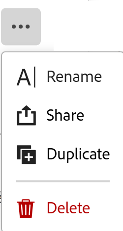

# 刪除記錄檢視

<!--
The highlighted information on this page refers to functionality not yet generally available. It is available only in the Preview environment for all customers. After the release to Preview, the same features are also available monthly in the Production environment for customers who enabled fast releases.    

For information about fast releases, see [Enable or disable fast releases for your organization](/help/quicksilver/administration-and-setup/set-up-workfront/configure-system-defaults/enable-fast-release-process.md). 
-->

{{planning-important-intro}}

您可以刪除在Adobe Workfront Planning中不再使用的記錄檢視。

有權存取檢視的所有使用者皆會刪除該檢視。 已刪除的檢視無法復原。

您無法刪除記錄型別的原始表格檢視。

## 存取權要求

+++ 展開以檢視本文中功能的存取需求。 

<table style="table-layout:auto"> 
<col> 
</col> 
<col> 
</col> 
<tbody> 
    <tr> 
<tr> 
</tr>   
<tr> 
   <td role="rowheader">
Adobe Workfront 封裝
</td> 
   <td> 
<ul> 
<li>
具有Planning套件的任何Workfront或工作流程
</li>
或
<li>
以獨立產品形式購買時的任何Planning套件
</li></ul>
   </td> </tr>
  <tr> 
   <td role="rowheader">
Adobe Workfront授權
</td> 
   <td>
Workflow Standard

   </td> 
  </tr> 
<tr> 
   <td role="rowheader">
Adobe計畫授權
</td> 
   <td>
規劃標準

   </td> 
  </tr> 
<tr> 
   <td role="rowheader">
存取層級設定
</td> 
   <td> 
擁有Workflow和Planning套件時，您必須將Workflow和Planning授權型別新增到存取層級
   
</td> 
  </tr> 
  <tr> 
   <td role="rowheader">
物件許可權
</td> 
   <td>   
管理檢視的許可權
  
</td> 
  </tr>  
</tbody> 
</table>

如需Workfront存取需求的詳細資訊，請參閱Workfront檔案中的[存取需求](/help/quicksilver/administration-and-setup/add-users/access-levels-and-object-permissions/access-level-requirements-in-documentation.md)。

+++   

<!--
Old:
<table style="table-layout:auto"> 
<col> 
</col> 
<col> 
</col> 
<tbody> 
    <tr> 
<tr> 
<td> 
   
 Products
 </td> 
   <td> 
   <ul><li>
 Adobe Workfront
</li> 
   <li>
 Adobe Workfront Planning
</li></ul></td> 
  </tr>   
<tr> 
   <td role="rowheader">
Adobe Workfront plan*
</td> 
   <td> 

Any of the following Workfront plans:
 
<ul><li>Select</li> 
<li>Prime</li> 
<li>Ultimate</li></ul> 

Workfront Planning is not available for legacy Workfront plans
 
   </td> 
<tr> 
   <td role="rowheader">
Adobe Workfront Planning package*
</td> 
   <td> 

Any 
 

For more information about what is included in each Workfront Planning plan, contact your Workfront account manager. 
 
   </td> 
 <tr> 
   <td role="rowheader">
Adobe Workfront platform
</td> 
   <td> 

Your organization's instance of Workfront must be onboarded to the Adobe Unified Experience to be able to access Workfront Planning.
 

For more information, see <a href="/help/quicksilver/workfront-basics/navigate-workfront/workfront-navigation/adobe-unified-experience.md">Adobe Unified Experience for Workfront</a>. 
 
   </td> 
   </tr> 
  </tr> 
  <tr> 
   <td role="rowheader">
Adobe Workfront license*
</td> 
   <td>
 Standard 

   
Workfront Planning is not available for legacy Workfront licenses
 
  </td> 
  </tr> 
  <tr> 
   <td role="rowheader">
Access level configuration
</td> 
   <td> 
You must add both a Workflow and a Planning license type to the access level when you have both a Workflow and a Planning package
   
</td> 
  </tr> 
<tr> 
   <td role="rowheader">
Object permissions
</td> 
   <td>   
Manage permissions to a view
  
   </td> 
  </tr> 
</tbody> 
</table>
-->

## 刪除記錄檢視

{{step1-to-planning}}

1. 按一下工作區的卡片。

   工作區隨即開啟，且記錄型別會顯示為卡片。

1. 按一下記錄型別卡。

   記錄型別頁面隨即開啟。

   依預設，選取型別的所有記錄都會顯示在表格檢視中。

1. 在檢視的索引標籤中，按一下檢視的索引標籤，將滑鼠停留在下拉式功能表中的檢視上，按一下&#x200B;**更多**&#x200B;功能表，然後按一下&#x200B;**刪除**。

   

1. 按一下&#x200B;**刪除**&#x200B;確認。

   所有可存取記錄區域的使用者檢視都會刪除。
