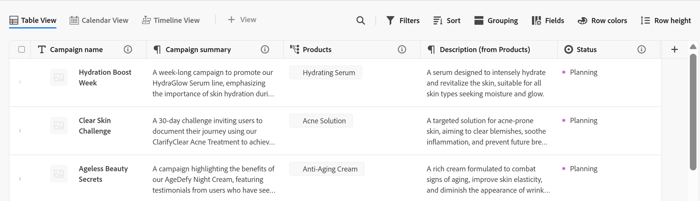
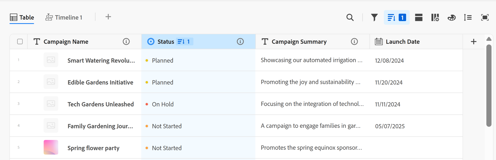

# 管理表格檢視

<!--
The information highlighted on this page refers to functionality not yet generally available. It is available only in the Preview environment for all customers. After the monthly releases to Production, the same features are also available in the Production environment for customers who enabled fast releases. 

For information about fast releases, see [Enable or disable fast releases for your organization](/help/quicksilver/administration-and-setup/set-up-workfront/configure-system-defaults/enable-fast-release-process.md). 
-->

{{planning-important-intro}}

存取Adobe Workfront Planning中的記錄型別頁面時，您可以在表格檢視中顯示記錄及其欄位。

如需有關記錄檢視以及如何管理它們的資訊，請參閱[管理記錄檢視](/help/quicksilver/planning/views/manage-record-views.md)。

本文會說明下列資訊：

* [在表格檢視中建立或編輯欄和列](#manage-a-table-view)
* [啟用表格檢視的即時顯示狀態指示器](#enable-the-real-time-presence-indicator)

如需將表格檢視匯出為Excel或CSV檔案的相關資訊，請參閱[從表格檢視匯出記錄](/help/quicksilver/planning/records/export-records-from-the-table-view.md)。

## 存取權要求

+++ 展開以檢視本文中功能的存取需求。 

<table style="table-layout:auto"> 
<col> 
</col> 
<col> 
</col> 
<tbody> 
    <tr> 
<tr> 
</tr>   
<tr> 
   <td role="rowheader">
Adobe Workfront 封裝
</td> 
   <td> 

任何Workfront和任何Planning套件

任何工作流程與任何Planning套件

如需每個Workfront Planning套件所含內容的詳細資訊，請聯絡您的Workfront客戶代表。 
 
   </td> 
  <tr> 
   <td role="rowheader">
Adobe Workfront授權
</td> 
   <td>
 建立和刪除檢視的標準

   
更新檢視元素的投稿人或更新者

  </td> 
  </tr> 
  <tr> 
   <td role="rowheader">
物件許可權
</td> 
   <td>   
管理檢視的許可權
  
   
檢視許可權以暫時變更檢視設定或複製檢視
 </td> 
  </tr> 
</tbody> 
</table>

如需Workfront存取需求的詳細資訊，請參閱Workfront檔案中的[存取需求](/help/quicksilver/administration-and-setup/add-users/access-levels-and-object-permissions/access-level-requirements-in-documentation.md)。

+++ 

<!--
Old:
<table style="table-layout:auto"> 
<col> 
</col> 
<col> 
</col> 
<tbody> 
    <tr> 
<tr> 
<td> 
   
 Products
 </td> 
   <td> 
   <ul><li>
 Adobe Workfront
</li> 
   <li>
 Adobe Workfront Planning
</li></ul></td> 
  </tr>   
<tr> 
   <td role="rowheader">
Adobe Workfront plan*
</td> 
   <td> 

Any of the following Workfront plans:
 
<ul><li>Select</li> 
<li>Prime</li> 
<li>Ultimate</li></ul> 

Workfront Planning is not available for legacy Workfront plans
 
   </td> 
<tr> 
   <td role="rowheader">
Adobe Workfront Planning package*
</td> 
   <td> 

Any 
 

For more information about what is included in each Workfront Planning plan, contact your Workfront account manager. 
 
   </td> 
 <tr> 
   <td role="rowheader">
Adobe Workfront platform
</td> 
   <td> 

Your organization's instance of Workfront must be onboarded to the Adobe Unified Experience to be able to access Workfront Planning.
 

For more information, see <a href="/help/quicksilver/workfront-basics/navigate-workfront/workfront-navigation/adobe-unified-experience.md">Adobe Unified Experience for Workfront</a>. 
 
   </td> 
   </tr> 
  </tr> 
    <td role="rowheader">
Adobe Workfront license*
</td> 
   <td>
 Standard to create and delete views

   
Contributor or higher to update view elements

   
Workfront Planning is not available for legacy Workfront licenses
 
  </td> 
  </tr> 
  <tr> 
   <td role="rowheader">
Access level configuration
</td> 
   <td> 
There are no access level controls for Adobe Workfront Planning
   
</td> 
  </tr> 
<tr> 
   <td role="rowheader">
Object permissions
</td> 
   <td>   
Manage permissions to a view
  
   
View permissions to a view to temporarily change the view settings or to duplicate it
 </td> 
  </tr> 
<tr>
   <td role="rowheader">
Layout template
</td>
   <td> Users with a Light or Contributor license must be assigned a layout template that includes Planning.
   
Standard users and System Administrators have the Planning areas enabled by default.

</li></ul>
</td>
  </tr>
</tbody> 
</table>
-->

## 使用表格檢視編輯記錄

您可以在表格檢視中編輯記錄資訊。

如需在表格檢視中編輯記錄的詳細資訊，請參閱[編輯記錄](/help/quicksilver/planning/records/edit-records.md)。

## 管理表格檢視 {#manage-a-table-view}

<!--
Depending on what environment you access record types from, the record type page displays using two different views: 

* Table view, in the Production environment
* List view, in the Preview environment

OR: 

If the List view in Project connected pages and request forms stays the same after GTable rolls out - keep that list as the List view and change the Table view in this article to "Table redesigned view" for now; keep it "the table view" here for the future; for the time being, just say "Updating the view in Prod and Preview is different and make the separate sections for Preview and Prod below with the different steps.

### Manage the table view in the Production environment
-->

建立表格檢視時，選取型別的所有記錄都會顯示在表格中。 每一列都是唯一的記錄，每一欄都是一個記錄欄位。 預設會顯示所有欄位和所有記錄。

若要管理表格檢視：

1. 建立資料表檢視，如文章[管理記錄檢視](/help/quicksilver/planning/views/manage-record-views.md)中所述。

   

1. （選擇性）按一下&#x200B;**列高度**，然後從下列選項中選取，以修改表格列的高度：
   * 短
   * 標準
   * 媒體
   * 高

1. （選擇性）按一下&#x200B;**全熒幕**&#x200B;圖示以全熒幕開啟檢視，然後按一下&#x200B;**退出全熒幕**&#x200B;圖示或鍵盤上的Escape以退出全熒幕。

1. 更新下列檢視元素，如下列子區段所述：
   * [欄（或欄位）](#add-columns-or-fields)
   * [列（或記錄）](#add-rows-or-records)
   * [篩選器](#add-filters)
   * [排序](#add-a-sort)
   * [分組](#add-groupings)
   * [列顏色](#add-row-colors)
   * [即時狀態指示器](#enable-the-real-time-presence-indicator)

### 新增欄（或欄位） {#add-columns}

表格檢視的欄標題會顯示與檢視中記錄相關聯的欄位。 表格檢視中顯示的欄位也會顯示在記錄的「詳細資訊」區段中。

如需詳細資訊，請參閱[編輯記錄](/help/quicksilver/planning/records/edit-records.md)。

<!--this is not available yet:You can display record fields (or columns) in both a table and a timeline view. However, the number of columns displayed in the table of the timeline view is limited and you cannot add columns in addition to those selected by default.-->

將欄新增至檢視與將欄位新增至記錄型別相同。

您可以在表格檢視中新增最多500個欄位（或欄）。

1. 移至記錄型別頁面，然後按一下表格檢視標籤，或按一下&#x200B;**+檢視**&#x200B;以新增檢視，然後選擇&#x200B;**表格**。

1. 開始新增欄位（或欄），如文章[建立欄位](/help/quicksilver/planning/fields/create-fields.md)中所述。

   您新增的欄對存取記錄型別的所有使用者可見，並作為記錄頁面的新欄位新增。

1. （選擇性）按一下工具列中的&#x200B;**欄位**&#x200B;圖示，搜尋欄位，然後取消選取欄位名稱右側的切換以隱藏欄位。

1. 執行下列任一項作業，重新排序表格中的欄：

   * 抓取欄標題，並將其拖放到所需位置。 您移動的欄會短暫地以藍色背景顯示，直到您對表格進行其他調整為止。

   * 按一下表格工具列中的&#x200B;**欄位**，然後依所需順序拖放欄位，再按一下&#x200B;**欄位可見度和順序**&#x200B;方塊外部以關閉它。

     

     >[!TIP]
     >
     >* 依預設，「名稱」欄位永遠是表格檢視中的第一個欄位。 系統會將此視為主要欄位。
     >
     >* 除非您指定其他欄位作為主要欄位，否則您無法將「名稱」欄位移至其他位置。 如需詳細資訊，請繼續進行步驟4。<!--accurate?-->
     >
     >

   * 變更主要欄位，以其他欄位取代第一欄中的欄位。 如需詳細資訊，請繼續步驟4。<!--accurate?-->

1. （選擇性）將滑鼠懸停在表格第一欄中未顯示之任何欄位之欄位標題中的欄位名稱上，按一下欄位名稱右側的向下箭頭，然後按一下&#x200B;**設定為主要欄位**。

   

1. 按一下&#x200B;**設定欄位**&#x200B;以進行確認。

   該欄位會變成主要欄位，表示它會顯示為表格檢視的第一欄。 前一個主要欄位會移至第二欄。

   主要欄位會成為記錄的標題，並顯示在記錄頁面的頁首區域，以及記錄顯示的每個位置。 例如，記錄標題會顯示在連線的欄位和所有檢視中。 如需主要欄位的詳細資訊，請參閱[主要欄位概述](/help/quicksilver/planning/fields/primary-field-overview.md)。

1. 按一下並拖曳欄分隔線，並將它們拖曳到所需的位置以增加欄寬。

   >[!TIP]
   >
   >您對欄寬和順序所做的變更是永久性的，並且所有存取該記錄型別的使用者都可以看到。

1. 暫留在欄標題上，然後按一下向下箭頭，然後按一下&#x200B;**隱藏欄位**

   或

   按一下表格工具列中的&#x200B;**欄位**，並停用與您要隱藏的欄位（或欄）相關聯的切換。 顯示&#x200B;**欄位可見性和順序**&#x200B;方塊。

   >[!TIP]
   >
   >隱藏欄位數會顯示在工具列的「欄位」圖示左側。
   >
   >根據預設，隱藏的欄位不會顯示在記錄的&#x200B;**詳細資料**&#x200B;預覽方塊中。 所有欄位都會顯示在記錄的詳細資訊頁面中。 如需詳細資訊，請參閱[管理記錄頁面配置](/help/quicksilver/planning/records/manage-the-record-page.md)。

1. 按一下&#x200B;**欄位**&#x200B;圖示，並啟用與您要顯示在表格欄位中的欄位相關聯的切換。 預設會顯示所有欄位。

1. 執行下列動作以快速尋找符合關鍵字的記錄：

   1. 在&#x200B;**搜尋**&#x200B;方塊中，開始輸入與熒幕上顯示之記錄的任何欄位相關聯的關鍵字。 正確相符的數目會顯示在搜尋專案旁邊，而具有正確相符專案的欄位會反白顯示。

      

      您可以使用熒幕上可見的任何文字或特殊字元。

      您無法使用與表格檢視中隱藏之欄位關聯的關鍵字。

   1. 在鍵盤上按&#x200B;**Enter**&#x200B;以移至下一個找到的欄位。

   1. （選擇性）如果有多個相符專案，請按一下搜尋關鍵字右邊的向上和向下箭頭，以尋找表格中的所有相符專案。

   1. 按一下搜尋方塊中的&#x200B;**x**&#x200B;圖示以清除搜尋關鍵字。

### 新增列（或記錄） {#add-rows}

表格檢視的列會顯示所選記錄型別的個別記錄。

您最多可以有50,000筆記錄（或列）。

1. 移至記錄型別頁面，然後按一下表格檢視標籤，或按一下&#x200B;**+檢視**&#x200B;以新增檢視，然後選擇&#x200B;**表格**。

1. 開始新增記錄（或列），如文章[建立記錄](/help/quicksilver/planning/records/create-records.md)中所述。

   您在表格檢視中新增的記錄會立即儲存，且所有擁有工作區檢視或更高許可權的使用者皆可看到。

   縮圖影像也會新增到記錄中。

1. （選擇性）按一下記錄名稱右邊的&#x200B;**更多**&#x200B;功能表，然後按一下&#x200B;**編輯縮圖**，將新的縮圖新增至新記錄。

1. 按一下表格頂端的&#x200B;**欄位**，然後選取&#x200B;**縮圖**&#x200B;欄位的切換按鈕，將其顯示在主要欄位的左側。

   如需詳細資訊，請參閱[新增縮圖至記錄](/help/quicksilver/planning/records/add-thumbnails-to-records.md)。

1. （選擇性）選取一列中的一或多個記錄，然後將&#x200B;**控制代碼**&#x200B;圖示拖放到記錄左側，以重新排序列。

   >[!NOTE]
   >
   >如果您對表格檢視至少套用一種排序，則無法重新排序列。
   >
   >存取記錄型別的所有使用者都可以看到您對資料列順序所做的變更

<!-- this section below links from the timeline view; consider splitting them if they become different-->

### 新增篩選器 {#add-filters}

篩選器可協助您減少熒幕上顯示的資訊量。

在表格檢視中使用篩選器時，請考量下列事項：

<!-- this list is almost identical to the one for the table view - update both-->

* 您為表格檢視建立的篩選器在套用至相同記錄型別時，會與時間軸檢視中的篩選器分開運作。

* 這些篩選器對於您選取的檢視而言是唯一的。 相同記錄型別的兩個表格檢視可以套用不同的篩選器。 檢視相同表格檢視的兩個使用者會看到目前套用的相同篩選器。

* 您無法為您建立並套用至表格檢視的篩選器命名。

* 移除篩選器會將其從存取與您相同記錄型別的任何人中移除，並使用與您使用的相同檢視。

* 您可以依已連線的記錄欄位或查詢欄位進行篩選。

* 您可以依顯示多個值的查閱欄位進行篩選。

* 您可以參考與目前記錄型別相距最多4個層級的欄位。 例如，如果您正在建立「活動」記錄型別的篩選器，且「活動」已連線至「產品」記錄型別，而該記錄型別已連線至「行銷活動」記錄型別，而該記錄型別已連線至「Workfront專案」，則您可以在為「活動」記錄型別建立的篩選器中，參考專案的「預算」。

若要將篩選器新增至表格檢視：

1. 建立記錄型別頁面的資料表檢視，如文章[管理記錄檢視](/help/quicksilver/planning/views/manage-record-views.md)中所述。
1. 選取表格檢視，然後按一下表格右上角的&#x200B;**篩選器**。
1. 按一下&#x200B;**新增條件**&#x200B;並新增下列資訊：

   * 搜尋欄位，並在欄位顯示在清單中時選取它。

   * **選取選項** （或篩選修飾元）以定義欄位必須符合何種條件

     下表顯示每種欄位型別的可用修飾元。

     <table>
        <thead>
        <tr>
            <th><b>欄位類型</b></th>
            <th><b>修飾元</b></th>
        </tr>
        </thead>
        <tbody>
        <tr>
            <td>單行，段落，公式 </td>
            <td>
包含

            
不包含

            
是

            
不是

            
是空的

            
不是空的
</td>
        </tr>
        <tr><td>單選</td>
            <td>
是

            
不是

            
屬於任一

            
不屬於

            
是空的

            
不是空的
</td>
        </tr>
        <tr>
            <td>多選，人員</td>
            <td>
具有任一

            
具有所有

            
完全符合

            
不具有

            
是空的

            
不是空的
</td>
        </tr>
        <tr>
            <td>數字、百分比、貨幣</td>
            <td>
=

            
≠

            
 &lt; 

            
&gt;

            
≤

            
≥

            
是空的

            
不是空的
</td>
        </tr>
        <tr>
            <td>日期</td>
            <td>
是

            
不是

            
晚於

            
早於

            
介於

不介於

            
是空的

不是空的
</td>
        </tr>

     <tr>
            <td>核取方塊</td>
            <td>
是

        </tr>
        </tbody>
        </table>

   * 選取所選欄位的值。

   

   您可以新增的篩選條件數量沒有限制。

1. （選擇性）按一下&#x200B;**新增條件**&#x200B;以新增另一個篩選選項，並重複上述步驟。 套用的篩選器數會顯示在「篩選器」圖示的左側。
1. 按一下下列運運算元，指示如何聯結及套用篩選條件：

   * **AND**：必須符合所有指定的條件。
   * **OR**：必須符合任何指定的條件。 這是預設選項。

   1. （選用）在多個條件群組之間新增其他&#x200B;**AND**&#x200B;或&#x200B;**OR**&#x200B;運運算元。

      

   系統會自動篩選記錄清單。 <!--at this time, you can't name and save the filter - but will this change?!-->
   <!-- asked on the task for the simple filters whether there is a limitation for how many statements a filter can have?!-->

1. （選擇性）按一下&#x200B;**x**&#x200B;圖示以移除篩選條件。
1. （選擇性）按一下&#x200B;**篩選器**&#x200B;以關閉篩選器方塊。<!--right now you cannot "clear all" for filters, but this might come later-->

### 新增排序 {#sort-information}

透過套用排序，您可以依指定順序組織資訊。

您可以排序下列資訊：

* 表格檢視中的所有記錄。<!--or timeline view. ***********verify this is the case for the timeline view*********************-->
  <!--* All groupings. - this is not available yet-->

在表格檢視中排序記錄時，請考量下列事項：

<!-- if this is available for the timeline view, update both when you update one-->

* 排序對您選取的檢視而言是唯一的。 相同記錄型別的兩個表格檢視可套用不同的排序標準。 檢視相同表格檢視的兩個使用者會看到目前套用的相同排序。

* 您無法命名您建置並套用至表格檢視的排序。

* 當您導覽到其他位置時，您建立的排序會保留。

* 您可以依顯示在記錄型別表格檢視中的欄位數量來排序。

* 您無法依已連線的記錄欄位排序，但可以依已連線的記錄型別的查閱欄位排序。

* 當您依據具有多個值（彙總器尚未彙總）的查閱欄位進行排序時，會使用第一個值排序。

* 移除排序標準會將它們從存取與您相同記錄型別的任何人中移除，並使用與您使用的相同檢視。

* 您可以參考與目前記錄型別相距最多4個層級的欄位。 例如，如果您正在建立「活動」記錄型別的排序，且「活動」已連線至「產品」記錄型別，而該記錄型別已連線至「行銷活動」記錄型別，而該記錄型別已連線至「Workfront專案」，則您可以在針對「活動」記錄型別建立的排序中參考專案的「狀態」。

若要排序<!--ungrouped (add this when sorting for groupings will be available-->筆記錄，請執行下列動作：

1. 建立資料表檢視，如文章[管理記錄檢視](/help/quicksilver/planning/views/manage-record-views.md)中所述。
1. 按一下表格右上角的&#x200B;**排序**&#x200B;圖示

   或

   暫留在表格檢視中的欄名稱上，按一下欄標題名稱右側的向下箭頭，然後按一下&#x200B;**依此欄位排序**。 欄位會在表格檢視右上角的「排序」圖示中新增為排序選取專案。

1. （視條件而定）在&#x200B;**依**&#x200B;排序記錄方塊中，按一下其中一個建議的欄位，或按一下&#x200B;**選擇其他欄位**&#x200B;並搜尋其他欄位，然後在欄位顯示在清單中時按一下它。

   排序會自動套用至表格檢視，且記錄會依您選取的條件排序。

   <!-- add a step that you can rearrange the sorting fields here, when this will be possible-->

1. （選擇性）按一下&#x200B;**新增條件**，然後重複上述步驟以依其他欄位排序。

   排序依據的欄位數會顯示在工具列右上角的「排序」圖示左側。 您只能選擇顯示在表格檢視欄中的欄位。

1. （選擇性）在&#x200B;**記錄排序依據**&#x200B;方塊中，按一下排序欄位右側的&#x200B;**x**&#x200B;圖示以移除排序

   或

   按一下&#x200B;**全部清除**&#x200B;以移除排序中的所有欄位。

1. 按一下&#x200B;**依**&#x200B;排序記錄方塊外部以將其關閉。

   

   表格中顯示的資訊會根據您選取的條件排序。

   為排序選取的欄位會顯示排序圖示，後面跟著數字，表示套用排序的順序。

### 新增群組 {#add-groupings}

<!--this section exists in the timeline view too, but the display is slightly different, so I kept both steps; consider updating both sections if any updates to groupings are introduced-->

將群組套用至檢視時，您可以依照類似的資訊來群組記錄。

考慮以下事項：

* 您可以在表格和時間軸檢視中套用群組。 表格檢視的分組與相同記錄型別之時間軸檢視中的群組是獨立的。
* 您可以在檢視中套用3個群組層級。記錄會依照您選取的群組順序進行分組。
&lt;！—*使用API時，您最多可以套用4個層級群組。 — 現在正在檢查此層級 — >
* 群組對於您選取的檢視而言是唯一的。 相同記錄型別的兩個表格檢視可以套用不同的群組。 檢視相同表格檢視的兩個使用者會看到目前套用的相同分組。
* 您無法為表格檢視建立的分組命名。
* 移除群組會將群組從存取與您相同記錄型別以及顯示與您相同檢視的任何人中移除。
* 您可以編輯列在群組下的記錄。
* 您可以依連線的記錄欄位或查詢欄位來分組。
* 當您依具有多個值（尚未由彙總器彙總）的查閱欄位來分組時，記錄會依每個唯一的欄位值組合來分組。
* 您可以參考與目前記錄型別相距最多4個層級的欄位。 例如，如果您正在建立「活動」記錄型別的群組，且「活動」已連線至「產品」記錄型別，而該記錄型別已連線至「行銷活動」記錄型別，而該記錄型別已連線至「Workfront專案」，則您可在您為「活動」記錄型別所建立的分組中參考專案的「狀態」。
* 群組會按其值的字母順序列出。
<!--checking into this: * You can apply up to 4 levels of grouping when using the API. -->
<!-- checking also into this: * You cannot group by a Paragraph-type field.-->

若要新增群組：

1. 如文章[管理記錄檢視](/help/quicksilver/planning/views/manage-record-views.md)中所述，建立記錄型別的時間表檢視。
1. 按一下表格檢視右上角的&#x200B;**群組**。

   

1. 按一下其中一個建議的欄位，或按一下&#x200B;**選擇其他欄位**，搜尋其他欄位，然後在欄位顯示在清單中時按一下它。

   此分組會自動套用至表格，且記錄會顯示在分組分隔行下方。

1. （選擇性）按一下&#x200B;**新增條件**&#x200B;並重複上述步驟以新增最多3個群組。

   為分組選取的欄位數會顯示在「分組」圖示旁。

   

1. （選擇性）在&#x200B;**依**&#x200B;分組記錄方塊中，按一下選取給分組的欄位右側的&#x200B;**x**&#x200B;圖示，以移除分組。

1. 按一下「**依**&#x200B;分組記錄」方塊外部以關閉它。
1. （選擇性）在任何群組結束時按一下&#x200B;**+新記錄**&#x200B;以新增記錄，然後重新整理您的頁面以將新記錄新增到適當的群組。<!--this might need to be changed when they add the Refresh button on the toolbar of the table view-->

1. 若要展開或收合群組，請執行下列任一項動作：

   1. 按一下&#x200B;**群組**&#x200B;圖示，然後&#x200B;**全部展開**，或&#x200B;**全部收合**。 這會展開表格檢視中的所有群組和子群組。

      

   1. 以滑鼠右鍵按一下表格檢視中的任何群組標頭，然後按一下下列其中一個選項：
      * **展開群組**
      * **摺疊群組**
      * **全部展開**
      * **全部收合**
      * **展開子群組**
      * **摺疊子群組**

      視您套用至檢視的群組數量而定，某些選項可能無法使用。

<!--
 this is not available yet: 

To sort grouped records: 

1. Create a view, as described in [Create or edit record views](#create-or-edit-record-views). 
1. ************************* add steps here for sorting grouped records****************

-->

### 新增列顏色

1. （選擇性）按一下&#x200B;**列色彩**&#x200B;以定義條件並選擇為表格列設定不同的色彩。

1. 按一下&#x200B;**新增色彩**，然後搜尋欄位，然後在欄位顯示在清單中時選取它。 這是您要決定列顏色的欄位。

   例如，若要以綠色顯示狀態為「作用中」的行銷活動，請選取「**狀態**」，然後為該欄位選擇修飾元和值。

   ![已選取[使用中]狀態且預設顏色選擇的[列顏色]方塊](assets/row-colors-box-with-active-status-selected-default-color-choice.png)

1. 按一下所選取條件左上角之檢色器的下拉式功能表，以選取條件的顏色，然後按一下檢色器方塊外部以關閉它。

   

1. （選擇性）按一下&#x200B;**新增條件**，將更多欄位和值新增至第一組條件

   或

   按一下&#x200B;**新增顏色**&#x200B;以新增一組條件並識別新顏色。

   例如，您可以定義一組新的條件，以黃色顯示「計畫」狀態的行銷活動。

   

1. （選擇性）開啟[列色彩]方塊右上角的&#x200B;**套用至整列**&#x200B;設定。 符合條件的整列會自動以選取的顏色顯示。

   >[!NOTE]
   >
   >* 如果關閉「套用至整個列」設定，則只有「主要」欄位的左側會顯示具有所選顏色的窄顏色指示器。 此設定預設為關閉。
   >
   >* 在表格檢視中選取至少一個群組時，您無法將列顏色套用至整列。 群組套用至表格時，角色顏色只會套用至主要欄位儲存格的左側。

1. 按一下&#x200B;**列色彩**&#x200B;方塊外部以將其關閉。 會自動套用顏色。

### 啟用即時顯示狀態指示器

根據預設，當您編輯記錄資訊的同時，其他使用者的頭像會顯示在所有記錄檢視的右上角。

當您顯示表格檢視時，也可以檢視另一個使用者在您檢視記錄時正在編輯的欄位。

1. 移至記錄型別頁面並開啟任何檢視。
1. （視條件而定）如果有其他使用者同時編輯所選型別的記錄，則其頭像會顯示在檢視的右上角。
1. 按一下頭像旁的下拉式功能表，開啟&#x200B;**顯示共同作業人員**&#x200B;設定。 此設定預設為開啟。

   

   >[!TIP]
   >
   >您可以從任何檢視中選取&#x200B;**顯示共同作業人員**&#x200B;切換按鈕。 目前由其他人編輯的欄位僅在表格檢視中列出。

1. （視條件而定）開啟表格檢視，另一個人正在主動編輯的欄位會以對應表格檢視中其顯示圖片外框的顏色反白。

   如果頭像的醒目提示顏色是灰色，使用者將在30秒前停止主動編輯記錄。

   

   <!--maybe include a screen shot after release if they update the UI text in this list of users-->

1. （選擇性）按一下儲存格右上角的三角形，該儲存格包含其他人編輯的欄位。 目前編輯該欄位的使用者清單隨即顯示。

>[!TIP]
>
>即時狀態指標會顯示目前在Workfront Planning中任何位置編輯欄位的使用者。 這包括記錄的表格檢視或詳細資訊區域。

<!--

### Manage the list view in the Preview environment

**********MAYBE THIS IS VALID ONLY WHEN WE REPLACE THE NAVIGATION?????????*********

(*****************Maybe add this when they remove the list view from connection pages and request form list: In the Preview environment, the table view has been replaced with the list view. *******************)

*******************IF THEY REPLACE THE LIST VIEW (IN PROJECTS AND FORMS) WITH THE NEW LIST, THEN JUST UPDATE THAT ARTICLE - "MANAGE THE LIST VIEW" - AND ADD A LINK TO IT HERE; IF NOT, THEN ADD THE SPECIFICS OF THE VIEW HERE**************

When creating a table view, all records of the selected type display in a table. Each row is a unique record and each column is a record field. All fields and all records display by default. 

To manage a table view: 

1. Create a table view, as described in the article [Manage record views](/help/quicksilver/planning/views/manage-record-views.md).

    

1. (Optional) Click **Row height**, then select from the following options to modify the height of the table rows: 
    * Short
    * Standard
    * Medium
    * Tall 

1. (Optional) Click the **Full screen** icon  to open the view in full screen, then the **Exit full screen** icon  or Escape on your keyboard to exit the full screen.

1. Update the following view elements as described in the subsections below:
    * [Columns (or fields)](#add-columns-or-fields)
    * [Rows (or records)](#add-rows-or-records)
    * [Filters](#add-filters) 
    * [Sort](#add-a-sort) 
    * [Grouping](#add-groupings)
    * [Row colors](#add-row-colors)
    * [Real-time presence indicator](#enable-the-real-time-presence-indicator)

### Add columns (or fields) {#add-columns}

The column headers of a table view display fields associated with the records in the view. Fields displayed in the table view also display in the Details section of a record. 

For more information, see [Edit records](/help/quicksilver/planning/records/edit-records.md). 

************ this is not available yet:You can display record fields (or columns) in both a table and a timeline view. However, the number of columns displayed in the table of the timeline view is limited and you cannot add columns in addition to those selected by default. ***************

Adding columns to a view is identical to adding fields to a record type.  

You can add up to 500 fields (or columns) in a table view. 

1. Go to a record type page and click a table view tab, or click **+ View** to add a new view, then choose **Table**. 

1. Start adding fields (or columns), as described in the article [Create fields](/help/quicksilver/planning/fields/create-fields.md). 

    The columns you add are visible to all users who access the record type and are added as new fields on the record's page.

1. (Optional) Click the **Fields** icon  in the toolbar, search for a field, then unselect the toggle to the right of the field name to hide the field. 
   
1. Do one of the following to reorder columns in the table:

    * Grab the column header and drag and drop it in the desired position. The column you moved briefly displays with a blue background until you make other adjustments to the table. 

    * Click **Fields** in the table's toolbar, then drag and drop the fields in the desired order, then click outside the **Fields visibility and order** box to close it.
        
        

        >[!TIP]
        >
        >* The Name field is always the first field in the table view, by default. This is considered a primary field. 
        >
        >* You cannot move the Name field to another position, unless you designate another field as the primary field. For more information, continue with Step 5. **********************accurate?**************
        >
        >
 
    * Replace the field in the first column with another field by changing the primary field. For more information, continue to step 5. **********************accurate?**************

1. (Optional) Hover over a field name in the column header of any field that does not display in the first column of the table, click the downward-pointing arrow to the right of the field name, then click **Set as primary field**. 
    
    

1. Click **Set field** to confirm. 

    The field becomes a primary field which means it displays as the first column of the table view. The previous primary field moves to the second column.

    Primary fields become the record's title and display in the header area of the record's page, and everywhere where the records display. For example, the record title displays in connected fields and all views. For more information about primary fields, see [Primary field overview](/help/quicksilver/planning/fields/primary-field-overview.md). 

1. Click and drag the column separation lines and drop them in the desired spot to increase the width of the columns. 

    >[!TIP]
    >
    >The changes you make to the column width and order are permanent and visible to all users who access the record type. 

1. Hover over the column header, then click the downward-pointing arrow, then click **Hide field**

    Or

    Click **Fields** in the table toolbar and deselect the toggle associated with the fields (or columns) you want to hide. The **Fields visibility and order** box displays.

    >[!TIP]
    >
    >The number of hidden fields displays to the left of the Fields icon in the toolbar.
    >
    >By default, hidden fields do not display in the record's **Details** preview box. All fields display in the record's Details page. For information, see [Manage the record page layout](/help/quicksilver/planning/records/manage-the-record-page.md).

1. Click the **Fields** icon and select the toggle associated with the fields you want to display in the columns of the table. All fields display by default.

1. Do the following to quickly find records that match a keyword:

    1. In the **Search** box  and start typing a keyword associated with any field of a record that displays on the screen. The number of correct matches displays next to the search item and the field with the correct match is highlighted. 

        

        You can use any word or special character that is visible on the screen. 
    
        You cannot use keywords that are associated with fields that are hidden in the table view. 

    1. Press **Enter** on your keyboard to go to the next found field. 

    1. (Optional) If there is more than one match, click the up and down arrows to the right of the search keyword to find all the matches in the table. 

    1. Click the **x** icon in the search box to clear the search keyword. 
1. For number, currency, percentage, and formula fields that are formatted as any of these field types, expand the aggregator dropdown menu at the bottom of the columns, and select from the following options:

    * SUM: Displays the total of all cells in the column. This is the default selection. 
    * MIN: Displays the lowest value from all the cells in the column. 
    * MAX: Displays the highest value from all the cells in the column. 
    * AVG: Displays the average value of all the cells in the column. 

    The aggregator row in the column is frozen and is part of the view settings. The aggregator you choose will be shared with the view when you share the view with others. 

### Add rows (or records) {#add-rows}

The rows of a table view display individual records of the selected record type. 

You can have up to 50,000 records (or rows) for a record type. 

1. Go to a record type page and select a table view, or click **+ View** to add a new view, then choose **Table**. 

1. Start adding records (or rows), as described in the article [Create records](/help/quicksilver/planning/records/create-records.md). 

    The records you add in the table view are saved immediately and are visible to all users who have View or higher permissions to the workspace. 

    A default thumbnail image is also added to the new record.

1. (Optional) Click the **More** menu  to the right of the record, then click **Edit thumbnail** to add a thumbnail to each record
1. Click **Fields** at the top of the table, then select the toggle for the **Thumbnail** field to display it to the left of the primary field. It is deselected by default. 
    
    For information, see [Add a thumbnail to a record](/help/quicksilver/planning/records/add-thumbnails-to-records.md).

******************** NOT POSSIBLE NOW **********

1. (Optional) Select one or multiple records in a row, then drag and drop the **handle** icon  to the left of the record to reorder the rows. 

    >[!NOTE]
    >
    >You cannot reorder rows if you apply at least one sort to the table view. 
    >
    >The changes you make to the row order are visible to all users who access the record type

******************** NOT POSSIBLE ABOVE **************

### Add filters {#add-filters}

Filters help you reduce the amount of information displayed on the screen.

Adding filters in the table view in the Preview environment is identical to adding filters in the Production environment. 

For information, see the [Add filters](#add-filters) section in this article. 

*****************at production, paste here the information from the Production section above*******************

### Add a sort {#sort-information} 

By applying a sort, you can organize information in a given order. 

You can sort the following information:

* All records in a table view. 
************** * All groupings. - this is not available yet***********

Consider the following when sorting records in the table view: 

*********** if this is available for the timeline view, update both when you update one ****************

* Sorting is unique to the view that you select. Two table views of the same record type can have different sorting criteria applied to them. Two users looking at the same table view see the same sorting that is currently applied. 

* You cannot name the sortings you build and apply to a table view.

* The sorting you create is preserved when you navigate away.

* You can sort by as many fields as you see displayed in the table view of a record type.

* You cannot sort by connected record fields, but you can sort by lookup fields from connected record types. 

* When you sort by lookup fields with multiple values (that have not been summarized by an aggregator), the first value is used for sorting. 

* Removing sorting criteria removes them from anyone accessing the same record type as you and uses the same view as you use.

* You can reference a field that is up to 4 levels away from the current record type. For example, if you are creating a sort for an Activity record type, and the Activity is connected to the Product record type which is connected to the Campaign record type which is connected to a Workfront Project, you can reference the project's Status in the sort you are creating for the Activity record type. 

To sort records, do the following:

1. Create a table view, as described in the article [Manage record views](/help/quicksilver/planning/views/manage-record-views.md).
1. Click the **Sort** icon  in the upper-right corner of the table
    
    Or

    Hover over the name of a column in the table view, click the downward-pointing arrow to the right of the column header name, then click **Sort by this field**. 
    
1. (Conditional) If you clicked the **Sort** icon at the top of the table, also select the order in which you want the field sorted. The options for the sorting order depend on the type of field you are sorting by. 

    >[!TIP]
    >
    >The selections below are not available when you access sorting from the column header. 

    Choose from the following options: 

    * Date fields: 
        * Earliest to latest
        * Latest to earliest
    * Text, paragraph, select fields, people, Record ID:
        * Alphabetical A to Z
        * Reverse alphabetical Z to A
    * Number, percentage, currency fields:
        * Ascending 0 to 9
        * Descending 9 to 0
    * Checkbox fields: 
        * Selected first
        * Deselected first

    The field is added as a sorting selection in the **Sort** icon at the top of the table. 

1. (Conditional) In the **Sort records by** box, click one of the suggested fields, or click **Choose a different field** and search for a different field, then click it when it displays in the list. 

    The sorting is applied automatically to the table view and records display sorted by your selected criteria. 
    
1. (Optional) Click **Add condition**, and repeat the above steps to sort by additional fields.  

    The number of fields that you are sorting by displays to the left of the Sort icon in the upper-right corner of the toolbar. You can choose only fields that display in the columns of the table view.

1. (Optional) In the **Sort records by** box, click the **x** icon to the right of a sorting field to remove the sort

    Or

    Click **Clear all** to remove all fields from the sort. 

1. Click outside the **Sort records by** box to close it. 

    

    The information displayed in the table is sorted according to your selected criteria. 
    
    The fields selected for the sort display a sorting icon followed by a number that indicates the order in which the sorting is applied. 

### Add groupings {#add-groupings}

***********************this section exists in the timeline view too, but the display is slightly different, so I kept both steps; consider updating both sections if any updates to groupings are introduced***************

You can group records by similar information when applying  a grouping to a view.

Consider the following:

* You can apply groupings both in the table and timeline views. The groupings of the table view are independent from those in the timeline view of the same record type.
* You can apply 3 levels of grouping in a view. The records are grouped in the order of groupings that you select. 
***************  * You can apply up to 4 levels of grouping when using the API. --checking on this one for now ******************
* The groupings are unique to the view that you select. Two table views of the same record type can have different groupings applied to them. Two users looking at the same table view see the same grouping that is currently applied. 
* You cannot name the groupings you build for a table view.
* Removing groupings removes them from anyone accessing the same record type as you and who displays the same view as you do. 
* You can edit records listed under a grouping. 
* You can group by connected record fields or lookup fields. 
* When you group by lookup fields with multiple values (that have not been summarized by an aggregator), records are grouped by each unique combination of field values.  
* You can reference a field that is up to 4 levels away from the current record type. For example, if you are creating a grouping for an Activity record type, and the Activity is connected to the Product record type which is connected to the Campaign record type which is connected to a Workfront Project, you can reference the project's Status in the grouping you are creating for the Activity record type. 
* Groupings are listed in the alphabetical order of their values. 
********************* checking into this: * You can apply up to 4 levels of grouping when using the API. ******************

To add a grouping:

1. Create a table view for a record type, as described in the article [Manage record views](/help/quicksilver/planning/views/manage-record-views.md). 
1. Click **Grouping** in the upper-right corner of the table view.

    

1. Click one of the suggested fields, or click **Choose a different field**, search for a different field, then click it when it displays in the list.

    The grouping is applied automatically to the table and records display under the grouping separation line.
    
1. (Optional) Click **Add condition** and repeat the above steps to add up to 3 groupings. 

    The number of fields selected for the grouping displays next to the Grouping icon. 

    

1. (Optional) Inside the **Group records by** box, click the **x** icon to the right of a field selected for the grouping to remove the grouping. 

1. Click outside the **Group records by** box to close it. 
1. (Optional) Click **+ New record** at the end of any grouping to add new records, then refresh your page to add the new record to the appropriate grouping.

1. To expand or collapse groupings, click the **Grouping** icon, then **Expand all**, or **Collapse all**. This expands all the groupings and subgroupings in the table view. 

    

    
    ******** NOT POSSIBLE **********
    1. Right-click any of the grouping headers in the table view, then click one of the following options:
        * **Expand group**
        * **Collapse group**
        * **Expand all**
        * **Collapse all**
        * **Expand subgroups**
        * **Collapse subgroups**

        Depending on the number of groupings you apply to the view, some options might not be available.
    ********* NOT POSSIBLE ABOVE **********
   

************* EDIT THIS OR HIDE FOR PREVIEW RELEASE ***************

### Add row colors

1. (Optional) Click **Row colors** to define conditions and choose configure different colors for table rows.

1. Click **Add color**, then search for a field then select it when it displays in the list. This is the field whose value you want to define the color of a row.

    For example, to display campaigns with a status of Active in green, select **Status**, then choose a modifier and a value for the field. 

    

1. Click the drop-down menu for the color picker in the upper-left corner of the condition you selected, to pick the color for the condition, then click outside the color picker box to close it. 

    

1. (Optional) Click **Add condition** to add more fields and values to the first set of conditions 

    Or

    Click **Add color** to add a new set of conditions and identify a new color. 
    
    For example, you can display campaigns in a Planning status in yellow by defining a new set of conditions. 

    

1. (Optional) Turn on the **Apply to the entire row** setting in the upper-right corner of the **Row colors** box. The entire row where the condition is met automatically displays in the selected color. 

    >[!NOTE]
    >
    >If the **Apply to the entire row** setting is turned off, only the background of the primary field cell displays in the selected color. The setting is turned off by default.
    >

1. Click outside the **Row colors** box to close it. The colors are applied automatically.

### Enable the real-time presence indicator

The avatars of other users who are editing record information at the same time as you display in the upper-right corner of all record views, by default.

When you display the table view, you can also view which field another user is editing at the time you are viewing the record. 

Enabling the real-time presence indicator in the table view in the Preview environment is identical to enabling it in the Production environment. 

For information, see the [Enable the real-time presence indicator](#enable-the-real-time-presence-indicator) section in this article. 

************* at production, paste here the information from the Production section above ****************

-->

