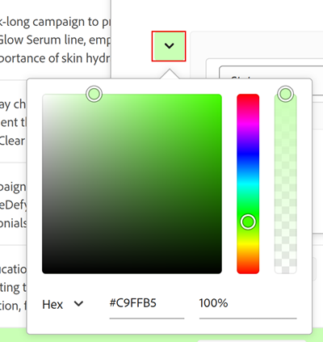

# 管理表格檢視

本頁標示的資訊是指尚未普遍可用的功能。 它僅在預覽環境中可供所有客戶使用。 每月發行至生產環境後，生產環境中為啟用快速發行的客戶也提供相同的功能。

如需快速發行資訊，請參閱[為您的組織啟用或停用快速發行](/help/quicksilver/administration-and-setup/set-up-workfront/configure-system-defaults/enable-fast-release-process.md)。

{{planning-important-intro}}

存取Adobe Workfront Planning中的記錄型別頁面時，您可以在表格檢視中顯示記錄及其欄位。

如需有關記錄檢視以及如何管理它們的資訊，請參閱[管理記錄檢視](/help/quicksilver/planning/views/manage-record-views.md)。

本文會說明下列資訊：

* [在表格檢視中建立或編輯欄和列](#manage-a-table-view)
* [啟用表格檢視的即時顯示狀態指示器](#enable-the-real-time-presence-indicator)

如需將表格檢視匯出為Excel或CSV檔案的相關資訊，請參閱[從表格檢視匯出記錄](/help/quicksilver/planning/records/export-records-from-the-table-view.md)。

## 存取需求

+++ 展開以檢視本文中功能的存取需求。 

<table style="table-layout:auto"> 
<col> 
</col> 
<col> 
</col> 
<tbody> 
    <tr> 
<tr> 
</tr>   
<tr> 
   <td role="rowheader">
Adobe Workfront套件
</td> 
   <td> 

任何Workfront和任何Planning套件

任何工作流程與任何Planning套件

如需每個Workfront Planning套件所含內容的詳細資訊，請聯絡您的Workfront客戶代表。 
 
   </td> 
  <tr> 
   <td role="rowheader">
Adobe Workfront授權
</td> 
   <td>
 建立和刪除檢視的標準

   
更新檢視元素的投稿人或更新者

  </td> 
  </tr> 
  <tr> 
   <td role="rowheader">
物件許可權
</td> 
   <td>   
管理檢視的許可權
  
   
檢視許可權以暫時變更檢視設定或複製檢視
 </td> 
  </tr> 
<tr>
   <td role="rowheader">
版面配置範本
</td>
   <td> 必須為具有輕度或貢獻者授權的使用者指派包含Planning的版面配置範本。
   
標準使用者和系統管理員預設會啟用Planning區域。

</li></ul>
</td>
  </tr> 
</tbody> 
</table>

如需Workfront存取需求的詳細資訊，請參閱Workfront檔案中的[存取需求](/help/quicksilver/administration-and-setup/add-users/access-levels-and-object-permissions/access-level-requirements-in-documentation.md)。

+++ 

<!--Old:
<table style="table-layout:auto"> 
<col> 
</col> 
<col> 
</col> 
<tbody> 
    <tr> 
<tr> 
<td> 
   
 Products
 </td> 
   <td> 
   <ul><li>
 Adobe Workfront
</li> 
   <li>
 Adobe Workfront Planning
</li></ul></td> 
  </tr>   
<tr> 
   <td role="rowheader">
Adobe Workfront plan*
</td> 
   <td> 

Any of the following Workfront plans:
 
<ul><li>Select</li> 
<li>Prime</li> 
<li>Ultimate</li></ul> 

Workfront Planning is not available for legacy Workfront plans
 
   </td> 
<tr> 
   <td role="rowheader">
Adobe Workfront Planning package*
</td> 
   <td> 

Any 
 

For more information about what is included in each Workfront Planning plan, contact your Workfront account manager. 
 
   </td> 
 <tr> 
   <td role="rowheader">
Adobe Workfront platform
</td> 
   <td> 

Your organization's instance of Workfront must be onboarded to the Adobe Unified Experience to be able to access Workfront Planning.
 

For more information, see <a href="/help/quicksilver/workfront-basics/navigate-workfront/workfront-navigation/adobe-unified-experience.md">Adobe Unified Experience for Workfront</a>. 
 
   </td> 
   </tr> 
  </tr> 
    <td role="rowheader">
Adobe Workfront license*
</td> 
   <td>
 Standard to create and delete views

   
Contributor or higher to update view elements

   
Workfront Planning is not available for legacy Workfront licenses
 
  </td> 
  </tr> 
  <tr> 
   <td role="rowheader">
Access level configuration
</td> 
   <td> 
There are no access level controls for Adobe Workfront Planning
   
</td> 
  </tr> 
<tr> 
   <td role="rowheader">
Object permissions
</td> 
   <td>   
Manage permissions to a view
  
   
View permissions to a view to temporarily change the view settings or to duplicate it
 </td> 
  </tr> 
<tr>
   <td role="rowheader">
Layout template
</td>
   <td> Users with a Light or Contributor license must be assigned a layout template that includes Planning.
   
Standard users and System Administrators have the Planning areas enabled by default.

</li></ul>
</td>
  </tr>
</tbody> 
</table> -->

## 使用表格檢視編輯記錄

您只能在表格檢視中編輯記錄資訊。

如需在表格檢視中編輯記錄的詳細資訊，請參閱[編輯記錄](/help/quicksilver/planning/records/edit-records.md)。

## 管理表格檢視 {#manage-a-table-view}

建立表格檢視時，選取型別的所有記錄都會顯示在表格中。 每一列都是唯一的記錄，每一欄都是一個記錄欄位。 預設會顯示所有欄位和所有記錄。

若要管理表格檢視：

1. 建立資料表檢視，如文章[管理記錄檢視](/help/quicksilver/planning/views/manage-record-views.md)中所述。

   

1. （選擇性）按一下&#x200B;**列高度**，然後從下列選項中選取，以修改表格列的高度：
   * 短
   * 媒體
   * 高

1. （選擇性）按一下&#x200B;**全熒幕**&#x200B;圖示以全熒幕開啟檢視，然後按一下&#x200B;**退出全熒幕**&#x200B;圖示或鍵盤上的Escape以退出全熒幕。

1. 更新下列檢視元素，如下列子區段所述：
   * [欄（或欄位）](#add-columns-or-fields)
   * [列（或記錄）](#add-rows-or-records)
   * [篩選器](#add-filters)
   * [排序](#add-a-sort)
   * [分組](#add-groupings)
   * [列顏色](#add-row-colors)
   * [即時狀態指示器](#enable-the-real-time-presence-indicator)

### 新增欄（或欄位） {#add-columns}

表格檢視的欄標題會顯示與檢視中記錄相關聯的欄位。 表格檢視中顯示的欄位也會顯示在記錄的「詳細資訊」區段中。

如需詳細資訊，請參閱[編輯記錄](/help/quicksilver/planning/records/edit-records.md)。

<!--this is not available yet:You can display record fields (or columns) in both a table and a timeline view. However, the number of columns displayed in the table of the timeline view is limited and you cannot add columns in addition to those selected by default.-->

將欄新增至檢視與將欄位新增至記錄型別相同。

您可以在表格檢視中新增最多500個欄位（或欄）。

1. 移至記錄型別頁面，然後按一下表格檢視標籤，或按一下&#x200B;**+檢視**&#x200B;以新增檢視，然後選擇&#x200B;**表格**。

1. 開始新增欄位（或欄），如文章[建立欄位](/help/quicksilver/planning/fields/create-fields.md)中所述。

   您新增的欄對存取記錄型別的所有使用者可見，並作為記錄頁面的新欄位新增。

1. （選擇性）按一下工具列中的&#x200B;**欄位**&#x200B;圖示，尋找清單中的欄位或搜尋欄位，然後取消選取欄位名稱右側的切換以隱藏欄位。

1. 執行下列任一項作業，重新排序表格中的欄：

   * 抓取欄標題，並將其拖放到所需位置。 您移動的欄會短暫地以藍色背景顯示，直到您對表格進行其他調整為止。

   * 按一下表格工具列中的&#x200B;**欄位**，然後依所需順序拖放欄位，再按一下&#x200B;**欄位可見度和順序**&#x200B;方塊外部以關閉它。

     

     >[!TIP]
     >
     >* 依預設，「名稱」欄位永遠是表格檢視中的第一個欄位。 系統會將此視為主要欄位。
     >
     >* 除非您指定其他欄位作為主要欄位，否則您無法將「名稱」欄位移至其他位置。 如需詳細資訊，請繼續進行步驟4。<!--accurate?-->
     >
     >

   * 變更主要欄位，以其他欄位取代第一欄中的欄位。 如需詳細資訊，請繼續步驟4。<!--accurate?-->

1. （選擇性）將滑鼠懸停在表格第一欄中未顯示之任何欄位之欄位標題中的欄位名稱上，按一下欄位名稱右側的向下箭頭，然後按一下&#x200B;**設定為主要欄位**。

   

1. 按一下&#x200B;**設定欄位**&#x200B;以進行確認。

   該欄位會變成主要欄位，表示它會顯示為表格檢視的第一欄。 前一個主要欄位會移至第二欄。

   主要欄位會成為記錄的標題，並顯示在記錄頁面的頁首區域，以及記錄顯示的每個位置。 例如，記錄標題會顯示在連線的欄位和所有檢視中。 如需主要欄位的詳細資訊，請參閱[主要欄位概述](/help/quicksilver/planning/fields/primary-field-overview.md)。

1. 按一下並拖曳欄分隔線，並將它們拖曳到所需的位置以增加欄寬。

   >[!TIP]
   >
   >您對欄寬和順序所做的變更是永久性的，並且所有存取該記錄型別的使用者都可以看到。

1. 暫留在欄標題上，然後按一下向下箭頭，然後按一下&#x200B;**隱藏欄位**

   或

   按一下表格工具列中的&#x200B;**欄位**，並停用與您要隱藏的欄位（或欄）相關聯的切換。 顯示&#x200B;**欄位可見性和順序**&#x200B;方塊。

   >[!TIP]
   >
   >隱藏欄位數會顯示在工具列的「欄位」圖示左側。

1. 按一下&#x200B;**欄位**&#x200B;圖示，並啟用與您要顯示在表格欄位中的欄位相關聯的切換。 預設會顯示所有欄位。

1. 執行下列動作以快速尋找符合關鍵字的記錄：

   1. 在&#x200B;**搜尋**&#x200B;方塊中，開始輸入與熒幕上顯示之記錄的任何欄位相關聯的關鍵字。 正確相符的數目會顯示在搜尋專案旁邊，而具有正確相符專案的欄位會反白顯示。

      

      您可以使用熒幕上可見的任何文字或特殊字元。

      您無法使用與表格檢視中隱藏之欄位關聯的關鍵字。

   1. 在鍵盤上按&#x200B;**Enter**&#x200B;以移至下一個找到的欄位。

   1. （選擇性）如果有多個相符專案，請按一下搜尋關鍵字右邊的向上和向下箭頭，以尋找表格中的所有相符專案。

   1. 按一下搜尋方塊中的&#x200B;**x**&#x200B;圖示以清除搜尋關鍵字。

### 新增列（或記錄） {#add-rows}

表格檢視的列會顯示所選記錄型別的個別記錄。

記錄型別最多可以有50,000筆記錄（或列）。

1. 移至記錄型別頁面，然後按一下表格檢視標籤，或按一下&#x200B;**+檢視**&#x200B;以新增檢視，然後選擇&#x200B;**表格**。

1. 開始新增記錄（或列），如文章[建立記錄](/help/quicksilver/planning/records/create-records.md)中所述。

   您在表格檢視中新增的記錄會立即儲存，且所有擁有工作區檢視或更高許可權的使用者皆可看到。

1. （選擇性）新增縮圖至每筆記錄，並按一下表格右上角的&#x200B;**欄位**，然後選取&#x200B;**縮圖**&#x200B;欄位的切換按鈕，將其顯示在主要欄位的左側。 預設會取消選取它。

   如需詳細資訊，請參閱[新增縮圖至記錄](/help/quicksilver/planning/records/add-thumbnails-to-records.md)。

1. （選擇性）選取一列中的一或多個記錄，然後將&#x200B;**控制代碼**&#x200B;圖示拖放到記錄左側，以重新排序列。

   >[!NOTE]
   >
   >如果您對表格檢視至少套用一種排序，則無法重新排序列。
   >
   >存取記錄型別的所有使用者都可以看到您對資料列順序所做的變更

<!-- this section below links from the timeline view; consider splitting them if they become different-->

### 新增篩選器 {#add-filters}

篩選器可協助您減少熒幕上顯示的資訊量。

在表格檢視中使用篩選器時，請考量下列事項：

<!-- this list is almost identical to the one for the table view - update both-->

* 您為表格檢視建立的篩選器在套用至相同記錄型別時，會與時間軸檢視中的篩選器分開運作。

* 這些篩選器對於您選取的檢視而言是唯一的。 相同記錄型別的兩個表格檢視可以套用不同的篩選器。 檢視相同表格檢視的兩個使用者會看到目前套用的相同篩選器。

* 您無法為您建立並套用至表格檢視的篩選器命名。

* 移除篩選器會將其從存取與您相同記錄型別的任何人中移除，並使用與您使用的相同檢視。

* 您可以依已連線的記錄欄位或查詢欄位進行篩選。

* 您可以依顯示多個值的查閱欄位進行篩選。

* 您可以參考與目前記錄型別相距最多4個層級的欄位。 例如，如果您正在建立「活動」記錄型別的篩選器，且「活動」已連線至「產品」記錄型別，而該記錄型別已連線至「行銷活動」記錄型別，而該記錄型別已連線至「Workfront專案」，則您可以在為「活動」記錄型別建立的篩選器中，參考專案的「預算」。

若要將篩選器新增至表格檢視：

1. 建立記錄型別頁面的資料表檢視，如文章[管理記錄檢視](/help/quicksilver/planning/views/manage-record-views.md)中所述。
1. 選取表格檢視，然後按一下表格右上角的&#x200B;**篩選器**。
1. 按一下&#x200B;**新增條件**&#x200B;並新增下列資訊：

   * 搜尋欄位或按一下下拉式功能表，以顯示欄位清單並從清單中選取它。

   * **選取選項** （或篩選修飾元）以定義欄位必須符合何種條件

     下表顯示每種欄位型別的可用修飾元。

     <table>
        <thead>
        <tr>
            <th><b>欄位類型</b></th>
            <th><b>修飾元</b></th>
        </tr>
        </thead>
        <tbody>
        <tr>
            <td>單行，段落，公式 </td>
            <td>
包含

            
不包含

            
是

            
不是

            
是空的

            
不是空的
</td>
        </tr>
        <tr><td>單選</td>
            <td>
是

            
不是

            
屬於任一

            
不屬於

            
是空的

            
不是空的
</td>
        </tr>
        <tr>
            <td>多選，人員</td>
            <td>
具有任一

            
具有所有

            
完全符合

            
不具有

            
是空的

            
不是空的
</td>
        </tr>
        <tr>
            <td>數字、百分比、貨幣</td>
            <td>
=

            
≠

            
 &lt; 

            
&gt;

            
≤

            
≥

            
是空的

            
不是空的
</td>
        </tr>
        <tr>
            <td>日期</td>
            <td>
是

            
不是

            
晚於

            
早於

            
介於

不介於

            
是空的

不是空的
</td>
        </tr>

     <tr>
            <td>核取方塊</td>
            <td>
是

        </tr>
        </tbody>
        </table>

   * 選取所選欄位的值。

   

   您可以新增的篩選條件數量沒有限制。

1. （選擇性）按一下&#x200B;**新增條件**&#x200B;以新增另一個篩選選項，並重複上述步驟。 套用的篩選器數會顯示在「篩選器」圖示的左側。
1. 按一下下列運運算元，指示如何聯結及套用篩選條件：

   * **AND**：必須符合所有指定的條件。
   * **OR**：必須符合任何指定的條件。 這是預設選項。

   1. （選用）在多個條件群組之間新增其他&#x200B;**AND**&#x200B;或&#x200B;**OR**&#x200B;運運算元。

      

   系統會自動篩選記錄清單。 <!--at this time, you can't name and save the filter - but will this change?!-->
   <!-- asked on the task for the simple filters whether there is a limitation for how many statements a filter can have?!-->

1. （選擇性）按一下&#x200B;**x**&#x200B;圖示以移除篩選條件。
1. （選擇性）按一下&#x200B;**篩選器**&#x200B;以關閉篩選器方塊。<!--right now you cannot "clear all" for filters, but this might come later-->

### 新增排序 {#sort-information}

透過套用排序，您可以依指定順序組織資訊。

您可以排序下列資訊：

* 表格檢視中的所有記錄。<!--or timeline view. ***********verify this is the case for the timeline view*********************-->
  <!--* All groupings. - this is not available yet-->

在表格檢視中排序記錄時，請考量下列事項：

<!-- if this is available for the timeline view, update both when you update one-->

* 排序對您選取的檢視而言是唯一的。 相同記錄型別的兩個表格檢視可套用不同的排序標準。 檢視相同表格檢視的兩個使用者會看到目前套用的相同排序。

* 您無法命名您建置並套用至表格檢視的排序。

* 當您導覽到其他位置時，您建立的排序會保留。

* 您可以依顯示在記錄型別表格檢視中的欄位數量來排序。

* 您無法依已連線的記錄欄位排序，但可以依已連線的記錄型別的查閱欄位排序。

* 當您依據具有多個值（彙總器尚未彙總）的查閱欄位進行排序時，會使用第一個值排序。

* 移除排序標準會將它們從存取與您相同記錄型別的任何人中移除，並使用與您使用的相同檢視。

* 您可以參考與目前記錄型別相距最多4個層級的欄位。 例如，如果您正在建立「活動」記錄型別的排序，且「活動」已連線至「產品」記錄型別，而該記錄型別已連線至「行銷活動」記錄型別，而該記錄型別已連線至「Workfront專案」，則您可以在針對「活動」記錄型別建立的排序中參考專案的「狀態」。

若要排序<!--ungrouped (add this when sorting for groupings will be available-->筆記錄，請執行下列動作：

1. 建立資料表檢視，如文章[管理記錄檢視](/help/quicksilver/planning/views/manage-record-views.md)中所述。
1. 按一下表格右上角的&#x200B;**排序**&#x200B;圖示

   或

   暫留在表格檢視中的欄名稱上，按一下欄標題名稱右側的向下箭頭，然後按一下&#x200B;**依此欄位排序**。 欄位會在表格檢視右上角的「排序」圖示中新增為排序選取專案。

1. （視條件而定）在&#x200B;**依**&#x200B;排序記錄方塊中，按一下其中一個建議的欄位，或按一下&#x200B;**選擇其他欄位**&#x200B;並搜尋其他欄位，然後在欄位顯示在清單中時按一下它。

   排序會自動套用至表格檢視，且記錄會依您選取的條件排序。

   <!-- add a step that you can rearrange the sorting fields here, when this will be possible-->

1. （選擇性）按一下&#x200B;**新增條件**，然後重複上述步驟以依其他欄位排序。

   排序依據的欄位數會顯示在工具列右上角的「排序」圖示左側。 您只能選擇顯示在表格檢視欄中的欄位。

1. （選擇性）在&#x200B;**記錄排序依據**&#x200B;方塊中，按一下排序欄位右側的&#x200B;**x**&#x200B;圖示以移除排序

   或

   按一下&#x200B;**全部清除**&#x200B;以移除排序中的所有欄位。

1. 按一下&#x200B;**依**&#x200B;排序記錄方塊外部以將其關閉。

   

   表格中顯示的資訊會根據您選取的條件排序。

   為排序選取的欄位會顯示排序圖示，後面跟著數字，表示套用排序的順序。

### 新增群組 {#add-groupings}

<!--this section exists in the timeline view too, but the display is slightly different, so I kept both steps; consider updating both sections if any updates to groupings are introduced-->

將群組套用至檢視時，您可以依照類似的資訊來群組記錄。

請考量下列事項：

* 您可以在表格和時間軸檢視中套用群組。 表格檢視的分組與相同記錄型別之時間軸檢視中的群組是獨立的。
* 您可以在檢視中套用3個群組層級。 記錄會依照您選取的群組順序進行分組。
&lt;!—*使用API時，您最多可以套用4個層級的群組。  — 現在正在檢查此專案 — >
* 群組對於您選取的檢視而言是唯一的。 相同記錄型別的兩個表格檢視可以套用不同的群組。 檢視相同表格檢視的兩個使用者會看到目前套用的相同分組。
* 您無法為表格檢視建立的分組命名。
* 移除群組會將群組從存取與您相同記錄型別以及顯示與您相同檢視的任何人中移除。
* 您可以編輯列在群組下的記錄。
* 您可以依連線的記錄欄位或查詢欄位來分組。
* 當您依具有多個值（尚未由彙總器彙總）的查閱欄位來分組時，記錄會依每個唯一的欄位值組合來分組。
* 您可以參考與目前記錄型別相距最多4個層級的欄位。 例如，如果您正在建立「活動」記錄型別的群組，且「活動」已連線至「產品」記錄型別，而該記錄型別已連線至「行銷活動」記錄型別，而該記錄型別已連線至「Workfront專案」，則您可在您為「活動」記錄型別所建立的分組中參考專案的「狀態」。
* 群組會按其值的字母順序列出。
<!--checking into this: * You can apply up to 4 levels of grouping when using the API. -->
<!-- checking also into this: * You cannot group by a Paragraph-type field.-->

若要新增群組：

1. 如文章[管理記錄檢視](/help/quicksilver/planning/views/manage-record-views.md)中所述，建立記錄型別的時間表檢視。
1. 按一下表格檢視右上角的&#x200B;**群組**。

   

1. 按一下其中一個建議的欄位，或按一下&#x200B;**選擇其他欄位**，搜尋其他欄位，然後在欄位顯示在清單中時按一下它。

   此分組會自動套用至表格，且記錄會顯示在分組分隔行下方。

1. （選擇性）按一下&#x200B;**新增條件**&#x200B;並重複上述步驟以新增最多3個群組。

   為分組選取的欄位數會顯示在「分組」圖示旁。

   

1. （選擇性）在&#x200B;**群組記錄依據**&#x200B;方塊中，按一下選取要移除分組的欄位右邊的&#x200B;**x**&#x200B;圖示

   或

   按一下&#x200B;**全部清除**&#x200B;以移除所有欄位。

1. 按一下「**依**&#x200B;分組記錄」方塊外部以關閉它。
1. （選擇性）在任何群組結束時按一下&#x200B;**+新記錄**&#x200B;以新增記錄，然後重新整理您的頁面以將新記錄新增到適當的群組。<!--this might need to be changed when they add the Refresh button on the toolbar of the table view-->

1. 若要展開或收合群組，請執行下列任一項動作：

   1. 按一下&#x200B;**群組**&#x200B;圖示，然後&#x200B;**全部展開**，或&#x200B;**全部收合**。 這會展開表格檢視中的所有群組和子群組。

      

   1. 以滑鼠右鍵按一下表格檢視中的任何群組標頭，然後按一下下列其中一個選項：
      * **展開群組**
      * **摺疊群組**
      * **全部展開**
      * **全部收合**
      * **展開子群組**
      * **摺疊子群組**

      視您套用至檢視的群組數量而定，某些選項可能無法使用。

<!-- this is not available yet: 

To sort grouped records: 

1. Create a view, as described in [Create or edit record views](#create-or-edit-record-views). 
1. ************************* add steps here for sorting grouped records****************

-->

### 新增列顏色

1. （選擇性）按一下&#x200B;**列色彩**&#x200B;以定義條件並選擇為表格列設定不同的色彩。

1. 按一下&#x200B;**新增色彩**，然後搜尋欄位，或者按一下下拉式功能表，以顯示欄位清單並從清單中選取它。 這是您要決定列顏色的欄位。

   例如，若要以綠色顯示狀態為「作用中」的行銷活動，請選取「**狀態**」，然後為該欄位選擇修飾元和值。

   ![已選取[使用中]狀態且預設顏色選擇的[列顏色]方塊](assets/row-colors-box-with-active-status-selected-default-color-choice.png)

1. 按一下所選取條件左上角之檢色器的下拉式功能表，以選取條件的顏色，然後按一下檢色器方塊外部以關閉它。

   

1. （選擇性）按一下&#x200B;**新增條件**，將更多欄位和值新增至第一組條件

   或

   按一下&#x200B;**新增顏色**&#x200B;以新增一組條件並識別新顏色。

   例如，您可以定義一組新的條件，以黃色顯示「計畫」狀態的行銷活動。

   

1. （選擇性）開啟[列色彩]方塊右上角的&#x200B;**套用至整列**&#x200B;設定。 符合條件的整列會自動以選取的顏色顯示。

   >[!NOTE]
   >
   >* 如果關閉「套用至整個列」設定，則只有「主要」欄位的左側會顯示具有所選顏色的窄顏色指示器。 此設定預設為關閉。
   >
   >* 在表格檢視中選取至少一個群組時，您無法將列顏色套用至整列。

1. 按一下&#x200B;**列色彩**&#x200B;方塊外部以將其關閉。 會自動套用顏色。

### 啟用即時顯示狀態指示器

根據預設，當您編輯記錄資訊的同時，其他使用者的頭像會顯示在所有記錄檢視的右上角。

當您顯示表格檢視時，也可以檢視另一個使用者在您檢視記錄時正在編輯的欄位。

1. 移至記錄型別頁面並開啟任何檢視。
1. （視條件而定）如果有其他使用者同時編輯所選型別的記錄，則其頭像會顯示在檢視的右上角。
1. 按一下頭像旁的下拉式功能表，選取「**顯示共同作業人員**」切換按鈕。 依預設，會選取切換。

   

1. （視條件而定）開啟表格檢視，另一個人正在主動編輯的欄位會以對應表格檢視中其顯示圖片外框的顏色反白。

   如果頭像的醒目提示顏色是灰色，使用者將在30秒前停止主動編輯記錄。

   

   >[!TIP]
   >
   >您可以從任何檢視中選取&#x200B;**顯示共同作業人員**&#x200B;切換按鈕。 目前由其他人編輯的欄位僅在表格檢視中列出。

