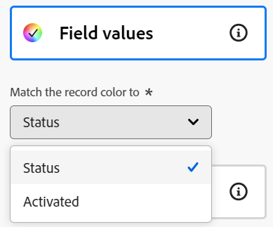

# 管理時間表檢視

<!--
title: Manage the timeline view 
description: You can display records in a timeline view, when accessing the record type page in Adobe Workfront Planning. 
hidefromtoc: yes
hide: yes
author: Alina
feature: Work Management
role: User
-->

<!--update the metadata with real information when making this available in TOC and in the left nav-->

{{planning-important-intro}}

存取Adobe Workfront Planning中的記錄型別頁面時，您可以在時間軸檢視中顯示記錄。

如需有關記錄檢視的資訊，請參閱[管理記錄檢視](/help/quicksilver/planning/views/manage-record-views.md)。

## 存取需求

您必須具有下列存取權才能執行本文中的步驟：

<!--at GA the plan below will change to Prime, Select and Ultimate only-->

<table style="table-layout:auto">
 <col>
 </col>
 <col>
 </col>
 <tbody>
    <tr>
<tr>
<td>
   
 產品
 </td>
   <td>
   
 Adobe Workfront
 </td>
  </tr>  
 <td role="rowheader">
Adobe Workfront合約
</td>
   <td>

您的組織必須處於Workfront Planning的早期存取階段中註冊 

   </td>
  </tr>
  <tr>
   <td role="rowheader">
Adobe Workfront計畫
</td>
   <td>

任何

   </td>
  </tr>
  <tr>
   <td role="rowheader">
Adobe Workfront授權*
</td>
   <td>
   
新增：標準

   或
   
目前：計畫 
 
  </td>
  </tr>

<tr>
   <td role="rowheader">
存取層級設定
</td>
   <td> Adobe Workfront Planning沒有存取控制
  
</td>
  </tr>

<tr>
   <td role="rowheader">
權限
</td>
   <td> 
管理檢視的許可權
  
   
檢視許可權以暫時變更檢視設定

</td>
  </tr>

<tr>
   <td role="rowheader">
版面配置範本
</td>
   <td> 
必須為所有使用者(包括Workfront管理員)指派一個版面配置範本，該範本包含主功能表中的Planning區域。 
 
如需詳細資訊，請參閱<a href="/help/quicksilver/planning/access/access-overview.md">存取總覽</a>。 
 
</td>
  </tr>
 </tbody>
</table>

*如需詳細資訊，請參閱Workfront檔案中的[存取需求](/help/quicksilver/administration-and-setup/add-users/access-levels-and-object-permissions/access-level-requirements-in-documentation.md)。

## 管理時間表檢視 {#manage-a-timeline-view}

<!--insert screen shot of timeline view-->

建立時間表檢視時，所選記錄型別的所有記錄都會以時間順序時間表顯示。

請考量下列事項：

* 您至少有兩個日期欄位與記錄型別相關聯時，才能建立時間表檢視。 當您有一個或沒有與記錄型別相關聯的日期欄位時，時間軸檢視選項會變暗。

  您可以從記錄日期欄位中選取，或從連線的記錄或物件型別中查詢日期欄位。
* 根據與記錄關聯的日期，在下列情況下，某些記錄可能不會顯示在時間軸檢視中：

   * 當開始和結束日期沒有值時
   * 當「開始」或「結束」日期沒有值時
   * 當開始日期在結束日期之後時

若要管理時間表檢視：

1. 移至您要檢視其時間軸的記錄型別頁面。
1. 建立時間表檢視，如文章[管理記錄檢視](/help/quicksilver/planning/views/manage-record-views.md)中所述。

   

   與您選取的記錄型別相關聯的記錄會在時間軸中顯示為長條，並依其開始日期的時間順序依預設排序。

   >[!TIP]
   >
   >    時間軸中記錄的排序在壓縮檢視中不可見。

1. 執行下列任一項作業來瀏覽時間軸：

   * 按一下左右圖示，或使用水準捲動在時間軸中前後移動。
   * 按一下&#x200B;**今天**，將時間表置中到今天的日期。
   * 從時間範圍下拉式選單中選取下列其中一個選項，以更新時間增量：

      * 年
      * 季度
      * 月
1. 按一下&#x200B;**切換至標準**&#x200B;檢視，以個別行<!--check to see if they updated the name of the setting here-->顯示記錄

   或

   按一下&#x200B;**切換到壓縮檢視**&#x200B;以顯示日期在同一行上不相交的記錄。<!--check to see if they updated the name of the setting here-->

   預設情況下，記錄會顯示在「壓縮」檢視中。

1. 執行下列動作以快速尋找符合關鍵字的記錄：

   1. 按一下&#x200B;**搜尋**&#x200B;圖示，然後開始輸入與熒幕上顯示之記錄的任何欄位相關聯的關鍵字。 正確相符的數目會顯示在搜尋專案旁邊，而具有正確相符專案的記錄會反白顯示。

      

      您可以使用熒幕上可見的任何文字或特殊字元。

      您無法使用與未顯示在時間表檢視中的欄位關聯的關鍵字。

   1. 在鍵盤上按Enter鍵以移至下一個找到的欄位。
   1. （選擇性）如果有多個相符專案，請按一下搜尋關鍵字右邊的向上和向下箭頭，以尋找表格中的所有相符專案。
   1. 按一下搜尋方塊中的&#x200B;**x**&#x200B;圖示以清除搜尋關鍵字。

1. 更新下列檢視元素，如下列子區段所述：
   * [篩選器](#add-filters)
   * [分組](#add-grouping)
   * [設定](#edit-the-timeline-view-settings)
     <!--* [Sort](#add-sort) not sure if this is present in timeline views?!; also check the anchor and make sure it's correct-->

### 新增篩選器

您可以使用篩選器來減少熒幕上顯示的資訊量。

在時間軸檢視中使用篩選器時，請考量下列事項：

<!-- this list is almost identical to the one for the table view - update both-->

* 您為時間軸檢視建立的篩選器與套用至相同記錄型別之任何其他檢視中的篩選器是獨立運作的。

* 這些篩選器對於您選取的檢視而言是唯一的。 相同記錄型別的兩個時間軸檢視可以套用不同的篩選器。

* 檢視相同時間表檢視的兩個使用者會看到目前套用的相同篩選器。

* 您無法為您為時間表檢視建置的篩選器命名。

* 移除篩選器會將篩選器從存取與您相同記錄型別以及顯示與您相同檢視的任何人移除。

* 在時間軸檢視中新增濾鏡，與在表格檢視中新增濾鏡相同。

  如需詳細資訊，請參閱文章[管理資料表檢視](/help/quicksilver/planning/views/manage-the-table-view.md)中的「新增篩選器」一節。

* 您可以依已連線的記錄欄位或查詢欄位進行篩選。
* 您可以依顯示多個值的查閱欄位進行篩選。

### 新增分組

<!-- groupings are almost identical between this view and table  but they display a little differently, so I kept the steps for both; update in both places if they make changes to groupings-->

將群組套用至檢視時，您可以依照類似的資訊來群組記錄。

在時間軸檢視中新增群組，類似於在表格檢視中新增群組。

在時間軸檢視中使用群組時，請考量下列事項：

* 您可以在表格和時間軸檢視中套用群組。 表格檢視的分組與相同記錄型別之時間軸檢視中的群組是獨立的。
* 您可以在檢視中套用3個群組層級。 記錄會依照您選取的群組順序進行分組。
&lt;！—*使用API時，您最多可以套用4個層級的群組。  — 現在正在檢查此專案 — >
* 群組對於您選取的檢視而言是唯一的。 相同記錄型別的兩個表格檢視可以套用不同的群組。 檢視相同表格檢視的兩個使用者會看到目前套用的相同分組。
* 您無法為表格檢視建立的分組命名。
* 移除群組會將群組從存取與您相同記錄型別以及顯示與您相同檢視的任何人中移除。
* 您可以編輯列在群組下的記錄。
* 您可以依連線的記錄欄位或查詢欄位來分組。
* 當您依具有多個值（尚未由彙總器彙總）的查閱欄位來分組時，記錄會依每個唯一的欄位值組合來分組。
* 您可以參考與目前記錄型別相距最多4個層級的欄位。 例如，如果您正在建立「活動」記錄型別的群組，且「活動」已連線至「產品」記錄型別，而該記錄型別已連線至「行銷活動」記錄型別，而該記錄型別已連線至「Workfront專案」，則您可在您為「活動」記錄型別所建立的分組中參考專案的「狀態」。
<!--checking into this: * You can apply up to 4 levels of grouping when using the API. -->
<!-- checking also into this: * You cannot group by a Paragraph-type field.-->

若要在時間表檢視中新增群組：

1. 如文章[管理記錄檢視](/help/quicksilver/planning/views/manage-record-views.md)中所述，建立記錄型別的時間表檢視。
1. 按一下時間軸檢視右上角的&#x200B;**群組**。

   

1. 按一下其中一個建議的欄位，或按一下&#x200B;**選擇其他欄位**，搜尋其他欄位，然後在欄位顯示在清單中時按一下它。

   分組會自動套用至時間軸，且記錄會顯示在分組方塊內。

   <!-- add a step that you can rearrange the groupings here, when this will be possible-->

1. （可選）重複上述步驟以新增最多3個群組。

   為分組選取的欄位數會顯示在「分組」圖示旁。

   <!-- update screen shot with view redesign-->

   

1. （選擇性）在&#x200B;**群組記錄依據**&#x200B;方塊中，按一下選取要移除分組的欄位右邊的&#x200B;**x**&#x200B;圖示

   或

   按一下&#x200B;**全部清除**&#x200B;以移除所有欄位。

1. 按一下「**依**&#x200B;分組記錄」方塊外部以關閉它。
1. （選擇性）按一下&#x200B;**設定**，然後按一下&#x200B;**色彩**&#x200B;以使用色彩代碼分組。 如需詳細資訊，請參閱本文中的[編輯時間表檢視設定](#edit-the-timeline-view-settings)一節。

<!-- 

### Add sort

this is not possible right now; if this is the same functionality as the table view, document it there and link from here. 

-->

### 編輯時間軸檢視設定 {#edit-the-timeline-view-settings}

更新時間軸檢視設定，以指示要在檢視的時間軸區段中顯示哪些資訊及顯示方式。

1. 如文章[管理記錄檢視](/help/quicksilver/planning/views/manage-record-views.md)中所述，建立記錄型別的時間表檢視。
1. 按一下&#x200B;**設定**。
1. 按一下左側面板中的&#x200B;**日期和時間**，然後選取要在時間軸上顯示的&#x200B;**開始日期**&#x200B;和&#x200B;**結束日期**。 您可以選擇預設的「開始」和「結束」日期，也可以選擇任何可用的日期欄位。 代表記錄的長條圖，其開始日期為您為「開始」日期指定的日期，結束日期為您與「結束」日期對應的日期。

   >[!NOTE]
   >
   >沒有開始或結束日期值或開始日期晚於結束日期的記錄不會顯示在時間軸檢視中。

1. 按一下左側面板中的&#x200B;**列樣式**，以指示您要在記錄列上顯示的欄位。

   預設會選取記錄的主要欄位（或標題），如記錄的表格檢視中所定義。<!--adjust this when the primary field is released??-->

1. （選擇性和條件性）如果您將縮圖新增至記錄，請選取「縮圖」選項，以顯示與其記錄列中的記錄相關聯的影像。

   >[!NOTE]
   >
   >    您必須先在表格檢視中新增縮圖，才能在時間軸檢視中顯示它們。 如需詳細資訊，請參閱[新增縮圖至記錄](/help/quicksilver/planning/records/add-thumbnails-to-records.md)。

1. 按一下&#x200B;**新增欄位**&#x200B;以將最多4個欄位新增到記錄列。
1. 在&#x200B;**搜尋欄位**&#x200B;方塊內按一下，然後按一下您要新增的欄位。

   >[!TIP]
   >
   >   * 您必須先建立欄位，才能將其新增到記錄列。
   > 
   >   * 您必須至少選取一個欄位。 預設會選取&#x200B;**名稱**。

   右側會顯示時間軸上長條圖的外觀。

   

1. 按一下左側面板中的&#x200B;**色彩**，以自訂時間軸中記錄和群組的色彩。

   

1. （條件式與選擇性）如果您將群組新增至時間軸檢視，請從下列選項中選取，以在&#x200B;**設定群組顏色**&#x200B;區段中設定群組的顏色：

   * **預設（灰色）**：群組的顏色設定為灰色。 這是預設值。
   * **欄位值**：群組的顏色符合您群組依據之欄位的顏色。

     >[!NOTE]
     >
     >    * 您只能將顏色與具有顏色編碼選項的欄位比對。 例如，您可以將顏色與「狀態」欄位配對，或與顏色關聯的選項欄位。
     >    
     >    * 您無法從連結的記錄或物件型別中尋找符合顏色的欄位。

   例如，多選或單選欄位可以有顏色編碼的選項。

   如果您依據沒有顏色編碼選項的欄位分組，則分組顏色保持灰色。

   >[!TIP]
   >
   >如果您未將群組新增至時間軸檢視，則不會顯示此區段。

1. 在&#x200B;**設定記錄色彩**&#x200B;區段中，從下列選項中選取，以設定記錄的色彩：

   * **記錄型別**：記錄的顏色符合您選取的記錄型別顏色。 這是預設選項。
   * **欄位值**：記錄的顏色符合您指定的欄位顏色。 繼續步驟10。<!--ensure this stays accurate-->
   * **群組**：記錄的顏色符合您為群組指定的顏色。 當您未將群組套用到時間軸檢視時，此選項會變暗。
   * **無**：記錄以白色列顯示。

1. （視條件而定）如果您為記錄顏色選取&#x200B;**欄位值**，請從&#x200B;**將記錄顏色與**&#x200B;下拉式功能表中選取欄位。

   

   下拉式選單中只會顯示具有色彩編碼選項的欄位。

   例如，多選或單選欄位可以有顏色編碼的選項。

   如果選取的記錄型別沒有包含顏色編碼選項的欄位，則此選項會變暗。

1. 按一下「**儲存**」。

   記錄會以您所選取的規格顯示在時間軸檢視中。
