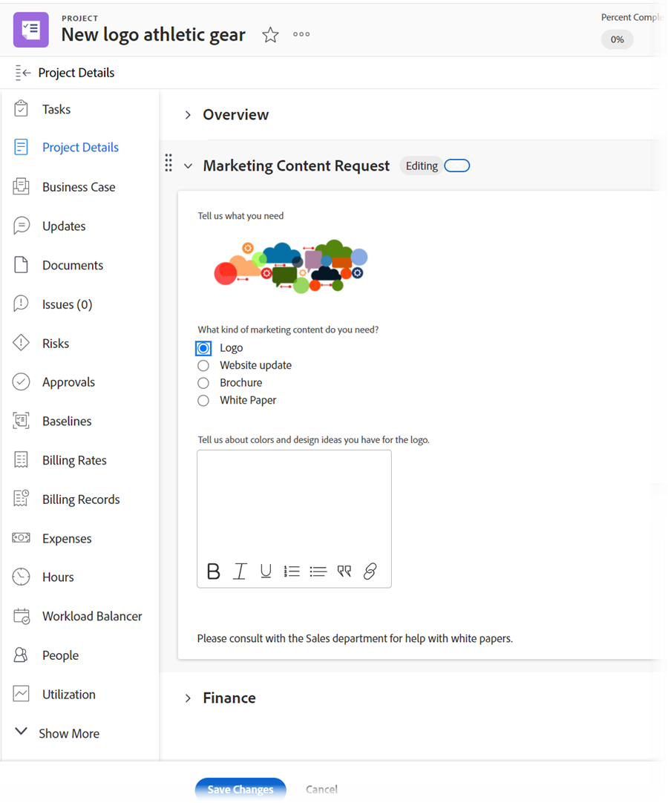
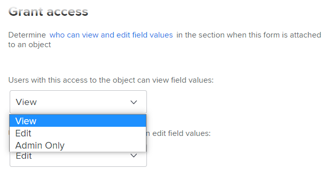

# 自訂表單增強功能

在22.2版本中，為管理自訂表單進行了以下重要增強。

## 新增資產Widget

您可以在自訂表單中內嵌影像。 這可讓您以更具互動性和視覺化的方式與自訂表單使用者通訊。 即將推出其他Widget型別。


將包含Widget的自訂表單附加到物件時，使用物件的使用者可在下列區域看到它：

* 物件的「詳細資訊」區域（例如，專案的「詳細資訊」區域）&#x200B;。

  

* 物件的「編輯」方塊(如果它具有新的Adobe Workfront體驗外觀) （例如「編輯專案」和「編輯任務」方塊）&#x200B;。

  

目前，使用者無法在下列區域看到Widget&#x200B;：

* 清單與報告
* 首頁和摘要
* 物件的「編輯」方塊(如果它沒有新的Adobe Workfront體驗外觀) （例如「編輯費用」方塊）
* Workfront&#x200B;行動應用程式

## 將自訂表單與多個物件型別建立關聯

您可以將多個物件型別與任何新的自訂表單建立關聯：


或任何現有的自訂表單：


這可讓您建立單一自訂表單，以用於專案、任務、問題以及自訂表單支援的任何其他型別的物件。

當您轉換問題或任務時，這會特別有用，因為您可以將自訂表單及其資料結轉到轉換的物件。 您不再需要針對各種物件型別建立和維護相同自訂表單的精確副本，手動將自訂表單新增到專案。

>[!INFO]
>
>**範例：**
>
>某人提交內部IT請求（問題），並提供附加自訂表格中所需專案的詳細資訊。
>
>您可以將問題轉換為專案，以供處理該專案的使用者使用。
>
>由於包含提交者詳細資料的自訂表單與問題和專案物件型別都有關聯，因此在轉換期間，自訂表單和所有這些詳細資料都會轉移到專案中。

>[!NOTE]
>
>轉換發生時，自訂表單必須與您要轉換的物件型別相關聯。

當您建立或編輯多物件自訂表單時，請考量下列事項：

* [分割槽符號的許可權選項](#permission-options-for-section-breaks)
* [計算的自訂欄位相容性](#calculated-custom-field-compatibility)
* [從自訂表單中刪除物件型別時請小心](#caution-about-deleting-an-object-type-from-a-custom-form)

### 分割槽符號的許可權選項

「問題」、「任務」、「專案」和「使用者」物件型別可用的分割槽符號許可權選項組，比所有其他物件型別的許可權選項組多了一個許可權選項：「有限編輯」。


適用於所有其他物件型別(Portfolio、檔案、方案、費用、公司、反複專案、記帳記錄和群組)的一組分割槽符號許可權不包含有限編輯：



在與來自這兩個群組的物件型別相關聯的自訂表單中，系統會使用一組適用於所有物件型別的通用分割槽符號許可權。 特別是，此通用集不會使用有限編輯許可權選項，而會取代有限編輯許可權選項的編輯許可權選項。 「編輯」選項與所有物件型別相容。

當您關聯使用與自訂表單上其他物件型別不同許可權選項的物件型別時，將會顯示一則訊息，允許您切換至用於表單的通用許可權選項集。 此變更將套用至所有欄位，即使它們不在分割槽符號下亦然。

### 計算的自訂欄位相容性

在多物件自訂表單中，如果計算欄位參考的欄位可用於表單的所有關聯物件型別（例如{name}、{description}和{entryDate}，可用於多個物件型別），則無論您將資料附加至哪個物件，資料都會正確計算。

例如，如果您擁有專案和問題的多物件表單，並且您新增了包含{name}運算式的計算欄位，則當您新增表單至專案時，該欄位會顯示專案名稱，而您新增表單至任務的任務名稱。

與物件不相容的欄位會在表單上顯示N/A。

>[!INFO]
>
>**範例：**&#x200B;在與任務物件型別相關聯的自訂表單中，您建立參照內建欄位「指派至：名稱」的計算自訂欄位，以便在表單附加至任務時，顯示負責的主要受指派人名稱：
>
>```
>Assigned To: Name{assignedTo}.{name}
>```
>
>您稍後會將Project物件型別新增至自訂表單。 警告訊息會告訴您Project物件型別與計算的自訂欄位不相容。 這是因為「指派至」欄位不適用於專案。

發生此情況時，您可以執行下列任一項作業：

* 從自訂表單中移除兩個不相容的專案之一：物件型別或參照的欄位。
* 保留這兩個專案，並使用萬用字元篩選器變數`$$OBJCODE`作為IF運算式中的條件，以建立兩個不同版本的In Charge欄位。 這允許欄位成功運作，無論表單附加到的物件型別為何。

  以上範例為例，雖然專案沒有內建的「指派至：名稱」欄位，但內建的「擁有者」欄位會自動填入建立專案者的名稱，除非有人手動變更此欄位。 因此，在自訂負責欄位中，當自訂表單附加到專案時，您可以使用如下所示`$$OBJCODE`來參考「所有者」欄位，而當表單附加到任務時，使用「指派至：名稱」欄位：

  ```
  IF($$OBJCODE="PROJ",{owner}.{name},{assignedTo}.{name})
  ```

>[!NOTE]
>
>  如果您在欄位名稱前面新增物件型別，它會參考物件的父物件，因此您無法將`{project}.{name}`用於專案，但您可以將其用於任務。


如需`$$OBJCODE`等變數的詳細資訊，請參閱[萬用字元篩選變數概觀](/help/quicksilver/reports-and-dashboards/reports/reporting-elements/understand-wildcard-filter-variables.md)。

### 從自訂表單中刪除物件型別時請小心

您可以隨時刪除自訂表單上的物件型別，但應謹慎操作。 如果使用者已經將自訂表單附加到您要刪除的物件型別，並新增資料，當您刪除表單上的該物件型別時，該資料將會永久刪除。

此外，沒有通知系統可提醒使用自訂表單的使用者該表單已被刪除。

如需詳細資訊，請參閱[從系統刪除自訂欄位或Widget](/help/quicksilver/administration-and-setup/customize-workfront/create-manage-custom-forms/delete-a-custom-field.md)。
