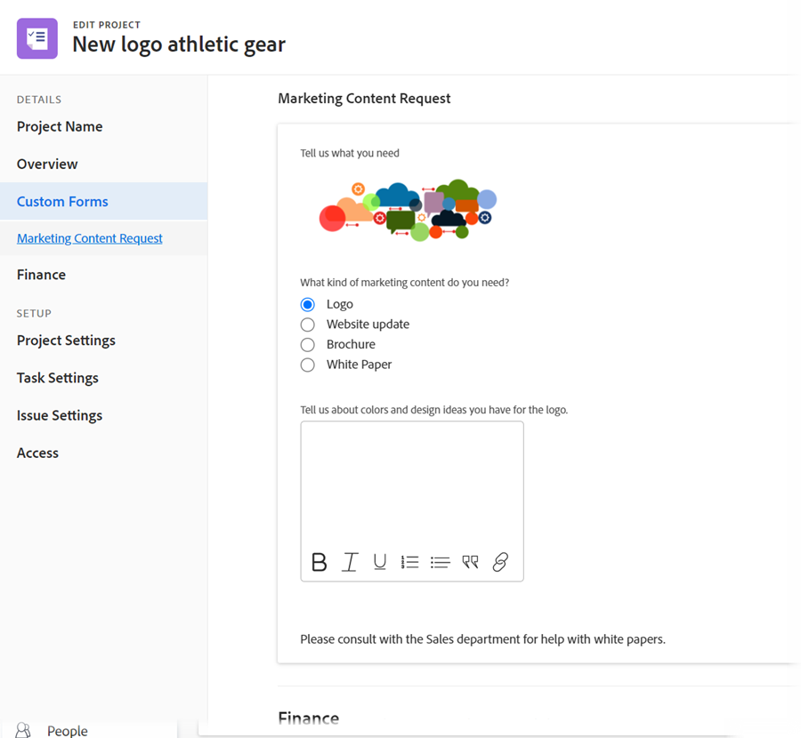
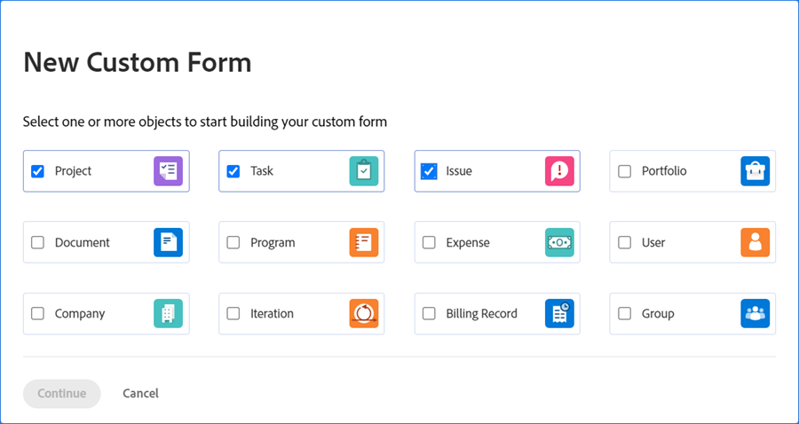

# 自訂表單增強功能

在22.2版中，管理自訂表單的功能已大幅增強。

## 新增資產小工具

您可以在自訂表單中內嵌影像。 這可讓您以更具互動性和視覺化的方式與自訂表單使用者通訊。 即將推出其他介面工具集類型。


將包含介面工具集的自訂表單附加至物件時，使用該物件的使用者可在下列區域看到該物件：

* 對象的「詳細資訊」區域(例如，對於項目，為「項目詳細資訊」區&#x200B;域)

   

* 物件的「編輯」方塊(如果具有新的Adobe Workfront體驗外觀)(例如「編輯專案」和「編輯工作」方&#x200B;塊)

   

目前，使用者無法在下列區域中看到介面工具集：&#x200B;

* 清單與報表
* 首頁和摘要
* 物件的「編輯」方塊(如果沒有新的Adobe Workfront體驗外觀和風格)（例如「編輯費用」方塊）
* &#x200B;Workfront行動應用程式

如需將介面工具集新增至自訂表單的詳細資訊，請參閱 [在自訂表單中新增或編輯影像或其他資產介面工具集](/help/quicksilver/administration-and-setup/customize-workfront/create-manage-custom-forms/add-widget-or-edit-its-properties-in-a-custom-form.md).

## 將自訂表單與多個物件類型關聯

您可以將多個對象類型與任何新的自定義表單關聯：



或任何現有的自訂表單：


這可讓您建立單一自訂表單，以用於專案、工作、問題，以及自訂表單支援的任何其他類型物件。

在轉換問題或任務時，這特別有用，因為您可以將自訂表單及其資料傳遞至轉換的物件。 您不再需要針對各種物件類型建立和維護相同自訂表單的確切副本，請手動將自訂表單新增至專案。

>[!INFO]
>
>**範例:**
>
>有人提交了內部IT請求（問題），並提供附加的自定義表單中所需內容的詳細資訊。
>
>您可將問題轉換為專案，供將處理此問題的使用者使用。
>
>由於包含提交者詳細資訊的自定義表單與問題和項目對象類型都關聯，因此在轉換過程中，自定義表單和所有這些詳細資訊都會轉移到項目。

>[!NOTE]
>
>轉換發生時，自訂表單必須已與您要轉換的物件類型相關聯。

如需將資產介面工具集新增至自訂表單的指示，請參閱 [在自訂表單中新增或編輯影像或其他資產介面工具集](/help/quicksilver/administration-and-setup/customize-workfront/create-manage-custom-forms/add-widget-or-edit-its-properties-in-a-custom-form.md).

建立或編輯多物件自訂表單時，請考量下列事項：

* [分區的權限選項](#permission-options-for-section-breaks)
* [計算的自訂欄位相容性](#calculated-custom-field-compatibility)
* [注意從自訂表單中刪除物件類型](#caution-about-deleting-an-object-type-from-a-custom-form)

### 分區的權限選項

對於「問題」、「任務」、「項目」和「用戶」對象類型，可用的一組分區分區權限選項比所有其他對象類型的一組權限選項有一個更多權限選項：有限編輯。


可用於所有其他對象類型(Portfolio、文檔、程式、費用、公司、小版本、帳單記錄和組)的分區分區權限集不包括有限編輯：


在與這兩個組的對象類型關聯的自定義窗體中，系統使用一組適用於所有對象類型的通用分區分區權限。 尤其是，此通用集代替了「有限編輯」權限選項的「有限編輯」權限選項的「編輯」權限選項。 「編輯」選項與所有對象類型相容。

如果關聯的對象類型使用的權限選項與自定義窗體上已存在的其他對象類型不同，則會顯示一條消息，允許您切換到窗體將使用的通用權限選項集。 此變更將套用至所有欄位，即使這些欄位不在區段分隔下亦然。

如需詳細資訊，請參閱 [為自訂表單新增區段分頁](/help/quicksilver/administration-and-setup/customize-workfront/create-manage-custom-forms/add-a-section-break-to-a-custom-form.md).

### 計算的自訂欄位相容性

在多對象自定義表單中，如果計算欄位引用了可用於表單的所有關聯對象類型的欄位（如{name}、{description}和{entryDate}，它們可用於多個對象類型），則無論您將其附加到哪個對象，資料都可以正確計算。

例如，如果您有一個用於項目和問題的多對象表單，並且添加了包含{name}表達式的計算欄位，則在將表單添加到項目時，該欄位將顯示項目名稱，並且將表單添加到任務的任務名稱。

但是，如果表單中的計算欄位引用的欄位與表單的所有對象類型不相容，則消息會提醒您進行調整。

>[!INFO]
>
>**範例：** 在與「任務」對象類型關聯的自定義窗體中，建立一個計算的自定義欄位，該欄位引用了「已分配給」的內置欄位：名稱，以便在表單附加到任務時，它可以顯示主要受託人的名稱：
>
>
```
>Assigned To: Name{assignedTo}.{name}
>```
>
>之後，您會將專案物件類型新增至自訂表單。 警告訊息會告訴您專案物件類型與計算的自訂欄位不相容。 這是因為「已分配給」欄位不適用於項目。

發生此情況時，您可以執行下列其中一項操作：

* 從自定義表單中刪除兩個不相容項之一 — 對象類型或引用欄位。
* 保留兩個項目，並使用萬用字元篩選變數 `$$OBJCODE` 作為IF表達式中的條件，以建立兩個不同版本的「正在計費」欄位。 這可讓欄位成功運作，無論表單附加的物件類型為何。

   使用上述範例，雖然沒有內建的「指派給」：項目的「名稱」欄位，有一個內置的「所有者」欄位（該欄位會自動填入建立項目的人員的名稱，除非有人手動更改此名稱）。 因此，在自定義的「負責」欄位中，您可以使用 `$$OBJCODE` 如下所示，在將自定義表單附加到項目時參考「所有者」欄位，並指派給：表單附加至任務時的「名稱」欄位：

   ```
   IF($$OBJCODE="PROJ",{owner}.{name},{assignedTo}.{name})
   ```

>[!NOTE]
>
>  如果在欄位名稱前面添加對象類型，則它將引用對象的父對象，因此不能使用 `{project}.{name}` 搭配專案，但您可以搭配任務使用。

如需將計算的自訂欄位新增至自訂表單的指示，請參閱 [將計算資料新增至自訂表單](/help/quicksilver/administration-and-setup/customize-workfront/create-manage-custom-forms/add-calculated-data-to-custom-form.md).

如需變數的詳細資訊，例如 `$$OBJCODE`，請參閱 [萬用字元篩選變數](/help/quicksilver/reports-and-dashboards/reports/reporting-elements/understand-wildcard-filter-variables.md).

### 注意從自訂表單中刪除物件類型

您可以隨時刪除自訂表單上的物件類型，但請小心執行。 如果用戶已將自定義表單附加到要刪除的類型的對象，並將資料添加到該對象中，則當您刪除表單上的該對象類型時，該資料將被永久刪除。

此外，沒有通知系統可提醒使用自訂表單的使用者該表單已遭刪除。

如需詳細資訊，請參閱 [從系統中刪除自訂欄位或介面工具集](/help/quicksilver/administration-and-setup/customize-workfront/create-manage-custom-forms/delete-a-custom-field.md).
