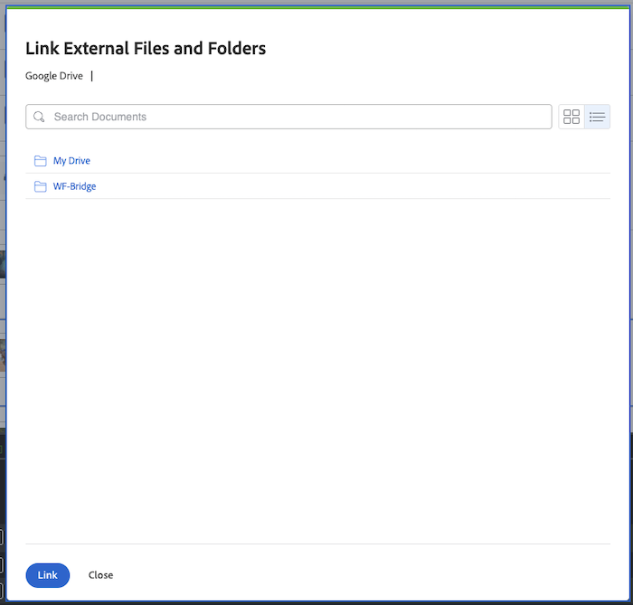

# 2025年第二季發行時間範圍內的外觀和感覺更新

本頁說明在2025年第二季度發行時間範圍內對Adobe Workfront應用程式的各個區域外觀和感覺進行的小幅更新。

如需2025年第二季版本的所有變更清單，請參閱[2025年第二季版本概觀](/help/quicksilver/product-announcements/product-releases/25-q2-release-activity/25-q2-release-overview.md)。

## 已更新具有新樣式的報表

>[!NOTE]
>
>所有客戶的預覽和生產： 2025年4月9日

我們已更新多個報表的外觀和風格，以符合Workfront其他區域的設計方式。

此更新包括對下列報告的清單和工具列的視覺變更。 功能未變更。

* 參數
* 參數群組
* 自訂表單
* 休假

如需詳細資訊，請參閱[建立自訂報表](/help/quicksilver/reports-and-dashboards/reports/creating-and-managing-reports/create-custom-report.md)。

## Google Drive檔案整合對話方塊的外觀更新

>[!NOTE]
>
>預覽版本： 2025年3月26日；適用於所有客戶的生產版本：搭配25.4版（2025年4月10日）

我們已更新您使用Google Drive檔案整合建立新版檔案時的外觀。 此更新將「版本>來自Google磁碟機」對話方塊與「新增>來自Google磁碟機」對話方塊對等。

以前，如果您的帳戶與「我的磁碟機」或「共用磁碟機」相關聯，您可以選擇使用「我的磁碟機」或「共用磁碟機」。 現在，對話方塊會直接前往Google Drive的「我的磁碟機」區域。

+++ 展開以檢視此變更

<table>
 <thead>
    <tr>
        <th>上一個</th>
        <th>新增</th>
    </tr>
  </thead>
 <tr>
        <td></td>
         <td></td>
    </tr>
</table>

+++

## 更新設定中存取層級區域的體驗

>[!NOTE]
>
>預覽版本： 2025年3月27日；適用於所有客戶的生產版本：搭配25.4版（2025年4月10日）

為了增強效能，我們對「設定」中的「存取層級」區域進行了一些視覺化更新。

「存取層級」清單已套用小幅功能變更。 若要複製、編輯或刪除存取層級，請選取該層級，然後按一下適當的圖示。

## 費用型別對話方塊的外觀更新

>[!NOTE]
>
>預覽版本： 2025年3月27日；適用於所有客戶的生產版本：搭配25.4版（2025年4月10日）

我們已更新在設定區域中新增和編輯費用型別的對話方塊的外觀，以符合Workfront其他區域的設計。

如需詳細資訊，請參閱[建立自訂費用型別](/help/quicksilver/administration-and-setup/set-up-workfront/configure-system-defaults/create-custom-expense-types.md)。

## 「編輯風險型別」方塊的外觀更新

>[!NOTE]
>
>預覽版本： 2025年3月27日；適用於所有客戶的生產版本：搭配25.4版（2025年4月10日）

當您在Workfront的「設定」區域中更新現有的風險型別時，我們已更新「編輯風險型別」方塊的外觀。 新設計現在與Workfront的其他區域相符。

如需詳細資訊，請參閱[編輯及建立風險型別](/help/quicksilver/administration-and-setup/set-up-workfront/configure-system-defaults/edit-create-risk-types.md)。

## 新風險型別方塊的外觀更新

>[!NOTE]
>
>預覽版本： 2025年3月27日；適用於所有客戶的生產版本：搭配25.4版（2025年4月10日）

當您在Workfront的「設定」區域中新增風險型別時，我們已更新「新風險型別」方塊的外觀和風格。 新設計現在與Workfront的其他區域相符。

如需詳細資訊，請參閱[編輯及建立風險型別](/help/quicksilver/administration-and-setup/set-up-workfront/configure-system-defaults/edit-create-risk-types.md)。

## 專案佇列詳細資料區域的外觀和感覺更新

>[!NOTE]
>
>預覽版本： 2025年3月27日；適用於所有客戶的生產版本：搭配25.4版（2025年4月10日）

我們已更新專案上佇列詳細資料區域的外觀與風格，以符合Workfront其他區域的設計風格。

透過此更新，範本「佇列詳細資料」區域的外觀和感覺未改變。

如需詳細資訊，請參閱[建立要求佇列](/help/quicksilver/manage-work/requests/create-and-manage-request-queues/create-request-queue.md)。

## 頭像不再顯示在某些電子郵件通知中

>[!NOTE]
>
>預覽版本： 2025年3月13日；適用於所有客戶的生產版本： 2025年3月13日

頭像將不再顯示在以下電子郵件通知中：

* 所有通訊事件通知
* 新指派通知
* 所有前置任務完成通知

## 里程碑路徑清單的外觀和感覺更新

>[!NOTE]
>
>預覽版本： 2025年3月6日；適用於所有客戶的生產版本：搭配25.4版（2025年4月10日）

我們已更新「里程碑路徑」清單在「設定」區域中的外觀和風格，以符合Workfront其他區域的設計方式。

如需詳細資訊，請參閱[建立里程碑路徑](/help/quicksilver/administration-and-setup/customize-workfront/configure-approval-milestone-processes/create-milestone-path.md)。

## 更新專案檢視中專案里程碑路徑的檢視

>[!NOTE]
>
>預覽版本： 2025年3月13日；適用於所有客戶的生產版本：搭配25.4版（2025年4月10日）

從專案清單或報告存取里程碑路徑時，里程碑詳細資訊頁面現在具有新的外觀。 您必須將里程碑路徑名稱欄位新增到清單或報告的檢視中，才能存取里程碑路徑的詳細資訊頁面。

在這次更新中，我們還新增了關於每個里程碑的顏色和顏色代碼的資訊。

如需詳細資訊，請參閱[建立里程碑路徑](/help/quicksilver/administration-and-setup/customize-workfront/configure-approval-milestone-processes/create-milestone-path.md)。

## 檔案電子郵件的暫時外觀變更

>[!NOTE]
>
>預覽版本： 2025年2月13日；適用於所有客戶的生產版本： 2025年2月13日

與新增或共用檔案相關的電子郵件內文將不再有縮圖影像。

有些客戶也會看到舊版任務和問題指派電子郵件，其中只顯示受指派人的頭像。

這些變更是暫時性的，因為我們正在調查電子郵件延遲。

## 「分享」對話方塊的新外觀

>[!NOTE]
>
>預覽版本： 2025年2月13日；適用於所有客戶的生產版本：搭配25.4版（2025年4月10日）

我們已將「共用」對話方塊的外觀與風格更新為與Workfront其他區域一致的現代化設計。 視覺上有細微的差異，包括：

* 「系統範圍可見」選項現在會顯示「系統中的每個人都可以檢視」。 此選項仍會像之前一樣運作。
* 有一個新圖示可存取進階共用設定。

如需在何處尋找「共用」對話方塊的詳細資訊，請參閱[授與及要求物件的許可權](/help/quicksilver/workfront-basics/grant-and-request-access-to-objects/grant-and-request-access-to-objects.md)
