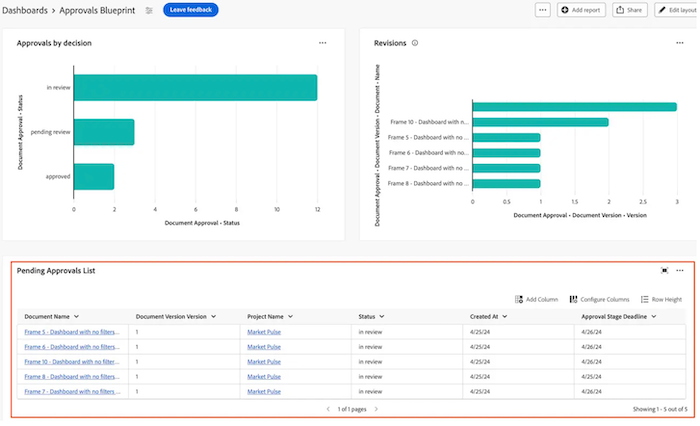

# 在畫布儀表板中建立表格報告

>[!IMPORTANT]
>
>畫布儀表板功能目前僅適用於參與Beta階段的使用者。 在此階段中，部分功能可能無法完成或如預期般運作。 請依照「畫布控制面板」測試版概觀文章中[提供意見回饋](/help/quicksilver/product-announcements/betas/canvas-dashboards-beta/canvas-dashboards-beta-information.md#provide-feedback)一節的指示，提交有關您體驗的任何意見回饋。 
>>如果您對可能的錯誤或技術問題有回饋，請向Workfront支援提交票證。 如需詳細資訊，請參閱[聯絡客戶支援](/help/quicksilver/workfront-basics/tips-tricks-and-troubleshooting/contact-customer-support.md)。 
>>請注意，以下雲端服務供應商未提供此測試版：
>
>* 自備Amazon Web Services金鑰
>* Azure
>* Google Cloud Platform

您可以將表格報表新增至畫布控制面板，以使用表格格式視覺化您的資料。

## 存取需求

+++ 展開以檢視存取需求。 

<table style="table-layout:auto"> 
<col> 
</col> 
<col> 
</col> 
<tbody> 
<tr> 
   <td role="rowheader">
Adobe Workfront計畫
</td> 
   <td> 

任何 
 
   </td> 
<tr> 
 <tr> 
   <td role="rowheader">
Adobe Workfront授權
</td> 
   <td> 

目前：計畫 
 

新增：標準
 
   </td> 
   </tr> 
  </tr> 
  <tr> 
   <td role="rowheader">
存取層級設定
</td> 
   <td>
編輯報告、儀表板和行事曆的存取權

  </td> 
  </tr>  
</tbody> 
</table>

如需有關此表格的詳細資訊，請參閱Workfront檔案中的[存取需求](/help/quicksilver/administration-and-setup/add-users/access-levels-and-object-permissions/access-level-requirements-in-documentation.md)。
+++

## 先決條件

在建置表格報表之前，您必須先建立儀表板。

## 在畫布儀表板中建立表格報告

有許多組態選項可用來建置表格報告。 在本節中，我們將引導您進行建立資料庫的一般程式。

{{step1-to-dashboards}}

1. 在左側面板中，按一下&#x200B;**畫布控制面板**。

1. 按一下右上角的&#x200B;**新儀表板**。

1. 在&#x200B;**建立儀表板**&#x200B;方塊中，輸入儀表板的&#x200B;**名稱**&#x200B;和&#x200B;**描述**。

1. 按一下「**建立**」。

1. 在&#x200B;**新增報告**&#x200B;方塊中，選取&#x200B;**建立報告**。

1. 在左側，選取&#x200B;**表格**。

1. 按一下右上角的&#x200B;**建立報告**。

1. （選擇性）請依照下列步驟設定&#x200B;**詳細資料**&#x200B;區段：

   1. 輸入報告&#x200B;**名稱**。

   1. 輸入報告&#x200B;**描述**。

1. 請依照下列步驟設定&#x200B;**組建資料表**&#x200B;區段：

   1. 在左側面板中，按一下&#x200B;**表格欄** 圖示。

   1. 按一下&#x200B;**新增欄**，然後選取您要在表格中顯示為欄的欄位。 欄會顯示在右側的預覽區段中。

   1. 對要新增的每個欄重複上述步驟。

1. 請依照下列步驟設定&#x200B;**篩選器**&#x200B;區段：

   1. 在左側面板中，按一下&#x200B;**篩選器** 圖示。

   1. 選取&#x200B;**編輯篩選器**。

   1. 按一下&#x200B;**新增條件**，然後指定您要篩選的欄位，以及定義欄位必須符合何種條件的修飾元。 欄會顯示在右側的預覽區段中。

1. （選擇性）按一下&#x200B;**新增篩選器群組**&#x200B;以新增另一組篩選准則。 集合之間的預設運運算元為AND。 按一下運運算元以將其變更為OR。

1. 請依照下列步驟設定&#x200B;**向下鑽研群組設定**&#x200B;區段：

   1. 在左側面板中，按一下&#x200B;**群組設定** 圖示。

   1. 按一下「**新增群組**」按鈕，然後選取要建立為群組的欄位。 群組欄會顯示在右側的預覽區段中。

1. 按一下&#x200B;**儲存**&#x200B;以建立報告並將其新增到儀表板。

## 建立表格報表範例

在本節中，我們將逐步說明建立表格報告的步驟，以顯示擱置的檔案核准。

如需表格報表範例的詳細資訊，請參閱[建立報表儀表板以供檢閱和核准](/help/quicksilver/review-and-approve-work/document-reviews-and-approvals/create-review-and-approval-dashboard.md)。

{{step1-to-dashboards}}

1. 在左側面板中，按一下&#x200B;**畫布控制面板**。

1. 按一下右上角的&#x200B;**新儀表板**。

1. 在&#x200B;**建立儀表板**&#x200B;方塊中，輸入儀表板的&#x200B;**名稱**&#x200B;和&#x200B;**描述**。

1. 按一下「**建立**」。

1. 在&#x200B;**新增報告**&#x200B;方塊中，選取&#x200B;**建立報告**。

1. 在左側，選取&#x200B;**表格**。

1. 按一下右上角的&#x200B;**建立報告**。

1. 請依照下列步驟設定&#x200B;**詳細資料**&#x200B;區段：

   1. 在&#x200B;_名稱_&#x200B;欄位中輸入&#x200B;**擱置核准**。
   1. 在&#x200B;**描述**&#x200B;欄位中輸入描述。 此文字會在圖表名稱旁邊顯示為工具提示。

1. 請依照下列步驟設定&#x200B;**組建資料表**&#x200B;區段：

   1. 在左側面板中，按一下&#x200B;**表格欄** 圖示。
   1. 按一下&#x200B;**新增資料行**。
   1. 向下捲動並選取&#x200B;**檔案核准** > **狀態**。
   1. 新增下列欄：

   <table>
    <tr>
    <td><strong>專案名稱</strong></td>
    <td>檔案版本&gt;檔案&gt;專案&gt;名稱</td>
    </tr>
    <tr>
    <td><strong>文件名稱</strong></td>
    <td>檔案版本&gt;檔案&gt;在搜尋方塊中輸入<em>名稱</em>。</td>
    </tr>
    <tr>
    <td><strong>檔案版本</strong></td>
    <td>檔案版本&gt;檔案&gt;版本</td>
    </tr>
    <tr>
    <td><strong>截止日期</strong></td>
    <td>檔案核准&gt;核准階段&gt;期限</td>
    </tr>
    <tr>
    <td><strong>請求者</strong></td>
    <td>檔案核准&gt;核准階段&gt;核准階段參與者* &gt;請求者&gt;在搜尋方塊中輸入<em>名稱</em>。</td>
    </tr>
    <tr>
    <td><strong>請求的日期</strong></td>
    <td>檔案核准&gt;核准階段&gt;核准階段參與者* &gt;建立於</td>
    </tr>
    <tr>
    <td><strong>核准者</strong></td>
    <td>檔案核准&gt;核准階段&gt;核准階段參與者* &gt;參與者使用者&gt;在搜尋方塊中輸入<em>名稱</em>。</td>
    </tr>
    </table>

   *核准階段參與者被截斷為&#x200B;_核准階段Pa.._

1. 請依照下列步驟設定&#x200B;**篩選器**&#x200B;區段：
   1. 在左側面板中，按一下&#x200B;**篩選器** 圖示。
   1. 按一下&#x200B;**編輯篩選器**，然後按&#x200B;**新增條件**。
   1. 按一下空白條件篩選，然後按一下&#x200B;**挑選欄位**。
   1. 選取&#x200B;**狀態**。
   1. 將運運算元變更為&#x200B;**等於**，然後在文字方塊中輸入&#x200B;_擱置核准_。
      
   1. （選擇性）新增其他篩選器，如下方&#x200B;**選擇性篩選器**&#x200B;一節所述。
1. 按一下熒幕右上角的&#x200B;**儲存**。

## 建立表格報表時的注意事項

### 利用欄位選擇器

**建置資料表**&#x200B;區段中的&#x200B;**區段**&#x200B;下拉式清單設計用來縮小欄位選取器中的選擇範圍，以便在建置資料表報告時更容易找到物件。 若要開始，您可以選取基礎實體物件。

* **所有區段**： Workfront Workflow和Workfront Planning中的所有物件型別。
* **Workfront物件**：原生Workfront工作流程物件。
* **Planning記錄型別**： Workfront Planning中定義的自訂記錄型別。

選取基底實體物件後，**區段**&#x200B;下拉式清單會以適用的欄位型別選項更新，以便從中進行選擇。

* **所有區段**：原生欄位、自訂欄位和相關物件。
* **所有欄位**：原生和自訂欄位（排除關係）。
* **自訂欄位**：自訂表單或Planning記錄上的客戶定義欄位。
* **Workfront欄位**：僅限原生欄位。
* **關係**：連線的記錄。

### 參照子物件

其他欄、篩選選項和群組屬性的可用關係通常僅限於Workfront物件階層中較高的物件，或在報表的基本實體物件上具有單一選取範圍。 但有一些例外，包括：

* 專案>任務
* 檔案核准>檔案核准階段
* 檔案核准階段>檔案核准階段參與者

使用上面列出的任何父項至子項關係時，您會在表格中看到連線到父物件的每個子記錄的一列。
