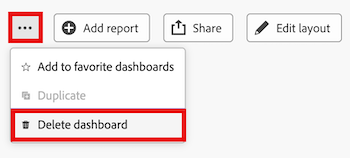

# 刪除畫布控制面板

>[!IMPORTANT]
>
>畫布儀表板功能目前僅適用於參與Beta階段的使用者。 在此階段中，部分功能可能無法完成或如預期般運作。 請依照「畫布控制面板」測試版概觀文章中[提供意見回饋](/help/quicksilver/product-announcements/betas/canvas-dashboards-beta/canvas-dashboards-beta-information.md#provide-feedback)一節的指示，提交有關您體驗的任何意見回饋。 
>&#x200B;>請注意，以下雲端服務供應商未提供此測試版：
>
>* 自備Amazon Web Services金鑰
>* Azure
>* Google Cloud Platform

當您不再需要畫布控制面板時，可以將其從Adobe Workfront中移除。

## 存取需求

+++ 展開以檢視存取需求。 

<table style="table-layout:auto"> 
<col> 
</col> 
<col> 
</col> 
<tbody> 
<tr> 
   <td role="rowheader">
Adobe Workfront計畫
</td> 
   <td> 

任何 
 
   </td> 
<tr> 
 <tr> 
   <td role="rowheader">
Adobe Workfront授權
</td> 
   <td> 

目前：計畫 
 

新增：標準
 
   </td> 
   </tr> 
  </tr> 
  <tr> 
   <td role="rowheader">
存取層級設定
</td> 
   <td>
編輯報告、儀表板和行事曆的存取權

  </td> 
  </tr>  
    </tr>  
        <tr> 
   <td role="rowheader">
物件許可權
</td> 
   <td>
管理儀表板的許可權

  </td> 
  </tr>
</tbody> 
</table>

如需有關此表格的詳細資訊，請參閱Workfront檔案中的[存取需求](/help/quicksilver/administration-and-setup/add-users/access-levels-and-object-permissions/access-level-requirements-in-documentation.md)。
+++

## 先決條件

您必須先建立儀表板，然後才能將其刪除。

如需詳細資訊，請參閱[建立畫布控制面板](/help/quicksilver/reports-and-dashboards/canvas-dashboards/create-dashboards/create-dashboards.md)。

## 刪除儀表板

>[!WARNING]
>
> 儀表板一經刪除，就無法復原儀表板及其所有自訂報表和/或視覺效果。 
> &#x200B;> 如果刪除包含傳統報表的控制面板，則不會刪除傳統報表。

{{step1-to-dashboards}}

1. 在左側面板中，按一下&#x200B;**畫布控制面板**。

1. 在「**畫布控制面板**」頁面上，選取您要刪除的控制面板。

1. 在右上角，選取&#x200B;**更多** 圖示，然後選取&#x200B;**刪除儀表板**。
   

1. 在&#x200B;**刪除儀表板**&#x200B;對話方塊中，選取&#x200B;**我確認要刪除此儀表板**&#x200B;核取方塊。

1. 按一下&#x200B;**刪除**。
