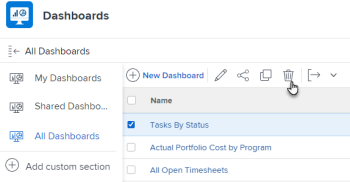

# 刪除控制面板

如果您不再使用控制面板，可將其從Adobe Workfront中移除。

## 存取需求

您必須具備下列條件：

<table style="table-layout:auto"> 
 <col> 
 <col> 
 <tbody> 
  <tr> 
   <td role="rowheader"><strong>Adobe Workfront計畫*</strong></td> 
   <td> 
任何
 </td> 
  </tr> 
  <tr> 
   <td role="rowheader"><strong>Adobe Workfront授權*</strong></td> 
   <td> 
計劃 
 </td> 
  </tr> 
  <tr> 
   <td role="rowheader"><strong>訪問級別配置*</strong></td> 
   <td> 
編輯對報表、控制面板和日曆的存取
 
注意：如果您仍無權存取，請洽詢您的Workfront管理員，他們是否在您的存取層級設定其他限制。 如需Workfront管理員如何變更您的存取層級的詳細資訊，請參閱 <a href="../../../administration-and-setup/add-users/configure-and-grant-access/create-modify-access-levels.md" class="MCXref xref">建立或修改自訂存取層級</a>.
 </td> 
  </tr> 
  <tr> 
   <td role="rowheader"><strong>物件權限</strong></td> 
   <td> 
管理控制面板的權限
 
有關請求其他訪問的資訊，請參閱 <a href="../../../workfront-basics/grant-and-request-access-to-objects/request-access.md" class="MCXref xref">請求對對象的訪問 </a>.
 </td> 
  </tr> 
 </tbody> 
</table>

&#42;若要了解您擁有的計畫、授權類型或存取權，請聯絡您的Workfront管理員。

## 從「動作」功能表刪除控制面板

如果要刪除控制面板，可使用「操作」菜單將其刪除。

如需內嵌外部頁面刪除控制面板的相關資訊，請參閱 [從「控制面板」區域刪除控制面板](#delete-a-dashboard-from-the-dashboards-area).

若要刪除控制面板：

1. 前往您要編輯的控制面板。
1. 按一下 **控制面板動作**，然後按一下 **刪除**.

   

1. 若要確認您要刪除控制面板，請按一下 **是，刪除它。**
控制面板已從Workfront移除。

## 從「控制面板」區域刪除控制面板 {#delete-a-dashboard-from-the-dashboards-area}

如果您刪除多個控制面板，則可從「控制面板」區域刪除控制面板。 這也是刪除含有外部頁面之控制面板的唯一方法。

要刪除多個控制面板：

1. 按一下 **主菜單** 圖示  在Workfront的右上角，然後按一下 **控制面板**.
1. 在清單中選取您要刪除的每個控制面板，然後按一下 **刪除** .

   

1. 若要確認您要刪除控制面板，請按一下 **是，刪除它。**
控制面板已從Workfront移除。
