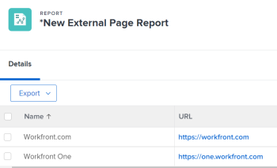

# 將外部網頁內嵌在控制面板中

<!--Audited: 01/2024-->

您可以在控制面板中內嵌外部網頁，以提供其他系統或Adobe Workfront內部相關資訊的存取權。

例如，如果貴組織有一個網頁式檔案存放庫、Wiki或其他內容管理系統，其中包含透過URL定期存取的專案資訊，則您可在控制面板上建立外部頁面，將該資訊顯示到Workfront中。

>[!IMPORTANT]
>
>* 基於安全理由，有些網站不允許您將網頁內嵌為iframe。 如果您要內嵌在儀表板中的網頁不允許這麼做，則儀表板中不會顯示該頁面。 不過，您仍然可以按一下控制面板的名稱來存取外部頁面。\
>\
>若要允許內嵌您擁有的網站，請與您的網站管理員合作，調整 **X-Frame-Options** 設定。 如需詳細資訊，請參閱 [X-Frame-Options](https://developer.mozilla.org/en-US/docs/Web/HTTP/Headers/X-Frame-Options).
>
>
>* 儀表板頁面不再支援作為儀表板中的內嵌外部頁面。 雖然現有儀表板不會自動修改以移除這些外部頁面，但對包含此類參考的儀表板所做的任何修改都無法儲存，直到移除或更改參考為止。
> 具體來說，下列Workfront.com子網域不再受支援：
>
>     * /&#x200B;控制面板
>     * /dashboard/：ID&#x200B;
>     * /portfolio/：ID/content-dashboard__：dashboardID&#x200B;
>     * /program/：ID/content-dashboard__：dashboardID&#x200B;
>     * /project/：ID/content-dashboard__：dashboardID&#x200B;
>     * /task/：ID/content-dashboard__：dashboardID&#x200B;
>     * /template/：ID/content-dashboard__：dashboardID&#x200B;
>     * /templatetask/：ID/content-dashboard__：dashboardID&#x200B;
>     * /resourcemanagement/：ID/
>     * content-dashboard__：dashboardID&#x200B;
>     * /team/：ID/content-dashboard__：dashboardID&#x200B;
>     * /iteration/：ID/content-dashboard__：dashboardID&#x200B;
>     * /requests/：ID/content-dashboard__：dashboardID&#x200B;
>     * /group/：ID/content-dashboard__：dashboardID&#x200B;
>     * /billingrecord/：ID/content-dashboard__：dashboardID
>
>作為替代解決方案，請考慮在您的控制面板中包含清單報告，如中所述 [新增報表至控制面板](/help/quicksilver/reports-and-dashboards/dashboards/creating-and-managing-dashboards/add-report-dashboard.md)

## 存取需求

+++ 展開以檢視本文中功能的存取需求。

您必須具備下列條件：

<table style="table-layout:auto"> 
 <col> 
 <col> 
 <tbody> 
  <tr> 
   <td role="rowheader"><strong>Adobe Workfront計畫</strong></td> 
   <td> 
任何
 </td> 
  </tr> 
  <tr> 
   <td role="rowheader"><strong>Adobe Workfront授權*</strong></td> 
   <td> 
目前：計畫 

   或
   
新增：標準 
 </td> 
  </tr> 
  <tr> 
   <td role="rowheader"><strong>存取層級設定</strong></td> 
   <td> 
編輯報告、儀表板和行事曆的存取權
 </td> 
  </tr> 
  <tr> 
   <td role="rowheader"><strong>物件許可權</strong></td> 
   <td> </td> 
  </tr> 
 </tbody> 
</table>

*若要瞭解您擁有的計畫、授權型別或存取權，請聯絡您的Workfront管理員。 如需詳細資訊，請參閱 [Workfront檔案中的存取需求](/help/quicksilver/administration-and-setup/add-users/access-levels-and-object-permissions/access-level-requirements-in-documentation.md).

+++

## 先決條件

您必須先建立儀表板，才能在其中嵌入外部頁面。

如需建立控制面板的詳細資訊，請參閱 [建立儀表板](../../../reports-and-dashboards/dashboards/creating-and-managing-dashboards/create-dashboard.md).

## 將外部頁面內嵌在控制面板中

>[!IMPORTANT]
>
>如果不再需要外部頁面，您可以從控制面板中將其移除。 但是，在Workfront中建立外部頁面後，您無法刪除該頁面。 您只能使用API刪除外部頁面。 如需詳細資訊，請參閱 [從儀表板移除外部頁面](../../../reports-and-dashboards/dashboards/creating-and-managing-dashboards/remove-external-page-from-dashboard.md).

1. 找出要在Workfront中顯示的頁面URL，並複製位址列中的URL。

   >[!NOTE]
   >
   >如果您要與Workfront物件共用URL，請記得有些URL會隨著時間過期。 例如，檔案URL在開啟後就會過期。 這會設定為安全性措施，在設計上將視為非靜態URL，不應予以共用。

{{step1-to-dashboards}}

1. 若要編輯現有儀表板，請選取您要內嵌網站頁面的儀表板，然後按一下 **儀表板動作**，然後按一下 **編輯**
或\
   若要建立新儀表板，請按一下 **新儀表板**.\
   如需建立儀表板的詳細資訊，請參閱 [建立儀表板](../../../reports-and-dashboards/dashboards/creating-and-managing-dashboards/create-dashboard.md).

1. 按一下 **新增外部頁面** 在 **選擇佈局/新增報告/新增行事曆** 區域。

   

   此 **新增外部頁面** 方塊隨即顯示。

1. 指定下列有關外部頁面的資訊：

   * **名稱**：新增控制面板的名稱。
   * **說明**：新增控制面板的詳細資訊，以識別其中包含的資訊。 在您儲存後，說明會顯示在控制面板上，供有權檢視它的每個人使用。
   * **URL**：將您先前複製的URL貼在此欄位中。

     您可以指定下列型別的URL：

      * 網頁的https （加密） URL。\
        只有https （加密）頁面會以URL載入。\
        

      * 包含特定網站的工作階段資訊的範本URL。\
        例如： *https://localhost/?session={！$$SESSION}*
您必須登入指定的網站才能顯示外部頁面。\
        如需有關如何從Workfront取得SessionID的資訊，請參閱 [API基本概念](../../../wf-api/general/api-basics.md).\
        基於安全理由，您的Workfront管理員可能會以不允許在外部頁面中使用工作階段資訊的方式設定您的系統偏好設定。 在此情況下，外部頁面不會在控制面板上載入。\
        如需有關系統安全性偏好設定的詳細資訊，請參閱 [設定系統安全性偏好設定](../../../administration-and-setup/manage-workfront/security/configure-security-preferences.md).\
        

     >[!WARNING]
     >
     >使用SessionID是不安全的，不建議使用。
     >

   * **高度**：輸入大於0的數字，以定義外部頁面在控制面板上的空間。 預設高度為500。

1. 按一下「**儲存**」。

   頁面會自動新增到控制面板。

   如果您建立其他儀表板，可以找到此外部頁面並將其新增到其他儀表板。 建立或編輯控制面板時，您可以在「可用報表和行事曆」清單中找到所有現有的外部頁面。

   <!--
    *** This is linked to: Creating Dashboards, and Editing Dashboards.
   -->

## 更新儀表板中的外部頁面

若要更新控制面板中使用的外部頁面資訊：

{{step1-to-dashboards}}

1. 按一下要更新的控制面板名稱以開啟它，然後按一下 **儀表板動作**，然後 **編輯**.

   此 **控制面板詳細資訊** 方塊開啟。

1. 在 **選擇版面配置/新增報告/新增行事曆** 的區域 **控制面板詳細資訊** 方塊中，找到您要更新的外部頁面，將滑鼠游標停留在頁面上，然後按一下 **編輯** 圖示。\
   

1. 在 **編輯外部頁面** 方塊，更新您要變更的欄位，然後按一下 **儲存**.
1. （可選）按一下 **刪除** 圖示  以從控制面板移除外部頁面。 如需詳細資訊，請參閱 [從儀表板移除外部頁面](../../../reports-and-dashboards/dashboards/creating-and-managing-dashboards/remove-external-page-from-dashboard.md).
1. 按一下「**儲存並關閉**」。

## 在報表中檢視外部頁面

您可以在外部頁面報表中檢視Workfront中的所有外部頁面。

{{step1-to-reports}}

1. 按一下 **新報告** >選取 **外部頁面**.

   

1. （可選）更新報告的檢視、篩選或分組標籤。

   如需詳細資訊，請參閱 [建立自訂報表](../../../reports-and-dashboards/reports/creating-and-managing-reports/create-custom-report.md).

1. 按一下 **儲存+關閉**.

   您可以在新的報告中檢視與系統中外部頁面關聯的名稱和URL。

   
