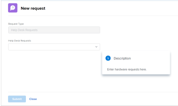

# 將請求佇列內嵌在控制面板中

<!-- Audited: 1/2025 -->

您可以將新請求佇列內嵌在儀表板中，讓使用者直接存取請求佇列，不必前往請求區域。

例如，如果您有一個開放給整個組織的請求佇列，例如服務檯佇列或每個人都必須定期存取的PTO請求佇列，將請求佇列直接插入他們的其中一個儀表板中可能會很方便，以便快速輕鬆地存取。 此設定的程式與在控制面板上建立外部頁面的程式類似。

首先，您需要取得請求佇列的URL。 其次，您可以新增外部頁面，將URL內嵌於控制面板中。

## 存取需求

+++ 展開以檢視本文中功能的存取需求。

您必須具有下列存取權才能執行本文中的步驟：

<table style="table-layout:auto"> 
 <col> 
 <col> 
 <tbody> 
  <tr> 
   <td role="rowheader"><strong>Adobe Workfront計畫</strong></td> 
   <td> 
任何
 </td> 
  </tr> 
  <tr> 
   <td role="rowheader"><strong>Adobe Workfront授權</strong></td> 
   <td> 
      
新增：

         <ul>
         <li>
標準
</li>
         </ul>
      
目前：

         <ul>
         <li>
規劃
</li>
         </ul>
   </td> 
  </tr> 
  <tr> 
   <td role="rowheader"><strong>存取層級設定</strong></td> 
   <td> 
編輯報告、儀表板、行事曆的存取權
 </td> 
  </tr> 
  <tr> 
   <td role="rowheader"><strong>物件許可權</strong></td> 
   <td> 
管理儀表板的許可權
 </td> 
  </tr> 
 </tbody> 
</table>

如需詳細資訊，請參閱Workfront檔案中的[存取需求](/help/quicksilver/administration-and-setup/add-users/access-levels-and-object-permissions/access-level-requirements-in-documentation.md)。

+++

## 先決條件

您必須先建立下列兩項，才能將請求佇列內嵌到儀表板中：

* **儀表板**：如需建立儀表板的詳細資訊，請參閱[建立儀表板](../../../reports-and-dashboards/dashboards/creating-and-managing-dashboards/create-dashboard.md)。

* **請求佇列**：如需建立請求佇列的詳細資訊，請參閱[建立請求佇列](../../../manage-work/requests/create-and-manage-request-queues/create-request-queue.md)

## 取得請求佇列的URL {#obtain-the-url-of-the-request-queue}

您可以透過多種方式取得請求佇列的URL，方式取決於您希望在使用者從儀表板存取請求佇列時，向使用者公開請求佇列的哪個部分。

* [取得特定佇列主題的連結，而且能夠變更要求型別](#obtain-a-link-to-a-specific-queue-topic-with-ability-to-change-the-request-type)

* [取得要求佇列的連結及變更要求型別的能力](#obtain-a-link-to-a-request-queue-and-ability-to-change-the-request-type)

* [取得要求佇列的連結，但無法變更要求型別](#obtain-a-link-to-a-request-queue-with-no-ability-to-change-the-request-type)

### 取得特定佇列主題的連結，並可變更請求型別 {#obtain-a-link-to-a-specific-queue-topic-with-ability-to-change-the-request-type}

當您與其他使用者共用特定佇列主題的連結時，請求表單會在使用者提交請求時所需的確切佇列主題處開啟。 當使用者不確定在記錄特定要求佇列的要求時，選擇哪個佇列主題時，這會很有幫助。

使用者可視需要變更請求型別或選擇其他主題。 請求區域的導覽也會顯示。

1. 按一下&#x200B;**主功能表** > **要求** > **新要求**。
1. 如果您要共用特定佇列，請繼續選取主題群組和佇列主題，直到到達您要共用在控制面板上的佇列為止。 如需有關提交請求的資訊，請參閱[建立並提交Adobe Workfront請求](../../../manage-work/requests/create-requests/create-submit-requests.md)。

   >[!TIP]
   >
   >選取主題群組和佇列主題為選用。

1. 按一下[新增請求]區域右上角的[共用路徑&#x200B;**]。**

   當您在熒幕上顯示連結時，這會複製要求佇列或佇列主題的連結。 使用者可以更新請求型別或任何可用的主題群組和佇列主題。

   

### 取得請求佇列的連結以及變更請求型別的功能 {#obtain-a-link-to-a-request-queue-and-ability-to-change-the-request-type}

當您共用請求型別的連結時，將會為使用者選取請求型別。 當使用者需要針對相同的請求型別從多個主題群組或佇列主題中進行選擇時，這會很有幫助。 使用者可以變更請求型別，並選擇其他型別。 請求區域的導覽也會顯示。

1. 移至指定為請求佇列的專案。

   如需有關從專案建立請求佇列的資訊，請移至[建立請求佇列](../../../manage-work/requests/create-and-manage-request-queues/create-request-queue.md)。

1. 移至&#x200B;**佇列詳細資料**。
1. 複製您在&#x200B;**直接存取URL**&#x200B;欄位中找到的程式碼。

   程式碼看起來應該類似下列：

   `https://<yourdomain>.my.workfront.com/requests/new?activeTab=tab-new-helpRequest&projectID=50062d6f000849c95ab3513c0e84a51e&path=`

   這是與所選專案相關聯的請求佇列的連結。 已預先選取請求型別。

   使用者可以選取所需的任何主題群組或佇列主題，也可以選擇其他請求型別。

   

### 取得要求佇列的連結，但無法變更要求型別 {#obtain-a-link-to-a-request-queue-with-no-ability-to-change-the-request-type}

當您共用預先選取之請求型別的連結時，將會為使用者選取請求型別且無法變更（其為暗灰色）。 使用者可以選擇所需的主題群組或佇列主題。 如果您不想讓使用者檢視及選取其他請求型別，這個功能會很好用。 請求區域的導覽未顯示。

1. 移至指定為請求佇列的專案。

   如需有關從專案建立請求佇列的資訊，請移至[建立請求佇列](../../../manage-work/requests/create-and-manage-request-queues/create-request-queue.md)。

1. 移至&#x200B;**佇列詳細資料**。
1. 複製您在&#x200B;**內嵌代碼**&#x200B;欄位中找到的代碼。

   程式碼看起來應該類似下列：

   `<iframe src="https://<yourdomain>my.workfront.com/requests/newRequestEmbedded?projectID=612518c7000404462d3bc9a0bc09fa71" frameborder="0" width="500" height="600"></iframe>`

1. 編輯程式碼以僅保留下列資訊：

   `https://<yourdomain>.my.workfront.com/requests/newRequestEmbedded?projectID=612518c7000404462d3bc9a0bc09fa71`

   >[!TIP]
   >
   >將程式碼內嵌至Workfront以外的應用程式時，您可以新增`<samp>iframe </samp>`標籤。

   這是與所選專案相關聯的請求佇列的連結。 要求型別已預先選取且無法變更。

   使用者可以選取所選請求型別所需的任何主題群組或佇列主題。 使用者無法選取其他請求型別。

   

## 將請求佇列內嵌在控制面板中

您可以將請求佇列或請求佇列下巢狀內嵌佇列主題的連結內嵌到控制面板，讓使用者直接存取輸入的請求。

1. 使用本文[取得要求佇列](#obtain-the-url-of-the-request-queue)章節中說明的其中一個方法，取得要求佇列URL。

1. 按一下&#x200B;**主要功能表** > **儀表板** > **新儀表板**。

1. 輸入儀表板的&#x200B;**名稱**。 這是必填欄位。

1. 按一下&#x200B;**新增外部頁面**。

   

1. 在&#x200B;**新增外部頁面**&#x200B;方塊中，編輯下列欄位：

   * **名稱**：輸入要顯示在儀表板上的請求佇列名稱。 這是必填欄位。

   * **描述**：輸入此外部頁面顯示的描述。 這不是必填欄位，僅對報表用途而言重要。 它不會顯示在儀表板中。

   * **URL**：貼上您使用步驟1中說明的其中一種方法取得的URL。

   * **高度**：輸入外部頁面的高度。 這會定義包含請求佇列的外部頁面在控制面板上佔據的空間大小。 這是必填欄位，預設值為500。

1. 按一下「**儲存**」。

1. 按一下「**儲存並關閉**」。

   請求佇列會在儀表板中顯示為單獨的儀表板元件。

1. （選擇性）按一下&#x200B;**儀表板動作**，然後按&#x200B;**編輯**，將報告、行事曆或其他外部頁面新增至相同的儀表板。

   如需有關將元件新增到儀表板的資訊，請參閱[建立儀表板](../../../reports-and-dashboards/dashboards/creating-and-managing-dashboards/create-dashboard.md)。

<!--
<ol data-mc-conditions="QuicksilverOrClassic.Draft mode">
<li value="1"> 
Click the <strong>Main Menu</strong> > Requests >&nbsp;<strong>New Request</strong>. 
 </li>
<li class="preview" value="2" data-mc-conditions="QuicksilverOrClassic.Quicksilver"> 
Continue entering the request.&nbsp;For information about submitting requests, see <a href="../../../manage-work/requests/create-requests/create-submit-requests.md" class="MCXref xref">Create and submit Adobe Workfront requests</a>. 
 </li>
<li value="3"> 
Select the <strong>Request Type</strong> for the queue you would like added to the dashboard.
 </li>
<li value="4"> 
(Optional) Select a Queue Topic and a Topic Group. Depending on how the project manager set up the request queue, the names of these fields are different in each Workfront instance.
 </li>
<li class="preview" value="5" data-mc-conditions="QuicksilverOrClassic.Quicksilver"> 
Click <strong>Share path</strong> to obtain a shared link from the request queue you want to embed on a dashboard.
 
For information about sharing a request queue, see <a href="../../../manage-work/requests/create-requests/share-link-to-request-queue.md" class="MCXref xref">Share a link to a request queue</a>
 </li>
<li value="6"> 
For example, enter a URL similar to one of the following: 
 </li>
</ol>
-->
