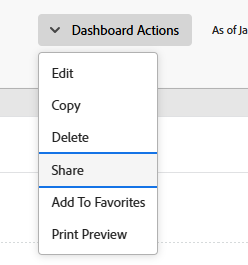

# 共用儀表板

<!-- Audited: 1/2025 -->

當使用者指派存取層級時，您的Adobe Workfront管理員會授予他們檢視或編輯儀表板的存取權。 如需授與問題存取權的詳細資訊，請參閱[授與報告、儀表板和行事曆的存取權](../../../administration-and-setup/add-users/configure-and-grant-access/grant-access-reports-dashboards-calendars.md)。

除了授予使用者的存取層級外，您還可以授予他們檢視或管理您有權共用之特定儀表板的許可權。 如需存取層級和許可權的詳細資訊，請參閱[存取層級和許可權如何搭配運作](../../../administration-and-setup/add-users/access-levels-and-object-permissions/how-access-levels-permissions-work-together.md)。

許可權專屬於Workfront中的一個專案，可定義使用者可對該專案執行的動作。

>[!NOTE]
>
>Workfront管理員可以新增或移除系統中所有使用者的任何專案許可權，而無需擁有這些專案。

## 存取需求

+++ 展開以檢視本文中功能的存取需求。

您必須具備下列專案才能共用物件：

<table style="table-layout:auto"> 
 <col> 
 <col> 
 <tbody> 
  <tr> 
   <td role="rowheader"><strong>Adobe Workfront計畫</strong></td> 
   <td> 
任何 
 </td> 
  </tr> 
  <tr> 
   <td role="rowheader"><strong>Adobe Workfront授權</strong></td> 
    <td> 
      
新增：

         <ul>
         <li>
淺色或更高
</li>
         </ul>
      
目前：

         <ul>
         <li>
評論或以上
</li>
         </ul>
   </td> 
  </tr> 
  <tr> 
   <td role="rowheader"><strong>存取層級設定</strong></td> 
   <td> 
檢視報表、儀表板、行事曆的存取權或以上專案
 </td> 
  </tr> 
  <tr> 
   <td role="rowheader"><strong>物件許可權</strong></td> 
   <td> 
檢視儀表板或更高的許可權
 </td> 
  </tr> 
 </tbody> 
</table>

如需詳細資訊，請參閱Workfront檔案中的[存取需求](/help/quicksilver/administration-and-setup/add-users/access-levels-and-object-permissions/access-level-requirements-in-documentation.md)。

+++

## 先決條件

必須先建立儀表板，然後才能進行共用。

如需有關建立儀表板的資訊，請參閱[建立儀表板](../../../reports-and-dashboards/dashboards/creating-and-managing-dashboards/create-dashboard.md)。

## 關於共用控制面板的考量事項

除了下列考量事項外，另請參閱[共用報告、儀表板和行事曆](../../../workfront-basics/grant-and-request-access-to-objects/permissions-reports-dashboards-calendars.md)。

* 預設情況下，控制面板的建立者擁有管理許可權。

* 您可以與其他個人、團隊、群組、職位角色或公司共用您建立的儀表板。 您也可以共用他人建立並與您共用的控制面板。
* 您也可以在系統內將其設為可見，以便與整個組織共用。
* 您可以共用個別儀表板，也可以從清單共用多個儀表板。
* 共用控制面板時，使用者預設會繼承控制面板上所有報表物件的檢視許可權。

  如需Workfront中物件階層的詳細資訊，請參閱[瞭解Adobe Workfront中的物件](../../../workfront-basics/navigate-workfront/workfront-navigation/understand-objects.md)。

  如需有關檢視繼承許可權的資訊，請參閱[檢視物件的繼承許可權](../../../workfront-basics/grant-and-request-access-to-objects/view-inherited-permissions-on-objects.md)。

## 共用儀表板

從清單共用一個或數個控制面板的功能相同。

1. 前往儀表板清單，選取一或多個儀表板，然後按一下[共用] **** 。

   或

   按一下其中一個儀表板的名稱，然後按一下&#x200B;**儀表板動作** > **共用**。

   

1. 在&#x200B;**新增人員、團隊、角色、群組或公司**&#x200B;欄位中，開始輸入您要共用控制面板的使用者、團隊、角色、群組或公司名稱，然後在其出現在下拉式清單中時按一下該名稱。
1. （選擇性）若要讓系統內的所有使用者都能存取儀表板，請按一下[共用]對話方塊中的[只有&#x200B;**受邀者可以存取**]下拉式功能表，然後選取[系統內的每個人都可以檢視&#x200B;**]。**

1. 按一下「**儲存**」。
