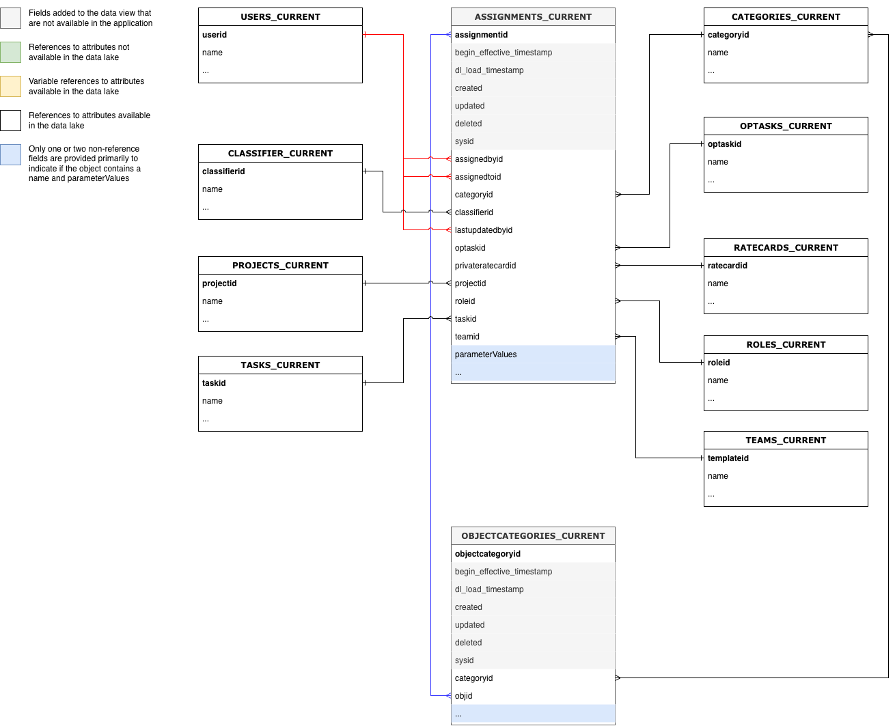

# Workfront Data Connect資料字典

本頁包含有關Workfront Data Connect中資料結構和內容的資訊。

>[!NOTE]
>
>Data Connect中的資料每4小時會重新整理一次，因此最近的變更可能不會立即顯示。

## 檢視型別

在Data Connect中您可以運用許多檢視型別，以最能提供insight的方式檢視您的Workfront資料。

* **目前的檢視**

  「目前」檢視所反映的資料與Workfront中的資料存在方式、每個物件及其目前狀態類似。 不過，它比Workfront內的延遲要低很多。

* **事件檢視**

  「事件」檢視會追蹤Workfront中的每筆變更記錄：亦即，每次物件變更狀態時，系統都會建立記錄以顯示變更發生時間、變更人員及變更內容。 因此，此檢視對於時間點比較很有用。 此檢視僅包含過去三年的記錄。

* **每日記錄檢視**

  「每日歷史記錄」檢視提供「事件」檢視的縮寫版本，以每日顯示每個物件的狀態，而非每個個別事件發生時的狀態。 因此，此檢視對趨勢分析很有用。

<!-- Custom view -->

## 實體關係圖

Workfront中的物件（以及您的Data Connect資料湖中的物件）不僅是由其個別值所定義，也是由其與其他物件的關係所定義。

下列實體關係圖(ERD)提供核心Workfront物件之資料連線中物件關係的高層級對應。

>[!IMPORTANT]
>
>圖表以單一物件為中心，不代表整個Workfront應用程式的完整實體關係圖表。 
>這些圖表旨在提供關聯性如何用來將資料聯結至相鄰物件的範例。

### 實體關係圖範例

+++ 展開以檢視範例圖表

>[!TIP]
>
>若要檢視更詳細的圖表，請在影像上按一下滑鼠右鍵，然後選取&#x200B;**在新索引標籤中開啟影像**。

### 指派

### 檔案和檔案核准

### 小時與時程表

### 問題

### 專案

### 任務

### 使用者

+++

## 日期型別

有許多日期物件可提供特定事件發生時間的相關資訊。

* `DL_LOAD_TIMESTAMP`：此日期會在成功的資料重新整理完成後更新，並包含提供最新記錄版本的重新整理工作開始時的時間戳記。
* `CALENDAR_DATE`：此日期僅出現在「每日歷史記錄」檢視中。 「每日歷史記錄」檢視會提供`CALENDAR_DATE`中指定之每個日期在11:59 UTC時資料外觀的記錄。
* `BEGIN_EFFECTIVE_TIMESTAMP`：此日期同時存在於「事件」和「每日歷史記錄」檢視中，代表記錄成為應用程式中目前值的時間。
* `END_EFFECTIVE_TIMESTAMP`：此日期同時出現在「事件」和「每日歷史記錄」檢視中，而且記錄記錄從目前資料列中的&#x200B;_從_&#x200B;值變更為其他資料列中的值的確切時間。 若要允許在`BEGIN_EFFECTIVE_TIMESTAMP`和`END_EFFECTIVE_TIMESTAMP`的查詢之間進行，此值絕不為Null，即使沒有新值也是如此。 在記錄仍然有效的事件中（表示值尚未變更），`END_EFFECTIVE_TIMESTAMP`的值將為2300-01-01。

## Workfront術語表及說明

下表將Workfront中的物件名稱（以及其在介面和API中的名稱）與其在Data Connect中的對等名稱建立關聯，並包含每個物件與其他Workfront物件的參考欄位。

>[!NOTE]
>
>新欄位可新增至物件檢視，恕不另行通知，以支援Workfront應用程式不斷變化的資料需求。當下游資料收件者未準備好在新增資料行時處理其他資料行時，請謹慎使用「SELECT」查詢。 
>如果需要重新命名或移除欄，我們會提前通知這些變更。

### 存取層級

<table>
    <thead>
        <tr>
            <th>Workfront實體名稱</th>
            <th>介面參考</th>
            <th>API 參考</th>
            <th>API標籤</th>
            <th>資料湖檢視</th>
        </tr>
      </thead>
      <tbody>
        <tr>
            <td>存取層級</td>
            <td>存取層級</td>
            <td>ACSLVL</td>
            <td>存取層級</td>
            <td>ACCESSLEVELS_CURRENT ACCESSLEVELS_DAILY_HISTORY ACCESSLEVELS_EVENT</td>
        </tr>
      </tbody>
</table>
<table>
    <thead>
        <tr>
            <th>主要/外部索引鍵</th>
            <th>類型</th>
            <th>相關表格</th>
            <th>相關欄位</th>
        </tr>
    </thead>
    <tbody>
        <tr>
             <td>ACCESSLEVELID</td>
             <td>PK</td>
             <td>-</td>
             <td>-</td>
        </tr>
        <tr>
             <td>APPGLOBALID</td>
             <td>-</td>
             <td colspan="2">不是關係；用於內部應用程式用途</td>
        </tr>
        <tr>
             <td>LASTUPDATEDBYID</td>
             <td>FK</td>
             <td>USERS_CURRENT</td>
             <td>使用者ID</td>
        </tr>
        <tr>
             <td>LEGACYACCESSLEVELID</td>
             <td>-</td>
             <td colspan="2">不是關係；用於內部應用程式用途</td>
        </tr>
        <tr>
             <td>物件ID</td>
             <td>FK</td>
             <td>變數，根據OBJCODE</td>
             <td>物件（在OBJCODE欄位中識別）的主鍵/ID</td>
        </tr>
        <tr>
             <td>SYSID</td>
             <td>-</td>
             <td colspan="2">不是關係；用於內部應用程式用途</td>
        </tr>
    </tbody>
</table>

### 存取規則

<table>
    <thead>
        <tr>
            <th>Workfront實體名稱</th>
            <th>介面參考</th>
            <th>API 參考</th>
            <th>API標籤</th>
            <th>資料湖檢視</th>
        </tr>
      </thead>
      <tbody>
        <tr>
            <td>存取規則</td>
            <td>共用</td>
            <td>ACSURL</td>
            <td>共用</td>
            <td>ACCESSRULES_CURRENT ACCESSRULES_DAILY_HISTORY ACCESSRULES_EVENT</td>
        </tr>
      </tbody>
</table>
<table>
    <thead>
        <tr>
            <th>主要/外部索引鍵</th>
            <th>類型</th>
            <th>相關表格</th>
            <th>相關欄位</th>
        </tr>
    </thead>
    <tbody>
        <tr>
             <td>ACCESSORID</td>
             <td>FK</td>
             <td>變數，根據ACCESSOROBJCODE</td>
             <td>在ACCESSOROBJCODE欄位中識別的物件主索引鍵/ ID</td>
        </tr>
        <tr>
             <td>ACCESSRULEID</td>
             <td>PK</td>
             <td>-</td>
             <td>-</td>
        </tr>
        <tr>
             <td>ANCESTORID</td>
             <td>PK</td>
             <td>變數，根據ANCESTOROBJCODE</td>
             <td>在ANCESTOROBJCODE欄位中識別的物件主索引鍵/ ID</td>
        </tr>
        <tr>
             <td>LASTUPDATEDBYID</td>
             <td>FK</td>
             <td>USERS_CURRENT</td>
             <td>使用者ID</td>
        </tr>
        <tr>
             <td>SECURITYOBJID</td>
             <td>FK</td>
             <td>變數，根據SECURITYOBJCODE</td>
             <td>在SECURITYOBJCODE欄位中識別的物件主索引鍵/ ID</td>
        </tr>
        <tr>
             <td>SYSID</td>
             <td>-</td>
             <td colspan="2">不是關係；用於內部應用程式用途</td>
        </tr>
    </tbody>
</table>

### 核准路徑

<table>
    <thead>
        <tr>
            <th>Workfront實體名稱</th>
            <th>介面參考</th>
            <th>API 參考</th>
            <th>API標籤</th>
            <th>資料湖檢視</th>
        </tr>
      </thead>
      <tbody>
        <tr>
            <td>核准路徑</td>
            <td>核准路徑</td>
            <td>ARVPTH</td>
            <td>核准</td>
            <td>APPROVALPATHS_CURRENT APPROVALPATHS_DAILY_HISTORY APPROVALPATHS_EVENT</td>
        </tr>
      </tbody>
</table>
<table>
    <thead>
        <tr>
            <th>主要/外部索引鍵</th>
            <th>類型</th>
            <th>相關表格</th>
            <th>相關欄位</th>
        </tr>
    </thead>
    <tbody>
        <tr>
             <td>APPROVALPATHID</td>
             <td>PK</td>
             <td>-</td>
             <td>-</td>
        </tr>
        <tr>
             <td>APPROVALPROCESSID</td>
             <td>FK</td>
             <td>APPROVALPROCESSES_CURRENT</td>
             <td>APPROVALPROCESSID</td>
        </tr>
        <tr>
             <td>ENTEREDBYID</td>
             <td>FK</td>
             <td>USERS_CURRENT</td>
             <td>使用者ID</td>
        </tr>
        <tr>
             <td>GLOBALPATHID</td>
             <td>-</td>
             <td colspan="2">不是關係；用於內部應用程式用途</td>
        </tr>
        <tr>
             <td>LASTUPDATEDBYID</td>
             <td>FK</td>
             <td>USERS_CURRENT</td>
             <td>使用者ID</td>
        </tr>
        <tr>
             <td>SYSID</td>
             <td>-</td>
             <td colspan="2">不是關係；用於內部應用程式用途</td>
        </tr>
    </tbody>
</table>

### 核准流程

<table>
    <thead>
        <tr>
            <th>Workfront實體名稱</th>
            <th>介面參考</th>
            <th>API 參考</th>
            <th>API標籤</th>
            <th>資料湖檢視</th>
        </tr>
      </thead>
      <tbody>
        <tr>
            <td>核准流程</td>
            <td>核准流程</td>
            <td>ARVPRC</td>
            <td>核准流程</td>
            <td>APPROVALPROCESSES_CURRENT APPROVALPROCESSES_DAILY_HISTORY APPROVALPROCESSES_EVENT</td>
        </tr>
      </tbody>
</table>
<table>
    <thead>
        <tr>
            <th>主要/外部索引鍵</th>
            <th>類型</th>
            <th>相關表格</th>
            <th>相關欄位</th>
        </tr>
    </thead>
    <tbody>
        <tr>
             <td>APPROVALPROCESSID</td>
             <td>PK</td>
             <td>-</td>
             <td>-</td>
        </tr>
        <tr>
             <td>ENTEREDBYID</td>
             <td>FK</td>
             <td>USERS_CURRENT</td>
             <td>使用者ID</td>
        </tr>
        <tr>
             <td>LASTUPDATEDBYID</td>
             <td>FK</td>
             <td>USERS_CURRENT</td>
             <td>使用者ID</td>
        </tr>
        <tr>
             <td>SYSID</td>
             <td>-</td>
             <td colspan="2">不是關係；用於內部應用程式用途</td>
        </tr>
    </tbody>
</table>

### 核准步驟

<table>
    <thead>
        <tr>
            <th>Workfront實體名稱</th>
            <th>介面參考</th>
            <th>API 參考</th>
            <th>API標籤</th>
            <th>資料湖檢視</th>
        </tr>
      </thead>
      <tbody>
        <tr>
            <td>核准步驟</td>
            <td>核准步驟</td>
            <td>ARVSTP</td>
            <td>核准階段</td>
            <td>APPROVALSTEPS_CURRENT APPROVALSTEPS_DAILY_HISTORY APPROVALSTEPS_EVENT</td>
        </tr>
      </tbody>
</table>
<table>
    <thead>
        <tr>
            <th>主要/外部索引鍵</th>
            <th>類型</th>
            <th>相關表格</th>
            <th>相關欄位</th>
        </tr>
    </thead>
    <tbody>
        <tr>
             <td>APPROVALPATHID</td>
             <td>FK</td>
             <td>APPROVALPATHS_CURRENT</td>
             <td>APPROVALPATHID</td>
        </tr>
        <tr>
             <td>APPROVALSTEPID</td>
             <td>PK</td>
             <td>-</td>
             <td>-</td>
        </tr>
        <tr>
             <td>SYSID</td>
             <td>-</td>
             <td colspan="2">不是關係；用於內部應用程式用途</td>
        </tr>
    </tbody>
</table>

### 核准者狀態

<table>
    <thead>
        <tr>
            <th>Workfront實體名稱</th>
            <th>介面參考</th>
            <th>API 參考</th>
            <th>API標籤</th>
            <th>資料湖檢視</th>
        </tr>
      </thead>
      <tbody>
        <tr>
            <td>核准者狀態</td>
            <td>核准者狀態</td>
            <td>封存</td>
            <td>核准者狀態</td>
            <td>APPROVERSTATUSES_CURRENT APPROVERSTATUSES_DAILY_HISTORY APPROVERSTATUSES_EVENT</td>
        </tr>
      </tbody>
</table>
<table>
    <thead>
        <tr>
            <th>主要/外部索引鍵</th>
            <th>類型</th>
            <th>相關表格</th>
            <th>相關欄位</th>
        </tr>
    </thead>
    <tbody>
        <tr>
             <td>APPROVERSTATUSID</td>
             <td>PK</td>
             <td>-</td>
             <td>-</td>
        </tr>
        <tr>
             <td>APPROVABLEOBJID</td>
             <td>FK</td>
             <td>變數，根據APPROVABLEOBJCODE</td>
             <td>在APPROVABLEOBJCODE欄位中識別的物件主索引鍵/ ID</td>
        </tr>
        <tr>
             <td>APPROVALSTEPID</td>
             <td>FK</td>
             <td>APPROVALSTEPS_CURRENT</td>
             <td>APPROVALSTEPID</td>
        </tr>
        <tr>
             <td>APPROVEDBYID</td>
             <td>FK</td>
             <td>USERS_CURRENT</td>
             <td>使用者ID</td>
        </tr>
        <tr>
             <td>DELEGATEUSERID</td>
             <td>FK</td>
             <td>USERS_CURRENT</td>
             <td>使用者ID</td>
        </tr>
        <tr>
             <td>LASTUPDATEDBYID</td>
             <td>FK</td>
             <td>USERS_CURRENT</td>
             <td>使用者ID</td>
        </tr>
        <tr>
             <td>OPTASKID</td>
             <td>FK</td>
             <td>OPTASKS_CURRENT</td>
             <td>OPTASKID</td>
        </tr>
        <tr>
             <td>OVERRIDDENUSERID</td>
             <td>FK</td>
             <td>USERS_CURRENT</td>
             <td>使用者ID</td>
        </tr>
        <tr>
             <td>PROJECTID</td>
             <td>FK</td>
             <td>專案目前</td>
             <td>PROJECTID</td>
        </tr>
        <tr>
             <td>STEPAPPROVERID</td>
             <td>FK</td>
             <td>USERS_CURRENT</td>
             <td>使用者ID</td>
        </tr>
        <tr>
             <td>SYSYID</td>
             <td>-</td>
             <td colspan="2">不是關係；用於內部應用程式用途</td>
        </tr>
        <tr>
             <td>TASKID</td>
             <td>FK</td>
             <td>任務_目前</td>
             <td>TASKID</td>
        </tr>
        <tr>
             <td>WILDCARDUSERID</td>
             <td>FK</td>
             <td>USERS_CURRENT</td>
             <td>使用者ID</td>
        </tr>
    </tbody>
</table>

### 指派

<table>
    <thead>
        <tr>
            <th>Workfront實體名稱</th>
            <th>介面參考</th>
            <th>API 參考</th>
            <th>API標籤</th>
            <th>資料湖檢視</th>
        </tr>
      </thead>
      <tbody>
        <tr>
            <td>指派</td>
            <td>指派</td>
            <td>指派</td>
            <td>指派</td>
            <td>ASSIGNMENTS_CURRENT ASSIGNMENTS_DAILY_HISTORY ASSIGNMENTS_EVENT</td>
        </tr>
      </tbody>
</table>
<table>
    <thead>
        <tr>
            <th>主要/外部索引鍵</th>
            <th>類型</th>
            <th>相關表格</th>
            <th>相關欄位</th>
        </tr>
    </thead>
    <tbody>
        <tr>
             <td>ASSIGNEDBYID</td>
             <td>FK</td>
             <td>USERS_CURRENT</td>
             <td>使用者ID</td>
        </tr>
        <tr>
             <td>ASSIGNEDTOID</td>
             <td>FK</td>
             <td>USERS_CURRENT</td>
             <td>使用者ID</td>
        </tr>
        <tr>
             <td>ASSIGNMENTID</td>
             <td>PK</td>
             <td>-</td>
             <td>-</td>
        </tr>
        <tr>
             <td>類別ID</td>
             <td>FK</td>
             <td>CATEGORY_CURRENT</td>
             <td>類別ID</td>
        </tr>
        <tr>
             <td>CLASSIFIERID</td>
             <td>FK</td>
             <td>CLASSIFIER_CURRENT</td>
             <td>CLASSIFIERID</td>
        </tr>
      <tr>
             <td>LASTUPDATEDBYID</td>
             <td>FK</td>
             <td>USERS_CURRENT</td>
             <td>使用者ID</td>
        </tr>
        <tr>
             <td>OPTASKID</td>
             <td>FK</td>
             <td>OPTASKS_CURRENT</td>
             <td>OPTASKID</td>
        </tr>
        <tr>
             <td>PRIVATERATECARDID</td>
             <td>FK</td>
             <td>RATECARD_CURRENT</td>
             <td>RATECARDID</td>
        </tr>
        <tr>
             <td>PROJECTID</td>
             <td>FK</td>
             <td>專案目前</td>
             <td>PROJECTID</td>
        </tr>
        <tr>
             <td>角色ID</td>
             <td>FK</td>
             <td>ROLES_CURRENT</td>
             <td>角色ID</td>
        </tr>
        <tr>
             <td>TASKID</td>
             <td>FK</td>
             <td>任務_目前</td>
             <td>TASKID</td>
        </tr>
        <tr>
             <td>TEAMID</td>
             <td>FK</td>
             <td>團隊目前</td>
             <td>TEAMID</td>
        </tr>
    </tbody>
</table>

### 等待核准

<table>
    <thead>
        <tr>
            <th>Workfront實體名稱</th>
            <th>介面參考</th>
            <th>API 參考</th>
            <th>API標籤</th>
            <th>資料湖檢視</th>
        </tr>
      </thead>
      <tbody>
        <tr>
            <td>等待核准</td>
            <td>等待核准</td>
            <td>AWAPVL</td>
            <td>等待核准</td>
            <td>AWAITINGAPPROVALS_CURRENT AWAITINGAPPROVALS_DAILY_HISTORY AWAITINGAPPROVALS_EVENT</td>
        </tr>
      </tbody>
</table>
<table>
    <thead>
        <tr>
            <th>主要/外部索引鍵</th>
            <th>類型</th>
            <th>相關表格</th>
            <th>相關欄位</th>
        </tr>
    </thead>
    <tbody>
        <tr>
             <td>ACCESSREQUESTID</td>
             <td>-</td>
             <td colspan="2">目前不支援存取要求表格</td>
        </tr>
        <tr>
             <td>可核准ID</td>
             <td>FK</td>
             <td>-</td>
             <td colspan="2">不是關係；用於內部應用程式用途</td>
        </tr>
        <tr>
             <td>APPROVERID</td>
             <td>FK</td>
             <td>USERS_CURRENT</td>
             <td>使用者ID</td>
        </tr>
        <tr>
             <td>AWAITINGAPPROVALID</td>
             <td>PK</td>
             <td>-</td>
             <td>-</td>
        </tr>
        <tr>
             <td>DOCUMENTID</td>
             <td>FK</td>
             <td>DOCUMENTS_CURRENT</td>
             <td>DOCUMENTID</td>
        </tr>
        <tr>
             <td>DOCUMENTVERSIONID</td>
             <td>FK</td>
             <td>DOCUMENTVERSIONS_CURRENT</td>
             <td>DOCUMENTVERSIONID</td>
        </tr>
        <tr>
             <td>OPTASKID</td>
             <td>FK</td>
             <td>OPTASKS_CURRENT</td>
             <td>OPTASKID</td>
        </tr>
        <tr>
             <td>PROJECTID</td>
             <td>FK</td>
             <td>專案目前</td>
             <td>PROJECTID</td>
        </tr>
        <tr>
             <td>角色ID</td>
             <td>FK</td>
             <td>ROLES_CURRENT</td>
             <td>角色ID</td>
        </tr>
        <tr>
             <td>SUBMITTEDBYID</td>
             <td>FK</td>
             <td>USERS_CURRENT</td>
             <td>使用者ID</td>
        </tr>
        <tr>
             <td>SYSID</td>
             <td>-</td>
             <td colspan="2">不是關係；用於內部應用程式用途</td>
        </tr>
        <tr>
             <td>TASKID</td>
             <td>FK</td>
             <td>任務_目前</td>
             <td>TASKID</td>
        </tr>
        <tr>
             <td>TEAMID</td>
             <td>FK</td>
             <td>團隊目前</td>
             <td>TEAMID</td>
        </tr>
        <tr>
             <td>時程表ID</td>
             <td>FK</td>
             <td>時程表_目前</td>
             <td>時程表ID</td>
        </tr>
        <tr>
             <td>使用者ID</td>
             <td>FK</td>
             <td>USERS_CURRENT</td>
             <td>使用者ID</td>
        </tr>
    </tbody>
</table>

### 基準線

<table>
    <thead>
        <tr>
            <th>Workfront實體名稱</th>
            <th>介面參考</th>
            <th>API 參考</th>
            <th>API標籤</th>
            <th>資料湖檢視</th>
        </tr>
      </thead>
      <tbody>
        <tr>
            <td>基準線</td>
            <td>基準線</td>
            <td>BLIN</td>
            <td>基準線</td>
            <td>BASELINES_CURRENT BASELINES_DAILY_HISTORY BASELINES_EVENT</td>
        </tr>
      </tbody>
</table>
<table>
    <thead>
        <tr>
            <th>主要/外部索引鍵</th>
            <th>類型</th>
            <th>相關表格</th>
            <th>相關欄位</th>
        </tr>
    </thead>
    <tbody>
        <tr>
             <td>BASELINEID</td>
             <td>PK</td>
             <td>-</td>
             <td>-</td>
        </tr>
        <tr>
             <td>EXCHANGERATEID</td>
             <td>FK</td>
             <td>EXCHANGERATES_CURRENT</td>
             <td>EXCHANGERATEID</td>
        </tr>
        <tr>
             <td>PROJECTID</td>
             <td>FK</td>
             <td>專案目前</td>
             <td>PROJECTID</td>
        </tr>
        <tr>
             <td>SYSID</td>
             <td>-</td>
             <td colspan="2">不是關係；用於內部應用程式用途</td>
        </tr>
    </tbody>
</table>

### 基準線任務

<table>
    <thead>
        <tr>
            <th>Workfront實體名稱</th>
            <th>介面參考</th>
            <th>API 參考</th>
            <th>API標籤</th>
            <th>資料湖檢視</th>
        </tr>
      </thead>
      <tbody>
        <tr>
            <td>基準線任務</td>
            <td>基準線任務</td>
            <td>BSTSK</td>
            <td>基準線任務</td>
            <td>BASELINETASKS_CURRENT BASELINETASKS_DAILY_HISTORY BASELINETASKS_EVENT</td>
        </tr>
      </tbody>
</table>
<table>
    <thead>
        <tr>
            <th>主要/外部索引鍵</th>
            <th>類型</th>
            <th>相關表格</th>
            <th>相關欄位</th>
        </tr>
    </thead>
    <tbody>
        <tr>
             <td>BASELINEID</td>
             <td>FK</td>
             <td>基準線_目前</td>
             <td>BASELINEID</td>
        </tr>
        <tr>
             <td>BASELINETASKID</td>
             <td>PK</td>
             <td>-</td>
             <td>-</td>
        </tr>
        <tr>
             <td>EXCHANGERATEID</td>
             <td>FK</td>
             <td>EXCHANGERATES_CURRENT</td>
             <td>EXCHANGERATEID</td>
        </tr>
        <tr>
             <td>PROJECTID</td>
             <td>FK</td>
             <td>專案目前</td>
             <td>PROJECTID</td>
        </tr>
        <tr>
             <td>SYSID</td>
             <td>-</td>
             <td colspan="2">不是關係；用於內部應用程式用途</td>
        </tr>
        <tr>
             <td>TASKID</td>
             <td>FK</td>
             <td>任務_目前</td>
             <td>TASKID</td>
        </tr>
    </tbody>
</table>

### 計費費率

<table>
    <thead>
        <tr>
            <th>Workfront實體名稱</th>
            <th>介面參考</th>
            <th>API 參考</th>
            <th>API標籤</th>
            <th>資料湖檢視</th>
        </tr>
      </thead>
      <tbody>
        <tr>
            <td>計費費率</td>
            <td>費率或覆寫率</td>
            <td>評等</td>
            <td>計費費率</td>
            <td>RATES_CURRENT RATES_DAILY_HISTORY RATES_EVENT</td>
        </tr>
      </tbody>
</table>
<table>
    <thead>
        <tr>
            <th>主要/外部索引鍵</th>
            <th>類型</th>
            <th>相關表格</th>
            <th>相關欄位</th>
        </tr>
    </thead>
    <tbody>
        <tr>
             <td>ASSIGNMENTID</td>
             <td>FK</td>
             <td>指定任務_目前</td>
             <td>ASSIGNMENTID</td>
        </tr>
        <tr>
             <td>CLASSIFIERID</td>
             <td>FK</td>
             <td>CLASSIFIER_CURRENT</td>
             <td>CLASSIFIERID</td>
        </tr>
        <tr>
             <td>EXCHANGERATEID</td>
             <td>FK</td>
             <td>EXCHANGERATES_CURRENT</td>
             <td>EXCHANGERATEID</td>
        </tr>
        <tr>
             <td>NLBRCATEGORYID</td>
             <td>FK</td>
             <td>NLBRCATEGORIES_CURRENT</td>
             <td>NLBRCATEGORYID</td>
        </tr>
        <tr>
             <td>NONLABORRESOURCEID</td>
             <td>FK</td>
             <td>NONLABORRESOURCES_CURRENT</td>
             <td>NONLABORRESOURCEID</td>
        </tr>
        <tr>
             <td>物件ID</td>
             <td>FK</td>
             <td>變數，根據OBJCODE</td>
             <td>物件（在OBJCODE欄位中識別）的主鍵/ID</td>
        </tr>
        <tr>
             <td>PROJECTID</td>
             <td>FK</td>
             <td>專案目前</td>
             <td>PROJECTID</td>
        </tr>
        <tr>
             <td>RATECARDID</td>
             <td>FK</td>
             <td>RATECARD_CURRENT</td>
             <td>RATECARDID</td>
        </tr>
        <tr>
             <td>RATEID</td>
             <td>PK</td>
             <td>-</td>
             <td>-</td>
        </tr>
        <tr>
             <td>角色ID</td>
             <td>FK</td>
             <td>ROLES_CURRENT</td>
             <td>角色ID</td>
        </tr>
        <tr>
             <td>SOURCERATECARDID</td>
             <td>FK</td>
             <td>RATECARD_CURRENT</td>
             <td>RATECARDID</td>
        </tr>
        <tr>
             <td>SYSID</td>
             <td>-</td>
             <td colspan="2">不是關係；用於內部應用程式用途</td>
        </tr>
        <tr>
             <td>範本ID</td>
             <td>FK</td>
             <td>TEMPLATES_CURRENT</td>
             <td>範本ID</td>
        </tr>
        <tr>
             <td>使用者ID</td>
             <td>FK</td>
             <td>USERS_CURRENT</td>
             <td>使用者ID</td>
        </tr>
    </tbody>
</table>

### 計費記錄

<table>
    <thead>
        <tr>
            <th>Workfront實體名稱</th>
            <th>介面參考</th>
            <th>API 參考</th>
            <th>API標籤</th>
            <th>資料湖檢視</th>
        </tr>
      </thead>
      <tbody>
        <tr>
            <td>計費記錄</td>
            <td>計費記錄</td>
            <td>帳單</td>
            <td>計費記錄</td>
            <td>BILLINGRECORDS_CURRENT BILLINGRECORDS_DAILY_HISTORY BILLINGRECORDS_EVENT</td>
        </tr>
      </tbody>
</table>
<table>
    <thead>
        <tr>
            <th>主要/外部索引鍵</th>
            <th>類型</th>
            <th>相關表格</th>
            <th>相關欄位</th>
        </tr>
    </thead>
    <tbody>
        <tr>
             <td>BILLINGRECORDID</td>
             <td>PK</td>
             <td>-</td>
             <td>-</td>
        </tr>
        <tr>
             <td>類別ID</td>
             <td>FK</td>
             <td>CATEGORY_CURRENT</td>
             <td>類別ID</td>
        </tr>
        <tr>
             <td>EXCHANGERATEID</td>
             <td>FK</td>
             <td>EXCHANGERATES_CURRENT</td>
             <td>EXCHANGERATEID</td>
        </tr>
        <tr>
             <td>INVOICEID</td>
             <td>-</td>
             <td colspan="2">目前不支援發票表格</td>
        </tr>
        <tr>
             <td>LASTUPDATEDBYID</td>
             <td>FK</td>
             <td>USERS_CURRENT</td>
             <td>使用者ID</td>
        </tr>
        <tr>
             <td>PROJECTID</td>
             <td>FK</td>
             <td>專案目前</td>
             <td>PROJECTID</td>
        </tr>
        <tr>
             <td>SYSID</td>
             <td>-</td>
             <td colspan="2">不是關係；用於內部應用程式用途</td>
        </tr>
    </tbody>
</table>

### 預訂

<table>
    <thead>
        <tr>
            <th>Workfront實體名稱</th>
            <th>介面參考</th>
            <th>API 參考</th>
            <th>API標籤</th>
            <th>資料湖檢視</th>
        </tr>
      </thead>
      <tbody>
        <tr>
            <td>預訂</td>
            <td>預訂</td>
            <td>預訂</td>
            <td>預訂</td>
            <td>BOOKINGS_CURRENT BOOKINGS_DAILY_HISTORY BOOKINGS_EVENT</td>
        </tr>
      </tbody>
</table>
<table>
    <thead>
        <tr>
            <th>主要/外部索引鍵</th>
            <th>類型</th>
            <th>相關表格</th>
            <th>相關欄位</th>
        </tr>
    </thead>
    <tbody>
        <tr>
             <td>BOOKINGID</td>
             <td>PK</td>
             <td>-</td>
             <td>-</td>
        </tr>
        <tr>
             <td>ENTEREDBYID</td>
             <td>FK</td>
             <td>USERS_CURRENT</td>
             <td>使用者ID</td>
        </tr>
        <tr>
             <td>LASTUPDATEDBYID</td>
             <td>FK</td>
             <td>USERS_CURRENT</td>
             <td>使用者ID</td>
        </tr>
        <tr>
             <td>NLBRCATEGORYID</td>
             <td>FK</td>
             <td>NLBRCATEGORIES_CURRENT</td>
             <td>NLBRCATEGORYID</td>
        </tr>
        <tr>
             <td>NONLABORRESOURCEID</td>
             <td>FK</td>
             <td>NONLABORRESOURCES_CURRENT</td>
             <td>NONLABORRESOURCEID</td>
        </tr>
        <tr>
             <td>物件ID</td>
             <td>FK</td>
             <td>變數，根據OBJCODE</td>
             <td>物件（在OBJCODE欄位中識別）的主鍵/ID</td>
        </tr>
        <tr>
             <td>PROJECTID</td>
             <td>FK</td>
             <td>專案目前</td>
             <td>PROJECTID</td>
        </tr>
        <tr>
             <td>SYSID</td>
             <td>-</td>
             <td colspan="2">不是關係；用於內部應用程式用途</td>
        </tr>
        <tr>
             <td>TASKID</td>
             <td>FK</td>
             <td>任務_目前</td>
             <td>TASKID</td>
        </tr>
        <tr>
             <td>範本ID</td>
             <td>FK</td>
             <td>TEMPLATES_CURRENT</td>
             <td>範本ID</td>
        </tr>
        <tr>
             <td>TEMPLATETASKID</td>
             <td>FK</td>
             <td>TEMPLATETASKS_CURRENT</td>
             <td>TEMPLATETASKID</td>
        </tr>
        <tr>
             <td>TOPOBJID</td>
             <td>FK</td>
             <td>變數，根據TOPOBJCODE</td>
             <td>在TOPOBJCODE欄位中識別的物件主索引鍵/ ID</td>
        </tr>
    </tbody>
</table>

### 企業設定檔

<table>
    <thead>
        <tr>
            <th>Workfront實體名稱</th>
            <th>介面參考</th>
            <th>API 參考</th>
            <th>API標籤</th>
            <th>資料湖檢視</th>
        </tr>
      </thead>
      <tbody>
        <tr>
            <td>企業設定檔</td>
            <td>企業設定檔</td>
            <td>BSNPRF</td>
            <td>商業設定檔</td>
            <td>BUSINESSPROFILE_CURRENT BUSINESSPROFILE_DAILY_HISTORY BUSINESSPROFILE_EVENT</td>
        </tr>
      </tbody>
</table>
<table>
    <thead>
        <tr>
            <th>主要/外部索引鍵</th>
            <th>類型</th>
            <th>相關表格</th>
            <th>相關欄位</th>
        </tr>
    </thead>
    <tbody>
        <tr>
             <td>ACCESSLEVELID</td>
             <td>FK</td>
             <td>ACCESSLEVELS_CURRENT</td>
             <td>ACCESSLEVELID</td>
        </tr>
        <tr>
             <td>BUSINESSPROFILEID</td>
             <td>PK</td>
             <td>-</td>
             <td>-</td>
        </tr>
        <tr>
             <td>ENTEREDBYID</td>
             <td>FK</td>
             <td>USERS_CURRENT</td>
             <td>使用者ID</td>
        </tr>
        <tr>
             <td>GROUPID</td>
             <td>FK</td>
             <td>群組_目前</td>
             <td>GROUPID</td>
        </tr>
        <tr>
             <td>LASTUPDATEDBYID</td>
             <td>FK</td>
             <td>USERS_CURRENT</td>
             <td>使用者ID</td>
        </tr>
        <tr>
             <td>SYSID</td>
             <td>-</td>
             <td colspan="2">不是關係；用於內部應用程式用途</td>
        </tr>
    </tbody>
</table>

### 業務規則

<table>
    <thead>
        <tr>
            <th>Workfront實體名稱</th>
            <th>介面參考</th>
            <th>API 參考</th>
            <th>API標籤</th>
            <th>資料湖檢視</th>
        </tr>
      </thead>
      <tbody>
        <tr>
            <td>業務規則</td>
            <td>業務規則</td>
            <td>BSNRUL</td>
            <td>業務規則</td>
            <td>BUSINESSRULE_CURRENT BUSINESSRULE_DAILY_HISTORY BUSINESSRULE_EVENT</td>
        </tr>
      </tbody>
</table>
<table>
    <thead>
        <tr>
            <th>主要/外部索引鍵</th>
            <th>類型</th>
            <th>相關表格</th>
            <th>相關欄位</th>
        </tr>
    </thead>
    <tbody>
        <tr>
             <td>BUSINESSRULEID</td>
             <td>PK</td>
             <td>-</td>
             <td>-</td>
        </tr>
        <tr>
             <td>ENTEREDBYID</td>
             <td>FK</td>
             <td>USERS_CURRENT</td>
             <td>使用者ID</td>
        </tr>
        <tr>
             <td>LASTUPDATEDBYID</td>
             <td>FK</td>
             <td>USERS_CURRENT</td>
             <td>使用者ID</td>
        </tr>
        <tr>
             <td>SYSID</td>
             <td>-</td>
             <td colspan="2">不是關係；用於內部應用程式用途</td>
        </tr>
    </tbody>
</table>

### 類別

<table>
    <thead>
        <tr>
            <th>Workfront實體名稱</th>
            <th>介面參考</th>
            <th>API 參考</th>
            <th>API標籤</th>
            <th>資料湖檢視</th>
        </tr>
      </thead>
      <tbody>
        <tr>
            <td>類別</td>
            <td>自訂表單</td>
            <td>CTGY</td>
            <td>類別</td>
            <td>CATEGORIES_CURRENT CATEGORIES_DAILY_HISTORY CATEGORIES_EVENT</td>
        </tr>
      </tbody>
</table>
<table>
    <thead>
        <tr>
            <th>主要/外部索引鍵</th>
            <th>類型</th>
            <th>相關表格</th>
            <th>相關欄位</th>
        </tr>
    </thead>
    <tbody>
        <tr>
             <td>類別ID</td>
             <td>PK</td>
             <td>-</td>
             <td>-</td>
        </tr>
        <tr>
             <td>ENTEREDBYID</td>
             <td>FK</td>
             <td>USERS_CURRENT</td>
             <td>使用者ID</td>
        </tr>
        <tr>
             <td>GROUPID</td>
             <td>FK</td>
             <td>群組_目前</td>
             <td>GROUPID</td>
        </tr>
        <tr>
             <td>LASTUPDATEDBYID</td>
             <td>FK</td>
             <td>USERS_CURRENT</td>
             <td>使用者ID</td>
        </tr>
        <tr>
             <td>SYSID</td>
             <td>-</td>
             <td colspan="2">不是關係；用於內部應用程式用途</td>
        </tr>
    </tbody>
</table>

### 類別參數

<table>
    <thead>
        <tr>
            <th>Workfront實體名稱</th>
            <th>介面參考</th>
            <th>API 參考</th>
            <th>API標籤</th>
            <th>資料湖檢視</th>
        </tr>
      </thead>
      <tbody>
        <tr>
            <td>類別參數</td>
            <td>自訂表單欄位</td>
            <td>CTGYPA</td>
            <td>類別參數</td>
            <td>CATEGORIESPARAMETERS_CURRENT CATEGORIESPARAMETERS_DAILY_HISTORY CATEGORIESPARAMETERS_EVENT</td>
        </tr>
      </tbody>
</table>
<table>
    <thead>
        <tr>
            <th>主要/外部索引鍵</th>
            <th>類型</th>
            <th>相關表格</th>
            <th>相關欄位</th>
        </tr>
    </thead>
    <tbody>
        <tr>
             <td>CATEGORIESPARAMETERID</td>
             <td>PK</td>
             <td>-</td>
             <td>-</td>
        </tr>
        <tr>
             <td>類別ID</td>
             <td>FK</td>
             <td>CATEGORY_CURRENT</td>
             <td>類別ID</td>
        </tr>
        <tr>
             <td>PARAMETERGROUPID</td>
             <td>FK</td>
             <td>引數群組_目前</td>
             <td>PARAMETERGROUPID</td>
        </tr>
        <tr>
             <td>引數</td>
             <td>FK</td>
             <td>PARAMETERS_CURRENT</td>
             <td>引數</td>
        </tr>
        <tr>
             <td>SYSID</td>
             <td>-</td>
             <td colspan="2">不是關係；用於內部應用程式用途</td>
        </tr>
    </tbody>
</table>

### 分類器

<table>
    <thead>
        <tr>
            <th>Workfront實體名稱</th>
            <th>介面參考</th>
            <th>API 參考</th>
            <th>API標籤</th>
            <th>資料湖檢視</th>
        </tr>
      </thead>
      <tbody>
        <tr>
            <td>分類器</td>
            <td>位置</td>
            <td>CLSF</td>
            <td>位置</td>
            <td>CLASSIFIER_CURRENT CLASSIFIER_DAILY_HISTORY CLASSIFIER_EVENT</td>
        </tr>
      </tbody>
</table>
<table>
    <thead>
        <tr>
            <th>主要/外部索引鍵</th>
            <th>類型</th>
            <th>相關表格</th>
            <th>相關欄位</th>
        </tr>
    </thead>
    <tbody>
        <tr>
             <td>CLASSIFIERID</td>
             <td>PK</td>
             <td>-</td>
             <td>-</td>
        </tr>
        <tr>
             <td>ENTEREDBYID</td>
             <td>FK</td>
             <td>USERS_CURRENT</td>
             <td>使用者ID</td>
        </tr>
        <tr>
             <td>LASTUPDATEDBYID</td>
             <td>FK</td>
             <td>USERS_CURRENT</td>
             <td>使用者ID</td>
        </tr>
        <tr>
             <td>PARENTID</td>
             <td>FK</td>
             <td>CLASSIFIER_CURRENT</td>
             <td>CLASSIFIERID</td>
        </tr>
        <tr>
             <td>SYSID</td>
             <td>-</td>
             <td colspan="2">不是關係；用於內部應用程式用途</td>
        </tr>
    </tbody>
</table>

### 公司

<table>
    <thead>
        <tr>
            <th>Workfront實體名稱</th>
            <th>介面參考</th>
            <th>API 參考</th>
            <th>API標籤</th>
            <th>資料湖檢視</th>
        </tr>
      </thead>
      <tbody>
        <tr>
            <td>公司</td>
            <td>公司</td>
            <td>CMPY</td>
            <td>公司</td>
            <td>COMPANIES_CURRENT COMPANIES_DAILY_HISTORY COMPANIES_EVENT</td>
        </tr>
      </tbody>
</table>
<table>
    <thead>
        <tr>
            <th>主要/外部索引鍵</th>
            <th>類型</th>
            <th>相關表格</th>
            <th>相關欄位</th>
        </tr>
    </thead>
    <tbody>
        <tr>
             <td>類別ID</td>
             <td>FK</td>
             <td>CATEGORY_CURRENT</td>
             <td>類別ID</td>
        </tr>
        <tr>
             <td>COMPANYID</td>
             <td>PK</td>
             <td>-</td>
             <td>-</td>
        </tr>
        <tr>
             <td>ENTEREDBYID</td>
             <td>FK</td>
             <td>USERS_CURRENT</td>
             <td>使用者ID</td>
        </tr>
        <tr>
             <td>GROUPID</td>
             <td>FK</td>
             <td>群組_目前</td>
             <td>GROUPID</td>
        </tr>
        <tr>
             <td>LASTUPDATEDBYID</td>
             <td>FK</td>
             <td>USERS_CURRENT</td>
             <td>使用者ID</td>
        </tr>
        <tr>
             <td>PRIVATERATECARDID</td>
             <td>FK</td>
             <td>RATECARD_CURRENT</td>
             <td>RATECARDID</td>
        </tr>
        <tr>
             <td>SYSID</td>
             <td>-</td>
             <td colspan="2">不是關係；用於內部應用程式用途</td>
        </tr>
    </tbody>
</table>

### 自訂季度

<table>
    <thead>
        <tr>
            <th>Workfront實體名稱</th>
            <th>介面參考</th>
            <th>API 參考</th>
            <th>API標籤</th>
            <th>資料湖檢視</th>
        </tr>
      </thead>
      <tbody>
        <tr>
            <td>自訂季度</td>
            <td>自訂季度</td>
            <td>CSTQRT</td>
            <td>自訂季度</td>
            <td>CUSTOMQUARTERS_CURRENT CUSTOMQUARTERS_DAILY_HISTORY CUSTOMQUARTERS_EVENT</td>
        </tr>
      </tbody>
</table>
<table>
    <thead>
        <tr>
            <th>主要/外部索引鍵</th>
            <th>類型</th>
            <th>相關表格</th>
            <th>相關欄位</th>
        </tr>
    </thead>
    <tbody>
        <tr>
             <td>CUSTOMQUARTER</td>
             <td>PK</td>
             <td>-</td>
             <td>-</td>
        </tr>
        <tr>
             <td>SYSID</td>
             <td>-</td>
             <td colspan="2">不是關係；用於內部應用程式用途</td>
        </tr>
    </tbody>
</table>

### 自訂列舉

<table>
    <thead>
        <tr>
            <th>Workfront實體名稱</th>
            <th>介面參考</th>
            <th>API 參考</th>
            <th>API標籤</th>
            <th>資料湖檢視</th>
        </tr>
      </thead>
      <tbody>
        <tr>
            <td>CustomEnum</td>
            <td>條件、優先順序、嚴重性、狀態</td>
            <td>系統</td>
            <td>自訂列舉</td>
            <td>CUSTOMENUMS_CURRENT CUSTOMENUMS_DAILY_HISTORY CUSTOMENUMS_EVENT</td>
        </tr>
      </tbody>
</table>
<table>
    <thead>
        <tr>
            <th>主要/外部索引鍵</th>
            <th>類型</th>
            <th>相關表格</th>
            <th>相關欄位</th>
        </tr>
    </thead>
    <tbody>
        <tr>
             <td>CUSTOMENUMID</td>
             <td>PK</td>
             <td>-</td>
             <td>-</td>
        </tr>
        <tr>
             <td>ENTEREDBYID</td>
             <td>FK</td>
             <td>USERS_CURRENT</td>
             <td>使用者ID</td>
        </tr>
        <tr>
             <td>GROUPID</td>
             <td>FK</td>
             <td>群組_目前</td>
             <td>GROUPID</td>
        </tr>
        <tr>
             <td>LASTUPDATEDBYID</td>
             <td>FK</td>
             <td>USERS_CURRENT</td>
             <td>使用者ID</td>
        </tr>
        <tr>
             <td>SYSID</td>
             <td>-</td>
             <td colspan="2">不是關係；用於內部應用程式用途</td>
        </tr>
    </tbody>
</table>

>[!NOTE]
>
>透過`enumClass`屬性識別記錄的型別。 下列是預期的型別：  
><ul><li>CONDITION_OPTASK</li>
&gt;<li>CONDITION_PROJ</li>
&gt;<li>CONDITION_TASK</li>
&gt;<li>PRIORITY_OPTASK</li>
&gt;<li>優先順序_專案</li>
&gt;<li>PRIORITY_TASK</li>
&gt;<li>SEVERITY_OPTASK</li>
&gt;<li>STATUS_OPTASK</li>
&gt;<li>STATUS_PROJ</li>
&gt;<li>狀態任務</li></ul>

### 文件

<table>
    <thead>
        <tr>
            <th>Workfront實體名稱</th>
            <th>介面參考</th>
            <th>API 參考</th>
            <th>API標籤</th>
            <th>資料湖檢視</th>
        </tr>
      </thead>
      <tbody>
        <tr>
            <td>文件</td>
            <td>文件</td>
            <td>檔案</td>
            <td>文件</td>
            <td>DOCUMENTS_CURRENT DOCUMENTS_DAILY_HISTORY DOCUMENTS_EVENT</td>
        </tr>
      </tbody>
</table>
<table>
    <thead>
        <tr>
            <th>主要/外部索引鍵</th>
            <th>類型</th>
            <th>相關表格</th>
            <th>相關欄位</th>
        </tr>
    </thead>
    <tbody>
        <tr>
             <td>類別ID</td>
             <td>FK</td>
             <td>CATEGORY_CURRENT</td>
             <td>類別ID</td>
        </tr>
        <tr>
             <td>CHECKEDOUTBYID</td>
             <td>FK</td>
             <td>USERS_CURRENT</td>
             <td>使用者ID</td>
        </tr>
        <tr>
             <td>DOCUMENTID</td>
             <td>PK</td>
             <td>-</td>
             <td>-</td>
        </tr>
        <tr>
             <td>DOCUMENTREQUESTID</td>
             <td>-</td>
             <td colspan="2">目前不支援檔案請求表格</td>
        </tr>
        <tr>
             <td>EXCHANGERATEID</td>
             <td>FK</td>
             <td>EXCHANGERATES_CURRENT</td>
             <td>EXCHANGERATEID</td>
        </tr>
        <tr>
             <td>ITERATIONID</td>
             <td>FK</td>
             <td>ITERATIONS_CURRENT</td>
             <td>ITERATIONID</td>
        </tr>
        <tr>
             <td>LASTNOTEID</td>
             <td>FK</td>
             <td>附註_目前</td>
             <td>NOTEID</td>
        </tr>
        <tr>
             <td>LASTUPDATEDBYID</td>
             <td>FK</td>
             <td>USERS_CURRENT</td>
             <td>使用者ID</td>
        </tr>
        <tr>
             <td>NOTEID</td>
             <td>FK</td>
             <td>附註_目前</td>
             <td>NOTEID</td>
        </tr>
        <tr>
             <td>物件ID</td>
             <td>FK</td>
             <td>變數，根據OBJCODE</td>
             <td>物件（在OBJCODE欄位中識別）的主鍵/ID</td>
        </tr>
        <tr>
             <td>OPTASKID</td>
             <td>FK</td>
             <td>OPTASKS_CURRENT</td>
             <td>OPTASKID</td>
        </tr>
        <tr>
             <td>OWNERID</td>
             <td>FK</td>
             <td>USERS_CURRENT</td>
             <td>使用者ID</td>
        </tr>
        <tr>
             <td>PORTFOLIOID</td>
             <td>FK</td>
             <td>產品組合_目前</td>
             <td>PORTFOLIOID</td>
        </tr>
        <tr>
             <td>PROGRAMID</td>
             <td>FK</td>
             <td>程式_目前</td>
             <td>PROGRAMID</td>
        </tr>
        <tr>
             <td>PROJECTID</td>
             <td>FK</td>
             <td>專案目前</td>
             <td>PROJECTID</td>
        </tr>
        <tr>
             <td>RELEASEVERSIONID</td>
             <td>-</td>
             <td colspan="2">目前不支援發行版本表格</td>
        </tr>
        <tr>
             <td>SYSID</td>
             <td>-</td>
             <td colspan="2">不是關係；用於內部應用程式用途</td>
        </tr>
        <tr>
             <td>TASKID</td>
             <td>FK</td>
             <td>任務_目前</td>
             <td>TASKID</td>
        </tr>
        <tr>
             <td>範本ID</td>
             <td>FK</td>
             <td>TEMPLATES_CURRENT</td>
             <td>範本ID</td>
        </tr>
        <tr>
             <td>TEMPLATETASKID</td>
             <td>FK</td>
             <td>TEMPLATETASKS_CURRENT</td>
             <td>TEMPLATETASKID</td>
        </tr>
        <tr>
             <td>TOPOBJID</td>
             <td>FK</td>
             <td>變數，根據TOPOBJCODE</td>
             <td>在TOPOBJCODE欄位中識別的物件主索引鍵/ ID</td>
        </tr>
        <tr>
             <td>使用者ID</td>
             <td>FK</td>
             <td>USERS_CURRENT</td>
             <td>使用者ID</td>
        </tr>
    </tbody>
</table>

### 文件核准

<table>
    <thead>
        <tr>
            <th>Workfront實體名稱</th>
            <th>介面參考</th>
            <th>API 參考</th>
            <th>API標籤</th>
            <th>資料湖檢視</th>
        </tr>
      </thead>
      <tbody>
        <tr>
            <td>文件核准</td>
            <td>文件核准</td>
            <td>DOCAPL</td>
            <td>文件核准</td>
            <td>DOCAPPROVALS_CURRENT DOCAPPROVALS_DAILY_HISTORY DOCAPPROVALS_EVENT</td>
        </tr>
      </tbody>
</table>
<table>
    <thead>
        <tr>
            <th>主要/外部索引鍵</th>
            <th>類型</th>
            <th>相關表格</th>
            <th>相關欄位</th>
        </tr>
    </thead>
    <tbody>
        <tr>
             <td>APPROVERID</td>
             <td>FK</td>
             <td>USERS_CURRENT</td>
             <td>使用者ID</td>
        </tr>
        <tr>
             <td>DOCAPPROVALID</td>
             <td>PK</td>
             <td>-</td>
             <td>-</td>
        </tr>
        <tr>
             <td>DOCUMENTID</td>
             <td>FK</td>
             <td>DOCUMENTS_CURRENT</td>
             <td>DOCUMENTID</td>
        </tr>
        <tr>
             <td>NOTEID</td>
             <td>FK</td>
             <td>附註_目前</td>
             <td>NOTEID</td>
        </tr>
        <tr>
             <td>REQUESTORID</td>
             <td>FK</td>
             <td>USERS_CURRENT</td>
             <td>使用者ID</td>
        </tr>
        <tr>
             <td>SYSID</td>
             <td>-</td>
             <td colspan="2">不是關係；用於內部應用程式用途</td>
        </tr>
    </tbody>
</table>

### 檔案核准（新）

有限的客戶可用性

<table>
    <thead>
        <tr>
            <th>Workfront實體名稱</th>
            <th>介面參考</th>
            <th>API 參考</th>
            <th>API標籤</th>
            <th>資料湖檢視</th>
        </tr>
      </thead>
      <tbody>
        <tr>
            <td>文件核准</td>
            <td>核准</td>
            <td>不適用</td>
            <td>不適用</td>
            <td>APPROVAL_CURRENT APPROVAL_DAILY_HISTORY APPROVAL_EVENT</td>
        </tr>
      </tbody>
</table>
<table>
    <thead>
        <tr>
            <th>主要/外部索引鍵</th>
            <th>類型</th>
            <th>相關表格</th>
            <th>相關欄位</th>
        </tr>
    </thead>
    <tbody>
        <tr>
             <td class="key">已核准</td>
             <td>PK</td>
             <td>-</td>
             <td>注意：這也是與核准相關聯之DOCUMENTVERSION物件的ID。</td>
        </tr>
        <tr>
             <td class="key">ASSETID</td>
             <td>FK</td>
             <td>變數，根據ASSETTYPE</td>
             <td>在ASSETTYPE欄位中識別的物件的主索引鍵/ID</td>
        </tr>
        <tr>
             <td class="key">CREATORID</td>
             <td>FK</td>
             <td>USERS_CURRENT</td>
             <td>使用者ID</td>
        </tr>
        <tr>
             <td class="key">EAUTHTENANTID</td>
             <td>-</td>
             <td colspan="2">不是關係；用於內部應用程式用途</td>
        </tr>
        <tr>
             <td class="key">PRODUCTID</td>
             <td>-</td>
             <td colspan="2">不是關係；用於內部應用程式用途</td>
        </tr>
        <tr>
             <td class="key">REALCREATORID</td>
             <td>FK</td>
             <td>USERS_CURRENT</td>
             <td>使用者ID</td>
        </tr>
    </tbody>
</table>

### 檔案核准階段（新）

有限的客戶可用性

<table>
    <thead>
        <tr>
            <th>Workfront實體名稱</th>
            <th>介面參考</th>
            <th>API 參考</th>
            <th>API標籤</th>
            <th>資料湖檢視</th>
        </tr>
      </thead>
      <tbody>
        <tr>
            <td>文件核准階段</td>
            <td>核准階段</td>
            <td>不適用</td>
            <td>不適用</td>
            <td>APPROVAL_STAGE_CURRENT APPROVAL_STAGE_DAILY_HISTORY APPROVAL_STAGE_EVENT</td>
        </tr>
      </tbody>
</table>
<table>
    <thead>
        <tr>
            <th>主要/外部索引鍵</th>
            <th>類型</th>
            <th>相關表格</th>
            <th>相關欄位</th>
        </tr>
    </thead>
    <tbody>
        <tr>
             <td class="key">已核准</td>
             <td>FK</td>
             <td>APPROVAL_CURRENT</td>
             <td>已核准</td>
        </tr>
        <tr>
             <td class="key">APPROVALSTAGEID</td>
             <td>PK</td>
             <td>-</td>
             <td>-</td>
        </tr>
        <tr>
             <td class="key">CREATORID</td>
             <td>FK</td>
             <td>USERS_CURRENT</td>
             <td>使用者ID</td>
        </tr>
        <tr>
             <td class="key">物件ID</td>
             <td class="type">FK</td>
             <td class="relatedtable">變數，根據OBJCODE</td>
             <td>物件（在OBJCODE欄位中識別）的主鍵/ID</td>
        </tr>
    </tbody>
</table>

### 檔案核准階段參與者（新）

有限的客戶可用性

<table>
    <thead>
        <tr>
            <th>Workfront實體名稱</th>
            <th>介面參考</th>
            <th>API 參考</th>
            <th>API標籤</th>
            <th>資料湖檢視</th>
        </tr>
      </thead>
      <tbody>
        <tr>
            <td>文件核准階段參與者</td>
            <td>核准決定</td>
            <td>不適用</td>
            <td>不適用</td>
            <td>APPROVAL_STAGE_PARTICIPANT_CURRENT APPROVAL_STAGE_PARTICIPANT_DAILY_HISTORY APPROVAL_STAGE_PARTICIPANT_EVENT</td>
        </tr>
      </tbody>
</table>
<table>
    <thead>
        <tr>
            <th>主要/外部索引鍵</th>
            <th>類型</th>
            <th>相關表格</th>
            <th>相關欄位</th>
        </tr>
    </thead>
    <tbody>
        <tr>
             <td class="key">已核准</td>
             <td>FK</td>
             <td>APPROVAL_CURRENT</td>
             <td>已核准</td>
        </tr>
        <tr>
             <td class="key">APPROVALSTAGEPARTICIPANTID/td&gt;
             <td>PK</td>
             <td>-</td>
             <td>-</td>
        </tr>
        <tr>
             <td class="key">ASSETID</td>
             <td>FK</td>
             <td>變數，根據ASSETTYPE</td>
             <td>在ASSETTYPE欄位中識別的物件的主索引鍵/ID</td>
        </tr>
        <tr>
             <td class="key">DECISIONUSERID</td>
             <td>FK</td>
             <td>USERS_CURRENT</td>
             <td>使用者ID</td>
        </tr>
        <tr>
             <td class="key">物件ID</td>
             <td class="type">FK</td>
             <td class="relatedtable">變數，根據OBJCODE</td>
             <td>物件（在OBJCODE欄位中識別）的主鍵/ID</td>
        </tr>
        <tr>
             <td class="key">PARTICIPANTID</td>
             <td>FK</td>
             <td class="relatedtable">變數，根據PARTICIPANTTYPE</td>
             <td>在PARTICIPANTTYPE欄位中識別的物件主索引鍵/ID</td>
        </tr>
        <tr>
             <td class="key">REALREQUESTORID</td>
             <td>FK</td>
             <td>USERS_CURRENT</td>
             <td>使用者ID</td>
        </tr>
        <tr>
             <td class="key">REALUSERID</td>
             <td>FK</td>
             <td>USERS_CURRENT</td>
             <td>使用者ID</td>
        </tr>
        <tr>
             <td class="key">REQUESTORID</td>
             <td>FK</td>
             <td>USERS_CURRENT</td>
             <td>使用者ID</td>
        </tr>
        <tr>
             <td class="key">STAGEID</td>
             <td>FK</td>
             <td>APPROVAL_STAGE_CURRENT</td>
             <td>STAGEID</td>
        </tr>
    </tbody>
</table>

### 文件資料夾

<table>
    <thead>
        <tr>
            <th>Workfront實體名稱</th>
            <th>介面參考</th>
            <th>API 參考</th>
            <th>API標籤</th>
            <th>資料湖檢視</th>
        </tr>
      </thead>
      <tbody>
        <tr>
            <td>文件資料夾</td>
            <td>文件資料夾</td>
            <td>DOCFLD</td>
            <td>檔案資料夾</td>
            <td>DOCFOLDERS_CURRENT DOCFOLDERS_DAILY_HISTORY DOCFOLDERS_EVENT</td>
        </tr>
      </tbody>
</table>
<table>
    <thead>
        <tr>
            <th>主要/外部索引鍵</th>
            <th>類型</th>
            <th>相關表格</th>
            <th>相關欄位</th>
        </tr>
    </thead>
    <tbody>
        <tr>
             <td>DOCFOLDERID</td>
             <td>PK</td>
             <td>-</td>
             <td>-</td>
        </tr>
        <tr>
             <td>ENTEREDBYID</td>
             <td>FK</td>
             <td>USERS_CURRENT</td>
             <td>使用者ID</td>
        </tr>
        <tr>
             <td>ISSUEID</td>
             <td>FK</td>
             <td>OPTASKS_CURRENT</td>
             <td>OPTASKID</td>
        </tr>
        <tr>
             <td>ITERATIONID</td>
             <td>FK</td>
             <td>ITERATIONS_CURRENT</td>
             <td>ITERATIONID</td>
        </tr>
        <tr>
             <td>LINKEDFOLDERID</td>
             <td>FK</td>
             <td>LINKEDFOLDERS_CURRENT</td>
             <td>LINKEDFOLDERID</td>
        </tr>
        <tr>
             <td>PARENTID</td>
             <td>FK</td>
             <td>DOCFOLDERS_CURRENT</td>
             <td>DOCFOLDERID</td>
        </tr>
        <tr>
             <td>PORTFOLIOID</td>
             <td>FK</td>
             <td>產品組合_目前</td>
             <td>PORTFOLIOID</td>
        </tr>
        <tr>
             <td>PROGRAMID</td>
             <td>FK</td>
             <td>程式_目前</td>
             <td>PROGRAMID</td>
        </tr>
        <tr>
             <td>PROJECTID</td>
             <td>FK</td>
             <td>專案目前</td>
             <td>PROJECTID</td>
        </tr>
        <tr>
             <td>SYSID</td>
             <td>-</td>
             <td colspan="2">不是關係；用於內部應用程式用途</td>
        </tr>
        <tr>
             <td>TASKID</td>
             <td>FK</td>
             <td>任務_目前</td>
             <td>TASKID</td>
        </tr>
        <tr>
             <td>範本ID</td>
             <td>FK</td>
             <td>TEMPLATES_CURRENT</td>
             <td>範本ID</td>
        </tr>
        <tr>
             <td>TEMPLATETASKID</td>
             <td>FK</td>
             <td>TEMPLATETASKS_CURRENT</td>
             <td>TEMPLATETASKID</td>
        </tr>
        <tr>
             <td>使用者ID</td>
             <td>FK</td>
             <td>USERS_CURRENT</td>
             <td>使用者ID</td>
        </tr>
    </tbody>
</table>

### 檔案提供者中繼資料

<table>
    <thead>
        <tr>
            <th>Workfront實體名稱</th>
            <th>介面參考</th>
            <th>API 參考</th>
            <th>API標籤</th>
            <th>資料湖檢視</th>
        </tr>
      </thead>
      <tbody>
        <tr>
            <td>檔案提供者中繼資料</td>
            <td>檔案提供者中繼資料</td>
            <td>檔案</td>
            <td>DocumentProviderMetadata</td>
            <td>DOCPROVIDERMETA_CURRENT DOCPROVIDERMETA_DAILY_HISTORY DOCPROVIDERMETA_EVENT</td>
        </tr>
      </tbody>
</table>
<table>
    <thead>
        <tr>
            <th>主要/外部索引鍵</th>
            <th>類型</th>
            <th>相關表格</th>
            <th>相關欄位</th>
        </tr>
    </thead>
    <tbody>
        <tr>
             <td>DOCPROVIDERMETAID</td>
             <td>PK</td>
             <td>-</td>
             <td>-</td>
        </tr>
        <tr>
             <td>SYSID</td>
             <td>-</td>
             <td colspan="2">不是關係；用於內部應用程式用途</td>
        </tr>
    </tbody>
</table>

### 文件提供者

<table>
    <thead>
        <tr>
            <th>Workfront實體名稱</th>
            <th>介面參考</th>
            <th>API 參考</th>
            <th>API標籤</th>
            <th>資料湖檢視</th>
        </tr>
      </thead>
      <tbody>
        <tr>
            <td>文件提供者</td>
            <td>文件提供者</td>
            <td>DOCPROP</td>
            <td>文件提供者</td>
            <td>DOCPROVIDERS_CURRENT DOCPROVIDERS_DAILY_HISTORY DOCPROVIDERS_EVENT</td>
        </tr>
      </tbody>
</table>
<table>
    <thead>
        <tr>
            <th>主要/外部索引鍵</th>
            <th>類型</th>
            <th>相關表格</th>
            <th>相關欄位</th>
        </tr>
    </thead>
    <tbody>
        <tr>
             <td>DOCPROVIDERCONFIGID</td>
             <td>FK</td>
             <td>DOCPROVIDERCONFIG_CURRENT</td>
             <td>DOCPROVIDERCONFIGID</td>
        </tr>
        <tr>
             <td>DOCPROVIDERID</td>
             <td>PK</td>
             <td>-</td>
             <td>-</td>
        </tr>
        <tr>
             <td>OWNERID</td>
             <td>FK</td>
             <td>USERS_CURRENT</td>
             <td>使用者ID</td>
        </tr>
        <tr>
             <td>SYSID</td>
             <td>-</td>
             <td colspan="2">不是關係；用於內部應用程式用途</td>
        </tr>
    </tbody>
</table>

### 檔案提供者設定

<table>
    <thead>
        <tr>
            <th>Workfront實體名稱</th>
            <th>介面參考</th>
            <th>API 參考</th>
            <th>API標籤</th>
            <th>資料湖檢視</th>
        </tr>
      </thead>
      <tbody>
        <tr>
            <td>檔案提供者設定</td>
            <td>檔案提供者設定</td>
            <td>DOCCFG</td>
            <td>DocumentProviderConfig</td>
            <td>DOCPROVIDERCONFIG_CURRENT DOCPROVIDERCONFIG_DAILY_HISTORY DOCPROVIDERCONFIG_EVENT</td>
        </tr>
      </tbody>
</table>
<table>
    <thead>
        <tr>
            <th>主要/外部索引鍵</th>
            <th>類型</th>
            <th>相關表格</th>
            <th>相關欄位</th>
        </tr>
    </thead>
    <tbody>
        <tr>
             <td>DOCPROVIDERCONFIGID</td>
             <td>PK</td>
             <td>-</td>
             <td>-</td>
        </tr>
        <tr>
             <td>SYSID</td>
             <td>-</td>
             <td colspan="2">不是關係；用於內部應用程式用途</td>
        </tr>
    </tbody>
</table>

### 文件版本

<table>
    <thead>
        <tr>
            <th>Workfront實體名稱</th>
            <th>介面參考</th>
            <th>API 參考</th>
            <th>API標籤</th>
            <th>資料湖檢視</th>
        </tr>
      </thead>
      <tbody>
        <tr>
            <td>文件版本</td>
            <td>文件版本</td>
            <td>DOCV</td>
            <td>文件版本</td>
            <td>DOCUMENTVERSIONS_CURRENT DOCUMENTVERSIONS_DAILY_HISTORY DOCUMENTVERSIONS_EVENT</td>
        </tr>
      </tbody>
</table>
<table>
    <thead>
        <tr>
            <th>主要/外部索引鍵</th>
            <th>類型</th>
            <th>相關表格</th>
            <th>相關欄位</th>
        </tr>
    </thead>
    <tbody>
        <tr>
             <td>DOCUMENTID</td>
             <td>FK</td>
             <td>DOCUMENTS_CURRENT</td>
             <td>DOCUMENTID</td>
        </tr>
        <tr>
             <td>DOCUMENTPROVIDERID</td>
             <td>FK</td>
             <td>DOCPROVIDERS_CURRENT</td>
             <td>DOCUMENTPROVIDERID</td>
        </tr>
        <tr>
             <td>DOCUMENTVERSIONID</td>
             <td>PK</td>
             <td>-</td>
             <td>-</td>
        </tr>
        <tr>
             <td>ENTEREDBYID</td>
             <td>FK</td>
             <td>USERS_CURRENT</td>
             <td>使用者ID</td>
        </tr>
        <tr>
             <td>EXTERNALSTORAGEID</td>
             <td>-</td>
             <td colspan="2">外部儲存系統中的外部ID</td>
        </tr>
        <tr>
             <td>PROOFAPPROVALSTATUSID</td>
             <td>-</td>
             <td colspan="2">目前不支援校訂核准狀態表格</td>
        </tr>
        <tr>
             <td>PROOFEDBYUSERID</td>
             <td>FK</td>
             <td>USERS_CURRENT</td>
             <td>使用者ID</td>
        </tr>
        <tr>
             <td>已校訂</td>
             <td>-</td>
             <td colspan="2">目前不支援的校訂表格</td>
        </tr>
        <tr>
             <td>PROOFOWNERID</td>
             <td>FK</td>
             <td>USERS_CURRENT</td>
             <td>使用者ID</td>
        </tr>
        <tr>
             <td>PROOFSTAGEID</td>
             <td>FK</td>
             <td>-</td>
             <td colspan="2">目前不支援校訂階段表格</td>
        </tr>
        <tr>
             <td>SYSID</td>
             <td>-</td>
             <td colspan="2">不是關係；用於內部應用程式用途</td>
        </tr>
    </tbody>
</table>

### 匯率

<table>
    <thead>
        <tr>
            <th>Workfront實體名稱</th>
            <th>介面參考</th>
            <th>API 參考</th>
            <th>API標籤</th>
            <th>資料湖檢視</th>
        </tr>
      </thead>
      <tbody>
        <tr>
            <td>匯率</td>
            <td>匯率</td>
            <td>運算式</td>
            <td>匯率</td>
            <td>EXCHANGERATES_CURRENT EXCHANGERATES_DAILY_HISTORY EXCHANGERATES_EVENT</td>
        </tr>
      </tbody>
</table>
<table>
    <thead>
        <tr>
            <th>主要/外部索引鍵</th>
            <th>類型</th>
            <th>相關表格</th>
            <th>相關欄位</th>
        </tr>
    </thead>
    <tbody>
        <tr>
             <td>EXCHANGERATEID</td>
             <td>PK</td>
             <td>-</td>
             <td>-</td>
        </tr>
        <tr>
             <td>PROJECTID</td>
             <td>FK</td>
             <td>專案目前</td>
             <td>PROJECTID</td>
        </tr>
        <tr>
             <td>SYSID</td>
             <td>-</td>
             <td colspan="2">不是關係；用於內部應用程式用途</td>
        </tr>
        <tr>
             <td>範本ID</td>
             <td>FK</td>
             <td>TEMPLATES_CURRENT</td>
             <td>範本ID</td>
        </tr>
    </tbody>
</table>

### 費用

<table>
    <thead>
        <tr>
            <th>Workfront實體名稱</th>
            <th>介面參考</th>
            <th>API 參考</th>
            <th>API標籤</th>
            <th>資料湖檢視</th>
        </tr>
      </thead>
      <tbody>
        <tr>
            <td>費用</td>
            <td>費用</td>
            <td>費用</td>
            <td>費用</td>
            <td>EXPENSES_CURRENT EXPENSES_DAILY_HISTORY EXPENSES_EVENT</td>
        </tr>
      </tbody>
</table>
<table>
    <thead>
        <tr>
            <th>主要/外部索引鍵</th>
            <th>類型</th>
            <th>相關表格</th>
            <th>相關欄位</th>
        </tr>
    </thead>
    <tbody>
        <tr>
             <td>BILLINGRECORDID</td>
             <td>FK</td>
             <td>BILLINGRECORDS_CURRENT</td>
             <td>BILLINGRECORDID</td>
        </tr>
        <tr>
             <td>類別ID</td>
             <td>FK</td>
             <td>CATEGORY_CURRENT</td>
             <td>類別ID</td>
        </tr>
        <tr>
             <td>ENTEREDBYID</td>
             <td>FK</td>
             <td>USERS_CURRENT</td>
             <td>使用者ID</td>
        </tr>
        <tr>
             <td>EXCHANGERATEID</td>
             <td>FK</td>
             <td>EXCHANGERATES_CURRENT</td>
             <td>EXCHANGERATEID</td>
        </tr>
        <tr>
             <td>費用ID</td>
             <td>PK</td>
             <td>-</td>
             <td>-</td>
        </tr>
        <tr>
             <td>EXPENSETYPEID</td>
             <td>FK</td>
             <td>EXPENSETYPES_CURRENT</td>
             <td>EXPENSETYPEID</td>
        </tr>
        <tr>
             <td>LASTUPDATEDBYID</td>
             <td>FK</td>
             <td>USERS_CURRENT</td>
             <td>使用者ID</td>
        </tr>
        <tr>
             <td>物件ID</td>
             <td>FK</td>
             <td>變數，根據OBJCODE</td>
             <td>物件（在OBJCODE欄位中識別）的主鍵/ID</td>
        </tr>
        <tr>
             <td>PROJECTID</td>
             <td>FK</td>
             <td>專案目前</td>
             <td>PROJECTID</td>
        </tr>
        <tr>
             <td>SYSID</td>
             <td>-</td>
             <td colspan="2">不是關係；用於內部應用程式用途</td>
        </tr>
        <tr>
             <td>TASKID</td>
             <td>FK</td>
             <td>任務_目前</td>
             <td>TASKID</td>
        </tr>
        <tr>
             <td>範本ID</td>
             <td>FK</td>
             <td>TEMPLATES_CURRENT</td>
             <td>範本ID</td>
        </tr>
        <tr>
             <td>TEMPLATETASKID</td>
             <td>FK</td>
             <td>TEMPLATETASKS_CURRENT</td>
             <td>TEMPLATETASKID</td>
        </tr>
        <tr>
             <td>TOPOBJID</td>
             <td>FK</td>
             <td>變數，根據TOPBJCODE</td>
             <td>在TOPBJCODE欄位中識別的物件主索引鍵/ID</td>
        </tr>
    </tbody>
</table>

### 費用類型

<table>
    <thead>
        <tr>
            <th>Workfront實體名稱</th>
            <th>介面參考</th>
            <th>API 參考</th>
            <th>API標籤</th>
            <th>資料湖檢視</th>
        </tr>
      </thead>
      <tbody>
        <tr>
            <td>費用類型</td>
            <td>費用類型</td>
            <td>EXPTYP</td>
            <td>費用類型</td>
            <td>EXPENSETYPES_CURRENT EXPENSETYPES_DAILY_HISTORY EXPENSETYPES_EVENT</td>
        </tr>
      </tbody>
</table>
<table>
    <thead>
        <tr>
            <th>主要/外部索引鍵</th>
            <th>類型</th>
            <th>相關表格</th>
            <th>相關欄位</th>
        </tr>
    </thead>
    <tbody>
        <tr>
             <td>APPGLOBALID</td>
             <td>-</td>
             <td colspan="2">不是關係；用於內部應用程式用途</td>
        </tr>
        <tr>
             <td>EXPENSETYPEID</td>
             <td>PK</td>
             <td>-</td>
             <td>-</td>
        </tr>
        <tr>
             <td>物件ID</td>
             <td>FK</td>
             <td>變數，根據OBJCODE</td>
             <td>物件（在OBJCODE欄位中識別）的主鍵/ID</td>
        </tr>
        <tr>
             <td>SYSID</td>
             <td>-</td>
             <td colspan="2">不是關係；用於內部應用程式用途</td>
        </tr>
    </tbody>
</table>

### 群組

<table>
    <thead>
        <tr>
            <th>Workfront實體名稱</th>
            <th>介面參考</th>
            <th>API 參考</th>
            <th>API標籤</th>
            <th>資料湖檢視</th>
        </tr>
      </thead>
      <tbody>
        <tr>
            <td>群組</td>
            <td>群組</td>
            <td>群組</td>
            <td>群組</td>
            <td>GROUPS_CURRENT GROUPS_DAILY_HISTORY GROUPS_EVENT</td>
        </tr>
      </tbody>
</table>
<table>
    <thead>
        <tr>
            <th>主要/外部索引鍵</th>
            <th>類型</th>
            <th>相關表格</th>
            <th>相關欄位</th>
        </tr>
    </thead>
    <tbody>
        <tr>
             <td>BUSINESSLEADERID</td>
             <td>FK</td>
             <td>USERS_CURRENT</td>
             <td>使用者ID</td>
        </tr>
        <tr>
             <td>類別ID</td>
             <td>FK</td>
             <td>CATEGORY_CURRENT</td>
             <td>類別ID</td>
        </tr>
        <tr>
             <td>ENTEREDBYID</td>
             <td>FK</td>
             <td>USERS_CURRENT</td>
             <td>使用者ID</td>
        </tr>
        <tr>
             <td>GROUPID</td>
             <td>PK</td>
             <td>-</td>
             <td>-</td>
        </tr>
        <tr>
             <td>LAYOUTTEMPLATEID</td>
             <td>-</td>
             <td colspan="2">不是關係；用於內部應用程式用途</td>
        </tr>
        <tr>
             <td>PARENTID</td>
             <td>FK</td>
             <td>群組_目前</td>
             <td>GROUPID</td>
        </tr>
        <tr>
             <td>ROOTID</td>
             <td>FK</td>
             <td>群組_目前</td>
             <td>GROUPID</td>
        </tr>
        <tr>
             <td>SYSID</td>
             <td>-</td>
             <td colspan="2">不是關係；用於內部應用程式用途</td>
        </tr>
        <tr>
             <td>UITEMPLATEID</td>
             <td>FK</td>
             <td>UITEMPLATES_CURRENT</td>
             <td>UITEMPLATEID</td>
        </tr>
    </tbody>
</table>

### 時數

<table>
    <thead>
        <tr>
            <th>Workfront實體名稱</th>
            <th>介面參考</th>
            <th>API 參考</th>
            <th>API標籤</th>
            <th>資料湖檢視</th>
        </tr>
      </thead>
      <tbody>
        <tr>
            <td>時數</td>
            <td>時數</td>
            <td>HOUR</td>
            <td>時數</td>
            <td>HOURS_CURRENT HOURS_DAILY_HISTORY HOURS_EVENT</td>
        </tr>
      </tbody>
</table>
<table>
    <thead>
        <tr>
            <th>主要/外部索引鍵</th>
            <th>類型</th>
            <th>相關表格</th>
            <th>相關欄位</th>
        </tr>
    </thead>
    <tbody>
        <tr>
             <td>APPROVEDBYID</td>
             <td>FK</td>
             <td>USERS_CURRENT</td>
             <td>使用者ID</td>
        </tr>
        <tr>
             <td>BILLINGRECORDID</td>
             <td>FK</td>
             <td>BILLINGRECORDS_CURRENT</td>
             <td>BILLINGRECORDID</td>
        </tr>
        <tr>
             <td>類別ID</td>
             <td>FK</td>
             <td>CATEGORY_CURRENT</td>
             <td>類別ID</td>
        </tr>
        <tr>
             <td>CLASSIFIERID</td>
             <td>FK</td>
             <td>CLASSIFIER_CURRENT</td>
             <td>CLASSIFIERID</td>
        </tr>
        <tr>
             <td>DUPID</td>
             <td>-</td>
             <td colspan="2">不是關係；用於內部應用程式用途</td>
        </tr>
        <tr>
             <td>EXCHANGERATEID</td>
             <td>FK</td>
             <td>EXCHANGERATES_CURRENT</td>
             <td>EXCHANGERATEID</td>
        </tr>
        <tr>
             <td>EXTERNALTIMESHEETID</td>
             <td>-</td>
             <td colspan="2">不是Workfront關係；用於與外部系統整合
自我</td>
        </tr>
        <tr>
             <td>HOURID</td>
             <td>PK</td>
             <td>-</td>
             <td>-</td>
        </tr>
        <tr>
             <td>HOURTYPEID</td>
             <td>FK</td>
             <td>HOURTYPES_CURRENT</td>
             <td>HOURTYPEID</td>
        </tr>
        <tr>
             <td>LASTUPDATEDBYID</td>
             <td>FK</td>
             <td>USERS_CURRENT</td>
             <td>使用者ID</td>
        </tr>
        <tr>
             <td>OPTASKID</td>
             <td>FK</td>
             <td>OPTASKS_CURRENT</td>
             <td>OPTASKID</td>
        </tr>
        <tr>
             <td>OWNERID</td>
             <td>FK</td>
             <td>USERS_CURRENT</td>
             <td>使用者ID</td>
        </tr>
        <tr>
             <td>PROJECTID</td>
             <td>FK</td>
             <td>專案目前</td>
             <td>PROJECTID</td>
        </tr>
        <tr>
             <td>PROJECTOVERHEADID</td>
             <td>-</td>
             <td colspan="2">不是關係；用於內部應用程式用途</td>
        </tr>
        <tr>
             <td>角色ID</td>
             <td>FK</td>
             <td>ROLES_CURRENT</td>
             <td>角色ID</td>
        </tr>
        <tr>
             <td>SYSID</td>
             <td>-</td>
             <td colspan="2">不是關係；用於內部應用程式用途</td>
        </tr>
        <tr>
             <td>TASKID</td>
             <td>FK</td>
             <td>任務_目前</td>
             <td>TASKID</td>
        </tr>
        <tr>
             <td>時程表ID</td>
             <td>FK</td>
             <td>時程表_目前</td>
             <td>時程表ID</td>
        </tr>
    </tbody>
</table>

### 時數類型

<table>
    <thead>
        <tr>
            <th>Workfront實體名稱</th>
            <th>介面參考</th>
            <th>API 參考</th>
            <th>API標籤</th>
            <th>資料湖檢視</th>
        </tr>
      </thead>
      <tbody>
        <tr>
            <td>時數類型</td>
            <td>時數類型</td>
            <td>小時</td>
            <td>時數類型</td>
            <td>HOURTYPES_CURRENT HOURTYPES_DAILY_HISTORY HOURTYPES_EVENT</td>
        </tr>
      </tbody>
</table>
<table>
    <thead>
        <tr>
            <th>主要/外部索引鍵</th>
            <th>類型</th>
            <th>相關表格</th>
            <th>相關欄位</th>
        </tr>
    </thead>
    <tbody>
        <tr>
             <td>APPGLOBALID</td>
             <td>-</td>
             <td colspan="2">不是關係；用於內部應用程式用途</td>
        </tr>
        <tr>
             <td>HOURTYPEID</td>
             <td>PK</td>
             <td>-</td>
             <td>-</td>
        </tr>
        <tr>
             <td>物件ID</td>
             <td>FK</td>
             <td>變數，根據OBJCODE</td>
             <td>物件（在OBJCODE欄位中識別）的主鍵/ID</td>
        </tr>
        <tr>
             <td>SYSID</td>
             <td>-</td>
             <td colspan="2">不是關係；用於內部應用程式用途</td>
        </tr>
    </tbody>
</table>

### 疊代

<table>
    <thead>
        <tr>
            <th>Workfront實體名稱</th>
            <th>介面參考</th>
            <th>API 參考</th>
            <th>API標籤</th>
            <th>資料湖檢視</th>
        </tr>
      </thead>
      <tbody>
        <tr>
            <td>疊代</td>
            <td>疊代</td>
            <td>ITRN</td>
            <td>疊代</td>
            <td>ITERATIONS_CURRENT ITERATIONS_DAILY_HISTORY ITERATIONS_EVENT</td>
        </tr>
      </tbody>
</table>
<table>
    <thead>
        <tr>
            <th>主要/外部索引鍵</th>
            <th>類型</th>
            <th>相關表格</th>
            <th>相關欄位</th>
        </tr>
    </thead>
    <tbody>
        <tr>
             <td>類別ID</td>
             <td>FK</td>
             <td>CATEGORY_CURRENT</td>
             <td>類別ID</td>
        </tr>
        <tr>
             <td>ENTEREDBYID</td>
             <td>FK</td>
             <td>USERS_CURRENT</td>
             <td>使用者ID</td>
        </tr>
        <tr>
             <td>ITERATIONID</td>
             <td>PK</td>
             <td>-</td>
             <td>-</td>
        </tr>
        <tr>
             <td>LASTUPDATEDBYID</td>
             <td>FK</td>
             <td>USERS_CURRENT</td>
             <td>使用者ID</td>
        </tr>
        <tr>
             <td>OWNERID</td>
             <td>FK</td>
             <td>USERS_CURRENT</td>
             <td>使用者ID</td>
        </tr>
        <tr>
             <td>SYSID</td>
             <td>-</td>
             <td colspan="2">不是關係；用於內部應用程式用途</td>
        </tr>
        <tr>
             <td>TEAMID</td>
             <td>FK</td>
             <td>團隊目前</td>
             <td>TEAMID</td>
        </tr>
    </tbody>
</table>

### 日誌項目

<table>
    <thead>
        <tr>
            <th>Workfront實體名稱</th>
            <th>介面參考</th>
            <th>API 參考</th>
            <th>API標籤</th>
            <th>資料湖檢視</th>
        </tr>
      </thead>
      <tbody>
        <tr>
            <td>日誌項目</td>
            <td>日誌項目</td>
            <td>JRNLE</td>
            <td>日誌項目</td>
            <td>JOURNALENTRIES_CURRENT JOURNALENTRIES_DAILY_HISTORY JOURNALENTRIES_EVENT</td>
        </tr>
      </tbody>
</table>
<table>
    <thead>
        <tr>
            <th>主要/外部索引鍵</th>
            <th>類型</th>
            <th>相關表格</th>
            <th>相關欄位</th>
        </tr>
    </thead>
    <tbody>
        <tr>
             <td>APPROVERSTATUSID</td>
             <td>FK</td>
             <td>APPROVERSTATUSES_CURRENT</td>
             <td>APPROVERSTATUSID</td>
        </tr>
        <tr>
             <td>ASSIGNMENTID</td>
             <td>FK</td>
             <td>指定任務_目前</td>
             <td>ASSIGNMENTID</td>
        </tr>
        <tr>
             <td>AUDITRECORDID</td>
             <td>-</td>
             <td colspan="2">目前不支援稽核記錄表格</td>
        </tr>
        <tr>
             <td>BASELINEID</td>
             <td>FK</td>
             <td>基準線_目前</td>
             <td>BASELINEID</td>
        </tr>
        <tr>
             <td>BILLINGRECORDID</td>
             <td>FK</td>
             <td>BILLINGRECORDS_CURRENT</td>
             <td>BILLINGRECORDID</td>
        </tr>
        <tr>
             <td>COMPANYID</td>
             <td>FK</td>
             <td>公司_目前</td>
             <td>COMPANYID</td>
        </tr>
        <tr>
             <td>DOCUMENTID</td>
             <td>FK</td>
             <td>DOCUMENTS_CURRENT</td>
             <td>DOCUMENTID</td>
        </tr>
        <tr>
             <td>DOCUMENTSHAREID</td>
             <td>-</td>
             <td colspan="2">目前不支援檔案共用表格</td>
        </tr>
        <tr>
             <td>EDITEDBYID</td>
             <td>FK</td>
             <td>USERS_CURRENT</td>
             <td>使用者ID</td>
        </tr>
        <tr>
             <td>費用ID</td>
             <td>FK</td>
             <td>EXPENSES_CURRENT</td>
             <td>費用ID</td>
        </tr>
        <tr>
             <td>HOURID</td>
             <td>FK</td>
             <td>HOURS_CURRENT</td>
             <td>HOURID</td>
        </tr>
        <tr>
             <td>INITIATIVEID</td>
             <td>-</td>
             <td colspan="2">目前不支援方案表格</td>
        </tr>
        <tr>
             <td>JOURNALENTRIESID</td>
             <td>PK</td>
             <td>-</td>
             <td>-</td>
        </tr>
        <tr>
             <td>物件ID</td>
             <td>FK</td>
             <td>變數，根據OBJCODE</td>
             <td>物件（在OBJCODE欄位中識別）的主鍵/ID</td>
        </tr>
        <tr>
             <td>OPTASKID</td>
             <td>FK</td>
             <td>OPTASKS_CURRENT</td>
             <td>OPTASKID</td>
        </tr>
        <tr>
             <td>PORTFOLIOID</td>
             <td>FK</td>
             <td>產品組合_目前</td>
             <td>PORTFOLIOID</td>
        </tr>
        <tr>
             <td>PROGRAMID</td>
             <td>FK</td>
             <td>程式_目前</td>
             <td>PROGRAMID</td>
        </tr>
        <tr>
             <td>PROJECTID</td>
             <td>FK</td>
             <td>專案目前</td>
             <td>PROJECTID</td>
        </tr>
        <tr>
             <td>SUBOBJID</td>
             <td>FK</td>
             <td>變數，根據SUBOBJCODE</td>
             <td>在SUBOBJCODE欄位中識別的物件主索引鍵/ ID</td>
        </tr>
        <tr>
             <td>SUBSCRIBEID</td>
             <td>-</td>
             <td colspan="2">不是關係；用於內部應用程式用途</td>
        </tr>
        <tr>
             <td>SYSID</td>
             <td>-</td>
             <td colspan="2">不是關係；用於內部應用程式用途</td>
        </tr>
        <tr>
             <td>TASKID</td>
             <td>FK</td>
             <td>任務_目前</td>
             <td>TASKID</td>
        </tr>
        <tr>
             <td>範本ID</td>
             <td>FK</td>
             <td>TEMPLATES_CURRENT</td>
             <td>範本ID</td>
        </tr>
        <tr>
             <td>時程表ID</td>
             <td>FK</td>
             <td>時程表_目前</td>
             <td>時程表ID</td>
        </tr>
        <tr>
             <td>TOPOBJID</td>
             <td>FK</td>
             <td>變數，根據TOPOBJCODE</td>
             <td>在TOPOBJCODE欄位中識別的物件主索引鍵/ ID</td>
        </tr>
        <tr>
             <td>使用者ID</td>
             <td>FK</td>
             <td>USERS_CURRENT</td>
             <td>使用者ID</td>
        </tr>
    </tbody>
</table>

### 連結的資料夾

<table>
    <thead>
        <tr>
            <th>Workfront實體名稱</th>
            <th>介面參考</th>
            <th>API 參考</th>
            <th>API標籤</th>
            <th>資料湖檢視</th>
        </tr>
      </thead>
      <tbody>
        <tr>
            <td>連結的資料夾</td>
            <td>連結的資料夾</td>
            <td>LNKFDR</td>
            <td>LinkedFolder</td>
            <td>LINKEDFOLDERS_CURRENT LINKEDFOLDERS_DAILY_HISTORY LINKEDFOLDERS_EVENT</td>
        </tr>
      </tbody>
</table>
<table>
    <thead>
        <tr>
            <th>主要/外部索引鍵</th>
            <th>類型</th>
            <th>相關表格</th>
            <th>相關欄位</th>
        </tr>
    </thead>
    <tbody>
        <tr>
             <td>DOCUMENTPROVIDERID</td>
             <td>FK</td>
             <td>DOCPROVIDERS_CURRENT</td>
             <td>DOCUMENTPROVIDERID</td>
        </tr>
        <tr>
             <td>EXTERNALSTORAGEID</td>
             <td>-</td>
             <td colspan="2">外部儲存系統中的外部ID</td>
        </tr>
        <tr>
             <td>FOLDERID</td>
             <td>FK</td>
             <td>DOCFOLDERS_CURRENT</td>
             <td>FOLDERID</td>
        </tr>
        <tr>
             <td>LINKEDBYID</td>
             <td>FK</td>
             <td>USERS_CURRENT</td>
             <td>使用者ID</td>
        </tr>
        <tr>
             <td>LINKEDFOLDERID</td>
             <td>PK</td>
             <td>-</td>
             <td>-</td>
        </tr>
        <tr>
             <td>SYSID</td>
             <td>-</td>
             <td colspan="2">不是關係；用於內部應用程式用途</td>
        </tr>
    </tbody>
</table>

### 里程碑

<table>
    <thead>
        <tr>
            <th>Workfront實體名稱</th>
            <th>介面參考</th>
            <th>API 參考</th>
            <th>API標籤</th>
            <th>資料湖檢視</th>
        </tr>
      </thead>
      <tbody>
        <tr>
            <td>里程碑</td>
            <td>里程碑</td>
            <td>英里</td>
            <td>里程碑</td>
            <td>MILESTONES_CURRENT MILESTONES_DAILY_HISTORY MILESTONES_EVENT</td>
        </tr>
      </tbody>
</table>
<table>
    <thead>
        <tr>
            <th>主要/外部索引鍵</th>
            <th>類型</th>
            <th>相關表格</th>
            <th>相關欄位</th>
        </tr>
    </thead>
    <tbody>
        <tr>
             <td>LASTUPDATEDBYID</td>
             <td>FK</td>
             <td>USERS_CURRENT</td>
             <td>使用者ID</td>
        </tr>
        <tr>
             <td>里程碑ID</td>
             <td>PK</td>
             <td>-</td>
             <td>-</td>
        </tr>
        <tr>
             <td>MILESTONEPATHID</td>
             <td>FK</td>
             <td>MILESTONEPATHS_CURRENT</td>
             <td>MILESTONEPATHID</td>
        </tr>
        <tr>
             <td>SYSID</td>
             <td>-</td>
             <td colspan="2">不是關係；用於內部應用程式用途</td>
        </tr>
    </tbody>
</table>

### 里程碑路徑

<table>
    <thead>
        <tr>
            <th>Workfront實體名稱</th>
            <th>介面參考</th>
            <th>API 參考</th>
            <th>API標籤</th>
            <th>資料湖檢視</th>
        </tr>
      </thead>
      <tbody>
        <tr>
            <td>里程碑路徑</td>
            <td>里程碑路徑</td>
            <td>MPATH</td>
            <td>里程碑路徑</td>
            <td>MILESTONEPATHS_CURRENT MILESTONEPATHS_DAILY_HISTORY MILESTONEPATHS_EVENT</td>
        </tr>
      </tbody>
</table>
<table>
    <thead>
        <tr>
            <th>主要/外部索引鍵</th>
            <th>類型</th>
            <th>相關表格</th>
            <th>相關欄位</th>
        </tr>
    </thead>
    <tbody>
        <tr>
             <td>ENTEREDBYID</td>
             <td>FK</td>
             <td>USERS_CURRENT</td>
             <td>使用者ID</td>
        </tr>
        <tr>
             <td>LASTUPDATEDBYID</td>
             <td>FK</td>
             <td>USERS_CURRENT</td>
             <td>使用者ID</td>
        </tr>
        <tr>
             <td>MILESTONEPATHID</td>
             <td>PK</td>
             <td>-</td>
             <td>-</td>
        </tr>
        <tr>
             <td>SYSID</td>
             <td>-</td>
             <td colspan="2">不是關係；用於內部應用程式用途</td>
        </tr>
    </tbody>
</table>

### 非勞動力資源

<table>
    <thead>
        <tr>
            <th>Workfront實體名稱</th>
            <th>介面參考</th>
            <th>API 參考</th>
            <th>API標籤</th>
            <th>資料湖檢視</th>
        </tr>
      </thead>
      <tbody>
        <tr>
            <td>非勞動力資源</td>
            <td>非勞動力資源</td>
            <td>NLBR</td>
            <td>非勞動力資源</td>
            <td>NONLABORRESOURCES_CURRENT NONLABORRESOURCES_DAILY_HISTORY NONLABORRESOURCES_EVENT</td>
        </tr>
      </tbody>
</table>
<table>
    <thead>
        <tr>
            <th>主要/外部索引鍵</th>
            <th>類型</th>
            <th>相關表格</th>
            <th>相關欄位</th>
        </tr>
    </thead>
    <tbody>
        <tr>
             <td>類別ID</td>
             <td>FK</td>
             <td>CATEGORY_CURRENT</td>
             <td>類別ID</td>
        </tr>
        <tr>
             <td>NONLABORRESOURCEID</td>
             <td>PK</td>
             <td>-</td>
             <td>-</td>
        </tr>
        <tr>
             <td>ENTEREDBYID</td>
             <td>FK</td>
             <td>USERS_CURRENT</td>
             <td>使用者ID</td>
        </tr>
        <tr>
             <td>HOMEGROUPID</td>
             <td>FK</td>
             <td>群組_目前</td>
             <td>GROUPID</td>
        </tr>
        <tr>
             <td>LASTUPDATEDBYID</td>
             <td>FK</td>
             <td>USERS_CURRENT</td>
             <td>使用者ID</td>
        </tr>
        <tr>
             <td>NONLABORRESOURCECATEGORYID</td>
             <td>FK</td>
             <td>NLBRCATEGORIES_CURRENT</td>
             <td>NLBRCATEGORYID</td>
        </tr>
        <tr>
             <td>SYSID</td>
             <td>-</td>
             <td colspan="2">不是關係；用於內部應用程式用途</td>
        </tr>
    </tbody>
</table>

### 非勞動力資源類別

<table>
    <thead>
        <tr>
            <th>Workfront實體名稱</th>
            <th>介面參考</th>
            <th>API 參考</th>
            <th>API標籤</th>
            <th>資料湖檢視</th>
        </tr>
      </thead>
      <tbody>
        <tr>
            <td>非勞動力資源類別</td>
            <td>非勞動力資源類別</td>
            <td>NLBRCY</td>
            <td>非勞動力資源類別</td>
            <td>NLBRCATEGORIES_CURRENT NLBRCATEGORIES_DAILY_HISTORY NLBRCATEGORIES_EVENT</td>
        </tr>
      </tbody>
</table>
<table>
    <thead>
        <tr>
            <th>主要/外部索引鍵</th>
            <th>類型</th>
            <th>相關表格</th>
            <th>相關欄位</th>
        </tr>
    </thead>
    <tbody>
        <tr>
             <td>類別ID</td>
             <td>FK</td>
             <td>CATEGORY_CURRENT</td>
             <td>類別ID</td>
        </tr>
        <tr>
             <td>ENTEREDBYID</td>
             <td>FK</td>
             <td>USERS_CURRENT</td>
             <td>使用者ID</td>
        </tr>
        <tr>
             <td>LASTUPDATEDBYID</td>
             <td>FK</td>
             <td>USERS_CURRENT</td>
             <td>使用者ID</td>
        </tr>
        <tr>
             <td>NLBRCATEGORYID</td>
             <td>PK</td>
             <td>-</td>
             <td>-</td>
        </tr>
        <tr>
             <td>PRIVATERATECARDID</td>
             <td>FK</td>
             <td>RATECARD_CURRENT</td>
             <td>RATECARDID</td>
        </tr>
        <tr>
             <td>SCHEDULEID</td>
             <td>FK</td>
             <td>SCHEDULES_CURRENT</td>
             <td>SCHEDULEID</td>
        </tr>
        <tr>
             <td>SYSID</td>
             <td>-</td>
             <td colspan="2">不是關係；用於內部應用程式用途</td>
        </tr>
    </tbody>
</table>

### 非工作日

<table>
    <thead>
        <tr>
            <th>Workfront實體名稱</th>
            <th>介面參考</th>
            <th>API 參考</th>
            <th>API標籤</th>
            <th>資料湖檢視</th>
        </tr>
      </thead>
      <tbody>
        <tr>
            <td>非工作日</td>
            <td>排程例外狀況</td>
            <td>NONWKD</td>
            <td>非工作日</td>
            <td>NONWORKDAYS_CURRENT NONWORKDAYS_DAILY_HISTORY NONWORKDAYS_EVENT</td>
        </tr>
      </tbody>
</table>
<table>
    <thead>
        <tr>
            <th>主要/外部索引鍵</th>
            <th>類型</th>
            <th>相關表格</th>
            <th>相關欄位</th>
        </tr>
    </thead>
    <tbody>
        <tr>
             <td>NONWORKDAYID</td>
             <td>PK</td>
             <td>-</td>
             <td>-</td>
        </tr>
        <tr>
             <td>物件ID</td>
             <td>FK</td>
             <td>變數，根據OBJCODE</td>
             <td>物件（在OBJCODE欄位中識別）的主鍵/ID</td>
        </tr>
        <tr>
             <td>SCHEDULEID</td>
             <td>FK</td>
             <td>SCHEDULES_CURRENT</td>
             <td>SCHEDULEID</td>
        </tr>
        <tr>
             <td>SYSID</td>
             <td>-</td>
             <td colspan="2">不是關係；用於內部應用程式用途</td>
        </tr>
        <tr>
             <td>使用者ID</td>
             <td>FK</td>
             <td>USERS_CURRENT</td>
             <td>使用者ID</td>
        </tr>
    </tbody>
</table>

### 備註

<table>
    <thead>
        <tr>
            <th>Workfront實體名稱</th>
            <th>介面參考</th>
            <th>API 參考</th>
            <th>API標籤</th>
            <th>資料湖檢視</th>
        </tr>
      </thead>
      <tbody>
        <tr>
            <td>備註</td>
            <td>備註</td>
            <td>附註</td>
            <td>備註</td>
            <td>NOTES_CURRENT NOTES_DAILY_HISTORY NOTES_EVENT</td>
        </tr>
      </tbody>
</table>
<table>
    <thead>
        <tr>
            <th>主要/外部索引鍵</th>
            <th>類型</th>
            <th>相關表格</th>
            <th>相關欄位</th>
        </tr>
    </thead>
    <tbody>
        <tr>
             <td>ATTACHDOCUMENTID</td>
             <td>FK</td>
             <td>DOCUMENTS_CURRENT</td>
             <td>DOCUMENTID</td>
        </tr>
        <tr>
             <td>ATTACHOBJID</td>
             <td>FK</td>
             <td>變數，根據ATTACHOBJCODE</td>
             <td>物件OBJCODE ATTACHOBJCODE中識別之物件的主索引鍵/ID</td>
        </tr>
        <tr>
             <td>ATTACHOPTASKID</td>
             <td>FK</td>
             <td>OPTASKS_CURRENT</td>
             <td>OPTASKID</td>
        </tr>
        <tr>
             <td>ATTACHWORKID</td>
             <td>FK</td>
             <td>WORKITEMS_CURRENT</td>
             <td>WORKITEMID</td>
        </tr>
        <tr>
             <td>ATTACHWORKUSERID</td>
             <td>FK</td>
             <td>USERS_CURRENT</td>
             <td>使用者ID</td>
        </tr>
        <tr>
             <td>AUDITRECORDID</td>
             <td>-</td>
             <td colspan="2">目前不支援稽核記錄表格</td>
        </tr>
        <tr>
             <td>COMPANYID</td>
             <td>FK</td>
             <td>公司_目前</td>
             <td>COMPANYID</td>
        </tr>
        <tr>
             <td>DOCUMENTID</td>
             <td>FK</td>
             <td>DOCUMENTS_CURRENT</td>
             <td>DOCUMENTID</td>
        </tr>
        <tr>
             <td>EXTERNALSERVICEID</td>
             <td>-</td>
             <td colspan="2">不是Workfront關係；用於與外部系統整合</td>
        </tr>
        <tr>
             <td>ITERATIONID</td>
             <td>FK</td>
             <td>ITERATIONS_CURRENT</td>
             <td>ITERATIONID</td>
        </tr>
        <tr>
             <td>NOTEID</td>
             <td>PK</td>
             <td>-</td>
             <td>-</td>
        </tr>
        <tr>
             <td>物件ID</td>
             <td>FK</td>
             <td>變數，根據NOTEOBJCODE</td>
             <td>在NOTEOBJCODE欄位中識別的物件主索引鍵/ ID</td>
        </tr>
        <tr>
             <td>OPTASKID</td>
             <td>FK</td>
             <td>OPTASKS_CURRENT</td>
             <td>OPTASKID</td>
        </tr>
        <tr>
             <td>OWNERID</td>
             <td>FK</td>
             <td>USERS_CURRENT</td>
             <td>使用者ID</td>
        </tr>
        <tr>
             <td>PARENTENDORSEMENTID</td>
             <td>-</td>
             <td colspan="2">目前不支援簽署表格</td>
        </tr>
        <tr>
             <td>PARENTJOURNALENTRYID</td>
             <td>FK</td>
             <td>JOURNALENTRIES_CURRENT</td>
             <td>JOURNALENTRYID</td>
        </tr>
        <tr>
             <td>PARENTNOTEID</td>
             <td>FK</td>
             <td>附註_目前</td>
             <td>NOTEID</td>
        </tr>
        <tr>
             <td>PORTFOLIOID</td>
             <td>FK</td>
             <td>產品組合_目前</td>
             <td>PORTFOLIOID</td>
        </tr>
        <tr>
             <td>PROGRAMID</td>
             <td>FK</td>
             <td>程式_目前</td>
             <td>PROGRAMID</td>
        </tr>
        <tr>
             <td>PROJECTID</td>
             <td>FK</td>
             <td>專案目前</td>
             <td>PROJECTID</td>
        </tr>
        <tr>
             <td>PROFACTIONID</td>
             <td>-</td>
             <td colspan="2">目前不支援校訂動作表格</td>
        </tr>
        <tr>
             <td>已校訂</td>
             <td>-</td>
             <td colspan="2">目前不支援的校訂表格</td>
        </tr>
        <tr>
             <td>RICHTEXTNOTEID</td>
             <td>FK</td>
             <td>保留文字註釋_目前</td>
             <td>RICHTEXTNOTEID</td>
        </tr>
        <tr>
             <td>SYSID</td>
             <td>-</td>
             <td colspan="2">不是關係；用於內部應用程式用途</td>
        </tr>
        <tr>
             <td>TASKID</td>
             <td>FK</td>
             <td>任務_目前</td>
             <td>TASKID</td>
        </tr>
        <tr>
             <td>範本ID</td>
             <td>FK</td>
             <td>TEMPLATES_CURRENT</td>
             <td>範本ID</td>
        </tr>
        <tr>
             <td>TEMPLATETASKID</td>
             <td>FK</td>
             <td>TEMPLATETASKS_CURRENT</td>
             <td>TEMPLATETASKID</td>
        </tr>
        <tr>
             <td>THREADID</td>
             <td>FK</td>
             <td>附註_目前</td>
             <td>NOTEID</td>
        </tr>
        <tr>
             <td>時程表ID</td>
             <td>FK</td>
             <td>時程表_目前</td>
             <td>時程表ID</td>
        </tr>
        <tr>
             <td>TOPOBJID</td>
             <td>FK</td>
             <td>變數，根據TOPOBJCODE</td>
             <td>在TOPOBJCODE欄位中識別的物件主索引鍵/ ID</td>
        </tr>
        <tr>
             <td>使用者ID</td>
             <td>FK</td>
             <td>USERS_CURRENT</td>
             <td>使用者ID</td>
        </tr>

</table>

### 物件整合

<table>
    <thead>
        <tr>
            <th>Workfront實體名稱</th>
            <th>介面參考</th>
            <th>API 參考</th>
            <th>API標籤</th>
            <th>資料湖檢視</th>
        </tr>
      </thead>
      <tbody>
        <tr>
            <td>物件整合</td>
            <td>物件整合</td>
            <td>物件</td>
            <td>物件整合</td>
            <td>OBJECTINTEGRATION_CURRENT OBJECTINTEGRATION_DAILY_HISTORY OBJECTINTEGRATION_EVENT</td>
        </tr>
      </tbody>
</table>
<table>
    <thead>
        <tr>
            <th>主要/外部索引鍵</th>
            <th>類型</th>
            <th>相關表格</th>
            <th>相關欄位</th>
        </tr>
    </thead>
    <tbody>
        <tr>
             <td>LINKEDOBJECTID</td>
             <td>FK</td>
             <td>變數，根據LINKEDOBJECTCODE</td>
             <td>在LINKEDOBJECTCODE欄位中識別的物件主索引鍵/ ID</td>
        </tr>
        <tr>
             <td>OBJECTINTEGRATIONID</td>
             <td>PK</td>
             <td>-</td>
             <td>-</td>
        </tr>
        <tr>
             <td>物件ID</td>
             <td>FK</td>
             <td>變數，根據OBJCODE</td>
             <td>物件（在OBJCODE欄位中識別）的主鍵/ID</td>
        </tr>
        <tr>
             <td>SYSID</td>
             <td>-</td>
             <td colspan="2">不是關係；用於內部應用程式用途</td>
        </tr>

</table>

### 物件類別

<table>
    <thead>
        <tr>
            <th>Workfront實體名稱</th>
            <th>介面參考</th>
            <th>API 參考</th>
            <th>API標籤</th>
            <th>資料湖檢視</th>
        </tr>
      </thead>
      <tbody>
        <tr>
            <td>物件類別</td>
            <td>物件類別</td>
            <td>物件</td>
            <td>物件類別</td>
            <td>OBJECTSCATEGORIES_CURRENT OBJECTSCATEGORIES_DAILY_HISTORY OBJECTSCATEGORIES_EVENT</td>
        </tr>
      </tbody>
</table>
<table>
    <thead>
        <tr>
            <th>主要/外部索引鍵</th>
            <th>類型</th>
            <th>相關表格</th>
            <th>相關欄位</th>
        </tr>
    </thead>
    <tbody>
        <tr>
             <td>類別ID</td>
             <td>FK</td>
             <td>CATEGORY_CURRENT</td>
             <td>類別ID</td>
        </tr>
        <tr>
             <td>OBJECTSCATEGORYID</td>
             <td>PK</td>
             <td>-</td>
             <td>-</td>
        </tr>
        <tr>
             <td>物件ID</td>
             <td>FK</td>
             <td>變數，根據OBJCODE</td>
             <td>物件（在OBJCODE欄位中識別）的主鍵/ID</td>
        </tr>
        <tr>
             <td>SYSID</td>
             <td>-</td>
             <td colspan="2">不是關係；用於內部應用程式用途</td>
        </tr>
    </tbody>
</table>

### Op任務/問題

<table>
    <thead>
        <tr>
            <th>Workfront實體名稱</th>
            <th>介面參考</th>
            <th>API 參考</th>
            <th>API標籤</th>
            <th>資料湖檢視</th>
        </tr>
      </thead>
      <tbody>
        <tr>
            <td>Op 任務</td>
            <td>問題，請求</td>
            <td>OPTASK</td>
            <td>問題</td>
            <td>OPTASKS_CURRENT OPTASKS_DAILY_HISTORY OPTASKS_EVENT</td>
        </tr>
      </tbody>
</table>
<table>
    <thead>
        <tr>
            <th>主要/外部索引鍵</th>
            <th>類型</th>
            <th>相關表格</th>
            <th>相關欄位</th>
        </tr>
    </thead>
    <tbody>
        <tr>
             <td>APPROVALPROCESSID</td>
             <td>FK</td>
             <td>APPROVALPROCESSES_CURRENT</td>
             <td>APPROVALPROCESSID</td>
        </tr>
        <tr>
             <td>ASSIGNEDTOID</td>
             <td>FK</td>
             <td>USERS_CURRENT</td>
             <td>使用者ID</td>
        </tr>
        <tr>
             <td>類別ID</td>
             <td>FK</td>
             <td>CATEGORY_CURRENT</td>
             <td>類別ID</td>
        </tr>
        <tr>
             <td>CURRENTAPPROVALSTEPID</td>
             <td>FK</td>
             <td>APPROVALSTEPS_CURRENT</td>
             <td>APPROVALSTEPID</td>
        </tr>
        <tr>
             <td>ENTEREDBYID</td>
             <td>FK</td>
             <td>USERS_CURRENT</td>
             <td>使用者ID</td>
        </tr>
        <tr>
             <td>EXCHANGERATEID</td>
             <td>FK</td>
             <td>EXCHANGERATES_CURRENT</td>
             <td>EXCHANGERATEID</td>
        </tr>
        <tr>
             <td>ITERATIONID</td>
             <td>FK</td>
             <td>ITERATIONS_CURRENT</td>
             <td>ITERATIONID</td>
        </tr>
        <tr>
             <td>KANBANBOARDID</td>
             <td>-</td>
             <td colspan="2">目前不支援Kanban面板表格</td>
        </tr>
        <tr>
             <td>LASTCONDITIONNOTEID</td>
             <td>FK</td>
             <td>附註_目前</td>
             <td>NOTEID</td>
        </tr>
        <tr>
             <td>LASTNOTEID</td>
             <td>FK</td>
             <td>附註_目前</td>
             <td>NOTEID</td>
        </tr>
        <tr>
             <td>LASTUPDATEDBYID</td>
             <td>FK</td>
             <td>USERS_CURRENT</td>
             <td>使用者ID</td>
        </tr>
        <tr>
             <td>OPTASKID</td>
             <td>PK</td>
             <td>-</td>
             <td>-</td>
        </tr>
        <tr>
             <td>OWNERID</td>
             <td>FK</td>
             <td>USERS_CURRENT</td>
             <td>使用者ID</td>
        </tr>
        <tr>
             <td>PROJECTID</td>
             <td>FK</td>
             <td>專案目前</td>
             <td>PROJECTID</td>
        </tr>
        <tr>
             <td>QUEUEDEFID</td>
             <td>-</td>
             <td colspan="2">目前不支援佇列定義表格</td>
        </tr>
        <tr>
             <td>QUEUETOPICID</td>
             <td>-</td>
             <td colspan="2">目前不支援佇列主題表格</td>
        </tr>
        <tr>
             <td>RESOLVEOPTASKID</td>
             <td>FK</td>
             <td>OPTASKS_CURRENT</td>
             <td>OPTASKID</td>
        </tr>
        <tr>
             <td>RESOLVEPROJECTID</td>
             <td>FK</td>
             <td>專案目前</td>
             <td>PROJECTID</td>
        </tr>
        <tr>
             <td>RESOLVETASKID</td>
             <td>FK</td>
             <td>任務_目前</td>
             <td>TASKID</td>
        </tr>
        <tr>
             <td>RESOLVINGOBJID</td>
             <td>FK</td>
             <td>變數，根據RESOLVINGOBJCODE</td>
             <td>在RESOLVINGOBJCODE欄位中識別的物件主索引鍵/ ID</td>
        </tr>
        <tr>
             <td>角色ID</td>
             <td>FK</td>
             <td>ROLES_CURRENT</td>
             <td>角色ID</td>
        </tr>
        <tr>
             <td>SOURCEOBJID</td>
             <td>FK</td>
             <td>變數，根據SOURCEOBJCODE</td>
             <td>在SOURCEOBJCODE欄位中識別的物件主索引鍵/ID</td>
        </tr>
        <tr>
             <td>SOURCETASKID</td>
             <td>FK</td>
             <td>任務_目前</td>
             <td>TASKID</td>
        </tr>
        <tr>
             <td>SUBMITTEDBYID</td>
             <td>FK</td>
             <td>USERS_CURRENT</td>
             <td>使用者ID</td>
        </tr>
        <tr>
             <td>SYSID</td>
             <td>-</td>
             <td colspan="2">不是關係；用於內部應用程式用途</td>
        </tr>
        <tr>
             <td>TEAMID</td>
             <td>FK</td>
             <td>團隊目前</td>
             <td>TEAMID</td>
        </tr>
    </tbody>
</table>

### 參數

<table>
    <thead>
        <tr>
            <th>Workfront實體名稱</th>
            <th>介面參考</th>
            <th>API 參考</th>
            <th>API標籤</th>
            <th>資料湖檢視</th>
        </tr>
      </thead>
      <tbody>
        <tr>
            <td>參數</td>
            <td>自訂欄位</td>
            <td>引數</td>
            <td>參數</td>
            <td>PARAMETERS_CURRENT PARAMETERS_DAILY_HISTORY PARAMETERS_EVENT</td>
        </tr>
      </tbody>
</table>
<table>
    <thead>
        <tr>
            <th>主要/外部索引鍵</th>
            <th>類型</th>
            <th>相關表格</th>
            <th>相關欄位</th>
        </tr>
    </thead>
    <tbody>
        <tr>
             <td>LASTUPDATEDBYID</td>
             <td>FK</td>
             <td>USERS_CURRENT</td>
             <td>使用者ID</td>
        </tr>
        <tr>
             <td>PARAMETERFILTERID</td>
             <td>-</td>
             <td colspan="2">目前不支援引數篩選器表格</td>
        </tr>
        <tr>
             <td>引數</td>
             <td>PK</td>
             <td>-</td>
             <td>-</td>
        </tr>
        <tr>
             <td>SYSID</td>
             <td>-</td>
             <td colspan="2">不是關係；用於內部應用程式用途</td>
        </tr>
    </tbody>
</table>

### 參數群組

<table>
    <thead>
        <tr>
            <th>Workfront實體名稱</th>
            <th>介面參考</th>
            <th>API 參考</th>
            <th>API標籤</th>
            <th>資料湖檢視</th>
        </tr>
      </thead>
      <tbody>
        <tr>
            <td>參數群組</td>
            <td>表單區段</td>
            <td>引數</td>
            <td>參數群組</td>
            <td>PARAMETERGROUPS_CURRENT PARAMETERGROUPS_DAILY_HISTORY PARAMETERGROUPS_EVENT</td>
        </tr>
      </tbody>
</table>
<table>
    <thead>
        <tr>
            <th>主要/外部索引鍵</th>
            <th>類型</th>
            <th>相關表格</th>
            <th>相關欄位</th>
        </tr>
    </thead>
    <tbody>
        <tr>
             <td>LASTUPDATEDBYID</td>
             <td>FK</td>
             <td>USERS_CURRENT</td>
             <td>使用者ID</td>
        </tr>
        <tr>
             <td>PARAMETERGROUPID</td>
             <td>PK</td>
             <td>-</td>
             <td>-</td>
        </tr>
        <tr>
             <td>SYSID</td>
             <td>-</td>
             <td colspan="2">不是關係；用於內部應用程式用途</td>
        </tr>
    </tbody>
</table>

### 參數選項

<table>
    <thead>
        <tr>
            <th>Workfront實體名稱</th>
            <th>介面參考</th>
            <th>API 參考</th>
            <th>API標籤</th>
            <th>資料湖檢視</th>
        </tr>
      </thead>
      <tbody>
        <tr>
            <td>參數選項</td>
            <td>參數選項</td>
            <td>POPT</td>
            <td>參數選項</td>
            <td>PARAMETEROPTIONS_CURRENT PARAMETEROPTIONS_DAILY_HISTORY PARAMETEROPTIONS_EVENT</td>
        </tr>
      </tbody>
</table>
<table>
    <thead>
        <tr>
            <th>主要/外部索引鍵</th>
            <th>類型</th>
            <th>相關表格</th>
            <th>相關欄位</th>
        </tr>
    </thead>
    <tbody>
        <tr>
             <td>引數</td>
             <td>FK</td>
             <td>PARAMETERS_CURRENT</td>
             <td>引數</td>
        </tr>
        <tr>
             <td>PARAMETEROPTIONID</td>
             <td>PK</td>
             <td>-</td>
             <td>-</td>
        </tr>
        <tr>
             <td>SYSID</td>
             <td>-</td>
             <td colspan="2">不是關係；用於內部應用程式用途</td>
        </tr>
    </tbody>
</table>

### 入口網站區段/報表

<table>
    <thead>
        <tr>
            <th>Workfront實體名稱</th>
            <th>介面參考</th>
            <th>API 參考</th>
            <th>API標籤</th>
            <th>資料湖檢視</th>
        </tr>
      </thead>
      <tbody>
        <tr>
            <td>入口網站區段</td>
            <td>報告</td>
            <td>PTLSEC</td>
            <td>報告</td>
            <td>PORTALSECTIONS_CURRENT PORTALSECTIONS_DAILY_HISTORY PORTALSECTIONS_EVENT</td>
        </tr>
      </tbody>
</table>
<table>
    <thead>
        <tr>
            <th>主要/外部索引鍵</th>
            <th>類型</th>
            <th>相關表格</th>
            <th>相關欄位</th>
        </tr>
    </thead>
    <tbody>
        <tr>
             <td>APPGLOBALID</td>
             <td>-</td>
             <td colspan="2">不是關係；用於內部應用程式用途</td>
        </tr>
        <tr>
             <td>ENTEREDBYID</td>
             <td>FK</td>
             <td>USERS_CURRENT</td>
             <td>使用者ID</td>
        </tr>
        <tr>
             <td>已篩選</td>
             <td>FK</td>
             <td>UIFILTERS_CURRENT</td>
             <td>已篩選</td>
        </tr>
        <tr>
             <td>GROUPBYID</td>
             <td>FK</td>
             <td>UIGROUPBYS_CURRENT</td>
             <td>GROUPBYID</td>
        </tr>
        <tr>
             <td>LASTUPDATEDBYID</td>
             <td>FK</td>
             <td>USERS_CURRENT</td>
             <td>使用者ID</td>
        </tr>
        <tr>
             <td>LASTVIEWEDBYID</td>
             <td>FK</td>
             <td>USERS_CURRENT</td>
             <td>使用者ID</td>
        </tr>
        <tr>
             <td>物件ID</td>
             <td>FK</td>
             <td>變數，根據OBJCODE</td>
             <td>物件（在OBJCODE欄位中識別）的主鍵/ID</td>
        </tr>
        <tr>
             <td>PORTALSECTIONID</td>
             <td>PK</td>
             <td>-</td>
             <td>-</td>
        </tr>
        <tr>
             <td>PREFERENCEID</td>
             <td>FK</td>
             <td>偏好設定_目前</td>
             <td>PREFERENCEID</td>
        </tr>
        <tr>
             <td>PUBLICRUNASUSERID</td>
             <td>FK</td>
             <td>USERS_CURRENT</td>
             <td>使用者ID</td>
        </tr>
        <tr>
             <td>REPORTFOLDERID</td>
             <td>FK</td>
             <td>REPORTFOLDERS_CURRENT</td>
             <td>REPORTFOLDERID</td>
        </tr>
        <tr>
             <td>RUNASUSERID</td>
             <td>FK</td>
             <td>USERS_CURRENT</td>
             <td>使用者ID</td>
        </tr>
        <tr>
             <td>SCHEDULEDREPORTID</td>
             <td>-</td>
             <td colspan="2">目前不支援排程報告表格</td>
        </tr>
        <tr>
             <td>SYSID</td>
             <td>-</td>
             <td colspan="2">不是關係；用於內部應用程式用途</td>
        </tr>
        <tr>
             <td>VIEWID</td>
             <td>FK</td>
             <td>UIVIEWS_CURRENT</td>
             <td>VIEWID</td>
        </tr>
    </tbody>
</table>

### 入口網站頁簽/控制面板

<table>
    <thead>
        <tr>
            <th>Workfront實體名稱</th>
            <th>介面參考</th>
            <th>API 參考</th>
            <th>API標籤</th>
            <th>資料湖檢視</th>
        </tr>
      </thead>
      <tbody>
        <tr>
            <td>入口網站頁簽</td>
            <td>儀表板</td>
            <td>PTLTAB</td>
            <td>儀表板</td>
            <td>PORTALTABLES_CURRENT PORTALTABLES_DAILY_HISTORY PORTALTABLES_EVENT</td>
        </tr>
      </tbody>
</table>
<table>
    <thead>
        <tr>
            <th>主要/外部索引鍵</th>
            <th>類型</th>
            <th>相關表格</th>
            <th>相關欄位</th>
        </tr>
    </thead>
    <tbody>
        <tr>
             <td>DOCID</td>
             <td>-</td>
             <td colspan="2">不是關係；用於內部應用程式用途</td>
        </tr>
        <tr>
             <td>LASTUPDATEDBYID</td>
             <td>FK</td>
             <td>USERS_CURRENT</td>
             <td>使用者ID</td>
        </tr>
        <tr>
             <td>PORTALPROFILEID</td>
             <td>-</td>
             <td colspan="2">不是關係；用於內部應用程式用途</td>
        </tr>
        <tr>
             <td>PORTALTABID</td>
             <td>PK</td>
             <td>-</td>
             <td>-</td>
        </tr>
        <tr>
             <td>SYSID</td>
             <td>-</td>
             <td colspan="2">不是關係；用於內部應用程式用途</td>
        </tr>
        <tr>
             <td>使用者ID</td>
             <td>FK</td>
             <td>USERS_CURRENT</td>
             <td>使用者ID</td>
        </tr>
    </tbody>
</table>

### 入口網站頁籤區段

<table>
    <thead>
        <tr>
            <th>Workfront實體名稱</th>
            <th>介面參考</th>
            <th>API 參考</th>
            <th>API標籤</th>
            <th>資料湖檢視</th>
        </tr>
      </thead>
      <tbody>
        <tr>
            <td>入口網站頁籤區段</td>
            <td>儀表板區段</td>
            <td>PRTBSC</td>
            <td>入口網站頁籤區段</td>
            <td>PORTALTABSPORTALSECTIONS_CURRENT PORTALTABSPORTALSECTIONS_DAILY_HISTORY PORTALTABSPORTALSECTIONS_EVENT</td>
        </tr>
      </tbody>
</table>
<table>
    <thead>
        <tr>
            <th>主要/外部索引鍵</th>
            <th>類型</th>
            <th>相關表格</th>
            <th>相關欄位</th>
        </tr>
    </thead>
    <tbody>
        <tr>
             <td>CALENDARPORTALSECTIONID</td>
             <td>-</td>
             <td colspan="2">目前不支援行事曆入口網站區段</td>
        </tr>
        <tr>
             <td>EXTERNALSECTIONID</td>
             <td>-</td>
             <td colspan="2">目前不支援外部區段表格</td>
        </tr>
        <tr>
             <td>INTERNALSECTIONID</td>
             <td>FK</td>
             <td>PORTALSECTIONS_CURRENT</td>
             <td>PORTALSECTIONID</td>
        </tr>
        <tr>
             <td>PORTALSECTIONOBJID</td>
             <td>FK</td>
             <td>變數，根據PORTALSECTIONOBJCODE</td>
             <td>在PORTALSECTIONOBJCODE欄位中識別的物件主索引鍵/ ID</td>
        </tr>
        <tr>
             <td>PORTALTABID</td>
             <td>FK</td>
             <td>PORTALTABLES_CURRENT</td>
             <td>PORTALTABID</td>
        </tr>
        <tr>
             <td>PORTALTABSECTIONID</td>
             <td>PK</td>
             <td>-</td>
             <td>-</td>
        </tr>
        <tr>
             <td>SYSID</td>
             <td>-</td>
             <td colspan="2">不是關係；用於內部應用程式用途</td>
        </tr>
    </tbody>
</table>

### 入口網站區段上次檢視者

<table>
    <thead>
        <tr>
            <th>Workfront實體名稱</th>
            <th>介面參考</th>
            <th>API 參考</th>
            <th>API標籤</th>
            <th>資料湖檢視</th>
        </tr>
      </thead>
      <tbody>
        <tr>
            <td>PortalSectionLastViewer</td>
            <td>報表最後檢視者</td>
            <td>PLSLSV</td>
            <td>PortalSectionLastViewer</td>
            <td>REPORTLASTVIEWERS_CURRENT REPORTLASTVIEWERS_DAILY_HISTORY REPORTLASTVIEWERS_EVENT</td>
        </tr>
      </tbody>
</table>
<table>
    <thead>
        <tr>
            <th>主要/外部索引鍵</th>
            <th>類型</th>
            <th>相關表格</th>
            <th>相關欄位</th>
        </tr>
    </thead>
    <tbody>
        <tr>
             <td>REPORTID</td>
             <td>FK</td>
             <td>PORTALSECTIONS_CURRENT</td>
             <td>REPORTID</td>
        </tr>
        <tr>
             <td>REPORTLASTVIEWERID</td>
             <td>PK</td>
             <td>-</td>
             <td>-</td>
        </tr>
        <tr>
             <td>SYSID</td>
             <td>-</td>
             <td colspan="2">不是關係；用於內部應用程式用途</td>
        </tr>
        <tr>
             <td>VIEWERID</td>
             <td>FK</td>
             <td>USERS_CURRENT</td>
             <td>使用者ID</td>
        </tr>
    </tbody>
</table>

### 專案組合

<table>
    <thead>
        <tr>
            <th>Workfront實體名稱</th>
            <th>介面參考</th>
            <th>API 參考</th>
            <th>API標籤</th>
            <th>資料湖檢視</th>
        </tr>
      </thead>
      <tbody>
        <tr>
            <td>專案組合</td>
            <td>專案組合</td>
            <td>連線埠</td>
            <td>專案組合</td>
            <td>PORTFOLIOS_CURRENT PORTFOLIOS_DAILY_HISTORY PORTFOLIOS_EVENT</td>
        </tr>
      </tbody>
</table>
<table>
    <thead>
        <tr>
            <th>主要/外部索引鍵</th>
            <th>類型</th>
            <th>相關表格</th>
            <th>相關欄位</th>
        </tr>
    </thead>
    <tbody>
        <tr>
             <td>ALIGNMENTSCORECARDID</td>
             <td>-</td>
             <td colspan="2">目前不支援計分卡表格</td>
        </tr>
        <tr>
             <td>類別ID</td>
             <td>FK</td>
             <td>CATEGORY_CURRENT</td>
             <td>類別ID</td>
        </tr>
        <tr>
             <td>ENTEREDBYID</td>
             <td>FK</td>
             <td>USERS_CURRENT</td>
             <td>使用者ID</td>
        </tr>
        <tr>
             <td>GROUPID</td>
             <td>FK</td>
             <td>群組_目前</td>
             <td>GROUPID</td>
        </tr>
        <tr>
             <td>LASTUPDATEDBYID</td>
             <td>FK</td>
             <td>USERS_CURRENT</td>
             <td>使用者ID</td>
        </tr>
        <tr>
             <td>OWNERID</td>
             <td>FK</td>
             <td>USERS_CURRENT</td>
             <td>使用者ID</td>
        </tr>
        <tr>
             <td>PORTFOLIOID</td>
             <td>PK</td>
             <td>-</td>
             <td>-</td>
        </tr>
        <tr>
             <td>SYSID</td>
             <td>-</td>
             <td colspan="2">不是關係；用於內部應用程式用途</td>
        </tr>
    </tbody>
</table>

### 喜好設定

<table>
    <thead>
        <tr>
            <th>Workfront實體名稱</th>
            <th>介面參考</th>
            <th>API 參考</th>
            <th>API標籤</th>
            <th>資料湖檢視</th>
        </tr>
      </thead>
      <tbody>
        <tr>
            <td>喜好設定</td>
            <td>檢視、篩選、分組、報告定義</td>
            <td>PROSET</td>
            <td>喜好設定</td>
            <td>PREFERENCES_CURRENT PREFERENCES_DAY_HISTORY PREFERENCES_EVENT</td>
        </tr>
      </tbody>
</table>
<table>
    <thead>
        <tr>
            <th>主要/外部索引鍵</th>
            <th>類型</th>
            <th>相關表格</th>
            <th>相關欄位</th>
        </tr>
    </thead>
    <tbody>
        <tr>
             <td>APPGLOBALID</td>
             <td>-</td>
             <td colspan="2">不是關係；用於內部應用程式用途</td>
        </tr>
        <tr>
             <td>PREFERENCEID</td>
             <td>PK</td>
             <td>-</td>
             <td>-</td>
        </tr>
        <tr>
             <td>SYSID</td>
             <td>-</td>
             <td colspan="2">不是關係；用於內部應用程式用途</td>
        </tr>
    </tbody>
</table>

### 方案

<table>
    <thead>
        <tr>
            <th>Workfront實體名稱</th>
            <th>介面參考</th>
            <th>API 參考</th>
            <th>API標籤</th>
            <th>資料湖檢視</th>
        </tr>
      </thead>
      <tbody>
        <tr>
            <td>方案</td>
            <td>方案</td>
            <td>PRGM</td>
            <td>方案</td>
            <td>PROGRAMS_CURRENT PROGRAMS_DAILY_HISTORY PROGRAMS_EVENT</td>
        </tr>
      </tbody>
</table>
<table>
    <thead>
        <tr>
            <th>主要/外部索引鍵</th>
            <th>類型</th>
            <th>相關表格</th>
            <th>相關欄位</th>
        </tr>
    </thead>
    <tbody>
        <tr>
             <td>類別ID</td>
             <td>FK</td>
             <td>CATEGORY_CURRENT</td>
             <td>類別ID</td>
        </tr>
        <tr>
             <td>ENTEREDBYID</td>
             <td>FK</td>
             <td>USERS_CURRENT</td>
             <td>使用者ID</td>
        </tr>
        <tr>
             <td>GROUPID</td>
             <td>FK</td>
             <td>群組_目前</td>
             <td>GROUPID</td>
        </tr>
        <tr>
             <td>LASTUPDATEDBYID</td>
             <td>FK</td>
             <td>USERS_CURRENT</td>
             <td>使用者ID</td>
        </tr>
        <tr>
             <td>OWNERID</td>
             <td>FK</td>
             <td>USERS_CURRENT</td>
             <td>使用者ID</td>
        </tr>
        <tr>
             <td>PORTFOLIOID</td>
             <td>FK</td>
             <td>產品組合_目前</td>
             <td>PORTFOLIOID</td>
        </tr>
        <tr>
             <td>PROGRAMID</td>
             <td>PK</td>
             <td>-</td>
             <td>-</td>
        </tr>
        <tr>
             <td>SYSID</td>
             <td>-</td>
             <td colspan="2">不是關係；用於內部應用程式用途</td>
        </tr>
    </tbody>
</table>

### 專案

<table>
    <thead>
        <tr>
            <th>Workfront實體名稱</th>
            <th>介面參考</th>
            <th>API 參考</th>
            <th>API標籤</th>
            <th>資料湖檢視</th>
        </tr>
      </thead>
      <tbody>
        <tr>
            <td>專案</td>
            <td>專案</td>
            <td>專案</td>
            <td>專案</td>
            <td>PROJECTS_CURRENT PROJECTS_DAILY_HISTORY PROJECTS_EVENT</td>
        </tr>
      </tbody>
</table>
<table>
    <thead>
        <tr>
            <th>主要/外部索引鍵</th>
            <th>類型</th>
            <th>相關表格</th>
            <th>相關欄位</th>
        </tr>
    </thead>
    <tbody>
        <tr>
             <td>AEMNATIVEFOLDERTREESREFID</td>
             <td>-</td>
             <td colspan="2">不是關係；用於內部應用程式用途</td>
        </tr>
        <tr>
             <td>ALIGNMENTSCORECARDID</td>
             <td>-</td>
             <td colspan="2">目前不支援計分卡表格</td>
        </tr>
        <tr>
             <td>APPROVALPROCESSID</td>
             <td>FK</td>
             <td>APPROVALPROCESSES_CURRENT</td>
             <td>APPROVALPROCESSID</td>
        </tr>
        <tr>
             <td>ATTACHEDRATECARDID</td>
             <td>FK</td>
             <td>RATECARD_CURRENT</td>
             <td>RATECARDID</td>
        </tr>
        <tr>
             <td>類別ID</td>
             <td>FK</td>
             <td>CATEGORY_CURRENT</td>
             <td>類別ID</td>
        </tr>
        <tr>
             <td>COMPANYID</td>
             <td>FK</td>
             <td>公司_目前</td>
             <td>COMPANYID</td>
        </tr>
        <tr>
             <td>CONVERTEDOPTASKID</td>
             <td>FK</td>
             <td>OPTASKS_CURRENT</td>
             <td>OPTASKID</td>
        </tr>
        <tr>
             <td>CONVERTEDOPTASKORIGINATORID</td>
             <td>FK</td>
             <td>USERS_CURRENT</td>
             <td>使用者ID</td>
        </tr>
        <tr>
             <td>CURRENTAPPROVALSTEPID</td>
             <td>FK</td>
             <td>APPROVALSTEPS_CURRENT</td>
             <td>APPROVALSTEPID</td>
        </tr>
        <tr>
             <td>DELIVERABLESCORECARDID</td>
             <td>-</td>
             <td colspan="2">目前不支援計分卡表格</td>
        </tr>
        </tr>
        <tr>
             <td>ENTEREDBYID</td>
             <td>FK</td>
             <td>USERS_CURRENT</td>
             <td>使用者ID</td>
        </tr>
        <tr>
             <td>GROUPID</td>
             <td>FK</td>
             <td>群組_目前</td>
             <td>GROUPID</td>
        </tr>
        <tr>
             <td>LASTCONDITIONNOTEID</td>
             <td>FK</td>
             <td>附註_目前</td>
             <td>NOTEID</td>
        </tr>
        <tr>
             <td>LASTNOTEID</td>
             <td>FK</td>
             <td>附註_目前</td>
             <td>NOTEID</td>
        </tr>
        <tr>
             <td>LASTUPDATEDBYID</td>
             <td>FK</td>
             <td>USERS_CURRENT</td>
             <td>使用者ID</td>
        </tr>
        <tr>
             <td>MILESTONEPATHID</td>
             <td>FK</td>
             <td>MILESTONEPATHS_CURRENT</td>
             <td>MILESTONEPATHID</td>
        </tr>
        <tr>
             <td>OWNERID</td>
             <td>FK</td>
             <td>USERS_CURRENT</td>
             <td>使用者ID</td>
        </tr>
        <tr>
             <td>POPACCOUNTID</td>
             <td>-</td>
             <td colspan="2">目前不支援POP帳戶表格</td>
        </tr>
        <tr>
             <td>PORTFOLIOID</td>
             <td>FK</td>
             <td>產品組合_目前</td>
             <td>PORTFOLIOID</td>
        </tr>
        <tr>
             <td>PRIVATERATECARDID</td>
             <td>FK</td>
             <td>RATECARD_CURRENT</td>
             <td>RATECARDID</td>
        </tr>
        <tr>
             <td>PROGRAMID</td>
             <td>FK</td>
             <td>程式_目前</td>
             <td>PROGRAMID</td>
        </tr>
        <tr>
             <td>PROJECTID</td>
             <td>PK</td>
             <td>-</td>
             <td>-</td>
        </tr>
        <tr>
             <td>QUEUEDEFID</td>
             <td>-</td>
             <td colspan="2">目前不支援佇列定義表格</td>
        </tr>
        <tr>
             <td>REJECTIONISSUEID</td>
             <td>FK</td>
             <td>OPTASKS_CURRENT</td>
             <td>OPTASKID</td>
        </tr>
        <tr>
             <td>RESOURCEPOOLID</td>
             <td>FK</td>
             <td>RESOURCEPOOLS_CURRENT</td>
             <td>RESOURCEPOOLID</td>
        </tr>
        <tr>
             <td>SCHEDULEID</td>
             <td>FK</td>
             <td>SCHEDULES_CURRENT</td>
             <td>SCHEDULEID</td>
        </tr>
        <tr>
             <td>SPONSORID</td>
             <td>FK</td>
             <td>USERS_CURRENT</td>
             <td>使用者ID</td>
        </tr>
        <tr>
             <td>SUBMITTEDBYID</td>
             <td>FK</td>
             <td>USERS_CURRENT</td>
             <td>使用者ID</td>
        </tr>
        <tr>
             <td>SYSID</td>
             <td>-</td>
             <td colspan="2">不是關係；用於內部應用程式用途</td>
        </tr>
        <tr>
             <td>TEAMID</td>
             <td>FK</td>
             <td>團隊目前</td>
             <td>TEAMID</td>
        </tr>
        <tr>
             <td>範本ID</td>
             <td>FK</td>
             <td>TEMPLATES_CURRENT</td>
             <td>範本ID</td>
        </tr>
    </tbody>
</table>

### 專案團隊使用者

<table>
    <thead>
        <tr>
            <th>Workfront實體名稱</th>
            <th>介面參考</th>
            <th>API 參考</th>
            <th>API標籤</th>
            <th>資料湖檢視</th>
        </tr>
      </thead>
      <tbody>
        <tr>
            <td>專案團隊使用者</td>
            <td>專案團隊使用者</td>
            <td>PRTU</td>
            <td>專案使用者</td>
            <td>專案使用者USERS_CURRENT 專案使用者DAILY_HISTORY 專案使用者事件</td>
        </tr>
      </tbody>
</table>
<table>
    <thead>
        <tr>
            <th>主要/外部索引鍵</th>
            <th>類型</th>
            <th>相關表格</th>
            <th>相關欄位</th>
        </tr>
    </thead>
    <tbody>
        <tr>
             <td>PROJECTID</td>
             <td>FK</td>
             <td>專案目前</td>
             <td>PROJECTID</td>
        </tr>
        <tr>
             <td>PROJECTSUSERID</td>
             <td>PK</td>
             <td>-</td>
             <td>-</td>
        </tr>
        <tr>
             <td>SYSID</td>
             <td>-</td>
             <td colspan="2">不是關係；用於內部應用程式用途</td>
        </tr>
        <tr>
             <td>TMPUSERID</td>
             <td>-</td>
             <td colspan="2">不是關係；用於內部應用程式用途</td>
        </tr>
        <tr>
             <td>使用者ID</td>
             <td>FK</td>
             <td>USERS_CURRENT</td>
             <td>使用者ID</td>
        </tr>
    </tbody>
</table>

### 專案團隊使用者角色

<table>
    <thead>
        <tr>
            <th>Workfront實體名稱</th>
            <th>介面參考</th>
            <th>API 參考</th>
            <th>API標籤</th>
            <th>資料湖檢視</th>
        </tr>
      </thead>
      <tbody>
        <tr>
            <td>專案團隊使用者角色</td>
            <td>專案團隊使用者角色</td>
            <td>團隊</td>
            <td>專案使用者角色</td>
            <td>PROJECTSUSERSROLES_CURRENT PROJECTSUSERSROLES_DAILY_HISTORY PROJECTSUSERSROLES_EVENT</td>
        </tr>
      </tbody>
</table>
<table>
    <thead>
        <tr>
            <th>主要/外部索引鍵</th>
            <th>類型</th>
            <th>相關表格</th>
            <th>相關欄位</th>
        </tr>
    </thead>
    <tbody>
        <tr>
             <td>PROJECTID</td>
             <td>FK</td>
             <td>專案目前</td>
             <td>PROJECTID</td>
        </tr>
        <tr>
             <td>PROJECTSUSERSROLEID</td>
             <td>PK</td>
             <td>-</td>
             <td>-</td>
        </tr>
        <tr>
             <td>角色ID</td>
             <td>FK</td>
             <td>ROLES_CURRENT</td>
             <td>角色ID</td>
        </tr>
        <tr>
             <td>SYSID</td>
             <td>-</td>
             <td colspan="2">不是關係；用於內部應用程式用途</td>
        </tr>
        <tr>
             <td>使用者ID</td>
             <td>FK</td>
             <td>USERS_CURRENT</td>
             <td>使用者ID</td>
        </tr>
    </tbody>
</table>

### 費率卡

<table>
    <thead>
        <tr>
            <th>Workfront實體名稱</th>
            <th>介面參考</th>
            <th>API 參考</th>
            <th>API標籤</th>
            <th>資料湖檢視</th>
        </tr>
      </thead>
      <tbody>
        <tr>
            <td>費率卡</td>
            <td>費率卡</td>
            <td>RTCRD</td>
            <td>費率卡</td>
            <td>RATECARD_CURRENT RATECARD_DAILY_HISTORY RATECARD_EVENT</td>
        </tr>
      </tbody>
</table>
<table>
    <thead>
        <tr>
            <th>主要/外部索引鍵</th>
            <th>類型</th>
            <th>相關表格</th>
            <th>相關欄位</th>
        </tr>
    </thead>
    <tbody>
        <tr>
             <td>類別ID</td>
             <td>FK</td>
             <td>CATEGORY_CURRENT</td>
             <td>類別ID</td>
        </tr>
        <tr>
             <td>ENTEREDBYID</td>
             <td>FK</td>
             <td>USERS_CURRENT</td>
             <td>使用者ID</td>
        </tr>
        <tr>
             <td>LASTUPDATEDBYID</td>
             <td>FK</td>
             <td>USERS_CURRENT</td>
             <td>使用者ID</td>
        </tr>
        <tr>
             <td>RATECARDID</td>
             <td>PK</td>
             <td>-</td>
             <td>-</td>
        </tr>
        <tr>
             <td>SECURITYROOTID</td>
             <td>FK</td>
             <td>變數，根據SECURITYOBJCODE</td>
             <td>在SECURITYOBJCODE欄位中識別的物件主索引鍵/ ID</td>
        </tr>
        <tr>
             <td>SOURCEID</td>
             <td>FK</td>
             <td>變數，根據SOURCEOBJCODE</td>
             <td>在SOURCEOBJCODE欄位中識別的物件主索引鍵/ID</td>
        </tr>
        <tr>
             <td>SYSID</td>
             <td>-</td>
             <td colspan="2">不是關係；用於內部應用程式用途</td>
        </tr>

</table>

### 報告資料夾

<table>
    <thead>
        <tr>
            <th>Workfront實體名稱</th>
            <th>介面參考</th>
            <th>API 參考</th>
            <th>API標籤</th>
            <th>資料湖檢視</th>
        </tr>
      </thead>
      <tbody>
        <tr>
            <td>報告資料夾</td>
            <td>報告資料夾</td>
            <td>RPTFDR</td>
            <td>報告資料夾</td>
            <td>REPORTFOLDERS_CURRENT REPORTFOLDERS_DAILY_HISTORY REPORTFOLDERS_EVENT</td>
        </tr>
      </tbody>
</table>
<table>
    <thead>
        <tr>
            <th>主要/外部索引鍵</th>
            <th>類型</th>
            <th>相關表格</th>
            <th>相關欄位</th>
        </tr>
    </thead>
    <tbody>
        <tr>
             <td>REPORTFOLDERID</td>
             <td>PK</td>
             <td>-</td>
             <td>-</td>
        </tr>
        <tr>
             <td>SYSID</td>
             <td>-</td>
             <td colspan="2">不是關係；用於內部應用程式用途</td>
        </tr>
    </tbody>
</table>

### 報表檢視統計計數

<table>
    <thead>
        <tr>
            <th>Workfront實體名稱</th>
            <th>介面參考</th>
            <th>API 參考</th>
            <th>API標籤</th>
            <th>資料湖檢視</th>
        </tr>
      </thead>
      <tbody>
        <tr>
            <td>報表檢視統計計數</td>
            <td>報表檢視統計計數</td>
            <td>PLSVST</td>
            <td>PortalSectionStatisticInfo</td>
            <td>REPORTVIEWSTATISTICCOUNTS_CURRENT REPORTVIEWSTATISTICCOUNTS_DAILY_HISTORY REPORTVIEWSTATISTICCOUNTS_EVENT</td>
        </tr>
      </tbody>
</table>
<table>
    <thead>
        <tr>
            <th>主要/外部索引鍵</th>
            <th>類型</th>
            <th>相關表格</th>
            <th>相關欄位</th>
        </tr>
    </thead>
    <tbody>
        <tr>
             <td>REPORTID</td>
             <td>FK</td>
             <td>PORTALSECTIONS_CURRENT</td>
             <td>PORTALSECTIONID</td>
        </tr>
        <tr>
             <td>REPORTVIEWSTATISTICCOUNTID</td>
             <td>PK</td>
             <td>-</td>
             <td>-</td>
        </tr>
        <tr>
             <td>SYSID</td>
             <td>-</td>
             <td colspan="2">不是關係；用於內部應用程式用途</td>
        </tr>
    </tbody>
</table>

### 可報告預算時數

<table>
    <thead>
        <tr>
            <th>Workfront實體名稱</th>
            <th>介面參考</th>
            <th>API 參考</th>
            <th>API標籤</th>
            <th>資料湖檢視</th>
        </tr>
      </thead>
      <tbody>
        <tr>
            <td>可報告預算時數</td>
            <td>可報告預算時數</td>
            <td>RPBGHR</td>
            <td>已編列預算時數</td>
            <td>REPORTABLEBUDGETEDHOURS_CURRENT REPORTABLEBUDGETEDHOURS_DAILY_HISTORY REPORTABLEBUDGETEDHOURS_EVENT</td>
        </tr>
      </tbody>
</table>
<table>
    <thead>
        <tr>
            <th>主要/外部索引鍵</th>
            <th>類型</th>
            <th>相關表格</th>
            <th>相關欄位</th>
        </tr>
    </thead>
    <tbody>
        <tr>
             <td>PROJECTID</td>
             <td>FK</td>
             <td>專案目前</td>
             <td>PROJECTID</td>
        </tr>
        <tr>
             <td>REPORTABLEBUDGETEDHOURID</td>
             <td>PK</td>
             <td>-</td>
             <td>-</td>
        </tr>
        <tr>
             <td>角色ID</td>
             <td>FK</td>
             <td>ROLES_CURRENT</td>
             <td>角色ID</td>
        </tr>
        <tr>
             <td>SYSID</td>
             <td>-</td>
             <td colspan="2">不是關係；用於內部應用程式用途</td>
        </tr>
        <tr>
             <td>使用者ID</td>
             <td>FK</td>
             <td>USERS_CURRENT</td>
             <td>使用者ID</td>
        </tr>
    </tbody>
</table>

### 保留時間/ PTO

<table>
    <thead>
        <tr>
            <th>Workfront實體名稱</th>
            <th>介面參考</th>
            <th>API 參考</th>
            <th>API標籤</th>
            <th>資料湖檢視</th>
        </tr>
      </thead>
      <tbody>
        <tr>
            <td>保留時間</td>
            <td>（個人）休假</td>
            <td>REVT</td>
            <td>休假</td>
            <td>RESERVEDTIMES_CURRENT RESERVEDTIMES_DAILY_HISTORY RESERVEDTIMES_EVENT</td>
        </tr>
      </tbody>
</table>
<table>
    <thead>
        <tr>
            <th>主要/外部索引鍵</th>
            <th>類型</th>
            <th>相關表格</th>
            <th>相關欄位</th>
        </tr>
    </thead>
    <tbody>
        <tr>
             <td>RESERVEDTIMEID</td>
             <td>PK</td>
             <td>-</td>
             <td>-</td>
        </tr>
        <tr>
             <td>SYSID</td>
             <td>-</td>
             <td colspan="2">不是關係；用於內部應用程式用途</td>
        </tr>
        <tr>
             <td>TASKID</td>
             <td>FK</td>
             <td>任務_目前</td>
             <td>TASKID</td>
        </tr>
        <tr>
             <td>使用者ID</td>
             <td>FK</td>
             <td>USERS_CURRENT</td>
             <td>使用者ID</td>
        </tr>
    </tbody>
</table>

### 資源管理員

<table>
    <thead>
        <tr>
            <th>Workfront實體名稱</th>
            <th>介面參考</th>
            <th>API 參考</th>
            <th>API標籤</th>
            <th>資料湖檢視</th>
        </tr>
      </thead>
      <tbody>
        <tr>
            <td>資源管理員</td>
            <td>資源管理員</td>
            <td>RESMGR</td>
            <td>資源管理員</td>
            <td>RESOURCEMANAGERS_CURRENT RESOURCEMANAGERS_DAILY_HISTORY RESOURCEMANAGERS_EVENT</td>
        </tr>
      </tbody>
</table>
<table>
    <thead>
        <tr>
            <th>主要/外部索引鍵</th>
            <th>類型</th>
            <th>相關表格</th>
            <th>相關欄位</th>
        </tr>
    </thead>
    <tbody>
        <tr>
             <td>ID</td>
             <td>PK</td>
             <td>-</td>
             <td>-</td>
        </tr>
        <tr>
             <td>PROJECTID</td>
             <td>FK</td>
             <td>專案目前</td>
             <td>PROJECTID</td>
        </tr>
        <tr>
             <td>RESOURCEMANAGERID</td>
             <td>FK</td>
             <td>USERS_CURRENT</td>
             <td>使用者ID</td>
        </tr>
        <tr>
             <td>SYSID</td>
             <td>-</td>
             <td colspan="2">不是關係；用於內部應用程式用途</td>
        </tr>
        <tr>
             <td>範本ID</td>
             <td>FK</td>
             <td>TEMPLATES_CURRENT</td>
             <td>範本ID</td>
        </tr>
    </tbody>
</table>

### 資源集區

<table>
    <thead>
        <tr>
            <th>Workfront實體名稱</th>
            <th>介面參考</th>
            <th>API 參考</th>
            <th>API標籤</th>
            <th>資料湖檢視</th>
        </tr>
      </thead>
      <tbody>
        <tr>
            <td>資源集區</td>
            <td>資源集區</td>
            <td>RSPL</td>
            <td>資源集區</td>
            <td>RSRCPOOLS_CURRENT RSRCPOOLS_DAILY_HISTORY RSRCPOOLS_EVENT</td>
        </tr>
      </tbody>
</table>
<table>
    <thead>
        <tr>
            <th>主要/外部索引鍵</th>
            <th>類型</th>
            <th>相關表格</th>
            <th>相關欄位</th>
        </tr>
    </thead>
    <tbody>
        <tr>
             <td>ENTEREDBYID</td>
             <td>FK</td>
             <td>USERS_CURRENT</td>
             <td>使用者ID</td>
        </tr>
        <tr>
             <td>LASTUPDATEDBYID</td>
             <td>FK</td>
             <td>USERS_CURRENT</td>
             <td>使用者ID</td>
        </tr>
        <tr>
             <td>RESOURCEPOOLID</td>
             <td>PK</td>
             <td>-</td>
             <td>-</td>
        </tr>
        <tr>
             <td>SYSID</td>
             <td>-</td>
             <td colspan="2">不是關係；用於內部應用程式用途</td>
        </tr>
    </tbody>
</table>

### RTF 備註

<table>
    <thead>
        <tr>
            <th>Workfront實體名稱</th>
            <th>介面參考</th>
            <th>API 參考</th>
            <th>API標籤</th>
            <th>資料湖檢視</th>
        </tr>
      </thead>
      <tbody>
        <tr>
            <td>RTF 備註</td>
            <td>RTF 備註</td>
            <td>RHNOTE</td>
            <td>RTF 備註</td>
            <td>RESERVEDTEXTNOTES_CURRENT RESERVEDTEXTNOTES_DAILY_HISTORY RESERVEDTEXTNOTES_EVENT</td>
        </tr>
      </tbody>
</table>
<table>
    <thead>
        <tr>
            <th>主要/外部索引鍵</th>
            <th>類型</th>
            <th>相關表格</th>
            <th>相關欄位</th>
        </tr>
    </thead>
    <tbody>
        <tr>
             <td>RICHTEXTNOTEID</td>
             <td>PK</td>
             <td>-</td>
             <td>-</td>
        </tr>
        <tr>
             <td>SYSID</td>
             <td>-</td>
             <td colspan="2">不是關係；用於內部應用程式用途</td>
        </tr>
    </tbody>
</table>

### RTF引數值

<table>
    <thead>
        <tr>
            <th>Workfront實體名稱</th>
            <th>介面參考</th>
            <th>API 參考</th>
            <th>API標籤</th>
            <th>資料湖檢視</th>
        </tr>
      </thead>
      <tbody>
        <tr>
            <td>RTF引數值</td>
            <td>RTF引數值</td>
            <td>RCHVAL</td>
            <td>RtfParameterValue</td>
            <td>RICHTEXTPARAMETERVALUES_CURRENT RICHTEXTPARAMETERVALUES_DAILY_HISTORY RICHTEXTPARAMETERVALUES_EVENT</td>
        </tr>
      </tbody>
</table>
<table>
    <thead>
        <tr>
            <th>主要/外部索引鍵</th>
            <th>類型</th>
            <th>相關表格</th>
            <th>相關欄位</th>
        </tr>
    </thead>
    <tbody>
        <tr>
             <td>PARAMETERVALUEID</td>
             <td>-</td>
             <td colspan="2">目前不支援引數值表</td>
        </tr>
        <tr>
             <td>RICHTEXTPARAMETERVALUEID</td>
             <td>PK</td>
             <td>-</td>
             <td>-</td>
        </tr>
        <tr>
             <td>SYSID</td>
             <td>-</td>
             <td colspan="2">不是關係；用於內部應用程式用途</td>
        </tr>
    </tbody>
</table>

### 風險

<table>
    <thead>
        <tr>
            <th>Workfront實體名稱</th>
            <th>介面參考</th>
            <th>API 參考</th>
            <th>API標籤</th>
            <th>資料湖檢視</th>
        </tr>
      </thead>
      <tbody>
        <tr>
            <td>風險</td>
            <td>風險</td>
            <td>風險</td>
            <td>風險</td>
            <td>RISKS_CURRENT RISKS_DAILY_HISTORY RISKS_EVENT</td>
        </tr>
      </tbody>
</table>
<table>
    <thead>
        <tr>
            <th>主要/外部索引鍵</th>
            <th>類型</th>
            <th>相關表格</th>
            <th>相關欄位</th>
        </tr>
    </thead>
    <tbody>
        <tr>
             <td>ENTEREDBYID</td>
             <td>FK</td>
             <td>USERS_CURRENT</td>
             <td>使用者ID</td>
        </tr>
        <tr>
             <td>EXCHANGERATEID</td>
             <td>FK</td>
             <td>EXCHANGERATES_CURRENT</td>
             <td>EXCHANGERATEID</td>
        </tr>
        <tr>
             <td>LASTUPDATEDBYID</td>
             <td>FK</td>
             <td>USERS_CURRENT</td>
             <td>使用者ID</td>
        </tr>
        <tr>
             <td>PROJECTID</td>
             <td>FK</td>
             <td>專案目前</td>
             <td>PROJECTID</td>
        </tr>
        <tr>
             <td>RISKID</td>
             <td>PK</td>
             <td>-</td>
             <td>-</td>
        </tr>
        <tr>
             <td>RISKTYPEID</td>
             <td>FK</td>
             <td>RISKTYPES_CURRENT</td>
             <td>RISKTYPEID</td>
        </tr>
        <tr>
             <td>SYSID</td>
             <td>-</td>
             <td colspan="2">不是關係；用於內部應用程式用途</td>
        </tr>
        <tr>
             <td>範本ID</td>
             <td>FK</td>
             <td>TEMPLATES_CURRENT</td>
             <td>範本ID</td>
        </tr>
    </tbody>
</table>

### 風險類型

<table>
    <thead>
        <tr>
            <th>Workfront實體名稱</th>
            <th>介面參考</th>
            <th>API 參考</th>
            <th>API標籤</th>
            <th>資料湖檢視</th>
        </tr>
      </thead>
      <tbody>
        <tr>
            <td>風險類型</td>
            <td>風險類型</td>
            <td>RSKTYP</td>
            <td>風險類型</td>
            <td>RISKTYPES_CURRENT RISKTYPES_DAILY_HISTORY RISKTYPES_EVENT</td>
        </tr>
      </tbody>
</table>
<table>
    <thead>
        <tr>
            <th>主要/外部索引鍵</th>
            <th>類型</th>
            <th>相關表格</th>
            <th>相關欄位</th>
        </tr>
    </thead>
    <tbody>
        <tr>
             <td>RISKTYPEID</td>
             <td>PK</td>
             <td>-</td>
             <td>-</td>
        </tr>
        <tr>
             <td>SYSID</td>
             <td>-</td>
             <td colspan="2">不是關係；用於內部應用程式用途</td>
        </tr>
    </tbody>
</table>

### 角色

<table>
    <thead>
        <tr>
            <th>Workfront實體名稱</th>
            <th>介面參考</th>
            <th>API 參考</th>
            <th>API標籤</th>
            <th>資料湖檢視</th>
        </tr>
      </thead>
      <tbody>
        <tr>
            <td>角色</td>
            <td>職務角色</td>
            <td>角色</td>
            <td>職務角色</td>
            <td>ROLES_CURRENT ROLES_DAILY_HISTORY ROLES_EVENT</td>
        </tr>
      </tbody>
</table>
<table>
    <thead>
        <tr>
            <th>主要/外部索引鍵</th>
            <th>類型</th>
            <th>相關表格</th>
            <th>相關欄位</th>
        </tr>
    </thead>
    <tbody>
        <tr>
             <td>ENTEREDBYID</td>
             <td>FK</td>
             <td>USERS_CURRENT</td>
             <td>使用者ID</td>
        </tr>
        <tr>
             <td>LAYOUTTEMPLATEID</td>
             <td>-</td>
             <td colspan="2">不支援配置範本表格</td>
        </tr>
        <tr>
             <td>PRIVATERATECARDID</td>
             <td>FK</td>
             <td>RATECARD_CURRENT</td>
             <td>RATECARDID</td>
        </tr>
        <tr>
             <td>角色ID</td>
             <td>PK</td>
             <td>-</td>
             <td>-</td>
        </tr>
        <tr>
             <td>SYSID</td>
             <td>-</td>
             <td colspan="2">不是關係；用於內部應用程式用途</td>
        </tr>
        <tr>
             <td>UITEMPLATEID</td>
             <td>FK</td>
             <td>UITEMPLATES_CURRENT</td>
             <td>UITEMPLATEID</td>
        </tr>
    </tbody>
</table>

### 排程

<table>
    <thead>
        <tr>
            <th>Workfront實體名稱</th>
            <th>介面參考</th>
            <th>API 參考</th>
            <th>API標籤</th>
            <th>資料湖檢視</th>
        </tr>
      </thead>
      <tbody>
        <tr>
            <td>排程</td>
            <td>排程</td>
            <td>時程</td>
            <td>排程</td>
            <td>SCHEDULES_CURRENT SCHEDULES_DAILY_HISTORY SCHEDULES_EVENT</td>
        </tr>
      </tbody>
</table>
<table>
    <thead>
        <tr>
            <th>主要/外部索引鍵</th>
            <th>類型</th>
            <th>相關表格</th>
            <th>相關欄位</th>
        </tr>
    </thead>
    <tbody>
        <tr>
             <td>ENTEREDBYID</td>
             <td>FK</td>
             <td>USERS_CURRENT</td>
             <td>使用者ID</td>
        </tr>
        <tr>
             <td>GROUPID</td>
             <td>FK</td>
             <td>群組_目前</td>
             <td>GROUPID</td>
        </tr>
        <tr>
             <td>HOMEGROUPID</td>
             <td>FK</td>
             <td>群組_目前</td>
             <td>GROUPID</td>
        </tr>
        <tr>
             <td>SCHEDULEID</td>
             <td>PK</td>
             <td>-</td>
             <td>-</td>
        </tr>
        <tr>
             <td>SYSID</td>
             <td>-</td>
             <td colspan="2">不是關係；用於內部應用程式用途</td>
        </tr>
    </tbody>
</table>

### 人員配置計劃

有限的客戶可用性

<table>
    <thead>
        <tr>
            <th>Workfront實體名稱</th>
            <th>介面參考</th>
            <th>API 參考</th>
            <th>API標籤</th>
            <th>資料湖檢視</th>
        </tr>
      </thead>
      <tbody>
        <tr>
            <td>人員配置計劃</td>
            <td>人員配置計劃</td>
            <td>員工</td>
            <td>人員配置計劃</td>
            <td>EMPLOYEING_PLAN_CURRENT EMPLOYEING_PLAN_DAILY_HISTORY EMPLOYEING_PLAN_EVENT</td>
        </tr>
      </tbody>
</table>
<table>
    <thead>
        <tr>
            <th>主要/外部索引鍵</th>
            <th>類型</th>
            <th>相關表格</th>
            <th>相關欄位</th>
        </tr>
    </thead>
    <tbody>
        <tr>
             <td>ATTACHEDRATECARDID</td>
             <td>FK</td>
             <td>RATECARD_CURRENT</td>
             <td>RATECARDID</td>
        </tr>
        <tr>
             <td>類別ID</td>
             <td>FK</td>
             <td>CATEGORY_CURRENT </td>
             <td>類別ID</td>
        </tr>
        <tr>
             <td>COMPANYID</td>
             <td>FK</td>
             <td>公司_目前</td>
             <td>COMPANYID</td>
        </tr>        
        <tr>
             <td>GROUPID</td>
             <td>FK</td>
             <td>群組_目前</td>
             <td>GROUPID</td>
        </tr>        
        <tr>
             <td>LASTUPDATEDBYID</td>
             <td>FK</td>
             <td>USERS_CURRENT</td>
             <td>使用者ID</td>
        </tr>        
        <tr>
             <td>OWNERID</td>
             <td>FK</td>
             <td>USERS_CURRENT</td>
             <td>使用者ID</td>
        </tr>       
         <tr>
             <td>PRIVATERATECARDID</td>
             <td>FK</td>
             <td>RATECARD_CURRENT</td>
             <td>RATECARDID
</td>
        </tr>        
        <tr>
             <td>SCHEDULEID</td>
             <td>FK</td>
             <td>SCHEDULES_CURRENT</td>
             <td>SCHEDULEID
</td>
        </tr>        
        <tr>
             <td>STAFFINGPLANID</td>
             <td>PK</td>
             <td>-</td>
             <td>-</td>
        </tr>
    </tbody>
</table>

### 人員配置計劃資源

有限的客戶可用性

<table>
    <thead>
        <tr>
            <th>Workfront實體名稱</th>
            <th>介面參考</th>
            <th>API 參考</th>
            <th>API標籤</th>
            <th>資料湖檢視</th>
        </tr>
      </thead>
      <tbody>
        <tr>
            <td>人員配置計劃資源</td>
            <td>人員配置計劃資源</td>
            <td>員工</td>
            <td>人員配置計劃資源</td>
            <td>EMPLOYEING_PLAN_RESOURCE_CURRENT EMPLOYEING_PLAN_RESOURCE_DAILY_HISTORY EMPLOYEING_PLAN_RESOURCE_EVENT</td>
        </tr>
      </tbody>
</table>
<table>
    <thead>
        <tr>
            <th>主要/外部索引鍵</th>
            <th>類型</th>
            <th>相關表格</th>
            <th>相關欄位</th>
        </tr>
    </thead>
    <tbody>
        <tr>
             <td>ASSIGNEDBYID</td>
             <td>FK</td>
             <td>USERS_CURRENT</td>
             <td>使用者ID</td>
        </tr>
        <tr>
             <td>ASSIGNEDTOID</td>
             <td>FK</td>
             <td>USERS_CURRENT</td>
             <td>使用者ID</td>
        </tr>
        <tr>
             <td>類別ID</td>
             <td>FK</td>
             <td>CATEGORY_CURRENT</td>
             <td>類別ID</td>
        </tr>        
        <tr>
             <td>LASTUPDATEDBYID</td>
             <td>FK</td>
             <td>USERS_CURRENT</td>
             <td>使用者ID</td>
        </tr>        
        <tr>
             <td>角色ID</td>
             <td>FK</td>
             <td>ROLES_CURRENT</td>
             <td>角色ID</td>
        </tr>        
        <tr>
             <td>STAFFINGPLANID</td>
             <td>FK</td>
             <td>CAPLOYING_PLAN_CURRENT</td>
             <td>STAFFINGPLANID</td>
        </tr>       
         <tr>
             <td>STAFFINGPLANRESOURCEID</td>
             <td>PK</td>
             <td>-</td>
             <td>-</td>
        </tr>        
    </tbody>
</table>

### 步驟核准者

<table>
    <thead>
        <tr>
            <th>Workfront實體名稱</th>
            <th>介面參考</th>
            <th>API 參考</th>
            <th>API標籤</th>
            <th>資料湖檢視</th>
        </tr>
      </thead>
      <tbody>
        <tr>
            <td>步驟核准者</td>
            <td>步驟核准者</td>
            <td>SPAPVR</td>
            <td>階段核准者</td>
            <td>STEPAPPROVERS_CURRENT STEPAPPROVERS_DAILY_HISTORY STEPAPPROVERS_EVENT</td>
        </tr>
      </tbody>
</table>
<table>
    <thead>
        <tr>
            <th>主要/外部索引鍵</th>
            <th>類型</th>
            <th>相關表格</th>
            <th>相關欄位</th>
        </tr>
    </thead>
    <tbody>
        <tr>
             <td>APPROVALSTEPID</td>
             <td>FK</td>
             <td>APPROVALSTEPS_CURRENT</td>
             <td>APPROVALSTEPID</td>
        </tr>
        <tr>
             <td>角色ID</td>
             <td>FK</td>
             <td>ROLES_CURRENT</td>
             <td>角色ID</td>
        </tr>
        <tr>
             <td>STEPAPPROVERID</td>
             <td>PK</td>
             <td>-</td>
             <td>-</td>
        </tr>
        <tr>
             <td>SYSID</td>
             <td>-</td>
             <td colspan="2">不是關係；用於內部應用程式用途</td>
        </tr>
        <tr>
             <td>TEAMID</td>
             <td>FK</td>
             <td>團隊目前</td>
             <td>TEAMID</td>
        </tr>
        <tr>
             <td>使用者ID</td>
             <td>FK</td>
             <td>USERS_CURRENT</td>
             <td>使用者ID</td>
        </tr>
    </tbody>
</table>

### 任務

<table>
    <thead>
        <tr>
            <th>Workfront實體名稱</th>
            <th>介面參考</th>
            <th>API 參考</th>
            <th>API標籤</th>
            <th>資料湖檢視</th>
        </tr>
      </thead>
      <tbody>
        <tr>
            <td>任務</td>
            <td>任務</td>
            <td>任務</td>
            <td>任務</td>
            <td>TASKS_CURRENT TASKS_DAILY_HISTORY TASKS_EVENT</td>
        </tr>
      </tbody>
</table>
<table>
    <thead>
        <tr>
            <th>主要/外部索引鍵</th>
            <th>類型</th>
            <th>相關表格</th>
            <th>相關欄位</th>
        </tr>
    </thead>
    <tbody>
        <tr>
             <td>APPROVALPROCESSID</td>
             <td>FK</td>
             <td>APPROVALPROCESSES_CURRENT</td>
             <td>APPROVALPROCESSID</td>
        </tr>
        <tr>
             <td>ASSIGNEDTOID</td>
             <td>FK</td>
             <td>USERS_CURRENT</td>
             <td>使用者ID</td>
        </tr>
        <tr>
             <td>BILLINGRECORDID</td>
             <td>FK</td>
             <td>BILLINGRECORDS_CURRENT</td>
             <td>BILLINGRECORDID</td>
        </tr>
        <tr>
             <td>類別ID</td>
             <td>FK</td>
             <td>CATEGORY_CURRENT</td>
             <td>類別ID</td>
        </tr>
        <tr>
             <td>CONVERTEDOPTASKID</td>
             <td>FK</td>
             <td>OPTASKS_CURRENT</td>
             <td>OPTASKID</td>
        </tr>
        <tr>
             <td>CONVERTEDOPTASKORIGINATORID</td>
             <td>FK</td>
             <td>USERS_CURRENT</td>
             <td>使用者ID</td>
        </tr>
        <tr>
             <td>CURRENTAPPROVALSTEPID</td>
             <td>FK</td>
             <td>APPROVALSTEPS_CURRENT</td>
             <td>APPROVALSTEPID</td>
        </tr>
        <tr>
             <td>ENTEREDBYID</td>
             <td>FK</td>
             <td>USERS_CURRENT</td>
             <td>使用者ID</td>
        </tr>
        <tr>
             <td>EXCHANGERATEID</td>
             <td>FK</td>
             <td>EXCHANGERATES_CURRENT</td>
             <td>EXCHANGERATEID</td>
        </tr>
        <tr>
             <td>GROUPID</td>
             <td>FK</td>
             <td>群組_目前</td>
             <td>GROUPID</td>
        </tr>
        <tr>
             <td>ITERATIONID</td>
             <td>FK</td>
             <td>ITERATIONS_CURRENT</td>
             <td>ITERATIONID</td>
        </tr>
        <tr>
             <td>KANBANBOARDID</td>
             <td>-</td>
             <td colspan="2">目前不支援Kanban面板表格</td>
        </tr>
        <tr>
             <td>LASTCONDITIONNOTEID</td>
             <td>FK</td>
             <td>附註_目前</td>
             <td>NOTEID</td>
        </tr>
        <tr>
             <td>LASTNOTEID</td>
             <td>FK</td>
             <td>附註_目前</td>
             <td>NOTEID</td>
        </tr>
        <tr>
             <td>LASTUPDATEDBYID</td>
             <td>FK</td>
             <td>USERS_CURRENT</td>
             <td>使用者ID</td>
        </tr>
        <tr>
             <td>里程碑ID</td>
             <td>FK</td>
             <td>MILESTONE_CURRENT</td>
             <td>里程碑ID</td>
        </tr>
        <tr>
             <td>PARENTID</td>
             <td>FK</td>
             <td>任務_目前</td>
             <td>TASKID</td>
        </tr>
        <tr>
             <td>PROJECTID</td>
             <td>FK</td>
             <td>專案目前</td>
             <td>PROJECTID</td>
        </tr>
        <tr>
             <td>RECURRENCERULEID</td>
             <td>-</td>
             <td colspan="2">目前不支援遞回規則表格</td>
        </tr>
        <tr>
             <td>REJECTIONISSUEID</td>
             <td>FK</td>
             <td>OPTASKS_CURRENT</td>
             <td>OPTASKID</td>
        </tr>
        <tr>
             <td>RESERVEDTIMEID</td>
             <td>FK</td>
             <td>RESERVEDTIMES_CURRENT</td>
             <td>RESERVEDTIMEID</td>
        </tr>
        <tr>
             <td>角色ID</td>
             <td>FK</td>
             <td>ROLES_CURRENT</td>
             <td>角色ID</td>
        </tr>
        <tr>
             <td>SUBMITTEDBYID</td>
             <td>FK</td>
             <td>USERS_CURRENT</td>
             <td>SUBMITTEDBYID</td>
        </tr>
        <tr>
             <td>SYSID</td>
             <td>-</td>
             <td colspan="2">不是關係；用於內部應用程式用途</td>
        </tr>
        <tr>
             <td>TASKID</td>
             <td>PK</td>
             <td>-</td>
             <td>-</td>
        </tr>
        <tr>
             <td>TEAMID</td>
             <td>FK</td>
             <td>團隊目前</td>
             <td>TEAMID</td>
        </tr>
        <tr>
             <td>TEMPLATETASKID</td>
             <td>FK</td>
             <td>TEMPLATETASKS_CURRENT</td>
             <td>TEMPLATETASKID</td>
        </tr>
    </tbody>
</table>

### 前置任務

<table>
    <thead>
        <tr>
            <th>Workfront實體名稱</th>
            <th>介面參考</th>
            <th>API 參考</th>
            <th>API標籤</th>
            <th>資料湖檢視</th>
        </tr>
      </thead>
      <tbody>
        <tr>
            <td>前置任務</td>
            <td>前置任務</td>
            <td>前置任務</td>
            <td>前置任務</td>
            <td>PREDECESSORS_CURRENT PREDECESSORS_DAILY_HISTORY PREDECESSORS_EVENT</td>
        </tr>
      </tbody>
</table>
<table>
    <thead>
        <tr>
            <th>主要/外部索引鍵</th>
            <th>類型</th>
            <th>相關表格</th>
            <th>相關欄位</th>
        </tr>
    </thead>
    <tbody>
        <tr>
             <td>ID</td>
             <td>PK</td>
             <td>-</td>
             <td>-</td>
        </tr>
        <tr>
             <td>PREDECESSORID</td>
             <td>FK</td>
             <td>任務_目前</td>
             <td>TASKID</td>
        </tr>
        <tr>
             <td>SUCCESSORID</td>
             <td>FK</td>
             <td>任務_目前</td>
             <td>TASKID</td>
        </tr>
        <tr>
             <td>SYSID</td>
             <td>-</td>
             <td colspan="2">不是關係；用於內部應用程式用途</td>
        </tr>
    </tbody>
</table>

### 團隊

<table>
    <thead>
        <tr>
            <th>Workfront實體名稱</th>
            <th>介面參考</th>
            <th>API 參考</th>
            <th>API標籤</th>
            <th>資料湖檢視</th>
        </tr>
      </thead>
      <tbody>
        <tr>
            <td>團隊</td>
            <td>團隊</td>
            <td>TEAMOB</td>
            <td>團隊</td>
            <td>TEAMS_CURRENT TEAMS_DAILY_HISTORY TEAMS_EVENT</td>
        </tr>
      </tbody>
</table>
<table>
    <thead>
        <tr>
            <th>主要/外部索引鍵</th>
            <th>類型</th>
            <th>相關表格</th>
            <th>相關欄位</th>
        </tr>
    </thead>
    <tbody>
        <tr>
             <td>ENTEREDBYID</td>
             <td>FK</td>
             <td>USERS_CURRENT</td>
             <td>使用者ID</td>
        </tr>
        <tr>
             <td>GROUPID</td>
             <td>FK</td>
             <td>群組_目前</td>
             <td>GROUPID</td>
        </tr>
        <tr>
             <td>LAYOUTTEMPLATEID</td>
             <td>-</td>
             <td colspan="2">不支援配置範本表格</td>
        </tr>
        <tr>
             <td>MYWORKVIEWID</td>
             <td>FK</td>
             <td>UIVIEWS_CURRENT</td>
             <td>UIVIEWID</td>
        </tr>
        <tr>
             <td>OWNERID</td>
             <td>FK</td>
             <td>USERS_CURRENT</td>
             <td>使用者ID</td>
        </tr>
        <tr>
             <td>REQUESTSVIEWID</td>
             <td>FK</td>
             <td>UIVIEWS_CURRENT</td>
             <td>UIVIEWID</td>
        </tr>
        <tr>
             <td>SCHEDULEID</td>
             <td>FK</td>
             <td>SCHEDULES_CURRENT</td>
             <td>SCHEDULEID</td>
        </tr>
        <tr>
             <td>TEAMID</td>
             <td>PK</td>
             <td>-</td>
             <td>-</td>
        </tr>
        <tr>
             <td>SYSID</td>
             <td>-</td>
             <td colspan="2">不是關係；用於內部應用程式用途</td>
        </tr>
        <tr>
             <td>UITEMPLATEID</td>
             <td>FK</td>
             <td>UITEMPLATES_CURRENT</td>
             <td>UITEMPLATEID</td>
        </tr>
    </tbody>
</table>

>[!NOTE]
>
>Team物件表格中儲存了3種專案團隊型別： PROJECT、TEMPLATE和ADHOC。 
>在Data Connect資料湖檢視中，這些群組型別都會同時呈現。若要隔離您想要傳回的特定團隊型別，您需要在`teamtype`欄上篩選。例如，如果您只想讓傳統團隊成為您組織結構的一部分，並在應用程式的Teams區域中設定，則您的查詢可能會如下所示：<code>select * from teams_current where teamtype = &#39;ADHOC&#39;；</code>

### 小組成員

<table>
    <thead>
        <tr>
            <th>Workfront實體名稱</th>
            <th>介面參考</th>
            <th>API 參考</th>
            <th>API標籤</th>
            <th>資料湖檢視</th>
        </tr>
      </thead>
      <tbody>
        <tr>
            <td>小組成員</td>
            <td>其他團隊、團隊成員</td>
            <td>TEAMMB</td>
            <td>小組成員</td>
            <td>TEAMMEMBERS_CURRENT TEAMMEMBERS_DAILY_HISTORY TEAMMEMBERS_EVENT</td>
        </tr>
      </tbody>
</table>
<table>
    <thead>
        <tr>
            <th>主要/外部索引鍵</th>
            <th>類型</th>
            <th>相關表格</th>
            <th>相關欄位</th>
        </tr>
    </thead>
    <tbody>
        <tr>
             <td>SYSID</td>
             <td>-</td>
             <td colspan="2">不是關係；用於內部應用程式用途</td>
        </tr>
        <tr>
             <td>TEAMID</td>
             <td>FK</td>
             <td>團隊目前</td>
             <td>TEAMID</td>
        </tr>
        <tr>
             <td>TEAMMEMBERID</td>
             <td>PK</td>
             <td>-</td>
             <td>-</td>
        </tr>
        <tr>
             <td>使用者ID</td>
             <td>FK</td>
             <td>USERS_CURRENT</td>
             <td>使用者ID</td>
        </tr>
    </tbody>
</table>

### 小組成員角色

<table>
    <thead>
        <tr>
            <th>Workfront實體名稱</th>
            <th>介面參考</th>
            <th>API 參考</th>
            <th>API標籤</th>
            <th>資料湖檢視</th>
        </tr>
      </thead>
      <tbody>
        <tr>
            <td>小組成員角色</td>
            <td>小組成員角色</td>
            <td>團隊成員</td>
            <td>小組成員角色</td>
            <td>TEAMMEMBERROLES_CURRENT TEAMMEMBERROLES_DAILY_HISTORY TEAMMEMBERROLES_EVENT</td>
        </tr>
      </tbody>
</table>
<table>
    <thead>
        <tr>
            <th>主要/外部索引鍵</th>
            <th>類型</th>
            <th>相關表格</th>
            <th>相關欄位</th>
        </tr>
    </thead>
    <tbody>
        <tr>
             <td>角色ID</td>
             <td>FK</td>
             <td>ROLES_CURRENT</td>
             <td>角色ID</td>
        </tr>
        <tr>
             <td>SYSID</td>
             <td>-</td>
             <td colspan="2">不是關係；用於內部應用程式用途</td>
        </tr>
        <tr>
             <td>TEAMID</td>
             <td>FK</td>
             <td>團隊目前</td>
             <td>TEAMID</td>
        </tr>
        <tr>
             <td>TEAMMEMBERROLEID</td>
             <td>PK</td>
             <td>-</td>
             <td>-</td>
        </tr>
        <tr>
             <td>使用者ID</td>
             <td>FK</td>
             <td>USERS_CURRENT</td>
             <td>使用者ID</td>
        </tr>
    </tbody>
</table>

### 範本

<table>
    <thead>
        <tr>
            <th>Workfront實體名稱</th>
            <th>介面參考</th>
            <th>API 參考</th>
            <th>API標籤</th>
            <th>資料湖檢視</th>
        </tr>
      </thead>
      <tbody>
        <tr>
            <td>範本</td>
            <td>範本，專案範本</td>
            <td>範本</td>
            <td>範本</td>
            <td>TEMPLATES_CURRENT TEMPLATES_DAILY_HISTORY TEMPLATES_EVENT</td>
        </tr>
      </tbody>
</table>
<table>
    <thead>
        <tr>
            <th>主要/外部索引鍵</th>
            <th>類型</th>
            <th>相關表格</th>
            <th>相關欄位</th>
        </tr>
    </thead>
    <tbody>
        <tr>
             <td>APPROVALPROCESSID</td>
             <td>FK</td>
             <td>APPROVALPROCESSES_CURRENT</td>
             <td>APPROVALPROCESSID</td>
        </tr>
        <tr>
             <td>類別ID</td>
             <td>FK</td>
             <td>CATEGORY_CURRENT</td>
             <td>類別ID</td>
        </tr>
        <tr>
             <td>COMPANYID</td>
             <td>FK</td>
             <td>公司_目前</td>
             <td>COMPANYID</td>
        </tr>
        <tr>
             <td>DELIVERABLESCORECARDID</td>
             <td>-</td>
             <td colspan="2">目前不支援可提供的計分卡表格</td>
        </tr>
        <tr>
             <td>ENTEREDBYID</td>
             <td>FK</td>
             <td>USERS_CURRENT</td>
             <td>使用者ID</td>
        </tr>
        <tr>
             <td>GROUPID</td>
             <td>FK</td>
             <td>群組_目前</td>
             <td>GROUPID</td>
        </tr>
        <tr>
             <td>LASTNOTEID</td>
             <td>FK</td>
             <td>附註_目前</td>
             <td>NOTEID</td>
        </tr>
        <tr>
             <td>LASTUPDATEDBYID</td>
             <td>FK</td>
             <td>USERS_CURRENT</td>
             <td>使用者ID</td>
        </tr>
        <tr>
             <td>MILESTONEPATHID</td>
             <td>FK</td>
             <td>MILESTONEPATHS_CURRENT</td>
             <td>MILESTONEPATHID</td>
        </tr>
        <tr>
             <td>OWNERID</td>
             <td>FK</td>
             <td>USERS_CURRENT</td>
             <td>使用者ID</td>
        </tr>
        <tr>
             <td>PRIVATERATECARDID</td>
             <td>FK</td>
             <td>RATECARD_CURRENT</td>
             <td>RATECARDID</td>
        </tr>
        <tr>
             <td>PROGRAMID</td>
             <td>FK</td>
             <td>程式_目前</td>
             <td>PROGRAMID</td>
        </tr>
        <tr>
             <td>QUEUEDEFID</td>
             <td>-</td>
             <td colspan="2">目前不支援佇列定義表格</td>
        </tr>
        <tr>
             <td>SCHEDULEID</td>
             <td>FK</td>
             <td>SCHEDULES_CURRENT</td>
             <td>SCHEDULEID</td>
        </tr>
        <tr>
             <td>SYSID</td>
             <td>-</td>
             <td colspan="2">不是關係；用於內部應用程式用途</td>
        </tr>
        <tr>
             <td>TEAMID</td>
             <td>FK</td>
             <td>團隊目前</td>
             <td>TEAMID</td>
        </tr>
        <tr>
             <td>範本ID</td>
             <td>PK</td>
             <td>-</td>
             <td>-</td>
        </tr>
    </tbody>
</table>

### 範本任務指派

<table>
    <thead>
        <tr>
            <th>Workfront實體名稱</th>
            <th>介面參考</th>
            <th>API 參考</th>
            <th>API標籤</th>
            <th>資料湖檢視</th>
        </tr>
      </thead>
      <tbody>
        <tr>
            <td>範本任務指派</td>
            <td>範本指派</td>
            <td>任務</td>
            <td>範本指派</td>
            <td>TEMPLATEASSIGNMENTS_CURRENT TEMPLATEASSIGNMENTS_DAILY_HISTORY TEMPLATEASSIGNMENTS_EVENT</td>
        </tr>
      </tbody>
</table>
<table>
    <thead>
        <tr>
            <th>主要/外部索引鍵</th>
            <th>類型</th>
            <th>相關表格</th>
            <th>相關欄位</th>
        </tr>
    </thead>
    <tbody>
        <tr>
             <td>ASSIGNEDTOID</td>
             <td>FK</td>
             <td>USERS_CURRENT</td>
             <td>使用者ID</td>
        </tr>
        <tr>
             <td>類別ID</td>
             <td>FK</td>
             <td>CATEGORY_CURRENT</td>
             <td>類別ID</td>
        </tr>
        <tr>
             <td>LASTUPDATEDBYID</td>
             <td>FK</td>
             <td>USERS_CURRENT</td>
             <td>使用者ID</td>
        </tr>
        <tr>
             <td>物件ID</td>
             <td>FK</td>
             <td>變數，根據OBJCODE</td>
             <td>物件（在OBJCODE欄位中識別）的主鍵/ID</td>
        </tr>
        <tr>
             <td>角色ID</td>
             <td>FK</td>
             <td>ROLES_CURRENT</td>
             <td>角色ID</td>
        </tr>
        <tr>
             <td>SYSID</td>
             <td>-</td>
             <td colspan="2">不是關係；用於內部應用程式用途</td>
        </tr>
        <tr>
             <td>TEAMID</td>
             <td>FK</td>
             <td>團隊目前</td>
             <td>TEAMID</td>
        </tr>
        <tr>
             <td>TEAMTIMELINEABLEID</td>
             <td>-</td>
             <td colspan="2">目前不支援團隊時間表表格</td>
        </tr>
        <tr>
             <td>TEMPLATEASSIGNMENTID</td>
             <td>PK</td>
             <td>-</td>
             <td>-</td>
        </tr>
        <tr>
             <td>TEMPLATETASKID</td>
             <td>FK</td>
             <td>TEMPLATETASKS_CURRENT</td>
             <td>TEMPLATETASKID</td>
        </tr>
    </tbody>
</table>

### 範本任務

<table>
    <thead>
        <tr>
            <th>Workfront實體名稱</th>
            <th>介面參考</th>
            <th>API 參考</th>
            <th>API標籤</th>
            <th>資料湖檢視</th>
        </tr>
      </thead>
      <tbody>
        <tr>
            <td>範本任務</td>
            <td>範本任務</td>
            <td>TTSK</td>
            <td>範本任務</td>
            <td>TEMPLATETASKS_CURRENT TEMPLATETASKS_DAILY_HISTORY TEMPLATETASKS_EVENT</td>
        </tr>
      </tbody>
</table>
<table>
    <thead>
        <tr>
            <th>主要/外部索引鍵</th>
            <th>類型</th>
            <th>相關表格</th>
            <th>相關欄位</th>
        </tr>
    </thead>
    <tbody>
        <tr>
             <td>APPROVALPROCESSID</td>
             <td>FK</td>
             <td>APPROVALPROCESSES_CURRENT</td>
             <td>APPROVALPROCESSID</td>
        </tr>
        <tr>
             <td>ASSIGNEDTOID</td>
             <td>FK</td>
             <td>USERS_CURRENT</td>
             <td>使用者ID</td>
        </tr>
        <tr>
             <td>類別ID</td>
             <td>FK</td>
             <td>CATEGORY_CURRENT</td>
             <td>類別ID</td>
        </tr>
        <tr>
             <td>ENTEREDBYID</td>
             <td>FK</td>
             <td>USERS_CURRENT</td>
             <td>使用者ID</td>
        </tr>
        <tr>
             <td>EXCHANGERATEID</td>
             <td>FK</td>
             <td>EXCHANGERATES_CURRENT</td>
             <td>EXCHANGERATEID</td>
        </tr>
        <tr>
             <td>LASTNOTEID</td>
             <td>FK</td>
             <td>附註_目前</td>
             <td>NOTEID</td>
        </tr>
        <tr>
             <td>LASTUPDATEDBYID</td>
             <td>FK</td>
             <td>USERS_CURRENT</td>
             <td>使用者ID</td>
        </tr>
        <tr>
             <td>里程碑ID</td>
             <td>FK</td>
             <td>MILESTONE_CURRENT</td>
             <td>里程碑ID</td>
        </tr>
        <tr>
             <td>PARENTID</td>
             <td>FK</td>
             <td>TEMPLATETASKS_CURRENT</td>
             <td>TEMPLATETASKID</td>
        </tr>
        <tr>
             <td>RECURRENCERULEID</td>
             <td>-</td>
             <td colspan="2">目前不支援遞回規則表格</td>
        </tr>
        <tr>
             <td>角色ID</td>
             <td>FK</td>
             <td>ROLES_CURRENT</td>
             <td>角色ID</td>
        </tr>
        <tr>
             <td>SYSID</td>
             <td>-</td>
             <td colspan="2">不是關係；用於內部應用程式用途</td>
        </tr>
        <tr>
             <td>TEAMID</td>
             <td>FK</td>
             <td>團隊目前</td>
             <td>TEAMID</td>
        </tr>
        <tr>
             <td>TEAMTIMELINEABLEID</td>
             <td>-</td>
             <td colspan="2">目前不支援團隊時間表表格</td>
        </tr>
        <tr>
             <td>範本ID</td>
             <td>FK</td>
             <td>TEMPLATES_CURRENT</td>
             <td>範本ID</td>
        </tr>
        <tr>
             <td>TEMPLATETASKID</td>
             <td>PK</td>
             <td>-</td>
             <td>-</td>
        </tr>
    </tbody>
</table>

### 範本任務前置任務

<table>
    <thead>
        <tr>
            <th>Workfront實體名稱</th>
            <th>介面參考</th>
            <th>API 參考</th>
            <th>API標籤</th>
            <th>資料湖檢視</th>
        </tr>
      </thead>
      <tbody>
        <tr>
            <td>範本任務前置任務</td>
            <td>範本前置任務</td>
            <td>已暫存</td>
            <td>前置任務</td>
            <td>TEMPLATEPREDECESSORS_CURRENT TEMPLATEPREDECESSORS_DAILY_HISTORY TEMPLATEPREDECESSORS_EVENT</td>
        </tr>
      </tbody>
</table>
<table>
    <thead>
        <tr>
            <th>主要/外部索引鍵</th>
            <th>類型</th>
            <th>相關表格</th>
            <th>相關欄位</th>
        </tr>
    </thead>
    <tbody>
        <tr>
             <td>PREDECESSORID</td>
             <td>FK</td>
             <td>TEMPLATETASKS_CURRENT</td>
             <td>TEMPLATETASKID</td>
        </tr>
        <tr>
             <td>SUCCESSORID</td>
             <td>FK</td>
             <td>TEMPLATETASKS_CURRENT</td>
             <td>TEMPLATETASKID</td>
        </tr>
        <tr>
             <td>TEMPLATEPREDECESSORID</td>
             <td>PK</td>
             <td>-</td>
             <td>-</td>
        </tr>
        <tr>
             <td>SYSID</td>
             <td>-</td>
             <td colspan="2">不是關係；用於內部應用程式用途</td>
        </tr>
    </tbody>
</table>

### 時間分段KPI合併

有限的客戶可用性

<table>
    <thead>
        <tr>
            <th>Workfront實體名稱</th>
            <th>介面參考</th>
            <th>API 參考</th>
            <th>API標籤</th>
            <th>資料湖檢視</th>
        </tr>
      </thead>
      <tbody>
        <tr>
            <td>時間分段KPI合併</td>
            <td>時程化 KPI</td>
            <td>TMPH</td>
            <td>TimePhasedKPI</td>
            <td>TIMEPHASED_COMBINED_CURRENT TIMEPHASED_COMBINED_DAILY_HISTORY TIMEPHASED_COMBINED_EVENT</td>
        </tr>
      </tbody>
</table>
<table>
    <thead>
        <tr>
            <th>主要/外部索引鍵</th>
            <th>類型</th>
            <th>相關表格</th>
            <th>相關欄位</th>
        </tr>
    </thead>
    <tbody>
        <tr>
             <td>ASSIGNMENTID</td>
             <td>FK</td>
             <td>指定任務_目前</td>
             <td>ASSIGNMENTID</td>
        </tr>
                <tr>
             <td>EVENT_ID    </td>
             <td>PK</td>
             <td>這是時間階段KPI專案的自然索引鍵</td>
             <td>-</td>
        </tr>
                        <tr>
             <td>GROUPID</td>
             <td>FK</td>
             <td>群組_目前</td>
             <td>GROUPID</td>
        </tr>
                        <tr>
             <td>位置ID</td>
             <td>FK</td>
             <td>CLASSIFIER_CURRENT</td>
             <td>CLASSIFIERID</td>
        </tr>
                        <tr>
             <td>METADATAID</td>
             <td>FK</td>
             <td>未提供中繼資料表格</td>
             <td>-</td>
        </tr>
                        <tr>
             <td>OPTASKID</td>
             <td>FK</td>
             <td>OPTASKS_CURRENT</td>
             <td>OPTASKID</td>
        </tr>
                        <tr>
             <td>PORTFOLIOID</td>
             <td>FK</td>
             <td>產品組合_目前</td>
             <td>PORTFOLIOID</td>
        </tr>
                        <tr>
             <td>PROGRAMID</td>
             <td>FK</td>
             <td>程式_目前</td>
             <td>PROGRAMID</td>
        </tr>
                        <tr>
             <td>PROJECTID</td>
             <td>FK</td>
             <td>專案目前</td>
             <td>PROJECTID</td>
        </tr>
                        <tr>
             <td>REFERENCEID</td>
             <td>FK</td>
             <td>變數，根據OBJCODE</td>
             <td>物件（在OBJCODE欄位中識別）的主鍵/ID
</td>
        </tr>
                        <tr>
             <td>角色ID</td>
             <td>FK</td>
             <td>ROLES_CURRENT</td>
             <td>角色ID</td>
        </tr>
                        <tr>
             <td>SCHEMAID</td>
             <td>FK</td>
             <td>未提供SCHEMA表格；此表格中的值提供在SCHEMANAME欄中。 SCHEMANAME會識別記錄所連線的KPI （例如plannedHours、estimatedHours和actualHours）。</td>
             <td>-</td>
        </tr>
                                <tr>
             <td>SOURCETASKID</td>
             <td>FK</td>
             <td>任務_目前</td>
             <td>TASKID</td>
        </tr>
                                <tr>
             <td>STAFFINGPLANID</td>
             <td>FK</td>
             <td>CAPLOYING_PLAN_CURRENT</td>
             <td>STAFFINGPLANID</td>
        </tr>
                                <tr>
             <td>STAFFINGPLANRESOURCEID</td>
             <td>FK</td>
             <td>EMPLOYEING_PLAN_RESOURCE_CURRENT</td>
             <td>STAFFINGPLANRESOURCEID</td>
        </tr>
                                <tr>
             <td>TASKID</td>
             <td>FK</td>
             <td>任務_目前</td>
             <td>TASKID</td>
        </tr>
                                <tr>
             <td>使用者ID</td>
             <td>FK</td>
             <td>USERS_CURRENT</td>
             <td>使用者ID</td>
        </tr>
    </tbody>
</table>

### 時程式KPI貨幣

有限的客戶可用性

<table>
    <thead>
        <tr>
            <th>Workfront實體名稱</th>
            <th>介面參考</th>
            <th>API 參考</th>
            <th>API標籤</th>
            <th>資料湖檢視</th>
        </tr>
      </thead>
      <tbody>
        <tr>
            <td>時程式KPI貨幣</td>
            <td>時程化 KPI</td>
            <td>TMPH</td>
            <td>TimePhasedKPI</td>
            <td>TIMEPHASED_CURRENCY_CURRENT TIMEPHASED_CURRENCY_DAILY_HISTORY TIMEPHASED_CURRENCY_EVENT</td>
        </tr>
      </tbody>
</table>
<table>
    <thead>
        <tr>
            <th>主要/外部索引鍵</th>
            <th>類型</th>
            <th>相關表格</th>
            <th>相關欄位</th>
        </tr>
    </thead>
    <tbody>
        <tr>
             <td>ASSIGNMENTID</td>
             <td>FK</td>
             <td>指定任務_目前</td>
             <td>ASSIGNMENTID</td>
        </tr>
        <tr>
             <td>GROUPID</td>
             <td>FK</td>
             <td>群組_目前</td>
             <td>GROUPID</td>
        </tr>
        <tr>
             <td>位置ID</td>
             <td>FK</td>
             <td>CLASSIFIER_CURRENT</td>
             <td>CLASSIFIERID</td>
        </tr>
                <tr>
             <td>METADATAID</td>
             <td>FK</td>
             <td>未提供中繼資料表格</td>
             <td>-</td>
        </tr>
        <tr>
             <td>OPTASKID</td>
             <td>FK</td>
             <td>OPTASKS_CURRENT</td>
             <td>OPTASKID</td>
        </tr>
        <tr>
             <td>PORTFOLIOID</td>
             <td>FK</td>
             <td>產品組合_目前</td>
             <td>PORTFOLIOID</td>
        </tr>
        <tr>
             <td>PROGRAMID</td>
             <td>FK</td>
             <td>程式_目前</td>
             <td>PROGRAMID</td>
        </tr>
        <tr>
             <td>PROJECTID</td>
             <td>FK</td>
             <td>專案目前</td>
             <td>PROJECTID</td>
        </tr>
        <tr>
             <td>REFERENCEID</td>
             <td>FK</td>
             <td>變數，根據OBJCODE</td>
             <td>物件（在OBJCODE欄位中識別）的主鍵/ID</td>
        </tr>
        <tr>
             <td>角色ID</td>
             <td>FK</td>
             <td>ROLES_CURRENT</td>
             <td>角色ID</td>
        </tr>
        <tr>
             <td>SCHEMAID</td>
             <td>FK</td>
             <td>未提供SCHEMA表格；此表格中的值提供在SCHEMANAME欄中。 SCHEMANAME會識別KPI （例如plannedRevenueRate、plannedCostRate、actualRevenue等） 記錄所連線的對象。</td>
             <td>SCHEMAID</td>
        </tr>
        <tr>
             <td>SOURCETASKID</td>
             <td>FK</td>
             <td>任務_目前</td>
             <td>TASKID</td>
        </tr>
                <tr>
             <td>STAFFINGPLANID</td>
             <td>FK</td>
             <td>CAPLOYING_PLAN_CURRENT</td>
             <td>STAFFINGPLANID</td>
        </tr>
          <tr>
             <td>STAFFINGPLANRESOURCEID</td>
             <td>FK</td>
             <td>EMPLOYEING_PLAN_RESOURCE_CURRENT</td>
             <td>STAFFINGPLANRESOURCEID</td>
        </tr>
        <tr>
             <td>SYSID</td>
             <td>-</td>
             <td colspan="2">不是關係；用於內部應用程式用途</td>
        </tr>
        <tr>
             <td>TASKID</td>
             <td>FK</td>
             <td>任務_目前</td>
             <td>TASKID</td>
        </tr>
        <tr>
             <td>TIMEPHASEDCURRENCYID</td>
             <td>PK</td>
             <td>-</td>
             <td>-</td>
        </tr>
        <tr>
             <td>使用者ID</td>
             <td>FK</td>
             <td>USERS_CURRENT</td>
             <td>使用者ID</td>
        </tr>
    </tbody>
</table>

### 時程式KPI持續時間

有限的客戶可用性

<table>
    <thead>
        <tr>
            <th>Workfront實體名稱</th>
            <th>介面參考</th>
            <th>API 參考</th>
            <th>API標籤</th>
            <th>資料湖檢視</th>
        </tr>
      </thead>
      <tbody>
        <tr>
            <td>時程式KPI持續時間</td>
            <td>時程化 KPI</td>
            <td>TMPH</td>
            <td>TimePhasedKPI</td>
            <td>TIMEPHASED_DURATION_CURRENT TIMEPHASED_DURATION_DAILY_HISTORY TIMEPHASED_DURATION_EVENT</td>
        </tr>
      </tbody>
</table>
<table>
    <thead>
        <tr>
            <th>主要/外部索引鍵</th>
            <th>類型</th>
            <th>相關表格</th>
            <th>相關欄位</th>
        </tr>
    </thead>
    <tbody>
        <tr>
             <td>ASSIGNMENTID</td>
             <td>FK</td>
             <td>指定任務_目前</td>
             <td>ASSIGNMENTID</td>
        </tr>
        <tr>
             <td>GROUPID</td>
             <td>FK</td>
             <td>群組_目前</td>
             <td>GROUPID</td>
        </tr>
        <tr>
             <td>位置ID</td>
             <td>FK</td>
             <td>CLASSIFIER_CURRENT</td>
             <td>CLASSIFIERID</td>
        </tr>
                <tr>
             <td>METADATAID</td>
             <td>FK</td>
             <td>未提供中繼資料表格</td>
             <td>-</td>
        </tr>
        <tr>
             <td>OPTASKID</td>
             <td>FK</td>
             <td>OPTASKS_CURRENT</td>
             <td>OPTASKID</td>
        </tr>
        <tr>
             <td>PORTFOLIOID</td>
             <td>FK</td>
             <td>產品組合_目前</td>
             <td>PORTFOLIOID</td>
        </tr>
        <tr>
             <td>PROGRAMID</td>
             <td>FK</td>
             <td>程式_目前</td>
             <td>PROGRAMID</td>
        </tr>
        <tr>
             <td>PROJECTID</td>
             <td>FK</td>
             <td>專案目前</td>
             <td>PROJECTID</td>
        </tr>
        <tr>
             <td>REFERENCEID</td>
             <td>FK</td>
             <td>變數，根據OBJCODE</td>
             <td>物件（在OBJCODE欄位中識別）的主鍵/ID</td>
        </tr>
        <tr>
             <td>角色ID</td>
             <td>FK</td>
             <td>ROLES_CURRENT</td>
             <td>角色ID</td>
        </tr>
        <tr>
             <td>SCHEMAID</td>
             <td>FK</td>
             <td>未提供SCHEMA表格；此表格中的值提供在SCHEMANAME欄中。 SCHEMANAME會識別記錄所連線的KPI （例如plannedHours、estimatedHours和actualHours）。</td>
             <td>SCHEMAID</td>
        </tr>
        <tr>
             <td>SOURCETASKID</td>
             <td>FK</td>
             <td>任務_目前</td>
             <td>TASKID</td>
        </tr>
                <tr>
             <td>STAFFINGPLANID </td>
             <td>FK</td>
             <td>CAPLOYING_PLAN_CURRENT</td>
             <td>STAFFINGPLANID</td>
        </tr>
           <tr>
             <td>STAFFINGPLANRESOURCEID</td>
             <td>FK</td>
             <td>EMPLOYEING_PLAN_RESOURCE_CURRENT</td>
             <td>STAFFINGPLANRESOURCEID</td>
        </tr>
        <tr>
             <td>SYSID</td>
             <td>-</td>
             <td colspan="2">不是關係；用於內部應用程式用途</td>
        </tr>
        <tr>
             <td>TASKID</td>
             <td>FK</td>
             <td>任務_目前</td>
             <td>TASKID</td>
        </tr>
        <tr>
             <td>TIMEPHASEDDURATIONID</td>
             <td>PK</td>
             <td>-</td>
             <td>-</td>
        </tr>
        <tr>
             <td>使用者ID</td>
             <td>FK</td>
             <td>USERS_CURRENT</td>
             <td>使用者ID</td>
        </tr>
    </tbody>
</table>

### 時程式KPI數字

有限的客戶可用性

<table>
    <thead>
        <tr>
            <th>Workfront實體名稱</th>
            <th>介面參考</th>
            <th>API 參考</th>
            <th>API標籤</th>
            <th>資料湖檢視</th>
        </tr>
      </thead>
      <tbody>
        <tr>
            <td>時程式KPI數字</td>
            <td>時程化 KPI</td>
            <td>TMPH</td>
            <td>TimePhasedKPI</td>
            <td>TIMEPHASED_NUMBERS_CURRENT TIMEPHASED_NUMBERS_DAILY_HISTORY TIMEPHASED_NUMBERS_EVENT</td>
        </tr>
      </tbody>
</table>
<table>
    <thead>
        <tr>
            <th>主要/外部索引鍵</th>
            <th>類型</th>
            <th>相關表格</th>
            <th>相關欄位</th>
        </tr>
    </thead>
    <tbody>
        <tr>
             <td>ASSIGNMENTID</td>
             <td>FK</td>
             <td>指定任務_目前</td>
             <td>ASSIGNMENTID</td>
        </tr>
        <tr>
             <td>EVENT_ID</td>
             <td>PK</td>
             <td>這是時間階段KPI專案的自然索引鍵</td>
             <td>-</td>
        </tr>
        <tr>
             <td>GROUPID</td>
             <td>FK</td>
             <td>群組_目前</td>
             <td>GROUPID</td>
        </tr>
        <tr>
             <td>位置ID</td>
             <td>FK</td>
             <td>CLASSIFIER_CURRENT</td>
             <td>CLASSIFIERID</td>
        </tr>
        <tr>
             <td>METADATAID</td>
             <td>FK</td>
             <td>未提供中繼資料表格</td>
             <td>-</td>
        </tr>
        <tr>
             <td>OPTASKID</td>
             <td>FK</td>
             <td>OPTASKS_CURRENT</td>
             <td>OPTASKID</td>
        </tr>
        <tr>
             <td>PORTFOLIOID</td>
             <td>FK</td>
             <td>產品組合_目前</td>
             <td>PORTFOLIOID</td>
        </tr>
                <tr>
             <td>PROGRAMID</td>
             <td>FK</td>
             <td>程式_目前</td>
             <td>PROGRAMID</td>
        </tr>
                <tr>
             <td>PROJECTID</td>
             <td>FK</td>
             <td>專案目前</td>
             <td>PROJECTID</td>
        </tr>
                <tr>
             <td>REFERENCEID</td>
             <td>FK</td>
             <td>變數，根據OBJCODE</td>
             <td>物件（在OBJCODE欄位中識別）的主鍵/ID</td>
        </tr>
                <tr>
             <td>角色ID</td>
             <td>FK</td>
             <td>ROLES_CURRENT</td>
             <td>角色ID</td>
        </tr>
                <tr>
             <td>SCHEMAID</td>
             <td>FK</td>
             <td>未提供SCHEMA表格；此表格中的值提供在SCHEMANAME欄中。 SCHEMANAME會識別記錄所連線的KPI （例如plannedHours、estimatedHours和actualHours）。</td>
             <td>-</td>
        </tr>
                <tr>
             <td>SOURCETASKID</td>
             <td>FK</td>
             <td>任務_目前</td>
             <td>TASKID</td>
        </tr>
                <tr>
             <td>STAFFINGPLANID</td>
             <td>FK</td>
             <td>CAPLOYING_PLAN_CURRENT</td>
             <td>STAFFINGPLANID</td>
        </tr>
                <tr>
             <td>STAFFINGPLANRESOURCEID</td>
             <td>FK</td>
             <td>EMPLOYEING_PLAN_RESOURCE_CURRENT</td>
             <td>STAFFINGPLANRESOURCEID</td>
        </tr>
                <tr>
             <td>TASKID</td>
             <td>FK</td>
             <td>任務_目前</td>
             <td>TASKID</td>
        </tr>
                <tr>
             <td>TIMEPHASEDNUMBERSID</td>
             <td>PK</td>
             <td>-</td>
             <td>-</td>
        </tr>
                <tr>
             <td>使用者ID</td>
             <td>FK</td>
             <td>USERS_CURRENT</td>
             <td>使用者ID</td>
        </tr>
    </tbody>
</table>

### 時程表

<table>
    <thead>
        <tr>
            <th>Workfront實體名稱</th>
            <th>介面參考</th>
            <th>API 參考</th>
            <th>API標籤</th>
            <th>資料湖檢視</th>
        </tr>
      </thead>
      <tbody>
        <tr>
            <td>時程表</td>
            <td>時程表</td>
            <td>表格</td>
            <td>時程表</td>
            <td>時程表_目前 時程表_每日歷史記錄 時程表_事件</td>
        </tr>
      </tbody>
</table>
<table>
    <thead>
        <tr>
            <th>主要/外部索引鍵</th>
            <th>類型</th>
            <th>相關表格</th>
            <th>相關欄位</th>
        </tr>
    </thead>
    <tbody>
        <tr>
             <td>APPROVERID</td>
             <td>FK</td>
             <td>USERS_CURRENT</td>
             <td>使用者ID</td>
        </tr>
        <tr>
             <td>LASTNOTEID</td>
             <td>FK</td>
             <td>附註_目前</td>
             <td>NOTEID</td>
        </tr>
        <tr>
             <td>LASTUPDATEDBYID</td>
             <td>FK</td>
             <td>USERS_CURRENT</td>
             <td>使用者ID</td>
        </tr>
        <tr>
             <td>SYSID</td>
             <td>-</td>
             <td colspan="2">不是關係；用於內部應用程式用途</td>
        </tr>
        <tr>
             <td>時程表ID</td>
             <td>PK</td>
             <td>-</td>
             <td>-</td>
        </tr>
        <tr>
             <td>TIMESHEETPROFILEID</td>
             <td>FK</td>
             <td>週期性時程表_目前</td>
             <td>TIMESHEETPROFILEID</td>
        </tr>
        <tr>
             <td>使用者ID</td>
             <td>FK</td>
             <td>USERS_CURRENT</td>
             <td>使用者ID</td>
        </tr>
    </tbody>
</table>

### 時程表設定檔

<table>
    <thead>
        <tr>
            <th>Workfront實體名稱</th>
            <th>介面參考</th>
            <th>API 參考</th>
            <th>API標籤</th>
            <th>資料湖檢視</th>
        </tr>
      </thead>
      <tbody>
        <tr>
            <td>時程表設定檔</td>
            <td>時程表設定檔</td>
            <td>TSPRO</td>
            <td>時程表設定檔</td>
            <td>時程表設定檔_目前 時程表設定檔_每日歷程記錄 時程表設定檔_事件</td>
        </tr>
      </tbody>
</table>
<table>
    <thead>
        <tr>
            <th>主要/外部索引鍵</th>
            <th>類型</th>
            <th>相關表格</th>
            <th>相關欄位</th>
        </tr>
    </thead>
    <tbody>
        <tr>
             <td>APPROVERID</td>
             <td>FK</td>
             <td>USERS_CURRENT</td>
             <td>使用者ID</td>
        </tr>
        <tr>
             <td>ENTEREDBYID</td>
             <td>FK</td>
             <td>USERS_CURRENT</td>
             <td>使用者ID</td>
        </tr>
        <tr>
             <td>GROUPID</td>
             <td>FK</td>
             <td>群組_目前</td>
             <td>GROUPID</td>
        </tr>
        <tr>
             <td>SYSID</td>
             <td>-</td>
             <td colspan="2">不是關係；用於內部應用程式用途</td>
        </tr>
        <tr>
             <td>TIMESHEETPROFILEID</td>
             <td>PK</td>
             <td>-</td>
             <td>-</td>
        </tr>
    </tbody>
</table>

### UI篩選器

<table>
    <thead>
        <tr>
            <th>Workfront實體名稱</th>
            <th>介面參考</th>
            <th>API 參考</th>
            <th>API標籤</th>
            <th>資料湖檢視</th>
        </tr>
      </thead>
      <tbody>
        <tr>
            <td>UI篩選器</td>
            <td>篩選器</td>
            <td>UIFT</td>
            <td>篩選器</td>
            <td>UIFILTERS_CURRENT UIFILTERS_DAILY_HISTORY UIFILTERS_EVENT</td>
        </tr>
      </tbody>
</table>
<table>
    <thead>
        <tr>
            <th>主要/外部索引鍵</th>
            <th>類型</th>
            <th>相關表格</th>
            <th>相關欄位</th>
        </tr>
    </thead>
    <tbody>
        <tr>
             <td>APPGLOBALID</td>
             <td>-</td>
             <td colspan="2">不是關係；用於內部應用程式用途</td>
        </tr>
        <tr>
             <td>ENTEREDBYID</td>
             <td>FK</td>
             <td>USERS_CURRENT</td>
             <td>使用者ID</td>
        </tr>
        <tr>
             <td>LASTUPDATEDBYID</td>
             <td>FK</td>
             <td>USERS_CURRENT</td>
             <td>使用者ID</td>
        </tr>
        <tr>
             <td>物件ID</td>
             <td>FK</td>
             <td>變數，根據OBJCODE</td>
             <td>物件（在OBJCODE欄位中識別）的主鍵/ID</td>
        </tr>
        <tr>
             <td>PREFERENCEID</td>
             <td>FK</td>
             <td>偏好設定_目前</td>
             <td>PREFERENCEID</td>
        </tr>
        <tr>
             <td>SYSID</td>
             <td>-</td>
             <td colspan="2">不是關係；用於內部應用程式用途</td>
        </tr>
        <tr>
             <td>UIFILTERID</td>
             <td>PK</td>
             <td>-</td>
             <td>-</td>
        </tr>
    </tbody>
</table>

### UI群組依據

<table>
    <thead>
        <tr>
            <th>Workfront實體名稱</th>
            <th>介面參考</th>
            <th>API 參考</th>
            <th>API標籤</th>
            <th>資料湖檢視</th>
        </tr>
      </thead>
      <tbody>
        <tr>
            <td>UI群組依據</td>
            <td>分組</td>
            <td>UIGB</td>
            <td>分組</td>
            <td>UIGROUPBYS_CURRENT UIGROUPBYS_DAILY_HISTORY UIGROUPBYS_EVENT</td>
        </tr>
      </tbody>
</table>
<table>
    <thead>
        <tr>
            <th>主要/外部索引鍵</th>
            <th>類型</th>
            <th>相關表格</th>
            <th>相關欄位</th>
        </tr>
    </thead>
    <tbody>
        <tr>
             <td>APPGLOBALID</td>
             <td>-</td>
             <td colspan="2">不是關係；用於內部應用程式用途</td>
        </tr>
        <tr>
             <td>ENTEREDBYID</td>
             <td>FK</td>
             <td>USERS_CURRENT</td>
             <td>使用者ID</td>
        </tr>
        <tr>
             <td>LASTUPDATEDBYID</td>
             <td>FK</td>
             <td>USERS_CURRENT</td>
             <td>使用者ID</td>
        </tr>
        <tr>
             <td>物件ID</td>
             <td>FK</td>
             <td>變數，根據OBJCODE</td>
             <td>物件（在OBJCODE欄位中識別）的主鍵/ID</td>
        </tr>
        <tr>
             <td>PREFERENCEID</td>
             <td>FK</td>
             <td>偏好設定_目前</td>
             <td>PREFERENCEID</td>
        </tr>
        <tr>
             <td>SYSID</td>
             <td>-</td>
             <td colspan="2">不是關係；用於內部應用程式用途</td>
        </tr>
        <tr>
             <td>UIGROUPBYID</td>
             <td>PK</td>
             <td>-</td>
             <td>-</td>
        </tr>
    </tbody>
</table>

### UI範本

<table>
    <thead>
        <tr>
            <th>Workfront實體名稱</th>
            <th>介面參考</th>
            <th>API 參考</th>
            <th>API標籤</th>
            <th>資料湖檢視</th>
        </tr>
      </thead>
      <tbody>
        <tr>
            <td>UI範本</td>
            <td>版面配置範本</td>
            <td>UITMPL</td>
            <td>版面配置範本</td>
            <td>UITEMPLATES_CURRENT UITEMPLATES_DAILY_HISTORY UITEMPLATES_EVENT</td>
        </tr>
      </tbody>
</table>
<table>
    <thead>
        <tr>
            <th>主要/外部索引鍵</th>
            <th>類型</th>
            <th>相關表格</th>
            <th>相關欄位</th>
        </tr>
    </thead>
    <tbody>
        <tr>
             <td>ENTEREDBYID</td>
             <td>FK</td>
             <td>USERS_CURRENT</td>
             <td>使用者ID</td>
        </tr>
        <tr>
             <td>GROUPID</td>
             <td>FK</td>
             <td>群組_目前</td>
             <td>GROUPID</td>
        </tr>
        <tr>
             <td>LASTUPDATEDBYID</td>
             <td>FK</td>
             <td>USERS_CURRENT</td>
             <td>使用者ID</td>
        </tr>
        <tr>
             <td>SYSID</td>
             <td>-</td>
             <td colspan="2">不是關係；用於內部應用程式用途</td>
        </tr>
        <tr>
             <td>UITEMPLATEID</td>
             <td>PK</td>
             <td>-</td>
             <td>-</td>
        </tr>
    </tbody>
</table>

### 使用者介面檢視

<table>
    <thead>
        <tr>
            <th>Workfront實體名稱</th>
            <th>介面參考</th>
            <th>API 參考</th>
            <th>API標籤</th>
            <th>資料湖檢視</th>
        </tr>
      </thead>
      <tbody>
        <tr>
            <td>使用者介面檢視</td>
            <td>檢視</td>
            <td>UIVIEW</td>
            <td>檢視</td>
            <td>UIVIEWS_CURRENT UIVIEWS_DAILY_HISTORY UIVIEWS_EVENT</td>
        </tr>
      </tbody>
</table>
<table>
    <thead>
        <tr>
            <th>主要/外部索引鍵</th>
            <th>類型</th>
            <th>相關表格</th>
            <th>相關欄位</th>
        </tr>
    </thead>
    <tbody>
        <tr>
             <td>APPGLOBALID</td>
             <td>-</td>
             <td colspan="2">不是關係；用於內部應用程式用途</td>
        </tr>
        <tr>
             <td>ENTEREDBYID</td>
             <td>FK</td>
             <td>USERS_CURRENT</td>
             <td>使用者ID</td>
        </tr>
        <tr>
             <td>LASTUPDATEDBYID</td>
             <td>FK</td>
             <td>USERS_CURRENT</td>
             <td>使用者ID</td>
        </tr>
        <tr>
             <td>物件ID</td>
             <td>FK</td>
             <td>變數，根據OBJCODE</td>
             <td>物件（在OBJCODE欄位中識別）的主鍵/ID</td>
        </tr>
        <tr>
             <td>PREFERENCEID</td>
             <td>FK</td>
             <td>偏好設定_目前</td>
             <td>PREFERENCEID</td>
        </tr>
        <tr>
             <td>SYSID</td>
             <td>-</td>
             <td colspan="2">不是關係；用於內部應用程式用途</td>
        </tr>
        <tr>
             <td>UIVIEWID</td>
             <td>PK</td>
             <td>-</td>
             <td>-</td>
        </tr>
    </tbody>
</table>

### 使用者

<table>
    <thead>
        <tr>
            <th>Workfront實體名稱</th>
            <th>介面參考</th>
            <th>API 參考</th>
            <th>API標籤</th>
            <th>資料湖檢視</th>
        </tr>
      </thead>
      <tbody>
        <tr>
            <td>使用者</td>
            <td>使用者</td>
            <td>使用者</td>
            <td>使用者</td>
            <td>USERS_CURRENT USERS_DAILY_HISTORY USERS_EVENT</td>
        </tr>
      </tbody>
</table>
<table>
    <thead>
        <tr>
            <th>主要/外部索引鍵</th>
            <th>類型</th>
            <th>相關表格</th>
            <th>相關欄位</th>
        </tr>
    </thead>
    <tbody>
        <tr>
             <td>ACCESSLEVELID</td>
             <td>FK</td>
             <td>ACCESSLEVELS_CURRENT</td>
             <td>ACCESSLEVELID</td>
        </tr>
        <tr>
             <td>類別ID</td>
             <td>FK</td>
             <td>CATEGORY_CURRENT</td>
             <td>類別ID</td>
        </tr>
        <tr>
             <td>COMPANYID</td>
             <td>FK</td>
             <td>公司_目前</td>
             <td>COMPANYID</td>
        </tr>
        <tr>
             <td>DEFAULTHOURTYPEID</td>
             <td>FK</td>
             <td>HOURTYPES_CURRENT</td>
             <td>HOURTYPEID</td>
        </tr>
        <tr>
             <td>DELEGATIONTOID</td>
             <td>FK</td>
             <td>USERS_CURRENT</td>
             <td>使用者ID</td>
        </tr>
        <tr>
             <td>EAUTHUSERID</td>
             <td>-</td>
             <td colspan="2">不是關係；用於內部應用程式用途</td>
        </tr>
        <tr>
             <td>ENTEREDBYID</td>
             <td>FK</td>
             <td>USERS_CURRENT</td>
             <td>使用者ID</td>
        </tr>
        <tr>
             <td>HOMEGROUPID</td>
             <td>FK</td>
             <td>群組_目前</td>
             <td>GROUPID</td>
        </tr>
        <tr>
             <td>HOMETEAMID</td>
             <td>FK</td>
             <td>團隊目前</td>
             <td>TEAMID</td>
        </tr>
        <tr>
             <td>LASTENTEREDNOTEID</td>
             <td>FK</td>
             <td>附註_目前</td>
             <td>NOTEID</td>
        </tr>
        <tr>
             <td>LASTUPDATEDBYID</td>
             <td>FK</td>
             <td>USERS_CURRENT</td>
             <td>使用者ID</td>
        </tr>
        <tr>
             <td>LATESTUPDATENOTEID</td>
             <td>FK</td>
             <td>附註_目前</td>
             <td>NOTEID</td>
        </tr>
        <tr>
             <td>LAYOUTTEMPLATEID</td>
             <td>-</td>
             <td colspan="2">不支援配置範本表格</td>
        </tr>
        <tr>
             <td>經理ID</td>
             <td>FK</td>
             <td>USERS_CURRENT</td>
             <td>使用者ID</td>
        </tr>
        <tr>
             <td>PORTALPROFILEID</td>
             <td>-</td>
             <td colspan="2">將不支援入口網站設定檔表格</td>
        </tr>
        <tr>
             <td>PREFUIID</td>
             <td>-</td>
             <td colspan="2">不是關係；用於內部應用程式用途</td>
        </tr>
        <tr>
             <td>PRIVATERATECARDID</td>
             <td>FK</td>
             <td>RATECARD_CURRENT</td>
             <td>RATECARDID</td>
        </tr>
        <tr>
             <td>RESOURCEPOOLID</td>
             <td>FK</td>
             <td>RESOURCEPOOLS_CURRENT</td>
             <td>RESOURCEPOOLID</td>
        </tr>
        <tr>
             <td>角色ID</td>
             <td>FK</td>
             <td>ROLES_CURRENT</td>
             <td>角色ID</td>
        </tr>
        <tr>
             <td>SCHEDULEID</td>
             <td>FK</td>
             <td>SCHEDULES_CURRENT</td>
             <td>SCHEDULEID</td>
        </tr>
        <tr>
             <td>SYSID</td>
             <td>-</td>
             <td colspan="2">不是關係；用於內部應用程式用途</td>
        </tr>
        <tr>
             <td>TIMESHEETPROFILEID</td>
             <td>FK</td>
             <td>週期性時程表_目前</td>
             <td>TIMESHEETPROFILEID</td>
        </tr>
        <tr>
             <td>UITEMPLATEID</td>
             <td>FK</td>
             <td>UITEMPLATES_CURRENT</td>
             <td>UITEMPLATEID</td>
        </tr>
        <tr>
             <td>使用者ID</td>
             <td>PK</td>
             <td>-</td>
             <td>-</td>
        </tr>
        <tr>
             <td>UUMUSERID</td>
             <td>-</td>
             <td colspan="2">不是關係；用於內部應用程式用途</td>
        </tr>
    </tbody>
</table>

### 使用者委派

<table>
    <thead>
        <tr>
            <th>Workfront實體名稱</th>
            <th>介面參考</th>
            <th>API 參考</th>
            <th>API標籤</th>
            <th>資料湖檢視</th>
        </tr>
      </thead>
      <tbody>
        <tr>
            <td>使用者委派</td>
            <td>使用者委派</td>
            <td>超級</td>
            <td>使用者委派</td>
            <td>USERDELEGATIONS_CURRENT USERDELEGATIONS_DAILY_HISTORY USERDELEGATIONS_EVENT</td>
        </tr>
      </tbody>
</table>
<table>
    <thead>
        <tr>
            <th>主要/外部索引鍵</th>
            <th>類型</th>
            <th>相關表格</th>
            <th>相關欄位</th>
        </tr>
    </thead>
    <tbody>
        <tr>
             <td>FROMUSERID</td>
             <td>FK</td>
             <td>USERS_CURRENT</td>
             <td>使用者ID</td>
        </tr>
        <tr>
             <td>SYSID</td>
             <td>-</td>
             <td colspan="2">不是關係；用於內部應用程式用途</td>
        </tr>
        <tr>
             <td>TOUSERID</td>
             <td>FK</td>
             <td>USERS_CURRENT</td>
             <td>使用者ID</td>
        </tr>
        <tr>
             <td>USERDELEGATIONID</td>
             <td>PK</td>
             <td>-</td>
             <td>-</td>
        </tr>
    </tbody>
</table>

### 使用者群組

<table>
    <thead>
        <tr>
            <th>Workfront實體名稱</th>
            <th>介面參考</th>
            <th>API 參考</th>
            <th>API標籤</th>
            <th>資料湖檢視</th>
        </tr>
      </thead>
      <tbody>
        <tr>
            <td>使用者群組</td>
            <td>其他群組</td>
            <td>USRGPS</td>
            <td>使用者群組</td>
            <td>USERSGROUPS_CURRENT USERSGROUPS_DAILY_HISTORY USERSGROUPS_EVENT</td>
        </tr>
      </tbody>
</table>
<table>
    <thead>
        <tr>
            <th>主要/外部索引鍵</th>
            <th>類型</th>
            <th>相關表格</th>
            <th>相關欄位</th>
        </tr>
    </thead>
    <tbody>
        <tr>
             <td>GROUPID</td>
             <td>FK</td>
             <td>群組_目前</td>
             <td>GROUPID</td>
        </tr>
        <tr>
             <td>SYSID</td>
             <td>-</td>
             <td colspan="2">不是關係；用於內部應用程式用途</td>
        </tr>
        <tr>
             <td>使用者ID</td>
             <td>FK</td>
             <td>USERS_CURRENT</td>
             <td>使用者ID</td>
        </tr>
        <tr>
             <td>USERSGROUPID</td>
             <td>PK</td>
             <td>-</td>
             <td>-</td>
        </tr>
    </tbody>
</table>

### 使用者位置

<table>
    <thead>
        <tr>
            <th>Workfront實體名稱</th>
            <th>介面參考</th>
            <th>API 參考</th>
            <th>API標籤</th>
            <th>資料湖檢視</th>
        </tr>
      </thead>
      <tbody>
        <tr>
            <td>使用者位置</td>
            <td>使用者位置</td>
            <td>USRLOC</td>
            <td>使用者位置</td>
            <td>USERLOCATIONS_CURRENT USERLOCATIONS_DAILY_HISTORY USERLOCATIONS_EVENT</td>
        </tr>
      </tbody>
</table>
<table>
    <thead>
        <tr>
            <th>主要/外部索引鍵</th>
            <th>類型</th>
            <th>相關表格</th>
            <th>相關欄位</th>
        </tr>
    </thead>
    <tbody>
        <tr>
             <td>CLASSIFIERID</td>
             <td>FK</td>
             <td>CLASSIFIER_CURRENT</td>
             <td>CLASSIFIERID</td>
        </tr>
        <tr>
             <td>SYSID</td>
             <td>-</td>
             <td colspan="2">不是關係；用於內部應用程式用途</td>
        </tr>
        <tr>
             <td>使用者ID</td>
             <td>FK</td>
             <td>USERS_CURRENT</td>
             <td>使用者ID</td>
        </tr>
        <tr>
             <td>USERLOCATIONID</td>
             <td>PK</td>
             <td>-</td>
             <td>-</td>
        </tr>
    </tbody>
</table>

### 使用者角色

<table>
    <thead>
        <tr>
            <th>Workfront實體名稱</th>
            <th>介面參考</th>
            <th>API 參考</th>
            <th>API標籤</th>
            <th>資料湖檢視</th>
        </tr>
      </thead>
      <tbody>
        <tr>
            <td>使用者角色</td>
            <td>其他角色</td>
            <td>USROL</td>
            <td>使用者角色</td>
            <td>USERSROLES_CURRENT USERSROLES_DAILY_HISTORY USERSROLES_EVENT</td>
        </tr>
      </tbody>
</table>
<table>
    <thead>
        <tr>
            <th>主要/外部索引鍵</th>
            <th>類型</th>
            <th>相關表格</th>
            <th>相關欄位</th>
        </tr>
    </thead>
    <tbody>
        <tr>
             <td>角色ID</td>
             <td>FK</td>
             <td>ROLES_CURRENT</td>
             <td>角色ID</td>
        </tr>
        <tr>
             <td>SYSID</td>
             <td>-</td>
             <td colspan="2">不是關係；用於內部應用程式用途</td>
        </tr>
        <tr>
             <td>使用者ID</td>
             <td>FK</td>
             <td>USERS_CURRENT</td>
             <td>使用者ID</td>
        </tr>
        <tr>
             <td>USERROLESETID</td>
             <td>FK</td>
             <td>使用者角色集_目前</td>
             <td>USERROLESETID</td>
        </tr>
        <tr>
             <td>USERLOCATIONID</td>
             <td>PK</td>
             <td>-</td>
             <td>-</td>
        </tr>
    </tbody>
</table>

### 使用者偏好設定值

<table>
    <thead>
        <tr>
            <th>Workfront實體名稱</th>
            <th>介面參考</th>
            <th>API 參考</th>
            <th>API標籤</th>
            <th>資料湖檢視</th>
        </tr>
      </thead>
      <tbody>
        <tr>
            <td>使用者偏好設定值</td>
            <td>使用者喜好設定</td>
            <td>USERPF</td>
            <td>使用者喜好設定</td>
            <td>USERPREFVALUES_CURRENT USERPREFVALUES_DAILY_HISTORY USERPREFVALUES_EVENT</td>
        </tr>
      </tbody>
</table>
<table>
    <thead>
        <tr>
            <th>主要/外部索引鍵</th>
            <th>類型</th>
            <th>相關表格</th>
            <th>相關欄位</th>
        </tr>
    </thead>
    <tbody>
        <tr>
             <td>SYSID</td>
             <td>-</td>
             <td colspan="2">不是關係；用於內部應用程式用途</td>
        </tr>
        <tr>
             <td>使用者ID</td>
             <td>FK</td>
             <td>USERS_CURRENT</td>
             <td>使用者ID</td>
        </tr>
        <tr>
             <td>USERPREFVALUEID</td>
             <td>PK</td>
             <td>-</td>
             <td>-</td>
        </tr>
    </tbody>
</table>

### 使用者角色集

<table>
    <thead>
        <tr>
            <th>Workfront實體名稱</th>
            <th>介面參考</th>
            <th>API 參考</th>
            <th>API標籤</th>
            <th>資料湖檢視</th>
        </tr>
      </thead>
      <tbody>
        <tr>
            <td>使用者角色集</td>
            <td>使用者角色集</td>
            <td>URSET</td>
            <td>使用者角色集</td>
            <td>USERROLESET_CURRENT USERROLESET_DAILY_HISTORY USERROLESET_EVENT</td>
        </tr>
      </tbody>
</table>
<table>
    <thead>
        <tr>
            <th>主要/外部索引鍵</th>
            <th>類型</th>
            <th>相關表格</th>
            <th>相關欄位</th>
        </tr>
    </thead>
    <tbody>
        <tr>
             <td>PRIMARYROLEID</td>
             <td>FK</td>
             <td>ROLES_CURRENT</td>
             <td>角色ID</td>
        </tr>
        <tr>
             <td>SYSID</td>
             <td>-</td>
             <td colspan="2">不是關係；用於內部應用程式用途</td>
        </tr>
        <tr>
             <td>使用者ID</td>
             <td>FK</td>
             <td>USERS_CURRENT</td>
             <td>使用者ID</td>
        </tr>
        <tr>
             <td>USERROLESETID</td>
             <td>PK</td>
             <td>-</td>
             <td>-</td>
        </tr>
    </tbody>
</table>

### 使用者決策

<table>
    <thead>
        <tr>
            <th>Workfront實體名稱</th>
            <th>介面參考</th>
            <th>API 參考</th>
            <th>API標籤</th>
            <th>資料湖檢視</th>
        </tr>
      </thead>
      <tbody>
        <tr>
            <td>使用者決策</td>
            <td>使用者決策</td>
            <td>USRDEC</td>
            <td>使用者決策</td>
            <td>USERSDECISIONS_CURRENT USERSDECISIONS_DAILY_HISTORY USERSDECISIONS_EVENT</td>
        </tr>
      </tbody>
</table>
<table>
    <thead>
        <tr>
            <th>主要/外部索引鍵</th>
            <th>類型</th>
            <th>相關表格</th>
            <th>相關欄位</th>
        </tr>
    </thead>
    <tbody>
        <tr>
             <td>USERDECISIONID</td>
             <td>PK</td>
             <td>-</td>
             <td>-</td>
        </tr>
        <tr>
             <td>SYSID</td>
             <td>-</td>
             <td colspan="2">不是關係；用於內部應用程式用途</td>
        </tr>
        <tr>
             <td>使用者ID</td>
             <td>FK</td>
             <td>USERS_CURRENT</td>
             <td>使用者ID</td>
        </tr>
    </tbody>
</table>

### 工作項目

<table>
    <thead>
        <tr>
            <th>Workfront實體名稱</th>
            <th>介面參考</th>
            <th>API 參考</th>
            <th>API標籤</th>
            <th>資料湖檢視</th>
        </tr>
      </thead>
      <tbody>
        <tr>
            <td>工作專案</td>
            <td>工作項目</td>
            <td>WRKITM</td>
            <td>工作專案</td>
            <td>WORKITEMS_CURRENT WORKITEMS_DAILY_HISTORY WORKITEMS_EVENT</td>
        </tr>
      </tbody>
</table>
<table>
    <thead>
        <tr>
            <th>主要/外部索引鍵</th>
            <th>類型</th>
            <th>相關表格</th>
            <th>相關欄位</th>
        </tr>
    </thead>
    <tbody>
        <tr>
             <td>ASSIGNMENTID</td>
             <td>FK</td>
             <td>指定任務_目前</td>
             <td>ASSIGNMENTID</td>
        </tr>
        <tr>
             <td>物件ID</td>
             <td>FK</td>
             <td>變數，根據OBJCODE</td>
             <td>物件（在OBJCODE欄位中識別）的主鍵/ID</td>
        </tr>
        <tr>
             <td>OPTASKID</td>
             <td>FK</td>
             <td>OPTASKS_CURRENT</td>
             <td>OPTASKID</td>
        </tr>
        <tr>
             <td>PROJECTID</td>
             <td>FK</td>
             <td>專案目前</td>
             <td>PROJECTID</td>
        </tr>
        <tr>
             <td>SYSID</td>
             <td>-</td>
             <td colspan="2">不是關係；用於內部應用程式用途</td>
        </tr>
        <tr>
             <td>TASKID</td>
             <td>FK</td>
             <td>任務_目前</td>
             <td>TASKID</td>
        </tr>
        <tr>
             <td>使用者ID</td>
             <td>FK</td>
             <td>USERS_CURRENT</td>
             <td>使用者ID</td>
        </tr>
        <tr>
             <td>WORKITEMID</td>
             <td>PK</td>
             <td>-</td>
             <td>-</td>
        </tr>
    </tbody>
</table>

## Planning檢視表摘要與關係

下表說明Data Connect中Planning架構可用的資料檢視。 與Workflow資料檢視不同，Planning資料檢視包含每個檢視的完整逐欄說明。

Planning資料可在下列檢視中使用：

* **FIELD\_CURRENT** — 目前在Planning記錄型別上設定的所有欄位定義。
* **FIELD\_DAILY\_HISTORY** — 欄位定義的每日快照，用於追蹤一段時間內欄位組態變更。
* **FIELD\_EVENT** — 修改欄位定義的每個事件的變更記錄。
* **PLANNINGRECORD\_CURRENT** — 所有工作區和記錄型別中所有Planning記錄的目前狀態。
* **PLANNINGRECORD\_DAILY\_HISTORY** — Planning記錄狀態的每日快照，適用於趨勢分析。
* **PLANNINGRECORD\_EVENT** — 修改Planning記錄的每個事件的變更記錄，可用於時間點比較。
* **RECORDTYPE\_CURRENT** — Planning工作區中設定的所有記錄型別的目前定義。
* **RECORDTYPE\_DAILY\_HISTORY** — 記錄型別定義的每日快照，可用來追蹤記錄型別隨時間發生的組態變更。
* **RECORDTYPE\_EVENT** — 修改記錄型別定義的每個事件的變更記錄。
* **REFERENCE\_CURRENT** — Planning記錄與Workfront （或其他外部）物件之間所有跨物件參考連線的目前狀態。
* **WORKSPACE\_CURRENT** — 所有Planning工作區的目前定義。
* **WORKSPACE\_DAILY\_HISTORY** — 工作區定義的每日快照，可用來追蹤工作區組態在一段時間內的變更。
* **WORKSPACE\_EVENT** — 修改工作區定義的每個事件的變更記錄。

>[!NOTE]
>
>下列檢視可在Planning結構描述中使用，但此處不詳述。 它們遵循與其對應的CURRENT檢視相同的欄模式，並加上標準歷史記錄和事件稽核欄位。
>
>檢視包括：
>
>* DAILY\_HISTORY檢視
>
>* 事件檢視（FIELD\_DAILY\_HISTORY、FIELD\_EVENT、PLANNINGRECORD\_DAILY\_HISTORY、PLANNINGRECORD\_EVENT、RECORDTYPE\_DAILY\_HISTORY、RECORDTYPE\_EVENT、WORKSPACE\_DAILY\_HISTORY與WORKSPACE\_EVENT）

### FIELD\_CURRENT

包含Workfront Planning記錄型別上設定之所有欄位的目前定義。 每一列代表一個欄位，包括其顯示名稱、型別和儲存在結構化Variant (JSON)欄中的型別特定設定。 使用此檢視將欄位ID從PLANNINGRECORD\_CURRENT解析為人類可讀的欄位名稱和中繼資料。

<table>
    <tr>
        <td>欄名稱</td>
        <td>類型</td>
        <td>說明</td>
        <td>相關表格</td>
        <td>相關欄位</td>
    </tr>
    <tr>
        <td>'ID'</td>
        <td>Varchar</td>
        <td>適用於欄位定義的唯一識別碼。 此檢視的主索引鍵。</td>
        <td>—</td>
        <td>—</td>
    </tr>
    <tr>
        <td>'RECORDTYPEID'</td>
        <td>Varchar</td>
        <td>此欄位所屬的記錄型別的唯一識別碼。 與RECORDTYPE\_CURRENT搭配使用以查詢記錄型別明細。</td>
        <td>RECORDTYPE\_CURRENT</td>
        <td>ID</td>
    </tr>
    <tr>
        <td>'顯示名稱'</td>
        <td>Varchar</td>
        <td>Planning介面中所顯示的欄位顯示名稱。</td>
        <td>—</td>
        <td>—</td>
    </tr>
    <tr>
        <td>'別名'</td>
        <td>Varchar</td>
        <td>URL安全、小寫版本的欄位顯示名稱，用於系統層級識別和API存取（例如，「End Date」變成「end_date」，「Percent Complete」變成「percent_complete」）。</td>
        <td>—</td>
        <td>—</td>
    </tr>
    <tr>
        <td>'說明'</td>
        <td>Varchar</td>
        <td>使用者提供的欄位用途說明。</td>
        <td>—</td>
        <td>—</td>
    </tr>
    <tr>
        <td>'欄位型別'</td>
        <td>Varchar</td>
        <td>資料型別或欄位類別。 可能的值包括：「text」、「long-text」、「number」、「percentage」、「currency」、「date」、「boolean」、「single-select」、「multi-select」、「reference」、「lookup」、「formula」、「user」、「created-at」和「created-by」。</td>
        <td>—</td>
        <td>—</td>
    </tr>
    <tr>
        <td>'HASERROR'</td>
        <td>Varchar</td>
        <td>表示欄位目前是否有設定或同步錯誤。 值為字串「true」或「false」。 值「true」表示欄位處於錯誤狀態，可能無法正確傳回資料。</td>
        <td>—</td>
        <td>—</td>
    </tr>
    <tr>
        <td>'連結欄位'</td>
        <td>變體</td>
        <td>包含此欄位連結之來源欄位之完整欄位定義的JSON物件。 適用於「reference」和「lookup」欄位型別；包含「alias」、「displayName」、「fieldType」和「createdAt」等屬性。 非連結欄位為Null。</td>
        <td>FIELD\_CURRENT</td>
        <td>ID</td>
    </tr>
    <tr>
        <td>'選項'</td>
        <td>變體</td>
        <td>「單選」和「多選」欄位的JSON選擇物件陣列。 每個選擇物件都包含「color」（具名顏色標籤）、「displayName」（顯示在UI中的標籤）和「name」（內部API名稱）。 非選取欄位型別為空。</td>
        <td>—</td>
        <td>—</td>
    </tr>
    <tr>
        <td>'DATEOPTIONS'</td>
        <td>變體</td>
        <td>包含「日期」欄位之日期特定顯示設定的JSON物件。 包含'dateFormat' （例如'locale'）和'timeFormat' （如果未顯示時間，則為null）。 非日期欄位型別為Null。</td>
        <td>—</td>
        <td>—</td>
    </tr>
    <tr>
        <td>'FORMULAOPTIONS'</td>
        <td>變體</td>
        <td>包含「公式」欄位之公式設定的JSON物件。 包含'formula' （人類可讀的公式運算式）、'returnType' （例如'PERCENTAGE'、'NUMBER'）、'numberOptions' （精確度、視覺效果）和'dateOptions'。 非公式欄位為null。</td>
        <td>—</td>
        <td>—</td>
    </tr>
    <tr>
        <td>'REFERENCEOPTIONS'</td>
        <td>變體</td>
        <td>包含連結至其他Planning記錄型別的「參考」欄位之連線設定的JSON物件。 包含'backField' （連線記錄型別上反向參考欄位的定義）和'linkedRecordTypeId'。 非參考欄位為空。</td>
        <td>—</td>
        <td>—</td>
    </tr>
    <tr>
        <td>'LOOKUPOPTIONS'</td>
        <td>變體</td>
        <td>JSON物件，包含從連線記錄型別提取值的「查詢」欄位的查詢設定。 包含'referenceFieldId' （驅動查閱的參考欄位識別碼）、'rollup' （彙總方法，或不彙總則為null）和'sourceField' （具有所查閱欄位之'id'的物件）。 非查詢欄位為Null。</td>
        <td>—</td>
        <td>—</td>
    </tr>
    <tr>
        <td>'NUMBEROPTIONS'</td>
        <td>變體</td>
        <td>JSON物件，包含「數字」、「百分比」和「貨幣」欄位的數值格式選項。 包含'allowNegatives' （布林值）、'currency' （貨幣代碼或null）、'precision' （小數位數）和'visualizationType' （顯示樣式，或純文字為null）。 非數值欄位型別為Null。</td>
        <td>—</td>
        <td>—</td>
    </tr>
    <tr>
        <td>'EXTERNALOPTIONS'</td>
        <td>變體</td>
        <td>JSON物件，其中包含連線至Planning外部系統的欄位組態。 原生建立的欄位通常為空；為外部連線的記錄型別上的欄位填入。</td>
        <td>—</td>
        <td>—</td>
    </tr>
    <tr>
        <td>'CREATEDAT'</td>
        <td>時間戳記\_NTZ</td>
        <td>建立此欄位時的時間戳記（無時區）。</td>
        <td>—</td>
        <td>—</td>
    </tr>
    <tr>
        <td>'CREATEDBY'</td>
        <td>Varchar</td>
        <td>建立此欄位之使用者的識別碼。</td>
        <td>WF.USERS\_CURRENT</td>
        <td>EAUTHUSERID</td>
    </tr>
    <tr>
        <td>'更新日期'</td>
        <td>時間戳記\_NTZ</td>
        <td>此欄位上次更新時間的時間戳記（無時區）。</td>
        <td>—</td>
        <td>—</td>
    </tr>
    <tr>
        <td>'更新者'</td>
        <td>Varchar</td>
        <td>上次更新此欄位之使用者的識別碼。</td>
        <td>WF.USERS\_CURRENT</td>
        <td>EAUTHUSERID</td>
    </tr>
    <tr>
        <td>'使用者ID'</td>
        <td>Varchar</td>
        <td>與此欄位相關聯之使用者的識別碼，通常是欄位所有者。</td>
        <td>WF.USERS\_CURRENT</td>
        <td>EAUTHUSERID</td>
    </tr>
    <tr>
        <td>'已建立'</td>
        <td>數字</td>
        <td>表示影響此欄位記錄的最後一個作業型別的旗標。 值為1表示記錄是在最近的資料重新整理週期中建立的；值為0則表示不是。 如需實際的建立時間戳記，請參閱CREATEDAT 。</td>
        <td>—</td>
        <td>—</td>
    </tr>
    <tr>
        <td>'已更新'</td>
        <td>數字</td>
        <td>表示影響此欄位記錄的最後一個作業型別的旗標。 值1表示記錄已在最近的資料重新整理週期中更新；0表示未更新。 如需實際的上次更新時間戳記，請參閱UPDATEDAT 。</td>
        <td>—</td>
        <td>—</td>
    </tr>
    <tr>
        <td>'已刪除'</td>
        <td>數字</td>
        <td>表示此欄位是否已軟性刪除的旗標。 值1表示已刪除；0表示使用中。</td>
        <td>—</td>
        <td>—</td>
    </tr>
    <tr>
        <td>'已還原'</td>
        <td>數字</td>
        <td>表示此欄位在軟刪除後是否已還原的旗標。</td>
        <td>—</td>
        <td>—</td>
    </tr>
    <tr>
        <td>'TRIGGEREDBYSERVICE'</td>
        <td>Varchar</td>
        <td>觸發上次修改此欄位記錄的服務或整合的名稱。 值「未知」表示無法判斷原始服務。</td>
        <td>—</td>
        <td>—</td>
    </tr>
    <tr>
        <td>'ISFUSION'</td>
        <td>布林值</td>
        <td>此旗標可指出此欄位是透過Workfront Fusion整合建立或管理。 值「true」表示Fusion管理；「false」或空值表示它是原生建立的欄位。</td>
        <td>—</td>
        <td>—</td>
    </tr>
    <tr>
        <td>'DL_LOAD_TIMESTAMP'</td>
        <td>時間戳記\_NTZ</td>
        <td>上次將此欄位記錄載入資料湖的資料重新整理工作的時間戳記。 在每個成功的資料重新整理週期後更新。</td>
        <td>—</td>
        <td>—</td>
    </tr>
</table>

### PLANNINGRECORD\_CURRENT

包含在Workfront Planning中建立的所有記錄（涵蓋所有工作區和記錄型別）的目前狀態。 每一列代表一個Planning記錄，其欄位值儲存在結構化Variant (JSON)欄中，反映Planning資料的動態架構彈性性質。

<table>
    <tr>
        <td>欄名稱</td>
        <td>類型</td>
        <td>說明</td>
        <td>相關表格</td>
        <td>相關欄位</td>
    </tr>
    <tr>
        <td>'記錄ID'</td>
        <td>Varchar</td>
        <td>Planning記錄的唯一識別碼。 此檢視的主索引鍵。</td>
        <td>WF.PLANNINGRECORDS\_CURRENT</td>
        <td>RECORDID</td>
    </tr>
    <tr>
        <td>'工作區ID'</td>
        <td>Varchar</td>
        <td>包含此記錄之Planning工作區的唯一識別碼。</td>
        <td>Workspace\_Current</td>
        <td>ID</td>
    </tr>
    <tr>
        <td>'工作區名稱'</td>
        <td>Varchar</td>
        <td>包含此記錄的Planning工作區的顯示名稱。</td>
        <td>—</td>
        <td>—</td>
    </tr>
    <tr>
        <td>'RECORDTYPEID'</td>
        <td>Varchar</td>
        <td>此記錄所屬的記錄型別（例如，行銷活動、方案）的唯一識別碼。</td>
        <td>RECORDTYPE\_CURRENT</td>
        <td>ID</td>
    </tr>
    <tr>
        <td>'RECORDTYPENAME'</td>
        <td>Varchar</td>
        <td>此記錄所屬的記錄型別的顯示名稱。</td>
        <td>—</td>
        <td>—</td>
    </tr>
    <tr>
        <td>'FIELD_IDS'</td>
        <td>變體</td>
        <td>JSON物件會將每個欄位的顯示名稱對應至其欄位ID （例如，「{"Status"： "F69bc..."， "End Date"： "F69bc..."}'）。 使用此項來將人類可讀的欄位名稱對應至FIELDID\_VALUES和FIELDID\_VALUES\_RAW中所使用的ID。</td>
        <td>—</td>
        <td>—</td>
    </tr>
    <tr>
        <td>'FIELD_VALUE_RAW'</td>
        <td>變體</td>
        <td>JSON物件會將每個欄位的顯示名稱對應至其原始（未格式化）值。 對於參考欄位，值是連線的記錄物件陣列；對於數字和公式欄位，它是純數值；對於長文字欄位，它是富文字內容物件。 以欄位顯示名稱作為金鑰，符合FIELD\_IDS。</td>
        <td>—</td>
        <td>—</td>
    </tr>
    <tr>
        <td>'欄位值'</td>
        <td>變體</td>
        <td>JSON物件會將每個欄位的顯示名稱對應至其顯示格式化的字串值。 以欄位顯示名稱作為金鑰，符合FIELD\_IDS。</td>
        <td>—</td>
        <td>—</td>
    </tr>
    <tr>
        <td>'欄位型別'</td>
        <td>變體</td>
        <td>JSON物件會將每個欄位的顯示名稱對應至其欄位型別字串（例如，「text」、「number」、「date」、「single-select」、「reference」、「formula」）。 以欄位顯示名稱作為金鑰，符合FIELD\_IDS。</td>
        <td>—</td>
        <td>—</td>
    </tr>
    <tr>
        <td>'FIELDID_VALUES'</td>
        <td>變體</td>
        <td>JSON物件會將每個欄位ID對應至其顯示格式的值。 對於簡單欄位型別，值為字串或數字；對於長文字欄位，它是包含「content」（純文字）和「contentHTML」（HTML格式）屬性的物件。 使用FIELD\_IDS查詢每個欄位ID的顯示名稱。</td>
        <td>—</td>
        <td>—</td>
    </tr>
    <tr>
        <td>'FIELDID_VALUES_RAW'</td>
        <td>變體</td>
        <td>JSON物件會將每個欄位ID對應至其原始（未格式化）值。 對於大多數欄位型別，值是純字串、數字或epoch毫秒時間戳記。 長文字欄位會以字串形式傳回純文字內容。 使用FIELD\_IDS查詢每個欄位ID的顯示名稱。</td>
        <td>—</td>
        <td>—</td>
    </tr>
    <tr>
        <td>'FIELDID_FIELDID'</td>
        <td>變體</td>
        <td>此JSON物件會列出此記錄中存在的所有欄位ID作為自我對應（每個欄位ID都對應到自身）。 使用此選項可列舉在指定記錄中填入的欄位，或使用FIELD\_CURRENT進行互動參照。</td>
        <td>—</td>
        <td>—</td>
    </tr>
    <tr>
        <td>'REFERENCE_IDS'</td>
        <td>變體</td>
        <td>JSON物件會將每個參考欄位的顯示名稱對應到連線記錄的ID （例如，「{"Project"： "Ref8b471aa..."}」）。 與REFERENCE\_CURRENT一起使用來解析此記錄的已連線外部物件。</td>
        <td>—</td>
        <td>—</td>
    </tr>
    <tr>
        <td>'已建立'</td>
        <td>數字</td>
        <td>表示影響此記錄的最後一個作業型別的旗標。 值為1表示記錄是在最近的資料重新整理週期中建立的；值為0則表示不是。 如需實際的建立時間戳記，請參閱CREATEDAT 。</td>
        <td>—</td>
        <td>—</td>
    </tr>
    <tr>
        <td>'已更新'</td>
        <td>數字</td>
        <td>表示影響此記錄的最後一個作業型別的旗標。 值1表示記錄已在最近的資料重新整理週期中更新；0表示未更新。 如需實際的上次更新時間戳記，請參閱UPDATEDAT 。</td>
        <td>—</td>
        <td>—</td>
    </tr>
    <tr>
        <td>'已刪除'</td>
        <td>數字</td>
        <td>表示此記錄是否已軟刪除的旗標。 值1表示記錄已刪除；0表示記錄為使用中。</td>
        <td>—</td>
        <td>—</td>
    </tr>
    <tr>
        <td>'CREATEDAT'</td>
        <td>時間戳記\_NTZ</td>
        <td>建立此記錄時的時間戳記（無時區）。</td>
        <td>—</td>
        <td>—</td>
    </tr>
    <tr>
        <td>'CREATEDBY'</td>
        <td>Varchar</td>
        <td>建立此記錄之使用者的識別碼。</td>
        <td>WF.USERS\_CURRENT</td>
        <td>EAUTHUSERID</td>
    </tr>
    <tr>
        <td>'更新日期'</td>
        <td>時間戳記\_NTZ</td>
        <td>上次更新此記錄的時間戳記（無時區）。</td>
        <td>—</td>
        <td>—</td>
    </tr>
    <tr>
        <td>'更新者'</td>
        <td>Varchar</td>
        <td>上次更新此記錄之使用者的識別碼。</td>
        <td>WF.USERS\_CURRENT</td>
        <td>EAUTHUSERID</td>
    </tr>
    <tr>
        <td>'DL_LOAD_TIMESTAMP'</td>
        <td>時間戳記\_NTZ</td>
        <td>上次將此記錄載入資料湖的資料重新整理工作的時間戳記。 在每個成功的資料重新整理週期後更新。</td>
        <td>—</td>
        <td>—</td>
    </tr>
</table>

### RECORDTYPE\_CURRENT

包含在Workfront Planning工作區中設定的所有記錄型別的目前定義。 每一列代表一種記錄型別，包括其顯示名稱、工作區關聯、主要欄位和設定中繼資料。 使用此檢視表將記錄型別ID從PLANNINGRECORD\_CURRENT和FIELD\_CURRENT解析為人類可讀的名稱。

<table>
    <tr>
        <td>欄名稱</td>
        <td>類型</td>
        <td>說明</td>
        <td>相關表格</td>
        <td>相關欄位</td>
        <td></td>
        <td></td>
        <td></td>
        <td></td>
        <td></td>
        <td></td>
    </tr>
    <tr>
        <td>'ID'</td>
        <td>Varchar</td>
        <td>紀錄型別的唯一識別碼。 此檢視的主索引鍵。</td>
        <td>—</td>
        <td>—</td>
        <td></td>
        <td></td>
        <td></td>
        <td></td>
        <td></td>
        <td></td>
    </tr>
    <tr>
        <td>'已建立'</td>
        <td>數字</td>
        <td>表示影響此記錄型別的最後一個作業型別的旗標。 值1表示在最近的資料重新整理週期中建立的記錄型別；0表示它不是。 如需實際的建立時間戳記，請參閱CREATEDAT 。</td>
        <td>—</td>
        <td>—</td>
        <td></td>
        <td></td>
        <td></td>
        <td></td>
        <td></td>
        <td></td>
    </tr>
    <tr>
        <td>'已更新'</td>
        <td>數字</td>
        <td>表示影響此記錄型別的最後一個作業型別的旗標。 值1表示在最近的資料重新整理週期中更新了記錄型別；值0表示未更新。 如需實際的上次更新時間戳記，請參閱UPDATEDAT 。</td>
        <td>—</td>
        <td>—</td>
        <td></td>
        <td></td>
        <td></td>
        <td></td>
        <td></td>
        <td></td>
    </tr>
    <tr>
        <td>'已刪除'</td>
        <td>數字</td>
        <td>表示此記錄型別是否已軟性刪除的旗標。 值1表示已刪除；0表示使用中。</td>
        <td>—</td>
        <td>—</td>
        <td></td>
        <td></td>
        <td></td>
        <td></td>
        <td></td>
        <td></td>
    </tr>
    <tr>
        <td>'DL_LOAD_TIMESTAMP'</td>
        <td>時間戳記\_NTZ</td>
        <td>上次將此記錄型別載入資料湖的資料重新整理工作的時間戳記。 在每個成功的資料重新整理週期後更新。</td>
        <td>—</td>
        <td>—</td>
        <td></td>
        <td></td>
        <td></td>
        <td></td>
        <td></td>
        <td></td>
    </tr>
    <tr>
        <td>'CREATEDBY'</td>
        <td>Varchar</td>
        <td>建立此記錄型別之使用者的識別碼。</td>
        <td>WF.USERS\_CURRENT</td>
        <td>EAUTHUSERID</td>
        <td></td>
        <td></td>
        <td></td>
        <td></td>
        <td></td>
        <td></td>
    </tr>
    <tr>
        <td>'CREATEDAT'</td>
        <td>時間戳記\_NTZ</td>
        <td>建立此記錄型別時的時間戳記（無時區）。</td>
        <td>—</td>
        <td>—</td>
        <td></td>
        <td></td>
        <td></td>
        <td></td>
        <td></td>
        <td></td>
    </tr>
    <tr>
        <td>'更新者'</td>
        <td>Varchar</td>
        <td>上次更新此記錄型別之使用者的識別碼。</td>
        <td>WF.USERS\_CURRENT</td>
        <td>EAUTHUSERID</td>
        <td></td>
        <td></td>
        <td></td>
        <td></td>
        <td></td>
        <td></td>
    </tr>
    <tr>
        <td>'更新日期'</td>
        <td>時間戳記\_NTZ</td>
        <td>上次更新此記錄型別時的時間戳記（無時區）。</td>
        <td>—</td>
        <td>—</td>
        <td></td>
        <td></td>
        <td></td>
        <td></td>
        <td></td>
        <td></td>
    </tr>
    <tr>
        <td>'使用者ID'</td>
        <td>Varchar</td>
        <td>與此記錄型別相關聯之使用者的識別碼，通常是擁有者。</td>
        <td>WF.USERS\_CURRENT</td>
        <td>EAUTHUSERID</td>
        <td></td>
        <td></td>
        <td></td>
        <td></td>
        <td></td>
        <td></td>
    </tr>
    <tr>
        <td>'工作區ID'</td>
        <td>Varchar</td>
        <td>此記錄型別所屬之工作區的唯一識別碼。 搭配WORKSPACE\_CURRENT使用來查詢工作區詳細資訊。</td>
        <td>Workspace\_Current</td>
        <td>ID</td>
        <td></td>
        <td></td>
        <td></td>
        <td></td>
        <td></td>
        <td></td>
    </tr>
    <tr>
        <td>'顯示名稱'</td>
        <td>Varchar</td>
        <td>顯示在Planning介面中的記錄型別的顯示名稱（例如「促銷活動」、「方案」）。</td>
        <td>—</td>
        <td>—</td>
        <td></td>
        <td></td>
        <td></td>
        <td></td>
        <td></td>
        <td></td>
    </tr>
    <tr>
        <td>'說明'</td>
        <td>Varchar</td>
        <td>使用者提供的記錄型別用途說明。</td>
        <td>—</td>
        <td>—</td>
        <td></td>
        <td></td>
        <td></td>
        <td></td>
        <td></td>
        <td></td>
    </tr>
    <tr>
        <td>'顏色'</td>
        <td>Varchar</td>
        <td>在Planning介面中與此記錄型別相關聯的已命名顏色標籤（例如，「藍色」、「綠色」、「紫色」、「洋紅色」、「chartreuse」、「深灰色」）。 不是十六進位程式碼。</td>
        <td>—</td>
        <td>—</td>
        <td></td>
        <td></td>
        <td></td>
        <td></td>
        <td></td>
        <td></td>
    </tr>
    <tr>
        <td>'許可權'</td>
        <td>Varchar</td>
        <td>針對存取此記錄型別設定的許可權層級（例如「檢視」、「貢獻」、「管理」）。 若未設定自訂許可權，則可為空白。</td>
        <td>—</td>
        <td>—</td>
        <td></td>
        <td></td>
        <td></td>
        <td></td>
        <td></td>
        <td></td>
    </tr>
    <tr>
        <td>'PRIMARYFIELDID'</td>
        <td>Varchar</td>
        <td>指定為此記錄型別之主要（標題）欄位的識別碼。 FIELD\_CURRENT.ID的外部索引鍵。</td>
        <td>FIELD\_CURRENT</td>
        <td>ID</td>
        <td></td>
        <td></td>
        <td></td>
        <td></td>
        <td></td>
        <td></td>
    </tr>
    <tr>
        <td>'ISTAXONOMY'</td>
        <td>Varchar</td>
        <td>表示此記錄型別是否分類為分類型別，用來組織和分類其他記錄。 若值為「true」，表示分類型別。 非分類記錄型別可以空白。</td>
        <td>—</td>
        <td>—</td>
        <td></td>
        <td></td>
        <td></td>
        <td></td>
        <td></td>
        <td></td>
    </tr>
    <tr>
        <td>'許可權'</td>
        <td>Varchar</td>
        <td>針對存取此記錄型別設定的許可權層級（例如「檢視」、「貢獻」、「管理」）。 若未設定自訂許可權，則可為空白。</td>
        <td>—</td>
        <td>—</td>
        <td></td>
        <td>'PRIMARYFIELDID'</td>
        <td>Varchar</td>
        <td>指定為此記錄型別之主要（標題）欄位的識別碼。 FIELD\_CURRENT.ID的外部索引鍵。</td>
        <td>FIELD\_CURRENT</td>
        <td>ID</td>
    </tr>
    <tr>
        <td>'ISTAXONOMY'</td>
        <td>Varchar</td>
        <td>表示此記錄型別是否分類為分類型別，用來組織和分類其他記錄。 若值為「true」，表示分類型別。 非分類記錄型別可以空白。</td>
        <td>—</td>
        <td>—</td>
        <td></td>
        <td></td>
        <td></td>
        <td></td>
        <td></td>
        <td></td>
    </tr>
    <tr>
        <td>'外部'</td>
        <td>布林值</td>
        <td>表示此記錄型別是否代表外部連線的物件型別，而非原生Planning記錄的旗標。</td>
        <td>—</td>
        <td>—</td>
        <td></td>
        <td></td>
        <td></td>
        <td></td>
        <td></td>
        <td></td>
    </tr>
    <tr>
        <td>'EXTERNALOPTIONS'</td>
        <td>變體</td>
        <td>JSON物件，包含連線至外部系統的記錄型別的設定詳細資料。 包含「connectionName」（例如「workfront」）、「objectName」（Workfront API物件程式碼，例如「PROJ」）和「欄位」（標準欄位別名與同步欄位的Planning欄位ID的對應）。 原生建立的記錄型別為空。</td>
        <td>—</td>
        <td>—</td>
        <td></td>
        <td></td>
        <td></td>
        <td></td>
        <td></td>
        <td></td>
    </tr>
    <tr>
        <td>'已還原'</td>
        <td>數字</td>
        <td>表示此記錄型別在軟刪除後是否還原的旗標。</td>
        <td>—</td>
        <td>—</td>
        <td></td>
        <td></td>
        <td></td>
        <td></td>
        <td></td>
        <td></td>
    </tr>
    <tr>
        <td>'別名'</td>
        <td>Varchar</td>
        <td>記錄型別的內部別名，用於系統層級識別和API存取。 對於尚未指派別名的記錄型別，可以空白。</td>
        <td>—</td>
        <td>—</td>
        <td></td>
        <td></td>
        <td></td>
        <td></td>
        <td></td>
        <td></td>
    </tr>
    <tr>
        <td>'TRIGGEREDBYSERVICE'</td>
        <td>Varchar</td>
        <td>觸發上次修改此記錄型別的服務或整合的名稱。 值「未知」表示無法判斷原始服務。</td>
        <td>—</td>
        <td>—</td>
        <td></td>
        <td></td>
        <td></td>
        <td></td>
        <td></td>
        <td></td>
    </tr>
    <tr>
        <td>'ISFUSION'</td>
        <td>布林值</td>
        <td>表示此記錄型別是透過Workfront Fusion整合建立或管理的旗標。 值'true'表示Fusion管理；'false'或空值表示它是原生建立的記錄型別。</td>
        <td>—</td>
        <td>—</td>
        <td></td>
        <td></td>
        <td></td>
        <td></td>
        <td></td>
        <td></td>
    </tr>
    <tr>
        <td>'CREATEDAT'</td>
        <td>時間戳記\_NTZ</td>
        <td>建立此記錄型別時的時間戳記（無時區）。</td>
        <td>—</td>
        <td>—</td>
        <td></td>
        <td></td>
        <td></td>
        <td></td>
        <td></td>
        <td></td>
    </tr>
    <tr>
        <td>'CREATEDBY'</td>
        <td>Varchar</td>
        <td>建立此記錄型別之使用者的識別碼。</td>
        <td>WF.USERS\_CURRENT</td>
        <td>EAUTHUSERID</td>
        <td></td>
        <td></td>
        <td></td>
        <td></td>
        <td></td>
        <td></td>
    </tr>
    <tr>
        <td>'更新日期'</td>
        <td>時間戳記\_NTZ</td>
        <td>上次更新此記錄型別時的時間戳記（無時區）。</td>
        <td>—</td>
        <td>—</td>
        <td></td>
        <td></td>
        <td></td>
        <td></td>
        <td></td>
        <td></td>
    </tr>
    <tr>
        <td>'更新者'</td>
        <td>Varchar</td>
        <td>上次更新此記錄型別之使用者的識別碼。</td>
        <td>WF.USERS\_CURRENT</td>
        <td>EAUTHUSERID</td>
        <td></td>
        <td></td>
        <td></td>
        <td></td>
        <td></td>
        <td></td>
    </tr>
    <tr>
        <td>'使用者ID'</td>
        <td>Varchar</td>
        <td>與此記錄型別相關聯之使用者的識別碼，通常是擁有者。</td>
        <td>WF.USERS\_CURRENT</td>
        <td>EAUTHUSERID</td>
        <td></td>
        <td></td>
        <td></td>
        <td></td>
        <td></td>
        <td></td>
    </tr>
    <tr>
        <td>'至_記錄'</td>
        <td>Varchar</td>
        <td>擁有此參考連線之Planning記錄的唯一識別碼。 PLANNINGRECORD\_CURRENT.RECORDID的外部索引鍵。</td>
        <td>PLANNINGRECORD\_CURRENT</td>
        <td>RECORDID</td>
        <td></td>
        <td></td>
        <td></td>
        <td></td>
        <td></td>
        <td></td>
    </tr>
    <tr>
        <td>'TO_EXTERNALID'</td>
        <td>Varchar</td>
        <td>被參考外部物件的唯一識別碼（例如，Workfront專案ID、任務ID或其他連線物件ID）。</td>
        <td>—</td>
        <td>—</td>
        <td></td>
        <td></td>
        <td></td>
        <td></td>
        <td></td>
        <td></td>
    </tr>
    <tr>
        <td>'TO_EXTERNALCONNECTIONNAME'</td>
        <td>Varchar</td>
        <td>參考物件所連線的外部連線名稱（例如在Planning中設定的Workfront連線名稱）。</td>
        <td>—</td>
        <td>—</td>
        <td></td>
        <td></td>
        <td></td>
        <td></td>
        <td></td>
        <td></td>
    </tr>
    <tr>
        <td>'TO_EXTERNALOBJECTNAME'</td>
        <td>Varchar</td>
        <td>所參考外部物件型別的Workfront API物件程式碼（例如，專案為「PROJ」、任務為「TASK」、Portfolio為「PORT」）。 使用這個專案來決定在查詢參考物件時要聯結的Workfront表格。</td>
        <td>—</td>
        <td>—</td>
        <td></td>
        <td></td>
        <td></td>
        <td></td>
        <td></td>
        <td></td>
    </tr>
    <tr>
        <td>'RECORDTYPEID'</td>
        <td>Varchar</td>
        <td>與擁有此參考之記錄相關聯之Planning記錄型別的唯一識別碼。 PLANNINGRECORD\_CURRENT.RECORDTYPEID的外部索引鍵。</td>
        <td>RECORDTYPE\_CURRENT</td>
        <td>ID</td>
        <td></td>
        <td></td>
        <td></td>
        <td></td>
        <td></td>
        <td></td>
    </tr>
    <tr>
        <td>'REFERENCEVALUE'</td>
        <td>Varchar</td>
        <td>截至上次資料重新整理的參考外部物件的顯示名稱（例如Workfront專案名稱，如「Beta」或「畫布儀表板專案」）。 此值會在重新整理時反映物件的名稱，如果重新命名物件，則可能會變成過時。</td>
        <td>—</td>
        <td>—</td>
        <td></td>
        <td></td>
        <td></td>
        <td></td>
        <td></td>
        <td></td>
    </tr>
    <tr>
        <td>'已建立'</td>
        <td>數字</td>
        <td>表示影響此參考記錄的最後一個作業型別的旗標。 值1表示參照是在最近的資料重新整理週期中建立的；0表示不是。</td>
        <td>—</td>
        <td>—</td>
        <td></td>
        <td></td>
        <td></td>
        <td></td>
        <td></td>
        <td></td>
    </tr>
    <tr>
        <td>'已更新'</td>
        <td>數字</td>
        <td>表示影響此參考記錄的最後一個作業型別的旗標。 值1表示參考在最近的資料重新整理週期中更新；0表示參考未更新。</td>
        <td>—</td>
        <td>—</td>
        <td></td>
        <td></td>
        <td></td>
        <td></td>
        <td></td>
        <td></td>
    </tr>
    <tr>
        <td>'已刪除'</td>
        <td>數字</td>
        <td>表示此參考連線是否已軟性刪除的旗標。 值1表示參照已刪除；0表示參照處於活動狀態。</td>
        <td>—</td>
        <td>—</td>
        <td></td>
        <td></td>
        <td></td>
        <td></td>
        <td></td>
        <td></td>
    </tr>
    <tr>
        <td>'DL_LOAD_TIMESTAMP'</td>
        <td>時間戳記\_NTZ</td>
        <td>上次將此參考記錄載入資料湖的資料重新整理工作的時間戳記。 在每個成功的資料重新整理週期後更新。</td>
        <td>—</td>
        <td>—</td>
        <td></td>
        <td></td>
        <td></td>
        <td></td>
        <td></td>
        <td></td>
    </tr>
</table>

### Workspace\_Current

包含所有Workfront Planning工作區的目前定義。 每一列代表一個工作區，包括其名稱、階層和擁有權中繼資料。 使用此檢視將工作區ID從PLANNINGRECORD\_CURRENT與RECORDTYPE\_CURRENT解析為可讀取的工作區名稱。

<table>
    <tr>
        <td>欄名稱</td>
        <td>類型</td>
        <td>說明</td>
        <td>相關表格</td>
        <td>相關欄位</td>
    </tr>
    <tr>
        <td>'ID'</td>
        <td>Varchar</td>
        <td>Planning工作區的唯一識別碼。 此檢視的主索引鍵。</td>
        <td>WF.WORKSPACES\_CURRENT</td>
        <td>ID</td>
    </tr>
    <tr>
        <td>'已建立'</td>
        <td>數字</td>
        <td>表示影響此工作區記錄的最後一個作業型別的旗標。 值1表示工作區是在最近的資料重新整理週期中建立的；0表示不是。 如需實際的建立時間戳記，請參閱CREATEDAT 。</td>
        <td>—</td>
        <td>—</td>
    </tr>
    <tr>
        <td>'已更新'</td>
        <td>數字</td>
        <td>表示影響此工作區記錄的最後一個作業型別的旗標。 值1表示工作區已在最近的資料重新整理週期中更新；值0則表示未更新。 如需實際的上次更新時間戳記，請參閱UPDATEDAT 。</td>
        <td>—</td>
        <td>—</td>
    </tr>
    <tr>
        <td>'已刪除'</td>
        <td>數字</td>
        <td>表示此工作區是否已軟刪除的旗標。 值1表示已刪除；0表示使用中。</td>
        <td>—</td>
        <td>—</td>
    </tr>
    <tr>
        <td>'DL_LOAD_TIMESTAMP'</td>
        <td>時間戳記\_NTZ</td>
        <td>上次將此工作區記錄載入資料湖的資料重新整理工作的時間戳記。 在每個成功的資料重新整理週期後更新。</td>
        <td>—</td>
        <td>—</td>
    </tr>
    <tr>
        <td>'CREATEDBY'</td>
        <td>Varchar</td>
        <td>建立此工作區之使用者的識別碼。</td>
        <td>WF.USERS\_CURRENT</td>
        <td>EAUTHUSERID</td>
    </tr>
    <tr>
        <td>'CREATEDAT'</td>
        <td>時間戳記\_NTZ</td>
        <td>建立此工作區時的時間戳記（無時區）。</td>
        <td>—</td>
        <td>—</td>
    </tr>
    <tr>
        <td>'更新者'</td>
        <td>Varchar</td>
        <td>上次更新此工作區之使用者的識別碼。</td>
        <td>WF.USERS\_CURRENT</td>
        <td>EAUTHUSERID</td>
    </tr>
    <tr>
        <td>'更新日期'</td>
        <td>時間戳記\_NTZ</td>
        <td>此工作區上次更新的時間戳記（無時區）。</td>
        <td>—</td>
        <td>—</td>
    </tr>
    <tr>
        <td>'使用者ID'</td>
        <td>Varchar</td>
        <td>與此工作區相關聯之使用者的識別碼，通常是工作區擁有者。</td>
        <td>WF.USERS\_CURRENT</td>
        <td>EAUTHUSERID</td>
    </tr>
    <tr>
        <td>'名稱'</td>
        <td>Varchar</td>
        <td>工作區的顯示名稱，如規劃介面中所示。</td>
        <td>—</td>
        <td>—</td>
    </tr>
    <tr>
        <td>'PARENTID'</td>
        <td>Varchar</td>
        <td>父項工作區的識別碼（如果此工作區是巢狀內嵌於工作區階層中）。 如果此工作區沒有父項（亦即，它是頂層工作區），則為空白。</td>
        <td>Workspace\_Current</td>
        <td>ID</td>
    </tr>
    <tr>
        <td>'已還原'</td>
        <td>數字</td>
        <td>指出此工作區在軟刪除後是否已還原的旗標。</td>
        <td>—</td>
        <td>—</td>
    </tr>
    <tr>
        <td>'TRIGGEREDBYSERVICE'</td>
        <td>Varchar</td>
        <td>觸發上次修改此Workspace記錄之服務或整合的名稱。 值「未知」表示無法判斷原始服務。</td>
        <td>—</td>
        <td>—</td>
    </tr>
    <tr>
        <td>'ISFUSION'</td>
        <td>布林值</td>
        <td>此旗標可指出此工作區是透過Workfront Fusion整合建立或管理。 值「true」表示Fusion管理；「false」或空值表示它是原生建立的工作區。</td>
        <td>—</td>
        <td>—</td>
    </tr>
</table>
