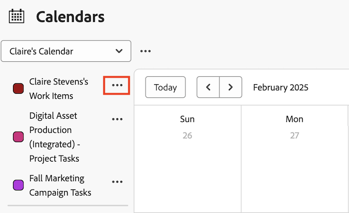

# 編輯現有的行事曆報告

您可以透過新增或刪除專案的連結來修改現有行事曆。 您也可以修改與行事曆報告相關聯的行事曆群組。

>[!NOTE]
>
>行事曆報表最多只能包含15個群組。

## 存取需求

+++ 展開以檢視本文中功能的存取需求。

您必須具有下列存取權才能執行本文中的步驟：

<table style="table-layout:auto"> 
 <col> 
 </col> 
 <col> 
 </col> 
 <tbody> 
  <tr> 
   <td role="rowheader">[!DNL Adobe Workfront plan]</td> 
   <td> 
任何
 </td> 
  </tr> 
  <tr> 
   <td role="rowheader">[!DNL Adobe Workfront] 授權</td> 
   <td>
新增：標準

       
或

       
目前：計畫
</td> 
  </tr> 
  <tr> 
   <td role="rowheader">存取層級設定</td> 
   <td> 
[！UICONTROL Edit]對[！UICONTROL報告]、[！UICONTROL儀表板]和[！UICONTROL行事曆的存取權
</td> 
  </tr> 
  <tr> 
   <td role="rowheader">物件許可權</td> 
   <td>[！UICONTROL Manage]對行事曆報表的存取權</td> 
  </tr> 
 </tbody> 
</table>

如需有關此表格的詳細資訊，請參閱Workfront檔案中的[存取需求](/help/quicksilver/administration-and-setup/add-users/access-levels-and-object-permissions/access-level-requirements-in-documentation.md)。

+++

## 編輯現有的行事曆報告

{{step1-to-calendars}}

1. （選擇性）若要變更行事曆報告的名稱，請按一下行事曆下拉式功能表旁的&#x200B;**重新命名**。
如果您已與其他使用者或團隊共用行事曆報告，則已修改的行事曆名稱會自動更新其行事曆檢視。

1. （選擇性）若要將專案新增至行事曆報表：
   1. 按一下&#x200B;**[!UICONTROL 新增至行事曆].**
   1. 開始輸入您想要新增日曆事件的專案名稱，然後按一下下拉式清單中顯示的名稱。
   1. 按一下&#x200B;**新增**。
      

1. （選擇性）若要新增行事曆群組或修改現有的行事曆群組：
   1. 按一下專案名稱旁的&#x200B;**更多**&#x200B;功能表，然後按一下&#x200B;**編輯**。
      

   1. 選擇您要如何群組專案：

      * [在行事曆報告中使用[!UICONTROL 計畫日期]](../../../reports-and-dashboards/reports/calendars/use-planned-dates.md)
      * [在行事曆報告中使用[!UICONTROL 預計日期]](../../../reports-and-dashboards/reports/calendars/use-projected-dates.md)
      * [在行事曆報告中使用自訂日期欄位](../../../reports-and-dashboards/reports/calendars/use-custom-dates.md)

