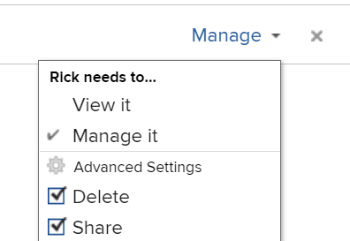

# 共用日曆報表

您可以與其他使用者共用日曆，也可以讓日曆公開使用，讓沒有 [!DNL Adobe Workfront] 檢視的授權。

## 存取需求

您必須具備下列存取權，才能執行本文中的步驟：

<table style="table-layout:auto"> 
 <col> 
 </col> 
 <col> 
 </col> 
 <tbody> 
  <tr> 
   <td role="rowheader"><strong>[!DNL Adobe Workfront plan*]</strong></td> 
   <td> 
任何
 </td> 
  </tr> 
  <tr> 
   <td role="rowheader"><strong>[!DNL Adobe Workfront] 授權*</strong></td> 
   <td> 
[!UICONTROL Review]或更高版本
 </td> 
  </tr> 
  <tr> 
   <td role="rowheader"><strong>訪問級別配置*</strong></td> 
   <td> 
[!UICONTROL視圖]或更高級別對[!UICONTROL對報告]、[!UICONTROL控制面板]和[!UICONTROL日曆]的訪問
 
注意：如果您仍無法存取，請詢問您的 [!DNL Workfront] 管理員。 若要了解 [!DNL Workfront] 管理員可修改您的存取層級，請參閱 <a href="../../../administration-and-setup/add-users/configure-and-grant-access/create-modify-access-levels.md" class="MCXref xref">建立或修改自訂存取層級</a>.
 </td> 
  </tr> 
  <tr> 
   <td role="rowheader"><strong>物件權限</strong></td> 
   <td> 
[!UICONTROL檢視]或更高的日曆報表權限，可存取共用
 
有關請求其他訪問的資訊，請參閱 <a href="../../../workfront-basics/grant-and-request-access-to-objects/request-access.md" class="MCXref xref">請求對對象的訪問 </a>.
 </td> 
  </tr> 
 </tbody> 
</table>

&#42;若要了解您擁有的計畫、授權類型或存取權，請聯絡您的 [!DNL Workfront] 管理員。

## 共用日曆，與 [!DNL Workfront] 使用者 {#share-a-calendar-with-workfront-users}

共用日曆與共用其他對象類似。 如需共用物件的詳細資訊，請參閱 [!DNL Adobe Workfront]，請參閱 [對象共用權限概述](../../../workfront-basics/grant-and-request-access-to-objects/sharing-permissions-on-objects-overview.md).

已與您共用的日曆會顯示星號(&#42;)。

在內共用日曆 [!DNL Workfront]:

1. 移至您要共用的日曆。
1. 按一下 **[!UICONTROL 日曆動作]**，然後按一下 **[!UICONTROL 共用]**.

1. 在 **[!UICONTROL 授予日曆存取權]** 欄位中，開始輸入要共用日曆的用戶、團隊、角色、組或公司的名稱，然後在下拉清單中顯示該名稱時按一下。\
   若要了解如何設定權限，請參閱 [對象共用權限概述](../../../workfront-basics/grant-and-request-access-to-objects/sharing-permissions-on-objects-overview.md).

1. （可選）對您要授予日曆存取權的每個使用者、團隊、角色或群組重複步驟3。
1. 按一下下拉式功能表，然後選取您要授與的權限層級，以指定您在步驟3中新增的每個使用者、團隊、角色、群組或公司的權限：

   * **[!UICONTROL 檢視]:** 使用者可以檢閱和共用日曆。

      

   * **[!UICONTROL 管理]:** 使用者可完整存取日曆，減去在存取層級授予的管理權限，再加上所有檢視權限。

      

      >[!NOTE]
      >
      >此 [!DNL Workfront] 管理員和日曆的建立者能夠從這些實體中移除權限。

1. （選用）視使用者角色而定，您可以按一下 **[!UICONTROL 進階選項]**，然後按一下 **[!UICONTROL 共用]**&#x200B;來允許使用者與其他使用者共用日曆。

   如需權限層級的詳細資訊，請參閱 [對象共用權限概述](../../../workfront-basics/grant-and-request-access-to-objects/sharing-permissions-on-objects-overview.md).

1. （選用）讓日曆可供所有人使用 [!DNL Workfront] 使用者，按一下齒輪圖示，然後在下拉式功能表中按一下 **[!UICONTROL 使此可見系統範圍]** 讓物件可供所有人使用 [!DNL Workfront] 使用者。\
   所有使用者都可以根據您設定的權限查看物件。

1. 按一下&#x200B;**[!UICONTROL 儲存]**。

## 與公用連結共用日曆

您可以將日曆設為公用，並與沒有 [!DNL Workfront] 授權。

1. 移至您要共用的日曆。
1. 按一下 **[!UICONTROL 日曆動作]**，然後按一下 **[!UICONTROL 共用]**.

1. 按一下齒輪圖示，然後按一下 **[!UICONTROL 將此項目公開給外部使用者]**.
1. 按一下 **[!UICONTROL 複製連結]**.
1. 按一下&#x200B;**[!UICONTROL 儲存]**。

## 與私人連結共用日曆

您可以與共用私人日曆連結 [!DNL Workfront] 使用者。 使用者使用連結時，必須登入才能檢視日曆。

1. 移至您要共用的日曆。
1. 按一下 **[!UICONTROL 日曆動作]**，然後按一下 **[!UICONTROL 取得可共用連結]**.

1. 按一下 **[!UICONTROL 複製連結]**.

   >[!NOTE]
   >
   >[!DNL Workfront] 使用者必須擁有日曆的存取權，才能透過連結存取日曆。 若要授予存取權，請參閱 [共用日曆，與 [!DNL Workfront] 使用者](#share-a-calendar-with-workfront-users).\
   >如果使用者沒有存取權，可在將連結貼入其瀏覽器後提出要求。
