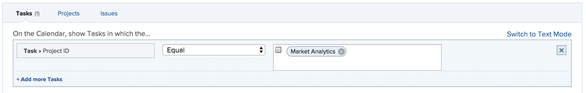

# 在行事曆報告中使用[!UICONTROL 計畫日期]

行事曆報告是一種動態報告，可提供工作的視覺化呈現。 您可以在行事曆報告中為下列物件使用[!UICONTROL 規劃日期]欄位：

* 任務
* 問題
* 專案

## 存取需求

+++ 展開以檢視本文中功能的存取需求。

您必須具有下列存取權才能執行本文中的步驟：

<table style="table-layout:auto"> 
 <col> 
 </col> 
 <col> 
 </col> 
 <tbody> 
  <tr> 
   <td role="rowheader">[!DNL Adobe Workfront plan]</td> 
   <td> 
任何
 </td> 
  </tr> 
  <tr> 
   <td role="rowheader">[!DNL Adobe Workfront] 授權</td> 
   <td>
新增：標準

       
或

       
目前：計畫
</td> 
  </tr> 
  <tr> 
   <td role="rowheader">存取層級設定</td> 
   <td> 
[！UICONTROL Edit]對[！UICONTROL報告]、[！UICONTROL儀表板]和[！UICONTROL行事曆的存取權
</td> 
  </tr> 
  <tr> 
   <td role="rowheader">物件許可權</td> 
   <td>[！UICONTROL Manage]對行事曆報表的存取權</td> 
  </tr> 
 </tbody> 
</table>

如需有關此表格的詳細資訊，請參閱Workfront檔案中的[存取需求](/help/quicksilver/administration-and-setup/add-users/access-levels-and-object-permissions/access-level-requirements-in-documentation.md)。

+++

## 設定專案群組

您可以選擇要在行事曆上顯示專案群組的方式。

{{step1-to-calendars}}

1. 選取您要新增一組專案的行事曆。
或
按一下「**[!UICONTROL +新行事曆]**」並輸入行事曆名稱。

   >[!NOTE]
   >
   >您必須擁有存取層級中報告、儀表板和行事曆的編輯存取權，才能建立行事曆報告。

1. 在左側，按一下&#x200B;**[!UICONTROL 新增至行事曆]**，然後按一下&#x200B;**[!UICONTROL 新增進階專案]**。

1. 指定下列專案：

   <table style="table-layout:auto">
    <col>
    <col>
    <tbody>
     <tr>
      <td role="rowheader"><strong>[！UICONTROL命名此專案群組]</strong></td>
      <td>輸入專案群組的名稱。</td>
     </tr>
     <tr>
      <td role="rowheader"><strong>[！UICONTROL色彩]</strong></td>
      <td>選取專案群組的顏色。 所有專案都會以選取的顏色顯示在行事曆報告中。</td>
     </tr>
     <tr>
      <td role="rowheader"><strong>[！UICONTROL日期欄位]</strong></td>
      <td>
選擇<strong>[！UICONTROL計畫日期]</strong>。 如需計畫日期的詳細資訊，請參閱 

       <ul>
        <li><a href="../../../manage-work/projects/planning-a-project/project-planned-start-date.md" class="MCXref xref">專案計劃開始日期總覽</a></li>
        <li><a href="../../../manage-work/tasks/task-information/task-planned-start-date.md" class="MCXref xref">任務計劃開始日期總覽</a></li>
        <li><a href="../../../manage-work/tasks/task-information/task-planned-completion-date.md" class="MCXref xref">任務計畫完成日期總覽</a></li>
        <li><a href="../../../manage-work/projects/planning-a-project/project-planned-completion-date.md" class="MCXref xref">設定專案計畫完成日期</a> </li>
       </ul></td>
     </tr>
     <tr>
      <td role="rowheader"><strong>在行事曆上，顯示</strong></td>
      <td>
選擇日期的顯示方式：

       <ul>
        <li><strong>[！UICONTROL僅開始日期]</strong>：行事曆在單一日期顯示物件。</li>
        <li><strong>[！UICONTROL結束日期僅限]</strong>：行事曆會在單一日期顯示物件。</li>
        <li><strong>[！UICONTROL Duration] （開始至結束）</strong>：行事曆顯示物件超過天數。</li>
       </ul></td>
     </tr>
     <tr data-mc-conditions="">
      <td role="rowheader"><strong>[！UICONTROL在可用時切換到實際日期]</strong></td>
      <td>
行事曆會在實際日期可用時自動切換到實際日期。  選擇<strong>[！UICONTROL是]</strong>或<strong>[！UICONTROL否]</strong>，在可用時切換到實際日期。 如需實際日期的詳細資訊，請參閱

       <ul>
        <li><a href="../../../manage-work/projects/planning-a-project/project-actual-start-date.md" class="MCXref xref">專案實際開始日期概要 </a></li>
        <li><a href="../../../manage-work/projects/planning-a-project/project-actual-completion-date.md" class="MCXref xref">專案實際完成日期概要 </a></li>
       </ul></td>
     </tr>
    </tbody>
   </table>

1. 繼續下一節。

## 將物件加入至專案群組

設定專案顯示方式之後，您需要將要在行事曆上看到的物件加入群組。

1. 在&#x200B;**[!UICONTROL 中，您想要新增什麼至行事曆？]**&#x200B;節，選取

   * **[!UICONTROL 任務]**
   * **[!UICONTROL 專案]**
   * **[!UICONTROL 問題]**

1. 根據您新增至行事曆的物件型別，按一下&#x200B;**[!UICONTROL 新增任務]**、**[!UICONTROL 新增專案]**&#x200B;或&#x200B;**[!UICONTROL 新增問題]**。
   的物件

1. 在下拉式功能表中，開始輸入欄位名稱，然後選取要顯示在行事曆上的物件欄位來源（例如，**[!UICONTROL 延遲工作]**）。
1. 設定行事曆分組的條件陳述式。

   

   若要瞭解如何設定條件，請參閱[篩選和條件修飾元](../../../reports-and-dashboards/reports/reporting-elements/filter-condition-modifiers.md)。

1. （選擇性）重複步驟1-4，為行事曆群組指定其他物件。
1. 在&#x200B;**[!UICONTROL 將任務/專案/問題標籤設定為……]**&#x200B;欄位中，選取此行事曆群組中的物件在行事曆中的標示方式。

   >[!NOTE]
   >
   >如果特定物件無法使用預設標籤選項，則會改為顯示物件名稱。 例如，選取[!UICONTROL 父系任務]標籤且沒有與物件相關聯的父系任務時，[!DNL Adobe Workfront]會顯示您在行事曆中檢視的物件名稱。

1. 按一下「**[!UICONTROL 儲存]**」。
