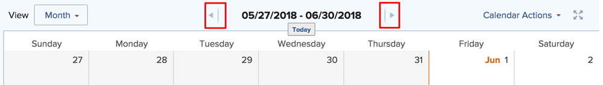

# 檢視行事曆報告和事件詳細資訊

您可以在Adobe Workfront中檢視您建立或與您共用的行事曆報告和事件詳細資訊。

## 存取需求

+++ 展開以檢視本文中功能的存取需求。

您必須具有下列存取權才能執行本文中的步驟：

<table style="table-layout:auto"> 
 <col> 
 </col> 
 <col> 
 </col> 
 <tbody> 
  <tr> 
   <td role="rowheader">[!DNL Adobe Workfront plan]</td> 
   <td> 
任何
 </td> 
  </tr> 
  <tr> 
   <td role="rowheader">[!DNL Adobe Workfront] 授權</td> 
   <td>
新增：投稿人

       
或

       
目前：要求
</td> 
  </tr> 
  <tr> 
   <td role="rowheader">存取層級設定</td> 
   <td> 
[!UICONTROL 檢視]或更高許可權可存取[!UICONTROL 報表]、[!UICONTROL 儀表板]和[!UICONTROL 行事曆]
</td> 
  </tr> 
  <tr> 
   <td role="rowheader">物件許可權</td> 
   <td>[!UICONTROL 檢視]或日曆報告的較高許可權</td> 
  </tr> 
 </tbody> 
</table>

如需有關此表格的詳細資訊，請參閱Workfront檔案中的[存取需求](/help/quicksilver/administration-and-setup/add-users/access-levels-and-object-permissions/access-level-requirements-in-documentation.md)。

+++

## 檢視行事曆報告

<!--{{step1-to-calendars}}-->

1. 按一下Adobe Workfront右上角的&#x200B;**[!UICONTROL 主功能表]**&#x200B;圖示，或（如果有的話）按一下左上角的&#x200B;**[!UICONTROL 主功能表]**&#x200B;圖示，然後按一下&#x200B;**[!UICONTROL 行事曆]**。

   根據您的存取層級，您可能會看到下列行事曆：

   * 您的預設[!DNL Adobe Workfront]行事曆

     Workfront會根據指派給您的專案、任務和問題或是指派給您受指派的團隊、群組或角色的問題，為您建立行事曆。

   * 您已建立的行事曆

     若要瞭解如何建立行事曆，請參閱[行事曆報告總覽](../../../reports-and-dashboards/reports/calendars/calendar-reports-overview.md)。

   * 其他使用者與您共用的行事曆

     若要瞭解共用行事曆，請參閱[[!UICONTROL 共用行事曆]報告](../../../reports-and-dashboards/reports/calendars/share-a-calendar-report.md)。

1. （視條件而定）按一下&#x200B;**[!UICONTROL 檢視]**&#x200B;下拉式清單，然後選取您要檢視的行事曆持續時間。
   
您可以從下列行事曆報表檢視中進行選擇：

   * **[!UICONTROL 月]**：顯示行事曆的四個星期
   * **[!UICONTROL 周]**：顯示日曆的一週
   * **[!UICONTROL 甘特圖]**：顯示行事曆的連續檢視

     您可以向下或橫向捲動，在[!UICONTROL 甘特圖]檢視中看到更多事件。 當為檢視填入資料時，會出現載入符號。

   >[!NOTE]
   >
   >在[!UICONTROL 月]和[!UICONTROL 周]檢視中，目前或未來的事件（包括橫跨多天的事件，只要包含今天或未來的某天即可）會有與專案或行事曆群組顏色對應的陰影。 過去的事件會以較淺的陰影顯示，表示它們不再是最新的，但您仍可以選取及檢視這些事件。

1. （選擇性）如果您是以[!UICONTROL 月]或[!UICONTROL 周]檢視檢視檢視檢視行事曆，可以使用下列選項變更行事曆檢視：

<!--   * To include or exclude weekends:

      1. On the **[!UICONTROL Calendar]** toolbar, click **[!UICONTROL Calendar Actions]**, then from the drop-down list select either **[!UICONTROL Show Weekend]** or **[!UICONTROL Hide Weekend]**.-->

* 若要快速變更顯示的日期：

   1. 在&#x200B;**[!UICONTROL 行事曆]**&#x200B;工具列上，按一下日期指示器的左箭頭在行事曆中往回移動，或按一下右箭頭往前移動。

      \
      顯示的日期會根據您目前的行事曆檢視調整間隔。 例如，如果您在[!UICONTROL 周]檢視中檢視行事曆，行事曆會向前顯示一週，或向後顯示一週，視您選取的箭頭而定。

   1. （選擇性）若要返回當天，請按一下&#x200B;[!UICONTROL **今天**]。

1. （選擇性）若要以全熒幕檢視行事曆，請按一下&#x200B;**[!UICONTROL 行事曆]**&#x200B;工具列右側的全熒幕箭頭。
   \
   按下Esc鍵以返回行事曆的正常檢視。

1. （選擇性）若要隱藏連結至行事曆之專案或行事曆群組的事件，請清除專案清單中的專案或行事曆群組。
   
您可以選取專案清單中的[!UICONTROL 專案]或行事曆群組，讓事件再次可見。

## 檢視行事曆報告事件詳細資料

您可以在行事曆中檢視目前和過去事件的詳細資訊。

1. 前往您要瞭解其詳細資料的事件，然後按一下事件。 詳細資訊會在右側的面板中開啟。
1. （可選）若要開啟相關聯的專案、任務或問題，請按一下物件的標題。
