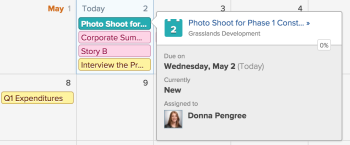

# 檢視日曆報表和事件詳細資訊

您可以在Adobe Workfront中檢視您建立或與您共用的日曆報表和事件詳細資料。

## 存取需求

您必須具備下列存取權，才能執行本文中的步驟：

<table style="table-layout:auto"> 
 <col> 
 </col> 
 <col> 
 </col> 
 <tbody> 
  <tr> 
   <td role="rowheader"><strong>[!DNL Adobe Workfront plan*]</strong></td> 
   <td> 
任何
 </td> 
  </tr> 
  <tr> 
   <td role="rowheader"><strong>[!DNL Adobe Workfront] 授權*</strong></td> 
   <td> 
[!UICONTROL Request]或更高版本
 </td> 
  </tr> 
  <tr> 
   <td role="rowheader"><strong>訪問級別配置*</strong></td> 
   <td> 
[!UICONTROL視圖]或更高版本對[!UICONTROL報表]、[!UICONTROL控制面板]和[!UICONTROL日曆]的訪問
 
注意：如果您仍無法存取，請詢問您的 [!DNL Workfront] 管理員。 若要了解 [!DNL Workfront] 管理員可修改您的存取層級，請參閱 <a href="../../../administration-and-setup/add-users/configure-and-grant-access/create-modify-access-levels.md" class="MCXref xref">建立或修改自訂存取層級</a>.
 </td> 
  </tr> 
  <tr> 
   <td role="rowheader"><strong>物件權限</strong></td> 
   <td> 
[!UICONTROL檢視]或更高的日曆報表權限
 
有關請求其他訪問的資訊，請參閱 <a href="../../../workfront-basics/grant-and-request-access-to-objects/request-access.md" class="MCXref xref">請求對對象的訪問</a>.
 </td> 
  </tr> 
 </tbody> 
</table>

&#42;若要了解您擁有的計畫、授權類型或存取權，請聯絡您的 [!DNL Workfront] 管理員。

## 檢視日曆報表

1. 按一下 **[!UICONTROL 主菜單]** 圖示  在 [!DNL Adobe Workfront]，然後按一下 **[!UICONTROL 日曆]**.

   根據您的存取層級，您可能會看到下列日曆：

   * 您的預設值 [!DNL Adobe Workfront] 日曆\

      Workfront會根據指派給您或指派給您的團隊、群組或角色的專案、工作和問題，為您建立日曆。
   * 已建立的日曆\

      若要了解如何建立日曆，請參閱 [日曆報表概觀](../../../reports-and-dashboards/reports/calendars/calendar-reports-overview.md).

   * 其他使用者與您共用的日曆\

      若要了解共用日曆，請參閱 [[!UICONTROL 共用日曆] 報告](../../../reports-and-dashboards/reports/calendars/share-a-calendar-report.md).

1. （條件性）按一下 **[!UICONTROL 檢視]** 下拉式清單，然後選取您要檢視的日曆持續時間。\
   \
   您可以從下列日曆報表檢視中選擇：

   * **[!UICONTROL 月]**:顯示日曆的四周
   * **[!UICONTROL 周]**:顯示日曆的一週
   * **[!UICONTROL 甘特圖]**:顯示日曆的連續視圖\

      ![[!UICONTROL 甘特圖] 日曆報告](assets/gantt-calendar-report.png)
您可以在 [!UICONTROL 甘特圖] 通過向下滾動或橫向滾動查看。 當為視圖填入資料時，載入符號將出現。
   >[!NOTE]
   >
   >在 [!UICONTROL 月] 和 [!UICONTROL 周] 視圖、當前或將來的事件（包括跨多天的事件，只要它們包含今天或將來的某天）具有與項目或日曆分組中的顏色相對應的底紋。 過去事件的底紋較淺，可指出它們已不是最新事件，但您仍可以選取並檢視這些事件。

1. （選用）如果您檢視的日曆位於 [!UICONTROL 月] 或 [!UICONTROL 周] 檢視，您可以使用下列選項變更日曆檢視：

   * 要包括或排除週末：

      1. 在 **[!UICONTROL 日曆]** 按一下 **[!UICONTROL 日曆動作]**，然後從下拉式清單中選取 **[!UICONTROL 節目週末]** 或 **[!UICONTROL 隱藏週末]**.
   * 若要快速變更顯示的日期：

      1. 在 **[!UICONTROL 日曆]** 工具列上，按一下日期指示器的左箭頭以在日曆中往回移動，或按一下右箭頭以往移。\

         \
         根據您目前的日曆檢視，依間隔調整顯示的日期。 例如，若您檢視的日曆位於 [!UICONTROL 周] 檢視時，日曆會根據您選取的箭頭，顯示一週或一週之前。

      1. （選用）若要返回當天，請按一下 **托德ay**.

1. （可選）若要以全螢幕檢視日曆，請按一下 **[!UICONTROL 日曆]** 工具欄。
   \
   按Esc鍵返回日曆的正常視圖。

1. （可選）要隱藏連結到日曆的項目或日曆分組的事件，請在項目清單中清除項目或日曆分組。
   \
   您可以選取 [!UICONTROL 專案] 或項目清單中的日曆分組。

## 查看日曆報告事件詳細資訊

您可以在日曆中查看目前和過去事件的事件詳細資訊。

1. 前往您要知道其詳細資訊的事件，然後按一下事件。\
   事件的詳細資訊頁面隨即開啟。\
   

1. （可選）要查看有關對象的其他詳細資訊：

   1. 將滑鼠移到專案、任務或問題名稱上。

      將開啟對象的詳細資訊頁面。\
      

   1. （可選）要開啟關聯的項目、任務或問題，請按一下對象的標題。
   1. （可選）若要關閉所有已開啟的詳細資訊頁面，請按一下事件詳細資訊頁面之外的任意位置。
