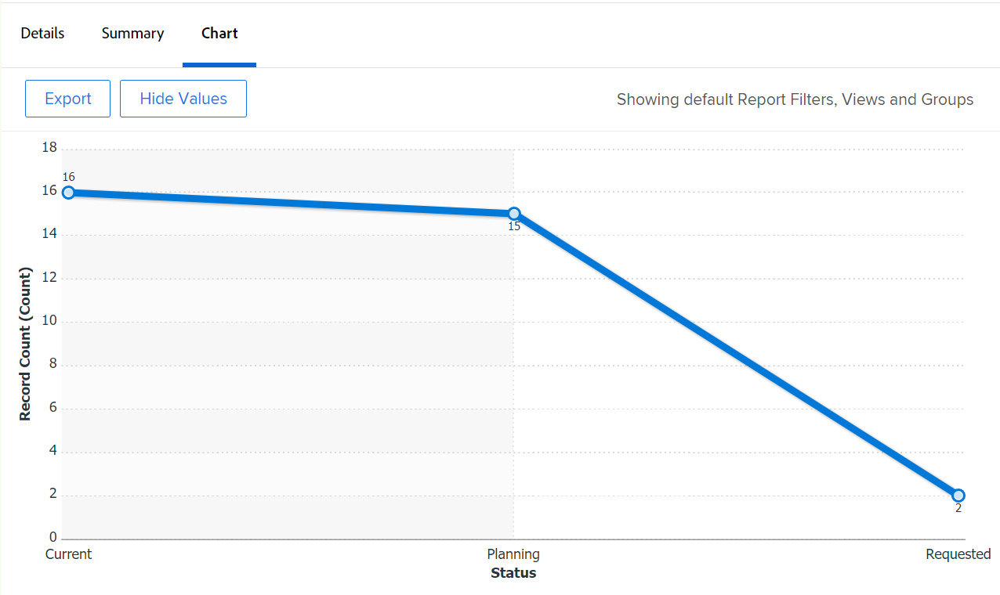
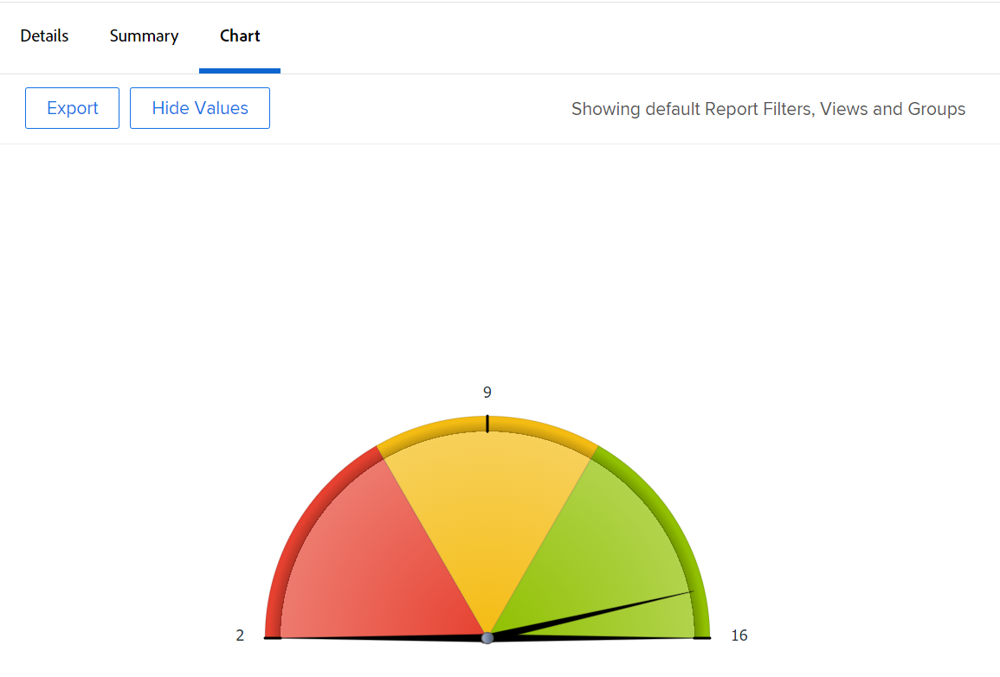
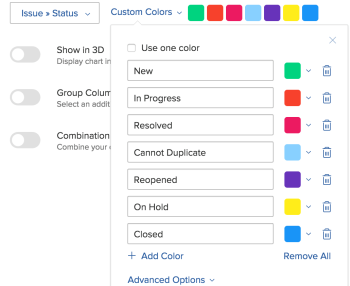

# 新增圖表至報表

<!--Audited: 01/2024-->

您可以新增圖表來增強報表。 您可以將圖表新增至現有報表或您正在建立的報表。

在將圖表新增到報表之前，您應該為報表建立檢視和分組。

除非您先將報表中的資訊分組，否則您無法將圖表新增至大多數報表。 唯一可以新增而不使用分組的圖表是量測軌圖表。

如需關於檢視的資訊，請參閱 [Adobe Workfront中的檢視概觀](../../../reports-and-dashboards/reports/reporting-elements/views-overview.md).

如需分組的詳細資訊，請參閱 [Adobe Workfront中的群組概觀](../../../reports-and-dashboards/reports/reporting-elements/groupings-overview.md).

如果報表顯示太多專案，則不會建立圖表。 在此情況下，您也必須新增篩選器至報表，以減少報表中的結果數。

如需篩選的詳細資訊，請參閱 [篩選器概觀](../../../reports-and-dashboards/reports/reporting-elements/filters-overview.md).

## 存取需求

您必須具有下列存取權才能執行本文中的步驟：

<table style="table-layout:auto"> 
 <col> 
 <col> 
 <tbody> 
  <tr> 
   <td role="rowheader">Adobe Workfront計畫</td> 
   <td> 
任何
 </td> 
  </tr> 
  <tr> 
   <td role="rowheader">Adobe Workfront授權*</td> 
   <td> 
目前：計畫 

   或
   
新增：標準
 </td> 
  </tr> 
  <tr> 
   <td role="rowheader">存取層級設定</td> 
   <td> 
編輯報告、儀表板、行事曆的存取權
 
編輯對篩選器、檢視、群組的存取權
 </td> 
  </tr> 
  <tr> 
   <td role="rowheader">物件許可權</td> 
   <td> 
管理報表的許可權
  </td> 
  </tr> 
 </tbody> 
</table>

&#42;若要瞭解您擁有的計畫、授權型別或存取權，請聯絡您的Workfront管理員。 如需存取需求的詳細資訊，請參閱 [Workfront檔案中的存取需求](/help/quicksilver/administration-and-setup/add-users/access-levels-and-object-permissions/access-level-requirements-in-documentation.md).

## 新增圖表至報表

1. 移至現有報表或建立新報表。 如需建立新報告的詳細資訊，請參閱 [建立自訂報表](../../../reports-and-dashboards/reports/creating-and-managing-reports/create-custom-report.md).
1. （視條件而定）如果您前往現有報表，請按一下 **報表動作** > **編輯**.

1. 確保 **欄（檢視）** 標籤已更新，以在報告中顯示您想要繪成圖表的資訊。

   有關如何建立或修改報告檢視的資訊，請參閱 [在Adobe Workfront中建立或編輯檢視](/help/quicksilver/reports-and-dashboards/reports/reporting-elements/create-edit-views.md).

1. 按一下 **群組** 標籤並新增群組。

   >[!TIP]
   >
   >* 您只能在報告結果分組時向報告新增圖表。
   >* 圖表不支援文字模式分組。 如需文字模式群組的詳細資訊，請參閱 [編輯群組中的文字模式](../../../reports-and-dashboards/reports/text-mode/edit-text-mode-in-grouping.md).
   >* 如果您新增代表一個度量的單一群組，則除了圓餅圖之外，其他所有圖表都會將群組中的每個結果顯示為相同的顏色。

   如需建立群組的詳細資訊，請參閱 [在Adobe Workfront中建立群組](/help/quicksilver/reports-and-dashboards/reports/reporting-elements/create-groupings.md).

1. 選取 **圖表** 標籤。
1. 按一下圖表型別以將其選取。\
   

1. 從下列圖表型別中選取：

   * [柱狀圖](#column-chart)
   * [橫條圖](#bar-chart)
   * [圓形圖](#pie-chart)
   * [折線圖](#line-chart)
   * [量測軌圖表](#gauge-chart)
   * [泡泡圖](#bubble-chart)

1. 按一下 **儲存+關閉** 以儲存圖表和報表。

### 柱狀圖 {#column-chart}

若要新增 **欄** 圖表至您的報表：

1. 開始將圖表新增至報表，如所述 [新增圖表至報表](#add-a-chart-to-a-report).
1. 在 **左(Y)軸** 欄位中，選取要包括在圖表Y軸上的值，以及要如何摘要資訊。
1. 在 **底部(X)軸** 欄位中，選取要包含在圖表中的群組。
1. （選用）選取 **自訂顏色** 將您偏好的顏色指定給每個欄。\
   如需自訂圖表顏色的詳細資訊，請參閱 [自訂圖表顏色](#customize-chart-colors).

1. （選用）選取 **以3D顯示** 以在3維檢視中顯示圖表。
1. （可選） **群組欄**：選取此選項可定義欄的群組方式。\
   從下列選項中選取：

   * 按一下下列其中一個選項，以選取群組欄的顯示方式：

      * **並排**
      * **棧疊**
      * **棧疊至100%**

   * 從中選擇要包含在圖表中的分組 **資料分組依據** 下拉式功能表。
   * （選用）選取 **自訂顏色** 以自訂欄的顏色。\
     如需自訂圖表顏色的詳細資訊，請參閱 [自訂圖表顏色](#customize-chart-colors).

1. （選用）選取 **組合圖表** 在圖表中加入額外的值，以及您想要如何摘要資訊。\
   請考量下列選項：

   * **在次要軸上繪圖**：選取此選項可在圖表右側繪製資料。
   * **圖表型別**：選取您要將這個額外值顯示為一行還是第三欄。\
     

1. 按一下 **儲存+關閉** 以儲存圖表和報表。

### 橫條圖 {#bar-chart}

若要新增 **長條圖** 圖表至您的報表：

1. 開始將圖表新增至報表，如所述 [新增圖表至報表](#add-a-chart-to-a-report).
1. 在 **底部(X)軸** 欄位中，選取要包括在圖表X軸上的值，以及要如何摘要資訊。
1. 在 **左(Y)軸** 欄位中，選取要包含在圖表中的群組。
1. （選用）選取 **自訂顏色** 以自訂長條的顏色。\
   如需自訂圖表顏色的詳細資訊，請參閱 [自訂圖表顏色](#customize-chart-colors).

1. （選用）選取 **以3D顯示** 以在3維檢視中顯示圖表。
1. （選用）選取 **群組條** 以定義要如何群組長條。\
   從下列選項中選取：

   * 按一下下列其中一個選項，以選取群組長條的顯示方式：

      * **並排**
      * **棧疊**
      * **棧疊至100%**

   * 從以下位置選取您要將圖表中的資訊群組到的方式： **資料分組依據** 下拉式功能表。
   * （選用）選取 **自訂顏色** 以自訂欄的顏色。\
     如需自訂圖表顏色的詳細資訊，請參閱 [自訂圖表顏色](#customize-chart-colors).

1. （選用）選取 **組合圖表** 在圖表中加入額外的值，以及您想要如何摘要資訊。\
   

1. 按一下 **儲存+關閉** 以儲存圖表和報表。

### 圓形圖 {#pie-chart}

若要新增 **圓形圖** 圖表至您的報表：

1. 開始將圖表新增至報表，如所述 [新增圖表至報表](#add-a-chart-to-a-report).
1. 在 **值** 欄位中，選取要在報表上顯示的值，以及希望如何彙總這些值。\
   在 **楔形** 欄位中，選取要包含在圖表中的群組。 「群組」由圖表的楔形表示。

1. （選用）選取 **自訂顏色** 以自訂圖表上楔形的顏色。\
   如需自訂圖表顏色的詳細資訊，請參閱 [自訂圖表顏色](#customize-chart-colors).

1. （選用）選取 **以3D顯示** 以在3維檢視中顯示圖表。
1. 在 **結果顯示為** 欄位中，選取結果在圖表中的顯示方式。 請考量下列選項：

   * **百分比**：圖表結果以百分比顯示。
   * **數字**：圖表結果會以數字顯示。\
     

1. 按一下 **儲存+關閉** 以儲存圖表和報表。

### 折線圖 {#line-chart}

若要新增 **折線圖** 圖表至您的報表：

1. 開始將圖表新增至報表，如所述 [新增圖表至報表](#add-a-chart-to-a-report).
1. 在 **左(Y)軸** 欄位中，選取要包括在圖表Y軸上的值，以及要如何摘要資訊。
1. 在 **底部(X)軸** 欄位中，選取要包含在圖表中的群組。
1. （選擇性）選取顏色以自訂線條的顏色。
1. （選用）選取 **群組行**，為圖表選取其他分組。\
   （選用）選取 **自訂顏色** 以自訂新群組的顏色。\
   如需自訂圖表顏色的詳細資訊，請參閱 [自訂圖表顏色](#customize-chart-colors).

1. （選用）選取 **組合圖表** 以依附加值組合您的行。\
   請考量下列選項：

   * 選取您要包含在圖表中的值，以及您想要如何摘要資訊。
   * 選取 **在次要軸上繪圖** 在圖表右側繪製資料的欄位。\
     

1. 按一下 **儲存+關閉** 以儲存圖表和報表。

### 量測軌圖表 {#gauge-chart}

A **量測計** 圖表以量測軌格式顯示符合特定條件的記錄數。 量規的指標指向符合在報告的檢視和分組中所選條件的記錄數。 設定量測軌圖表不需要報告分組。

若要新增 **量測計** 圖表至您的報表：

1. 開始將圖表新增至報表，如所述 [新增圖表至報表](#add-a-chart-to-a-report).
1. 在 **值** 欄位中，選取要在報表上顯示的值，以及希望如何彙總這些值。 如果您選取 **記錄計數**，則顯示的值為報表的物件。

1. 在 **指標** 欄位中，選取要包含在圖表中的群組。 分組由圖表上的指標線表示。\
   如果您有包含兩個專案的「群組」，圖表上會顯示兩個指標。\
   例如，如果您有一個「專案狀態群組」，而且有兩個專案狀態（「目前」和「暫停」），您的量測計圖表就會包含兩個量測計指標。 他們會指向處於該狀態的專案數量。\
   （選用）選取 **總計** 在 **指標** 欄位，顯示所選物件的總數 **值** 欄位。

1. 在 **值範圍** 欄位中，指定值的範圍及顏色，以代表要在量測軌圖表中顯示的值。
1. （選用）按一下 **新增另一個值範圍** 以新增其他值範圍至圖表。\
   

1. 按一下 **儲存+關閉** 以儲存圖表和報表。

### 泡泡圖 {#bubble-chart}

您最多可以在中顯示一個物件的三個欄位 **泡泡** 圖表。 這表示您最多可以在泡泡圖中顯示四個資料點。 每個具有三個關聯欄位的圖元都會顯示為圓形，表示其在X軸和Y軸中的位置內的兩個欄位。 第三個欄位由圓形的大小表示。

若要新增 **泡泡** 圖表至您的報表：

1. 開始將圖表新增至報表，如所述 [新增圖表至報表](#add-a-chart-to-a-report).
1. 在 **左(Y)軸** 欄位中，選取要包含在圖表Y軸上的值。 值來自報表的檢視。 指定您要如何摘要資訊。
1. 在 **底部(X)軸欄位**&#x200B;中，選取您要加入至圖表X軸上的值。 值來自報表的檢視。 指定您要如何摘要資訊。

   >[!NOTE]
   >
   >確保您至少有一欄是彙總的，此欄位才能啟用。\
   >如需摘要報告欄中資訊的詳細資訊，請參閱 [建立自訂報表](../../../reports-and-dashboards/reports/creating-and-managing-reports/create-custom-report.md).

1. 在 **泡泡大小** 欄位中，選取您要以圖表中的泡泡大小表示的值。 值來自報表的檢視。 指定您要如何摘要資訊。

   >[!NOTE]
   >
   >確保您至少有一欄是彙總的，此欄位才能啟用。\
   >如需摘要報告欄中資訊的詳細資訊，請參閱 [建立自訂報表](../../../reports-and-dashboards/reports/creating-and-managing-reports/create-custom-report.md).

1. 在 **泡泡** 欄位中，選取要包含在圖表中的群組。 「群組」由圖表上的泡泡位置表示。
1. 在 **泡泡顏色** 欄位，選取您想用泡泡顏色表示的欄位。

   

   此 **泡泡顏色** 可以是您在報告中定義的群組，但只有當您選取 **名稱** 中的報表物件欄 **泡泡** 欄位。

   例如，如果您選取 **任務名稱** 在任務報告中，您可以新增 **任務狀態** 作為 **泡泡顏色** 欄位。

   

   但是，如果您選取 **任務狀態** 針對 **泡泡** 欄位，您無法選取 **泡泡顏色** 欄位。 此外，您無法選取 **專案名稱** 針對 **泡泡顏色** 欄位，即使您選取 **任務名稱** 針對 **泡泡** 欄位。

   

1. 按一下 **儲存+關閉** 以儲存對介面產生器所做的變更。

## 匯出圖表

您可以將圖表匯出為.pdf檔案。

若要匯出圖表：

1. 按一下 **匯出** 將圖表匯出為.pdf。\
   會將.pdf檔案下載至您的電腦。

1. 開啟.pdf檔案。\
   匯出的檔案包含下列資訊：

   * 圖表的影像。
   * 報告名稱的標題。
   * 唯一的檔案名稱，即報表的名稱。
   * 包含報表匯出日期與時間以及頁碼的頁尾。

## 自訂圖表顏色 {#customize-chart-colors}

您可以讓Workfront選取圖表中元素的顏色，也可以在將圖表新增至報表時進行自訂。 如果您的圖表包含代表一個量度的單一「群組」（例如顯示按實際完成日期分組的任務數量的任務報告），則「群組」中的每個結果都會以相同的顏色顯示。

您只能為報表檢視中顯示的欄位選擇一個顏色。 您可以為顯示在報表「分組」中的欄位選擇多種顏色（每種選項一種）。

>[!IMPORTANT]
>
>對於日期欄位，您只能為圖表元素選取一種顏色。

若要自訂圖表顏色：

1. 建立報表時，請前往 **圖表** 標籤。
1. 選取要新增至報表的圖表型別。\
   如需有關將圖表新增至報表的詳細資訊，請參閱 [新增圖表至報表](#add-a-chart-to-a-report).

1. 按一下 **自訂顏色** 此欄位可用時。\
   「自訂顏色」對話方塊隨即顯示。\
   

   >[!NOTE]
   >
   >您可以將自訂顏色與任何可依據的欄位建立關聯，並將自訂顏色與某些可在檢視中顯示的欄位建立關聯，包括自訂欄位。 您在「自訂顏色」對話方塊中選擇的自訂欄位或自訂欄位選項會區分大小寫。

1. 請考慮選取下列任一選項：

   * **使用一種顏色**：圖表的所有元素都會以選取的顏色顯示。

      1. 開始輸入所選欄位之選項的名稱，然後選取顏色。 此選項會以圖表上選取的顏色顯示。
      1. （選擇性）指定顏色的十六進位顏色值，而不是從可用的顏色範例中選取一個值\
         或\
         按一下按一下十六進位程式碼後顯示的檢色器，然後選取其他顏色。

   * **新增顏色**：繼續為所選欄位的所有其他可能選項新增自訂顏色。
   * **全部移除**：選取此選項可移除上方所選欄位的所有顏色和選項。
   * **進階選項**：從下列選項中選取：

      * **沒有值**：選取此欄位和自訂顏色，以顯示將「無值」專案分組的圖表欄。 這些專案無法依您在分組中選取之欄位的任何選項分組。
      * **所有其他值**：選取此欄位和自訂顏色，以顯示以上未選取選項的所有其他圖表元素。

        >[!NOTE]
        >
        >您最近使用的顏色會顯示在「自訂顏色」對話方塊的頂端。 當您將滑鼠移到最近使用的顏色上時，會顯示與其關聯的欄位名稱。

1. 按一下「自訂顏色」右上角的「x」以關閉「自訂顏色」對話方塊。 您選取的顏色會自動儲存。
1. 按一下 **儲存+關閉** 以儲存圖表並執行報表。

## 從報告中移除圖表

若要從報表中移除圖表：

1. 開啟 **圖表** 標籤進行標籤。
1. 將滑鼠移至您所選圖表型別的圖示上，圖示的右上角就會出現「x」按鈕。
1. 按一下「x」以移除圖表。
1. 按一下「**儲存並關閉**」。

## 使用圖表時的限制

在使用圖表時，請注意下列限制：

* 此 **圖表預覽** report builder右側的區段不包含報表中的實際資料。 您必須儲存圖表，並從 **圖表** 標籤以檢視含有您資料的圖表。

* 部分圖表元素無法編輯：

   * 您無法變更字型型別，也無法變更每個元素值的大小。
   * 您無法變更圖表中的軸名稱。

* 您無法編輯圖表的圖例。
* 為您的分組使用計算欄位時，您無法按一下圖表元素。
* 在泡泡圖中，最多可以顯示四個資料點。 所有其他圖表型別會顯示兩個或最多三個資料點。
