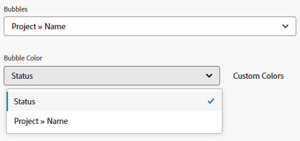

# 新增圖表至報表

<!--Audited: 11/2024-->

您可以新增圖表來增強報表。 您可以將圖表新增至現有報表或您正在建立的報表。

在將圖表新增到報表之前，您應該為報表建立檢視和分組。

除非您先將報表中的資訊分組，否則您無法將圖表新增至大多數報表。 唯一可以新增而不使用分組的圖表是量測軌圖表。

如需檢視的相關資訊，請參閱[Adobe Workfront中的檢視總覽](../../../reports-and-dashboards/reports/reporting-elements/views-overview.md)。

如需群組的詳細資訊，請參閱Adobe Workfront中的[群組概觀](../../../reports-and-dashboards/reports/reporting-elements/groupings-overview.md)。

如果報表顯示太多專案，則不會建立圖表。 在此情況下，您也必須新增篩選器至報表，以減少報表中的結果數。

如需篩選的詳細資訊，請參閱[篩選總覽](../../../reports-and-dashboards/reports/reporting-elements/filters-overview.md)。

## 存取需求

+++ 展開以檢視本文中功能的存取需求。

您必須具有下列存取權才能執行本文中的步驟：

<table style="table-layout:auto"> 
 <col> 
 <col> 
 <tbody> 
  <tr> 
   <td role="rowheader">Adobe Workfront計畫</td> 
   <td> 
任何
 </td> 
  </tr> 
  <tr> 
   <td role="rowheader">Adobe Workfront授權*</td> 
   <td> 
      
新增：

         <ul>
         <li>
標準
</li>
         </ul>
      
目前：

         <ul>
         <li>
規劃
</li>
         </ul>
   </td>
  </tr> 
  <tr> 
   <td role="rowheader">存取層級設定</td> 
   <td> 
編輯報告、儀表板、行事曆的存取權
 
編輯對篩選器、檢視、群組的存取權
 </td> 
  </tr> 
  <tr> 
   <td role="rowheader">物件許可權</td> 
   <td> 
管理報表的許可權
  </td> 
  </tr> 
 </tbody> 
</table>

*如需詳細資訊，請參閱Workfront檔案中的[存取需求](/help/quicksilver/administration-and-setup/add-users/access-levels-and-object-permissions/access-level-requirements-in-documentation.md)。

+++

## 新增圖表至報表

1. 移至現有報表或建立新報表。 如需建立新報告的詳細資訊，請參閱[建立自訂報告](../../../reports-and-dashboards/reports/creating-and-managing-reports/create-custom-report.md)。

1. （視條件而定）如果您進入現有的報表，請按一下&#x200B;**報表動作** > **編輯**。

1. 確定已更新&#x200B;**欄（檢視）**&#x200B;標籤，以顯示您要在報告中繪製圖表的資訊。

   如需有關如何建立或修改報告檢視的資訊，請參閱[在Adobe Workfront中建立或編輯檢視](/help/quicksilver/reports-and-dashboards/reports/reporting-elements/create-edit-views.md)。

1. 按一下&#x200B;**群組**&#x200B;索引標籤並新增群組。

   >[!TIP]
   >
   >* 您只能在報告結果分組時向報告新增圖表。
   >* 圖表不支援文字模式分組。 如需文字模式群組的詳細資訊，請參閱[使用文字模式編輯群組](../../../reports-and-dashboards/reports/text-mode/edit-text-mode-in-grouping.md)。
   >* 如果您新增代表一個度量的單一群組，則除了圓餅圖之外，其他所有圖表都會將群組中的每個結果顯示為相同的顏色。

   如需建立群組的詳細資訊，請參閱[在Adobe Workfront中建立群組](/help/quicksilver/reports-and-dashboards/reports/reporting-elements/create-groupings.md)。

1. 選取&#x200B;**圖表**&#x200B;標籤。

1. 按一下圖表型別以將其選取。\
   

1. 從下列圖表型別中選取：

   * [柱狀圖](#column-chart)
   * [長條圖](#bar-chart)
   * [圓形圖](#pie-chart)
   * [折線圖](#line-chart)
   * [量測軌圖表](#gauge-chart)
   * [泡泡圖](#bubble-chart)

1. 按一下&#x200B;**儲存+關閉**&#x200B;以儲存圖表和報表。

### 柱狀圖 {#column-chart}

若要將&#x200B;**欄**&#x200B;圖表新增至您的報表：

1. 開始新增圖表至您的報表，如[新增圖表至報表](#add-a-chart-to-a-report)中所述。

1. 在&#x200B;**左側(Y)軸**&#x200B;欄位中，選取您要包含在圖表Y軸上的值，然後選取您要如何在&#x200B;**摘要依據**&#x200B;欄位中摘要資訊。

1. （選擇性）按一下&#x200B;**自訂顏色**&#x200B;為每個欄指定偏好的顏色。\
   如需自訂圖表色彩的詳細資訊，請參閱[自訂圖表色彩](#customize-chart-colors)。

1. 在&#x200B;**底部(X)軸**&#x200B;欄位中，選取要包含在圖表中的群組。

1. （選擇性）按一下&#x200B;**以3D**&#x200B;顯示，以三維檢視顯示圖表。

1. （選擇性） **群組欄**：選取此選項可定義您要如何群組欄。\
   從下列選項中選取：

   * 按一下下列其中一個選項，以選取群組欄的顯示方式：

      * **並排**
      * **棧疊**
      * **棧疊至100%**

   * 從&#x200B;**群組資料依據**&#x200B;下拉式選單中選取您要包含在圖表中的群組。
   * （選擇性）按一下&#x200B;**自訂顏色**&#x200B;以自訂欄的顏色。\
     如需自訂圖表色彩的詳細資訊，請參閱[自訂圖表色彩](#customize-chart-colors)。

1. （選擇性）按一下「**組合圖表**」，在圖表中包含其他值，以及您想要如何摘要資訊。\
   請考量下列選項：

   * **在次要座標軸上繪圖**：選取此選項可在圖表右側繪圖資料。
   * **圖表型別**：選取您要將這個額外的值顯示為線條還是第三欄。

1. 按一下&#x200B;**儲存+關閉**&#x200B;以儲存圖表和報表。

### 橫條圖 {#bar-chart}

若要將&#x200B;**長條圖**&#x200B;新增至您的報表：

1. 開始新增圖表至您的報表，如[新增圖表至報表](#add-a-chart-to-a-report)中所述。

1. 在&#x200B;**底部(X) Axis**&#x200B;欄位中，選取要包含在圖表X軸上的值，然後選取要在&#x200B;**摘要依據**&#x200B;欄位中摘要資訊的方式。

1. （選擇性）按一下&#x200B;**自訂顏色**&#x200B;以自訂長條的顏色。\
   如需自訂圖表色彩的詳細資訊，請參閱[自訂圖表色彩](#customize-chart-colors)。

1. 在&#x200B;**左(Y)軸**&#x200B;欄位中，選取您要包含在圖表中的群組。

1. （選擇性）按一下&#x200B;**以3D**&#x200B;顯示，以三維檢視顯示圖表。

1. （選擇性）按一下&#x200B;**群組列**&#x200B;以定義您要如何群組列。\
   從下列選項中選取：

   * 按一下下列其中一個選項，以選取群組長條的顯示方式：

      * **並排**
      * **棧疊**
      * **棧疊至100%**

   * 從&#x200B;**群組資料依據**&#x200B;下拉式功能表，選取您要將圖表中的資訊群組的方式。
   * （選擇性）按一下&#x200B;**自訂顏色**&#x200B;以自訂欄的顏色。\
     如需自訂圖表色彩的詳細資訊，請參閱[自訂圖表色彩](#customize-chart-colors)。

1. （選擇性）按一下「**組合圖表**」，在圖表中包含其他值，以及您想要如何摘要資訊。

1. 按一下&#x200B;**儲存+關閉**&#x200B;以儲存圖表和報表。

>[!IMPORTANT]
>
>將長條圖限製為23個或更少的長條，因為包含超過23個長條的長條圖無法正確顯示所有長條標籤。

### 圓形圖 {#pie-chart}

若要將&#x200B;**圓形**&#x200B;圖表新增至您的報表：

1. 開始新增圖表至您的報表，如[新增圖表至報表](#add-a-chart-to-a-report)中所述。

1. 在&#x200B;**值**&#x200B;欄位中，選取您要顯示在報告上的值，然後選取您要如何在&#x200B;**摘要依據**&#x200B;欄位中摘要資訊。\
   在&#x200B;**楔形**&#x200B;欄位中，選取要包含在圖表中的群組。 「群組」由圖表的楔形表示。

1. （選擇性）按一下&#x200B;**自訂色彩**&#x200B;以自訂圖表上的楔形色彩。\
   如需自訂圖表色彩的詳細資訊，請參閱[自訂圖表色彩](#customize-chart-colors)。

1. （選擇性）按一下&#x200B;**以3D**&#x200B;顯示，以三維檢視顯示圖表。

1. 在&#x200B;**將結果顯示為**&#x200B;欄位中，選取要在圖表中如何顯示結果。 請考量下列選項：

   * **百分比**：圖表結果會以百分比顯示。
   * **數字**：圖表結果顯示為數字。

1. 按一下&#x200B;**儲存+關閉**&#x200B;以儲存圖表和報表。

### 折線圖 {#line-chart}

若要將&#x200B;**線**&#x200B;圖表新增至您的報表：

1. 開始新增圖表至您的報表，如[新增圖表至報表](#add-a-chart-to-a-report)中所述。

1. 在&#x200B;**左側(Y)軸**&#x200B;欄位中，選取您要包含在圖表Y軸上的值，然後選取您要如何在&#x200B;**摘要依據**&#x200B;欄位中摘要資訊。

1. 在&#x200B;**底部(X)軸**&#x200B;欄位中，選取要包含在圖表中的群組。

1. （選擇性）按一下&#x200B;**群組線**，為圖表選取其他群組。\
   （選擇性）按一下&#x200B;**自訂顏色**&#x200B;以自訂新群組的顏色。\
   如需自訂圖表色彩的詳細資訊，請參閱[自訂圖表色彩](#customize-chart-colors)。

1. （選擇性）按一下&#x200B;**組合圖表**，以其他值來組合您的線條。\
   請考量下列選項：

   * 選取您要包含在圖表中的值，以及您想要如何摘要資訊。
   * 按一下次要座標軸&#x200B;**上的**&#x200B;繪圖欄位，在圖表右側繪製資料。

1. 按一下&#x200B;**儲存+關閉**&#x200B;以儲存圖表和報表。

### 量測軌圖表 {#gauge-chart}

**量規**&#x200B;圖表以量規格式顯示符合特定條件的記錄數。 量規的指標指向符合在報告的檢視和分組中所選條件的記錄數。 設定量測軌圖表不需要報告分組。

若要將&#x200B;**量規**&#x200B;圖表新增至您的報告：

1. 開始新增圖表至您的報表，如[新增圖表至報表](#add-a-chart-to-a-report)中所述。

1. 在&#x200B;**值**&#x200B;欄位中，選取您要顯示在報告上的值，然後選取您要如何在&#x200B;**摘要依據**&#x200B;欄位中摘要資訊。 如果您選取&#x200B;**記錄計數**，則顯示的值為報表的物件。

1. 在&#x200B;**指標**&#x200B;欄位中，選取要包含在圖表中的群組。 分組由圖表上的指標線表示。\
   如果您有包含兩個專案的「群組」，圖表上會顯示兩個指標。\
   例如，如果您有一個「專案狀態群組」，而且有兩個專案狀態（「目前」和「暫停」），您的量測計圖表就會包含兩個量測計指標。 他們會指向處於該狀態的專案數量。\
   （選擇性）在&#x200B;**指標**&#x200B;欄位中選取&#x200B;**總計**，以顯示&#x200B;**值**&#x200B;欄位中選取的物件總數。

1. （選擇性）按一下&#x200B;**新增其他值範圍**&#x200B;以新增值範圍至圖表。

1. （選擇性）在&#x200B;**值範圍**&#x200B;欄位中，指定值的範圍以及代表要在量測軌圖表中顯示之值的色彩。

1. 按一下&#x200B;**儲存+關閉**&#x200B;以儲存圖表和報表。

### 泡泡圖 {#bubble-chart}

您最多可以在&#x200B;**泡泡圖**&#x200B;中顯示一個物件的三個欄位。 這表示您最多可以在泡泡圖中顯示四個資料點。 每個具有三個關聯欄位的圖元都會顯示為圓形，表示其在X軸和Y軸中的位置內的兩個欄位。 第三個欄位由圓形的大小表示。

若要將&#x200B;**氣泡**&#x200B;圖表新增至您的報表：

1. 開始新增圖表至您的報表，如[新增圖表至報表](#add-a-chart-to-a-report)中所述。

1. 在&#x200B;**左(Y)軸**&#x200B;欄位中，選取您要包含在圖表Y軸上的值。 值來自報表的檢視。 指定您希望在&#x200B;**由**&#x200B;摘要的欄位中如何摘要資訊。

1. 在&#x200B;**底部(X)軸欄位**&#x200B;中，選取要包含在圖表X軸上的值。 值來自報表的檢視。 指定您要如何摘要資訊。

   >[!NOTE]
   >
   >確保您至少有一欄是彙總的，此欄位才能啟用。\
   >如需摘要報告欄中資訊的詳細資訊，請參閱[建立自訂報告](../../../reports-and-dashboards/reports/creating-and-managing-reports/create-custom-report.md)。

1. 在&#x200B;**泡泡大小**&#x200B;欄位中，選取您要以圖表中的泡泡大小表示的值。 值來自報表的檢視。 指定您要如何摘要資訊。

   >[!NOTE]
   >
   >確保您至少有一欄是彙總的，此欄位才能啟用。\
   >如需摘要報告欄中資訊的詳細資訊，請參閱[建立自訂報告](../../../reports-and-dashboards/reports/creating-and-managing-reports/create-custom-report.md)。

1. 在&#x200B;**泡泡圖**&#x200B;欄位中，選取要包含在圖表中的群組。 「群組」由圖表上的泡泡位置表示。

1. 在&#x200B;**泡泡顏色**&#x200B;欄位中，選取要以泡泡顏色表示的欄位。

   **泡泡顏色**&#x200B;可以是您在報告中定義的群組，但只有當您在&#x200B;**泡泡**&#x200B;欄位中選擇包含與報告物件相關的父物件&#x200B;**名稱**&#x200B;的群組時，才能使用此選項，例如任務報告的&#x200B;**專案名稱**&#x200B;或專案報告的&#x200B;**方案名稱**。

   例如，如果您在任務報告中選取&#x200B;**專案名稱**，您可以新增&#x200B;**任務狀態**&#x200B;作為&#x200B;**泡泡顏色**&#x200B;欄位。

   

   不過，如果您為&#x200B;**泡泡圖**&#x200B;欄位選取&#x200B;**任務狀態**，則無法選取&#x200B;**泡泡圖**&#x200B;欄位。 此外，您無法針對&#x200B;**泡泡顏色**&#x200B;欄位選取&#x200B;**專案名稱**，即使您針對&#x200B;**泡泡顏色**&#x200B;欄位選取&#x200B;**專案名稱**&#x200B;亦然。

   

1. 按一下&#x200B;**儲存+關閉**，將變更儲存至介面產生器。

## 自訂圖表顏色 {#customize-chart-colors}

您可以讓Workfront選取圖表中元素的顏色，也可以在將圖表新增至報表時進行自訂。 如果您的圖表包含代表一個量度的單一「群組」（例如顯示按實際完成日期分組的任務數量的任務報告），則「群組」中的每個結果都會以相同的顏色顯示。

您只能為報表檢視中顯示的欄位選擇一個顏色。 您可以為顯示在報表「分組」中的欄位選擇多種顏色（每種選項一種）。

>[!IMPORTANT]
>
>對於日期欄位，您只能為圖表元素選取一種顏色。

若要自訂圖表顏色：

1. 建立報表時，請前往Report Builder中的&#x200B;**圖表**&#x200B;標籤。

1. 選取要新增至報表的圖表型別。\
   如需將圖表新增至報表的詳細資訊，請參閱[將圖表新增至報表](#add-a-chart-to-a-report)。

1. 當此欄位可用時，按一下&#x200B;**自訂顏色**。\
   「自訂顏色」對話方塊隨即顯示。\
   

   >[!NOTE]
   >
   >您可以將自訂顏色與任何可依據的欄位建立關聯，並將自訂顏色與某些可在檢視中顯示的欄位建立關聯，包括自訂欄位。 您在「自訂顏色」對話方塊中選擇的自訂欄位或自訂欄位選項會區分大小寫。

1. 請考慮選取下列任一選項：

   * **使用一種顏色**：圖表的所有元素都會以選取的顏色顯示。
   * **新增色彩**：為選取欄位的可能值新增自訂色彩。
   * **全部移除**：選取此選項可移除以上指定的所有欄位值和顏色。
   * **沒有值**：選取此欄位和自訂顏色，以顯示將「沒有值」專案分組的圖表欄。 這些專案無法依您在分組中選取之欄位的任何選項分組。
   * **所有其他值**：選取此欄位和自訂顏色，以顯示以上未定義選項的所有其他圖表元素。

     >[!NOTE]
     >
     >您最近編輯過的顏色會顯示在&#x200B;**自訂顏色**&#x200B;按鈕的右側。 當您將滑鼠移到顏色上時，會顯示與其關聯的欄位名稱。 您也可以按一下顏色來編輯它，而不需重新開啟&#x200B;**自訂顏色**。

1. 若要選擇顏色：
按一下檢色器內部以選取顏色。
或
指定顏色的十六進位顏色值。

1. 按一下「自訂顏色」對話方塊之外的任意位置以將其關閉。 您選取的顏色會自動儲存。

1. 按一下&#x200B;**儲存+關閉**&#x200B;以儲存圖表並執行報表。

## 匯出圖表

您可以將圖表匯出為.pdf檔案。

若要匯出圖表：

1. 在報表的圖表標籤上，按一下&#x200B;**匯出**&#x200B;以將圖表匯出為.pdf。\
   會將.pdf檔案下載至您的電腦。

1. 開啟.pdf檔案。\
   匯出的檔案包含下列資訊：

   * 圖表的影像。
   * 報告名稱的標題。
   * 根據報表名稱的唯一檔案名稱。
   * 包含報表匯出日期與時間以及頁碼的頁尾。

## 從報告中移除圖表

若要從報表中移除圖表：

1. 開啟Report Builder的&#x200B;**圖表**&#x200B;標籤。

1. 按一下圖表型別右側的「x」按鈕以移除圖表。

1. 按一下「**儲存並關閉**」。

## 使用圖表時的限制

在使用圖表時，請注意下列限制：

* Report Builder右邊的&#x200B;**圖表預覽**&#x200B;區段不包含報表中的實際資料。 您必須儲存圖表，並從&#x200B;**圖表**&#x200B;索引標籤檢檢視表，才能檢視含有您資料的圖表。

* 部分圖表元素無法編輯：

   * 您無法變更字型型別，也無法變更每個元素值的大小。
   * 您無法變更圖表中的軸名稱。

* 您無法編輯圖表的圖例。
* 為您的分組使用計算欄位時，您無法按一下圖表元素。
* 在泡泡圖中，最多可以顯示四個資料點。 所有其他圖表型別會顯示兩個或最多三個資料點。
