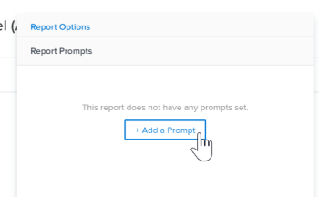

# 新增提示至報表

## 提示和篩選器之間的差異

篩選和提示的含義類似，因為它們都會限制您在報表中顯示的資訊量。

當您每次執行報表時都想要依據相同的條件來篩選報表中顯示的資訊，您便會建立篩選。 篩選器只需建立一次，並會在報表中加上硬式編碼。 如需建立篩選器的詳細資訊，請參閱文章 [Adobe Workfront中的篩選器概觀](../../../reports-and-dashboards/reports/reporting-elements/filters-overview.md).

提示是開啟篩選器，每次執行報表時，這些篩選器可以以不同方式自訂和套用。

在將提示添加到報表時，您可以通過每次運行報表時編輯提示標準來自定義篩選資訊。 報表每次都會根據您選擇的修飾元使用不同的篩選器執行，而非在報表的篩選器中硬式編碼修飾元一次。

提示作為可自訂的報表篩選器，可在您執行報表之前立即更新。 您可以建立一般報表，然後根據您想要查看的當天資訊或與您所檢視一組個別條件相關的資訊，縮小結果範圍。 例如，如果您有「小時」報表，且想根據下列條件變更報表的資訊：

* 記錄小時的日期
* 進入小時的用戶
* 輸入的小時數

您會建立三個提示，其中條件是所需的條件，而每次執行報表時，報表的外觀會有所不同，根據您為提示選擇的資訊。

篩選器可讓Adobe Workfront只顯示今年6月到8月之間輸入的時數。 但是，在出現提示時，您每次執行報表時（例如1月到2月或10月到12月），都可以使用不同的時間範圍。

## 存取需求

您必須具備下列存取權，才能執行本文中的步驟：

<table style="table-layout:auto"> 
 <col> 
 <col> 
 <tbody> 
  <tr> 
   <td role="rowheader">Adobe Workfront計畫*</td> 
   <td> <p>任何</p> </td> 
  </tr> 
  <tr> 
   <td role="rowheader">Adobe Workfront授權*</td> 
   <td> <p>計劃 </p> </td> 
  </tr> 
  <tr> 
   <td role="rowheader">訪問級別配置*</td> 
   <td> <p>編輯對報表、控制面板、日曆的存取</p> <p>編輯對篩選器、檢視、群組的存取</p> <p>注意：如果您仍無權存取，請洽詢您的Workfront管理員，他們是否在您的存取層級設定其他限制。 如需Workfront管理員如何修改您的存取層級的詳細資訊，請參閱 <a href="../../../administration-and-setup/add-users/configure-and-grant-access/create-modify-access-levels.md" class="MCXref xref">建立或修改自訂存取層級</a>.</p> </td> 
  </tr> 
  <tr> 
   <td role="rowheader">物件權限</td> 
   <td> <p>管理報表權限</p> <p>有關請求其他訪問的資訊，請參閱 <a href="../../../workfront-basics/grant-and-request-access-to-objects/request-access.md" class="MCXref xref">請求對對象的訪問 </a>.</p> </td> 
  </tr> 
 </tbody> 
</table>

&#42;若要了解您擁有的計畫、授權類型或存取權，請聯絡您的Workfront管理員。

## 必要條件

您必須先建立報表，才可新增提示。

如需建立報表的指示，請參閱 [建立報表](../../../reports-and-dashboards/reports/creating-and-managing-reports/create-report.md)

## 建立提示

1. 前往要新增提示的報表。
1. 展開 **報表動作**，然後按一下 **編輯**.

1. 按一下 **報表設定**.
1. 在 **報表提示** 按一下 **新增提示**.\
   

1. （條件性）選取您要根據提示的欄位。 開始鍵入欄位名稱，然後按一下以在欄位出現在清單中時將其選中。\
   執行報表的使用者可用的選項會因您選取的欄位而異。\
   例如，如果在任務報表上選擇了「實際完成日期」等日期欄位，則「實際完成日期」是提示的名稱。 在運行此報表時編輯此提示時，可以從一組修改符中選擇以生成篩選語句。 此程式與建立篩選器相同。 如需修飾元的詳細資訊，請參閱 [篩選條件修飾元](../../../reports-and-dashboards/reports/reporting-elements/filter-condition-modifiers.md).

1. （有條件）按一下 **自訂提示** 以建立自訂提示。

   自訂提示是預先定義的提示，您在執行報表之前會先對篩選准則進行硬式編碼。 從這個意義上講，自訂提示比提示更接近篩選。

   不過，提示仍與一般提示一樣彈性，因為您可以從數個預先定義的陳述式中選擇，而報表中只有一個硬式編碼篩選器。

   指定自訂提示的下列資訊：自訂提示的條件只能使用文字模式編輯。 這可在單一欄位中套用多個條件。

   * **欄位名稱：** 這是提示的名稱，如您在執行報表前所見。
   * **標籤：** 這是提示內其中一個選項的名稱，如您在執行報表前所見。
   * **條件：** 輸入定義提示的條件。

   使用輸入文本模式篩選器時所使用的語法，並通過「&amp;」連接語句。 如需在文字模式中編輯篩選器的詳細資訊，請參閱 [使用文字模式編輯篩選器](../../../reports-and-dashboards/reports/text-mode/edit-text-mode-in-filter.md).

   例如， **條件** 下列情況的自訂提示欄位可能如下所示：

   * 項目狀態為「構想」、「已請求」、「已計畫」和「當前」的未來項目的所有任務：

      ```
      project:plannedStartDate=$$TODAY&project:plannedStartDate_Mod=gte&project:status=IDA,REQ,PLN,CUR&project:status_Mod=in
      ```

   * 項目狀態為「已完成」或「已結束」的已完成（過去）項目中的所有任務：

      ```
      project:actualCompletionDate=$$TODAY&project:actualCompletionDate_Mod=lte&project:status=CPL,DED&project:status_Mod=in
      ```
   有關文本模式修飾符的詳細資訊，請參閱 [篩選條件修飾元](../../../reports-and-dashboards/reports/reporting-elements/filter-condition-modifiers.md).

   >[!NOTE]
   >
   >您無法像執行標準提示一樣，在執行報表時變更自訂提示的條件。 您可以視需要為自訂提示提供任意數量的預先定義條件。

1. （可選）重複步驟4或步驟5，視需要建立任何提示。
1. 按一下 **完成**，然後按一下 **儲存並關閉** 以儲存報表。

## 將提示套用至報表

將提示添加到報表時，報表的預設頁簽始終是提示頁簽。

若要執行含有提示的報表：

1. 前往顯示提示的報表。

   

1. 為顯示在 **提示** 標籤。\
   （可選）您可以將提示留空，而不能依提示條件篩選報表。

1. 按一下&#x200B;**「執行報表」**。\
   （條件性）如果填入提示，則會根據您為提示選擇的條件篩選報表。\
   （條件性）如果將提示留空，則不會依提示條件篩選報表。 報表會顯示為未篩選。

   >[!NOTE]
   >
   >除了提示之外，還包含篩選的報表會根據篩選中定義的條件和結合的提示來篩選結果。

## 共用提示報表的限制

>[!CAUTION]
>
>當您在Workfront以外共用提示報表時，檢視報表的使用者必須登入Workfront，才能使用提示執行報表。 如果檢視報表的使用者未登入，則會顯示報表的所有結果，而不會套用提示。

共用來自Workfront的提示報表時，有下列限制：

* 當您公開共用報表時，使用者無法透過套用提示來執行報表，除非他們有Workfront憑證，並先登入以在Workfront中檢視報表。

   如需共用報表的詳細資訊，請參閱文章 [在Adobe Workfront中共用報表](../../../reports-and-dashboards/reports/creating-and-managing-reports/share-report.md).
* 當您排程提示的報表以進行傳送時，電子郵件附件中的報表會包含提示的報表資料。 當使用者按一下電子郵件中的連結以存取報表時，必須先登入才能檢視報表，並自行執行提示。

   如需排程傳送報表的相關資訊，請參閱 [排程自動報表傳送](../../../reports-and-dashboards/reports/creating-and-managing-reports/set-up-automatic-report-delivery.md).
