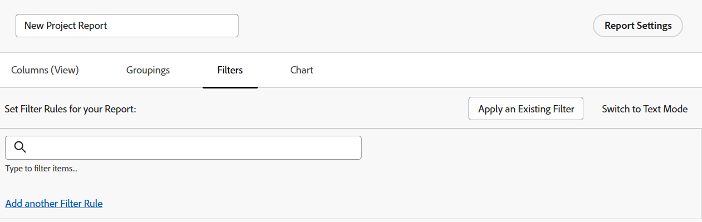

# 建立自定義報告

瞭解如何建立報告有助於您訪問您的組織在Adobe Workfront所需的資訊。 您可以使用Workfront提供的任何內置報告，也可以從頭構建您自己的報告。

有關內置報告的詳細資訊，請參見 [使用Adobe Workfront內置報告](../../../reports-and-dashboards/reports/using-built-in-reports/use-workfront-built-in-reports.md)。 有關通過複製報表建立報表的資訊，請參閱 [建立報表副本](../../../reports-and-dashboards/reports/creating-and-managing-reports/create-copy-report.md)。

## 訪問要求

您必須具有以下訪問權限才能執行本文中的步驟：

<table style="table-layout:auto"> 
 <col> 
 <col> 
 <tbody> 
  <tr> 
   <td role="rowheader">Adobe Workfront計畫</td> 
   <td> 
任何
 </td> 
  </tr> 
  <tr> 
   <td role="rowheader">Adobe Workfront許可證*</td> 
   <td> 
計劃 
 </td> 
  </tr> 
  <tr> 
   <td role="rowheader">訪問級別配置*</td> 
   <td> 
編輯對報表、儀表板、日曆的訪問
 
編輯對篩選器、視圖、分組的訪問
 
注：如果您仍然沒有訪問權限，請詢問您的Workfront管理員是否在您的訪問級別設定了其他限制。 有關Workfront管理員如何修改您的訪問級別的資訊，請參見 <a href="../../../administration-and-setup/add-users/configure-and-grant-access/create-modify-access-levels.md" class="MCXref xref">建立或修改自定義訪問級別</a>。
 </td> 
  </tr> 
  <tr> 
   <td role="rowheader">對象權限</td> 
   <td> 
您將獲得對您建立的報告的管理權限
 
有關請求附加訪問的資訊，請參見 <a href="../../../workfront-basics/grant-and-request-access-to-objects/request-access.md" class="MCXref xref">請求訪問對象 </a>。
 </td> 
  </tr> 
 </tbody> 
</table>

&#42;要瞭解您擁有的計畫、許可證類型或訪問權限，請與您的Workfront管理員聯繫。

## 建立報告 {#create-a-report}

要觀看如何建立報告的視頻，請參閱 [建立自定義報告](#Walk-thr) 下。

1. 按一下 **主菜單** 表徵圖  在右上角，按一下 **報告**。
1. 按一下 **新建報表**，然後選擇要用於報表的對象類型。

   報表生成器載入。

   有關可用對象報告的特定資訊，請參閱一節 [對象報告](../../../workfront-basics/navigate-workfront/workfront-navigation/understand-objects.md#reporting-on-objects) 在文章中 [瞭解Adobe Workfront的對象](../../../workfront-basics/navigate-workfront/workfront-navigation/understand-objects.md)。

   

   >[!TIP]
   >
   >也可以通過複製現有報告來建立報告。 有關詳細資訊，請參見 [建立報表副本](../../../reports-and-dashboards/reports/creating-and-managing-reports/create-copy-report.md)。

1. 在報表生成器中，將以下內容添加到報表：

   <table style="table-layout:auto"> 
    <col> 
    <col> 
    <thead> 
     <tr> 
      <th>功能</th> 
      <th>說明</th> 
     </tr> 
    </thead> 
    <tbody> 
     <tr> 
      <td>欄（檢視）</td> 
      <td> 
將列添加到報表將確定報表包含哪些資訊。
 
要瞭解如何添加列，請參見 <a href="#add-columns-view-to-a-report" class="MCXref xref">將列（視圖）添加到報表</a>。 
 </td> 
     </tr> 
     <tr> 
      <td>群組</td> 
      <td> 
將分組添加到報表將確定報表的組織方式。
 
要瞭解如何添加分組，請參閱 <a href="#add-groupings-to-a-report" class="MCXref xref">將分組添加到報表</a>。
 </td> 
     </tr> 
     <tr> 
      <td>篩選器</td> 
      <td> 
將篩選器規則添加到報表將確定您在報表中看到的資訊。
 
要瞭解如何添加篩選器，請參見 <a href="#add-filters-to-a-report" class="MCXref xref">將篩選器添加到報表</a>。
 </td> 
     </tr> 
     <tr> 
      <td>圖表</td> 
      <td> 
將圖表添加到報表中可確定報表中資訊的直觀顯示方式。
 
要瞭解如何添加圖表，請參閱 <a href="#add-a-chart-to-a-report" class="MCXref xref">將圖表添加到報表</a>。
 </td> 
     </tr> 
    </tbody> 
   </table>

1. 在報告建立過程中的任何時刻，按一下 **應用** 的子菜單。
1. 完成後，按一下 **保存+關閉**。

### 將列（視圖）添加到報表 {#add-columns-view-to-a-report}

1. 開始建立報告，如 [建立報告](#create-a-report) 的下界。
1. 在報表生成器中，選擇 **列（視圖）** 的子菜單。
1. （可選）按一下 **應用現有視圖** 的子菜單。

   有關建立新視圖的詳細資訊，請參閱 [Adobe Workfront視圖概述](../../../reports-and-dashboards/reports/reporting-elements/views-overview.md)。

1. 要添加新列，請按一下 **添加列**。

   或

   要更改現有列，請選擇要更改的列，然後按一下當前名稱旁邊的(x)。

1. 開始鍵入要添加的欄位。 如果欄位可用，則會為每個可關聯的對象填充該欄位。 按一下欄位名稱將其添加到列。

   有關列中顯示的欄位的詳細資訊，請參見 [Adobe Workfront術語表](../../../workfront-basics/navigate-workfront/workfront-navigation/workfront-terminology-glossary.md)。

   

1. （可選）在 **列設定** ，選擇 **按此列排序** 要按按降序字母順序升序對列中的值進行排序，請指明清單是否應將此列用作其第一次排序。

   如果要先按一列中的值排序，然後按第二列中的值排序，則可以在報表視圖中有多個排序級別。

   如果多個結果根據第一排序標準是相同的，則它們按第二排序標準的順序排序。 如果多個結果根據第一和第二排序標準是相同的，則按照第三排序等進行排序。

   >[!NOTE]
   >
   >如果添加的欄位引用的對象與要報告的對象相距過遠，則可能無法按此欄位排序。\
   >例如，問題報告不能按「項目所有者」欄位排序，因為它引用了3個附加對象：項目、所有者和名稱。 但是，您仍然可以將此欄位添加到問題報告中，並查看其資訊。

   <!--outdated: To learn more about cross-object references in reports, see the section "Advanced Reporting Part 1 of 3" in the [Reports and Dashboards Learning Path](https://one.workfront.com/s/learningpath2/workfront-reporting-MC7MZT2BOL2ZC2LMJ4MA3EMHOCNY?tabset-dc70e=2).-->

1. （可選）如果您正在使用分組，並且要匯總（聚合）列中的資訊，請按一下 **按以下方式匯總此列** 下拉清單 **列設定** ，然後選擇要用於聚合列中資訊的選項。

   聚合資訊顯示在分組行的列中。

   

   有關匯總列中資料的詳細資訊，請參見 [Adobe Workfront視圖概述](../../../reports-and-dashboards/reports/reporting-elements/views-overview.md)。

   >[!NOTE]
   >
   >在分組中聚合以下欄位的值時，父對象（例如，父任務）適用以下例外：
   >
   >* 除「實際工時」（例如，計畫/實際人工成本、計畫/實際費用成本、計畫/實際成本、計畫小時數）外，所有數字和幣種欄位僅合計子任務和獨立任務的值。 它們不會聚合父任務或父項父項的值。
   >* 實際工時匯總主父任務和獨立任務的值；它們不會聚合父任務或子任務的父任務的編號。
   >* 數字和貨幣值的自定義資料欄位聚合所有任務：父母、子代、父母的父母和獨立任務。

   有關在報告中使用分組的詳細資訊，請參見 [Adobe Workfront分組概覽](../../../reports-and-dashboards/reports/reporting-elements/groupings-overview.md)。

1. （可選）按一下 **高級選項** 指定列的以下資訊：

   <table style="table-layout:auto"> 
    <col> 
    <col> 
    <tbody> 
     <tr> 
      <td role="rowheader">自訂欄標籤</td> 
      <td> 
指定列的自定義標籤。 此標籤將替換預設標籤。
 </td> 
     </tr> 
     <tr> 
      <td role="rowheader">欄位格式</td> 
      <td> 
選擇要為列中的欄位顯示值的格式。
 </td> 
     </tr> 
     <tr> 
      <td role="rowheader">在報告面板上顯示此欄</td> 
      <td> 
選擇此選項可在報告與另一個報告並排顯示時在儀表板上顯示此列。 取消選中此選項時，在儀表板上查看報告時不顯示此列，其中報告並排顯示。
 </td> 
     </tr> 
     <tr> 
      <td role="rowheader">欄規則</td> 
      <td> 
按一下 <strong>為此列添加規則</strong> 的子菜單。 添加規則後，可以定義欄位和文本樣式，以顯示與該規則匹配的欄位。 按一下 <strong>添加規則</strong> 定義完規則後。 有關視圖中條件格式的詳細資訊，請參見 <a href="../../../reports-and-dashboards/reports/reporting-elements/use-conditional-formatting-views.md" class="MCXref xref">在視圖中使用條件格式</a>。
 </td> 
     </tr> 
    </tbody> 
   </table>

1. 按一下 **應用** 以應用迄今所做的更改，並使用以下選項繼續編輯報告。

   按一下 **保存+關閉** 編輯完報表中的列，並且要保存報表。

### 將分組添加到報表 {#add-groupings-to-a-report}

1. 開始建立報告，如 [建立報告](#create-a-report) 的下界。
1. 在報表生成器中，選擇 **分組** 頁籤，以確定要如何對報表中的項目進行分組。
1. 按一下 **添加分組** 的子菜單。

   或

   選擇 **應用現有分組** 選擇現有分組
   

1. 開始鍵入要作為分組添加的欄位。 如果欄位可用，則會為每個可關聯的對象填充該欄位。 按一下欄位的名稱將其添加到該分組。
1. （可選）通過按一下 **切換到文本模式**。 有關使用文本模式的詳細資訊，請參見 [文本模式概述](../../../reports-and-dashboards/reports/text-mode/understand-text-mode.md)。

   有關建立新分組的詳細資訊，請參閱 [Adobe Workfront分組概覽](../../../reports-and-dashboards/reports/reporting-elements/groupings-overview.md)。

1. （可選）選擇 **預設情況下折疊此分組** 的子菜單。

   預設情況下，此設定處於禁用狀態，分組結果始終顯示在展開清單中。

   >[!TIP]
   >
   >* 當您在查看清單時手動調整分組時，Workfront會記住您的手動首選項，直到您註銷。 當您重新登錄時，會根據此設定顯示清單。
   >* 從圖表元素訪問分組結果後，始終顯示已展開的分組結果。

1. （可選）您可以選擇構建矩陣分組，以網格格式顯示結果。

   有關生成矩陣報表的詳細資訊，請參見 [建立矩陣報表](../../../reports-and-dashboards/reports/creating-and-managing-reports/create-matrix-report.md)。

1. 按一下 **應用** 以應用迄今所做的更改，並使用以下選項繼續編輯報告。

   按一下 **保存+關閉** 完成對報表中的分組的編輯並保存報表。

### 將篩選器添加到報表 {#add-filters-to-a-report}

1. 開始建立報告，如 [建立報告](#create-a-report) 的下界。
1. 在報表生成器中，選擇 **篩選器** 頁籤，以標識您希望報表包含的資訊量。
1. 按一下 **添加篩選器規則** 的子菜單。\
   或\
   選擇 **應用現有篩選器** 的子菜單。

   

1. 如果你按一下 **添加篩選器規則**，開始鍵入要作為篩選器添加的欄位。 如果欄位可用，則會為每個可關聯的對象填充該欄位。 按一下欄位的名稱將其添加到該篩選器。\
   使用篩選器修飾符來構建篩選器。 有關篩選器修飾符的詳細資訊，請參閱 [篩選器和條件修飾符](../../../reports-and-dashboards/reports/reporting-elements/filter-condition-modifiers.md)。

   有關建立新篩選器的詳細資訊，請參見 [篩選器概述Adobe Workfront](../../../reports-and-dashboards/reports/reporting-elements/filters-overview.md)。

1. （可選）通過按一下 **切換到文本模式**。

   有關使用文本模式的詳細資訊，請參見 [文本模式概述](../../../reports-and-dashboards/reports/text-mode/understand-text-mode.md)。

1. 按一下 **應用** 編輯完報表中的篩選器以應用迄今所做的更改，並使用以下選項繼續編輯報表。

   按一下 **保存+關閉** 的子菜單。

### 將圖表添加到報表 {#add-a-chart-to-a-report}

1. 開始建立報告，如 [建立報告](#create-a-report) 的下界。
1. 在報表生成器中，選擇 **圖表** ，然後選擇要添加的圖表類型。

   

   有關在報表中生成圖表的詳細資訊，請參見 [將圖表添加到報表](../../../reports-and-dashboards/reports/creating-and-managing-reports/add-chart-report.md)。

1. 按一下 **應用** 以應用迄今所做的更改，並使用以下選項繼續編輯報告。

   按一下 **保存+關閉** 的子菜單。
