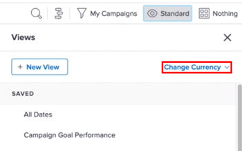

# 使用獨特的匯率建立財務資料報告

如果已在Adobe Workfront中設定多個匯率，您可以在報表和清單中設定財務值，以預設貨幣以外的貨幣顯示。

>[!IMPORTANT]
>
>如果您在「檢視」中選取預設貨幣以外的貨幣，就不會再看到連結 **添加更多任務** 和 **新增更多問題** 在專案清單的底部。

有關如何更改給定項目的預設貨幣的資訊，請參閱 [更改項目幣種](../../../manage-work/projects/project-finances/change-project-currency.md).

如果報表中有單一貨幣的專案，分組中的總和也會以系統預設貨幣顯示。

## 存取需求

您必須具備下列存取權，才能執行本文中的步驟：

<table style="table-layout:auto"> 
 <col> 
 <col> 
 <tbody> 
  <tr> 
   <td role="rowheader">Adobe Workfront計畫*</td> 
   <td> 
任何
 </td> 
  </tr> 
  <tr> 
   <td role="rowheader">Adobe Workfront授權*</td> 
   <td> 
計劃 
 </td> 
  </tr> 
  <tr> 
   <td role="rowheader">訪問級別配置*</td> 
   <td> 
編輯對報表、控制面板、日曆的存取
 
編輯對篩選器、檢視、群組的存取
 
注意：如果您仍無權存取，請洽詢您的Workfront管理員，他們是否在您的存取層級設定其他限制。 如需Workfront管理員如何修改您的存取層級的詳細資訊，請參閱 <a href="../../../administration-and-setup/add-users/configure-and-grant-access/create-modify-access-levels.md" class="MCXref xref">建立或修改自訂存取層級</a>.
 </td> 
  </tr> 
  <tr> 
   <td role="rowheader">物件權限</td> 
   <td> 
管理報表權限
 
有關請求其他訪問的資訊，請參閱 <a href="../../../workfront-basics/grant-and-request-access-to-objects/request-access.md" class="MCXref xref">請求對對象的訪問 </a>.
 </td> 
  </tr> 
 </tbody> 
</table>

&#42;若要了解您擁有的計畫、授權類型或存取權，請聯絡您的Workfront管理員。

## 必要條件

您必須先在Workfront的「設定」區域中啟用並設定多種貨幣，才能檢視本節所述的替代貨幣。 如需詳細資訊，請參閱 [設定匯率](../../../administration-and-setup/manage-workfront/exchange-rates/set-up-exchange-rates.md).

## 將財務值應用於報表 {#apply-financial-values-to-a-report}

使用報表時，要在幣種之間轉換財務值：

1. 轉到要將財務值轉換為其他幣種的報表。
1. 按一下 **檢視** 下拉式清單，按一下 **變更貨幣**，然後選取以下其中一種貨幣，以在中顯示財務值：

   * 項目的原始貨幣
   * 任何其他貨幣

      >[!TIP]
      >
      >您只能選擇先前在「設定」中選取的貨幣。
   使用此選項，可讓您在比率值之間快速轉換報表中的財務值。

   

   <!--
   
(NOTE: drafted this tip because I think this is confusing; this is in the step above.)

   -->

   <!--
   <note type="tip">
   You can also select the Change Currency option to convert financial values in other lists.
    
   
    
    
   </note>
   -->

## 以不同貨幣顯示多個專案的預設貨幣

當您在專案層級自訂貨幣，並想要顯示相同報表中所有專案的資訊時，會出現下列情況：

* 如果您建立的報表從套用不同貨幣的兩個或多個項目中帶來財務資訊，預設情況下，分組摘要會反映Workfront管理員選擇的系統預設貨幣。
* 如果您為兩個或兩個以上具有相同貨幣的項目建立報表，但這些項目與系統預設貨幣不同，則分組中的總和將使用系統預設貨幣顯示。
* 如果您為具有與幣種改寫關聯的職務職責分配的兩個或多個項目建立報表，則Workfront會將財務資訊從職務職責的改寫幣種匯率轉換為項目幣種（在視圖中選擇項目的原始幣種時），或轉換為查看報表時選擇的任何不同幣種。 有關改寫職務角色幣種的資訊，請參閱 [建立和管理作業角色](../../../administration-and-setup/set-up-workfront/organizational-setup/create-manage-job-roles.md).

若要在報表中顯示兩個具有自訂貨幣的專案：

1. 建立套用不同貨幣的兩個專案。

   

1. 在兩個專案上記錄小時。

   如需記錄時間的詳細資訊，請參閱 [記錄時間](../../../timesheets/create-and-manage-timesheets/log-time.md).

1. 按一下 **主菜單** 圖示 ，然後按一下 **報表**.
1. 按一下 **新增報表**，然後 **專案報表**.
1. 在 **欄（檢視）** 標籤，新增 **實際成本** 欄及摘要 **總和**.

   有關如何建立列的資訊，請參閱 [Adobe Workfront中的檢視概觀](../../../reports-and-dashboards/reports/reporting-elements/views-overview.md).

1. 在 **分組** 標籤 **計畫完成日期** 分組。

   有關如何建立分組的資訊，請參閱 [Adobe Workfront中的群組概觀](../../../reports-and-dashboards/reports/reporting-elements/groupings-overview.md).

1. 在 **篩選器** 索引標籤，為 **專案名稱** 並選取使用不同貨幣的兩個專案。

   如需如何建立篩選器的詳細資訊，請參閱 [Adobe Workfront中的篩選器概觀](../../../reports-and-dashboards/reports/reporting-elements/filters-overview.md).

1. 按一下 **儲存+關閉**.

   總計 **實際成本** 會使用系統預設貨幣在分組中顯示，而不考慮報表中的項目貨幣。

   

   如果兩個項目之間有不同的幣種，則系統預設幣種也會顯示在報告的分組中。

## 在專案層級顯示報表中的專案貨幣

如果對項目中的任務或小時清單應用分組，則分組中的總和將以項目幣種顯示。

1. 使用與系統預設貨幣不同的自訂貨幣建立專案。
1. 前往專案，確認其中包含已記錄工作的小時數。

   如需記錄時間的詳細資訊，請參閱 [記錄時間](../../../timesheets/create-and-manage-timesheets/log-time.md).

   >[!NOTE]
   >
   >應將任務分配給具有每小時費率的用戶或任務角色。

1. 按一下 **工作**.
1. 展開 **檢視** 下拉式功能表，然後選取 **新建視圖**.
1. 新增 **實際成本** 在新的「以新欄的形式檢視」中，並匯總方式為 **總和**.
1. 按一下 **完成**，然後按一下 **保存視圖**.
1. 展開 **分組** 下拉式功能表，然後選取 **新分組**.
1. 新增 **實際完成日期** 在「以新欄位形式新分組」欄位中，按一下 **儲存分組**.

   此 **實際成本** 欄會在新的「分組」中匯總，並以專案的貨幣顯示總計。

## 編輯具有不重複貨幣的報表

在您更改報表設定以顯示項目的原始貨幣之前，報表中的財務欄位不可編輯。

要在報表中內聯編輯財務欄位：

1. 導覽至報表。

   >[!NOTE]
   >
   >如果清單的預設貨幣未顯示在任何其他區域中，您可以編輯「檢視」以顯示預設貨幣。\
   >如需如何在檢視中變更貨幣的詳細資訊，請參閱本文的一節 [將財務值應用於報表](#apply-financial-values-to-a-report).

1. 按一下 **報表動作**，然後選取 **編輯**.
1. 按一下 **報表設定**.
1. 按一下 **預設貨幣** 下拉式清單，然後選取 **項目的原始貨幣**.

   

1. 按一下 **完成**.
