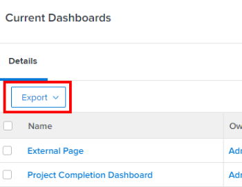
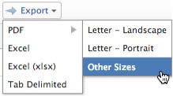

# 匯出資料

<!-- Audited: 12/2023 -->

您可以從各種清單、報表、控制面板和搜尋匯出Adobe Workfront資料。

匯出資料的部分原因包括：

* 您想要將資料的硬複製提供給Workfront以外的人員。
* 您要將報告結果作為附件傳送給外部使用者。
* 您要建立Workfront資料的外部備份。
* Workfront網路應用程式中，有一個頁面只能顯示2,000個結果的限制。 如果您的報告產生超過2,000個，您可以將報告匯出為任何可用格式，並在一個清單中檢視報告中的所有結果。

您可以從Workfront介面手動匯出報表，也可以排程報表的傳送，以便稍後將該報表傳送給您。 如需排程傳送報表的詳細資訊，請參閱[報表傳送概述](../../../reports-and-dashboards/reports/creating-and-managing-reports/set-up-report-deliveries.md)。

本文資訊不適用於下列匯出：

* 從圖表報表匯出資訊。

  如需有關匯出圖表報表的詳細資訊，請參閱[將圖表新增至報表](../../../reports-and-dashboards/reports/creating-and-managing-reports/add-chart-report.md)。

* 從甘特圖匯出資訊。

  如需有關匯出甘特圖的詳細資訊，請參閱[將甘特圖匯出至PDF](../../../manage-work/gantt-chart/use-the-gantt-chart/export-gantt-chart-to-pdf.md)。

* 從資源規劃工具匯出資訊。

  如需有關從資源規劃工具匯出資訊的詳細資訊，請參閱[資源規劃工具導覽概觀](../../../resource-mgmt/resource-planning/resource-planner-navigation.md)中的「匯出選項」。

## 存取需求

+++ 展開以檢視本文中功能的存取需求。

您必須具有下列存取權才能執行本文中的步驟：

<table style="table-layout:auto"> 
 <col> 
 </col> 
 <col> 
 </col> 
 <tbody> 
  <tr> 
   <td role="rowheader">Adobe Workfront計畫</td> 
   <td> 
任何
 </td> 
  </tr> 
  <tr> 
   <td role="rowheader">Adobe Workfront授權</td> 
   <td>
    
新增：淺色或更高

    
或

    
目前：檢閱或以上
 </td> 
  </tr> 
  <tr> 
   <td role="rowheader">存取層級設定</td> 
   <td> 
檢視或更高許可權的報告、儀表板和行事曆以匯出報告
 
檢視您檢視清單中的物件或更高存取權以匯出清單
 </td> 
  </tr> 
  <tr> 
   <td role="rowheader">物件許可權</td> 
   <td> 
檢視報表或儀表板的許可權或以上以匯出報表或儀表板
 
檢視您在清單中檢視的物件或擁有更高的許可權以匯出清單
 </td> 
  </tr> 
 </tbody> 
</table>

如需有關此表格的詳細資訊，請參閱Workfront檔案中的[存取需求](/help/quicksilver/administration-and-setup/add-users/access-levels-and-object-permissions/access-level-requirements-in-documentation.md)。

+++

## 先決條件

必須先建立報表，然後才能匯出其資料。

如需建立報告的詳細資訊，請參閱[建立自訂報告](/help/quicksilver/reports-and-dashboards/reports/creating-and-managing-reports/create-custom-report.md)或[建立報告復本](/help/quicksilver/reports-and-dashboards/reports/creating-and-managing-reports/create-copy-report.md)。

## 匯出格式和限制

### 匯出格式 {#export-formats}

資訊可以下列格式匯出：

* PDF（信函橫向或縱向、法律、分類帳及A4）
* Excel (.xls)
* Excel (.xlsx)
* 頁籤分隔檔

>[!NOTE]
>
>控制面板只能列印或匯出為.pdf檔案。

### 匯出限制 {#export-limits}

<!--
NOTE: Alina: [! This information is shared between "Exporting Data" and "Setting Up Report Deliveries."]
-->

關於報表在Workfront中的顯示方式，以及透過手動匯出、已傳送報表或透過API匯出的方式，有一些限制。

* **50,000個儲存格：**&#x200B;報表匯出Excel檔案時允許的儲存格數目上限。
* **50,000列：**&#x200B;報表匯出中允許用於.pdf和Tab分隔檔案的資料列數。

   * 若是Excel .xls檔案，此限製為&#x200B;**65,000列**。
   * 若為Excel .xlsx檔案，此限製為&#x200B;**100,000列**。
   * 這些限制會排除欄標題，以及報表中分組的列。 例如，如果報表中有6個群組，且有50,000列資料，則匯出的檔案會有50,000列。

  >[!IMPORTANT]
  >
  >匯出包含欄中集合參照的報告可能會導致錯誤，即使該報告在列出的匯出限制內也是如此。 如果參照的集合太大，匯出程式會逾時，並接著導致錯誤。
  >
  >為避免此錯誤，請在匯出之前排除參照大型集合的欄，或減小參照集合的大小。
  >

  如果報表中的專案數超過上述限制，您會收到匯出失敗錯誤。 將您在畫面上看到的專案數減少到小於或等於這些限制的數字，以便能夠匯出結果。

  如果報表中有超過50,000/65,000/100,000列，而且您想要匯出所有資料，我們建議您使用篩選器或提示來取得較小的資料負載，並執行多次匯出。

  如需使用篩選的詳細資訊，請參閱[篩選總覽](../../../reports-and-dashboards/reports/reporting-elements/filters-overview.md)。

  如需有關使用提示的資訊，請參閱[新增提示至報表](../../../reports-and-dashboards/reports/creating-and-managing-reports/add-prompt-report.md)。

* 這些限制適用於：

   * 手動匯出報告。
   * 排程報告。
   * 透過API整合的匯出。
   * 透過Kick-Start匯出的資料。

     如需透過Kick-Starts匯出資料的詳細資訊，請參閱[透過Kick-Starts從Adobe Workfront匯出資料](../../../administration-and-setup/manage-workfront/using-kick-starts/export-data-from-wf-via-kick-starts.md)。

     >[!NOTE]
     >
     >您可在快速啟動檔案中匯出50,000列，但您只能將資料匯出為Excel格式檔案。

   * 匯出專案的利用資訊。

     如需有關匯出專案使用率資訊的詳細資訊，請參閱[資源使用率報告概述](../../../reports-and-dashboards/reports/using-built-in-reports/resource-utilization-report.md#exporting-utilization-information-for-a-project)。

* **10MB檔案大小：**&#x200B;任何排定傳送之匯出報告的檔案大小限制。 如果附加至電子郵件的匯出檔案大於5MB，則會以電子郵件傳送可下載該檔案的連結，而非附加的匯出報告。
* **65,530個超連結：**&#x200B;這是Excel對包含超過65,530個超連結的檔案所強加的限制。 以手動方式匯出或以傳送的報表傳送檔案時，無法開啟這些檔案。 請注意，一個Excel檔案可能只有200列資料，但如果檔案中有超過65,530個連結，則檔案不會開啟。 此限制僅存在於Excel檔案中，不存在於其他支援的格式中。 
* **256欄**：這是Excel對包含超過256欄的檔案所施加的限制。 這些檔案無法手動匯出，或以傳送的報告傳送。 此限制僅存在於Excel檔案中，不存在於其他支援的格式中。

如果您嘗試匯出超過限制的資料，您可能無法收到匯出中預期的所有資料。 而是會在限制內產生修改後的報表。

此外，需要超過60分鐘才能執行的報表將會暫停。

如果您對限額有任何顧慮或問題，請聯絡Workfront技術支援。

## 匯出資料

### 從報表或清單匯出資料 {#export-data-from-a-report-or-list}

1. 前往您要匯出的報告或清單。
1. 選取要匯出的專案。 （選取個別專案只會匯出您選取的專案。）

   例如，在專案中，選取要匯出的任務。

   或

   保留取消選取所有專案以匯出整個清單。

1. 按一下&#x200B;**匯出**，然後選取格式。

   <!--
   This note doesn't seem to be true (I tested with e reviewer and they could export the dashboard and its reports), and there's another article all about exporting dashboards. Lisa 12/23
   >[!NOTE]
   >
   >To export a Dashboard report, you must have a Plan license.  
   >
   -->

   或

   按一下&#x200B;**匯出**&#x200B;圖示，然後選取格式。

   您可用於PDF匯出的選項取決於Workfront使用者設定中的地區設定：

   * 北美洲 — 信件（預設）、法律、分類帳、A4

     <!--   
        
     -->

   * 北美以外的所有地點 — A3、A4 （預設）、信件、法律、分類帳

     <!--   
        
     -->

1. （視條件而定）視您使用的作業系統而定，您可以選擇開啟或儲存檔案。 使用關聯的應用程式開啟檔案，或將其儲存到硬碟。
1. 繼續[使用匯出的檔案](#use-the-exported-document)。

### 從儀表板匯出資料 {#export-data-from-a-dashboard}

您可以從儀表板列印資訊，也可以將其匯出為.pdf檔案。

如需從儀表板匯出資料的詳細資訊，請參閱[匯出儀表板](../../../reports-and-dashboards/dashboards/creating-and-managing-dashboards/export-dashboard.md)。

## 使用匯出的檔案 {#use-the-exported-document}

* [檔案名稱](#file-names)
* [標題](#titles)
* [時間戳記](#timestamps)
* [正在格式化](#formatting)
* [連結](#links)
* [品牌化](#branding)

### 檔案名稱 {#file-names}

無論您匯出物件清單還是報告，匯出的檔案都會有檔案名稱和標題。 您可以參照檔案名稱，在電腦上找到匯出的檔案。 報告的標題會在您與使用者共用匯出的檔案時，為使用者指出該檔案代表的意義。

#### 匯出清單的檔案名稱 {#file-names-for-exported-lists}

匯出物件清單時，物件的型別會顯示在匯出的檔案中，檔案名稱及清單標題中。

當您匯出任務或問題清單時，**檔案名稱**&#x200B;可以是下列其中一項：

* 匯出專案中的任務和問題清單時：

   * *The_project_name_Exported_Tasks*(*PDF、Excel、Excel (.xlsx)或Tab分隔格式)*
   * *The_project_name_Exported_Issues*(*PDF、Excel、Excel (.xlsx)或Tab分隔格式)*

* 當您匯出任務（子任務）中的任務和問題清單時：

   * **該_project_name_the_task_name_Exported_Tasks**(*PDF、Excel、Excel (.xlsx)或Tab分隔格式)*
   * **該_project_name_the_task_name_Exported_Issues**(*PDF、Excel、Excel (.xlsx)或Tab分隔格式)*

從專案將任何其他物件的清單匯出到PDF檔案時，匯出的檔案的檔案名稱會指示您匯出的物件型別。\
例如，檔案名稱可以是：

* *Exported_Users*，在匯出專案上的[人員]索引標籤時(*PDF、Excel、Excel (.xlsx)或Tab分隔格式)*
* *Exported_Risks*，在匯出專案上的風險清單時(*PDF、Excel、Excel (.xlsx)或Tab分隔格式)*

#### 匯出報告的檔案名稱 {#file-names-for-exported-reports}

匯出報告時，匯出的報告的檔案名稱為：

*The_report_name*(*PDF、Excel、Excel (.xlsx)或Tab分隔格式)*

### 標題 {#titles}

匯出物件清單時，只有PDF格式的檔案會有標題。 如果將清單或報表匯出為Excel、Excel (.xlsx)或Tab字元分隔格式，檔案就沒有標題。

#### 匯出清單的標題 {#titles-for-exported-lists}

當您將專案中的任務和問題清單匯出到PDF檔案時，匯出的檔案的標題是以下標題之一：

* *專案名稱 — 匯出的任務*
* *專案名稱 — 匯出的問題*

當您將任務中的任務和問題清單匯出到PDF檔案時，匯出的檔案的拼貼是以下拼貼之一：

* *專案名稱 — 任務名稱 — 匯出的任務*
* *專案名稱 — 任務名稱 — 匯出的問題*

從專案將任何其他物件的清單匯出到PDF檔案時，匯出的檔案的標題會指示您匯出的物件型別。\
例如，標題可以是：

* 匯出專案上的[人員]索引標籤時，*已匯出使用者*。
* 在匯出專案上的風險清單時，*匯出風險*。

#### 匯出報告的標題 {#titles-for-exported-reports}

匯出至PDF檔案的報表將具有標題。

如果報表匯出為Excel、Excel (.xlsx)或Tab字元分隔格式，則匯出的報表將沒有標題。 匯出的檔案標題是報表在Workfront Web應用程式中的顯示名稱。

如果報告有說明，則會包含在匯出的檔案中。

### 時間戳記 {#timestamps}

時間戳記會顯示在匯出專案之使用者前後關聯中的匯出檔案上。

時間戳記包括：

* 日期
* 時間
* 匯出專案的時區

根據您匯出的檔案型別，時間戳記會顯示在各種位置：

* **PDF：**&#x200B;時間戳記會顯示在每個頁面的頁尾和檔案名稱中。
* **Excel：**&#x200B;時間戳記會顯示在檔案名稱中。

### 格式化 {#formatting}

將專案匯出為.pdf時，任何子任務都會以縮排顯示為其父任務。 匯出的清單不會摺疊任何父系任務。

除非報表有特殊檢視，否則在傳送或排程傳送報表時，您一律會收到報表的預設標籤。

如果您的報表在Web應用程式中具有特殊格式，則在傳送「詳細資料」和「矩陣」標籤時，報表應具有特殊格式，僅適用於.pdf和Excel檔案。

>[!NOTE]
>
>如果您要匯出的資料包含共用欄，並且您匯出為Excel或Tab分隔格式，則匯出的檔案會分隔這些欄。

如需如何在報表中自訂格式的詳細資訊，請參閱[在檢視中使用條件式格式](../../../reports-and-dashboards/reports/reporting-elements/use-conditional-formatting-views.md)。

### 連結 {#links}

連結可以指向Workfront中支援連結的任何物件。 當您將Workfront中的清單匯出為.pdf時，原始檔案中任何支援的連結都會保留在匯出的檔案中。

>[!TIP]
>
>如果自訂欄位欄的行`valueformat=HTML`以文字模式顯示，而連結值未顯示在匯出的.pdf檔案中，則您必須在文字模式中輸入額外的欄位程式碼行。
>
>例如，如果您有一個名為「開啟第1季專案」的自訂欄位，其中包含連結，您可以新增下列程式碼：
>
>`link.url=customDataLabelsAsString(Open Q1 Projects)`
>`linkedname=direct`

當您匯出為Excel格式時，匯出的檔案中只會包含指向Workfront內物件的連結，而且只有當您可選取在匯出的Excel檔案中允許連結的位置（例如報表傳送）才支援這些連結。

## 品牌化 {#branding}

>[!IMPORTANT]
>
>品牌推廣僅適用於尚未加入Adobe Experience Cloud的組織。
>
>如果您的組織已上線Adobe Experience Cloud，將無法使用品牌推廣。

如果您的Workfront管理員已將自訂品牌新增至全域導覽列的Workfront執行個體，則匯出的.pdf檔案也會包含您的個人化標誌。

以任何其他格式匯出的資料無法以您的標誌進行個人化。

如需品牌化Workfront執行個體與全域導覽列的詳細資訊，請參閱[品牌化Adobe Workfront執行個體](../../../administration-and-setup/customize-workfront/brand-workfront/brand-your-workfront-instance.md)。
